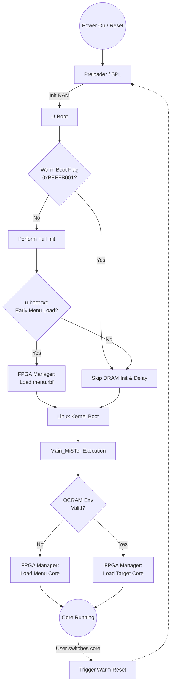
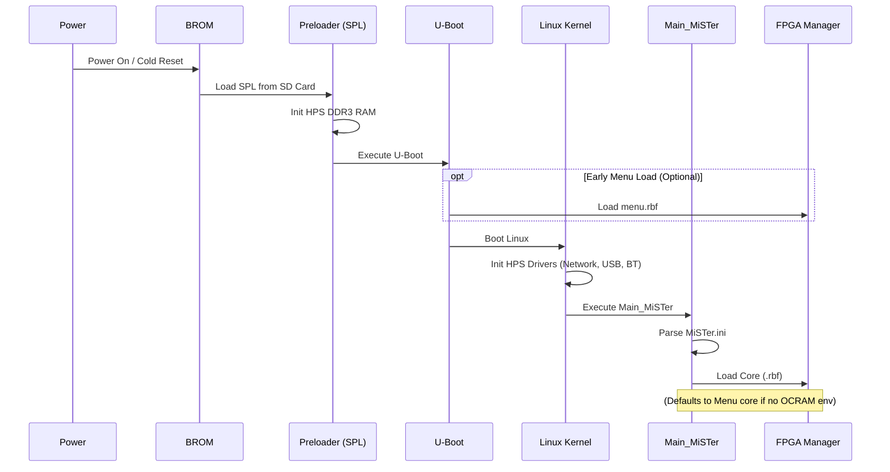
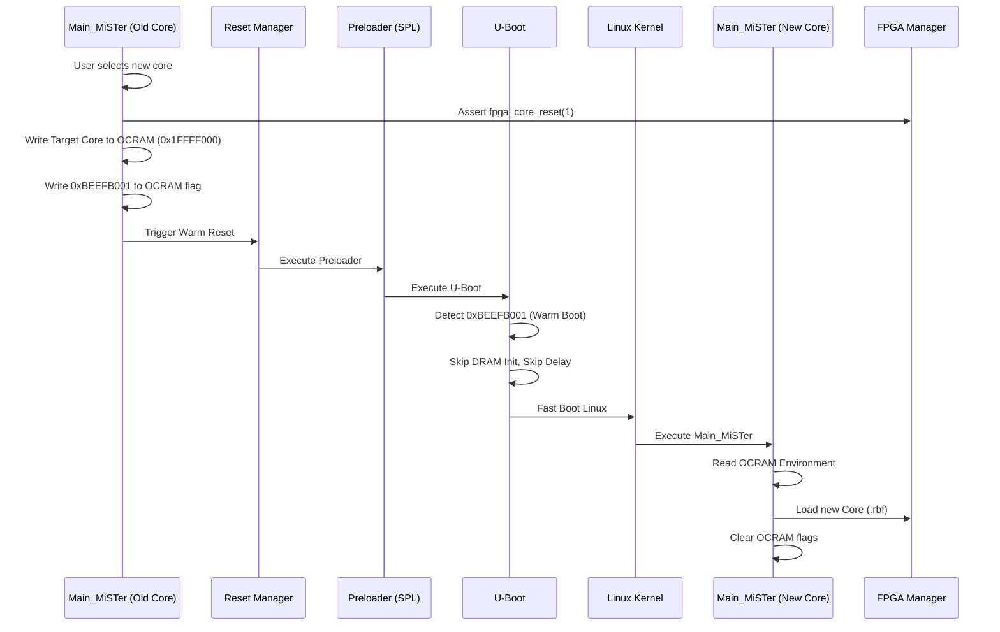

[← System Architecture](README.md) · [↑ Knowledge Base](../README.md)

# Global Boot Sequence & Core Lifecycle

This document outlines the global lifecycle of the MiSTer platform, detailing the transition from a cold power-on state, through U-Boot and Linux, into the steady-state core execution, and the mechanism for performing warm reboots to switch between FPGA cores.

Sources:
* [`Main_MiSTer/fpga_io.cpp`](https://github.com/MiSTer-devel/Main_MiSTer/blob/master/fpga_io.cpp)
* [`u-boot_MiSTer`](https://github.com/MiSTer-devel/u-boot_MiSTer)

---

## The Boot Pipeline



### Detailed Sequence



1. **Preloader (SPL):** Loaded from the SD card's hidden partition. Initializes the HPS DDR3 memory controller and minimal hardware.
2. **U-Boot:** The main bootloader. Reads the `u-boot.txt` configuration and sets up the Linux kernel environment. Optionally loads the Menu core to the FPGA early to provide immediate video output.
3. **Linux Kernel:** Mounts the root filesystem and initializes the HPS hardware drivers (network, USB, Bluetooth).
4. **Main_MiSTer:** The C++ userland binary is executed by the init system. It reads the shared OCRAM environment to determine which core to launch, or defaults to `Menu_MiSTer`.

---

## Core Lifecycle and Handoff

Before rebooting to load a new FPGA core, the currently running `Main_MiSTer` instance writes a small environment block into a preserved region of OCRAM at `0x1FFFF000`.

```c
// Main_MiSTer/fpga_io.cpp — make_env
static int make_env(const char *name, const char *cfg)
{
    volatile char* str = (volatile char*)shmem_map(0x1FFFF000, 0x1000);
    *str++ = 0x21; *str++ = 0x43; *str++ = 0x65; *str++ = 0x87; // magic
    // Write: core="corename"\n
    // Then copy CFG file content
    FileLoad(cfg, (void*)str, 0);
}
```

This OCRAM block survives a warm reset and is parsed by the newly launched `Main_MiSTer` binary on the next start to know which `.rbf` file to load.

---

## Warm vs. Cold Reboot

Switching cores relies on the Reset Manager to perform a system-wide reset. To avoid the massive latency of a full Linux cold-boot, MiSTer utilizes a "Warm Reboot" fast-path.

```c
// Main_MiSTer/fpga_io.cpp — reboot
void reboot(int cold)
{
    sync();
    fpga_core_reset(1); // Place active FPGA core in reset
    usleep(500000);

    // Write reboot flag to shared OCRAM
    volatile uint32_t* flg = (volatile uint32_t*)shmem_map(0x1FFFF000, 0x1000);
    flg[0xF08/4] = cold ? 0 : 0xBEEFB001;  // warm reboot magic
    shmem_unmap(...);

    // Trigger warm reset via Reset Manager
    writel(1, &reset_regs->ctrl);
    while(1) sleep(1);
}
```



*   **Warm Reboot (`0xBEEFB001` flag):** Instructs U-Boot to skip DRAM re-initialization and bypass the standard boot delay, immediately re-launching the Linux kernel. This reduces core-switching time to just a few seconds.
*   **Cold Reboot:** Reinitializes all HPS hardware from scratch, usually triggered when fundamental system settings are changed.

> [!NOTE]
> The exact behavior of the `0xBEEFB001` flag and the DRAM init bypass relies on custom modifications maintained in the [`u-boot_MiSTer`](https://github.com/MiSTer-devel/u-boot_MiSTer) repository. A standard upstream U-Boot will not recognize this fast-path mechanism.

---

## Platform Context: MiSTer vs Standard Linux FPGA SoCs

In a standard embedded Linux system utilizing the Cyclone V SoC (like a DE10-Nano running a stock Yocto image), the FPGA is typically programmed exactly once during the boot process—either by U-Boot before the kernel loads, or by a Linux userspace script running a single application.

MiSTer operates more like a console OS. Users switch between entirely different hardware cores (running completely different architectures, from Amiga to PlayStation) dynamically at runtime. Because reconfiguring the FPGA wipes the `sys_top.v` shell and resets the HPS-to-FPGA bridges, a simple runtime `cat core.rbf > /dev/fpga0` is dangerous—it can hang the AXI buses or crash the Linux kernel if a peripheral driver is accessing the bridge during reconfiguration.

MiSTer solves this by using the **Warm Reboot Fast-Path**. Instead of hot-swapping the FPGA while Linux is fully active, it passes the target core name via OCRAM and performs a soft reset. U-Boot catches the fast-path flag, loads the new core safely while the bridges are down, and quickly hands control back to Linux. This ensures the AXI bridges and Linux drivers are cleanly reinitialized for the new core without the 20-30 second latency of a cold boot.
