[← Section Index](README.md) · [↑ Knowledge Base](../README.md)

# MiSTer Platform Architecture

This document describes the physical and logical architecture of the MiSTer FPGA platform — how the DE10-Nano board, expansion hardware, and software stack combine to form a unified system for cycle-accurate hardware recreation. It covers the silicon internals, board interconnects, data flow pipelines, and design trade-offs that make the platform work.

---

## Table of Contents

1. [Competitive Architectural Analysis & Evolution](#1-competitive-architectural-analysis--evolution)
2. [System Block Diagram](#2-system-block-diagram)
3. [The Core Board: Terasic DE10-Nano](#3-the-core-board-terasic-de10-nano)
4. [The Expansion Stack: Add-on Boards](#4-the-expansion-stack-add-on-boards)
5. [Power Architecture](#5-power-architecture)
6. [Architectural Data Flows](#6-architectural-data-flows)
7. [Platform Comparison Matrix](#7-platform-comparison-matrix)

---

## 1. Competitive Architectural Analysis & Evolution

MiSTer's architecture did not emerge from a vacuum. It is the third generation of an unbroken lineage of open-source FPGA recreation projects, each learning from the physical limitations of its predecessor. Understanding these generations explains *why* MiSTer uses a System-on-Chip rather than a discrete FPGA, why SDRAM is a separate board, and why the software stack runs Linux instead of bare-metal firmware.

### 1.1 The Minimig Architecture (2005–2007)

Dennis van Weeren's **Minimig** (Mini Amiga) was the first project to prove that an entire home computer could be recreated in a single FPGA. The original design used an Altera Cyclone EP1C6 (later upgraded to a Cyclone III EP3C25) paired with a PIC microcontroller for SD card access.

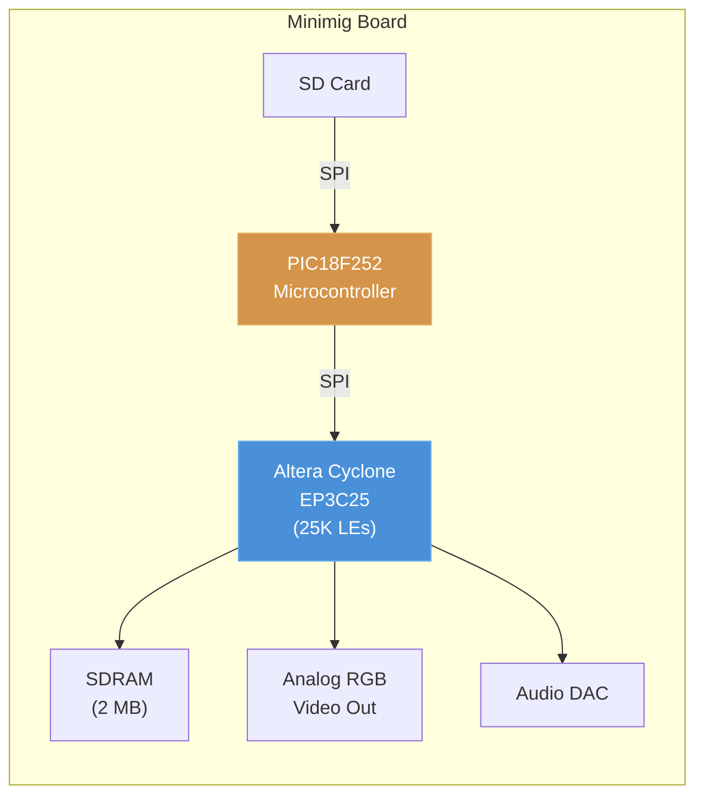

| Parameter | Value |
|---|---|
| FPGA | Altera Cyclone III EP3C25 — 25K logic elements |
| Controller | Microchip PIC18F252 (8-bit MCU, 40 MHz) |
| RAM | 2 MB SDRAM (directly wired to FPGA) |
| Bus (MCU↔FPGA) | SPI, <1 MB/s effective |
| Cores supported | Amiga 500 (OCS) only |

**Key architectural insight**: The FPGA contained *everything* — CPU (68000), custom chips (Agnus, Denise, Paula), glue logic, memory controller, and video/audio output. The PIC was a dumb file loader. This proved the concept but created an inescapable constraint: the FPGA had no room to grow, and adding support for any other system meant designing an entirely new board.

Source: [Minimig project](https://minimig.ca), Dennis van Weeren's original design files.
For the original Amiga chipset architecture, see [Amiga Bootcamp — Custom Chips](https://github.com/alfishe/amiga-bootcamp/blob/main/01_hardware/common/custom_chips_overview.md).

### 1.2 The MiST Architecture (2012–2016)

Till Harbaum's **MiST** board introduced the critical innovation that made multi-system support viable: separating the FPGA (hardware recreation) from a dedicated ARM microcontroller (I/O services). The ARM chip (Atmel SAM3U) ran firmware that handled SD card access, USB input, OSD rendering, and core loading — freeing the FPGA entirely for core logic.

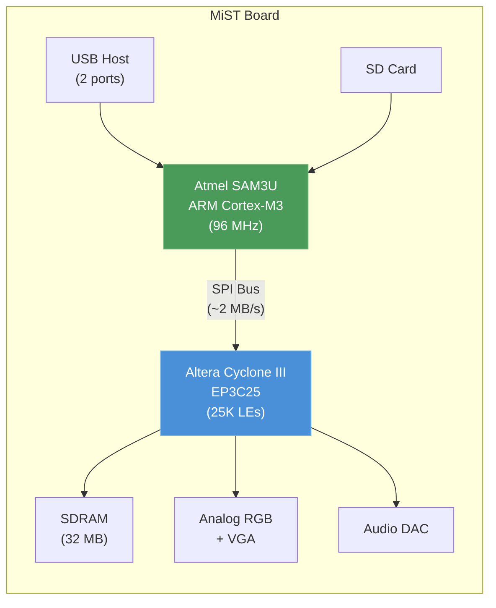

| Parameter | Value |
|---|---|
| FPGA | Altera Cyclone III EP3C25 — 25K logic elements |
| Controller | Atmel SAM3U4E — ARM Cortex-M3, 96 MHz |
| RAM | 32 MB SDRAM (FPGA-side) |
| Bus (ARM↔FPGA) | External SPI, ~2 MB/s effective throughput |
| Cores supported | ~50+ (8-bit and simple 16-bit systems) |

**Key architectural insight**: The "Core + Controller" paradigm worked — one board, many cores. But the SPI bus between the ARM and FPGA was a brutal bottleneck. Loading a 4 MB ROM took several seconds. More critically, the 25K LE FPGA was exhausted by even moderately complex 16-bit systems. The 68000 + VDP + FM synth of a Sega Genesis consumed nearly the entire device. A PlayStation or N64 was physically impossible.

Source: [MiST hardware](https://github.com/mist-devel/mist-board), Till Harbaum's design documentation

### 1.3 The Analogue Pocket Architecture (2021–Present)

Analogue's **Pocket** represents the commercial alternative: a dual-FPGA handheld where core development happens via the proprietary **openFPGA** SDK. The primary FPGA runs the emulated system; a secondary FPGA runs the AnalogueOS overlay (menus, save states, display processing) without consuming core logic resources.

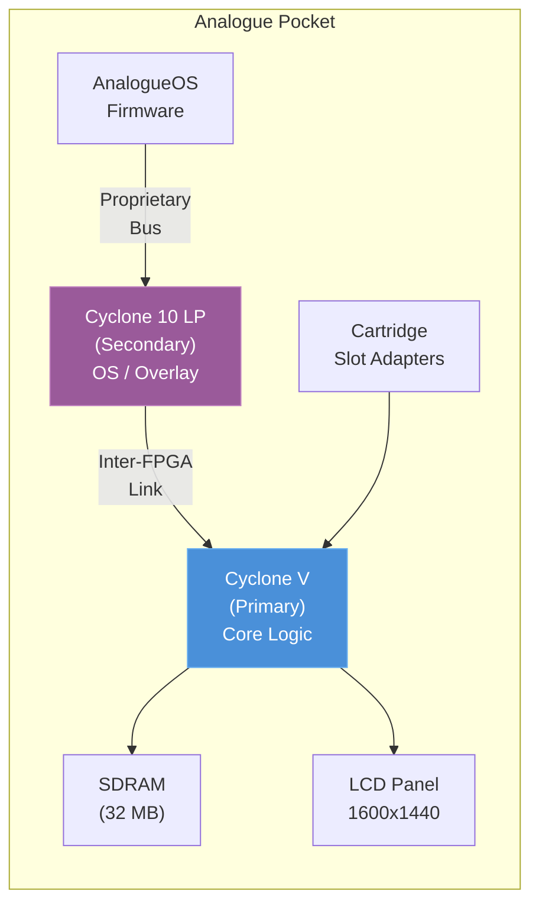

| Parameter | Value |
|---|---|
| Primary FPGA | Intel Cyclone V (5CEBA4F23C8N) — 49K logic elements |
| Secondary FPGA | Intel Cyclone 10 LP — OS overlay and display processing |
| RAM | 32 MB SDRAM (FPGA-side), no DDR3 |
| OS | Proprietary AnalogueOS (bare-metal firmware, no Linux) |
| Developer access | openFPGA SDK (proprietary, limited documentation) |

**Key architectural insight**: The dual-FPGA design elegantly solves a problem MiSTer handles differently — running an OS without stealing logic from cores. But the lack of a Linux-capable processor means no networking stack, no SSH, no community scripting, no file transfer via Samba. Developers work within Analogue's walled garden. The Pocket is a *product*; MiSTer is a *platform*.

Source: Analogue developer documentation, community reverse-engineering of openFPGA bitstream format

### 1.4 The MiSTer SoC Architecture (2017–Present)

Alexey Melnikov (Sorgelig) recognized that the next leap required a fundamentally different kind of silicon. Not an FPGA paired with a separate microcontroller, but a **System-on-Chip** that fuses both onto a single die with high-bandwidth internal interconnects.

The **Intel (Altera) Cyclone V SoC** — specifically the 5CSEBA6U23I7 on the Terasic DE10-Nano — was the breakthrough:

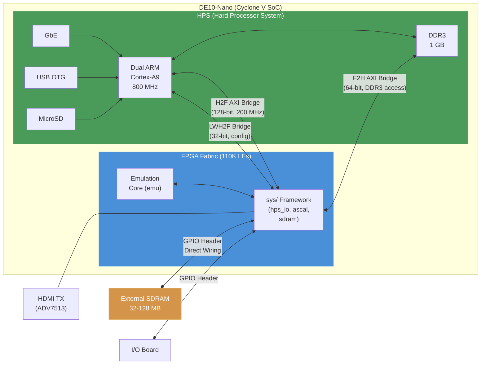

| Parameter | Value |
|---|---|
| FPGA | 110K logic elements (41K ALMs), 5.5 Mbit embedded memory |
| HPS | Dual-core ARM Cortex-A9 @ 800 MHz, running Linux 5.x |
| DDR3 | 1 GB, shared between HPS (Linux) and FPGA (via F2H AXI bridge) |
| External SDRAM | 32–128 MB, directly wired to FPGA GPIO for deterministic access |
| HPS↔FPGA bandwidth | H2F: 128-bit @ 200 MHz (theoretical ~3.2 GB/s), F2H: 64-bit @ 200 MHz |
| Cores supported | 200+ (8-bit through 32-bit, including PSX, N64, ao486) |

**Key architectural insight**: The SoC eliminated every bottleneck that plagued MiST. The ARM and FPGA communicate over die-internal AXI bridges — not an external SPI bus. The ARM runs a full Linux stack (USB drivers, TCP/IP networking, filesystems, the `Main_MiSTer` C++ binary) while the FPGA focuses exclusively on cycle-accurate hardware recreation. The 110K LE fabric is large enough for PlayStation-class systems, and DDR3 access via the F2H bridge provides the large-memory backing that CD-ROM and cartridge-based systems require.

The genius of Sorgelig's approach was recognizing that the Terasic DE10-Nano — a ~$225 educational development board — contained exactly the right SoC at exactly the right price point. No custom PCB was necessary. The entire MiSTer hardware ecosystem is built on top of a commodity dev board through standardized GPIO expansion headers.

Source: [`sys_top.v`](https://github.com/MiSTer-devel/Template_MiSTer/blob/master/sys/sys_top.v), [Intel Cyclone V HPS TRM](https://www.intel.com/content/www/us/en/docs/programmable/683126/)

---

## 2. System Block Diagram

The MiSTer platform is a modular stack of PCBs connected via GPIO headers and standardized connectors. The DE10-Nano is the only mandatory component; all other boards are optional expansions that unlock additional capabilities.

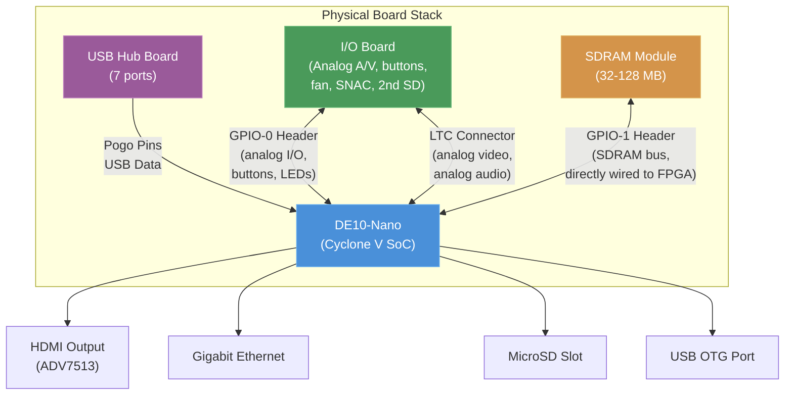

> [!NOTE]
> The board stack order matters physically: DE10-Nano at the base, SDRAM plugged into GPIO-1 on top, I/O board connected via GPIO-0 and LTC connector, USB hub board on the very top (connected to the DE10's USB OTG via pogo pins or a bridge board). Cases are designed around this specific stack geometry.

### GPIO Header Pin Allocation

The DE10-Nano exposes two 40-pin GPIO headers (GPIO-0 and GPIO-1) directly connected to FPGA fabric pins. MiSTer's `sys_top.v` assigns these pins with a specific allocation:

| Header | Primary Use | Connected Board |
|---|---|---|
| **GPIO-0** | I/O Board signals: analog video DAC, audio DAC, buttons, LEDs, SNAC, secondary SD | I/O Board |
| **GPIO-1** | SDRAM data/address/control bus (directly wired, no bus controller) | SDRAM Module |

Source: [`sys_top.v` pin assignments](https://github.com/MiSTer-devel/Template_MiSTer/blob/master/sys/sys_top.v), DE10-Nano schematic

---

## 3. The Core Board: Terasic DE10-Nano

The DE10-Nano is a commercial educational development board manufactured by Terasic. MiSTer treats it as a commodity platform — no modifications are made to the PCB itself. All customization happens through the GPIO expansion headers and the software loaded onto the MicroSD card.

### 3.1 Cyclone V SoC (5CSEBA6U23I7)

The heart of the system is Intel's Cyclone V SoC, which integrates two fundamentally different computing domains onto a single die:

**HPS (Hard Processor System)** — the "hard" side:
- Dual-core ARM Cortex-A9 @ 800 MHz (ARMv7-A architecture)
- L1 cache: 32 KB I + 32 KB D per core
- L2 cache: 512 KB shared
- Snoop Control Unit (SCU) for cache coherency
- Hard peripherals: USB 2.0 OTG, Gigabit Ethernet MAC, SD/MMC controller, SPI, I2C, UART, GPIO
- Runs a full Linux 5.x kernel with `Main_MiSTer` as the primary userspace application

**FPGA Fabric** — the "soft" side:
- 110K logic elements (41,910 ALMs — Adaptive Logic Modules)
- 5,570 Kbit embedded memory (M10K blocks)
- 224 variable-precision DSP blocks (18×18 multipliers)
- 6 fractional PLLs, 15 global clock networks
- Configurable at runtime via the FPGA Manager (part of the HPS)

### 3.2 HPS↔FPGA Bridge Architecture

The critical differentiator between the Cyclone V SoC and a discrete FPGA+MCU design is the bridge architecture. Three hardware bridges connect the HPS and FPGA domains:

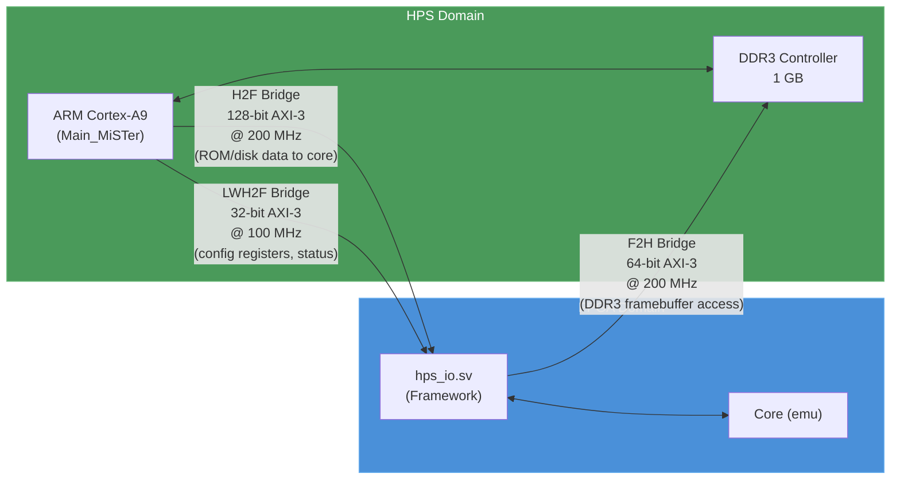

| Bridge | Width | Clock | Direction | MiSTer Use |
|---|---|---|---|---|
| **H2F** (HPS-to-FPGA) | 128-bit | 200 MHz | HPS → FPGA | ROM/disk image transfer, input state, OSD data |
| **LWH2F** (Lightweight HPS-to-FPGA) | 32-bit | 100 MHz | HPS → FPGA | Configuration registers, status polling |
| **F2H** (FPGA-to-HPS) | 64-bit | 200 MHz | FPGA → HPS | DDR3 access for video framebuffer (`ascal.vhd`), large ROM caching |

> [!IMPORTANT]
> MiSTer does **not** use the standard AXI bridge protocol for its primary HPS↔FPGA communication channel. Instead, `hps_io.sv` implements a custom **serial protocol over directly-mapped GPIO** — effectively a high-speed software SPI that the `Main_MiSTer` binary bit-bangs at ~150 MB/s using ARM NEON burst writes to the H2F bridge address space. This design choice was made to avoid the complexity of the AXI interconnect fabric and to maintain a simple, deterministic protocol that all cores implement identically.
>
> The F2H AXI bridge *is* used in the standard AXI manner — by `ascal.vhd` for DDR3 framebuffer access, and by cores that need large backing store (PSX CD-ROM images, N64 cartridge data, ao486 HDD images).

Source: [`hps_io.sv`](https://github.com/MiSTer-devel/Template_MiSTer/blob/master/sys/hps_io.sv), `Main_MiSTer/fpga_io.cpp`

### 3.3 DDR3 Memory (HPS-Side)

The DE10-Nano includes 1 GB of DDR3L SDRAM connected exclusively to the HPS memory controller. Both the ARM cores (running Linux and `Main_MiSTer`) and the FPGA fabric (via the F2H bridge) share this memory:

| Consumer | Access Method | Typical Use | Latency |
|---|---|---|---|
| Linux kernel + `Main_MiSTer` | Direct (ARM MMU) | File I/O buffers, USB descriptors, TCP/IP stack | ~10 ns |
| `ascal.vhd` (video scaler) | F2H AXI bridge | Framebuffer for scan-doubling and upscaling | ~100–200 ns |
| Core ROM cache | F2H AXI bridge | Large ROM/CD-ROM/HDD image backing store | ~100–200 ns |
| Save state engine | F2H AXI bridge | Snapshot of full core state for save/load | Burst transfer |

> [!WARNING]
> DDR3 latency via the F2H bridge is **non-deterministic** (100–200 ns depending on refresh, bank conflicts, and Linux memory pressure). This is why DDR3 cannot be used for cycle-accurate memory — retro consoles required responses within a single CPU clock (often <150 ns for a 7 MHz system). The external SDRAM board exists specifically to provide deterministic memory access.

### 3.4 On-Board Peripherals

The DE10-Nano provides several peripherals that MiSTer uses directly:

| Peripheral | Chip | MiSTer Use |
|---|---|---|
| **HDMI TX** | Analog Devices ADV7513 | Primary video output — receives scaled/processed video from `ascal.vhd` via parallel RGB + I2C control |
| **Gigabit Ethernet** | Micrel KSZ9031 PHY | Network access — SSH, Samba file transfer, WiFi dongle support (via USB), NTP time sync |
| **MicroSD slot** | HPS SD/MMC controller | Boot media — stores Linux rootfs, `Main_MiSTer` binary, core `.rbf` files, ROMs, config |
| **USB OTG** | HPS USB 2.0 controller | Single USB port — extended to 7 ports via the USB Hub board |
| **LEDs** | FPGA-connected | Core status indication (directly driven from `sys_top.v`) |
| **KEY/SW** | FPGA-connected | User buttons and DIP switches — active-low user reset, OSD toggle |

Source: [DE10-Nano User Manual](https://www.terasic.com.tw/cgi-bin/page/archive.pl?No=1046), DE10-Nano schematic Rev.C

---

## 4. The Expansion Stack: Add-on Boards

### 4.1 The SDRAM Board (FPGA-Side Memory)

The SDRAM board is the most architecturally significant expansion. It provides **deterministic-latency memory** directly connected to the FPGA fabric — the *only* memory in the system that can satisfy the timing requirements of cycle-accurate hardware recreation.

**Why DDR3 isn't enough**: Retro consoles and computers had main RAM with deterministic access times — typically one read per CPU clock cycle. A 7.16 MHz Amiga expects chip RAM to respond within ~140 ns, every time, with zero variance. DDR3 via the F2H AXI bridge has variable latency (100–200+ ns) due to refresh cycles, row/column conflicts, and contention with the Linux kernel. This jitter would cause visible glitches in any cycle-accurate core.

The SDRAM board solves this by wiring SDR SDRAM chips directly to FPGA GPIO pins. The FPGA runs its own memory controller (`sdram.sv`) with full control over timing:

| Configuration | Capacity | Chips | Supported Cores |
|---|---|---|---|
| Single module (XS v2.2) | 32 MB | 1× IS42S16320F | Most 8-bit and 16-bit cores |
| Single module (XS v3.0) | 128 MB | 2× AS4C32M16SB | All cores including PSX, N64, ao486, Neo Geo |
| Dual module (stacked) | 256 MB | 4× AS4C32M16SB | Future large-memory cores |

The `sdram.sv` controller implements:
- **Bank interleaving** — overlaps row activation in one bank with data transfer in another, hiding precharge latency
- **Refresh scheduling** — distributes refresh cycles to minimize worst-case latency spikes
- **Multi-port arbitration** — serves simultaneous requests from CPU, video, audio, and DMA without bus starvation
- **Configurable CAS latency** — typically CL2 or CL3 depending on clock frequency

> [!NOTE]
> The 128 MB module (XS v3.0) is now the community standard. It uses two 32M×16 chips providing a 32-bit data bus, which is essential for cores like the Neo Geo (wide parallel access for large sprite ROMs) and the N64 (8 MB of unified RDRAM backing). The 32 MB module is adequate for 8-bit and most 16-bit systems.

Source: [`sdram.sv`](https://github.com/MiSTer-devel/Template_MiSTer/blob/master/sys/sdram.sv), Alliance Memory AS4C32M16SB datasheet

### 4.2 The I/O Board

The I/O Board connects to both the GPIO-0 header and the LTC (Lepton Through-hole Connector) on the DE10-Nano. It provides the analog output path and physical user interface:

| Function | Implementation | Signal Path |
|---|---|---|
| **Analog video** (VGA/Component/SCART) | Resistor-ladder DAC (6-bit per channel) driven directly by FPGA | FPGA GPIO → DAC → VGA/Component/SCART connector |
| **Analog audio** | Sigma-delta DAC or I2S DAC (revision-dependent) | FPGA → DAC → 3.5mm stereo jack |
| **SNAC port** | Direct FPGA GPIO breakout via DB-9 or custom connector | FPGA GPIO ↔ OEM controller (NES, SNES, Genesis, Neo Geo, etc.) |
| **Secondary SD slot** | SPI interface to FPGA | For cores that need dedicated storage (ao486 HDD images) |
| **Fan header** | PWM-controlled from FPGA | Thermal management for enclosed cases |
| **User buttons** | GPIO to FPGA | OSD toggle, user reset |
| **LEDs** | FPGA-driven | Core status, disk activity, power |

> [!IMPORTANT]
> The analog video output from the I/O Board sends the core's **native, unscaled signal** directly from the FPGA — no frame buffer, no scaler, no post-processing. This is what makes MiSTer attractive for CRT users: a 240p core outputs true 240p at 15 kHz horizontal scan rate, exactly as the original hardware did. The HDMI path (via `ascal.vhd`) is a completely separate, parallel output.

Source: [I/O Board schematics](https://github.com/MiSTer-devel/Hardware_MiSTer), `sys_top.v` pin mapping

### 4.3 The USB Hub Board

The DE10-Nano has a single USB 2.0 OTG port. The USB Hub board extends this to 7 USB-A ports using a standard hub controller chip:

- Connects to the DE10-Nano via **pogo pins** (spring-loaded contacts) or a bridge board that reaches the USB OTG micro-B connector
- Powered by the 5V supply rail (shared with DE10-Nano, contributing to overall power budget)
- Provides standard USB 2.0 host ports for: controllers/gamepads, keyboards, WiFi/Bluetooth dongles, USB storage

The Linux kernel's standard USB HID driver stack handles device enumeration, HID report parsing, and input event generation. `Main_MiSTer` reads these events via `/dev/input/eventN` and forwards the input state to the FPGA core via `hps_io.sv`.

### 4.4 Direct Video & SNAC

Two specialized I/O methods bypass the standard signal chains:

**Direct Video** converts the HDMI port into an analog output using a cheap active HDMI-to-VGA adapter (DAC dongle). Instead of sending a scaled, high-resolution HDMI signal, `sys_top.v` can be configured to output the core's native resolution through the HDMI TX chip at the original scan rate. This provides CRT-compatible output without requiring an I/O Board.

> [!WARNING]
> Direct Video repurposes the HDMI port for analog output — you cannot use HDMI and Direct Video simultaneously. The setting is controlled by `direct_video=1` in `MiSTer.ini`.

**SNAC (Serial Native Accessory Converter)** connects original OEM controllers (NES, SNES, Genesis, Neo Geo, etc.) directly to FPGA GPIO pins on the I/O Board. The core reads controller state from the GPIO pins on the next clock edge — exactly as the original console's controller port worked. This completely bypasses the USB stack, Linux input subsystem, and `Main_MiSTer` polling loop, achieving true zero-latency input.

Each SNAC adapter is system-specific (NES adapter, Genesis adapter, etc.) because the electrical protocol differs between consoles. The FPGA core implements the original console's controller port protocol in HDL.

Source: `sys_top.v` direct video mux, SNAC adapter schematics on MiSTer Hardware repo

---

## 5. Power Architecture

The DE10-Nano accepts 5V DC via a barrel jack connector (5.5mm × 2.1mm center-positive). Power distribution:

| Consumer | Typical Draw | Notes |
|---|---|---|
| DE10-Nano (Cyclone V SoC + DDR3) | ~500–800 mA | Varies with core complexity and FPGA utilization |
| SDRAM module | ~100–200 mA | Higher with dual-chip 128 MB modules |
| I/O Board | ~50–100 mA | DAC circuits, fan (if connected) |
| USB Hub Board | ~200–500 mA | Depends on connected devices |
| **Total (full stack)** | **~1.0–1.6 A** | **Requires ≥2A 5V supply** |

> [!CAUTION]
> Insufficient power causes silent instability — not clean shutdowns. Symptoms include: SDRAM corruption (random core crashes), USB device dropouts, FPGA configuration failures after core switch. Always use a quality 5V / 3A+ power supply. The stock DE10-Nano 5V/2A supply is marginal for a full stack with multiple USB devices.
>
> Some users power the USB Hub separately via a powered USB hub to reduce the load on the DE10-Nano's barrel jack circuit.

Source: Community-measured power consumption data, DE10-Nano schematic power rail analysis

---

## 6. Architectural Data Flows

Understanding MiSTer at a systems level requires tracing how data moves through the platform during typical operation. The following diagrams illustrate the primary pipelines.

### 6.1 Boot Sequence

When the DE10-Nano powers on, control flows from hardware through the Linux OS to the MiSTer application:

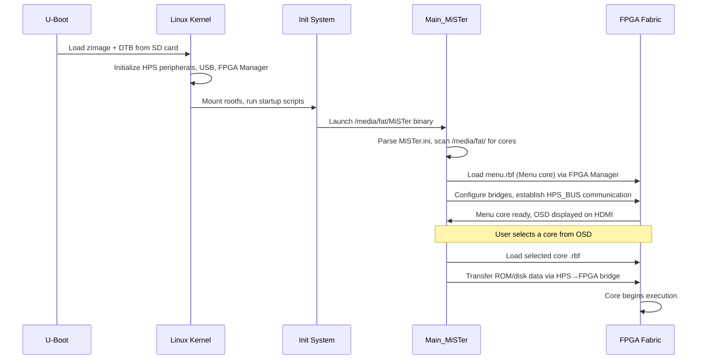

The entire boot sequence — from power-on to OSD display — takes approximately 15–20 seconds. The FPGA Manager (`/dev/fpga0`) handles bitstream loading as a standard Linux driver operation: `Main_MiSTer` writes the `.rbf` file to the FPGA Manager device node, the kernel validates the bitstream header, and the Cyclone V's internal configuration controller programs the fabric.

Source: `Main_MiSTer/fpga_io.cpp`, `u-boot_MiSTer` boot scripts, Linux FPGA Manager subsystem

### 6.2 Input Pipeline

Controller input follows two distinct paths depending on whether USB or SNAC is used:

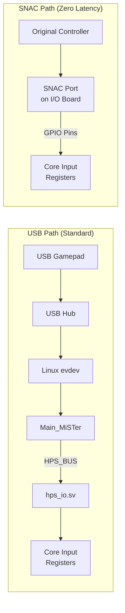

The USB path adds 1–8 ms of polling latency plus Linux processing overhead. The SNAC path connects the original controller's electrical signals directly to FPGA GPIO pins — the core reads button state on the next clock edge, exactly as the original console did.

Source: `Main_MiSTer/input.cpp`, `hps_io.sv` joystick registers

### 6.3 Video Pipeline

Video output from the core follows one of two paths: digital (HDMI) or analog (VGA/composite):

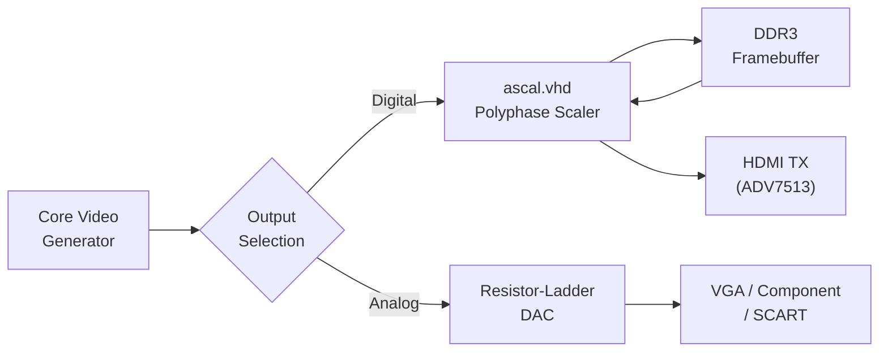

**Digital path (HDMI)**: The core generates pixel data at its native resolution and timing. `ascal.vhd` — a polyphase scaler written in VHDL — captures these pixels into a DDR3 framebuffer via the F2H bridge, then reads them back out at the display's target resolution and refresh rate. The scaler supports configurable filter coefficients (bilinear, sharp-bilinear, custom), aspect ratio correction, and integer scaling modes. The scaled output drives the ADV7513 HDMI transmitter via parallel RGB.

**Analog path (I/O Board)**: The core's native pixel stream bypasses `ascal.vhd` entirely and drives the I/O Board's resistor-ladder DAC through GPIO pins. The output is the core's raw signal — 240p/480i at 15 kHz for console cores, 480p at 31 kHz for computer cores. No framebuffer, no upscaling, no frame-rate conversion. This is the path CRT users want.

Source: [`ascal.vhd`](https://github.com/MiSTer-devel/Template_MiSTer/blob/master/sys/ascal.vhd), `sys_top.v` video mux

### 6.4 Storage & Memory Pipeline

When a core needs ROM or disk data, the request flows through the HPS:

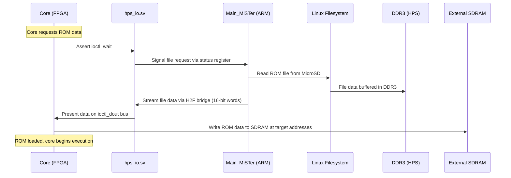

For large media (CD-ROM ISOs, HDD images), the data stays in DDR3 and the core accesses it on-demand via the F2H bridge. For latency-sensitive data (cartridge ROM, system RAM), the core copies it into external SDRAM during the initial load phase.

Source: `Main_MiSTer/file_io.cpp`, `hps_io.sv` ioctl interface

### 6.5 Audio Pipeline

Audio follows two parallel output paths — digital (HDMI) and analog (I/O Board):

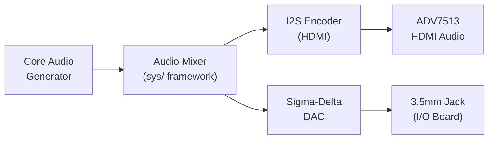

The core generates audio samples (typically 16-bit signed, 48 kHz). The `sys/` framework mixes left/right channels, applies optional filtering, and routes them to two destinations simultaneously:

1. **HDMI audio**: Encoded as I2S and embedded in the HDMI stream via the ADV7513. The TV/monitor extracts and plays it.
2. **Analog audio**: The I/O Board's sigma-delta DAC (or I2S DAC on newer revisions) converts the digital stream to analog and outputs via a 3.5mm stereo jack.

Source: `sys_top.v` audio routing, `sigma_delta_dac.vhd`

---

## 7. Platform Comparison Matrix

| Feature | MiSTer (DE10-Nano) | MiST | Analogue Pocket | MiSTeX | Software Emulation |
|---|---|---|---|---|---|
| **FPGA fabric** | 110K LE (Cyclone V) | 25K LE (Cyclone III) | 49K LE (Cyclone V) | Varies (Artix-7 typical) | N/A |
| **Processor** | Dual ARM Cortex-A9 (Linux) | ARM Cortex-M3 (bare-metal) | None (firmware only) | SBC (Raspberry Pi / similar) | Host CPU (x86/ARM) |
| **Memory architecture** | DDR3 (1 GB, shared) + SDRAM (32–128 MB, FPGA-direct) | SDRAM (32 MB) only | SDRAM (32 MB) only | Varies by board | Host RAM |
| **HPS↔FPGA bus** | Die-internal AXI (GB/s class) | External SPI (~2 MB/s) | N/A | SPI/GPIO (varies) | N/A |
| **Video output** | HDMI (scaled) + Analog (native) | Analog only | LCD (1600×1440) + HDMI dock | HDMI | Window/fullscreen |
| **Audio output** | HDMI + Analog (I/O Board) | Analog only | Built-in speaker + HDMI | HDMI | Host audio |
| **Input** | USB + SNAC (zero-latency) | USB (2 ports) | Built-in controls + dock | USB | Host input |
| **OS** | Linux 5.x (full networking, SSH, Samba) | Bare-metal firmware | Proprietary AnalogueOS | Linux (SBC) | Host OS |
| **Core count** | 200+ | ~50 | ~30 (openFPGA) | MiSTer-compatible subset | Thousands (MAME, RetroArch) |
| **Open source** | Fully open (HDL + SW + HW) | Fully open | Cores open, platform closed | Fully open | Varies |
| **Cycle accuracy** | Yes (by design) | Yes (limited by FPGA size) | Yes (limited by FPGA size) | Yes | Varies (often approximate) |
| **Price (board only)** | ~$225 | ~$200 (discontinued) | ~$220 | ~$100–140 | Free (software) |

> [!NOTE]
> **Pricing note**: Costs above are approximate as of April 2026 and will fluctuate. Always verify current pricing at vendor sites.

> **See also**: For derived projects, alternative platforms, and community tooling, see [Ecosystem & Community Tools](../15_ecosystem/README.md).
> For general Cyclone V SoC architecture, see [FPGA KB — Intel HPS-FPGA Integration](https://github.com/alfishe/fpga-bootcamp/blob/main/02_architecture/soc/hps_fpga_intel_soc.md).
