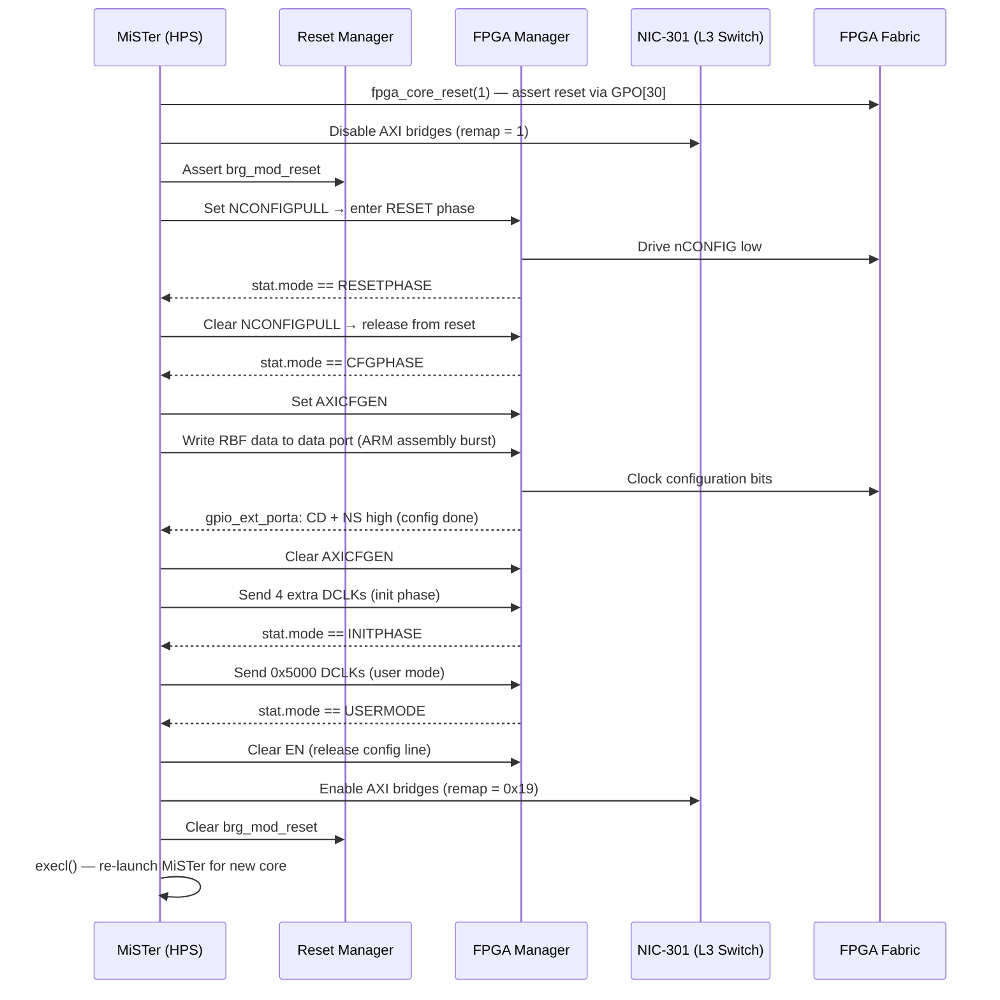

[← Framework Index](README.md) · [↑ Knowledge Base](../README.md)

# FPGA Bitstream Loading

Loading a new core into the FPGA fabric requires:
1. Placing the CPU into core reset.
2. Tearing down the HPS↔FPGA AXI bridges.
3. Writing the RBF (Raw Binary File) bitstream into the FPGA Manager data port.
4. Waiting for configuration to complete.
5. Re-enabling the bridges.
6. Re-launching the MiSTer binary for the new core.

Source: [`fpga_io.cpp`](https://github.com/MiSTer-devel/Main_MiSTer/blob/master/fpga_io.cpp)

> [!NOTE]
> For the physical register addresses involved, see [Memory Map](../01_hardware_platform/memory_map.md).
> For the SPI protocol used for ongoing communication after loading, see
> [SPI-over-GPO Protocol](spi_protocol.md).

---

## FPGA Manager Hardware

The Intel Cyclone V FPGA Manager peripheral at `0xFF706000` controls the
configuration state machine:

```
FPGA Manager Registers (all at 0xFF706xxx):
  0x000  stat      — FPGA status (mode bits, MSEL)
  0x004  ctrl      — control register
  0x008  dclkcnt   — DCLK count register
  0x00C  dclkstat  — DCLK status
  0x014  gpio_ext_porta — GPIO input (Init_Done, Config_Done signals)
  0x018  gpio_porta_eoi — clear GPIO interrupts
  0x010  (GPO)     — General Purpose Output (also used for SSPI)
  0x014  (GPI)     — General Purpose Input
```

Physical address mapping: `SOCFPGA_FPGAMGRREGS_ADDRESS = 0xFF706000`
Configuration data port: `SOCFPGA_FPGAMGRDATA_ADDRESS  = 0xFFB90000`

---

## RBF Loading Sequence



---

## Code: `socfpga_load()`

```c
// fpga_io.cpp
static int socfpga_load(const void *rbf_data, size_t rbf_size)
{
    // 1. Initialize FPGA Manager
    status = fpgamgr_program_init();
    // Sets MSEL-based CD ratio, enables config, asserts nCONFIG, waits for
    // RESETPHASE, releases nCONFIG, waits for CFGPHASE, enables AXI config

    // 2. Write bitstream via burst ARM assembly
    fpgamgr_program_write(rbf_data, rbf_size);
    // Uses ldmia/stmia in 32-byte blocks to data port address

    // 3. Wait for config done
    fpgamgr_program_poll_cd();
    // Polls gpio_ext_porta for CD (Config Done) + NS (nStatus) flags

    // 4. Init phase transition
    fpgamgr_program_poll_initphase();
    // Sends 4 DCLKs via dclkcnt register

    // 5. User mode transition
    fpgamgr_program_poll_usermode();
    // Sends 0x5000 DCLKs, waits for USERMODE

    return 0;
}
```

## Code: AXI Bridge Control (`do_bridge`)

```c
// fpga_io.cpp
static void do_bridge(uint32_t enable)
{
    if (enable) {
        // Re-enable DDR3 port to FPGA
        writel(0x00003FFF, (void*)(SOCFPGA_SDR_ADDRESS + 0x5080));
        // Release bridge reset
        writel(0x00000000, &reset_regs->brg_mod_reset);
        // Remap: FPGA can see all HPS memory
        writel(0x00000019, &nic301_regs->remap);
    } else {
        // Isolate bridges before reconfiguration
        writel(0, &sysmgr_regs->fpgaintfgrp_module);
        writel(0, (void*)(SOCFPGA_SDR_ADDRESS + 0x5080));
        writel(7, &reset_regs->brg_mod_reset);
        writel(1, &nic301_regs->remap);  // HPS memory only
    }
}
```

> [!CAUTION]
> Failing to disable the AXI bridges **before** asserting nCONFIG will cause
> pending AXI transactions to hang the L3 interconnect, requiring a full power
> cycle to recover. The `do_bridge(0)` call is mandatory.

---

## Warm vs. Cold Reboot

```c
// fpga_io.cpp
void reboot(int cold)
{
    sync();
    fpga_core_reset(1);
    usleep(500000);

    // Write reboot flag to shared OCRAM
    volatile uint32_t* flg = (volatile uint32_t*)shmem_map(0x1FFFF000, 0x1000);
    flg[0xF08/4] = cold ? 0 : 0xBEEFB001;  // warm reboot magic
    shmem_unmap(...);

    // Trigger warm reset via Reset Manager
    writel(1, &reset_regs->ctrl);
    while(1) sleep(1);
}
```

A **warm reboot** (`0xBEEFB001` flag) causes U-Boot to skip DRAM init and
immediately launch Linux. A **cold reboot** reinitialises all hardware.

---

## Core Environment Handoff

Before rebooting to load a new core, MiSTer writes a small environment block
into OCRAM at `0x1FFFF000`:

```c
// fpga_io.cpp
static int make_env(const char *name, const char *cfg)
{
    volatile char* str = (volatile char*)shmem_map(0x1FFFF000, 0x1000);
    *str++ = 0x21; *str++ = 0x43; *str++ = 0x65; *str++ = 0x87; // magic
    // Write: core="corename"\n
    // Then copy CFG file content
    FileLoad(cfg, (void*)str, 0);
}
```

This OCRAM survives a warm reset and is read by the MiSTer binary on next
start to know which core to load. See [U-Boot](../10_linux_system/uboot/README.md)
for the bootloader side of this handoff.

---

## CD Ratio (MSEL)

The MSEL[3:0] pins on the DE10-Nano board determine how the FPGA Manager
clocks configuration data:

| MSEL[3] | MSEL[1:0] | Width | CD Ratio |
|---|---|---|---|
| 1 | 00 | 32-bit | ×1 |
| 1 | 01 | 32-bit | ×4 |
| 1 | 10 | 32-bit | ×8 |
| 0 | 00 | 16-bit | ×1 |
| 0 | 01 | 16-bit | ×2 |
| 0 | 10 | 16-bit | ×4 |

The DE10-Nano uses MSEL = `01010` (passive parallel, 16-bit, CD ratio ×2)
by default.

---

## Platform Context

| Platform | FPGA Configuration Method |
|---|---|
| **MiSTer** | Software-driven via FPGA Manager: Linux `/dev/mem` → data port, ARM assembly burst |
| **Analogue Pocket** | JTAG + on-board flash: cores stored in SPI flash, loaded by APF firmware |
| **MiST** | SPI flash programming via microcontroller |
| **MiSTeX** | Zynq PCAP (Processor Configuration Access Port) via Linux `fpga_manager` framework |

MiSTer's approach is unique in that it uses the FPGA Manager's raw data port
with ARM assembly burst writes rather than the Linux `fpga_manager` kernel framework.
This gives it direct control over timing and avoids kernel overhead, at the cost
of requiring root access to `/dev/mem`.
