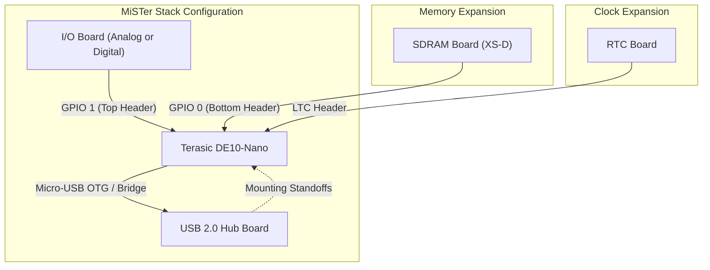

[← Hardware Platforms Index](README.md)

# MiSTer FPGA Addon Boards

While the [Terasic DE10-Nano](de10_nano.md) provides the core SoC, FPGA fabric, and HPS subsystem, the MiSTer platform relies on a standardized ecosystem of "addon boards" to interface with retro gaming peripherals, low-latency memory, and CRT displays.

This document serves as the technical reference for the physical addon ecosystem, detailing hardware specifications, connector routing, and subsystem integration.

---

## 1. Hardware Stack Topology

The MiSTer platform typically utilizes a "sandwich" hardware architecture, building vertically off the DE10-Nano's exposed expansion headers.



---

## 2. SDRAM Expansion Board

The most critical addon for the MiSTer platform is the SDR SDRAM board. While the DE10-Nano contains 1GB of onboard DDR3 RAM, DDR3 relies on high-burst, high-latency memory access patterns. Retro computer and console systems (like the Amiga, SNES, and Neo Geo) expect memory with strict, low-latency deterministic access patterns. The FPGA fabric uses the addon SDRAM to accurately replicate these historical memory buses.

### 2.1 Specifications
- **Type**: Synchronous Dynamic Random-Access Memory (SDR SDRAM)
- **Clock Speed**: Tested up to 130-160 MHz (dependent on board revision and core requirements).
- **Interface**: Connects directly to the DE10-Nano's **GPIO 0** 40-pin header.
- **Voltage**: 3.3V I/O logic.

### 2.2 Capacity Variants
- **32MB (XS v2.x)**: Sufficient for the vast majority of 8-bit and 16-bit console cores, as well as many computer cores.
- **128MB (XS-D v2.9 / v3.0)**: Required for a specific subset of cores with large memory footprints, most notably the **Neo Geo** (which loads massive ROM datasets directly into SDRAM), **Game Boy Advance**, and specific high-end arcade cores (e.g., CPS2).

### 2.3 The "Dual SDRAM" Configuration
Some cutting-edge cores (like certain arcade systems or advanced computer emulations) require memory bandwidth exceeding a single 16-bit SDRAM module. The **Dual SDRAM** configuration omits the standard I/O board entirely, placing a second SDRAM module on **GPIO 1**. 

> [!WARNING]
> Dual SDRAM configurations occupy the pins normally used by the Analog I/O board's video DAC. Users running dual SDRAM must use either HDMI output, Direct Video, or a specialized Digital I/O board.

---

## 3. I/O Boards

I/O boards attach to the DE10-Nano's **GPIO 1** 40-pin header. They provide the primary physical interface for legacy analog displays, cooling, and hardware control buttons.

### 3.1 Analog I/O Board (v6.1+)
The traditional Analog I/O board provides a comprehensive suite of legacy connections.

*   **Analog Video (VGA DB15)**: Driven by an R-2R resistor ladder DAC connected to the FPGA's I/O pins. It supports RGB (Scart), YPbPr (Component), and standard VGA (RGBHV). 
    *   *Note: This DAC provides **18-bit color** (6 bits per channel).*
*   **Analog & Digital Audio**: A dual-purpose 3.5mm jack outputs analog stereo and optical digital audio (Mini-TOSLINK).
*   **Secondary SD Card Slot**: Plumbed directly to the FPGA logic (bypassing the HPS). Required by specific cores that emulate low-level block devices (e.g., X68000).
*   **User Controls**: Three tact switches (Reset, OSD, User) and three status LEDs (Power, Disk, User).
*   **Cooling**: Integrated header and mounting points for a 5V cooling fan.

### 3.2 Digital I/O Board (v1.2+)
The Digital I/O board is a minimalist alternative designed for users relying exclusively on HDMI or Direct Video.

*   **Omitted Video DAC**: Removes the bulky DB15 VGA connector and analog R-2R DAC.
*   **Full-Size Audio**: Replaces the 3.5mm jack with a dedicated full-size TOSLINK connector.
*   **Dual SDRAM Compatibility**: Depending on the board layout, some Digital I/O boards leave GPIO 1 partially unobstructed or provide a pass-through allowing a second SDRAM board to be installed simultaneously.
*   **SNAC Port**: Some revisions include a dedicated level-shifted port for Serial Native Accessory Converter (SNAC) dongles, bypassing the need for a separate USB 3.0 style adapter block.

---

## 4. USB Hub Board

The DE10-Nano HPS provides a single Micro-USB OTG port. The USB Hub Board expands this into a 7-port USB 2.0 hub, essential for connecting keyboards, mice, Bluetooth dongles, Wi-Fi adapters, and standard USB gamepads.

### 4.1 Hardware Integration
- **Hub Controller**: Uses the standard **FE2.1** USB 2.0 Hub Controller IC.
- **Data Connection**: Originally connected via a Micro-USB U-shaped bridge piece. Modern variations may use a short custom USB cable or pogo pins for reliability.
- **Power Delivery**: The FE2.1 and connected peripherals can draw significant current. The USB Hub board requires dedicated 5V power, typically supplied via a 5.5mm x 2.1mm DC barrel jack.
- **DC Splitter**: Standard MiSTer builds utilize a power splitter cable (or an inline power switch) to feed a single 5V / 2A (or 4A) power supply to both the DE10-Nano and the USB Hub simultaneously.

---

## 5. Real-Time Clock (RTC) Board

The DE10-Nano does not maintain time when powered off unless connected to an NTP server via a network.

### 5.1 Hardware Specifications
- **Controller**: Typically utilizes the STMicroelectronics **M41T81** (or compatible) I2C Real-Time Clock IC.
- **Power**: Backed by a standard **CR1220** coin cell battery.
- **Interface**: Connects via the DE10-Nano's 14-pin **LTC (Linear Technology Corporation)** header.

### 5.2 Core Utilization
The RTC is automatically synced by the HPS Linux environment (`Main_MiSTer`) during boot. Specific cores utilize the RTC for accurate emulation of hardware clocks, notably:
- `ao486` (MS-DOS file timestamps)
- `Minimig` (Amiga Workbench clock)
- Game Boy / Game Boy Advance (Hardware RTC cartridges, e.g., Pokémon)

---

## 6. Direct Video

While not a dedicated MiSTer addon board, **Direct Video** is a critical hardware configuration alternative to the Analog I/O board. It utilizes an external, off-the-shelf **HDMI-to-VGA DAC dongle**.

### 6.1 Architectural Differences vs. I/O Board
When Direct Video is enabled, the FPGA radically reconfigures its HDMI output pins:
1.  It halts standard HDMI TMDS signaling.
2.  It outputs an unencrypted, raw digital video stream over the HDMI pins.
3.  The external HDMI-to-VGA DAC decodes this raw stream into an analog signal.

### 6.2 Technical Advantages
- **24-bit Color Depth**: Unlike the 18-bit R-2R DAC on the Analog I/O board, Direct Video utilizes standard 24-bit DACs inside the HDMI dongle, providing full 8-bits per channel (8:8:8 RGB) for cores that support it.
- **Saves GPIO Pins**: Frees up GPIO 1 for Dual SDRAM configurations while still maintaining analog video output.

### 6.3 Configuration and Caveats
Enabled via the MiSTer configuration file:
```ini
# mister.ini
direct_video=1
```

> [!CAUTION]
> **DAC Compatibility**: Not all HDMI-to-VGA adapters work correctly. Cheaper adapters utilizing the **AG6200** chipset often compress the color space (limited range RGB) resulting in crushed blacks. Recommended adapters use the **MS9282** or **Lontium LT8511** chipsets for accurate, full-range conversion.

---

## Read Also
- [DE10-Nano Reference](de10_nano.md) — The core SoC and FPGA platform
- [System Architecture](../01_system_architecture/platform_architecture.md) — How the HPS and FPGA communicate
- [Sys_Top Architecture](../06_fpga_subsystem/sys_top.md) — The top-level Verilog wrapper managing the I/O pins
