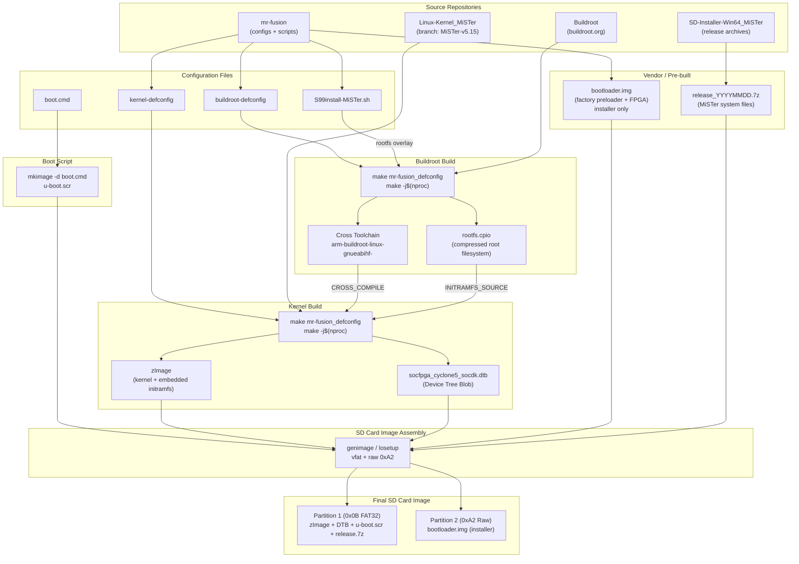
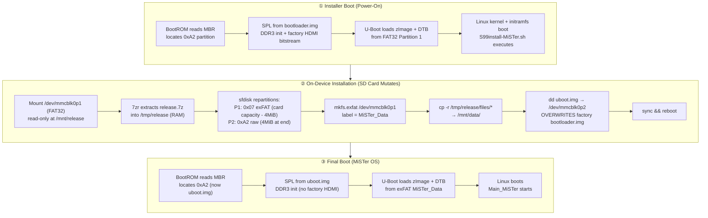

# Building a Custom Embedded Linux Distribution for the MiSTer FPGA Platform

> A comprehensive technical guide covering Buildroot cross-compilation, kernel synthesis, boot-script generation, and SD card image packaging — using the official MiSTer repositories and modern, reproducible tooling.

---

## Table of Contents

1. [Platform Architecture Overview](#1-platform-architecture-overview)
2. [Boot Sequence of the Cyclone V SoC](#2-boot-sequence-of-the-cyclone-v-soc)
3. [SD Card Partition Layout](#3-sd-card-partition-layout)
   - [Installer Image Layout (Pre-First-Boot)](#31-installer-image-layout-pre-first-boot)
   - [Final MiSTer Layout (Post-First-Boot)](#32-final-mister-layout-post-first-boot)
4. [Build Pipeline Overview](#4-build-pipeline-overview)
5. [Component Sources & Bill of Materials](#5-component-sources--bill-of-materials)
6. [Phase I — Manual Buildroot Compilation](#6-phase-i--manual-buildroot-compilation)
   - [Host Preparation](#61-host-preparation)
   - [Repository Setup](#62-repository-setup)
   - [Buildroot Configuration & Build](#63-buildroot-configuration--build)
   - [Linux Kernel Cross-Compilation](#64-linux-kernel-cross-compilation)
   - [Boot Script Generation](#65-boot-script-generation)
   - [U-Boot / Bootloader](#66-u-boot--bootloader)
7. [Phase II — SD Card Image Packaging](#7-phase-ii--sd-card-image-packaging)
   - [Obtaining the Factory Bootloader](#71-obtaining-the-factory-bootloader)
   - [Creating the Image](#72-creating-the-image)
   - [Dynamic Loopback & Populate](#73-dynamic-loopback--populate)
8. [Phase III — Docker CI/CD Pipeline](#8-phase-iii--docker-cicd-pipeline)
   - [Multi-Stage Builder Dockerfile](#81-multi-stage-builder-dockerfile)
   - [genimage Configuration](#82-genimage-configuration)
   - [Building & Running](#83-building--running)
9. [First-Boot Lifecycle & Auto-Expansion](#9-first-boot-lifecycle--auto-expansion)
10. [Verification & Troubleshooting](#10-verification--troubleshooting)
11. [References](#11-references)

---

## 1. Platform Architecture Overview

The MiSTer FPGA project uses the **Terasic DE10-Nano** development board, built around the **Intel/Altera Cyclone V SoC**. This chip is a heterogeneous architecture combining:

| Component | Description |
|-----------|-------------|
| **HPS (Hard Processor System)** | Dual-core ARM Cortex-A9 processor |
| **FPGA Fabric** | Programmable logic elements for cycle-accurate hardware simulation |
| **AXI Bridges** | High-bandwidth interconnects between HPS and FPGA |

The FPGA fabric runs the cycle-accurate hardware cores (arcade machines, consoles, computers), while the **Linux HPS** acts as the orchestration layer:

- USB device polling (keyboards, mice, gamepads)
- Network protocols (Samba/CIFS, FTP, SSH) for ROM transfer
- File system management for disk images
- FPGA bitstream loading upon core selection

Because general-purpose Linux distributions are too bloated for these deterministic, low-latency requirements, MiSTer uses a **heavily customized, minimal Linux environment** built via **Buildroot**.

---

## 2. Boot Sequence of the Cyclone V SoC

The DE10-Nano follows a deterministic, multi-stage boot pathway:

```
+------------+     +------------+     +------------+     +------------+
|   BootROM  | --> |  SPL (from | --> |   U-Boot   | --> | Linux Kern.|
| (on-chip)  |     | 0xA2 part.)|     | (DDR3 RAM) |     | + initramfs|
+------------+     +------------+     +------------+     +------------+
     |                   |                  |                   |
  Reads MSEL         Initializes DDR3   Reads FAT32 boot    Mounts rootfs,
  pins [4:0]=01010   SDRAM, PLLs,       partition: loads    runs init,
  -> seeks SD card   pin muxing         zImage + DTB        launches MiSTer
```

### Stage Details

1. **BootROM** — Hardcoded silicon ROM reads MSEL pins (`01010` = Fast Passive Parallel x32 mode) and seeks the SD card.
2. **SPL (Secondary Program Loader)** — Found in the raw `0xA2` partition. Initializes DDR3 SDRAM, configures PLLs/clocks, and loads full U-Boot into DDR3.
3. **U-Boot** — Reads FAT32 boot partition, extracts `zImage` (kernel) and `.dtb` (device tree), issues `bootz` to start Linux.
4. **Linux Kernel** — Parses the device tree, unpacks initramfs (embedded root filesystem), runs `/init`, and eventually launches `Main_MiSTer`.

---

## 3. SD Card Partition Layout

The DE10-Nano BootROM requires a legacy **Master Boot Record (MBR)** partition table. GUID Partition Tables (GPT) are **not supported**. The BootROM scans the four MBR entries for a partition with type code `0xA2`; the entry's position in the table and its physical location on disk are independent.

There are two layouts to consider:

1. **Installer Image Layout** — the small `mr-fusion.img` that is flashed to the SD card.
2. **Final MiSTer Layout** — created automatically on first boot by `S99install-MiSTer.sh`.

---

### 3.1 Installer Image Layout (Pre-First-Boot)

This is the layout produced by the build pipeline (manual or Docker). It is intentionally small (~120 MiB) so it can be written quickly and works on any card >= 2 GB.

#### MBR Partition Table

| MBR Entry | Partition # | Type Code | Type Name | Boot Flag | Start Sector | Size (Sectors) | Size (Approx) |
|-----------|-------------|-----------|-----------|-----------|--------------|----------------|---------------|
| 1 | **1** | `0x0B` | FAT32 (CHS) | No | 10240 | Remainder | ~116 MiB |
| 2 | **2** | `0xA2` | Altera Raw | No | 2048 | 8192 | ~4 MiB |
| 3 | — | `0x00` | Empty | — | — | — | — |
| 4 | — | `0x00` | Empty | — | — | — | — |

> **Type Code Note:** `0x0C` (FAT32 LBA) is functionally equivalent and may be used interchangeably with `0x0B`. The `genimage` tool emits `0x0C` by default.

#### Physical On-Disk Layout

```
Sector Range          Content
─────────────────────────────────────────────────────────
0                     Master Boot Record (MBR)
1  – 2047             Alignment gap / reserved
2048 – 10239          Partition 2  [0xA2 Raw]
                      └─ Factory preloader (bootloader.img)
10240 – end           Partition 1  [0x0B FAT32]
                      └─ zImage, DTB, u-boot.scr, release.7z, etc.
```

#### Partition Details

**Partition 1 — FAT32 Boot (`0x0B`)**
- **Filesystem:** VFAT (FAT32)
- **Label:** `MRFUSION`
- **Start:** Sector 10240 (~5 MiB offset, 1 MiB aligned)
- **Size:** Remainder of the ~120 MiB image
- **Contents:**
  - `zImage` (kernel + initramfs)
  - `socfpga_cyclone5_socdk.dtb` (device tree)
  - `u-boot.scr` (boot script)
  - `release.7z` (MiSTer release archive)
  - `splash.png`, `wifi.sh`, `gamecontrollerdb.txt` (optional)

**Partition 2 — Altera Raw Preloader (`0xA2`)**
- **Filesystem:** None (raw binary)
- **Start:** Sector 2048 (1 MiB aligned)
- **Size:** 8192 sectors (exactly 4 MiB)
- **Contents:** `bootloader.img` — Terasic factory preloader + FPGA bitstream
- **Note:** This partition is **overwritten** on first boot by the MiSTer release's `uboot.img`.

---

### 3.2 Final MiSTer Layout (Post-First-Boot)

After the installer script runs, the SD card is repartitioned to use the full capacity of the card.

#### MBR Partition Table (After Installation)

| MBR Entry | Partition # | Type Code | Type Name | Boot Flag | Start Sector | Size (Sectors) | Size (Approx) |
|-----------|-------------|-----------|-----------|-----------|--------------|----------------|---------------|
| 1 | **1** | `0x07` | NTFS/exFAT/HPFS | No | 2048 | `total - 8192` | Nearly entire card |
| 2 | **2** | `0xA2` | Altera Raw | No | `total - 8192 + 2048` | 8192 | ~4 MiB |
| 3 | — | `0x00` | Empty | — | — | — | — |
| 4 | — | `0x00` | Empty | — | — | — | — |

> **Type Code Note:** The installer uses `0x07` for the data partition because exFAT did not historically have a dedicated MBR type code. The partition is formatted as exFAT regardless of the `0x07` type.

#### Physical On-Disk Layout (After Installation)

```
Sector Range                    Content
─────────────────────────────────────────────────────────
0                               Master Boot Record (MBR)
1  – 2047                       Alignment gap / reserved
2048 – (total-8192-1)           Partition 1  [0x07 exFAT]
                                └─ MiSTer_Data (games, cores, config, etc.)
(total-8192) – (total-1)        Partition 2  [0xA2 Raw]
                                └─ MiSTer U-Boot (uboot.img)
```

#### Partition Details

**Partition 1 — MiSTer_Data (`0x07` / exFAT)**
- **Filesystem:** exFAT
- **Label:** `MiSTer_Data`
- **Start:** Sector 2048
- **Size:** Total card capacity minus 8192 sectors (~4 MiB)
- **Contents:** All MiSTer cores, ROMs, config files, scripts, and system files

**Partition 2 — Altera Raw Preloader (`0xA2`)**
- **Filesystem:** None (raw binary)
- **Start:** `total_sectors - 8192`
- **Size:** 8192 sectors (exactly 4 MiB)
- **Contents:** `uboot.img` — MiSTer's final U-Boot image

---

### Why FAT32 for the Installer Boot Partition?

- U-Boot has stable native FAT16/FAT32 drivers
- Cross-platform accessibility (Windows, macOS, Linux)
- The final user data partition uses **exFAT** to avoid FAT32's 4 GB file size limit

---

## 4. Build Pipeline Overview

The following diagram shows every source repository, configuration file, tool, and intermediate artifact involved in producing the final bootable SD card image.



### Legend

| Category | Examples |
|----------|----------|
| Source repositories | Linux-Kernel_MiSTer, Buildroot, mr-fusion |
| Configuration files | kernel-defconfig, buildroot-defconfig, S99install-MiSTer.sh |
| Build steps | `make` invocations, `mkimage`, image assembly tools |
| Intermediate artifacts | zImage, rootfs.cpio, DTB, cross-toolchain, bootloader |
| Final output | SD card image partitions (FAT32 boot + 0xA2 bootloader) |

> **Key insight:** The Buildroot toolchain is used to cross-compile the kernel. The rootfs (`rootfs.cpio`) is embedded directly into the kernel `zImage` via `INITRAMFS_SOURCE`, so the final boot partition only needs the `zImage`, the `.dtb`, and the `u-boot.scr` boot script.
>
> **Bootloader distinction:** The factory `bootloader.img` is written to the `0xA2` partition only for the initial mr-fusion installer image. After first boot, the `S99install-MiSTer.sh` script overwrites it with `uboot.img` from the MiSTer release archive.

---

## 5. Component Sources & Bill of Materials

Every artifact that ends up on the SD card — or is used to build it — is listed below with its upstream source and rationale.

| Component | Source | Description |
|-----------|--------|-------------|
| **Linux Kernel** | [`MiSTer-devel/Linux-Kernel_MiSTer`](https://github.com/MiSTer-devel/Linux-Kernel_MiSTer) (branch `MiSTer-v5.15`) | Custom-patched Linux 5.15 for the Cyclone V SoC. Includes drivers for FPGA management, USB, Ethernet, MMC, and initramfs support. |
| **Buildroot** | [buildroot.org/downloads](https://buildroot.org/download.html) | Embedded Linux build system that bootstraps the cross-compilation toolchain and assembles the minimal user-space environment (BusyBox, exfatprogs, p7zip, etc.). |
| **mr-fusion (Configs & Scripts)** | [`MiSTer-devel/mr-fusion`](https://github.com/MiSTer-devel/mr-fusion) | Orchestration repository for the **Mr. Fusion installer** — a tiny Linux distribution whose goal is to boot on the DE10-Nano, auto-expand any SD card to full capacity, and install MiSTer without requiring a platform-specific SD card creation tool. Provides reference `defconfig` files, the first-boot installer script, and factory `vendor/` binaries. |
| **Factory Bootloader (`bootloader.img`)** | Terasic DE10-Nano CD (`DE10_NANO_SoC_FB`) / [`mr-fusion/vendor/`](https://github.com/MiSTer-devel/mr-fusion/tree/master/vendor) | **Installer-only** preloader that contains the factory FPGA bitstream for HDMI output. Required so mr-fusion can display the installation splash screen. Overwritten on first boot. |
| **MiSTer Release Archive** | [`MiSTer-devel/SD-Installer-Win64_MiSTer`](https://github.com/MiSTer-devel/SD-Installer-Win64_MiSTer) | `release_YYYYMMDD.7z` archive containing `Main_MiSTer`, FPGA cores, menu files, and the final `uboot.img` bootloader. Extracted by the first-boot install script. |
| **Final Bootloader (`uboot.img`)** | Extracted from the MiSTer release archive (see above) | MiSTer's own U-Boot image. Written to the raw `0xA2` partition by `S99install-MiSTer.sh`, replacing the factory preloader after installation. |
| **Device Tree Blob (DTB)** | Built from `Linux-Kernel_MiSTer` | `socfpga_cyclone5_socdk.dtb` — flattened device tree describing the DE10-Nano HPS peripherals (DDR3, USB, Ethernet, MMC). Loaded by U-Boot at boot time. |
| **Boot Script (`u-boot.scr`)** | Generated locally from a `boot.cmd` source file | Compiled with host `mkimage` (from `u-boot-tools`). Tells U-Boot where to find `zImage` and the DTB on the FAT partition and how to launch the kernel. |
| **Root Filesystem (`rootfs.cpio`)** | Built by Buildroot | gzip-compressed initramfs embedded directly into `zImage`. Contains BusyBox, kernel modules, exfatprogs, p7zip, framebuffer viewer (`fbv`), and the first-boot install script. |
| **Cross-Compilation Toolchain** | Generated by Buildroot | `arm-buildroot-linux-gnueabihf-*` GCC/binutils toolchain. Buildroot creates it automatically during the rootfs build; it is then reused to compile the Linux kernel. |
| **First-Boot Install Script** | [`mr-fusion/builder/scripts/S99install-MiSTer.sh`](https://github.com/MiSTer-devel/mr-fusion/blob/master/builder/scripts/S99install-MiSTer.sh) | Init script that runs on first boot: mounts the FAT partition, extracts the MiSTer release, repartitions the SD card, creates an exFAT data partition, copies files, writes `uboot.img`, and reboots. |
| **WiFi Setup Script** | [`MiSTer-devel/Scripts_MiSTer`](https://github.com/MiSTer-devel/Scripts_MiSTer) | Community-maintained `wifi.sh` bundled into the installer image so users can configure wireless networking before the first MiSTer boot. |
| **Game Controller Database** | [`MiSTer-devel/Distribution_MiSTer`](https://github.com/MiSTer-devel/Distribution_MiSTer) | SDL `gamecontrollerdb.txt` for modern gamepad compatibility. Copied to the installer FAT partition and later to the data partition. |
| **Support Files** | [`mr-fusion/vendor/support/`](https://github.com/MiSTer-devel/mr-fusion/tree/master/vendor/support) | Installer splash screen (`splash.png`), HDMI configuration binaries, and optional DTB variants. Non-essential for boot but provide user feedback during installation. |

---

## 6. Phase I — Manual Buildroot Compilation

### 6.1 Host Preparation

Buildroot requires a **Linux** host with baseline compilation utilities. On macOS, run these steps inside a Debian/Ubuntu VM (arm64 or x86_64) via UTM, QEMU, or Docker Desktop.

On Debian 12 (Bookworm) or Ubuntu 24.04:

```bash
sudo apt-get update && sudo apt-get upgrade -y
sudo apt-get install -y \
    build-essential git curl file wget cpio unzip rsync \
    bc flex bison zip fdisk dosfstools \
    libncurses-dev libncurses6 openssl libssl-dev \
    dkms libelf-dev libudev-dev libpci-dev libiberty-dev \
    autoconf automake libtool pkg-config \
    cmake ninja-build texinfo python3 perl \
    lz4 lzop u-boot-tools libgmp3-dev libmpc-dev
```

> **Notes**
> - `python3` and `perl` are now mandatory for the Linux kernel Kbuild system.
> - `u-boot-tools` provides `mkimage`, required to generate the `u-boot.scr` boot script.
> - `libncurses-dev` is required for `make menuconfig`.

### 6.2 Repository Setup

The MiSTer ecosystem uses **specific forks** with custom patches, drivers, and device tree definitions. This guide uses the official MiSTer repositories.

| Repository | Branch | Purpose |
|-----------|--------|---------|
| [`MiSTer-devel/Linux-Kernel_MiSTer`](https://github.com/MiSTer-devel/Linux-Kernel_MiSTer) | `MiSTer-v5.15` | MiSTer-patched Linux kernel |
| [`MiSTer-devel/mr-fusion`](https://github.com/MiSTer-devel/mr-fusion) | `master` | SD card image builder (configs + scripts) |
| [`MiSTer-devel/SD-Installer-Win64_MiSTer`](https://github.com/MiSTer-devel/SD-Installer-Win64_MiSTer) | `master` | Pre-built MiSTer release archives |

#### Workspace Initialization

```bash
# Create workspace
mkdir -p ~/mister-build && cd ~/mister-build

# 1. Clone the MiSTer Linux kernel
git clone -q --depth 1 -b MiSTer-v5.15 \
    https://github.com/MiSTer-devel/Linux-Kernel_MiSTer.git linux-kernel

# 2. Acquire latest stable Buildroot
# Check https://buildroot.org/download.html for the current version
export BUILDROOT_VERSION=2026.02.1
curl -LsS "https://buildroot.org/downloads/buildroot-${BUILDROOT_VERSION}.tar.gz" | tar -xz
mv buildroot-${BUILDROOT_VERSION} buildroot

# 3. Clone the mr-fusion orchestration repository (for configs/scripts)
git clone -q --depth 1 https://github.com/MiSTer-devel/mr-fusion.git
```

> **Why mr-fusion?** It provides pre-configured `defconfig` files and init scripts optimized for MiSTer. Even if you're building a custom image, these serve as an excellent starting blueprint.

### 6.3 Buildroot Configuration & Build

Inject the mr-fusion configuration into Buildroot:

```bash
cd ~/mister-build

# Inject Buildroot defconfig
cp mr-fusion/builder/config/buildroot-defconfig \
   buildroot/configs/mr-fusion_defconfig

# Create rootfs overlay with first-boot install script
mkdir -p buildroot/board/mr-fusion/rootfs-overlay/etc/init.d/
cp mr-fusion/builder/scripts/S99install-MiSTer.sh \
   buildroot/board/mr-fusion/rootfs-overlay/etc/init.d/
```

#### Key Buildroot Configuration Options

The `buildroot-defconfig` targets the ARM Cortex-A9 with NEON/VFP.
If you are using **Buildroot 2024.08 or newer**, `BR2_PACKAGE_EXFAT` and
`BR2_PACKAGE_EXFAT_UTILS` have been removed. Replace them with `BR2_PACKAGE_EXFATPROGS`:

```ini
BR2_arm=y
BR2_cortex_a9=y
BR2_ARM_ENABLE_NEON=y
BR2_ARM_FPU_NEON=y
BR2_CCACHE=y
BR2_TOOLCHAIN_BUILDROOT_WCHAR=y
BR2_TOOLCHAIN_BUILDROOT_CXX=y
BR2_TARGET_GENERIC_HOSTNAME="mr-fusion"
BR2_TARGET_GENERIC_ISSUE="Welcome to Mr. Fusion"
BR2_ROOTFS_OVERLAY="board/mr-fusion/rootfs-overlay"
BR2_PACKAGE_P7ZIP=y
BR2_PACKAGE_EXFATPROGS=y          # replaces deprecated EXFAT / EXFAT_UTILS
BR2_PACKAGE_UTIL_LINUX=y
BR2_PACKAGE_UTIL_LINUX_BINARIES=y
BR2_TARGET_ROOTFS_CPIO=y
BR2_TARGET_ROOTFS_CPIO_GZIP=y
# BR2_TARGET_ROOTFS_TAR is not set
BR2_PACKAGE_FBV=y
BR2_PACKAGE_FBV_PNG=y
BR2_PACKAGE_FBV_JPEG=y
BR2_PACKAGE_FBV_GIF=y
```

> **Legacy Buildroot note:** If you must use an older Buildroot release
> (e.g. the official mr-fusion pinned `2024.02.1`), keep the original
> `BR2_PACKAGE_EXFAT=y` and `BR2_PACKAGE_EXFAT_UTILS=y` lines.

#### Build

```bash
cd ~/mister-build/buildroot

# Apply configuration
make mr-fusion_defconfig

# Build the complete toolchain + rootfs
make -j$(nproc)
```

This process:
1. Downloads and bootstraps a cross-compiler for `arm-buildroot-linux-gnueabihf-`
2. Compiles all user-space packages (BusyBox, p7zip, exfatprogs, etc.)
3. Produces `output/images/rootfs.cpio` — the root filesystem archive
4. Places the cross-compiler in `output/host/bin/`

### 6.4 Linux Kernel Cross-Compilation

The MiSTer kernel is built with the toolchain that Buildroot bootstrapped in the previous step. The compiled `zImage` embeds the Buildroot rootfs via `CONFIG_INITRAMFS_SOURCE`, producing a self-contained boot image.

#### Prepare the Kernel Source & Configuration

```bash
cd ~/mister-build/linux-kernel

# Inject the MiSTer kernel defconfig
cp ../mr-fusion/builder/config/kernel-defconfig \
   arch/arm/configs/mr-fusion_defconfig
```

The upstream mr-fusion defconfig targets Linux 5.15 and already contains the Cyclone V SoC support, SMP, VFP/NEON, and initramfs settings.
Because we modernised the rootfs to use `exfatprogs`, the kernel must also gain **native exfat** support so the first-boot installer can mount the data partition without the deprecated FUSE helper:

```bash
echo 'CONFIG_EXFAT_FS=y' >> arch/arm/configs/mr-fusion_defconfig
echo 'CONFIG_EXFAT_DEFAULT_IOCHARSET="utf8"' >> arch/arm/configs/mr-fusion_defconfig
```

> **Why native exfat?** Old Buildroot provided `mount.exfat-fuse`. Current Buildroot ships `exfatprogs`, which contains `mkfs.exfat` and `fsck.exfat` but **no** FUSE mount helper. Enabling `CONFIG_EXFAT_FS` lets the kernel mount exfat directly via the standard `mount` syscall.

#### Resolve the Cross-Compiler Dynamically

Do **not** hardcode `arm-buildroot-linux-gnueabi-`. With `BR2_ARM_FPU_NEON=y`, modern Buildroot generates an `hf` (hard-float) tuple. Resolve it automatically:

```bash
export ARCH=arm

# Find the generated toolchain prefix and strip the trailing 'gcc'
_TC=$(ls ~/mister-build/buildroot/output/host/bin/arm-*-gnueabi*-gcc | head -n1)
export CROSS_COMPILE="${_TC%gcc}"
```

#### Configure & Build

```bash
# Apply the kernel configuration
make mr-fusion_defconfig

# Build the kernel (initramfs is embedded automatically)
make -j$(nproc)

# Build the Device Tree Blob for the DE10-Nano
make socfpga_cyclone5_socdk.dtb
```

#### Build Output

| File | Path | Description |
|------|------|-------------|
| `zImage` | `arch/arm/boot/zImage` | Compressed kernel + embedded initramfs |
| `socfpga_cyclone5_socdk.dtb` | `arch/arm/boot/dts/socfpga_cyclone5_socdk.dtb` | Device Tree Blob |

> **Key insight:** The `CONFIG_INITRAMFS_SOURCE="../buildroot/output/images/rootfs.cpio"` line inside the defconfig embeds the entire root filesystem into `zImage`. After boot, the system runs entirely from RAM — this protects against SD card corruption if power is lost during the install phase.

### 6.5 Boot Script Generation

U-Boot on the DE10-Nano requires a compiled boot script (`u-boot.scr`) to load the kernel and DTB from the FAT partition.

Create the plaintext boot command file:

```bash
cd ~/mister-build

cat > boot.cmd << 'EOF'
setenv bootimage zImage
setenv fdtimage socfpga_cyclone5_socdk.dtb
setenv loadaddr 0x01000000
setenv fdtaddr 0x02000000
fatload mmc 0:1 ${loadaddr} ${bootimage}
fatload mmc 0:1 ${fdtaddr} ${fdtimage}
bootz ${loadaddr} - ${fdtaddr}
EOF
```

Compile it with `mkimage` (from the `u-boot-tools` host package):

```bash
mkimage -A arm -T script -C none -n "MiSTer Boot" -d boot.cmd u-boot.scr
```

Keep `u-boot.scr` alongside `zImage`; it will be copied to the SD card.

### 6.6 U-Boot / Bootloader

The Cyclone V BootROM loads a **Secondary Program Loader (SPL)** from a raw partition with type `0xA2`. The mr-fusion installer and the final MiSTer system use **two different** SPL images:

| Image | Purpose | Source |
|-------|---------|--------|
| `bootloader.img` (a.k.a. `DE10_NANO_SoC_FB`) | **Installer-only preloader**. Used *only* by mr-fusion to boot the installation environment. Contains the factory FPGA bitstream required for HDMI output during install. It is **overwritten** on first boot. | Terasic DE10-Nano CD, or `mr-fusion/vendor/bootloader.img` |
| `uboot.img` | **Final MiSTer bootloader**. Installed onto the `0xA2` partition by `S99install-MiSTer.sh` during first boot. This replaces the factory preloader. | Extracted from the MiSTer release `.7z` archive |

#### Recommended Approach
For the **installer image**, use the pre-built `bootloader.img` from the `mr-fusion` repository. It is the safest path; compiling an SPL from source requires exact DDR3 timing and PLL parameters specific to the DE10-Nano board.

> **Important:** Do not confuse `bootloader.img` with the final MiSTer bootloader. The factory `bootloader.img` exists only to boot the mr-fusion installer. Once MiSTer is installed, the `0xA2` partition contains `uboot.img` from the release archive.

```bash
# Obtain it from the mr-fusion vendor directory
cp ~/mister-build/mr-fusion/vendor/bootloader.img ~/mister-build/
```

---

#### What Exactly Is `bootloader.img`?

`bootloader.img` is **not just U-Boot**. It is the factory-fresh image that ships with the Terasic DE10-Nano development board (file `DE10_NANO_SoC_FB` on the CD). Its internal structure includes:

1. **BootROM-compatible SPL** — A tiny binary at a fixed offset that the Cyclone V BootROM can locate and execute.
2. **DDR3 SDRAM initialization** — Hard-coded timing, PLL, and pin-muxing parameters specific to the DE10-Nano's memory layout.
3. **FPGA bitstream for HDMI output** — A factory reference design that initializes the ADV7513 HDMI transmitter and drives a video signal. This is the critical piece that enables the mr-fusion installer to display its splash screen via `fbv`.
4. **Full U-Boot proper** — Loaded into DDR3 by the SPL after memory initialization is complete.

Because the FPGA bitstream is **synthesized for the factory reference design**, it is tightly coupled to the board's exact revision, memory timings, and PHY configuration. It is not generated from the MiSTer FPGA cores, nor is it related to the retro-computing cores that run after installation.

#### Why the Factory Bitstream Matters for Installation

The mr-fusion installer is a minimal Linux environment that runs entirely from an initramfs. During installation it:
- Displays a splash screen (`splash.png`) via the framebuffer
- Extracts the MiSTer release archive
- Repartitions the SD card
- Copies files and writes the final `uboot.img`

All of this requires **video output** so the user knows the process is running. The MiSTer release's `uboot.img` does **not** contain a factory HDMI bitstream — it assumes MiSTer is already installed and that video will be handled by the selected MiSTer core once the system boots. Therefore, if you were to write `uboot.img` into the `0xA2` partition before first boot, the installer would run "blind" with no HDMI signal.

#### Complete `bootloader.img` Lifecycle

```
Flash SD card
     │
     ▼
┌─────────────────────────────┐
│  0xA2 partition contains    │
│  bootloader.img (factory)   │
└─────────────────────────────┘
     │
     ▼
BootROM scans MBR ──▶ finds 0xA2
     │
     ▼
SPL (inside bootloader.img) runs:
  • Initializes DDR3
  • Loads factory FPGA bitstream (HDMI works)
  • Loads U-Boot proper
     │
     ▼
U-Boot loads zImage + DTB from FAT32 P1
     │
     ▼
Linux boots, S99install-MiSTer.sh runs:
  • Mounts original P1 (FAT32 installer) read-only at /mnt/release
  • Extracts release.7z from /mnt/release into /tmp/release (RAM — DE10-Nano has 1 GB DDR3)
  • Repartitions SD card — P1 resizes from ~116 MiB to full card:

    Before                      After
    ┌─────────────────┐        ┌─────────────────┐
    │ P1: 0x0B FAT32  │        │ P1: 0x07 exFAT  │
    │   ~116 MiB      │        │   full card     │
    │ P2: 0xA2 factory│        │ P2: 0xA2 uboot  │
    └─────────────────┘        └─────────────────┘

    Data partition becomes P1 (MBR Entry 1, resized to max)
    Bootloader becomes P2 (MBR Entry 2, physically at end)
    Original FAT32 source partition is destroyed

    WARNING: Fully extracted release + kernel must fit in 1 GB DDR3.
    If the release outgrows available RAM, extraction will OOM and
    installation will fail. There is no swap in the initramfs.

  • Formats new P1 as exFAT (MiSTer_Data)
  • Copies MiSTer files from /tmp/release/files/ (in RAM — initramfs, not on SD card) to new P1
  • WRITES uboot.img to P2 (0xA2)
     │
     ▼
Reboot
     │
     ▼
BootROM scans MBR ──▶ finds 0xA2
     │
     ▼
SPL (inside uboot.img) runs:
  • Initializes DDR3
  • Loads MiSTer U-Boot (no factory HDMI bitstream — that existed only in the installer preloader)
     │
     ▼
U-Boot loads zImage + DTB from exFAT (P1)
     │
     ▼
Linux boots, init system starts Main_MiSTer
     │
     ▼
Main_MiSTer loads the menu core (Menu.rbf)
     │
     ▼
System is ready and operational
```

#### Source, Size, and Format

| Attribute | Value |
|-----------|-------|
| **Official source** | Terasic DE10-Nano CD (`DE10_NANO_SoC_FB`) |
| **Convenient source** | [`mr-fusion/vendor/bootloader.img`](https://github.com/MiSTer-devel/mr-fusion/tree/master/vendor) |
| **Size on disk** | ~1–4 MB (varies by board revision) |
| **Partition allocation** | 8192 sectors (4 MiB) in manual layout; 10 MiB in `genimage` layout |
| **Filesystem** | **None** — raw binary blob written directly with `dd` |
| **Partition type** | `0xA2` (Altera raw) |

> **Redistribution note:** The factory image is proprietary Terasic/Intel material. The mr-fusion repository redistributes it under the assumption that users already own a DE10-Nano board. If you are building images for public distribution, you should verify that your jurisdiction permits redistribution of factory binaries, or instruct users to extract `DE10_NANO_SoC_FB` from their own DE10-Nano CD.

#### Why Not Compile It from Source?

The official mr-fusion build process **never compiles `bootloader.img` from source**. There are several reasons:

1. **DDR3 timing is silicon-specific** — The DE10-Nano uses a specific DDR3 chip with exact trace lengths, termination resistors, and impedance values. The SPL hard-codes these parameters. A mismatch causes immediate boot failure with **zero console output** (the UART isn't initialized yet).
2. **PLL configuration is board-specific** — Clock frequencies for the HPS and FPGA fabric must match the DE10-Nano's oscillator and PLL multiplier ratios.
3. **Pin muxing is fixed** — The HPS IO pins are multiplexed between GPIO, SDRAM, EMAC, USB, and SDIO. An incorrect mux setting can permanently disable boot paths.
4. **FPGA bitstream is closed-source** — The factory HDMI reference design is a compiled `.rbf` file. It is not available as synthesizable RTL in the MiSTer repositories.

If you attempt to build your own SPL/U-Boot from `MiSTer-devel/u-boot_MiSTer` and flash it to the `0xA2` partition without the factory parameters, the result is usually a **silicon-level stall**: the BootROM loads the SPL, the SPL crashes during DDR3 init, and the board appears completely dead until you re-flash a valid factory image.

#### Expert Option: Compiling U-Boot for the Final System

If you want to compile U-Boot **for the final MiSTer system** (not for the installer), clone the MiSTer U-Boot fork and use the board defconfig:

```bash
git clone -q --depth 1 -b MiSTer \
    https://github.com/MiSTer-devel/u-boot_MiSTer.git u-boot
cd u-boot
export CROSS_COMPILE=../buildroot/output/host/bin/arm-buildroot-linux-gnueabihf-
make socfpga_de10_nano_defconfig
make -j$(nproc)
```

This produces `u-boot-with-spl.sfp`, which can be used **in place of `uboot.img`** on the installed system. However, this is an advanced operation and is not required for standard MiSTer installations.

---

## 7. Phase II — SD Card Image Packaging

With the compiled artifacts ready, assemble them into a bootable SD card image.

### 7.1 Obtaining the Factory Bootloader

Ensure you have copied the factory bootloader to your working directory:

```bash
cd ~/mister-build
cp mr-fusion/vendor/bootloader.img .
```

This image contains the Terasic factory preloader plus the FPGA bitstream required for HDMI output during the installation phase.

### 7.2 Creating the Image

Create a 120 MiB image container:

```bash
cd ~/mister-build

# Create a 120 MB image (Mr. Fusion approach)
dd if=/dev/zero of=mr-fusion.img bs=1M count=120
```

Partition the image. The Cyclone V BootROM uses a legacy MBR and searches for partition type `0xA2`. The partition **table order** and **physical on-disk order** do not have to match, but mr-fusion expects the FAT32 partition to be **partition 1** (because U-Boot refers to it as `mmc 0:1`).

```bash
# Partition 1 = FAT32 (logical start 10240)
# Partition 2 = raw Altera 0xA2 (start 2048, physically before FAT32 on disk)
echo 'label: dos
start=10240, type=0b
start=2048, size=8192, type=a2' | sfdisk --force mr-fusion.img
```

This creates:
- **Partition 1:** FAT32 data partition (starting at sector 10240)
- **Partition 2:** Raw Altera `0xA2` preloader partition (8192 sectors at sector 2048)

### 7.3 Dynamic Loopback & Populate

**Never hardcode `/dev/loop0`.** Use `losetup -f --show` to acquire the next free loop device dynamically.

```bash
# Attach to loopback device and scan partitions
LOOPDEV=$(sudo losetup -f --show -P mr-fusion.img)
echo "Using loop device: ${LOOPDEV}"

# Write bootloader to the raw 0xA2 partition
sudo dd if=bootloader.img of="${LOOPDEV}p2" bs=64k conv=fsync
sync

# Format and mount the FAT32 data partition
sudo mkfs.vfat -n "MRFUSION" "${LOOPDEV}p1"
mkdir -p mnt/data
sudo mount "${LOOPDEV}p1" mnt/data

# Copy kernel, DTB, and boot script
sudo cp linux-kernel/arch/arm/boot/zImage mnt/data/
sudo cp linux-kernel/arch/arm/boot/dts/socfpga_cyclone5_socdk.dtb mnt/data/
sudo cp u-boot.scr mnt/data/

# Copy optional support files (splash screen, etc.)
sudo cp mr-fusion/vendor/support/splash.png mnt/data/ 2>/dev/null || true

# Download the MiSTer release archive
# Note: The repository name contains "Win64" for historical reasons, but the
# release_*.7z files inside it are the official Linux-based MiSTer system releases.
MISTER_RELEASE="release_20231108.7z"
sudo curl -LsS -o mnt/data/release.7z \
    "https://github.com/MiSTer-devel/SD-Installer-Win64_MiSTer/raw/master/${MISTER_RELEASE}"

# Bundle WiFi setup script
sudo mkdir -p mnt/data/Scripts
sudo curl -LsS -o mnt/data/Scripts/wifi.sh \
    "https://raw.githubusercontent.com/MiSTer-devel/Scripts_MiSTer/master/other_authors/wifi.sh"

# Bundle SDL Game Controller database
sudo curl -LsS -o mnt/data/gamecontrollerdb.txt \
    "https://raw.githubusercontent.com/MiSTer-devel/Distribution_MiSTer/main/linux/gamecontrollerdb/gamecontrollerdb.txt"

# Clean up
sync
sudo umount mnt/data
sudo losetup -d "${LOOPDEV}"

# Compress
cd ~/mister-build
zip mr-fusion-$(date +"%Y-%m-%d").img.zip mr-fusion.img
```

The resulting `.img.zip` can be flashed to any SD card using balenaEtcher, `dd`, or similar tools.

---

## 8. Phase III — Docker CI/CD Pipeline

The manual process can be fully automated using Docker. This multi-stage build compiles all components in a builder container, then assembles the SD card image in a lightweight packager container using **genimage** — completely eliminating the need for `--privileged` or loopback devices.

### 8.1 Multi-Stage Builder Dockerfile

Create the following `Dockerfile` in your project root. It is fully self-contained: it clones the MiSTer kernel, downloads Buildroot, pulls reference configs from `mr-fusion`, and patches them for modern toolchains.

```dockerfile
# -------------------------------------------------
# Stage 1: Builder
# -------------------------------------------------
FROM debian:bookworm-slim AS builder

ARG BUILDROOT_VERSION=2026.02.1
ARG MAKE_JOBS=10
ARG MISTER_KERNEL_BRANCH=MiSTer-v5.15

# Host dependencies
RUN apt-get update && apt-get install -y --no-install-recommends \
    build-essential git curl file wget cpio unzip rsync bc flex bison zip \
    fdisk dosfstools libncurses-dev libncurses6 openssl libssl-dev \
    libelf-dev libudev-dev libpci-dev libiberty-dev autoconf automake \
    libtool pkg-config cmake ninja-build texinfo python3 perl \
    lz4 lzop u-boot-tools libgmp3-dev libmpc-dev ca-certificates \
 && rm -rf /var/lib/apt/lists/*

RUN useradd -m -d /build -s /bin/bash build
USER build
WORKDIR /build

# 1. MiSTer Linux kernel
RUN git clone -q --depth 1 -b ${MISTER_KERNEL_BRANCH} \
    https://github.com/MiSTer-devel/Linux-Kernel_MiSTer.git linux-kernel

# 2. Buildroot
RUN curl -LsS "https://buildroot.org/downloads/buildroot-${BUILDROOT_VERSION}.tar.gz" | tar -xz \
 && mv buildroot-${BUILDROOT_VERSION} buildroot

# 3. mr-fusion (for reference configs & vendor files)
RUN git clone -q --depth 1 https://github.com/MiSTer-devel/mr-fusion.git mr-fusion

# 4. Inject configs
RUN mkdir -p buildroot/board/mr-fusion/rootfs-overlay/etc/init.d/ \
 && cp mr-fusion/builder/config/buildroot-defconfig buildroot/configs/mr-fusion_defconfig \
 && cp mr-fusion/builder/config/kernel-defconfig linux-kernel/arch/arm/configs/mr-fusion_defconfig \
 && cp mr-fusion/builder/scripts/S99install-MiSTer.sh buildroot/board/mr-fusion/rootfs-overlay/etc/init.d/

# 4a. Patch for modern Buildroot (exfatprogs)
RUN sed -i 's/BR2_PACKAGE_EXFAT=y/BR2_PACKAGE_EXFATPROGS=y/' buildroot/configs/mr-fusion_defconfig \
 && sed -i '/BR2_PACKAGE_EXFAT_UTILS=y/d' buildroot/configs/mr-fusion_defconfig

# 4b. Patch kernel for native exfat
RUN echo "CONFIG_EXFAT_FS=y" >> linux-kernel/arch/arm/configs/mr-fusion_defconfig \
 && echo "CONFIG_EXFAT_DEFAULT_IOCHARSET=\"utf8\"" >> linux-kernel/arch/arm/configs/mr-fusion_defconfig

# 4c. Patch install script to use native mount
RUN sed -i 's/mount.exfat-fuse/mount -t exfat/' buildroot/board/mr-fusion/rootfs-overlay/etc/init.d/S99install-MiSTer.sh

# 5. Build Buildroot (toolchain + rootfs)
WORKDIR /build/buildroot
RUN make mr-fusion_defconfig && make -j${MAKE_JOBS}

# 6. Build kernel (resolve toolchain tuple dynamically)
WORKDIR /build/linux-kernel
RUN export CROSS_COMPILE=$(ls /build/buildroot/output/host/bin/arm-*-gnueabi*- | head -1) \
 && make ARCH=arm CROSS_COMPILE=${CROSS_COMPILE} mr-fusion_defconfig \
 && make ARCH=arm CROSS_COMPILE=${CROSS_COMPILE} -j${MAKE_JOBS} \
 && make ARCH=arm CROSS_COMPILE=${CROSS_COMPILE} socfpga_cyclone5_socdk.dtb

# 7. Generate boot script
WORKDIR /build
RUN cat > boot.cmd << 'EOF'
setenv bootimage zImage
setenv fdtimage socfpga_cyclone5_socdk.dtb
setenv loadaddr 0x01000000
setenv fdtaddr 0x02000000
fatload mmc 0:1 ${loadaddr} ${bootimage}
fatload mmc 0:1 ${fdtaddr} ${fdtimage}
bootz ${loadaddr} - ${fdtaddr}
EOF
RUN mkimage -A arm -T script -C none -n "MiSTer Boot" -d boot.cmd u-boot.scr

# -------------------------------------------------
# Stage 2: Packager (privilege-free)
# -------------------------------------------------
FROM debian:bookworm-slim AS packager

RUN apt-get update && apt-get install -y --no-install-recommends \
    genimage dosfstools mtools curl ca-certificates zip \
 && rm -rf /var/lib/apt/lists/*

WORKDIR /build

# Artifacts from builder
COPY --from=builder /build/linux-kernel/arch/arm/boot/zImage .
COPY --from=builder /build/linux-kernel/arch/arm/boot/dts/socfpga_cyclone5_socdk.dtb .
COPY --from=builder /build/buildroot/output/images/rootfs.cpio .
COPY --from=builder /build/u-boot.scr .

# Vendor files from builder
COPY --from=builder /build/mr-fusion/vendor/bootloader.img .
COPY --from=builder /build/mr-fusion/vendor/support/splash.png .

# Download the MiSTer release archive and extras
# Note: SD-Installer-Win64_MiSTer hosts the official release_*.7z archives
# despite the historical "Win64" naming.
ARG MISTER_RELEASE=release_20231108.7z
RUN mkdir -p Scripts \
 && curl -LsS -o release.7z \
    "https://github.com/MiSTer-devel/SD-Installer-Win64_MiSTer/raw/master/${MISTER_RELEASE}" \
 && curl -LsS -o Scripts/wifi.sh \
    "https://raw.githubusercontent.com/MiSTer-devel/Scripts_MiSTer/master/other_authors/wifi.sh" \
 && curl -LsS -o gamecontrollerdb.txt \
    "https://raw.githubusercontent.com/MiSTer-devel/Distribution_MiSTer/main/linux/gamecontrollerdb/gamecontrollerdb.txt"

# genimage config
RUN cat > genimage.cfg << 'EOF'
image boot.vfat {
    vfat {
        files = {
            "zImage",
            "socfpga_cyclone5_socdk.dtb",
            "u-boot.scr",
            "release.7z",
            "splash.png",
            "wifi.sh",
            "gamecontrollerdb.txt"
        }
        label = "MRFUSION"
    }
    size = 120M
}

image sdcard.img {
    hdimage {
        align = 1M
    }
    partition boot {
        partition-type = 0x0C
        bootable = "true"
        image = "boot.vfat"
    }
    partition uboot {
        partition-type = 0xA2
        image = "bootloader.img"
        size = 10M
    }
}
EOF

# Assemble image
RUN mkdir -p /output && genimage --config genimage.cfg --inputpath /build --outputpath /output

# Compress
WORKDIR /output
RUN mv sdcard.img mr-fusion.img \
 && zip mr-fusion-$(date +"%Y-%m-%d").img.zip mr-fusion.img
```

### 8.2 genimage Configuration

The packager stage uses `genimage` to create the final disk image declaratively:

- **`boot.vfat`** — A FAT32 filesystem image containing `zImage`, the DTB, `u-boot.scr`, and release files.
- **`sdcard.img`** — An MBR disk image combining the VFAT boot partition and the raw `0xA2` bootloader partition.

Because `genimage` works entirely in user-space (`mkfs.vfat` + `dd`), it never requires `/dev/loop*` or elevated privileges.

### 8.3 Building & Running

```bash
# Build both stages
docker build -t mister-builder .

# Extract the final image to your host
mkdir -p images
docker run --rm -v "$(pwd)/images:/output" mister-builder

# Result
ls images/mr-fusion-*.img.zip
```

> **Why this works on macOS:** Because `genimage` creates filesystem images entirely in user-space, it never needs `--privileged` or host `/dev` access. Docker Desktop on macOS can run this packager stage natively. The builder stage is pure cross-compilation and is also fully portable.

---

## 9. First-Boot Lifecycle & Auto-Expansion

The `S99install-MiSTer.sh` script runs on first boot and performs the complete MiSTer installation:

### What It Does

1. **Mounts** the installer FAT32 partition (`/dev/mmcblk0p1`) read-only at `/mnt/release` and extracts `release.7z` into `/tmp/release` using `7zr`. The archive contains the full MiSTer distribution under a `files/` directory, including `linux/uboot.img` (the final bootloader), the `Main_MiSTer` executable, FPGA cores, menu files, and system scripts. Extraction into `/tmp` (RAM) is intentional because the SD card is about to be completely repartitioned.
2. **Copies** custom scripts, WiFi config (`wpa_supplicant.conf`), and Samba config (`samba.sh`) if present
3. **Generates** a random MAC address for the ethernet NIC (stored in `u-boot.txt`)
4. **Repartitions** the SD card:
   - Creates an exFAT `MiSTer_Data` partition spanning nearly the full card
   - Creates a small `0xA2` partition for the bootloader
5. **Formats** the data partition as exFAT
6. **Copies** all MiSTer files to the new data partition
7. **Writes** the MiSTer U-Boot bootloader (`uboot.img` from the release) to the `0xA2` partition
8. **Reboots** into the fully installed MiSTer environment

### Runtime Flow Diagram

The diagram below shows the complete first-boot sequence across three phases: the initial installer boot, the on-device SD card mutation, and the final MiSTer boot. Pay attention to the **partition type changes**, **capacity expansion**, and **bootloader overwrite**.



#### What Changes on the SD Card

| Aspect | Before (Installer Image) | After (First-Boot Install) |
|--------|--------------------------|----------------------------|
| **Partition 1 type** | `0x0B` FAT32 | `0x07` exFAT |
| **Partition 1 size** | ~116 MiB | Nearly entire SD card |
| **Partition 1 label** | `MRFUSION` | `MiSTer_Data` |
| **Partition 1 contents** | `zImage`, `DTB`, `u-boot.scr`, `release.7z` | All MiSTer cores, ROMs, config, scripts |
| **Partition 2 contents** | `bootloader.img` (factory preloader + HDMI bitstream) | `uboot.img` (MiSTer U-Boot) |
| **Partition 2 location** | Sector 2048 | End of card (`total - 8192`) |

#### Key Mutation Details

- **Why extract to `/tmp` (RAM)?** The SD card is about to be repartitioned. The installer cannot write back to the same physical media it is reading from until the new filesystem is created.
- **Why does the factory HDMI bitstream disappear?** `uboot.img` contains only the MiSTer U-Boot. It does not include the factory FPGA reference design because, after installation, video output is handled by the MiSTer core selected by the user.
- **Why does Partition 1 move from sector 10240 to sector 2048?** The installer eliminates the 5 MiB gap that existed between the MBR and the FAT32 partition. The only reserved space is the 1 MiB alignment gap (sectors 1–2047).
- **Why is the bootloader partition at the *end* of the card after installation?** The installer script calculates `DATA_PARTITION_SIZE = total_sectors - 8192`, placing the 4 MiB raw partition at the very end. This maximizes contiguous space for the data partition.

### Key Code (from S99install-MiSTer.sh)

```bash
# Calculate full card capacity and repartition
DATA_PARTITION_SIZE=$(($( cat /sys/block/mmcblk0/size ) - 8192))
sfdisk --force /dev/mmcblk0 << EOF
; ${DATA_PARTITION_SIZE}; 07
; ; a2
EOF

# Create exFAT filesystem
mkfs.exfat -n "MiSTer_Data" /dev/mmcblk0p1

# Mount the MiSTer_Data partition natively (requires CONFIG_EXFAT_FS)
mkdir -p /mnt/data
mount -t exfat /dev/mmcblk0p1 /mnt/data

# Copy files and write bootloader
cp -r /tmp/release/files/* /mnt/data/
dd if="/tmp/release/files/linux/uboot.img" of="/dev/mmcblk0p2" bs=64k

sync
reboot
```

This auto-expansion mechanism ensures the image works on any SD card size >= 2 GB, similar to Raspberry Pi first-boot behavior.

---

## 10. Verification & Troubleshooting

### Verify the FAT32 Boot Partition Contents

After building (or inside the Docker output), the FAT32 partition should contain at minimum:

```
zImage
socfpga_cyclone5_socdk.dtb
u-boot.scr
release.7z
```

Optional but recommended:
```
splash.png
Scripts/wifi.sh
gamecontrollerdb.txt
```

### Inspect the Image Without Flashing

On Linux (manual build):

```bash
LOOPDEV=$(sudo losetup -f --show -P mr-fusion.img)
mkdir -p mnt/check
sudo mount "${LOOPDEV}p1" mnt/check
ls mnt/check
sudo umount mnt/check
sudo losetup -d "${LOOPDEV}"
```

On any OS (Docker build):

```bash
# Unzip and list the VFAT image contents with 7z
7z l mr-fusion-YYYY-MM-DD.img.zip
# Or mount the .img directly via user-space tools
```

### Common Issues

| Symptom | Cause | Fix |
|---------|-------|-----|
| Buildroot fails with "exfat" package not found | Using Buildroot > 2024.02 with old defconfig | Replace `BR2_PACKAGE_EXFAT` with `BR2_PACKAGE_EXFATPROGS` |
| `arm-buildroot-linux-gnueabi-gcc` not found | Toolchain is `gnueabihf` | Resolve prefix dynamically: `ls output/host/bin/arm-*-gnueabi*-gcc` |
| U-Boot stops at `=>` prompt | Missing or invalid `u-boot.scr` | Ensure `mkimage` was used to compile `boot.cmd` |
| First-boot install fails to mount exfat | Kernel lacks `CONFIG_EXFAT_FS` | Add `CONFIG_EXFAT_FS=y` to kernel defconfig |
| SD card not detected in U-Boot | Wrong partition type for `0xA2` | Verify `sfdisk` type is `a2` for the bootloader partition |

---

## 11. References

| # | Source |
|---|--------|
| 1 | [MiSTer-devel/mr-fusion](https://github.com/MiSTer-devel/mr-fusion) — Universal MiSTer SD card image builder |
| 2 | [MiSTer-devel/Linux-Kernel_MiSTer](https://github.com/MiSTer-devel/Linux-Kernel_MiSTer) — MiSTer Linux kernel (branch `MiSTer-v5.15`) |
| 3 | [MiSTer-devel/u-boot_MiSTer](https://github.com/MiSTer-devel/u-boot_MiSTer) — MiSTer U-Boot fork |
| 4 | [MiSTer-devel/SD-Installer-Win64_MiSTer](https://github.com/MiSTer-devel/SD-Installer-Win64_MiSTer) — MiSTer release archives |
| 5 | [mr-fusion BUILDING.md](https://github.com/MiSTer-devel/mr-fusion/blob/master/BUILDING.md) — Official mr-fusion build instructions |
| 6 | [mr-fusion Dockerfile](https://github.com/MiSTer-devel/mr-fusion/blob/master/Dockerfile) — Docker build configuration (reference) |
| 7 | [Buildroot User Manual](https://buildroot.org/downloads/manual/manual.html) — Official Buildroot documentation |
| 8 | [Buildroot Downloads](https://buildroot.org/download.html) — Latest stable Buildroot releases |
| 9 | [MiSTer FPGA Documentation — Compiling](https://mister-devel.github.io/MkDocs_MiSTer/developer/mistercompile/) — Official MiSTer compile guide |
| 10 | [DE10-Nano User Manual](https://ftp.intel.com/Public/Pub/fpgaup/pub/Intel_Material/Boards/DE10-Nano/DE10_Nano_User_Manual.pdf) — Terasic hardware reference |
| 11 | [genimage documentation](https://github.com/pengutronix/genimage) — User-space image assembly tool |
