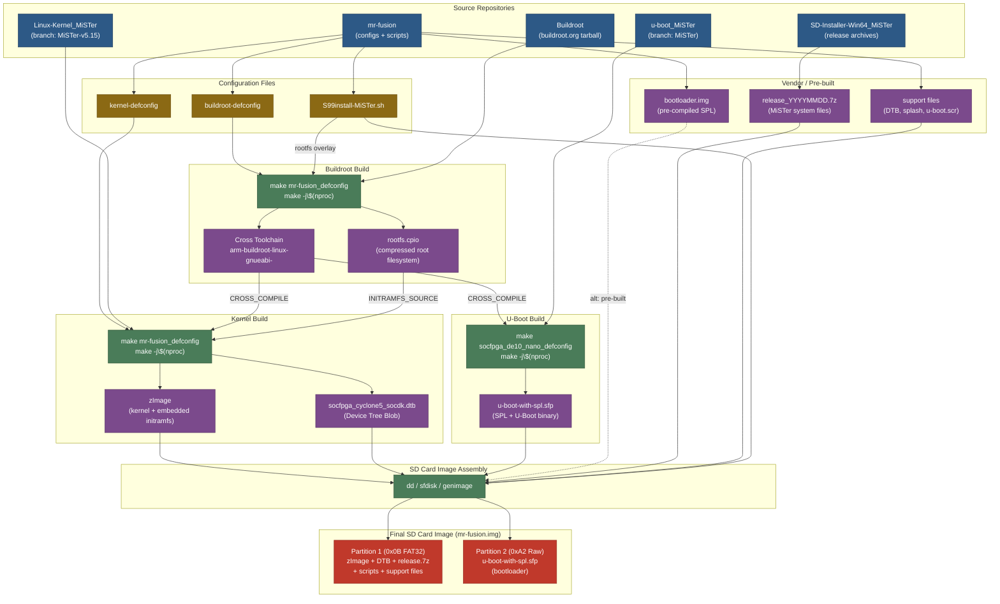

# Building a Custom Embedded Linux Distribution for the MiSTer FPGA Platform

> A comprehensive technical guide covering Buildroot cross-compilation, kernel synthesis, U-Boot integration, and SD card image packaging — using the official MiSTer repositories.

---

## Table of Contents

1. [Platform Architecture Overview](#1-platform-architecture-overview)
2. [Boot Sequence of the Cyclone V SoC](#2-boot-sequence-of-the-cyclone-v-soc)
3. [SD Card Partition Layout](#3-sd-card-partition-layout)
4. [Build Pipeline Overview](#4-build-pipeline-overview)
5. [Phase I — Manual Buildroot Compilation](#5-phase-i--manual-buildroot-compilation)
   - [Host Preparation](#51-host-preparation)
   - [Repository Setup](#52-repository-setup)
   - [Buildroot Configuration & Build](#53-buildroot-configuration--build)
   - [Kernel Cross-Compilation](#54-kernel-cross-compilation)
   - [U-Boot Bootloader](#55-u-boot-bootloader)
6. [Phase II — SD Card Image Packaging](#6-phase-ii--sd-card-image-packaging)
7. [Phase III — Docker CI/CD Pipeline](#7-phase-iii--docker-cicd-pipeline)
8. [First-Boot Lifecycle & Auto-Expansion](#8-first-boot-lifecycle--auto-expansion)
9. [Conclusions](#9-conclusions)
10. [References](#10-references)

---

## 1. Platform Architecture Overview

The MiSTer FPGA project uses the **Terasic DE10-Nano** development board, built around the **Intel/Altera Cyclone V SoC**. This chip is a heterogeneous architecture combining:

| Component | Description |
|-----------|-------------|
| **HPS (Hard Processor System)** | Dual-core ARM Cortex-A9 processor |
| **FPGA Fabric** | Programmable logic elements for cycle-accurate hardware simulation |
| **AXI Bridges** | High-bandwidth interconnects between HPS and FPGA |

The FPGA fabric runs the cycle-accurate hardware cores (arcade machines, consoles, computers), while the **Linux HPS** acts as the orchestration layer:

- USB device polling (keyboards, mice, gamepads)
- Network protocols (Samba/CIFS, FTP, SSH) for ROM transfer
- File system management for disk images
- FPGA bitstream loading upon core selection

Because general-purpose Linux distributions are too bloated for these deterministic, low-latency requirements, MiSTer uses a **heavily customized, minimal Linux environment** built via **Buildroot**.

---

## 2. Boot Sequence of the Cyclone V SoC

The DE10-Nano follows a deterministic, multi-stage boot pathway:

```
┌──────────────┐     ┌──────────────┐     ┌──────────────┐     ┌──────────────┐
│   BootROM    │ ──▶ │  SPL (from   │ ──▶ │   U-Boot     │ ──▶ │ Linux Kernel │
│  (on-chip)   │     │ 0xA2 part.)  │     │  (DDR3 RAM)  │     │  + initramfs │
└──────────────┘     └──────────────┘     └──────────────┘     └──────────────┘
     │                      │                    │                     │
  Reads MSEL          Initializes DDR3      Reads FAT32 boot      Mounts rootfs,
  pins [4:0]=01010    SDRAM, PLLs,          partition: loads      runs init,
  → seeks SD card     pin muxing            zImage + DTB          launches MiSTer
```

### Stage Details

1. **BootROM** — Hardcoded silicon ROM reads MSEL pins (`01010` = Fast Passive Parallel x32 mode) and seeks the SD card.
2. **SPL (Secondary Program Loader)** — Found in the raw `0xA2` partition. Initializes DDR3 SDRAM, configures PLLs/clocks, and loads full U-Boot into DDR3.
3. **U-Boot** — Reads FAT32 boot partition, extracts `zImage` (kernel) and `.dtb` (device tree), issues `bootz` to start Linux.
4. **Linux Kernel** — Parses the device tree, unpacks initramfs (embedded root filesystem), runs `/init`, and eventually launches `Main_MiSTer`.

---

## 3. SD Card Partition Layout

The Cyclone V BootROM enforces strict partition requirements using legacy **MBR** (dos disklabel):

| Partition | Type Code | Filesystem | Size | Contents |
|-----------|-----------|------------|------|----------|
| **1** (Boot) | `0x0B` (FAT32) | VFAT | ~100 MB | `zImage`, DTB, `u-boot.scr`, MiSTer release files |
| **2** (Preloader) | `0xA2` (Altera raw) | *None* (raw) | ~8 KB–10 MB | `u-boot-with-spl.sfp` (bootloader binary) |

> **Note:** In the Mr. Fusion approach, the boot image starts small (~120 MB) with a single FAT partition and a raw 0xA2 partition. On first boot, the init script repartitions the card to create a full-size **exFAT** `MiSTer_Data` partition spanning the entire card.

### Why FAT32 for Boot?

- U-Boot has stable native FAT16/FAT32 drivers
- Cross-platform accessibility (Windows, macOS, Linux)
- exFAT is used for the user data partition (avoids FAT32's 4 GB file size limit)

---

## 4. Build Pipeline Overview

The following diagram shows every source repository, configuration file, tool, and intermediate artifact involved in producing the final bootable SD card image.



### Legend

| Color | Category | Examples |
|-------|----------|----------|
| 🔵 Blue | Source repositories | Linux-Kernel_MiSTer, u-boot_MiSTer, Buildroot, mr-fusion |
| 🟤 Gold | Configuration files | kernel-defconfig, buildroot-defconfig, S99install-MiSTer.sh |
| 🟢 Green | Build steps | `make` invocations, image assembly tools |
| 🟣 Purple | Intermediate artifacts | zImage, rootfs.cpio, DTB, cross-toolchain, bootloader |
| 🔴 Red | Final output | SD card image partitions (FAT32 boot + 0xA2 bootloader) |

> **Key insight:** The Buildroot toolchain (`arm-buildroot-linux-gnueabi-`) is used to cross-compile both the kernel AND U-Boot. The rootfs (`rootfs.cpio`) is embedded directly into the kernel `zImage` via `INITRAMFS_SOURCE`, so the final boot partition only needs two files: the `zImage` and the `.dtb`. The dashed line to `bootloader.img` indicates the recommended path of using the pre-built vendor bootloader instead of compiling U-Boot from source.

---

## 5. Phase I — Manual Buildroot Compilation

### 5.1 Host Preparation

Buildroot requires a Linux host with baseline compilation utilities. On Ubuntu/Debian:

```bash
sudo apt-get update && sudo apt-get upgrade -y
sudo apt-get install -y \
    build-essential git curl file wget cpio unzip rsync \
    bc flex bison zip fdisk dosfstools \
    libncurses-dev openssl libssl-dev \
    dkms libelf-dev libudev-dev libpci-dev libiberty-dev autoconf \
    liblz4-tool gcc lzop make u-boot-tools libgmp3-dev libmpc-dev
```

> **Key packages:** `libncurses-dev` is required for `make menuconfig`. `fdisk` and `dosfstools` are needed for the image packaging phase.

### 5.2 Repository Setup

The MiSTer ecosystem uses **specific forks** with custom patches, drivers, and device tree definitions.

#### Official MiSTer Repositories

| Repository | Branch | Purpose |
|-----------|--------|---------|
| [`MiSTer-devel/Linux-Kernel_MiSTer`](https://github.com/MiSTer-devel/Linux-Kernel_MiSTer) | `MiSTer-v5.15` | MiSTer-patched Linux kernel |
| [`MiSTer-devel/u-boot_MiSTer`](https://github.com/MiSTer-devel/u-boot_MiSTer) | `MiSTer` | MiSTer-customized U-Boot |
| [`MiSTer-devel/mr-fusion`](https://github.com/MiSTer-devel/mr-fusion) | `master` | SD card image builder (configs + scripts) |
| [`MiSTer-devel/SD-Installer-Win64_MiSTer`](https://github.com/MiSTer-devel/SD-Installer-Win64_MiSTer) | `master` | Pre-built MiSTer release archives |

#### Workspace Initialization

```bash
# Create workspace
mkdir -p ~/mister-build && cd ~/mister-build

# 1. Clone the MiSTer Linux kernel (or use the mr-fusion linux-socfpga fork)
git clone -q --depth 1 -b MiSTer-v5.15 \
    https://github.com/MiSTer-devel/Linux-Kernel_MiSTer.git linux-kernel

# 2. Acquire Buildroot
export BUILDROOT_VERSION=2024.02.1
curl -LsS "https://buildroot.org/downloads/buildroot-${BUILDROOT_VERSION}.tar.gz" | tar -xz
mv buildroot-${BUILDROOT_VERSION} buildroot

# 3. Clone the mr-fusion orchestration repository (for configs/scripts)
git clone -q https://github.com/MiSTer-devel/mr-fusion.git

# 4. Clone MiSTer U-Boot (optional — for building from source)
git clone -q --depth 1 -b MiSTer \
    https://github.com/MiSTer-devel/u-boot_MiSTer.git u-boot
```

> **Why mr-fusion?** It provides pre-configured `defconfig` files and init scripts optimized for MiSTer. Even if you're building a custom image, these serve as an excellent starting blueprint.

### 5.3 Buildroot Configuration & Build

Inject the mr-fusion configuration into Buildroot:

```bash
cd ~/mister-build

# Inject Buildroot defconfig
cp mr-fusion/builder/config/buildroot-defconfig \
   buildroot/configs/mr-fusion_defconfig

# Create rootfs overlay with first-boot install script
mkdir -p buildroot/board/mr-fusion/rootfs-overlay/etc/init.d/
cp mr-fusion/builder/scripts/S99install-MiSTer.sh \
   buildroot/board/mr-fusion/rootfs-overlay/etc/init.d/
```

#### Key Buildroot Configuration Options

The `buildroot-defconfig` targets the ARM Cortex-A9 with NEON/VFP:

```ini
BR2_arm=y
BR2_cortex_a9=y
BR2_ARM_ENABLE_NEON=y
BR2_ARM_FPU_NEON=y
BR2_CCACHE=y
BR2_TOOLCHAIN_BUILDROOT_WCHAR=y
BR2_TOOLCHAIN_BUILDROOT_CXX=y
BR2_TARGET_GENERIC_HOSTNAME="mr-fusion"
BR2_ROOTFS_OVERLAY="board/mr-fusion/rootfs-overlay"
BR2_PACKAGE_P7ZIP=y
BR2_PACKAGE_EXFAT=y
BR2_PACKAGE_EXFAT_UTILS=y
BR2_TARGET_ROOTFS_CPIO=y
BR2_TARGET_ROOTFS_CPIO_GZIP=y
```

#### Build

```bash
cd ~/mister-build/buildroot

# Apply configuration
make mr-fusion_defconfig

# Build the complete toolchain + rootfs
make -j$(nproc)
```

This process:
1. Downloads and bootstraps a cross-compiler for `arm-buildroot-linux-gnueabi-`
2. Compiles all user-space packages (BusyBox, p7zip, exfat-utils, etc.)
3. Produces `output/images/rootfs.cpio` — the root filesystem archive
4. Places the cross-compiler in `output/host/bin/`

### 5.4 Kernel Cross-Compilation

Using the Buildroot-generated toolchain:

```bash
cd ~/mister-build/linux-kernel

# Inject the kernel defconfig
cp ../mr-fusion/builder/config/kernel-defconfig \
   arch/arm/configs/mr-fusion_defconfig

# Set cross-compilation environment
export CROSS_COMPILE=../buildroot/output/host/bin/arm-buildroot-linux-gnueabi-
export ARCH=arm

# Apply kernel configuration
make mr-fusion_defconfig

# Build the kernel
make -j$(nproc)

# Build the Device Tree Blob for the DE10-Nano
make socfpga_cyclone5_socdk.dtb
```

#### Key Kernel Configuration Highlights

```ini
CONFIG_ARCH_SOCFPGA=y           # Cyclone V SoC support
CONFIG_SMP=y                     # Dual-core support
CONFIG_NR_CPUS=2                 # Two ARM Cortex-A9 cores
CONFIG_VFP=y                     # Hardware floating-point
CONFIG_NEON=y                    # NEON SIMD extensions
CONFIG_BLK_DEV_INITRD=y          # initramfs support
CONFIG_INITRAMFS_SOURCE="../buildroot/output/images/rootfs.cpio"
CONFIG_FPGA=y                    # FPGA manager support
CONFIG_FPGA_MGR_SOCFPGA=y        # Cyclone V FPGA manager
CONFIG_STMMAC_ETH=y              # Ethernet driver
CONFIG_USB_DWC2=y                # USB controller
CONFIG_MMC_DW=y                  # SD/MMC controller
```

> **initramfs Embedding:** The `INITRAMFS_SOURCE` directive embeds the Buildroot rootfs directly into the kernel `zImage`. This creates a self-contained boot image — the entire OS loads into RAM, protecting against SD card corruption from sudden power loss.

#### Output

The compiled kernel is at: `arch/arm/boot/zImage`

### 5.5 U-Boot Bootloader

#### Option A: Use Pre-built Bootloader (Recommended)

The mr-fusion repository includes a pre-compiled `bootloader.img` in `vendor/`. This is the safest approach since incorrect SPL parameters (DDR3 timing, PLL configuration) will cause an immediate silicon-level stall.

```bash
# The bootloader is at:
ls ~/mister-build/mr-fusion/vendor/bootloader.img
```

#### Option B: Build from MiSTer U-Boot Source

```bash
cd ~/mister-build/u-boot

export CROSS_COMPILE=../buildroot/output/host/bin/arm-buildroot-linux-gnueabi-
export ARCH=arm

# Find the appropriate defconfig
ls configs/ | grep -i de10

# Configure and build
make socfpga_de10_nano_defconfig
make -j$(nproc)

# Output: u-boot-with-spl.sfp
```

---

## 6. Phase II — SD Card Image Packaging

With the compiled artifacts ready, assemble them into a bootable SD card image.

### 6.1 Create the Image

```bash
cd ~/mister-build

# Create a 120 MB image (Mr. Fusion approach)
dd if=/dev/zero of=mr-fusion.img bs=12M count=10
```

### 6.2 Partition the Image

Using `sfdisk` for scriptable partitioning:

```bash
sfdisk --force mr-fusion.img << EOF
start=10240, type=0b
start=2048, size=8192, type=a2
EOF
```

This creates:
- **Partition 1:** FAT32 data partition (starting at sector 10240)
- **Partition 2:** Raw Altera `0xA2` preloader partition (8192 sectors at sector 2048)

### 6.3 Attach Loopback & Populate

```bash
# Attach to loopback device
sudo losetup -fP mr-fusion.img

# Write bootloader to the raw 0xA2 partition
sudo dd if=mr-fusion/vendor/bootloader.img of=/dev/loop0p2 bs=64k
sync

# Format and mount the FAT32 data partition
sudo mkfs.vfat -n "MRFUSION" /dev/loop0p1
sudo mkdir -p /mnt/data
sudo mount /dev/loop0p1 /mnt/data

# Copy kernel
sudo cp linux-kernel/arch/arm/boot/zImage /mnt/data/

# Copy vendor support files (DTB, splash screen, etc.)
sudo cp -r mr-fusion/vendor/support/* /mnt/data/

# Download a MiSTer release archive
MISTER_RELEASE="release_20231108.7z"
sudo curl -LsS -o /mnt/data/release.7z \
    "https://github.com/MiSTer-devel/SD-Installer-Win64_MiSTer/raw/master/${MISTER_RELEASE}"

# Create Scripts directory
sudo mkdir -p /mnt/data/Scripts

# Bundle WiFi setup script
sudo curl -LsS -o /mnt/data/Scripts/wifi.sh \
    "https://raw.githubusercontent.com/MiSTer-devel/Scripts_MiSTer/master/other_authors/wifi.sh"

# Clean up
sync
sudo umount /mnt/data
sudo losetup -d /dev/loop0

# Compress
cd ~/mister-build
zip mr-fusion-$(date +"%Y-%m-%d").img.zip mr-fusion.img
```

The resulting `.img.zip` can be flashed to any SD card using balenaEtcher, `dd`, or similar tools.

---

## 7. Phase III — Docker CI/CD Pipeline

The manual process can be fully automated using Docker, as demonstrated by the mr-fusion project itself.

### 7.1 Mr. Fusion Dockerfile (Reference)

The official mr-fusion `Dockerfile` uses a **single-stage** approach:

```dockerfile
FROM debian:bookworm
ARG BUILDROOT_VERSION=2024.02.1
ARG MAKE_JOBS=10

# Install build dependencies
RUN apt-get -y update && apt-get -y install \
    build-essential git curl file wget cpio unzip rsync bc flex bison zip \
    fdisk dosfstools

RUN useradd -m -d /home/mr-fusion -s /bin/bash mr-fusion
USER mr-fusion
WORKDIR /home/mr-fusion

# Clone kernel and Buildroot sources
RUN git clone -q --depth 1 --recurse-submodules --shallow-submodules \
    https://github.com/michaelshmitty/linux-socfpga.git && \
    curl -LsS "https://buildroot.org/downloads/buildroot-${BUILDROOT_VERSION}.tar.gz" | tar -xz && \
    mv buildroot-${BUILDROOT_VERSION} buildroot

# Inject configurations
COPY ./builder/config/buildroot-defconfig ./buildroot/configs/mr-fusion_defconfig
COPY ./builder/config/kernel-defconfig ./linux-socfpga/arch/arm/configs/mr-fusion_defconfig
COPY ./builder/scripts/S99install-MiSTer.sh ./buildroot/board/mr-fusion/rootfs-overlay/etc/init.d/

# Build Buildroot (toolchain + rootfs)
WORKDIR /home/mr-fusion/buildroot
RUN make mr-fusion_defconfig && make

# Build kernel using the Buildroot toolchain
WORKDIR /home/mr-fusion/linux-socfpga
RUN make ARCH=arm CROSS_COMPILE=../buildroot/output/host/bin/arm-buildroot-linux-gnueabi- mr-fusion_defconfig && \
    make ARCH=arm CROSS_COMPILE=../buildroot/output/host/bin/arm-buildroot-linux-gnueabi- -j $MAKE_JOBS && \
    make ARCH=arm CROSS_COMPILE=../buildroot/output/host/bin/arm-buildroot-linux-gnueabi- socfpga_cyclone5_socdk.dtb

# Entrypoint creates the SD card image
USER root
COPY ./builder/scripts/entrypoint.sh /entrypoint.sh
RUN chmod +x /entrypoint.sh
WORKDIR /home/mr-fusion
ENTRYPOINT ["/entrypoint.sh"]
```

### 7.2 Building with Docker

```bash
# Build the Docker image (compiles everything)
docker build -t mr-fusion-builder .

# Create the SD card image
docker run --privileged \
    -e MISTER_RELEASE="release_20231108.7z" \
    -v /dev:/dev \
    -v .:/files \
    --rm -it \
    mr-fusion-builder
```

The output image lands in `./images/`.

### 7.3 Multi-Stage Pipeline (Advanced)

For production CI/CD, a **two-stage** approach isolates the heavyweight build from the image packaging:

**Stage 1 — Builder:** Contains the full cross-compilation toolchain, kernel source, and Buildroot. Emits compiled binary artifacts (`zImage`, DTB, `rootfs.cpio`, `u-boot-with-spl.sfp`).

**Stage 2 — Packager:** Lightweight container (e.g., Alpine) that ingests artifacts via `COPY --from=builder` and assembles the SD card image using either loopback mounting or user-space tools like `genimage`.

> **Security Note:** The `--privileged` flag is required for loopback device operations. In secure CI/CD environments, use `genimage` to avoid privilege escalation entirely. Buildroot integrates seamlessly with genimage via a declarative `.cfg` file.

#### Example genimage.cfg

```ini
image boot.vfat {
    vfat {
        files = { "zImage", "socfpga_cyclone5_socdk.dtb", "u-boot.scr" }
    }
    size = 100M
}

image sdcard.img {
    hdimage {
        align = 1M
    }
    partition boot {
        partition-type = 0xC
        bootable = "true"
        image = "boot.vfat"
    }
    partition rootfs {
        partition-type = 0x83
        image = "rootfs.ext4"
        size = 350M
    }
    partition uboot {
        partition-type = 0xA2
        image = "u-boot-with-spl.sfp"
        size = 10M
    }
}
```

---

## 8. First-Boot Lifecycle & Auto-Expansion

The `S99install-MiSTer.sh` script runs on first boot and performs the complete MiSTer installation:

### What It Does

1. **Mounts** the boot partition and extracts the MiSTer release `.7z` archive
2. **Copies** custom scripts, WiFi config (`wpa_supplicant.conf`), and Samba config (`samba.sh`) if present
3. **Generates** a random MAC address for the ethernet NIC (stored in `u-boot.txt`)
4. **Repartitions** the SD card:
   - Creates an exFAT `MiSTer_Data` partition spanning nearly the full card
   - Creates a small `0xA2` partition for the bootloader
5. **Formats** the data partition as exFAT
6. **Copies** all MiSTer files to the new data partition
7. **Writes** the U-Boot bootloader to the `0xA2` partition
8. **Reboots** into the fully installed MiSTer environment

### Key Code (from S99install-MiSTer.sh)

```bash
# Calculate full card capacity and repartition
DATA_PARTITION_SIZE=$(($( cat /sys/block/mmcblk0/size ) - 8192))
sfdisk --force /dev/mmcblk0 << EOF
; ${DATA_PARTITION_SIZE}; 07
; ; a2
EOF

# Create exFAT filesystem
mkfs.exfat -n "MiSTer_Data" /dev/mmcblk0p1

# Copy files and write bootloader
mount.exfat-fuse /dev/mmcblk0p1 /mnt/data
cp -r /tmp/release/files/* /mnt/data/
dd if="/tmp/release/files/linux/uboot.img" of="/dev/mmcblk0p2" bs=64k

reboot
```

This auto-expansion mechanism ensures the image works on any SD card size ≥2 GB, similar to Raspberry Pi first-boot behavior.

---

## 9. Conclusions

Building a MiSTer Linux distribution requires understanding the **Cyclone V boot constraints**:

- Legacy **MBR** partition table (not GPT)
- Raw **`0xA2`** partition for the bootloader SPL
- **FAT32** boot partition for U-Boot kernel loading
- **initramfs** embedding for power-loss resilience

The **mr-fusion** project provides a complete, tested blueprint for this process, including:
- Buildroot and kernel `defconfig` files tuned for MiSTer
- Docker-based reproducible builds
- First-boot auto-expansion scripts

For custom MiSTer images, start with the mr-fusion configurations and modify as needed. The official MiSTer kernel (`MiSTer-devel/Linux-Kernel_MiSTer`) and U-Boot (`MiSTer-devel/u-boot_MiSTer`) repositories contain all necessary MiSTer-specific patches and should be preferred over generic Altera/Intel SoC-FPGA repositories.

---

## 10. References

| # | Source |
|---|--------|
| 1 | [MiSTer-devel/mr-fusion](https://github.com/MiSTer-devel/mr-fusion) — Universal MiSTer SD card image builder |
| 2 | [MiSTer-devel/Linux-Kernel_MiSTer](https://github.com/MiSTer-devel/Linux-Kernel_MiSTer) — MiSTer Linux kernel (branch `MiSTer-v5.15`) |
| 3 | [MiSTer-devel/u-boot_MiSTer](https://github.com/MiSTer-devel/u-boot_MiSTer) — MiSTer U-Boot fork |
| 4 | [MiSTer-devel/SD-Installer-Win64_MiSTer](https://github.com/MiSTer-devel/SD-Installer-Win64_MiSTer) — MiSTer release archives |
| 5 | [mr-fusion BUILDING.md](https://github.com/MiSTer-devel/mr-fusion/blob/master/BUILDING.md) — Official mr-fusion build instructions |
| 6 | [mr-fusion Dockerfile](https://github.com/MiSTer-devel/mr-fusion/blob/master/Dockerfile) — Docker build configuration |
| 7 | [Buildroot User Manual](https://buildroot.org/downloads/manual/manual.html) — Official Buildroot documentation |
| 8 | [MiSTer FPGA Documentation — Compiling](https://mister-devel.github.io/MkDocs_MiSTer/developer/mistercompile/) — Official MiSTer compile guide |
| 9 | [DE10-Nano User Manual](https://ftp.intel.com/Public/Pub/fpgaup/pub/Intel_Material/Boards/DE10-Nano/DE10_Nano_User_Manual.pdf) — Terasic hardware reference |
| 10 | [Building SD Card image for DE10-Nano](https://github.com/zangman/de10-nano/blob/master/docs/Building-the-SD-Card-image.md) — Generic DE10-Nano SD card guide |
| 11 | [Preparing U-Boot for Cyclone V SoC](https://xillybus.com/tutorials/u-boot-image-altera-soc) — U-Boot/SPL tutorial |
| 12 | [Buildroot config for DE10-Nano (Gist)](https://gist.github.com/boogermann/e6cb59a18488cd28491d5bafdd6bf0ba) — Community Buildroot configuration |
| 13 | [Building embedded Linux for DE10-Nano](https://bitlog.it/20170820_building_embedded_linux_for_the_terasic_de10-nano.html) — Third-party build guide |
| 14 | [MiSTer Setup — Software](https://mister-devel.github.io/MkDocs_MiSTer/setup/software/) — Official MiSTer SD card setup |