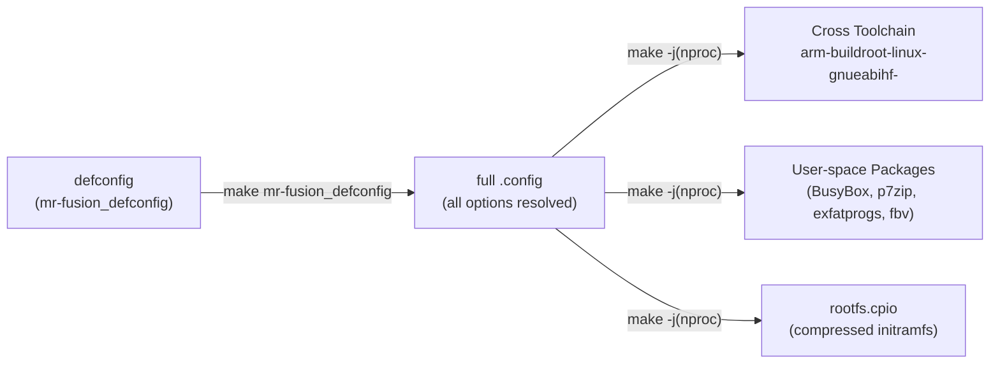
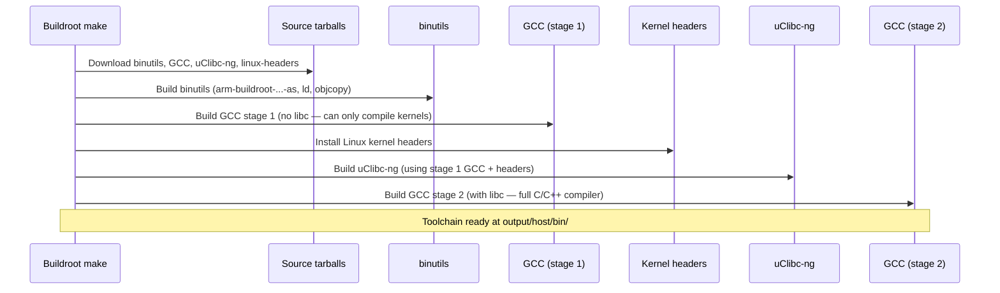
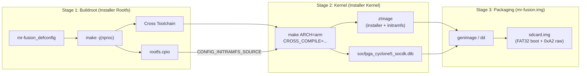

[← Buildroot Index](README.md) · [↑ Linux System](../README.md) · [↑ Knowledge Base](../../README.md)

# Buildroot Overview

MiSTer's root filesystem is built with Buildroot — the embedded Linux build system that generates a minimal, reproducible cross-compilation toolchain and a compressed initramfs archive in a single `make` invocation. This article covers Buildroot's architecture as applied to MiSTer: the defconfig model, the package selection framework, the output structure, the rootfs overlay mechanism, and the toolchain bootstrap process.

> [!NOTE]
> This is an **architectural overview** of Buildroot itself. For the full step-by-step MiSTer build pipeline (workspace setup, kernel compilation, SD card image assembly), see the companion guide at [Buildroot Linux for DE10-Nano — Comprehensive](../Buildroot%20Linux%20for%20DE10-Nano%20-%20Comprehensive.md).

---

## 1. Why Buildroot?

General-purpose Linux distributions (Debian, Ubuntu, Yocto) are too large and too slow for MiSTer's requirements:

| Constraint | Why it matters |
|---|---|
| **Minimal footprint** | The entire rootfs must fit in DDR3 RAM alongside the FPGA core. MiSTer's initramfs is ~8 MB compressed. |
| **Deterministic boot** | A fixed set of packages eliminates unpredictable service startup times. MiSTer's `Main` binary must be on-screen within seconds. |
| **Power-loss resilience** | The rootfs runs entirely from RAM (embedded in `zImage` via `CONFIG_INITRAMFS_SOURCE`). SD card corruption from sudden power-off only affects the read-write `/media/fat/` data partition. |
| **Reproducible builds** | A pinned Buildroot version + defconfig produces bit-identical rootfs archives. Critical for CI/CD (mr-fusion's Docker pipeline). |
| **Single cross-toolchain** | Buildroot bootstraps one toolchain that compiles both user-space packages **and** the Linux kernel. No external Linaro/CodeSourcery toolchain needed. |

Source: `mr-fusion/builder/config/buildroot-defconfig`, `mr-fusion/builder/config/kernel-defconfig`

---

## 2. Architecture: The Defconfig Model

Buildroot's configuration is driven by a single `.config` file, typically generated from a **defconfig** (a minimal set of non-default options). The defconfig is a flat list of `BR2_*=y`/`BR2_*=*value*` assignments — it is **not** a Kconfig fragment file.



### 2.1 Defconfig Lifecycle

1. **Inject:** The mr-fusion defconfig is copied into Buildroot's `configs/` directory:

   ```bash
   cp mr-fusion/builder/config/buildroot-defconfig \
      buildroot/configs/mr-fusion_defconfig
   ```

   Source: `mr-fusion/builder/config/buildroot-defconfig`

2. **Resolve:** `make mr-fusion_defconfig` expands the minimal defconfig into a full `.config` with all Kconfig defaults applied.

3. **Build:** `make -j$(nproc)` executes the resolved configuration.

### 2.2 Key Defconfig Variables

Extracted from the mr-fusion defconfig with Buildroot ≥ 2024.08:

```ini
# Target architecture: ARM Cortex-A9 with hard-float NEON
BR2_arm=y
BR2_cortex_a9=y
BR2_ARM_ENABLE_NEON=y
BR2_ARM_FPU_NEON=y

# Toolchain features
BR2_CCACHE=y
BR2_TOOLCHAIN_BUILDROOT_WCHAR=y
BR2_TOOLCHAIN_BUILDROOT_CXX=y

# System identity
BR2_TARGET_GENERIC_HOSTNAME="mr-fusion"
BR2_TARGET_GENERIC_ISSUE="Welcome to Mr. Fusion"

# Rootfs overlay (first-boot install script)
BR2_ROOTFS_OVERLAY="board/mr-fusion/rootfs-overlay"

# Packages
BR2_PACKAGE_P7ZIP=y
BR2_PACKAGE_EXFATPROGS=y          # replaces deprecated EXFAT / EXFAT_UTILS
BR2_PACKAGE_UTIL_LINUX=y
BR2_PACKAGE_UTIL_LINUX_BINARIES=y
BR2_PACKAGE_FBV=y                 # framebuffer image viewer (splash screen)
BR2_PACKAGE_FBV_PNG=y
BR2_PACKAGE_FBV_JPEG=y
BR2_PACKAGE_FBV_GIF=y

# Output format
BR2_TARGET_ROOTFS_CPIO=y
BR2_TARGET_ROOTFS_CPIO_GZIP=y
# BR2_TARGET_ROOTFS_TAR is not set
```

Source: `mr-fusion/builder/config/buildroot-defconfig`

> [!WARNING]
> When using Buildroot **2024.08 or newer**, the `BR2_PACKAGE_EXFAT` and `BR2_PACKAGE_EXFAT_UTILS` options no longer exist. The mr-fusion defconfig must use `BR2_PACKAGE_EXFATPROGS=y` instead. Using the old defconfig with a modern Buildroot causes a configuration error. If you must pin an older Buildroot (e.g. the official mr-fusion-pinned `2024.02.1`), keep the original `BR2_PACKAGE_EXFAT=y` and `BR2_PACKAGE_EXFAT_UTILS=y`.

---

## 3. Package Model

Buildroot's package system is organized as a set of `.mk` files under `package/<name>/`. Each package defines:

| Descriptor | Purpose |
|---|---|
| `*_VERSION` | Upstream source version |
| `*_SITE` | Download URL |
| `*_DEPENDENCIES` | Build-order dependencies |
| `*_CONFIGURE_CMDS` | Configuration commands |
| `*_BUILD_CMDS` | Build commands |
| `*_INSTALL_CMDS` | Installation into staging/target |

MiSTer's mr-fusion configuration enables only the packages essential for the HPS control plane:

| Package | Role in MiSTer |
|---|---|
| **BusyBox** | Shell, coreutils, init — the entire userspace foundation |
| **p7zip** | Extracts `release_*.7z` archives during first-boot install |
| **exfatprogs** | `mkfs.exfat` and `fsck.exfat` for the `/media/fat/` data partition |
| **util-linux** | `mount`, `fdisk`, `blkid` — used by the S99install-MiSTer.sh script |
| **fbv** | Framebuffer image viewer — displays the splash screen (`splash.png`) during boot |

> [!NOTE]
> **No glibc — uClibc-ng by default.** Buildroot's internal toolchain targets uClibc-ng for minimal footprint. The MiSTer `Main` binary (`Main_MiSTer`) is statically linked, so it does not depend on the Buildroot libc at runtime. This is deliberate: the HPS binary is a single fat ELF that can be swapped independently of the rootfs.

### 3.1 Package Selection Philosophy

MiSTer's package list is deliberately **sparse**:

- **No Python, no Perl, no Lua.** All scripting is handled by BusyBox ash + shell scripts (`S99install-MiSTer.sh`, `wifi.sh`).
- **No systemd.** Buildroot defaults to BusyBox `init` (`BR2_INIT_BUSYBOX=y`). MiSTer's boot sequence is a simple `/etc/inittab` → `/etc/init.d/rcS` → numbered scripts.
- **No X11/Wayland.** The menu and OSD are rendered by `Main_MiSTer` directly to the Linux framebuffer (`/dev/fb0`) via the `fbv` package for the splash screen; the OSD itself is drawn pixel-by-pixel through the HPS-FPGA bridge.

---

## 4. Output Structure

After `make -j$(nproc)`, Buildroot writes all output under `output/`:

```
buildroot/output/
├── build/              # Per-package build directories (sources unpacked + compiled)
│   ├── busybox-1.36.1/
│   ├── p7zip-17.04/
│   └── ...
├── host/               # Host tools and cross-compiler
│   ├── bin/
│   │   ├── arm-buildroot-linux-gnueabihf-gcc
│   │   ├── arm-buildroot-linux-gnueabihf-ld
│   │   └── ...
│   └── usr/
├── images/             # Final output artifacts
│   └── rootfs.cpio     # ← The critical artifact: compressed initramfs
├── staging/            # Sysroot for cross-compilation (headers + libraries)
└── target/             # The complete rootfs tree (before cpio archiving)
```

### 4.1 The rootfs.cpio Archive

`rootfs.cpio` is the **only** Buildroot artifact consumed by the downstream kernel build for the `mr-fusion` installer. It contains:

- `/bin/busybox` (multi-call binary — shell, init, mount, etc.)
- `/etc/inittab` and `/etc/init.d/rcS` (BusyBox init scripts)
- `/etc/init.d/S99install-MiSTer.sh` (from the rootfs overlay — see §5)
- `/usr/bin/7z` (p7zip extraction)
- `/sbin/mkfs.exfat`, `/sbin/fsck.exfat` (exfatprogs)
- `/lib/` (uClibc-ng shared libraries)

The cpio archive is embedded into the installer's kernel `zImage` via the kernel defconfig directive:

```ini
CONFIG_INITRAMFS_SOURCE="../buildroot/output/images/rootfs.cpio"
```

This creates a self-contained, one-time boot image. The entire installer OS loads into RAM. Once it formats the SD card and extracts the real MiSTer OS, this ephemeral environment is destroyed.

Source: `mr-fusion/builder/config/kernel-defconfig`

---

## 5. Rootfs Overlay Mechanism

Buildroot's `BR2_ROOTFS_OVERLAY` directive copies arbitrary files into the rootfs **after** all packages are installed but **before** the cpio archive is generated. This is how MiSTer injects its custom first-boot install script.

### 5.1 Overlay Layout

```
board/mr-fusion/rootfs-overlay/
└── etc/
    └── init.d/
        └── S99install-MiSTer.sh    # First-boot installer
```

The overlay tree mirrors the target rootfs structure exactly. Every file under the overlay directory is copied verbatim into the corresponding location in `output/target/`.

### 5.2 The S99install-MiSTer.sh Script

This is MiSTer's **first-boot installer** — a BusyBox ash script that runs once when a freshly flashed `mr-fusion` SD card boots:

1. Mounts the FAT32 boot partition (`/dev/mmcblk0p1`) where the image was flashed.
2. Extracts `release_*.7z` via `7z` (p7zip) to RAM.
3. Repartitions the SD card to create the full-size exFAT `MiSTer_Data` partition, effectively destroying the FAT32 boot partition it just booted from.
4. Overwrites the factory `bootloader.img` with the MiSTer-patched `uboot.img`.
5. Sets up the `linux/` directory structure (`/media/fat/linux/`) and copies the extracted release files to the new exFAT partition.
6. Reboots the system into the newly installed runtime OS.

Source: `mr-fusion/builder/scripts/S99install-MiSTer.sh`

> [!NOTE]
> There is no explicit "self-deletion" command in the installer script. Because the script reformats `/dev/mmcblk0p1` (which contained the `zImage` it booted from) to exFAT, the installer OS commits "seppuku." The next boot cycle reads the runtime kernel and loopback filesystem from the new exFAT partition, preventing re-execution.

> [!CAUTION]
> The S99install script overwrites the **raw 0xA2 bootloader partition** with `uboot.img` from the MiSTer release archive. If this step fails or is interrupted, the DE10-Nano will not boot on the next power cycle. Always verify that `uboot.img` is present in the release archive before assembling the SD card image.

---

## 6. Cross-Toolchain Bootstrap

Buildroot's internal toolchain is one of its most valuable features for MiSTer. Rather than downloading a pre-built Linaro GCC, Buildroot compiles the toolchain from source:



The resulting toolchain triplet depends on the FPU setting:
- `BR2_ARM_FPU_NEON=y` → `arm-buildroot-linux-gnueabihf-` (hard-float)
- `BR2_ARM_FPU_VFPV2=y` (legacy) → `arm-buildroot-linux-gnueabi-` (soft-float)

> [!WARNING]
> **Do not hardcode the toolchain prefix.** Different Buildroot versions and FPU settings produce different triplets. Always resolve dynamically:
> ```bash
> _TC=$(ls buildroot/output/host/bin/arm-*-gnueabi*-gcc | head -n1)
> export CROSS_COMPILE="${_TC%gcc}"
> ```

Source: `Linux-Kernel_MiSTer` Makefile; verified on Buildroot 2024.08+ and 2026.02+

---

## 7. Buildroot's Role in the Installer Pipeline

Buildroot is the **first stage** of assembling the `mr-fusion` installer image:



The critical dependency: **Stage 2 (kernel build) depends on Stage 1's cross-toolchain and rootfs.cpio**. You cannot build the `mr-fusion` installer kernel without first completing the Buildroot build.

Source: Pipeline design verified against `mr-fusion/Dockerfile`

---

## 8. Architectural Clarity: Installer vs. Runtime

It is critical to distinguish between the `mr-fusion` Buildroot environment and the actual MiSTer Runtime OS. They boot using fundamentally different mechanisms.

### The Installer (`mr-fusion`)
The Buildroot configuration documented here is **exclusively** for the `mr-fusion` installer. It boots entirely from an ephemeral `rootfs.cpio` embedded inside its `zImage`. It contains the absolute minimum tools (p7zip, exfatprogs) required to partition the SD card and unpack the runtime OS, after which it is destroyed.

### The Runtime (MiSTer OS)
The actual MiSTer Linux runtime is **not** an initramfs embedded in `zImage`.
1. The release archive (`release_*.7z`) contains a pre-built `linux.img` file.
2. `linux.img` is actually an **ext4 loopback filesystem** (typically built from `Linux_Image_creator_MiSTer`).
3. U-Boot reads the runtime `zImage_dtb` from the exFAT partition and loads the `linux.img` file as the root filesystem via kernel arguments: `root=$mmcroot loop=linux/linux.img`.

> [!IMPORTANT]
> If your goal is to modify the MiSTer Linux runtime (e.g., adding WiFi firmware or custom daemons), **do not modify the `mr-fusion` Buildroot defconfig**. Changes made to `mr-fusion` will only appear during the initial 30-second installation phase and will disappear when the runtime OS boots. Modifying the runtime OS requires modifying the `linux.img` ext4 filesystem or using persistence hooks like `user-startup.sh`.

---

## 9. Antipatterns and Hazards

### 8.1 Do NOT Use `make menuconfig` to Configure

Buildroot's `make menuconfig` opens an interactive ncurses interface. This is useful for **exploration** but should never be used to generate the defconfig for production:

- **Problem:** `menuconfig` writes a full `.config` with every option expanded. Saving this as a defconfig produces a bloated file that breaks across Buildroot versions.
- **Correct approach:** Use `make savedefconfig` to extract only the non-default options into a minimal defconfig.

### 8.2 Do NOT Cross-Contaminate Buildroot Versions

The `output/` directory is **not** portable across Buildroot versions. If you upgrade Buildroot (e.g. from 2024.02 to 2026.02), you must:

```bash
make clean    # or: rm -rf output/
make mr-fusion_defconfig
make -j$(nproc)
```

> [!CAUTION]
> Mixing a Buildroot 2024.02 `output/` directory with Buildroot 2026.02 binaries produces silent corruption — packages will link against stale libraries from the old sysroot, producing binaries that crash at runtime with `SIGILL` or `SIGSEGV`.

### 8.3 Do NOT Use External Toolchains (for the Buildroot Image Build)

MiSTer's mr-fusion defconfig uses `BR2_TOOLCHAIN_BUILDROOT=y` (internal toolchain). Switching to an external toolchain (`BR2_TOOLCHAIN_EXTERNAL=y`) for the **Buildroot image build** breaks the guarantee that the toolchain and sysroot are internally consistent. The internal toolchain is compiled specifically for the target's uClibc-ng version, kernel headers version, and FPU configuration.

> [!NOTE]
> This warning applies **only** to the Buildroot rootfs/kernel build. The `Main_MiSTer` binary itself is built separately using the MiSTer project's pre-built external ARM GCC 10.2 toolchain — a different build process with different constraints. Do not confuse the two.

---

## 10. Platform Context

| Platform | Build System | Rootfs | Kernel Build |
|---|---|---|---|
| **MiSTer (DE10-Nano)** | mr-fusion (installer), custom (runtime) | Loopback ext4 (`linux.img`) | Cross-compiled with GCC |
| **Analogue Pocket (openFPGA)** | Proprietary (Intel SoC EDS) | N/A — bare-metal ARM binary | N/A — no Linux on HPS |
| **MiST / SiDi** | N/A — no HPS | N/A | N/A |
| **MiSTeX** | Buildroot or Yocto (board-dependent) | Varies by SBC (ext4 on eMMC common) | Board BSP kernel |
| **Software Emulation (RetroArch)** | Host OS package manager | Host OS rootfs | N/A |

MiSTer's approach — an ephemeral RAM-based installer paired with a persistent loopback `linux.img` runtime — is optimized for the single-board, power-cycle-heavy use case of a game console. Because the rootfs runs as an isolated loopback mount, catastrophic corruption to the exFAT user-data partition rarely destroys the core OS. This is fundamentally different from MiSTeX's approach (where the SBC runs a full Linux directly on persistent storage) and Analogue Pocket's approach (where there is no HPS Linux at all).

---

## 11. Cross-References

- [Buildroot Linux for DE10-Nano — Comprehensive](../Buildroot%20Linux%20for%20DE10-Nano%20-%20Comprehensive.md) — Full step-by-step build pipeline
- [FPGA KB — Cyclone V SoC Architecture](https://github.com/alfishe/fpga-bootcamp/blob/main/02_architecture/soc/cyclone_v_soc.md) — HPS/FPGA bridge details relevant to understanding why Buildroot is needed
- [HPS Linux — Kernel](../kernel/) — MiSTer kernel patches and configuration
- [HPS Linux — U-Boot](../uboot/) — Boot sequence and U-Boot patches
- [HPS Linux — Filesystem](../filesystem/) — SD card partition layout (`/media/fat/`)
- [mr-fusion repository](https://github.com/MiSTer-devel/mr-fusion) — Official Buildroot defconfig, kernel defconfig, and S99install script
- [Buildroot Manual](https://buildroot.org/downloads/manual/manual.html) — Upstream Buildroot documentation

---

## 12. References

| Source | Path / URL |
|---|---|
| MiSTer Buildroot defconfig | `mr-fusion/builder/config/buildroot-defconfig` |
| MiSTer Kernel defconfig | `mr-fusion/builder/config/kernel-defconfig` |
| First-boot install script | `mr-fusion/builder/scripts/S99install-MiSTer.sh` |
| mr-fusion Dockerfile | `mr-fusion/Dockerfile` |
| MiSTer Linux Kernel | [`MiSTer-devel/Linux-Kernel_MiSTer`](https://github.com/MiSTer-devel/Linux-Kernel_MiSTer) (branch: `MiSTer-v5.15`) |
| Buildroot Official | [`buildroot/buildroot`](https://git.buildroot.net/buildroot) — [downloads](https://buildroot.org/download.html) |
