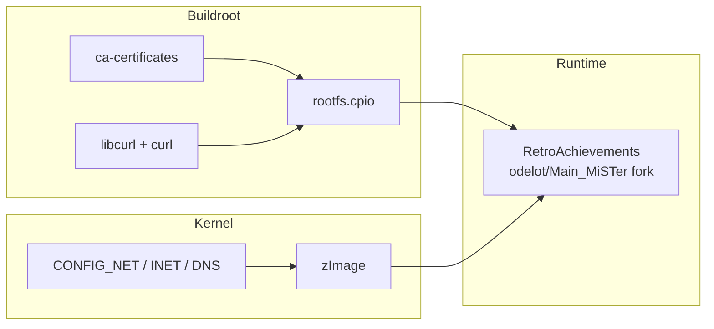

[← Buildroot Index](README.md) · [↑ Linux System](../README.md) · [↑ Knowledge Base](../../README.md)

# Custom Packages

How to extend the MiSTer Buildroot rootfs with additional packages — WiFi firmware and tools, RetroAchievements runtime dependencies, and the general pattern for adding any Buildroot package to the mr-fusion defconfig.

> [!NOTE]
> This article assumes you've read the [Buildroot Overview](buildroot_overview.md) and [MiSTer Defconfig Walkthrough](mister_defconfig.md). You should understand the defconfig model and the rootfs overlay mechanism before adding custom packages.

---

## 1. Two Approaches to Customization

Buildroot offers two mechanisms for adding content to the rootfs. Choose based on what you're adding:

| Mechanism | Use when | Example |
|---|---|---|
| **Rootfs overlay** | Adding shell scripts, config files, or pre-compiled binaries | `wifi.sh`, custom `/etc/inittab`, gamecontrollerdb.txt |
| **Buildroot package** | Compiling from source, or when the package has library dependencies | `wpa_supplicant`, `libcurl`, `libretro-common` |

### 1.1 Rootfs Overlay (Simpler)

Files placed under `BR2_ROOTFS_OVERLAY` are copied verbatim into the rootfs tree. This is how mr-fusion injects `S99install-MiSTer.sh`. To add a custom script:

```bash
mkdir -p buildroot/board/mr-fusion/rootfs-overlay/etc/init.d/
cp my-custom-script.sh buildroot/board/mr-fusion/rootfs-overlay/etc/init.d/
```

No Buildroot package definition needed. The file appears in `output/target/` and then in the final `rootfs.cpio`.

### 1.2 Buildroot Package (Compiled Dependencies)

When a package requires compilation or has library dependencies, you must use Buildroot's package infrastructure. There are two sub-approaches:

| Sub-approach | When to use |
|---|---|
| **Enable an existing Buildroot package** | The package already exists in Buildroot's `package/` tree (e.g., `wpa_supplicant`, `libcurl`) |
| **Create a new package** | The package doesn't exist in Buildroot, or you need a custom version |

Source: [Buildroot Manual — Adding Packages](https://buildroot.org/downloads/manual/manual.html#adding-packages)

---

## 2. WiFi Support

The stock mr-fusion defconfig does **not** include WiFi — the installer runs over Ethernet or uses pre-downloaded files. To add WiFi support to a custom image, you need three additions to the defconfig:

### 2.1 WiFi Kernel Modules

The MiSTer Linux kernel's `mr-fusion_defconfig` must include the relevant WiFi driver. For common USB WiFi adapters used with MiSTer (Ralink/MediaTek RT2870, Realtek RTL8192CU):

```bash
# Add to kernel defconfig
echo 'CONFIG_RT2800USB=y' >> arch/arm/configs/mr-fusion_defconfig
echo 'CONFIG_RT2X00_LIB_USB=y' >> arch/arm/configs/mr-fusion_defconfig
echo 'CONFIG_RT2X00_LIB_FIRMWARE=y' >> arch/arm/configs/mr-fusion_defconfig
```

Source: `mr-fusion/builder/config/kernel-defconfig`

### 2.2 wpa_supplicant

Add to the Buildroot defconfig:

```ini
BR2_PACKAGE_WPA_SUPPLICANT=y
BR2_PACKAGE_WPA_SUPPLICANT_WPA3=y           # WPA3 support (optional)
BR2_PACKAGE_WPA_SUPPLICANT_AP_SUPPORT=y     # Access point mode (optional)
```

`wpa_supplicant` provides the `wpa_cli` and `wpa_supplicant` binaries. The MiSTer `wifi.sh` script uses `wpa_cli` to scan for networks and configure connections interactively.

> [!WARNING]
> `wpa_supplicant` pulls in `libnl` and `openssl` as dependencies. This adds ~3 MB to the rootfs size. If your custom image is near the DDR3 allocation limit, test with `free -m` after boot.

### 2.3 WiFi Firmware Blobs

WiFi adapters require binary firmware blobs loaded by the kernel at device probe time. These are not compiled — they're copied to `/lib/firmware/` via a rootfs overlay:

```bash
# Create firmware overlay directory
mkdir -p buildroot/board/mr-fusion/rootfs-overlay/lib/firmware/

# Copy firmware blobs (example: Ralink RT2870)
cp /lib/firmware/rt2870.bin buildroot/board/mr-fusion/rootfs-overlay/lib/firmware/
```

For multiple adapters, bundle a comprehensive firmware set. The official MiSTer `wifi.sh` script supports Ralink, Realtek, and Atheros chipsets — each needs its own firmware blob.

Source: `MiSTer-devel/Scripts_MiSTer/blob/master/other_authors/wifi.sh`

---

## 3. RetroAchievements Dependencies

The [RetroAchievements](https://retroachievements.org) integration is provided by the `odelot/Main_MiSTer` fork, which replaces the standard `MiSTer` binary. The fork requires these runtime dependencies:

### 3.1 Networking

RetroAchievements communicates with the RA server over HTTPS. The `Main_MiSTer` binary links these statically, so no Buildroot packages are needed for the core RA functionality, **but** the kernel must have network support:

```bash
# Kernel defconfig additions (already present in mr-fusion defconfig)
CONFIG_NET=y
CONFIG_INET=y
CONFIG_TCP_CONG_CUBIC=y
CONFIG_DNS_RESOLVER=y
```

These are already enabled in the mr-fusion kernel defconfig. No changes needed.

### 3.2 curl (for Downloader/Update Scripts)

Some RetroAchievements-related tooling uses `curl` for HTTPS downloads. Add to the Buildroot defconfig:

```ini
BR2_PACKAGE_LIBCURL=y
BR2_PACKAGE_CURL=y               # curl command-line tool
BR2_PACKAGE_LIBCURL_CURL=y       # enable the curl binary
```

### 3.3 CA Certificates

HTTPS connections require root CA certificates for TLS verification:

```ini
BR2_PACKAGE_CA_CERTIFICATES=y
```

This installs the Mozilla CA certificate bundle to `/etc/ssl/certs/ca-certificates.crt`.

> [!NOTE]
> The `odelot/Main_MiSTer` binary statically links its HTTP client and does not use system CA certificates. The CA certificates package is only needed if you're running shell scripts or additional tools that use OpenSSL/libcurl for HTTPS.

### 3.4 RetroAchievements Build Dependency Summary



Source: `odelot/Main_MiSTer` — build configuration and README

---

## 4. General Pattern: Adding Any Buildroot Package

All Buildroot packages follow the same integration pattern. Here's the step-by-step workflow:

### 4.1 Find the Package

List available packages:

```bash
cd buildroot
make list-defconfigs | grep <package-name>
```

Or browse `package/<name>/Config.in` to find the option symbol.

### 4.2 Add to Defconfig

Append the option to your defconfig:

```bash
echo 'BR2_PACKAGE_<NAME>=y' >> configs/mr-fusion_defconfig
```

### 4.3 Resolve Dependencies

`make menuconfig` shows dependency resolution. Run it interactively to verify:

```bash
cd buildroot
make mr-fusion_defconfig
make menuconfig
```

Navigate to the package category and check that all dependencies are satisfied. Buildroot's Kconfig will gray out or hide packages with unmet dependencies.

### 4.4 Update the Defconfig

After verifying in `menuconfig`, extract only your changes:

```bash
make savedefconfig DEFCONFIG=configs/mr-fusion_defconfig
```

This rewrites the defconfig with only the non-default options — keeping it minimal.

### 4.5 Rebuild

```bash
make -j$(nproc)
```

The rootfs will now include the new package(s).

---

## 5. Package-Specific Notes

### 5.1 SSH Server (Dropbear)

For remote shell access without relying on the post-install SSH setup:

```ini
BR2_PACKAGE_DROPBEAR=y
```

Dropbear is a lightweight SSH server (~200 KB) ideal for embedded systems. After boot, `dropbear` listens on port 22 with root password `1` (MiSTer default).

### 5.2 NTP Client

For accurate timestamps (useful for RetroAchievements which validate server timestamps):

```ini
BR2_PACKAGE_NTP=y
BR2_PACKAGE_NTP_NTPDATE=y
```

Alternative: `BR2_PACKAGE_CHRONY=y` (lighter weight, better for intermittent connections).

### 5.3 Game Controller Database

The SDL game controller database (`gamecontrollerdb.txt`) is not a Buildroot package — it's a data file bundled during image assembly:

```bash
curl -LsS -o gamecontrollerdb.txt \
    "https://raw.githubusercontent.com/MiSTer-devel/Distribution_MiSTer/main/linux/gamecontrollerdb/gamecontrollerdb.txt"
```

Source: `mr-fusion/Dockerfile`

---

## 6. Rootfs Size Budget

Every added package increases the compressed initramfs size. MiSTer's initramfs is loaded into DDR3 RAM alongside:

| Consumer | Approximate size |
|---|---|
| **Linux kernel (zImage)** | ~4 MB |
| **Rootfs (compressed cpio)** | ~8 MB (stock mr-fusion) |
| **FPGA core bitstream** | 2–8 MB (varies by core) |
| **Core memory (BRAM, SDRAM mapping)** | Core-dependent |
| **User data buffers** | Dynamic |

The DE10-Nano has 1 GB of DDR3. In practice, the initramfs has generous headroom, but aim to keep the compressed rootfs under **16 MB** to leave maximum room for large FPGA cores (ao486, PSX, N64).

### Size Reduction Tips

| Technique | Savings |
|---|---|
| Disable `BR2_PACKAGE_UTIL_LINUX_BINARIES` (use BusyBox applets) | ~1.5 MB |
| Use `BR2_PACKAGE_DROPBEAR_SMALL` instead of full Dropbear | ~100 KB |
| Strip debug symbols: `BR2_STRIP_strip=y` (default) | Variable |
| Use `BR2_OPTIMIZE_2=y` (`-Os` — optimize for size) | ~10–20% code reduction |

---

## 7. Testing Custom Packages

### 7.1 Verify Package Inclusion

After the Buildroot build, check that the package made it into the target tree:

```bash
ls buildroot/output/target/usr/bin/<binary-name>
# Or for libraries:
ls buildroot/output/target/lib/<library-name>.so*
```

### 7.2 Verify Initramfs Content

```bash
mkdir -p /tmp/rootfs && cd /tmp/rootfs
zcat buildroot/output/images/rootfs.cpio | cpio -idmv
ls -la etc/init.d/   # Check overlay scripts
ls -la usr/bin/       # Check package binaries
```

### 7.3 Runtime Verification

After booting the custom image on the DE10-Nano:

```bash
# Check package binaries
which wpa_supplicant
wpa_supplicant -v

# Check kernel modules
lsmod | grep rt2

# Check firmware loaded
dmesg | grep firmware

# Check disk usage
df -h /
free -m
```

---

## 8. Cross-References

- [Buildroot Overview](buildroot_overview.md) — Package model and output structure
- [MiSTer Defconfig Walkthrough](mister_defconfig.md) — Line-by-line defconfig reference
- [WiFi & Network Setup](../../12_networking/wifi_setup.md) — Post-install WiFi configuration
- [RetroAchievements](../../14_extensions/retroachievements.md) — RA integration architecture
- [Buildroot Manual — Adding Packages](https://buildroot.org/downloads/manual/manual.html#adding-packages)

---

## 9. References

| Source | Path / URL |
|---|---|
| MiSTer WiFi script | [`Scripts_MiSTER/other_authors/wifi.sh`](https://github.com/MiSTer-devel/Scripts_MiSTer/blob/master/other_authors/wifi.sh) |
| RetroAchievements fork | [`odelot/Main_MiSTer`](https://github.com/odelot/Main_MiSTer) |
| Game controller DB | [`Distribution_MiSTer/gamecontrollerdb.txt`](https://github.com/MiSTer-devel/Distribution_MiSTer) |
| mr-fusion Dockerfile | [`mr-fusion/Dockerfile`](https://github.com/MiSTer-devel/mr-fusion/blob/master/Dockerfile) |
| Buildroot Package Infrastructure | [buildroot.org/manual.html#adding-packages](https://buildroot.org/downloads/manual/manual.html#adding-packages) |
