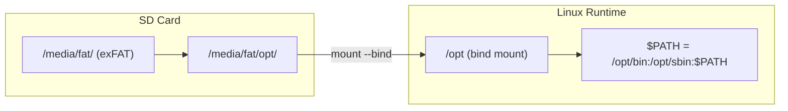

[← Buildroot Index](README.md) · [↑ Linux System](../README.md) · [↑ Knowledge Base](../../README.md)

# Package Management in Buildroot

Buildroot generates a monolithic, static rootfs with no runtime package manager by design. This article covers the four practical approaches for adding software to a MiSTer system — from the community-standard Entware installation to cross-compilation — with their trade-offs, failure modes, and verified compatibility.

> [!NOTE]
> This article assumes you've read the [Buildroot Overview](buildroot_overview.md). You should understand the initramfs model, the rootfs overlay mechanism, and the difference between Buildroot's build-time package selection and runtime package management.

---

## 1. Buildroot Design Context

Buildroot is a **rootfs generator**, not a distribution. By default it produces a monolithic image where every file is placed at build time and every dependency is resolved at build time. There is no runtime package database, no repository index, and no `apt install` equivalent.

| Aspect | Distribution (Debian, OpenWrt) | Buildroot (default) |
|---|---|---|
| **Package installation** | Runtime (`apt install`, `opkg install`) | Build-time (`make menuconfig`, `make`) |
| **Dependency resolution** | Runtime solver with version constraints | Build-time Kconfig with static dependency tree |
| **Rootfs mutability** | Persistent, read-write, upgradable | Static, burned to flash, or embedded in initramfs |
| **Package database** | `/var/lib/dpkg/`, `/var/lib/opkg/` | None — packages are compiled into the image |

However, MiSTer has a critical difference from typical embedded Buildroot targets: a large, persistent **exFAT data partition** (`/media/fat/`) that survives reboots and `linux.img` updates. This enables several approaches that are impossible on initramfs-only systems.

Source: [Buildroot Manual — About Buildroot](https://buildroot.org/downloads/manual/manual.html#_about_buildroot)

---

## 2. Approach 1: Entware (Community Standard)

[Entware](https://entware.net/) is a software repository for embedded devices, originally forked from OpenWrt. It is the **dominant community solution** for adding packages to MiSTer. The DE10-Nano's Cortex-A9 (ARMv7 hard-float) uses the `armv7sf-k3.2` Entware distribution.

### 2.1 How It Works

Entware installs into `/opt`, which is bind-mounted from `/media/fat/opt` on the exFAT data partition. Because `/media/fat/` is persistent, installed packages survive reboots and `linux.img` updates.



### 2.2 Installation

```bash
# Create the persistent directory on exFAT
mkdir -p /media/fat/opt

# Bind-mount it into the expected location
mount --bind /media/fat/opt /opt

# Download and run the Entware installer
cd /tmp
wget http://bin.entware.net/armv7sf-k3.2/installer/generic.sh
chmod +x generic.sh
./generic.sh
```

### 2.3 Persistence Across Reboots

The `linux.img` initramfs is replaced during MiSTer updates, so modifications to `/etc/fstab` or `/etc/init.d/` are lost. Use `/media/fat/linux/user-startup.sh` instead — this script is executed automatically on every boot and is not overwritten by updates:

```bash
# /media/fat/linux/user-startup.sh
mount --bind /media/fat/opt /opt
export PATH=/opt/bin:/opt/sbin:$PATH
/opt/etc/init.d/rc.unslung start
```

Source: MiSTer community practice; `user-startup.sh` mechanism verified in `Main_MiSTer` boot sequence

### 2.4 Package Installation

After setup, `opkg` works like any other package manager:

```bash
opkg update
opkg install gcc make binutils python3 htop nano git rsync
```

The `armv7sf-k3.2` repository contains ~2000+ packages including:
- **Compilers**: `gcc`, `g++`, `clang`
- **Languages**: `python3`, `perl`, `ruby`, `go`
- **Tools**: `htop`, `tmux`, `mosh`, `borgbackup`, `btrfs-progs`

### 2.5 Entware Limitations

| Limitation | Detail |
|---|---|
| **ABI isolation** | Entware packages link against Entware's `libc` in `/opt/lib/`, not the Buildroot `uClibc-ng` in `/lib/`. Mixing libraries between the two stacks causes `undefined symbol` errors. |
| **Kernel module mismatch** | Entware cannot install kernel modules — the running kernel is fixed in `zImage`. Modules must match the exact kernel version and build configuration. |
| **No init system integration** | Entware services start via `/opt/etc/init.d/rc.unslung`, not Buildroot's `/etc/init.d/`. Startup ordering relative to MiSTer's own services is manual. |
| **exFAT limitations** | `/media/fat/` is exFAT, which lacks UNIX permissions, symlinks, and device nodes. Entware works around this by storing metadata in extended attributes, but some packages (those requiring real symlinks or special device files) fail. |

> [!WARNING]
> Entware's GCC toolchain compiles against Entware's own headers and libraries in `/opt/`. If you compile software that links against system libraries from the Buildroot initramfs (`/usr/lib/`, `/lib/`), expect ABI conflicts at runtime. Keep the entire development stack inside Entware (`opkg install gcc make pkg-config` and Entware `*-dev` packages).

---

## 3. Approach 2: Debian/Ubuntu chroot

For a full distribution environment with `apt`, `dpkg`, and complete dependency resolution, create an `armhf` chroot on the exFAT partition.

### 3.1 Setup

```bash
# Create the chroot directory on persistent storage
mkdir -p /media/fat/debian

# Bootstrap a minimal Debian armhf system
# (Run this on a Debian host or inside a Docker container with qemu-user-static)
sudo debootstrap --arch=armhf stable /media/fat/debian http://deb.debian.org/debian
```

### 3.2 Enter the chroot

```bash
# Mount necessary filesystems
mount --bind /proc /media/fat/debian/proc
mount --bind /sys /media/fat/debian/sys
mount --bind /dev /media/fat/debian/dev

# Enter
chroot /media/fat/debian /bin/bash

# Inside the chroot: full apt works
apt update
apt install build-essential python3-dev git
```

### 3.3 Trade-offs

| Advantage | Disadvantage |
|---|---|
| Full `apt` with dependency resolution | ~500 MB+ for a minimal installation |
| Native compilation environment | Must mount `/proc`, `/sys`, `/dev` on every chroot entry |
| Access to Debian's entire package archive | Slow I/O — exFAT is not optimized for Linux filesystem operations |
| No ABI conflicts with Entware | chroot is a boundary — binaries inside cannot see MiSTer-specific paths outside |

This approach is practical for building large projects natively on the DE10-Nano where Entware's package selection is insufficient. It is overkill for installing a single utility.

---

## 4. Approach 3: Buildroot Rebuild with `BR2_PACKAGE_OPKG`

You can embed `opkg` directly into the Buildroot initramfs:

```ini
BR2_PACKAGE_OPKG=y
```

### 4.1 What This Gives You

The `opkg` binary is compiled and installed into the initramfs. After boot, you can:

```bash
opkg install /media/fat/some-package.ipk
```

### 4.2 Limitations

| Problem | Why it matters |
|---|---|
| **No package repository** | Buildroot does not generate `Packages.gz` indexes or host repositories. You must build and host your own `.ipk` feeds. |
| **Ephemeral installation** | Packages installed to `/` vanish on reboot because the initramfs is reconstructed from the embedded cpio. You would need to install into `/media/fat/` and set `OPKG_CONF_ROOT` accordingly. |
| **ABI fragility** | Buildroot's uClibc-ng, kernel headers, and GCC version are pinned at build time. An `.ipk` built against a different Buildroot version may fail with `SIGILL` or `undefined symbol`. |
| **Feed maintenance** | You become a distribution maintainer: compiling packages, resolving cross-version dependencies, generating indexes, and signing packages. |

> [!NOTE]
> This approach is theoretically possible but **not used in practice** by the MiSTer community. The overhead of maintaining a compatible package feed outweighs the benefit. Entware (Approach 1) provides the same `opkg` binary with an existing, maintained repository.

---

## 5. Approach 4: Cross-Compilation + Static Binaries

For one-off utilities or custom software, cross-compile on the host and copy the binary to `/media/fat/`.

### 5.1 Using the Buildroot Toolchain

```bash
# The toolchain from the Buildroot build
cd ~/mister-build/buildroot
export PATH=$PWD/output/host/bin:$PATH

# Compile a simple utility
arm-buildroot-linux-gnueabihf-gcc -o myutil myutil.c -static

# Deploy to MiSTer
scp myutil root@mister:/media/fat/
```

### 5.2 Using the MiSTer GCC Toolchain

The `MiSTer-devel/Main_MiSTer` repository uses a pre-built ARM GCC 10.2 toolchain for cross-compiling the HPS binary. This same toolchain can compile user utilities. See [HPS Binary — ARM Cross-Compilation Toolchain](../../../04_hps_binary/build/overview.md) for full setup instructions on Linux, WSL2, and macOS.

```bash
# From the Main_MiSTer Makefile
arm-linux-gnueabihf-gcc -o myutil myutil.c -static
```

### 5.3 Static vs Dynamic Linking

| Linking | Pros | Cons |
|---|---|---|
| **Static** (`-static`) | No runtime library dependencies; runs on any MiSTer system | Binary size increases by ~1–2 MB |
| **Dynamic** | Smaller binary; shares libraries | Must ensure target libraries exist (Buildroot uClibc-ng or Entware libc) |

For utilities deployed to `/media/fat/`, static linking is recommended because the runtime library environment varies between stock MiSTer and Entware-modified systems.

Source: `MiSTer-devel/Main_MiSTer` Makefile

---

## 6. Comparison Matrix

| Approach | Effort | Persistence | Package Count | Best For |
|---|---|---|---|---|
| **Entware** | Low (one-time setup) | Yes (`/media/fat/opt`) | ~2000+ | General-purpose utilities, compilers, interpreters |
| **Debian chroot** | Medium | Yes (`/media/fat/debian`) | 60,000+ | Full development environment, complex builds |
| **Buildroot + opkg** | Very high | No (initramfs ephemeral) | Self-maintained | Custom embedded distributions only |
| **Cross-compile static** | Low per binary | Yes (`/media/fat/`) | N/A (single binaries) | One-off utilities, custom tools |
| **Buildroot rebuild** | Medium | Yes (in new `linux.img`) | All of Buildroot | System-level packages that must be in initramfs |

---

## 7. Platform Context

| Platform | Package Management | Mechanism |
|---|---|---|
| **MiSTer** | Entware (`opkg` in `/media/fat/opt`) | Bind-mounted persistent directory on exFAT |
| **OpenWrt** | `opkg` | SquashFS root + JFFS2 overlay |
| **Debian Embedded** | `apt` | Persistent ext4 rootfs |
| **Yocto** | Optional `rpm`/`dpkg`/`opkg` | Package management is opt-in; many images are monolithic |
| **MiSTeX** | Host OS package manager | SBC runs full Linux with persistent storage |

MiSTer's Entware pattern is unique among these: it augments an ephemeral initramfs with a persistent overlay on a non-native filesystem (exFAT), using bind mounts and a user startup hook (`user-startup.sh`) rather than integrating with the init system.

---

## 8. Cross-References

- [Buildroot Overview](buildroot_overview.md) — Architecture, initramfs model, output structure
- [Custom Packages](custom_packages.md) — Adding packages via defconfig + rebuild
- [HPS Linux — Filesystem](../filesystem/) — SD card runtime layout (`/media/fat/`)
- [Buildroot Manual — About Buildroot](https://buildroot.org/downloads/manual/manual.html#_about_buildroot)
- [Entware](https://entware.net/) — Official site and package list
- [OpenWrt opkg](https://openwrt.org/docs/guide-user/additional-software/opkg) — Package manager documentation

---

## 9. References

| Source | Path / URL |
|---|---|
| Buildroot Manual — Philosophy | [buildroot.org/manual.html#_about_buildroot](https://buildroot.org/downloads/manual/manual.html#_about_buildroot) |
| Buildroot — opkg package | `package/opkg/` in Buildroot source tree |
| Entware | [entware.net](https://entware.net/) |
| Entware armv7sf-k3.2 feed | [bin.entware.net/armv7sf-k3.2](http://bin.entware.net/armv7sf-k3.2/) |
| MiSTer Main Makefile | [`Main_MiSTer/Makefile`](https://github.com/MiSTer-devel/Main_MiSTer/blob/master/Makefile) |
| Debian debootstrap | [debian.org/debootstrap](https://wiki.debian.org/Debootstrap) |

## 10. Community Sources

The following forum threads and repositories document verified community practices for package management on MiSTer:

| Source | What it proves |
|---|---|
| **MiSTer FPGA Forum — "Why not use a package manager?"** | Community discussion explicitly comparing MiSTer's lack of package manager to OpenWrt's `opkg` ([misterfpga.org/viewtopic.php?t=2405](https://misterfpga.org/viewtopic.php?t=2405)) |
| **MiSTer FPGA Forum — "Get Disk Space Usage With NCDU"** | User states *"It's also available via Entware if you've got that installed on the MiSTer"* and notes Entware's `ncdu` build script ([misterfpga.org/viewtopic.php?t=3891](https://misterfpga.org/viewtopic.php?t=3891)) |
| **MiSTer FPGA Forum — "Useful SSH Commands For MiSTer?"** | Direct quote: *"installing Entware stuff gives you a package manager (opkg) allowing you to install"* ([misterfpga.org/viewtopic.php?t=5090](https://misterfpga.org/viewtopic.php?t=5090)) |
| **MiSTer FPGA Forum — "MiSTerArch"** | Even MiSTerArch (Arch Linux ARM for MiSTer) users note: *"For anything missing you can use Entware"* ([misterfpga.org/viewtopic.php?t=4264&start=60](https://misterfpga.org/viewtopic.php?t=4264&start=60)) |
| **MiSTer FPGA Forum — "New User Startup Script"** | Introduces `/media/fat/linux/user-startup.sh` as the mechanism that *"will allow preservation of custom scripts when Linux is updated"* ([misterfpga.org/viewtopic.php?t=3188](https://misterfpga.org/viewtopic.php?t=3188)) |
| **MiSTer FPGA Official Docs — Advanced Networking** | Official documentation instructs users to *"edit the `user-startup.sh` file in `/media/fat/linux/`"* for persistent boot configuration ([mister-devel.github.io/MkDocs_MiSTer/advanced/network](https://mister-devel.github.io/MkDocs_MiSTer/advanced/network/)) |
| **GitHub — MiSTerArch/PKGBUILDs** | MiSTerArch uses `pacman-key --init && pacman-key --populate archlinuxarm` and `pacman -Syu` for package management on MiSTer ([github.com/MiSTerArch/PKGBUILDs/blob/main/INSTALL.md](https://github.com/MiSTerArch/PKGBUILDs/blob/main/INSTALL.md)) |
| **Reddit — Syncthing on MiSTer** | Community confirmation that *"the other familiar scripts install themselves in user-startup.sh"* ([reddit.com/r/MiSTerFPGA/comments/1lcwup9](https://www.reddit.com/r/MiSTerFPGA/comments/1lcwup9/syncthing_on_mister/)) |
| **GitHub — manyhats-mike/mister-fpga-retroachievements** | Uses *"a tiny hook in user-startup.sh so the modified binary survives any future update_all run"* ([github.com/manyhats-mike/mister-fpga-retroachievements](https://github.com/manyhats-mike/mister-fpga-retroachievements)) |
| **GitHub — alinke/pixelcade-linux** | Third-party installer checks for `/media/fat/linux/user-startup.sh` as the standard persistence hook ([raw.githubusercontent.com/alinke/pixelcade-linux/main/installer-scripts/setup-mister-lcd.sh](https://raw.githubusercontent.com/alinke/pixelcade-linux/main/installer-scripts/setup-mister-lcd.sh)) |
