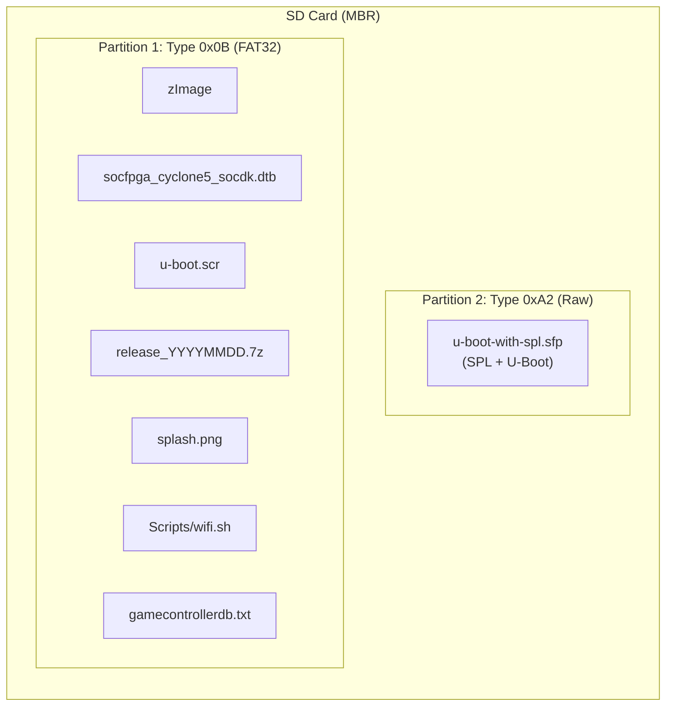

[← Image Build Index](README.md) · [↑ Linux System](../README.md) · [↑ Knowledge Base](../../README.md)

# Image Generation

How the MiSTer mr-fusion installer image is assembled — from the Cyclone V BootROM's partition requirements through MBR layout, loopback device handling, file bundling, and final image compression. Covers both the manual `sfdisk`/`dd` approach and the automated `genimage` Docker pipeline.

> [!NOTE]
> This article covers the **final assembly** of the SD card image. For the pipeline overview showing how Buildroot, kernel, and mr-fusion artifacts connect, see [Image Build Overview](overview.md).

---

## 1. BootROM Constraints

The Cyclone V SoC's BootROM enforces strict requirements that differ from standard Linux partitioning. Getting them wrong produces a non-booting SD card with no error messages — the BootROM simply fails silently.

### 1.1 MSEL and Boot Source

The BootROM reads the MSEL pins on the DE10-Nano:

```
MSEL[4:0] = 01010 → Fast Passive Parallel x32, SD/MMC card
```

It then scans the MBR partition table for a partition with type code **`0xA2`** and loads the raw binary from that partition as the **Secondary Program Loader (SPL)**.

> [!CAUTION]
> The partition table **must** use legacy MBR (DOS disklabel). GPT is not supported by the Cyclone V BootROM. Creating a GPT-labeled SD card produces a system that appears correctly formatted but cannot boot.

Source: Intel Cyclone V HPS Technical Reference Manual, "Booting and Configuration" chapter

---

## 2. Partition Layout



### 2.1 Partition Table

| # | Type | Size | On-disk Start | Contents |
|---|---|---|---|---|
| 1 | `0x0B` (FAT32) | ~100–120 MB | Sector 10240 | `zImage`, DTB, `u-boot.scr`, `release_*.7z`, `splash.png`, `Scripts/wifi.sh`, `gamecontrollerdb.txt` |
| 2 | `0xA2` (Altera raw) | 8 MB (8192 sectors) | Sector 2048 | `u-boot-with-spl.sfp` or `bootloader.img` |

> [!NOTE]
> Partition 2 (0xA2) is **physically before** Partition 1 on disk (sector 2048 vs 10240), but it's **numbered second** in the partition table. The Cyclone V BootROM scans by partition number. This ordering is deliberate: U-Boot refers to the FAT32 partition as `mmc 0:1` (partition number 1), and keeping it as partition 1 simplifies the boot script.

### 2.2 Two Types of Bootloader Images

| Image | Used in | Size | Source |
|---|---|---|---|
| `bootloader.img` | **Installer only** (mr-fusion) | 10 MB | `mr-fusion/vendor/bootloader.img` — Terasic factory preloader + FPGA bitstream for HDMI output |
| `uboot.img` | **Final MiSTer system** | ~500 KB | Extracted from `release_*.7z` — MiSTer-patched SPL + U-Boot |

During first boot, `S99install-MiSTer.sh` overwrites `bootloader.img` with `uboot.img` on the `0xA2` partition. The partition is sized at 8–10 MB to accommodate the larger factory preloader during the install phase.

> [!CAUTION]
> Writing `uboot.img` to the `0xA2` partition is a one-way operation. If interrupted (power loss, SD card removal), the DE10-Nano will not boot on the next power cycle. Re-image the SD card from scratch.

Source: `mr-fusion/vendor/bootloader.img`; verified against DE10-Nano boot behavior

---

## 3. Manual Image Assembly (`sfdisk` + `dd`)

### 3.1 Create an Empty Image

```bash
dd if=/dev/zero of=mr-fusion.img bs=1M count=120
```

### 3.2 Partition with sfdisk

```bash
echo 'label: dos
start=10240, type=0b
start=2048, size=8192, type=a2' | sfdisk --force mr-fusion.img
```

> [!NOTE]
> `type=0b` (FAT32 CHS) is used instead of `type=0c` (FAT32 LBA) for maximum compatibility with older U-Boot FAT drivers.

### 3.3 Dynamic Loopback Attachment

**Never hardcode `/dev/loop0`.** Use `losetup -f --show`:

```bash
LOOPDEV=$(sudo losetup -f --show -P mr-fusion.img)
echo "Using loop device: ${LOOPDEV}"
```

The `-P` flag scans partitions immediately, creating `${LOOPDEV}p1` and `${LOOPDEV}p2`.

### 3.4 Write the Bootloader

```bash
sudo dd if=bootloader.img of="${LOOPDEV}p2" bs=64k conv=fsync
sync
```

`bs=64k` matches the SD card's erase block size. `conv=fsync` ensures the write is flushed.

### 3.5 Format and Populate the FAT32 Partition

```bash
# Format
sudo mkfs.vfat -n "MRFUSION" "${LOOPDEV}p1"

# Mount
mkdir -p mnt/data
sudo mount "${LOOPDEV}p1" mnt/data

# Copy kernel artifacts
sudo cp linux-kernel/arch/arm/boot/zImage mnt/data/
sudo cp linux-kernel/arch/arm/boot/dts/socfpga_cyclone5_socdk.dtb mnt/data/
sudo cp u-boot.scr mnt/data/

# Copy support files
sudo cp mr-fusion/vendor/support/splash.png mnt/data/ 2>/dev/null || true

# Download MiSTer release archive
MISTER_RELEASE="release_20231108.7z"
sudo curl -LsS -o mnt/data/release.7z \
    "https://github.com/MiSTer-devel/SD-Installer-Win64_MiSTer/raw/master/${MISTER_RELEASE}"

# Bundle WiFi setup script and game controller database
sudo mkdir -p mnt/data/Scripts
sudo curl -LsS -o mnt/data/Scripts/wifi.sh \
    "https://raw.githubusercontent.com/MiSTer-devel/Scripts_MiSTer/master/other_authors/wifi.sh"
sudo curl -LsS -o mnt/data/gamecontrollerdb.txt \
    "https://raw.githubusercontent.com/MiSTer-devel/Distribution_MiSTer/main/linux/gamecontrollerdb/gamecontrollerdb.txt"

# Unmount and detach
sync
sudo umount mnt/data
sudo losetup -d "${LOOPDEV}"
```

### 3.6 Compress

```bash
zip mr-fusion-$(date +"%Y-%m-%d").img.zip mr-fusion.img
```

Source: `mr-fusion` build scripts

---

## 4. Automated Assembly (`genimage` + Docker)

The mr-fusion Docker pipeline uses `genimage` — a declarative image builder that does not require loopback devices or root privileges.

### 4.1 genimage Configuration

```ini
image boot.vfat {
    vfat {
        files = {
            "zImage",
            "socfpga_cyclone5_socdk.dtb",
            "u-boot.scr",
            "release.7z",
            "splash.png",
            "Scripts/wifi.sh",
            "gamecontrollerdb.txt"
        }
        label = "MRFUSION"
    }
    size = 120M
}

image sdcard.img {
    hdimage {
        align = 1M
    }
    partition boot {
        partition-type = 0x0C
        bootable = "true"
        image = "boot.vfat"
    }
    partition uboot {
        partition-type = 0xA2
        image = "bootloader.img"
        size = 10M
    }
}
```

Source: `mr-fusion/Dockerfile`

### 4.2 Comparison

| Aspect | Manual (`sfdisk` + `dd`) | Automated (`genimage`) |
|---|---|---|
| **Privileges** | Requires `sudo` | Runs unprivileged |
| **Reproducibility** | Timestamps vary | Bit-identical output |
| **CI/CD** | Requires `--privileged` Docker | Standard Docker |

> [!NOTE]
> The MiSTer release archives are hosted at `MiSTer-devel/SD-Installer-Win64_MiSTer` despite the "Win64" in the name. The repository was originally for the Windows SD card installer tool. Today it serves as the official distribution endpoint for platform-neutral `release_*.7z` archives.

---

## 5. Boot Script Compilation

U-Boot requires a compiled boot script (`u-boot.scr`) to load the kernel and DTB from the FAT partition.

### 5.1 Boot Command File

```bash
cat > boot.cmd << 'EOF'
setenv bootimage zImage
setenv fdtimage socfpga_cyclone5_socdk.dtb
setenv loadaddr 0x01000000
setenv fdtaddr 0x02000000
fatload mmc 0:1 ${loadaddr} ${bootimage}
fatload mmc 0:1 ${fdtaddr} ${fdtimage}
bootz ${loadaddr} - ${fdtaddr}
EOF
```

| Address | Purpose |
|---|---|
| `0x01000000` | Kernel load address (16 MB into DDR3) |
| `0x02000000` | Device tree blob load address (32 MB into DDR3) |

These addresses avoid the lower DDR3 region used by SPL/U-Boot and stay below the F2H AXI bridge window.

### 5.2 Compile with mkimage

```bash
mkimage -A arm -T script -C none -n "MiSTer Boot" -d boot.cmd u-boot.scr
```

`u-boot-tools` provides `mkimage`:
- **Debian/Ubuntu**: `apt install u-boot-tools`
- **macOS**: `brew install u-boot-tools`

Source: U-Boot documentation; `mr-fusion/Dockerfile`

---

## 6. Release Archive Structure

The `release_YYYYMMDD.7z` archive is extracted by S99install-MiSTer.sh during first boot:

```
release_20231108.7z
├── MiSTer                # Main HPS binary (statically linked ELF)
├── menu.rbf              # Menu core (OSD in FPGA fabric)
├── MiSTer.ini            # Default configuration
├── MiSTer_example.ini    # Full configuration reference
├── linux/                # Post-install Linux image
│   ├── zImage_dtb        # Kernel + DTB (appended)
│   └── uboot.img         # MiSTer-patched SPL + U-Boot
├── fonts/                # OSD fonts
├── Scripts/              # Post-install utility scripts
├── games/                # Core subdirectories
│   ├── _Console/
│   ├── _Computer/
│   └── _Arcade/
└── cheats/               # Cheat files (.cht)
```

The `MiSTer` binary and `menu.rbf` are the minimum required for the system to function after first boot.

Source: `MiSTer-devel/SD-Installer-Win64_MiSTer` release archives

---

## 7. Cross-References

- [Image Build Overview](overview.md) — Pipeline overview, artifact dependencies, first-boot sequence
- [Buildroot Overview](../buildroot/buildroot_overview.md) — Buildroot output structure and rootfs.cpio
- [HPS Linux — Filesystem](../filesystem/) — SD card runtime layout (`/media/fat/`)
- [HPS Linux — U-Boot](../uboot/) — Boot sequence details
- [FPGA KB — Cyclone V Boot Flow](https://github.com/alfishe/fpga-bootcamp/blob/main/02_architecture/soc/cyclone_v_boot.md) — Full Cyclone V boot sequence

---

## 8. References

| Source | Path / URL |
|---|---|
| mr-fusion Dockerfile | [`mr-fusion/Dockerfile`](https://github.com/MiSTer-devel/mr-fusion/blob/master/Dockerfile) |
| First-boot install script | `mr-fusion/builder/scripts/S99install-MiSTer.sh` |
| MiSTer release archives | [`SD-Installer-Win64_MiSTer`](https://github.com/MiSTer-devel/SD-Installer-Win64_MiSTer) |
| Cyclone V HPS TRM | [Intel 683126](https://www.intel.com/content/www/us/en/docs/programmable/683126/) |
| genimage | [github.com/pengutronix/genimage](https://github.com/pengutronix/genimage) |
| U-Boot mkimage | [u-boot.readthedocs.io](https://u-boot.readthedocs.io/en/latest/usage/fit/mkimage.html) |
