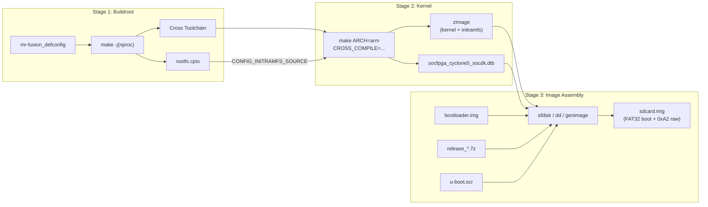
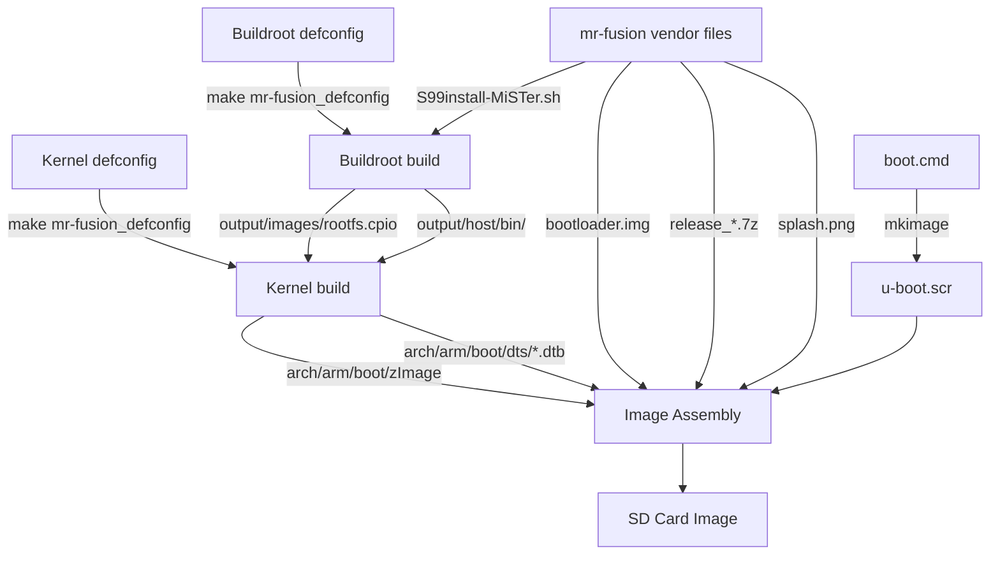
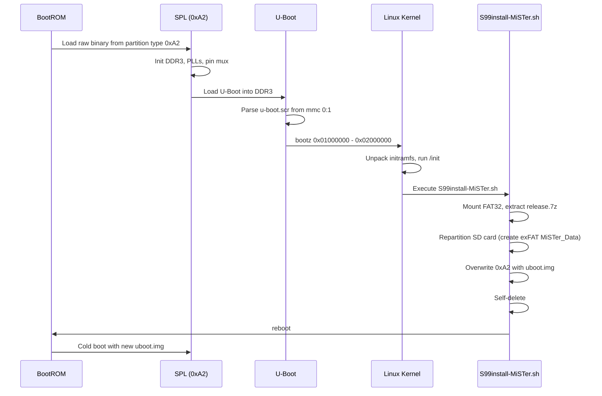

[← Image Build Index](README.md) · [↑ Linux System](../README.md) · [↑ Knowledge Base](../../README.md)

# Image Build Overview

The MiSTer SD card image is the **integration point** where three independent build pipelines converge: Buildroot produces the rootfs, the Linux kernel produces `zImage` (with the rootfs embedded), and the mr-fusion orchestration provides the bootloader, release archive, and install script. This article shows how those pipelines connect and which article covers each stage in depth.

> [!NOTE]
> This is an **architectural overview** of the image build pipeline. For the hands-on end-to-end tutorial (workspace setup, every command, first-boot verification), see the [Buildroot Linux for DE10-Nano — Comprehensive](../Buildroot%20Linux%20for%20DE10-Nano%20-%20Comprehensive.md) guide. For SD card partition mechanics and image assembly details, see [Image Generation](image_generation.md).

---

## 1. The Three-Stage Pipeline

### 1.1 Stage 1 — Buildroot

Buildroot bootstraps a cross-compilation toolchain and compiles the minimal user-space packages (BusyBox, p7zip, exfatprogs, util-linux, fbv). The output is a compressed `rootfs.cpio` archive — the entire MiSTer userspace.

**Key artifact:** `buildroot/output/images/rootfs.cpio`

**Detailed coverage:** [Buildroot Overview](../buildroot/buildroot_overview.md) — architecture, defconfig model, package model, output structure, cross-toolchain bootstrap

**Configuration:** [MiSTer Defconfig Walkthrough](../buildroot/mister_defconfig.md) — line-by-line defconfig reference

**Customization:** [Custom Packages](../buildroot/custom_packages.md) — adding WiFi firmware, RetroAchievements deps, general patterns

### 1.2 Stage 2 — Linux Kernel

The MiSTer-patched Linux kernel (branch `MiSTer-v5.15`) is cross-compiled with the toolchain that Buildroot produced. The `rootfs.cpio` is embedded into the kernel `zImage` via `CONFIG_INITRAMFS_SOURCE`, creating a self-contained boot image.

**Key artifacts:**
- `linux-kernel/arch/arm/boot/zImage` — kernel + embedded initramfs
- `linux-kernel/arch/arm/boot/dts/socfpga_cyclone5_socdk.dtb` — device tree blob

**Detailed coverage:** [HPS Linux — Kernel](../kernel/) — kernel patches, device tree, FPGA Manager driver

### 1.3 Stage 3 — Image Assembly

The compiled artifacts are assembled into a bootable SD card image with a legacy MBR partition table:

| Partition | Type | Contents |
|---|---|---|
| 1 | `0x0B` (FAT32) | `zImage`, DTB, `u-boot.scr`, `release_*.7z`, splash, scripts |
| 2 | `0xA2` (Altera raw) | `bootloader.img` (installer) → later replaced by `uboot.img` |

**Detailed coverage:** [Image Generation](image_generation.md) — partition layout, `sfdisk`/`dd` manual assembly, `genimage` Docker pipeline, boot script compilation, first-boot lifecycle

---

## 2. Artifact Dependency Graph

**Critical path:** Buildroot must complete before the kernel build starts, because the kernel consumes both the cross-toolchain (`output/host/bin/`) and the rootfs (`output/images/rootfs.cpio`). The image assembly has no further build dependencies — it is pure file copying and partition formatting.

Source: Pipeline verified against `mr-fusion/Dockerfile`

---

## 3. Input Sources

| Source Repository | Branch | Role in Pipeline |
|---|---|---|
| [`MiSTer-devel/Linux-Kernel_MiSTer`](https://github.com/MiSTer-devel/Linux-Kernel_MiSTer) | `MiSTer-v5.15` | Patched Linux kernel — compiled with Buildroot toolchain |
| [`MiSTer-devel/mr-fusion`](https://github.com/MiSTer-devel/mr-fusion) | `master` | Buildroot defconfig, kernel defconfig, S99install-MiSTer.sh, vendor files |
| [`MiSTer-devel/SD-Installer-Win64_MiSTer`](https://github.com/MiSTer-devel/SD-Installer-Win64_MiSTer) | `master` | Pre-built `release_*.7z` archives |
| [buildroot.org](https://buildroot.org/download.html) | stable tarball | Buildroot source — bootstraps toolchain and rootfs |

---

## 4. First-Boot Lifecycle

After flashing the image to an SD card and powering on the DE10-Nano:

The first boot is a **two-phase** process: the installer image boots once, installs MiSTer, then reboots into the final system. The `0xA2` partition transitions from the factory `bootloader.img` to the MiSTer-patched `uboot.img` during this process.

Source: `mr-fusion/builder/scripts/S99install-MiSTer.sh`

---

## 5. Cross-References

### Build Stage
- [Buildroot Overview](../buildroot/buildroot_overview.md) — Buildroot architecture, defconfig, packages, output
- [MiSTer Defconfig Walkthrough](../buildroot/mister_defconfig.md) — Line-by-line defconfig reference
- [Custom Packages](../buildroot/custom_packages.md) — Adding WiFi, RetroAchievements, general patterns
- [HPS Linux — Kernel](../kernel/) — Kernel patches and configuration
- [HPS Linux — U-Boot](../uboot/) — Boot sequence and U-Boot patches

### Image Stage
- [Image Generation](image_generation.md) — Partition layout, sfdisk/genimage, boot script, first-boot
- [HPS Linux — Filesystem](../filesystem/) — SD card runtime layout (`/media/fat/`)

### Full Tutorial
- [Buildroot Linux for DE10-Nano — Comprehensive](../Buildroot%20Linux%20for%20DE10-Nano%20-%20Comprehensive.md) — Complete step-by-step guide

---

## 6. References

| Source | Path / URL |
|---|---|
| mr-fusion repository | [`MiSTer-devel/mr-fusion`](https://github.com/MiSTer-devel/mr-fusion) |
| mr-fusion Dockerfile | `mr-fusion/Dockerfile` |
| First-boot install script | `mr-fusion/builder/scripts/S99install-MiSTer.sh` |
| MiSTer Linux Kernel | [`MiSTer-devel/Linux-Kernel_MiSTer`](https://github.com/MiSTer-devel/Linux-Kernel_MiSTer) |
| Cyclone V HPS TRM | [Intel 683126](https://www.intel.com/content/www/us/en/docs/programmable/683126/) |
