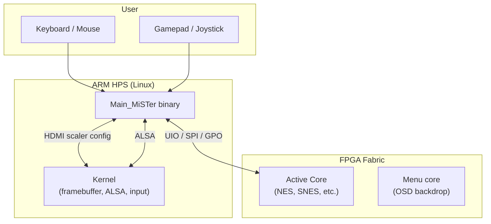
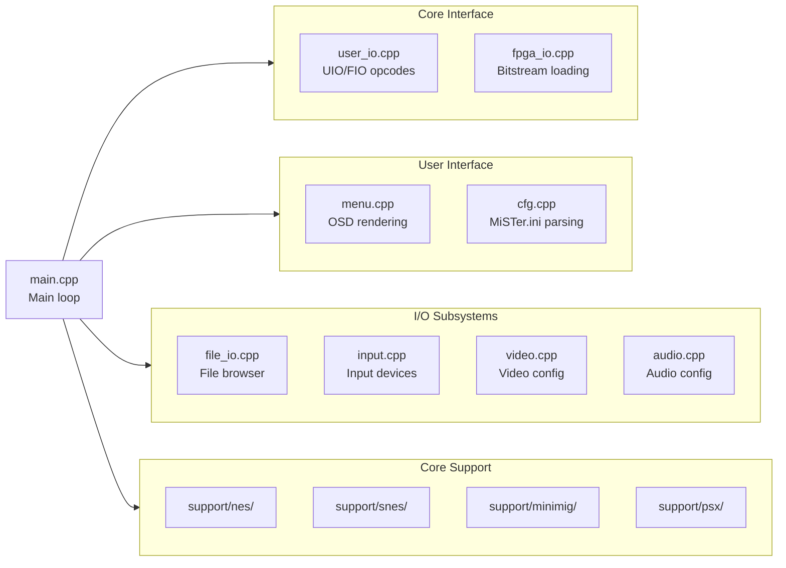
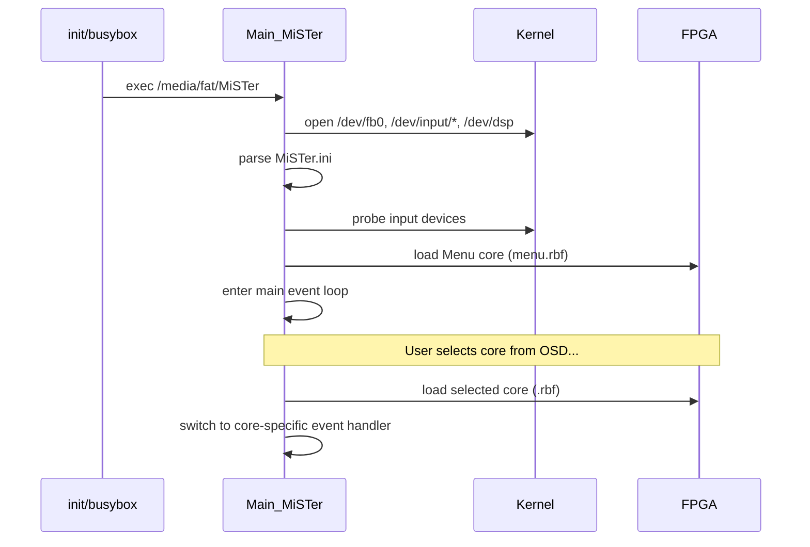

[← HPS Binary Index](../README.md) · [↑ MiSTer Knowledge Base](../../README.md)

# Main_MiSTer Binary Overview

The `Main_MiSTer` binary is the ARM HPS control program that orchestrates every aspect of the MiSTer platform. It loads FPGA cores, renders the OSD menu, handles input devices, manages file I/O, configures video and audio output, and provides the user-facing interface that ties the embedded Linux layer to the FPGA emulation layer. This article covers its architecture, capabilities, startup sequence, and communication patterns.

> [!NOTE]
> This article describes the binary's **runtime architecture** and **feature set**. For build instructions and the cross-compilation toolchain, see [ARM Cross-Compilation Toolchain](toolchain.md).

---

## 1. Role in the MiSTer Stack



`Main_MiSTer` is the single userspace process that bridges the Linux world (input events, filesystem, network) and the FPGA world (cores, video, audio). It is started by init as the primary application and runs for the entire session.

---

## 2. Core Capabilities

| Capability | Description |
|---|---|
| **Core loading** | Loads `.rbf` bitstreams into the FPGA via the FPGA Manager driver; switches between arcade, console, and computer cores |
| **OSD menu** | Renders the on-screen display for core selection, settings, and file browsing using the `Menu` core's framebuffer |
| **File browser** | Navigates the exFAT SD card filesystem (`/media/fat/`) to load ROMs, disk images, and arcade MRA files |
| **Input handling** | Receives Linux input events (`/dev/input/event*`) from keyboards, mice, and gamepads; maps them to core-specific button layouts |
| **Video management** | Configures the HDMI scaler (`ascal.vhd`), selects video modes, applies filters and masks, handles CRT/15 kHz output |
| **Audio routing** | Manages ALSA output to HDMI, I2S, SPDIF, and analog audio; handles volume, audio filters, and resampling |
| **Save state management** | Captures and restores DDR3 snapshots for supported cores; manages rewind buffers |
| **Networking** | SMB/CIFS share mounting, FTP server, SSH daemon control, WiFi script invocation, Tailscale integration |
| **Updates** | Downloads core RBFs, menu RBFs, BIOS files, and system scripts via the updater/downloader framework |
| **Per-core support** | Core-specific emulation helpers: floppy mounting (minimig), CD image mounting (MegaCD, PSX), memory card management |

---

## 3. Module Architecture

The source tree is organized into functional modules:



### 3.1 main.cpp — The Main Loop

The entry point and central event loop:

1. **Initialization**: Parses `MiSTer.ini`, probes input devices, initializes the framebuffer and ALSA
2. **Core load**: If `bootcore` is configured, loads the specified core immediately; otherwise loads the `Menu` core
3. **Event loop**: Blocks on `poll()` for input events, then dispatches to the appropriate handler
4. **Core switching**: When the user selects a different core, unloads the current bitstream and loads the new one

The loop runs at the mercy of Linux input events and FPGA status changes — there is no fixed tick rate.

### 3.2 user_io.cpp — FPGA Communication

The primary bridge between HPS software and FPGA cores. Uses the **UIO** (Userspace I/O) subsystem and a custom opcode protocol over memory-mapped GPO/GPI registers:

| Opcode | Purpose |
|---|---|
| `UIO_SET_STATUS` | Push core status bits (reset, region, video mode) to the FPGA |
| `UIO_GET_STATUS` | Read core status bits (current video mode, disk activity) |
| `UIO_SECTOR_RW` | Read/write disk sectors for floppy/IDE emulation |
| `UIO_SSD_RW` | Read/write solid-state disk images |
| `UIO_ASTICK_1` / `UIO_ASTICK_2` | Send analog stick coordinates |
| `UIO_KEYBOARD` | Send PS/2 scancodes to the core |
| `UIO_MOUSE` | Send mouse deltas and button states |

Source: [`user_io.cpp`](https://github.com/MiSTer-devel/Main_MiSTer/blob/master/user_io.cpp)

### 3.3 menu.cpp — OSD System

Renders the on-screen display using the `Menu` core's dedicated framebuffer. Key features:

- **Layered rendering**: Background (core video), overlay (OSD box), text (menu items)
- **Navigation**: D-pad/keyboard arrow keys move selection; OK/Enter confirms; Back cancels
- **Dynamic content**: Menu items are generated at runtime based on the loaded core's capabilities
- **File picker**: Integrated file browser with filtering (`.rbf`, `.nes`, `.sfc`, etc.)

The OSD is not a separate windowing system — it is a cooperative overlay drawn into the same framebuffer as the core's video output, synchronized to VBlank.

### 3.4 fpga_io.cpp — Bitstream Loading

Handles the low-level FPGA Manager interface to load `.rbf` files:

```c
// Simplified sequence
fpga_load_rbf("/media/fat/_Arcade/cores/MarioBros.rbf");
```

Under the hood:
1. Opens `/dev/fpga0` (FPGA Manager character device)
2. Writes the RBF bitstream to the device
3. The kernel driver programs the FPGA fabric
4. The new core becomes active immediately

> [!WARNING]
> Bitstream loading is a privileged operation requiring root access. The FPGA Manager driver validates the bitstream header but does not verify functional correctness — a malformed RBF will load silently and may crash the HPS-FPGA interface.

### 3.5 file_io.cpp — File Browser

Implements the filesystem navigation logic used by the OSD file picker and core-specific loaders:

- **Path resolution**: Maps logical paths (`games/NESEdit/`) to physical paths on `/media/fat/`
- **Archive handling**: Transparently opens `.zip` files containing ROMs
- **MRA parsing**: Reads arcade MRA XML files to locate merged ROM sets
- **Image mounting**: Attaches disk images (`.adf`, `.iso`, `.chd`) to the core via UIO sector-read opcodes

### 3.6 input.cpp — Input Device Management

Manages all Linux input devices:

| Device Type | Event Source | Mapping |
|---|---|---|
| **Keyboard** | `/dev/input/event*` (EV_KEY) | PS/2 scancodes via UIO |
| **Mouse** | `/dev/input/event*` (EV_REL/EV_ABS) | Mouse deltas via UIO |
| **Gamepad** | `/dev/input/event*` (EV_ABS/EV_KEY) | Button maps via `joymapping.cpp` |
| **SNAC** | Direct FPGA GPIO ( bypasses Linux) | Latency-critical controllers |

`joymapping.cpp` maintains a mapping database that translates Linux `js` event codes to core-specific button layouts. Custom mappings are stored in `/media/fat/inputs/`.

### 3.7 video.cpp — Video Pipeline Control

Configures the MiSTer video output chain:

| Setting | Controlled By | Effect |
|---|---|---|
| **Video mode** | `video_mode` INI option | HDMI output resolution (e.g., 1920x1080@60) |
| **Scaler** | `vscale_mode`, `vsync_adjust` | `ascal.vhd` polyphase scaler configuration |
| **CRT output** | `direct_video`, `ypbpr` | Enables analog video via GPIO or IO board |
| **Filters** | `filter`, `mask` | Scanlines, CRT masks, interpolation |
| **Shadow masks** | `shmask_mode` | LCD/subpixel simulation overlays |

The video module communicates with the kernel's MiSTer framebuffer driver to apply scaler parameters and switch resolutions.

### 3.8 audio.cpp — Audio Output Management

Routes core audio to the appropriate output:

| Output | Driver | Use Case |
|---|---|---|
| **HDMI audio** | ALSA `hw:0,0` | Digital audio embedded in HDMI stream |
| **I2S** | ALSA `hw:0,1` | IO board DAC (analog audio) |
| **SPDIF** | ALSA `hw:0,2` | TOSLink optical audio |
| **Analog** | GPIO PWM | DE10-Nano onboard audio (low quality) |

Audio is received from the core via the HPS-FPGA audio bridge (memory-mapped FIFO) and fed into ALSA.

---

## 4. Startup Sequence



1. **Init launches MiSTer**: The init script (`S99install-MiSTer.sh` in stock Buildroot, or systemd service in alternative distros) executes `/media/fat/MiSTer`
2. **Device probe**: Opens framebuffer, ALSA, and all input event devices
3. **INI parse**: Reads `/media/fat/MiSTer.ini` for user preferences
4. **Menu core load**: Loads `menu.rbf` to provide the OSD backdrop
5. **Event loop**: Waits for user input; loads the selected core on demand

---

## 5. Core Switching

When the user selects a different core from the OSD:

1. **Save state flush**: Writes any pending save data to `/media/fat/`
2. **Bitstream unload**: Resets the FPGA Manager and clears the fabric
3. **New bitstream load**: Writes the new `.rbf` to `/dev/fpga0`
4. **Core initialization**: Sends `UIO_SET_STATUS` with default configuration
5. **File auto-load**: If a ROM/disk image is associated, mounts it via `file_io.cpp`
6. **Input re-map**: Loads the core-specific joymapping profile
7. **Video re-config**: Adjusts scaler settings for the new core's native resolution

The switch takes approximately 1–2 seconds, dominated by bitstream load time (SD card read + FPGA programming).

---

## 6. Configuration (MiSTer.ini)

`Main_MiSTer` reads `/media/fat/MiSTer.ini` at startup. The INI is parsed by `cfg.cpp` and controls:

| Section | Key Options |
|---|---|
| `[MiSTer]` | `video_mode`, `vscale_mode`, `vsync_adjust`, `refresh_min`, `refresh_max` |
| `[video]` | `filter`, `mask`, `shmask_mode`, `scanlines` |
| `[audio]` | `audio_mode`, `volume`, `spdif` |
| `[keyboard]` | `key_menu_as_rgui`, `keyrah_mode` |
| `[joystick]` | `joy_key_map`, `joy_analog_map` |
| `[boot]` | `bootcore`, `bootcore_timeout` |

Per-core overrides are supported by placing a `MiSTer.ini` in the core's directory (e.g., `/media/fat/_Console/NES_MiSTer.ini`).

---

## 7. Vendored Libraries

`Main_MiSTer` statically links all dependencies. No external shared libraries are required at runtime:

| Library | Purpose |
|---|---|
| `libco` | Cooperative coroutines for save-state serialization |
| `miniz` | ZIP decompression for ROM archives |
| `md5` | ROM checksum verification |
| `lzma` | 7z/LZMA archive support |
| `zstd` | Zstandard decompression (CHD images) |
| `libchdr` | MAME CHD hard disk image format |
| `imlib2` | Image loading for OSD backgrounds and screenshots |
| `bluetooth` | Bluetooth gamepad pairing and HID support |

---

## 8. Platform Context

| Aspect | Main_MiSTer Binary |
|---|---|
| **Architecture** | ARMv7-A 32-bit (Cortex-A9) |
| **Language** | C (core logic) + C++ (support modules) |
| **Compiler** | GCC 10.2 (ARM hard-float) |
| **Binary size** | ~2–3 MB (stripped) |
| **Memory footprint** | ~20–50 MB RAM (depends on scaler and save-state buffers) |
| **Runtime dependencies** | None (statically linked) |
| **Kernel dependencies** | FPGA Manager, MiSTer framebuffer, ALSA, input subsystem |
| **Init system** | Started by BusyBox init (stock) or systemd (alternative distros) |

---

## 9. Cross-References

- [ARM Cross-Compilation Toolchain](toolchain.md) — Building `Main_MiSTer` from source
- [Buildroot Overview](../../03_hps_linux/buildroot/buildroot_overview.md) — The stock rootfs that launches `Main_MiSTer`
- [Alternative Linux Distributions](../../03_hps_linux/alternative_distros.md) — Running `Main_MiSTer` on Debian/Arch instead of Buildroot
- [UIO Command Reference](../../17_references/uio_command_reference.md) — Complete opcode table for `user_io.cpp`
- [FPGA Subsystem — sys_top](../../06_fpga_subsystem/sys_top.md) — How the FPGA side interfaces with the HPS binary
- [FPGA Subsystem — FPGA Loading](../../06_fpga_subsystem/fpga_loading.md) — FPGA Manager bitstream loading details
- [Configuration — MiSTer.ini](../../05_configuration/mister_ini_guide.md) — User-facing INI guide

---

## 10. References

| Source | Path / URL |
|---|---|
| Main_MiSTer Source | [`MiSTer-devel/Main_MiSTer`](https://github.com/MiSTer-devel/Main_MiSTer) |
| Main_MiSTer Makefile | [`Main_MiSTer/Makefile`](https://github.com/MiSTer-devel/Main_MiSTer/blob/master/Makefile) |
| UIO / FIO Opcodes | [`user_io.cpp`](https://github.com/MiSTer-devel/Main_MiSTer/blob/master/user_io.cpp) |
| FPGA Manager Driver | [`MiSTer-devel/Linux-Kernel_MiSTer`](https://github.com/MiSTer-devel/Linux-Kernel_MiSTer) |
| MiSTer Wiki | [github.com/MiSTer-devel/Main_MiSTer/wiki](https://github.com/MiSTer-devel/Main_MiSTer/wiki) |
