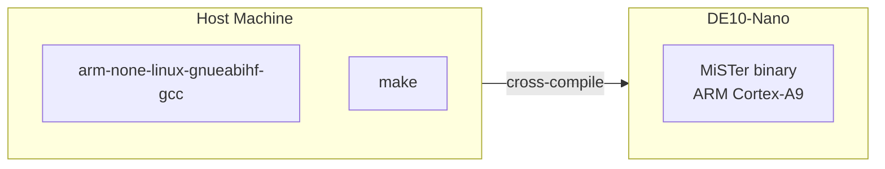

[← HPS Binary Index](../README.md) · [↑ MiSTer Knowledge Base](../../README.md)

# ARM Cross-Compilation Toolchain

How to set up the ARM GCC 10.2 cross-compilation toolchain for building the `Main_MiSTer` binary and user utilities on Linux, Windows (WSL2), and macOS. Covers toolchain download, PATH configuration, the Makefile structure, and a Docker-based alternative for macOS Apple Silicon.

> [!NOTE]
> This article covers the **HPS binary toolchain** (`arm-none-linux-gnueabihf`) used to compile the `Main_MiSTer` binary and user C/C++ utilities. It does not cover the Buildroot internal toolchain (`arm-buildroot-linux-gnueabihf-`) used for the Linux kernel and rootfs — see [Buildroot Overview](../../03_hps_linux/buildroot/buildroot_overview.md) §6 for that.

---

## 1. Toolchain Overview

The MiSTer `Main_MiSTer` binary is compiled for the DE10-Nano's ARM Cortex-A9 HPS. The canonical toolchain is the **Arm GNU Toolchain** (GCC 10.2.1), which produces `arm-none-linux-gnueabihf` binaries:

| Property | Value |
|---|---|
| **Target triplet** | `arm-none-linux-gnueabihf` |
| **GCC version** | 10.2.1 |
| **Target CPU** | ARM Cortex-A9 (ARMv7-A) |
| **ABI** | hard-float (gnueabihf) |
| **Host architectures** | x86_64 Linux, WSL2, macOS (via Docker) |



Source: [`Main_MiSTer/Makefile`](https://github.com/MiSTer-devel/Main_MiSTer/blob/master/Makefile)

---

## 2. Linux and WSL2 Setup

### 2.1 Install Prerequisites

```bash
sudo apt update && sudo apt upgrade -y
sudo apt-get install -y build-essential git libncurses-dev flex bison \
    openssl libssl-dev dkms libelf-dev libudev-dev libpci-dev \
    libiberty-dev autoconf liblz4-tool bc curl gcc git libssl-dev \
    libncurses5-dev lzop make u-boot-tools libgmp3-dev libmpc-dev
```

Source: [MiSTer FPGA Documentation — Compiling for MiSTer](https://mister-devel.github.io/MkDocs_MiSTer/developer/mistercompile/)

### 2.2 Download the Toolchain

```bash
wget -c https://developer.arm.com/-/media/Files/downloads/gnu-a/10.2-2020.11/binrel/gcc-arm-10.2-2020.11-x86_64-arm-none-linux-gnueabihf.tar.xz
```

> [!WARNING]
> This URL points to the **GNU-A 10.2-2020.11** release. Arm periodically reorganizes download URLs. If the link is broken, navigate to [developer.arm.com/downloads/-/arm-gnu-toolchain-downloads](https://developer.arm.com/downloads/-/arm-gnu-toolchain-downloads) and locate the `gcc-arm-10.2-2020.11-x86_64-arm-none-linux-gnueabihf` archive manually.

### 2.3 Extract and Configure PATH

```bash
# Extract to /opt (or any directory you prefer)
sudo tar xf gcc-arm-10.2-2020.11-x86_64-arm-none-linux-gnueabihf.tar.xz -C /opt

# Add to PATH for the current session
export PATH=/opt/gcc-arm-10.2-2020.11-x86_64-arm-none-linux-gnueabihf/bin:$PATH

# Verify
arm-none-linux-gnueabihf-gcc --version
# Expected: gcc version 10.2.1 20201103 (GNU Toolchain for the A-profile Architecture 10.2-2020.11 (arm-10.16))
```

### 2.4 Persistent PATH (Optional)

To make the PATH persistent across terminal sessions, add the export to your shell profile:

```bash
echo 'export PATH=/opt/gcc-arm-10.2-2020.11-x86_64-arm-none-linux-gnueabihf/bin:$PATH' >> ~/.bashrc
source ~/.bashrc
```

> [!NOTE]
> The official MiSTer documentation recommends using the `export` approach per-session rather than permanently modifying your profile. This avoids conflicts if you work with multiple ARM toolchains.

---

## 3. macOS Setup

The Arm GNU Toolchain is built for x86_64 Linux. It does not run natively on macOS — especially Apple Silicon (ARM64 Macs).

### 3.1 Option A: Docker (Recommended)

Use the community Docker build environment:

```bash
git clone https://github.com/hunson-abadeer/MiSTer-docker-build
cd MiSTer-docker-build
docker build -t mister-quartus .
```

Then compile `Main_MiSTer`:

```bash
git clone https://github.com/MiSTer-devel/Main_MiSTer
cd Main_MiSTer
../MiSTer-docker-build/mister_arm_compile.sh make
```

Source: [hunson-abadeer/MiSTer-docker-build](https://github.com/hunson-abadeer/MiSTer-docker-build)

### 3.2 Option B: Devcontainer

The `Main_MiSTer` repository includes a devcontainer configuration. If your IDE supports devcontainers (VS Code, JetBrains):

1. Open the `Main_MiSTer` folder in VS Code
2. Run **"Reopen in Container"**
3. Run `make` inside the container

> [!NOTE]
> Allocate sufficient RAM to the Docker VM. The community reports that 8 GB is enough for `Main_MiSTer` compilation. If using Colima: `colima start --cpu 4 --memory 8`.

### 3.3 Option C: Linux VM

Run an x86_64 Linux VM (Ubuntu 20.04+ recommended) via UTM, Parallels, or VirtualBox, then follow the Linux setup in §2.

---

## 4. Building Main_MiSTer

Once the toolchain is on PATH, building is straightforward:

```bash
git clone https://github.com/MiSTer-devel/Main_MiSTer.git
cd Main_MiSTer
make -j$(nproc)
```

The Makefile detects the toolchain via the `BASE` variable:

```makefile
BASE  = arm-none-linux-gnueabihf
CC    = $(BASE)-gcc
LD    = $(BASE)-ld
STRIP = $(BASE)-strip
```

Output files:

| File | Description |
|---|---|
| `bin/MiSTer` | Stripped release binary |
| `bin/MiSTer.elf` | Unstripped binary with symbols |

### 4.1 Debug Build

```bash
make DEBUG=1 -j$(nproc)
```

Produces an unstripped binary with `-O0 -g` for debugging.

### 4.2 Profiling Build

```bash
make PROFILING=1 -j$(nproc)
```

Enables the `PROFILING` preprocessor flag for performance analysis.

---

## 5. Cross-Compiling User Utilities

The same toolchain compiles standalone utilities for MiSTer:

```bash
arm-none-linux-gnueabihf-gcc -o myutil myutil.c -static
scp myutil root@mister:/media/fat/
```

### 5.1 Static vs Dynamic Linking

| Linking | Command | When to use |
|---|---|---|
| **Static** | `...-gcc -static` | Portable; no runtime library dependencies. Binary grows by ~1–2 MB. |
| **Dynamic** | `...-gcc` (default) | Smaller binary; requires compatible `libc.so` on target. |

For utilities deployed to `/media/fat/`, **static linking is recommended** because the runtime library environment varies between stock MiSTer (uClibc-ng) and Entware-modified systems (glibc).

---

## 6. Makefile Deep Dive

The `Main_MiSTer` Makefile is a conventional GNU Make build system with these notable features:

### 6.1 Parallel Builds

```makefile
MAKEFLAGS += "-j$(shell nproc)"
```

The Makefile defaults to using all CPU cores. Override with `make -jN` if you want fewer.

### 6.2 Dependency Generation

The Makefile uses GCC's `-MM` flag to generate `.d` dependency files automatically. This means editing a header triggers recompilation of all files that include it.

### 6.3 Binary Resource Embedding

PNG images are embedded as binary blobs using `ld -r -b binary`:

```makefile
$(BUILDDIR)/%.png.o: %.png
	$(LD) -r -b binary -o $@ $<
```

This allows the binary to ship its own UI graphics without external asset files.

### 6.4 Library Dependencies

| Library | Purpose | Path in repo |
|---|---|---|
| `libco` | Coroutine support | `lib/libco/` |
| `miniz` | ZIP decompression | `lib/miniz/` |
| `md5` | MD5 hashing | `lib/md5/` |
| `lzma` | 7z/LZMA decompression | `lib/lzma/` |
| `zstd` | Zstandard decompression | `lib/zstd/lib/` |
| `libchdr` | CHD (MAME compressed HDD) support | `lib/libchdr/` |
| `imlib2` | Image loading | `lib/imlib2/` |
| `bluetooth` | Bluetooth stack | `lib/bluetooth/` |

All libraries are vendored (shipped in-repo) — no external package manager needed.

---

## 7. Platform Context

| Host OS | Recommended Method | Toolchain Path |
|---|---|---|
| **Linux (native)** | Direct install (§2) | `/opt/gcc-arm-10.2-2020.11-x86_64-arm-none-linux-gnueabihf/bin/` |
| **Windows (WSL2)** | Same as Linux (§2) | Same as Linux |
| **macOS (Intel)** | Docker or Linux VM (§3.1 / §3.3) | Inside Docker container |
| **macOS (Apple Silicon)** | Docker with devcontainer (§3.1 / §3.2) | Inside Docker container |

---

## 8. Troubleshooting

| Symptom | Cause | Fix |
|---|---|---|
| `arm-none-linux-gnueabihf-gcc: command not found` | PATH not set | Run the `export PATH=...` command from §2.3 |
| `make: arm-none-linux-gnueabihf-gcc: No such file or directory` | Missing 32-bit libs on x86_64 | `sudo apt-get install libc6-i386 lib32stdc++6` |
| `undefined reference to '__atomic_fetch_add_8'` | Missing libatomic linking | Add `-latomic` to LFLAGS |
| macOS: `bad CPU type in executable` | Running x86_64 toolchain on Apple Silicon | Use Docker (§3.1) |
| Build fails with `libimlib2` errors | Missing freetype/png/zlib dev libs | Install host libs: `sudo apt-get install libfreetype6-dev libpng-dev libz-dev` |

---

## 9. Cross-References

- [Buildroot Overview](../../03_hps_linux/buildroot/buildroot_overview.md) — Buildroot internal toolchain (`arm-buildroot-linux-gnueabihf-`) for kernel/rootfs
- [Package Management](../../03_hps_linux/buildroot/package_management.md) — Deploying cross-compiled binaries to `/media/fat/`
- [MiSTer FPGA Docs — Compiling for MiSTer](https://mister-devel.github.io/MkDocs_MiSTer/developer/mistercompile/) — Official upstream compilation guide
- [Main_MiSTer Makefile](https://github.com/MiSTer-devel/Main_MiSTer/blob/master/Makefile) — Source of build configuration

---

## 10. References

| Source | Path / URL |
|---|---|
| Arm GNU Toolchain Downloads | [developer.arm.com/downloads/-/arm-gnu-toolchain-downloads](https://developer.arm.com/downloads/-/arm-gnu-toolchain-downloads) |
| MiSTer Compile Guide | [mister-devel.github.io/MkDocs_MiSTer/developer/mistercompile](https://mister-devel.github.io/MkDocs_MiSTer/developer/mistercompile/) |
| Main_MiSTer Makefile | [`MiSTer-devel/Main_MiSTer/Makefile`](https://github.com/MiSTer-devel/Main_MiSTer/blob/master/Makefile) |
| MiSTer Docker Build | [`hunson-abadeer/MiSTer-docker-build`](https://github.com/hunson-abadeer/MiSTer-docker-build) |
