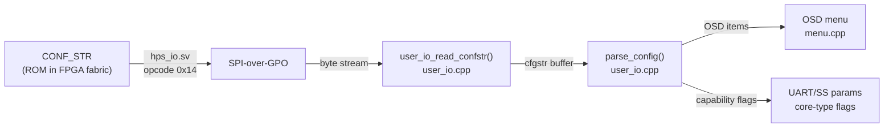
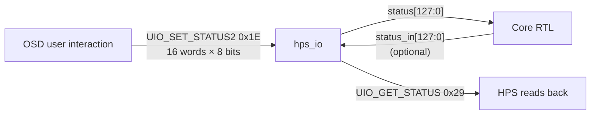
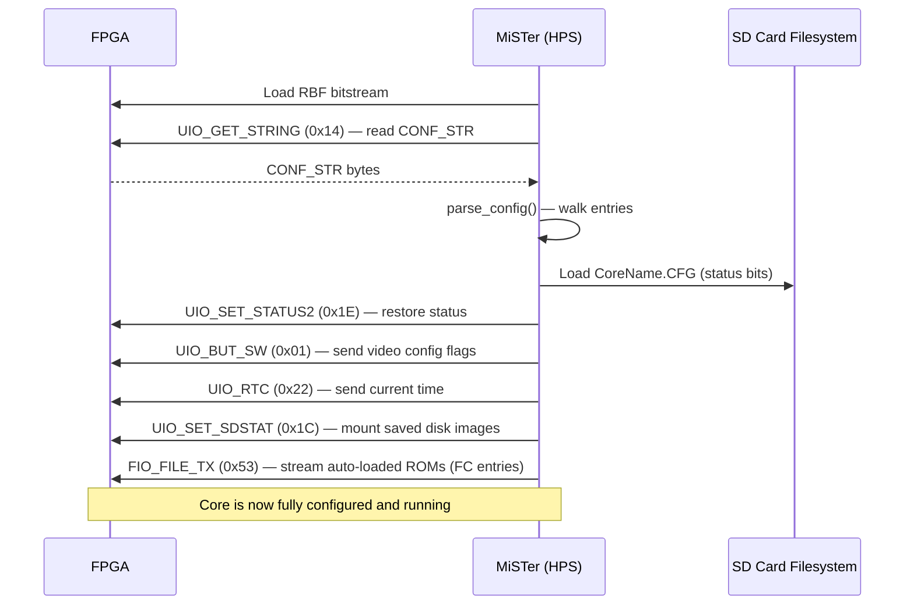

[← Configuration Index](README.md)

# Core Configuration String (`CONF_STR`)

The `CONF_STR` is the primary mechanism for an FPGA core to declare its capabilities, define its On-Screen Display (OSD) menu structure, and establish bidirectional state communication with the HPS binary. 

This document serves as the technical reference for core developers integrating the `CONF_STR` mechanism into their RTL.

---

## 1. Architectural Overview

`CONF_STR` is a SystemVerilog `localparam` string literal embedded directly in the core's RTL. It simultaneously:
- Declares the OSD menu hierarchy visible to the user.
- Binds each OSD item to specific bits in the 128-bit `status` register.
- Announces the core name, version, hardware capabilities (UART speeds, save state location), and file slot types.

### How It Reaches the HPS



The FPGA stores the string in a ROM synthesised from the `localparam`:

```verilog
// hps_io.sv — CONF_STR ROM
localparam STRLEN = $size(CONF_STR) >> 3;   // byte count
reg [7:0] conf_byte;
always @(*) conf_byte = CONF_STR[{(STRLEN-1-byte_cnt), 3'd0} +:8];

// Opcode 0x14: byte-by-byte readout
'h14: if(byte_cnt <= STRLEN) io_dout[7:0] <= conf_byte;
```

The HPS reads it character by character until a null byte. The total buffer size in the HPS is 10 KB (`cfgstr[1024 * 10]`), sufficient for the largest cores.

---

## 2. Format Reference

The string is a sequence of semicolon-delimited entries. Entry index 0 is the core name; index 1 is the capability string; indices 2+ are OSD items.

```
"CoreName;;"                ← [0] Core name (shown in OSD header)
"SS20000000:800000,UART...;" ← [1] Hardware capabilities
"OSD item 1;"               ← [2] First OSD menu item
"OSD item 2;"               ← [3] ...
```

### 2.1 Entry 0 — Core Name

```
"Template;;"
```
The name after the first `;` and up to the second `;` is the core name shown in the OSD and used as the save-state / config file prefix.

### 2.2 Entry 1 — Capabilities

Comma-delimited capability tokens (order-independent):

| Token | Syntax | Meaning |
|---|---|---|
| Save state | `SS<base>:<size>` | DDR3 address + byte count for save states |
| UART | `UART<baud>(label):...` | Supported UART baud rates with optional labels |
| MIDI | `MIDI<baud>:...` | MIDI baud rates |

Example:
```
"SS20000000:800000,UART115200,31250(MIDI),9600;"
```

### 2.3 Entry 2+ — OSD Menu Items

Each entry starts with a **type letter** (case-sensitive):

| Type | Syntax | Description |
|---|---|---|
| `O` / `o` | `O[end:start],Label,Val0,Val1,...` | Option — maps bits to values |
| `OX` | `OX[bit],Label,Off,On,...` | Special option with side-effects |
| `T` | `T[bit],Label` | Trigger — momentary button, auto-clears |
| `R` | `R[bit],Label` | Reset trigger — resets and closes OSD |
| `S` | `S<n>,EXT1EXT2` | SD card slot N with accepted extensions |
| `SC` | `SC<n>,EXT` | SD card slot N, auto-mount on core start |
| `F` | `F<n>,EXT,Label` | File loader slot N |
| `FC` | `FC<n>,EXT,Label,<addr>` | File loader slot N with DDR3 load address |
| `FS` | `FS<n>,EXT,Label` | File loader/saver (save support) |
| `J` | `J[D\|A\|N][1],Btn0,...` | Joystick button names |
| `P` | `P<n>,Page Label` | Sub-page header |
| `P<n>` | Prefix any entry | Place entry in sub-page N |
| `V` | `V,v<string>` | Version string appended to core name |
| `v` | `v,<number>` | Config version (0–99) for CFG reset |
| `C` | `C` | Enable cheat support |
| `X` | `X` | Disable OSD entirely |
| `-` | `-` or `-,Label` | Separator / section header in OSD |
| `DEFMRA` | `DEFMRA,<path>` | Default MRA file for arcade cores |
| `DIP` | `DIP` | DIP switch support declaration |
| `H<n>` prefix | `H<n>O...` | Hide item when status bit `n` is set |
| `D<n>` prefix | `D<n>O...` | Disable item when status bit `n` is set |
| `h<n>` prefix | `h<n>O...` | Hide item when status bit `n` is **clear** |
| `d<n>` prefix | `d<n>O...` | Disable item when status bit `n` is **clear** |

### 2.4 Bit Index Syntax

Status bits are addressed in two styles:

| Style | Example | Meaning |
|---|---|---|
| Hex range `[end:start]` | `O[4:3]` | Bits 4 down to 3 (2 bits) |
| Hex range `[bit]` | `O[2]` | Single bit 2 |
| Legacy hex single | `O2` | Bit 2 (legacy — no bracket) |
| Legacy hex range | `O43` | Bits 4:3 (legacy) |
| Extended `o` | `o[4:3]` | Same as `O` but in the upper 96-bit range (+32) |

Bits 0–31 are the **lower** status word; bits 32–127 are the **upper** extension. Bit 0 is hardwired as the system reset trigger.

---

## 3. Full Example — Template Core

```verilog
localparam CONF_STR = {
    "Template;;",                              // [0] core name
    "-;",                                      // separator
    "O[122:121],Aspect ratio,Original,Full Screen,[ARC1],[ARC2];",
    "O[2],TV Mode,NTSC,PAL;",
    "O[4:3],Noise,White,Red,Green,Blue;",
    "-;",
    "P1,Test Page 1;",                         // sub-page 1 header
    "P1-;",
    "P1O[5],Option 1-1,Off,On;",              // in page 1
    "d0P1F1,BIN;",                            // disabled when bit 0 set
    "H0P1O[10],Option 1-2,Off,On;",           // hidden when bit 0 set
    "-;",
    "P2,Test Page 2;",
    "P2S0,DSK;",                               // SD slot 0, .DSK files
    "P2O[7:6],Option 2,1,2,3,4;",
    "-;",
    "T[0],Reset;",                             // momentary reset
    "R[0],Reset and close OSD;",
    "v,0;",                                    // config version 0
    "V,v", `BUILD_DATE                         // version display
};
```

---

## 4. Status Register — 128-bit `status[127:0]`

The `status` register is the primary bidirectional configuration channel:



The 128-bit `status` register is presented to the core as a standard wire — no polling needed; updates take effect on the next clock cycle after the SSPI transaction completes.

---

## 5. `parse_config()` Interpretation

After reading `CONF_STR`, `parse_config()` in `user_io.cpp` interprets the string:
- Generates dynamic OSD UI elements.
- Maps `J` options to `joy_transl` (digital↔analog translation mode).
- Immediately streams `FC` (auto-load) files via `user_io_file_tx()`.
- Auto-mounts `SC` disk images from `CoreName.s0`.
- Evaluates `H` / `D` masks dynamically on each OSD render cycle.

---

## 6. Per-Core `.CFG` Files

MiSTer saves and restores each core's OSD status bits to a small binary file:

```
/media/fat/config/<CoreName>.CFG        ← current status[] bytes
/media/fat/config/<CoreName>_vN.CFG     ← with config version suffix
```

The 16-byte `cur_status[]` is the shadow of the `status[127:0]` register on the HPS side. On next core load, it is re-sent to the FPGA via `UIO_SET_STATUS2`.

> [!TIP]
> If the core's `v,<N>` config version in `CONF_STR` changes, the CFG filename includes the version suffix — ensuring old settings don't carry over when bit options are rearranged.

---

## 7. Configuration Flow at Core Load



---

## Read Also
- [MiSTer INI Guide](mister_ini_guide.md) — The global user configuration file
- [System Architecture](../01_system_architecture/platform_architecture.md)
- [Main_MiSTer Architecture](../04_hps_binary/build/overview.md)
