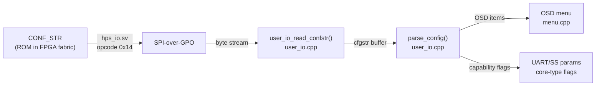
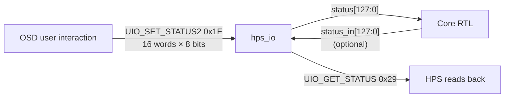
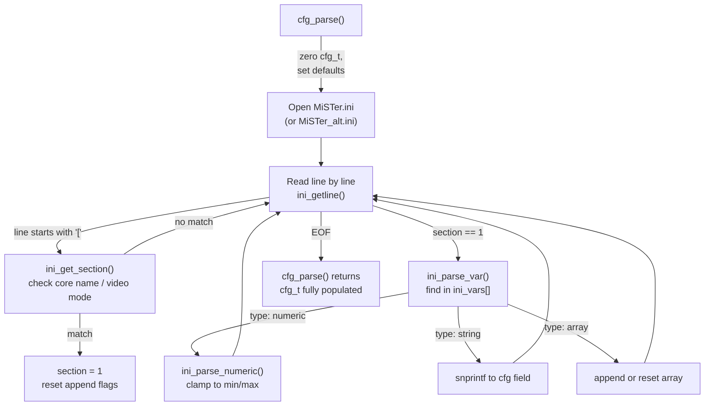
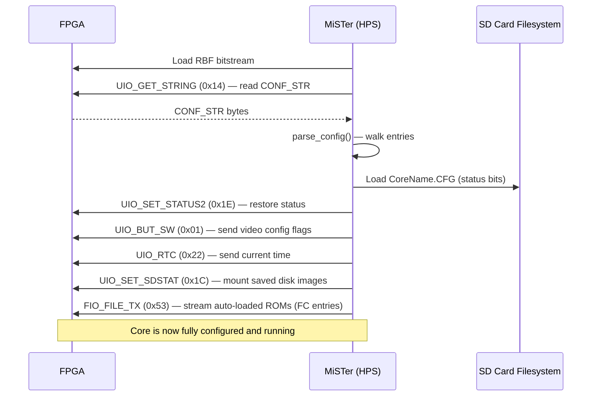

[← Configuration](../README.md)

# Core Configuration Mechanisms

MiSTer provides two orthogonal configuration systems that work together:

1. **CONF_STR** — a string compiled into the FPGA bitstream that declares the
   core's OSD menu structure and maps it to 128-bit status bits.
2. **MiSTer.ini** — a global INI file on the SD card read by the HPS binary
   at startup, controlling system-wide and core-specific hardware settings.

Sources: `cores/Template_MiSTer/Template.sv`, `cores/Template_MiSTer/sys/hps_io.sv`,
`Main_MiSTer/user_io.cpp`, `Main_MiSTer/cfg.cpp`, `Main_MiSTer/cfg.h`

---

## 1. CONF_STR — Core Configuration String

### What It Is

`CONF_STR` is a SystemVerilog `localparam` string literal embedded directly in
the core's RTL.  It simultaneously:
- Declares the OSD menu hierarchy visible to the user.
- Binds each OSD item to specific bits in the 128-bit `status` register.
- Announces the core name, version, hardware capabilities (UART speeds, save
  state location), and file slot types.

### How It Reaches the HPS



The FPGA stores the string in a ROM synthesised from the `localparam`:

```verilog
// hps_io.sv — CONF_STR ROM
localparam STRLEN = $size(CONF_STR) >> 3;   // byte count
reg [7:0] conf_byte;
always @(*) conf_byte = CONF_STR[{(STRLEN-1-byte_cnt), 3'd0} +:8];

// Opcode 0x14: byte-by-byte readout
'h14: if(byte_cnt <= STRLEN) io_dout[7:0] <= conf_byte;
```

The HPS reads it character by character until a null byte:

```c
// user_io.cpp
void user_io_read_confstr() {
    spi_uio_cmd_cont(UIO_GET_STRING);  // 0x14, assert IO CS
    uint32_t j = 0;
    while (j < sizeof(cfgstr) - 1) {
        char c = spi_in();             // read one byte
        if (!c) break;                 // null = end of string
        cfgstr[j++] = c;
    }
    cfgstr[j] = 0;
    DisableIO();
}
```

Total buffer: 10 KB (`cfgstr[1024 * 10]`), sufficient for the largest cores.

---

### CONF_STR Format Reference

The string is a sequence of semicolon-delimited entries.  Entry index 0 is the
core name; index 1 is the capability string; indices 2+ are OSD items.

```
"CoreName;;"                ← [0] Core name (shown in OSD header)
"SS20000000:800000,UART...;" ← [1] Hardware capabilities
"OSD item 1;"               ← [2] First OSD menu item
"OSD item 2;"               ← [3] ...
```

#### Entry 0 — Core Name

```
"Template;;"
```
The name after the first `;` and up to the second `;` is the core name shown
in the OSD and used as the save-state / config file prefix.

#### Entry 1 — Capabilities

Comma-delimited capability tokens (order-independent):

| Token | Syntax | Meaning |
|---|---|---|
| Save state | `SS<base>:<size>` | DDR3 address + byte count for save states |
| UART | `UART<baud>(label):...` | Supported UART baud rates with optional labels |
| MIDI | `MIDI<baud>:...` | MIDI baud rates |

Example:
```
"SS20000000:800000,UART115200,31250(MIDI),9600;"
```

#### Entry 2+ — OSD Menu Items

Each entry starts with a **type letter** (case-sensitive):

| Type | Syntax | Description |
|---|---|---|
| `O` / `o` | `O[end:start],Label,Val0,Val1,...` | Option — maps bits to values |
| `OX` | `OX[bit],Label,Off,On,...` | Special option with side-effects |
| `T` | `T[bit],Label` | Trigger — momentary button, auto-clears |
| `R` | `R[bit],Label` | Reset trigger — resets and closes OSD |
| `S` | `S<n>,EXT1EXT2` | SD card slot N with accepted extensions |
| `SC` | `SC<n>,EXT` | SD card slot N, auto-mount on core start |
| `F` | `F<n>,EXT,Label` | File loader slot N |
| `FC` | `FC<n>,EXT,Label,<addr>` | File loader slot N with DDR3 load address |
| `FS` | `FS<n>,EXT,Label` | File loader/saver (save support) |
| `J` | `J[D\|A\|N][1],Btn0,...` | Joystick button names |
| `P` | `P<n>,Page Label` | Sub-page header |
| `P<n>` | Prefix any entry | Place entry in sub-page N |
| `V` | `V,v<string>` | Version string appended to core name |
| `v` | `v,<number>` | Config version (0–99) for CFG reset |
| `C` | `C` | Enable cheat support |
| `X` | `X` | Disable OSD entirely |
| `-` | `-` or `-,Label` | Separator / section header in OSD |
| `DEFMRA` | `DEFMRA,<path>` | Default MRA file for arcade cores |
| `DIP` | `DIP` | DIP switch support declaration |
| `H<n>` prefix | `H<n>O...` | Hide item when status bit `n` is set |
| `D<n>` prefix | `D<n>O...` | Disable item when status bit `n` is set |
| `h<n>` prefix | `h<n>O...` | Hide item when status bit `n` is **clear** |
| `d<n>` prefix | `d<n>O...` | Disable item when status bit `n` is **clear** |

#### Bit Index Syntax

Status bits are addressed in two styles:

| Style | Example | Meaning |
|---|---|---|
| Hex range `[end:start]` | `O[4:3]` | Bits 4 down to 3 (2 bits) |
| Hex range `[bit]` | `O[2]` | Single bit 2 |
| Legacy hex single | `O2` | Bit 2 (legacy — no bracket) |
| Legacy hex range | `O43` | Bits 4:3 (legacy) |
| Extended `o` | `o[4:3]` | Same as `O` but in the upper 96-bit range (+32) |

Bits 0–31 are the **lower** status word; bits 32–127 are the **upper** extension.
Bit 0 is hardwired as the system reset trigger.

---

### Full Example — Template Core

```verilog
localparam CONF_STR = {
    "Template;;",                              // [0] core name
    "-;",                                      // separator
    "O[122:121],Aspect ratio,Original,Full Screen,[ARC1],[ARC2];",
    "O[2],TV Mode,NTSC,PAL;",
    "O[4:3],Noise,White,Red,Green,Blue;",
    "-;",
    "P1,Test Page 1;",                         // sub-page 1 header
    "P1-;",
    "P1O[5],Option 1-1,Off,On;",              // in page 1
    "d0P1F1,BIN;",                            // disabled when bit 0 set
    "H0P1O[10],Option 1-2,Off,On;",           // hidden when bit 0 set
    "-;",
    "P2,Test Page 2;",
    "P2S0,DSK;",                               // SD slot 0, .DSK files
    "P2O[7:6],Option 2,1,2,3,4;",
    "-;",
    "T[0],Reset;",                             // momentary reset
    "R[0],Reset and close OSD;",
    "v,0;",                                    // config version 0
    "V,v", `BUILD_DATE                         // version display
};
```

---

### Status Register — 128-bit `status[127:0]`

The `status` register is the primary bidirectional configuration channel:



Write path (HPS → FPGA, opcode `0x1E`):

```c
// user_io.cpp
void user_io_status_set(const char *opt, uint32_t value, int ex)
{
    // compute bit range from "O[4:3]" notation
    int start, end;
    user_io_status_bits(opt, &start, &end, ex);

    // modify cur_status[] byte array
    // ...

    spi_uio_cmd_cont(UIO_SET_STATUS2);           // 0x1E
    for (uint32_t i = 0; i < 16; i += 2)
        spi_w((cur_status[i+1] << 8) | cur_status[i]); // 8 words
    DisableIO();
}
```

FPGA side (`hps_io.sv`):

```verilog
'h1e: begin
    if(byte_cnt < 8) status_in[{byte_cnt[2:0],4'h0} +:16] <= io_din;
end
// At end of transaction:
if(cmd == 'h1e) status <= status_in;
```

The 128-bit `status` register is presented to the core as a standard wire —
no polling needed; updates take effect on the next clock cycle after the
SSPI transaction completes.

---

### `parse_config()` — Server-Side Interpretation

After reading CONF_STR, `parse_config()` in `user_io.cpp` walks each
semicolon-separated entry and:

1. **Entry 0** — sets OSD header name via `OsdCoreNameSet()`.
2. **Entry 1** — extracts `SS`, `UART`, `MIDI` tokens; sets save-state DDR3
   window and baud rate arrays.
3. **Entries 2+** — interprets type letters:
   - `O` / `o` — validates bit ranges, checks for overlaps (printed as warning).
   - `T` / `R` — validate bit index == 1 bit.
   - `J` — sets `joy_transl` (digital↔analog translation mode) and
     `joy_force` (force joystick emulation mode at startup).
   - `F` / `FC` — auto-loads last-used file from `CoreName.f0` config file
     and immediately streams it via `user_io_file_tx()`.
   - `SC` — auto-mounts last-used disk image from `CoreName.s0`.
   - `V` — appends version string to OSD header.
   - `v` — sets `config_ver` suffix used to detect incompatible config changes
     and reset the CFG file.
   - `X` — disables OSD entirely (arcade cores).
   - `C` — enables cheat code subsystem.
   - `OX` — triggers x86-specific side-effects (e.g. FDD boot order).
   - `H` / `D` / `h` / `d` prefixes — set OSD dynamic show/hide masks.

---

## 2. MiSTer.ini — System INI File

### Location and Selection

The HPS binary reads one INI file at startup from the SD card root:

| Filename | Purpose |
|---|---|
| `MiSTer.ini` | Always read (primary) |
| `MiSTer_alt.ini` | Alternative 1 (selectable from OSD) |
| `MiSTer_alt_1.ini` | Alternative 2 |
| `MiSTer_alt_2.ini` | Alternative 3 |

Up to **three** `MiSTer_*.ini` alternates are discovered by scanning the
root directory and sorted alphabetically.

```c
// cfg.cpp
const char* cfg_get_name(uint8_t alt) {
    // alt=0 → "MiSTer.ini"
    // alt=1..3 → names[alt-1] from sorted MiSTer_*.ini list
}
```

### INI Section Matching

The INI file is divided into sections using `[SectionName]` headers.
The parser applies variables **only** from sections that match the current
context:

| Section header | Matches when |
|---|---|
| `[MiSTer]` | Always (global defaults) |
| `[CoreName]` | Core name (exact, case-insensitive) |
| `[CoreName*]` | Core name prefix wildcard |
| `[arcade]` | Any arcade core |
| `[arcade_vertical]` | Any vertical arcade core |
| `[video=<mode>]` | Current video output mode string |
| `+[SectionName]` | Include section even when not primary |

```c
// cfg.cpp ini_get_section()
if (!strcasecmp(buf, "MiSTer") ||
    (is_arcade() && !strcasecmp(buf, "arcade")) ||
    (!strncasecmp(buf, user_io_get_core_name(1), wc_pos) &&  wc_pos >= 0) ||
    (!strcasecmp(buf, user_io_get_core_name(0))))
    return 1;  // section matches
```

This means a single `MiSTer.ini` can contain both global settings and
per-core overrides:

```ini
[MiSTer]
VIDEO_MODE=720p60
VSYNC_ADJUST=1

[SNES]
VIDEO_MODE=1080p60
VSCALE_MODE=2

[MegaCD]
VSYNC_ADJUST=0

[arcade*]
DIRECT_VIDEO=0
```

### INI Variable Reference

All variables are parsed into the `cfg_t` struct (`cfg.h`).  A selection of
the most important ones:

#### Video Output

| Variable | Type | Range | Default | Description |
|---|---|---|---|---|
| `VIDEO_MODE` | string | — | — | HDMI mode (e.g. `720p60`, `1080p60`) |
| `VIDEO_MODE_PAL` | string | — | — | PAL override video mode |
| `VIDEO_MODE_NTSC` | string | — | — | NTSC override video mode |
| `VSYNC_ADJUST` | 0–2 | uint8 | 0 | 0=no adjust, 1=near, 2=exact |
| `VSCALE_MODE` | 0–5 | uint8 | 0 | Vertical scale mode |
| `VSCALE_BORDER` | 0–399 | uint16 | 0 | Top/bottom border in lines |
| `DIRECT_VIDEO` | 0–2 | uint8 | 0 | Bypass HDMI scaler |
| `FORCED_SCANDOUBLER` | 0–1 | uint8 | 0 | Force scan doubler on VGA |
| `VGA_SCALER` | 0–1 | uint8 | 0 | Route HDMI scaler to VGA |
| `VGA_SOG` | 0–1 | uint8 | 0 | Sync-on-Green |
| `COMPOSITE_SYNC` | 0–1 | uint8 | 1 | Composite sync on HSync |
| `DVI_MODE` | 0–2 | uint8 | 2 | 0=HDMI+audio, 1=DVI, 2=auto |
| `HDMI_LIMITED` | 0–2 | uint8 | 0 | HDMI range: 0=full, 1=lim, 2=auto |
| `HDMI_AUDIO_96K` | 0–1 | uint8 | 0 | 96 kHz audio mode |
| `VGA_MODE` | string | — | — | `rgb`, `ypbpr`, `svideo`, `cvbs`, `subcarrier` |
| `NTSC_MODE` | 0–2 | uint8 | 0 | NTSC subcarrier mode |
| `VRR_MODE` | 0–3 | uint8 | 0 | VRR/FreeSync mode |
| `REFRESH_MIN` | 0–150 | float | 0 | VRR min framerate |
| `REFRESH_MAX` | 0–150 | float | 0 | VRR max framerate |
| `HDR` | 0–2 | uint8 | 0 | HDR mode |
| `HDR_MAX_NITS` | 100–10000 | uint16 | 1000 | Peak brightness |

#### Image Quality

| Variable | Type | Range | Default | Description |
|---|---|---|---|---|
| `VIDEO_BRIGHTNESS` | 0–100 | uint8 | 50 | Brightness |
| `VIDEO_CONTRAST` | 0–100 | uint8 | 50 | Contrast |
| `VIDEO_SATURATION` | 0–100 | uint8 | 100 | Saturation |
| `VIDEO_HUE` | 0–360 | uint16 | 0 | Hue rotation in degrees |
| `VIDEO_GAIN_OFFSET` | string | — | `1,0,1,0,1,0` | RGB gain/offset pairs |
| `VFILTER_DEFAULT` | string | — | — | Default scaler filter file |
| `VFILTER_VERTICAL_DEFAULT` | string | — | — | Vertical game filter |
| `VFILTER_SCANLINES_DEFAULT` | string | — | — | Scanlines filter |
| `VFILTER_INTERLACE_DEFAULT` | string | — | — | Interlace filter |
| `SHMASK_DEFAULT` | string | — | — | Default shadow mask file |
| `SHMASK_MODE_DEFAULT` | 0–255 | uint8 | 0 | Shadow mask mode |
| `AFILTER_DEFAULT` | string | — | — | Default audio filter |
| `PRESET_DEFAULT` | string | — | — | Default scaler preset |

#### Input

| Variable | Type | Range | Default | Description |
|---|---|---|---|---|
| `KEYRAH_MODE` | hex32 | — | 0 | Keyrah USB-serial keyboard mode |
| `KEY_MENU_AS_RGUI` | 0–1 | uint8 | 0 | Map Menu key to Right GUI |
| `RESET_COMBO` | 0–3 | uint8 | 0 | Key combo for reset |
| `KBD_NOMOUSE` | 0–1 | uint8 | 0 | Disable keyboard mouse emulation |
| `MOUSE_THROTTLE` | 1–100 | uint8 | — | Mouse speed percentage |
| `SNIPER_MODE` | 0–1 | uint8 | 0 | Mouse sniper (slow) mode |
| `GAMEPAD_DEFAULTS` | 0–1 | uint8 | 0 | Load gamepad defaults |
| `JAMMA_VID/PID` | hex16 | — | — | JAMMA adapter USB VID/PID |
| `SPINNER_VID/PID` | hex16 | — | — | Spinner device VID/PID |
| `SPINNER_AXIS` | 0–2 | uint8 | — | Spinner device axis |
| `SPINNER_THROTTLE` | ±10000 | int32 | — | Spinner speed / inversion |
| `RUMBLE` | 0–1 | uint8 | 1 | Enable force feedback |
| `WHEEL_FORCE` | 0–100 | uint8 | 50 | Wheel force percent |
| `WHEEL_RANGE` | 0–1000 | uint16 | — | Wheel rotation range |
| `AUTOFIRE_RATES` | string | — | `10,15,30` | Autofire rates in Hz |
| `AUTOFIRE_ON_DIRECTIONS` | 0–1 | uint8 | 0 | Autofire on D-pad dirs |
| `DISABLE_AUTOFIRE` | 0–1 | uint8 | 0 | Disable autofire globally |
| `PLAYER_N_CONTROLLER` | string array | — | — | Assign controller to player N |
| `DEADZONE` | string array | — | — | Per-device analog deadzone |

#### System / Boot

| Variable | Type | Range | Default | Description |
|---|---|---|---|---|
| `BOOTCORE` | string | — | — | Core to load at boot |
| `BOOTCORE_TIMEOUT` | 2–30 | int16 | — | Seconds before auto-boot |
| `BOOTSCREEN` | 0–1 | uint8 | 1 | Show boot logo |
| `LOGO` | 0–1 | uint8 | 1 | Show MiSTer logo in menu |
| `FONT` | string | — | — | Custom OSD font file path |
| `OSD_TIMEOUT` | 0–3600 | int16 | — | Auto-hide OSD after N seconds |
| `OSD_ROTATE` | 0–2 | uint8 | 0 | Rotate OSD for vertical games |
| `RECENTS` | 0–1 | uint8 | 0 | Show recent files |
| `BROWSE_EXPAND` | 0–1 | uint8 | 1 | Expand file browser |
| `RBF_HIDE_DATECODE` | 0–1 | uint8 | 0 | Hide date code in core name |
| `SHARED_FOLDER` | string | — | — | Path for shared Linux folder |
| `WAITMOUNT` | string | — | — | Wait for USB drive to mount |
| `FB_SIZE` | 0–4 | uint8 | 0 | Framebuffer size for fb_terminal |
| `FB_TERMINAL` | 0–1 | uint8 | 1 | Show Linux terminal on framebuffer |
| `MENU_PAL` | 0–1 | uint8 | 0 | Use PAL for menu core |
| `VIDEO_OFF` | 0–3600 | int16 | — | Power off video after N seconds |
| `DEBUG` | 0–1 | uint8 | 0 | Enable verbose logging to stdout |
| `LOOKAHEAD` | 0–3 | uint8 | 2 | HDMI audio lookahead frames |
| `CONTROLLER_INFO` | 0–10 | uint8 | 6 | Seconds to show controller info |
| `VIDEO_INFO` | 0–10 | uint8 | — | Seconds to show video info |
| `HDMI_GAME_MODE` | 0–1 | uint8 | 0 | HDMI game mode flag (low-latency) |
| `OSD_LOCK` | string | — | — | OSD lock password |
| `OSD_LOCK_TIME` | 0–60 | uint16 | — | OSD auto-lock timeout |
| `SCREENSHOT_IMAGE_FORMAT` | string | — | `png` | Screenshot format |

### INI Parse Flow



---

## 3. Per-Core `.CFG` Files

In addition to the global INI, MiSTer saves and restores each core's OSD
status bits to a small binary file:

```
/media/fat/<CoreName>.CFG        ← current status[] bytes
/media/fat/<CoreName>_v0.CFG    ← with config version suffix
```

```c
// user_io.cpp
int user_io_status_save(const char *filename) {
    return FileSaveConfig(filename, cur_status, sizeof(cur_status));
}
```

The 16-byte `cur_status[]` is the shadow of the `status[127:0]` register on
the HPS side.  On next core load, it is re-sent to the FPGA via `UIO_SET_STATUS2`.

If the core's `v,<N>` config version in CONF_STR changes, the CFG filename
includes the version suffix — ensuring old settings don't carry over when
options are rearranged.

---

## 4. Configuration Flow at Core Load



---

## 5. Summary: What Controls What

| Layer | File / Mechanism | Controls |
|---|---|---|
| CONF_STR (RTL) | Embedded in `.rbf` | OSD menu structure, status bit layout, hardware caps |
| `status[127:0]` | FPGA register | All per-core runtime options (TV mode, aspect ratio, etc.) |
| `CoreName.CFG` | SD card | Persisted copy of status bits across power cycles |
| `MiSTer.ini` | SD card root | System-wide HW: video mode, scaling, input, audio |
| `[CoreName]` section | Inside `MiSTer.ini` | Per-core INI overrides applied on top of `[MiSTer]` |
| `[video=mode]` section | Inside `MiSTer.ini` | Settings specific to a video output mode |
