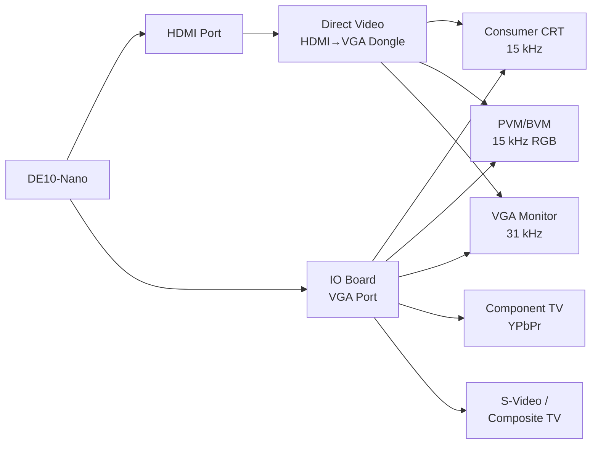

[← Configuration](README.md) · [↑ Knowledge Base](../README.md)

# CRT & Analog Video Setup

> Connecting MiSTer to a CRT is the path to pixel-perfect retro display — native 15 kHz output, zero-scaler latency, and authentic scanlines. This guide covers the two output paths (IO board vs Direct Video), cable selection, INI configuration, and troubleshooting.

Sources: [MiSTer CRT Documentation](https://mister-devel.github.io/MkDocs_MiSTer/advanced/crt/) · MikeS11 & ArchiveRL guide

---

## Connection Methods



---

## IO Board vs Direct Video

| Aspect | Analog IO Board | Direct Video (HDMI→VGA) |
|---|---|---|
| **Cost** | ~$30–50 | ~$5–10 (dongle) |
| **Color depth** | Good | Better (full HDMI DAC path) |
| **Dual SDRAM** | Blocks secondary SDRAM slot | Not affected |
| **SoG for component** | Built-in switch | Requires mod / active adapter |
| **Extra features** | Buttons, LED, fan header, analog audio | None |
| **Compatibility** | All dongles work | Some dongles incompatible |

> [!NOTE]
> Both methods produce nearly identical output that should match original hardware 1:1. Choose IO board for maximum features; Direct Video for cost and better color depth.

---

## Cable Guide by Display Type

### 15 kHz Consumer CRT (SCART RGB)

- **IO Board**: VGA→SCART cable with 470 Ω resistor on composite sync line
- **Direct Video**: Same cable + `direct_video=1`
- Recommended cable sources: MisterAddons (US), Retro Access (UK), UltimateMiSTer (PT), Antoniovillena (ES)

### 15 kHz Component TV (YPbPr)

- **IO Board**: Standard VGA→Component cable + `vga_mode=ypbpr`, enable SoG switch
- **Direct Video**: Requires Sync-on-Green modification — see [Direct Video YPbPr Guide](https://github.com/MiSTer-devel/Main_MiSTer/wiki/Direct-Video-YPbPr-Setup)

### PVM / BVM Monitors

- VGA→BNC cable (3× RGB + HSync)
- Both IO Board and Direct Video supported

### 31 kHz VGA Monitors

- Standard VGA cable
- Enable `forced_scandoubler=1` for 15 kHz cores

### S-Video / Composite

MiSTer natively outputs Y/C signals via RGB pins (luma=green, chroma=red). Requires an active or passive Y/C adapter:
- Active adapters recommended for best quality
- Passive adapters available as cheaper alternative
- Set `vga_mode=svideo` or `vga_mode=cvbs`

---

## MiSTer.ini Configuration

### IO Board — 15 kHz RGB SCART

```ini
composite_sync=1
```

### IO Board — 15 kHz Component

```ini
vga_mode=ypbpr
; Enable SoG switch on IO board physically
```

### IO Board — 31 kHz VGA Monitor

```ini
forced_scandoubler=1
```

### Direct Video — 15 kHz RGB SCART

```ini
direct_video=1
composite_sync=1
```

### Direct Video — 15 kHz Component

```ini
direct_video=1
composite_sync=1
vga_mode=ypbpr
```

### Direct Video — 31 kHz VGA Monitor

```ini
direct_video=1
forced_scandoubler=1
```

### Direct Video — PVM/BVM

```ini
direct_video=1
composite_sync=1
```

### S-Video / Composite Output

```ini
vga_scaler=0
composite_sync=1
vga_mode=svideo
ntsc_mode=0
; 0=NTSC, 1=PAL-60, 2=PAL-M
```

---

## CRT Display Categories

| Type | Sync Rate | Typical Inputs | Best For |
|---|---|---|---|
| **Consumer TV** | 15 kHz only | Composite, S-Video, SCART, Component | Console gaming — authentic 240p |
| **VGA Monitor** | 31 kHz only | VGA | Computer cores (Amiga, Atari ST, C64) |
| **Multisync Monitor** | 15 + 31 kHz | VGA, BNC | Best of both worlds — rare and sought after |
| **PVM / BVM** | 15 + sometimes 31 kHz | BNC (RGB + sync) | Professional-grade display — sharp, calibratable |

---

## Key INI Settings Reference

| Setting | Values | Purpose |
|---|---|---|
| `direct_video` | 0 / 1 | Enable Direct Video mode (bypass IO board) |
| `composite_sync` | 0 / 1 | Output combined H+V sync on HS pin |
| `vga_mode` | `rgb` / `ypbpr` / `svideo` / `cvbs` | Analog output encoding |
| `forced_scandoubler` | 0 / 1 | Double 15 kHz → 31 kHz for VGA monitors |
| `vga_scaler` | 0 / 1 | Enable analog scaler path |
| `vsync_adjust` | 0 / 1 / 2 | Video timing adjustment (2 = low latency) |
| `video_mode` | Modeline string | Custom video timing for specific displays |
| `ntsc_mode` | 0 / 1 / 2 | NTSC / PAL-60 / PAL-M for Y/C output |

> [!CAUTION]
> Sending a 31 kHz signal to a 15 kHz-only CRT can damage the display. Always verify your `mister.ini` settings before connecting.

---

## Troubleshooting

| Problem | Likely Cause | Fix |
|---|---|---|
| No picture on CRT | Wrong sync rate | Verify `composite_sync=1`, `direct_video` matches your hardware |
| Rolling image | Wrong video mode | Try PAL vs NTSC toggle; check `video_mode` modeline |
| Colors washed out (Trinitron) | Missing resistor | Add resistor/potentiometer to VGA→SCART cable |
| Rainbow artifacting (composite) | No luma trap | Use active adapter or S-Video instead |
| Sync loss during transitions | Core disables video | Enable "Stabilize video" in core OSD (slight latency cost) |
| Direct Video dongle not working | Incompatible DAC | Try another dongle — not all HDMI→VGA adapters work |

---

## Cross-References

| Topic | Article |
|---|---|
| Analog video architecture (vga_out.sv, yc_out.sv) | [Analog Video Architecture](../09_video_audio/analog_direct_video_architecture.md) |
| HDMI scaler | [HDMI Scaler](../09_video_audio/ascal_deep_dive.md) |
| MiSTer.ini full reference | [INI Guide](mister_ini_guide.md) |
| IO board hardware | [Addon Boards](../02_hardware_platforms/addon_boards.md) |
| Video mixer & scanline options | [Video Mixer](../09_video_audio/video_mixer_deep_dive.md) |
