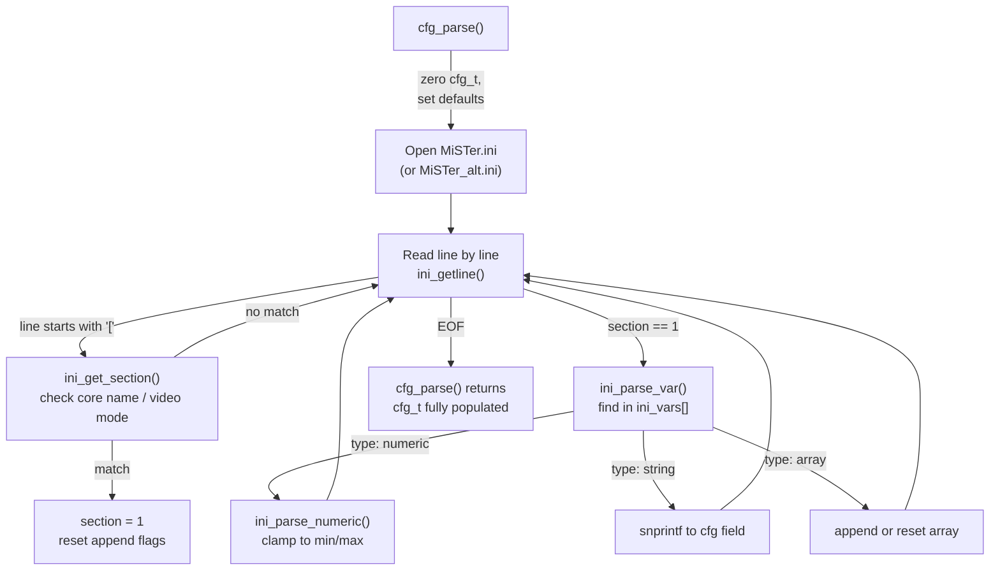

[← Configuration Index](README.md)

# MiSTer.ini Guide

The `MiSTer.ini` file is the global configuration document parsed by the HPS `Main_MiSTer` binary at startup. It controls system-wide and core-specific hardware settings, spanning video output (HDMI/Analog), audio routing, USB input mappings, and boot behavior.

---

## 1. File Location and Selection

The HPS binary reads one INI file at startup from the SD card root (or `/media/fat/`):

| Filename | Purpose |
|---|---|
| `MiSTer.ini` | Always read (primary) |
| `MiSTer_alt.ini` | Alternative 1 (selectable from OSD) |
| `MiSTer_alt_1.ini` | Alternative 2 |
| `MiSTer_alt_2.ini` | Alternative 3 |

Up to **three** `MiSTer_*.ini` alternates are discovered by scanning the root directory and sorted alphabetically.

---

## 2. INI Section Matching

The INI file is divided into sections using `[SectionName]` headers. The parser applies variables **only** from sections that match the current context.

| Section header | Matches when |
|---|---|
| `[MiSTer]` | Always (global defaults) |
| `[CoreName]` | Core name (exact, case-insensitive) |
| `[CoreName*]` | Core name prefix wildcard (e.g., `[arcade*]`) |
| `[arcade]` | Any arcade core |
| `[arcade_vertical]` | Any vertical arcade core |
| `[video=<mode>]` | Current video output mode string |
| `+[SectionName]` | Include section even when not primary |

This means a single `MiSTer.ini` can contain both global settings and per-core overrides:

```ini
[MiSTer]
VIDEO_MODE=720p60
VSYNC_ADJUST=1

[SNES]
VIDEO_MODE=1080p60
VSCALE_MODE=2

[MegaCD]
VSYNC_ADJUST=0

[arcade*]
DIRECT_VIDEO=0
```

---

## 3. INI Variable Reference

All variables are parsed into the `cfg_t` struct (`cfg.h`). Below is a selection of the most important ones.

### 3.1 Video Output

| Variable | Type | Range | Default | Description |
|---|---|---|---|---|
| `VIDEO_MODE` | string | — | — | HDMI mode (e.g. `720p60`, `1080p60`) |
| `VIDEO_MODE_PAL` | string | — | — | PAL override video mode |
| `VIDEO_MODE_NTSC` | string | — | — | NTSC override video mode |
| `VSYNC_ADJUST` | uint8 | 0–2 | 0 | 0=no adjust, 1=near, 2=exact (low lag) |
| `VSCALE_MODE` | uint8 | 0–5 | 0 | Vertical scale mode (integer scaling) |
| `VSCALE_BORDER` | uint16 | 0–399 | 0 | Top/bottom border in lines |
| `DIRECT_VIDEO` | uint8 | 0–2 | 0 | Bypass HDMI scaler (use with analog DAC) |
| `FORCED_SCANDOUBLER` | uint8 | 0–1 | 0 | Force scan doubler on VGA output |
| `VGA_SCALER` | uint8 | 0–1 | 0 | Route HDMI scaler to VGA |
| `VGA_SOG` | uint8 | 0–1 | 0 | Sync-on-Green |
| `COMPOSITE_SYNC` | uint8 | 0–1 | 1 | Composite sync on HSync |
| `DVI_MODE` | uint8 | 0–2 | 2 | 0=HDMI+audio, 1=DVI, 2=auto |
| `HDMI_LIMITED` | uint8 | 0–2 | 0 | HDMI range: 0=full, 1=lim, 2=auto |
| `VGA_MODE` | string | — | — | `rgb`, `ypbpr`, `svideo`, `cvbs` |
| `VRR_MODE` | uint8 | 0–3 | 0 | VRR/FreeSync mode |

### 3.2 Image Quality & Filters

| Variable | Type | Range | Default | Description |
|---|---|---|---|---|
| `VIDEO_BRIGHTNESS` | uint8 | 0–100 | 50 | Output Brightness |
| `VIDEO_CONTRAST` | uint8 | 0–100 | 50 | Output Contrast |
| `VIDEO_SATURATION` | uint8 | 0–100 | 100 | Output Saturation |
| `VIDEO_HUE` | uint16 | 0–360 | 0 | Hue rotation in degrees |
| `VFILTER_DEFAULT` | string | — | — | Default scaler filter file |
| `SHMASK_DEFAULT` | string | — | — | Default shadow mask file |
| `AFILTER_DEFAULT` | string | — | — | Default audio filter |
| `PRESET_DEFAULT` | string | — | — | Default scaler preset |

### 3.3 Input & Controllers

| Variable | Type | Range | Default | Description |
|---|---|---|---|---|
| `KEY_MENU_AS_RGUI` | uint8 | 0–1 | 0 | Map Menu key to Right GUI |
| `RESET_COMBO` | uint8 | 0–3 | 0 | Key combo for core reset |
| `KBD_NOMOUSE` | uint8 | 0–1 | 0 | Disable keyboard mouse emulation |
| `MOUSE_THROTTLE` | uint8 | 1–100 | — | Mouse speed percentage |
| `SNIPER_MODE` | uint8 | 0–1 | 0 | Mouse sniper (slow) mode button |
| `SPINNER_THROTTLE` | int32 | ±10000 | — | Spinner speed / inversion |
| `RUMBLE` | uint8 | 0–1 | 1 | Enable force feedback |
| `AUTOFIRE_RATES` | string | — | `10,15,30` | Autofire rates in Hz |
| `PLAYER_N_CONTROLLER` | string | — | — | Assign specific controller to player N |
| `DEADZONE` | string | — | — | Per-device analog deadzone percentage |

### 3.4 System / Boot

| Variable | Type | Range | Default | Description |
|---|---|---|---|---|
| `BOOTCORE` | string | — | — | Core to load automatically at boot |
| `BOOTCORE_TIMEOUT` | int16 | 2–30 | — | Seconds before auto-boot triggers |
| `BOOTSCREEN` | uint8 | 0–1 | 1 | Show boot logo |
| `LOGO` | uint8 | 0–1 | 1 | Show MiSTer logo in menu |
| `OSD_TIMEOUT` | int16 | 0–3600 | — | Auto-hide OSD after N seconds |
| `OSD_ROTATE` | uint8 | 0–2 | 0 | Rotate OSD for vertical games |
| `SHARED_FOLDER` | string | — | — | Path for shared Linux folder (CIFS/SMB) |
| `WAITMOUNT` | string | — | — | Wait for USB drive to mount before boot |
| `DEBUG` | uint8 | 0–1 | 0 | Enable verbose logging to stdout |
| `OSD_LOCK` | string | — | — | OSD lock password |

---

## 4. INI Parsing Flow

The `Main_MiSTer` binary parses the INI file line-by-line during startup or when a core is loaded.



> [!TIP]
> The parser strictly enforces range limits (`[min, max]`) on numeric variables. Setting a value outside the supported range will cause it to be clamped or ignored entirely.

---

## Read Also
- [Core Configuration String (CONF_STR)](conf_str.md) — The RTL-side configuration syntax
- [OSD Architecture](osd.md) — How the FPGA renders the menu
- [Main_MiSTer Architecture](../04_hps_binary/build/overview.md)
