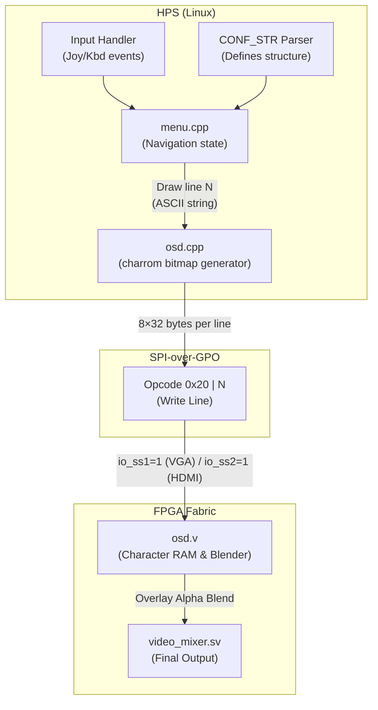

[← Configuration Index](README.md)

# On-Screen Display (OSD) Architecture

The On-Screen Display (OSD) is a transparent UI overlay drawn on top of the active FPGA core's video output. It is the primary visual interface for MiSTer, allowing users to configure settings, select ROMs, and load new cores.

Crucially, **the active FPGA core has no knowledge of the OSD UI**. The menu logic, state, and rendering exist entirely in the HPS software (`Main_MiSTer`), which streams raw, 1-bit pixel character data to the FPGA fabric over the H2F SSPI bridge. The FPGA's `osd.v` module then performs a pixel-perfect alpha blend directly into the video output pipeline. *(For underlying transport details, see the [HPS Bridge Reference](../06_fpga_subsystem/hps_bridge_reference.md)).*

Sources: `Main_MiSTer/osd.cpp`, `menu.cpp`, `cores/Template_MiSTer/sys/osd.v`

---

## 1. System Architecture



The OSD architecture is divided into the **State Controller** (HPS `menu.cpp`), the **Bitmap Generator** (HPS `osd.cpp`), and the **Video Blender** (FPGA `osd.v`).

---

## 2. HPS-Side: Navigation and Rendering

### 2.1 The Menu State Machine (`menu.cpp`)

When a user presses the OSD button (F12 or gamepad equivalent), `Main_MiSTer` intercepts the input and invokes the menu system.

1. **Hierarchy Parsing**: The menu reads the `CONF_STR` defined by the core to build a tree of pages and options.
2. **Input Mapping**: Keyboard arrows and joystick D-pads are routed to `menu.cpp`, moving the selection cursor.
3. **Redraw Loop**: On any state change (cursor move, option toggle), the entire visible OSD window is redrawn.
4. **Status Dispatch**: If an option is toggled, `menu.cpp` updates the shadow `status` register and fires a `UIO_SET_STATUS2` command to the FPGA.

### 2.2 Character ROM and Bitmap Generation (`osd.cpp`)

The OSD does not send ASCII text to the FPGA. It sends raw monochrome bitmaps.

The HPS contains a hardcoded 8×8 pixel font (`charrom.cpp`). 
The OSD canvas is fixed at **32 columns × 15 lines** (256 × 120 pixels).

When `menu.cpp` wants to draw a line of text, it calls `OsdWrite()`:

```c
// osd.cpp
void OsdWrite(unsigned char n, const char *s, unsigned char invert, ...)
{
    // n = line number (0..14)
    EnableOsd();              // assert io_ss1 (VGA) or io_ss2 (HDMI)
    spi_osd_cmd_cont(0x20 | n); // Opcode: Write line N

    for (int i = 0; i < 32; i++) {
        char c = *s ? *s++ : ' ';
        // Send 8 bytes of character bitmap (one byte per vertical pixel row)
        for (int j = 0; j < 8; j++)
            spi_b(charrom[c][j] ^ (invert ? 0xFF : 0x00));
    }
    DisableOsd();             // de-assert chip select
}
```
*Note: `invert` is used to create the solid background block for the currently highlighted menu option.*

---

## 3. FPGA-Side: The Overlay Blender (`osd.v`)

The `osd.v` module sits immediately upstream of `video_mixer.sv`. It intercepts the RGB output of the core and applies the OSD overlay before scaling or display.

### 3.1 Dual OSD Modules

There are typically two instantiations of `osd.v` in a core:
1. **VGA OSD**: Addressed via SPI slave select 1 (`io_ss1`).
2. **HDMI OSD**: Addressed via SPI slave select 2 (`io_ss2`).

The HPS sends the exact same bitmap to both modules sequentially when the OSD updates.

### 3.2 Pixel RAM and SPI Receiver

`osd.v` maintains a small internal block RAM to store the 1-bit bitmap data sent by the HPS.

```verilog
// 256 × 128 pixel RAM (32 chars × 15 lines, 8px each)
// Each bit is one pixel: 1 = text foreground, 0 = background
reg [7:0] osd_ram[32*8*15];
```

The module listens on the SPI bus. When `io_osd` (mapped to the appropriate `io_ss`) goes high, it decodes the opcode. If the opcode is `0x20 | n`, it writes the incoming byte stream into the RAM row corresponding to line `n`.

### 3.3 The Alpha Blending Pipeline

The core's video signals (`R_in`, `G_in`, `B_in`, `ce_pix`, `clk_video`) pass through `osd.v`.

The module uses an internal coordinate counter synchronized to the core's HSync and VSync to determine when the scanning beam is inside the OSD window coordinates.

```verilog
// Determine if current pixel is within the OSD window bounds
wire osd_window = (h_count > OSD_X_START) && (h_count < OSD_X_END) && 
                  (v_count > OSD_Y_START) && (v_count < OSD_Y_END);

// Read the 1-bit pixel from osd_ram for the current coordinate
wire osd_pixel = osd_ram[ram_address][ram_bit];

// Blend logic
always @(posedge clk_video) begin
    if (ce_pix) begin
        if (osd_enable && osd_window) begin
            if (osd_pixel) begin
                // Foreground pixel (Text): Render as solid white (or colored text if enhanced)
                R_out <= 8'hFF;
                G_out <= 8'hFF;
                B_out <= 8'hFF;
            end else begin
                // Background pixel: 50% Alpha Blend (Shift right by 1 = divide by 2)
                R_out <= {1'b0, R_in[7:1]};
                G_out <= {1'b0, G_in[7:1]};
                B_out <= {1'b0, B_in[7:1]};
            end
        end else begin
            // Outside OSD window: Pass-through
            R_out <= R_in;
            G_out <= G_in;
            B_out <= B_in;
        end
    end
end
```

> [!TIP]
> The classic MiSTer "translucent grey" OSD background is actually a hardware trick: shifting the core's RGB values right by one bit (`>> 1`). This reduces brightness by exactly 50% without requiring an expensive DSP multiplier block, preserving FPGA logic elements.

---

## 4. OSD Command Protocol

The HPS controls the FPGA OSD modules using the following specialized opcodes over the SPI bus:

| Opcode | Name | Parameters | Description |
|---|---|---|---|
| `0x20 | n` | Write Line | 8×32 bytes | Writes 256 pixels of bitmap data to row `n` (0–14). |
| `0x28` | Enable OSD | — | Sets the `osd_enable` flag in the FPGA. Overlay becomes visible on next VSync. |
| `0x29` | Disable OSD | — | Clears `osd_enable`. Overlay disappears. |
| `0x40` | Set Brightness | `value` | Adjusts OSD text brightness level (handled differently depending on core implementation). |

---

## 5. Short Info Messages

Cores can request the HPS to display short, temporary pop-up messages (e.g., "CD Loading...", "Save State 1").

1. The FPGA asserts the `info_req` flag in its status block.
2. The HPS periodically polls the FPGA via `UIO_INFO_GET` (0x36).
3. If an info code is returned, the HPS translates it into a string.
4. The HPS calls `Info("Message", timeout_ms)` in `menu.cpp`.
5. The HPS sends `0x20 | n` commands to draw a mini 1-line OSD box at the bottom of the screen.
6. A timer in the HPS automatically clears it (sending `0x29`) after the timeout expires.

---

## Read Also
- [Core Configuration String (CONF_STR)](conf_str.md) — How the OSD menu structure is defined.
- [HPS Bridge Reference](../06_fpga_subsystem/hps_bridge_reference.md) — The fundamental basement for H2F/F2H interaction, including the SSPI protocol used for OSD commands.
- [Main_MiSTer Architecture](../04_hps_binary/build/overview.md)
- [UIO Command Reference](../17_references/uio_command_reference.md)
