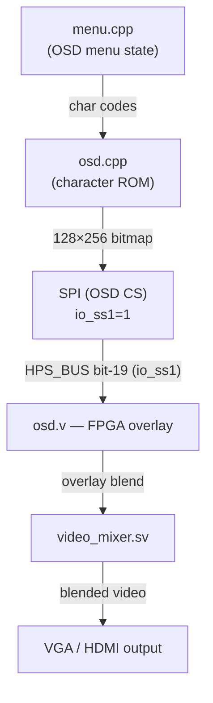

[← Configuration](../README.md)

# On-Screen Display (OSD)

The OSD is an overlay drawn on top of the core's video output.  It is
rendered by the FPGA using character bitmaps sent from the HPS, allowing
MiSTer to display menus and messages without requiring the core to know
anything about the UI.

Sources: `Main_MiSTer/osd.cpp`, `osd.h`, `cores/Template_MiSTer/sys/osd.v`

---

## Rendering Architecture



---

## Character ROM

`charrom.cpp` contains the 8×8 pixel font bitmap for the OSD.  Each character
is 8 bytes (one byte per row, MSB = leftmost pixel).

```c
// osd.cpp
void OsdWrite(unsigned char n, const char *s, unsigned char invert, ...)
{
    // n = line number (0..14)
    // Each line is 256 pixels = 32 characters × 8 px wide

    EnableOsd();              // assert io_ss1
    spi_osd_cmd_cont(0x20 | n); // command: write line N
    for (int i = 0; i < 32; i++) {
        char c = *s ? *s++ : ' ';
        // Send 8 bytes of character bitmap
        for (int j = 0; j < 8; j++)
            spi_b(charrom[c][j] ^ (invert ? 0xFF : 0x00));
    }
    DisableOsd();             // de-assert io_ss1
}
```

---

## FPGA OSD Module (`osd.v`)

```verilog
// osd.v (simplified)
module osd (
    input        clk_sys,
    input        io_osd,      // = io_ss1 (either VGA or HDMI variant)
    input        io_strobe,
    input [15:0] io_din,

    input        clk_video,
    input        ce_pix,
    input [7:0]  R_in, G_in, B_in,
    output [7:0] R_out, G_out, B_out,
    // ... sync signals pass-through
);

// 256 × 128 pixel RAM (32 chars × 15 lines, 8px each)
reg [7:0] osd_ram[32*8*15];

// SPI receive state machine clocked on clk_sys
always @(posedge clk_sys) begin
    if(io_osd & io_strobe) begin
        // First byte: command (0x20 | line_number)
        // Next 8×32 bytes: character bitmaps for that line
    end
end

// Pixel blend: on active OSD area, blend 50% grey + text
assign R_out = osd_pixel ? 8'hFF : (R_in >> 1);
```

---

## OSD Commands

| Opcode | Name | Parameters | Description |
|---|---|---|---|
| `0x20 | n` | Write line | 8×32 bytes of pixel data | Write OSD line N |
| `0x28` | Enable OSD | — | Make OSD visible |
| `0x29` | Disable OSD | — | Hide OSD |
| `0x40` | Set brightness | value | OSD brightness level |

The OSD is drawn separately for VGA (`io_osd_vga`) and HDMI
(`io_osd_hdmi`) using different `io_ss1` / `io_ss2` combinations.

---

## OSD Visibility

```c
// osd.cpp
void OsdEnable(unsigned char m)
{
    // m: OSD_HDMI, OSD_VGA, or OSD_ALL
    if (m & OSD_HDMI) { EnableOsd_on(OSD_HDMI); spi_osd_cmd(0x28); DisableOsd(); }
    if (m & OSD_VGA)  { EnableOsd_on(OSD_VGA);  spi_osd_cmd(0x28); DisableOsd(); }
}

void OsdDisable()
{
    EnableOsd();     spi_osd_cmd(0x29);    DisableOsd();
}
```

---

## Info Messages

Short timed info messages are sent via the `UIO_INFO_GET` mechanism:

```c
// menu.cpp
void Info(const char *message, uint32_t timeout_ms)
{
    // Queue message for display
    // hps_io delivers it via opcode 0x36
}
```

Core requests info display by asserting `info_req` with an info code;
`hps_io` returns the code via `UIO_INFO_GET` (0x36).
