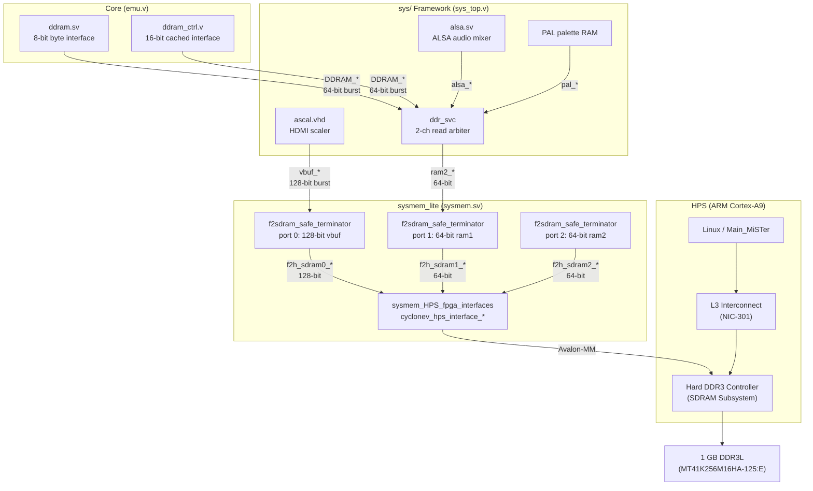
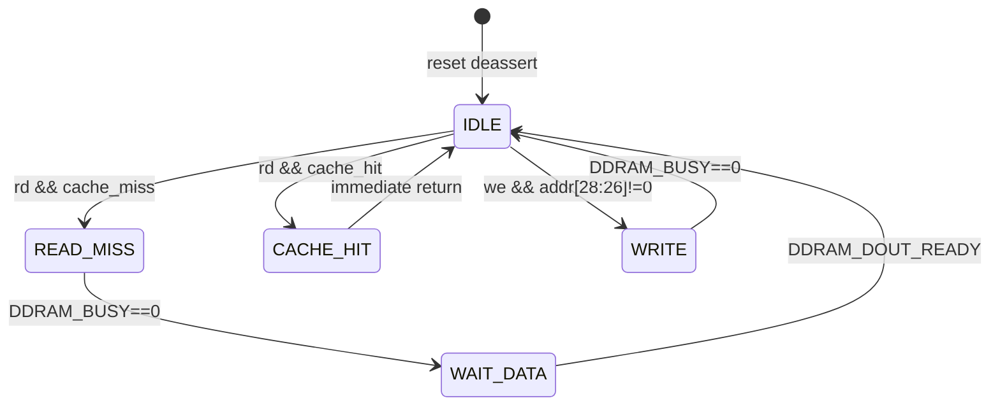
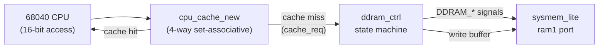
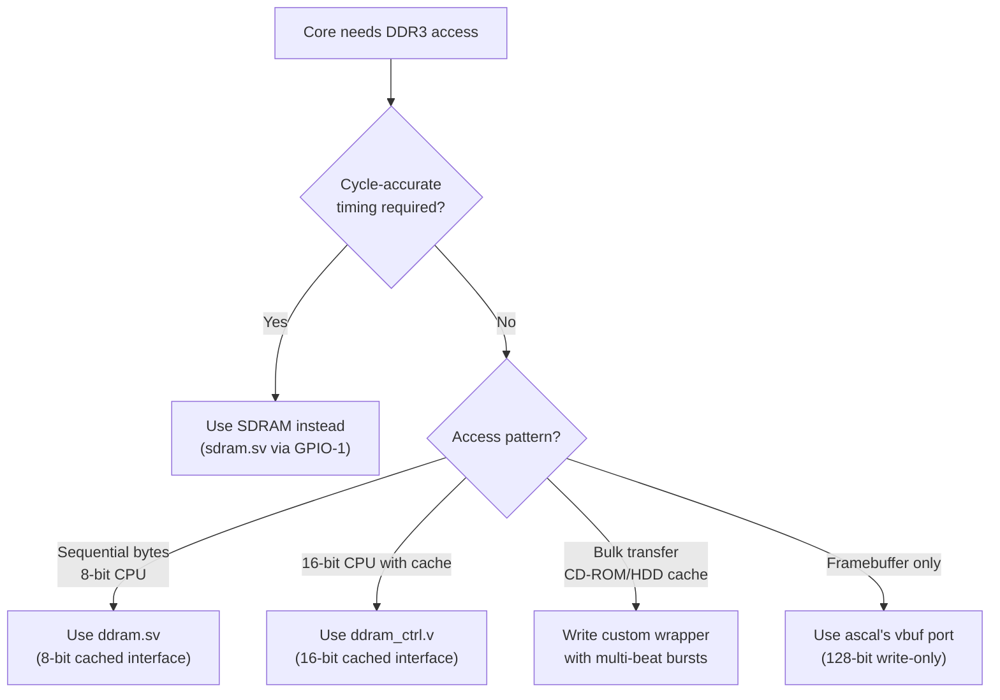

[← FPGA Subsystem](README.md) · [↑ Knowledge Base](../README.md)

# DDR3 Architecture: F2SDRAM, sysmem_lite & ddram

The DE10-Nano's 1 GB DDR3L SDRAM is physically wired to the HPS (ARM) side of the Cyclone V SoC. The FPGA fabric cannot access it directly — every read and write must cross the **FPGA-to-SDRAM (F2SDRAM)** bridge, pass through the hard memory controller in the HPS, and traverse the L3 interconnect.

This article provides a Deep analysis of the full DDR3 access path: from the `sysmem_lite` module that wraps the Quartus Qsys-generated HPS interfaces, through the `f2sdram_safe_terminator` that prevents bridge corruption during core switches, to the per-core `ddram.sv` / `ddram_ctrl.v` wrappers that provide the simple byte-level interface that cores actually consume.

Sources:
* [`Template_MiSTer/sys/sysmem.sv`](https://github.com/MiSTer-devel/Template_MiSTer/blob/master/sys/sysmem.sv)
* [`Template_MiSTer/sys/f2sdram_safe_terminator.sv`](https://github.com/MiSTer-devel/Template_MiSTer/blob/master/sys/f2sdram_safe_terminator.sv)
* [`Template_MiSTer/sys/ddr_svc.sv`](https://github.com/MiSTer-devel/Template_MiSTer/blob/master/sys/ddr_svc.sv)
* [`Template_MiSTer/sys/sys_top.v`](https://github.com/MiSTer-devel/Template_MiSTer/blob/master/sys/sys_top.v)
* [`Main_MiSTer/fpga_io.cpp`](https://github.com/MiSTer-devel/Main_MiSTer/blob/master/fpga_io.cpp)

---

## 1. Top-Level Architecture



### 1.1 Port Allocation Summary

| Port | Width | Clock | Qsys Port | Consumer | Purpose |
|---|---|---|---|---|---|
| **ram1** | 64-bit | `ram_clk` (core) | `f2h_sdram1` | Core (via `ddram.sv`) | Core's DDR3 workspace — ROM backing, save states, CD cache |
| **ram2** | 64-bit | `clk_audio` | `f2h_sdram2` | `ddr_svc` | ALSA audio buffers + PAL palette |
| **vbuf** | 128-bit | `clk_100m` | `f2h_sdram0` | `ascal` scaler | HDMI video framebuffer (write-only in practice) |

> [!NOTE]
> The 128-bit `vbuf` port is mapped to `f2h_sdram0` because the Cyclone V's SDRAM controller splits 128-bit ports into two 64-bit sub-ports (port 0 reads the lower 64 bits, port 1 reads the upper 64 bits). This is why `f2h_sdram0_READDATA` is 128 bits wide but `f2h_sdram1_READDATA` and `f2h_sdram2_READDATA` are only 64 bits.

---

## 2. sysmem_lite — The Bridge Wrapper

`sysmem_lite` ([`sysmem.sv`](https://github.com/MiSTer-devel/Template_MiSTer/blob/master/sys/sysmem.sv)) is the top-level module that instantiates all HPS↔FPGA interface primitives. It is not synthesizable from RTL alone — Quartus Qsys/Platform Designer generates the `cyclonev_hps_interface_*` primitives based on the HPS configuration.

### 2.1 Port List

```verilog
// sysmem.sv — simplified port list
module sysmem_lite (
    output         clock,          // h2f_user0_clk (~100 MHz from HPS PLL)
    output         reset_out,      // combined reset: init | hps | core_req
    input          reset_hps_cold_req,
    input          reset_hps_warm_req,
    input          reset_core_req,

    // Port 1: 64-bit DDR3 (core ram)
    input          ram1_clk,
    input   [28:0] ram1_address,
    input    [7:0] ram1_burstcount,
    output         ram1_waitrequest,
    output  [63:0] ram1_readdata,
    output         ram1_readdatavalid,
    input          ram1_read,
    input   [63:0] ram1_writedata,
    input    [7:0] ram1_byteenable,
    input          ram1_write,

    // Port 2: 64-bit DDR3 (audio/pal)
    input          ram2_clk,       // typically clk_audio
    input   [28:0] ram2_address,
    // ... identical to ram1 ...

    // Port 0: 128-bit DDR3 (video framebuffer)
    input          vbuf_clk,       // typically clk_100m
    input   [27:0] vbuf_address,   // 28-bit (256 MB window)
    input    [7:0] vbuf_burstcount,
    output         vbuf_waitrequest,
    output [127:0] vbuf_readdata,  // 128-bit wide
    output         vbuf_readdatavalid,
    input          vbuf_read,
    input  [127:0] vbuf_writedata,
    input   [15:0] vbuf_byteenable,
    input          vbuf_write
);
```

Source: [`sysmem.sv:L1-84`](https://github.com/MiSTer-devel/Template_MiSTer/blob/master/sys/sysmem.sv#L1)

### 2.2 Reset Logic

`sysmem_lite` combines three reset sources into a single `reset_out`:

```verilog
// sysmem.sv:L86
assign reset_out = ~init_reset_n | ~hps_h2f_reset_n | reset_core_req;
```

| Source | Meaning |
|---|---|
| `init_reset_n` | Deasserted after a 2M-cycle timeout from `h2f_user0_clk` startup (~20 ms at 100 MHz) |
| `hps_h2f_reset_n` | HPS-to-FPGA reset from the Reset Manager (asserted during HPS boot, warm/cold reset) |
| `reset_core_req` | Active-high from `sys_top.v` during core reset (SSPI UIO command `0x03`) |

The init timeout ensures the DDR3 controller has completed calibration before any FPGA master attempts a transaction.

### 2.3 sysmem_HPS_fpga_interfaces

The second module in `sysmem.sv` ([`L282-660`](https://github.com/MiSTer-devel/Template_MiSTer/blob/master/sys/sysmem.sv#L282)) wraps the Quartus-generated HPS interface primitives:

| Primitive | Purpose |
|---|---|
| `cyclonev_hps_interface_clocks_resets` | HPS↔FPGA reset handshake, `h2f_user0_clk` output, cold/warm reset requests |
| `cyclonev_hps_interface_fpga2hps` | FPGA→HPS AXI bridge (configured as minimal dummy — not actively used by MiSTer cores) |
| `cyclonev_hps_interface_hps2fpga` | HPS→FPGA AXI bridge (not used by MiSTer cores — left as dummy) |
| `cyclonev_hps_interface_fpga2sdram` | The critical F2SDRAM bridge with 3 Avalon-MM slave ports |
| `cyclonev_hps_interface_boot_from_fpga` | Unused — FPGA boot is via HPS FPGA Manager |
| `cyclonev_hps_interface_dbg_apb` | Unused — debug APB disabled |
| `cyclonev_hps_interface_tpiu_trace` | Unused — trace disabled |

The `fpga2sdram` primitive is the heart of DDR3 access. Its configuration encodes the port width mapping:

```verilog
// sysmem.sv:L541 — port width configuration
.cfg_port_width({12'b000000010110})
```

This 12-bit field encodes the data width for each of the 4 sub-ports:
- Sub-port 0: `011` = 64-bit (lower half of vbuf)
- Sub-port 1: `010` = 32-bit (unused)
- Sub-port 2: `011` = 64-bit (upper half of vbuf)
- Sub-port 3: `011` = 64-bit (ram1)

Wait — the actual mapping is more nuanced. The `cfg_port_width` value `0x016` = `0000_0001_0110` maps the three active ports as two 64-bit ports and one 128-bit virtual port split across sub-ports 0 and 2.

### 2.4 F2SDRAM Port Configuration Deep Dive

The `cyclonev_hps_interface_fpga2sdram` has several critical configuration fields:

**`cfg_rfifo_cport_map` / `cfg_wfifo_cport_map`** (16 bits each):
```verilog
.cfg_rfifo_cport_map({16'b0010000100000000})
.cfg_wfifo_cport_map({16'b0010000100000000})
```
These map each command port to its corresponding read/write FIFO. The encoding maps:
- Command port 0 → Read/Write FIFO 0 (128-bit vbuf)
- Command port 1 → Read/Write FIFO 1 (64-bit ram1)
- Command port 2 → Read/Write FIFO 2 (64-bit ram2)

**`cfg_cport_type`** (12 bits):
```verilog
.cfg_cport_type({12'b000000111111})
```
Each 2-bit field defines the port type: `11` = Avalon-MM with byte-enable.

---

## 3. f2sdram_safe_terminator — Preventing Bridge Corruption

This is one of the most critical safety modules in the framework. It solves a subtle but devastating bug that would otherwise corrupt the F2SDRAM bridge state.

Source: [`f2sdram_safe_terminator.sv`](https://github.com/MiSTer-devel/Template_MiSTer/blob/master/sys/f2sdram_safe_terminator.sv)

### 3.1 The Problem

When `Main_MiSTer` loads a new core (`.rbf`), it must reset the FPGA fabric. The HPS-side bridge reset sequence is:

```c
// fpga_io.cpp — do_bridge(0) during RBF load
writel(0, &sysmgr_regs->fpgaintfgrp_module);    // disable FPGA-to-HPS interface
writel(0, (void*)(SOCFPGA_SDR_ADDRESS + 0x5080)); // disable F2SDRAM ports
writel(7, &reset_regs->brg_mod_reset);            // reset all 3 bridge modules
writel(1, &nic301_regs->remap);                   // remap NIC-301
```

Source: [`fpga_io.cpp:L378-393`](https://github.com/MiSTer-devel/Main_MiSTer/blob/master/fpga_io.cpp)

The `brg_mod_reset` register at offset `0x2C` in the Reset Manager resets the FPGA↔HPS bridges. However, this reset has **no effect on the F2SDRAM interface** — the F2SDRAM ports belong to the SDRAM Controller Subsystem, not the bridge module.

`Main_MiSTer` also tries to reset the F2SDRAM ports via the `fpgaportrst` register at `SOCFPGA_SDR_ADDRESS + 0x5080`, but according to Intel's documentation, this register can only *stretch* an existing port reset — it cannot *assert* one.

The only way to fully reset a corrupted F2SDRAM interface is to reset the entire SDRAM Controller Subsystem via the `permodrst` register in the Reset Manager. But this cannot be done safely while Linux is running, since the SDRAM controller also serves the ARM CPU.

### 3.2 The Consequence

If a core is in the middle of a **burst write** transaction when the fabric is reset:
1. The FPGA master is silenced — it stops driving the Avalon-MM signals.
2. The F2SDRAM bridge is left waiting for the remaining beats of the burst.
3. The bridge enters an illegal state.
4. When the next core loads and attempts DDR3 access, the bridge is stuck — all transactions return `waitrequest=1` indefinitely or produce corrupt data.

### 3.3 The Solution

`f2sdram_safe_terminator` is inserted between every Avalon-MM master (core, scaler, audio) and the F2SDRAM slave port. When reset is asserted, it:

1. **Detects** the reset edge (synchronized to the port's clock domain via a 2-stage synchronizer).
2. **Captures** the current burst state: address, burst count, and how many beats have already been acknowledged.
3. **Takes over** the bus from the user logic — drives the remaining beats of the burst with the captured address and byte-enable, but with `writedata=0` and `byteenable=0` for write bursts (the data doesn't matter, only completing the protocol).
4. **For read bursts** in progress, simply keeps the read signal asserted until `waitrequest` deasserts, then absorbs the returning data.
5. **Releases** the bus once all outstanding transactions are complete.

```verilog
// f2sdram_safe_terminator.sv:L227-242 — bus mux during termination
always_comb begin
    if (terminating) begin
        burstcount_master = burstcount_latch;   // use captured burst count
        address_master    = address_latch;       // use captured address
        read_master       = read_terminating;    // keep read alive if needed
        write_master      = write_terminating;   // keep write alive
        byteenable_master = 0;                   // suppress byte enables (data doesn't matter)
    end
    else begin
        burstcount_master = burstcount_slave;    // pass through from user logic
        address_master    = address_slave;
        read_master       = read_slave;
        byteenable_master = byteenable_slave;
        write_master      = write_slave;
    end
end
```

Source: [`f2sdram_safe_terminator.sv:L227-242`](https://github.com/MiSTer-devel/Template_MiSTer/blob/master/sys/f2sdram_safe_terminator.sv#L227)

> [!CAUTION]
> If you are developing a core that accesses DDR3, **never** connect your Avalon-MM master directly to the F2SDRAM port. The `sysmem_lite` module already inserts the safe terminators. Use the `ram1_*` signals exposed by `sys_top.v` instead.

### 3.4 Reset Synchronization

Each port has a 2-stage synchronizer to cross the reset signal from the `h2f_user0_clk` domain into the port's local clock domain:

```verilog
// sysmem.sv:L101-106 — ram1 reset synchronizer
(* altera_attribute = {"-name SYNCHRONIZER_IDENTIFICATION FORCED_IF_ASYNCHRONOUS"} *) 
reg ram1_reset_0 = 1'b1;
(* altera_attribute = {"-name SYNCHRONIZER_IDENTIFICATION FORCED_IF_ASYNCHRONOUS"} *) 
reg ram1_reset_1 = 1'b1;
always @(posedge ram1_clk) begin
    ram1_reset_0 <= reset_out;
    ram1_reset_1 <= ram1_reset_0;
end
```

The `SYNCHRONIZER_IDENTIFICATION FORCED_IF_ASYNCHRONOUS` attribute tells Quartus that these registers are intentional synchronizers and should not trigger metastability warnings during timing analysis.

---

## 4. ddr_svc — Dual-Channel Read Arbiter

`ddr_svc` ([`ddr_svc.sv`](https://github.com/MiSTer-devel/Template_MiSTer/blob/master/sys/ddr_svc.sv)) is a lightweight **read-only** arbiter that multiplexes two request channels onto a single `ram2` port. It is used exclusively for ALSA audio and PAL palette data.

Source: [`ddr_svc.sv`](https://github.com/MiSTer-devel/Template_MiSTer/blob/master/sys/ddr_svc.sv)

### 4.1 Interface

```verilog
// ddr_svc.sv — simplified
module ddr_svc (
    input         clk,

    // RAM2 port (shared)
    input          ram_waitrequest,
    output  [7:0] ram_burstcnt,
    output [28:0] ram_addr,
    input  [63:0] ram_readdata,
    input          ram_read_ready,
    output reg    ram_read,
    output [63:0] ram_writedata,    // always 0 (read-only)
    output  [7:0] ram_byteenable,   // always 0xFF
    output reg    ram_write,        // always 0
    output  [7:0] ram_bcnt,         // burst counter output

    // Channel 0: ALSA audio
    input  [31:3] ch0_addr,
    input   [7:0] ch0_burst,
    output [63:0] ch0_data,
    input         ch0_req,
    output        ch0_ready,

    // Channel 1: PAL palette
    input  [31:3] ch1_addr,
    input   [7:0] ch1_burst,
    output [63:0] ch1_data,
    input         ch1_req,
    output        ch1_ready
);
```

### 4.2 Arbitration Protocol

`ddr_svc` uses a simple **toggle-aware** priority scheme:

```verilog
// ddr_svc.sv:L78-95 — state machine
case(state)
    0: if(ch0_req != ack[0]) begin       // ch0 has new request?
            ack[0]      <= ch0_req;        // acknowledge
            ram_address <= ch0_addr;
            ram_burst   <= ch0_burst;
            ram_read    <= 1;
            ch          <= 0;              // mark as ch0's data
            ram_bcnt    <= 8'hFF;
            state       <= 1;
        end
        else if(ch1_req != ack[1]) begin  // ch1 has new request?
            // ... same pattern for ch1 ...
        end
    1: if(ram_read_ready) begin           // data beat returned
            ram_bcnt  <= ram_bcnt + 1'd1;
            ram_q[ch] <= ram_readdata;     // store to channel's output reg
            ready[ch] <= 1;               // pulse ready
            if ((ram_bcnt+2'd2) == ram_burst) state <= 0;  // burst complete
        end
endcase
```

Key properties:
- **Strict priority**: Channel 0 (ALSA) always wins if both channels request simultaneously.
- **No preemption**: Once a burst starts, it runs to completion — the other channel must wait.
- **Toggle signaling**: Uses `req != ack` edge detection rather than level-based request. The master toggles `req`, and the arbiter acknowledges by matching `ack`.

### 4.3 Instantiation in sys_top.v

```verilog
// sys_top.v:L691-719 — ddr_svc connects to ram2
ddr_svc ddr_svc (
    .clk(clk_audio),

    .ram_waitrequest(ram2_waitrequest),
    .ram_burstcnt(ram2_burstcount),
    .ram_addr(ram2_address),
    .ram_readdata(ram2_readdata),
    .ram_read_ready(ram2_readdatavalid),
    .ram_read(ram2_read),
    .ram_writedata(ram2_writedata),
    .ram_byteenable(ram2_byteenable),
    .ram_write(ram2_write),
    .ram_bcnt(ram2_bcnt),

    .ch0_addr(alsa_address),    // ALSA audio buffer
    .ch0_burst(1),
    .ch0_data(alsa_readdata),
    .ch0_req(alsa_req),
    .ch0_ready(alsa_ready),

    .ch1_addr(pal_addr),        // PAL palette RAM
    .ch1_burst(128),
    .ch1_data(pal_data),
    .ch1_req(pal_req),
    .ch1_ready(pal_wr)
);
```

Source: [`sys_top.v:L691-719`](https://github.com/MiSTer-devel/Template_MiSTer/blob/master/sys/sys_top.v#L691)

---

## 5. ddram.sv — The Core-Side 8-Bit DDR3 Wrapper

`ddram.sv` is a **per-core** module (not part of the shared `sys/` framework) that provides a simple byte-level DDR3 interface. It is the most commonly used DDR3 access pattern in MiSTer cores.

Source: [`Menu_MiSTer/rtl/ddram.sv`](https://github.com/MiSTer-devel/Menu_MiSTer/blob/master/rtl/ddram.sv) (representative)

### 5.1 Interface

```verilog
// ddram.sv — byte-level DDR3 interface
module ddram (
    input         reset,
    input         DDRAM_CLK,

    // Connection to sys_top's ram1 port
    input         DDRAM_BUSY,          // ram1_waitrequest
    output  [7:0] DDRAM_BURSTCNT,      // always 1
    output [28:0] DDRAM_ADDR,          // word-aligned address
    input  [63:0] DDRAM_DOUT,          // 64-bit read data
    input         DDRAM_DOUT_READY,    // ram1_readdatavalid
    output        DDRAM_RD,            // read request
    output [63:0] DDRAM_DIN,           // write data
    output  [7:0] DDRAM_BE,            // byte enables
    output        DDRAM_WE,            // write request

    // CPU-facing interface
    input  [28:0] addr,        // byte address
    output  [7:0] dout,        // data output to CPU
    input   [7:0] din,         // data input from CPU
    input         we,          // CPU requests write
    input         rd,          // CPU requests read
    output        ready        // dout is valid / can accept new request
);
```

### 5.2 Address Mapping

```verilog
// ddram.sv:L52
assign DDRAM_ADDR = {3'b001, ram_address[28:3]}; // RAM at 0x20000000
```

The address prefix `3'b001` shifts the core's DDR3 window to start at physical address `0x20000000` (512 MB into the 1 GB DDR3). This ensures the core's DDR3 workspace doesn't collide with the Linux kernel's memory (typically below `0x20000000`) or the video framebuffer (managed by `ascal`).

The mapping works as follows:
- Core provides `addr[28:0]` as a byte address (up to 512 MB address space)
- `ddram.sv` strips the bottom 3 bits → word-aligned `addr[28:3]`
- Prepends `3'b001` → 32-bit physical address in the `0x20000000`–`0x3FFFFFFF` range

> [!WARNING]
> The `addr[28:26]` guard in the write path (`addr[28:26]` must be non-zero) prevents accidental writes to the Linux partition below `0x20000000`. A core that passes `addr = 0` will silently drop writes.

### 5.3 Read Caching

`ddram.sv` implements a single-line **read cache** to avoid redundant DDR3 reads when the CPU accesses the same 8-byte word multiple times:

```verilog
// ddram.sv:L113-127 — read with cache hit check
if(~old_rd && rd) begin
    busy <= 1;
    if((ram_address[28:3] == addr[28:3]) && (cached & (8'd1<<addr[2:0]))) begin
        // Cache hit: return data from ram_cache without DDR3 access
        ram_q <= ram_cache[{addr[2:0], 3'b000} +:8];
    end
    else begin
        // Cache miss: issue DDR3 read
        ram_address <= addr;
        ram_read    <= 1;
        state       <= 1;
        cached      <= 0;
    end
end
```

The `cached` register is an 8-bit mask — one bit per byte in the 64-bit word. When a read returns from DDR3, all 8 bits are set (`cached <= 8'hFF`). When a write modifies a specific byte, only that byte's bit is set in the mask. This allows subsequent reads of the same or different bytes within the cached word to be served without a DDR3 round-trip.

### 5.4 Write-Through with Read-Modify-Write

DDR3 writes are always 64-bit aligned. Since the CPU interface is byte-wide, `ddram.sv` must perform **read-modify-write** when the cache contains the target word:

```verilog
// ddram.sv:L104-111 — write path
if(~old_we && we && addr[28:26]) begin
    ram_cache[{addr[2:0], 3'b000} +:8] <= din;     // update cached byte
    ram_address <= addr;
    busy        <= 1;
    ram_write   <= 1;
    cached      <= ((ram_address[28:3] == addr[28:3]) ? cached : 8'h00)
                   | (8'd1<<addr[2:0]);              // mark byte as valid
end
```

The byte-enable construction ensures only the target byte is written:
```verilog
// ddram.sv:L51
assign DDRAM_BE = (8'd1<<ram_address[2:0]) | {8{ram_read}};
```

During a write, `DDRAM_BE` has a single bit set corresponding to the target byte. During a read, all 8 bits are set (`8'hFF`) because we want the full 64-bit word.

### 5.5 State Machine



The entire module operates in a 2-state machine:
- **State 0 (Idle)**: Accepts new read or write requests. Write completes immediately if `DDRAM_BUSY` is low. Cache hits return data without leaving this state.
- **State 1 (Wait Data)**: Waits for `DDRAM_DOUT_READY` to assert, indicating the 64-bit read data is available. On receipt, extracts the target byte, updates the cache, and returns to idle.

---

## 6. ddram_ctrl.v — The Cached 16-Bit DDR3 Controller

Used by the Minimig AGA core, `ddram_ctrl.v` ([`Minimig-AGA_MiSTer/rtl/ddram_ctrl.v`](https://github.com/MiSTer-devel/Minimig-AGA_MiSTer/blob/master/rtl/ddram_ctrl.v)) is a more sophisticated DDR3 interface that adds a proper CPU cache with line-fill and write-back capabilities.

Source: [`Minimig-AGA_MiSTer/rtl/ddram_ctrl.v`](https://github.com/MiSTer-devel/Minimig-AGA_MiSTer/blob/master/rtl/ddram_ctrl.v)

### 6.1 Architecture



Key differences from `ddram.sv`:

| Feature | `ddram.sv` | `ddram_ctrl.v` |
|---|---|---|
| Data width | 8-bit CPU interface | 16-bit CPU interface |
| Cache | Single-line (8 bytes) | 4-way set-associative (cache line fill) |
| Write strategy | Write-through with RMW | Write-back with write buffer |
| Burst support | Single beat only | 4-beat burst for cache line fill |
| Cache control | None | `cpu_cache_ctrl[3:0]`, `cache_inhibit`, `cache_rst` |
| Byte swap | None | Big-endian swap for shared RAM regions |

### 6.2 Cache Line Fill Burst

When a cache miss occurs, `ddram_ctrl.v` performs a 4-beat burst read to fill an entire cache line:

```verilog
// ddram_ctrl.v:L161-186 — burst read state machine
0: if(~DDRAM_BUSY) begin
        if(cache_req) begin
            DDRAM_ADDR <= {3'b001, cpuAddr[28:3]};
            DDRAM_BE   <= 8'hFF;
            DDRAM_RD   <= 1;
            ba         <= cpuAddr[2:1];
            state      <= 1;
        end
    end
1: if(~DDRAM_BUSY & DDRAM_DOUT_READY) begin
        cache_fill    <= 1;     // feed data to cache
        ba            <= ba + 1'd1;
        state         <= state + 1'd1;
    end
2,3: begin                    // continue feeding cache beats
        cache_fill    <= 1;
        ba            <= ba + 1'd1;
        state         <= state + 1'd1;
    end
4: begin                      // burst complete
        cache_fill    <= 1;
        state         <= 0;
    end
```

The 4-beat burst reads 256 bits (4 × 64 bits) = 32 bytes per cache line, which dramatically reduces DDR3 latency for sequential access patterns.

### 6.3 Write Buffer

To avoid stalling the CPU during write operations, `ddram_ctrl.v` implements a decoupled write buffer:

```verilog
// ddram_ctrl.v:L86-124 — write buffer state machine
case(write_state)
    default: if(ramsel && cpustate == 3) begin
            writeAddr <= cpuAddr;
            writeDat  <= ramshared ? {cpuWR[7:0],cpuWR[15:8]} : cpuWR;
            write_req <= 1;
            if(cache_ack) begin
                write_ena   <= 1;       // CPU can continue immediately
                write_state <= 1;
            end
        end
    1: if(write_ack) begin              // DDR3 controller accepted write
            write_req   <= 0;
            write_state <= 2;
        end
    2: if(!write_ack) write_state <= 0; // Write complete
endcase
```

The `ramshared` signal controls byte-swapping: when the Amiga's chip RAM is shared between the 68040 and the original chipset, data must be byte-swapped to match the Amiga's big-endian format.

---

## 7. HPS-Side Bridge Management

When `Main_MiSTer` loads a new core, it must tear down and re-establish the F2SDRAM bridge. This is handled by the `do_bridge()` function:

### 7.1 Bridge Disable (before core load)

```c
// fpga_io.cpp — do_bridge(0)
writel(0, &sysmgr_regs->fpgaintfgrp_module);     // disable FPGA interface module
writel(0, (void*)(SOCFPGA_SDR_ADDRESS + 0x5080)); // release fpgaportrst (enable port resets)
writel(7, &reset_regs->brg_mod_reset);            // assert bridge module resets
writel(1, &nic301_regs->remap);                   // remap NIC-301 to boot config
```

### 7.2 Bridge Enable (after core load)

```c
// fpga_io.cpp — do_bridge(1)
writel(0x00003FFF, (void*)(SOCFPGA_SDR_ADDRESS + 0x5080)); // deassert all fpgaportrst
writel(0x00000000, &reset_regs->brg_mod_reset);            // release bridge module resets
writel(0x00000019, &nic301_regs->remap);                   // remap NIC-301 for FPGA access
```

Source: [`fpga_io.cpp:L378-393`](https://github.com/MiSTer-devel/Main_MiSTer/blob/master/fpga_io.cpp)

### 7.3 Register Map

| Register | Address | Purpose |
|---|---|---|
| `SOCFPGA_SDR_ADDRESS + 0x5080` | `0xFFC25080` | `fpgaportrst` — F2SDRAM port reset control (14 bits, one per port) |
| `reset_regs->brg_mod_reset` | `0xFFD0502C` | Bridge module reset (3 bits: LWHPS2FPGA, HPS2FPGA, FPGA2HPS) |
| `nic301_regs->remap` | `0xFF800000` | L3 NIC-301 address remap (boot vs FPGA access) |
| `sysmgr_regs->fpgaintfgrp_module` | `0xFFD08028` | FPGA interface group module enable |

### 7.4 The SDR Register Mystery

The `SOCFPGA_SDR_ADDRESS` (`0xFFC20000`) offset `0x5080` points to the SDRAM Controller Subsystem's `fpgaportrst` register. This register has 14 bits (one per F2SDRAM port). Writing `0x00003FFF` deasserts all port resets, while writing `0` asserts them.

However, as noted in the `f2sdram_safe_terminator` comments, **this register can only stretch a port reset that is already asserted by hardware** — it cannot independently assert a reset. This is why the FPGA-side safe terminator is essential.

---

## 8. DDR3 Memory Map

The 1 GB DDR3L (`MT41K256M16HA-125:E`) is shared between Linux and the FPGA. The typical partitioning:

| Address Range | Size | Owner | Purpose |
|---|---|---|---|
| `0x00000000`–`0x1FFFFFFF` | 512 MB | Linux | Kernel, user-space, filesystem cache |
| `0x20000000`–`0x3FFFFFFF` | 512 MB | FPGA | Core DDR3 workspace (ddram `3'b001` prefix) |

Within the FPGA's 512 MB window:

| Offset | Consumer | Access Pattern |
|---|---|---|
| `0x00000000`–variable | `ascal` (vbuf) | Write-only framebuffer, 128-bit bursts |
| `0x00000000`–variable | Core (ram1 via `ddram.sv`) | Read/write, 64-bit single-beat |
| ALSA region | `alsa.sv` (via `ddr_svc` → ram2) | Read-only, single-beat |
| PAL region | Palette RAM (via `ddr_svc` → ram2) | Read-only, 128-beast burst |

> [!NOTE]
> The exact partitioning within the FPGA window is determined by the core. The `ascal` framebuffer and core's DDR3 workspace may overlap in the physical address map — they are distinguished by which F2SDRAM port they use (port 0 for vbuf, port 1 for ram1). The SDRAM controller's port arbiter serializes concurrent accesses.

---

## 10. Determinism Analysis

| Access Type | Typical Latency | Jitter | Deterministic? | Safe for CPU RAM? |
|---|---|---|---|---|
| SDRAM (`sdram.sv`) | ~1–2 cycles | ±0 cycles | **Yes** | **Yes** |
| DDR3 (cached, `ddram_ctrl.v`) | ~0 cycles (hit) / ~200–400 ns (miss) | Variable | **No** | Only with large cache |
| DDR3 (uncached, `ddram.sv`) | ~100–300 ns | Variable | **No** | **No** |
| DDR3 (vbuf write, `ascal`) | Hidden by FIFOs | N/A | N/A | N/A |

The fundamental rule: **DDR3 cannot serve as cycle-accurate CPU RAM without a sufficiently large cache**. The Minimig AGA core gets away with using `ddram_ctrl.v` for its 68040 because:
1. The 68040 has its own internal cache that absorbs most hits.
2. The `cpu_cache_new` module provides a 4-way set-associative secondary cache.
3. The Amiga's custom chipset DMA is handled through SDRAM, not DDR3.
4. Cache misses are tolerable because the 68040 can be stalled briefly without breaking real-time constraints (the Amiga's display DMA operates from SDRAM).

---

## 11. Common Pitfalls

### 11.1 Writing to Address Zero

```verilog
// ddram.sv:L104 — the guard condition
if(~old_we && we && addr[28:26])  // addr must be in 0x20000000+ range
```

If a core passes `addr = 0` to `ddram.sv` for a write, the write is silently dropped. This is a safety feature, not a bug.

### 11.2 Forgetting DDRAM_BUSY

The `DDRAM_BUSY` signal (= `ram1_waitrequest`) must be checked before every transaction. Starting a read or write while `DDRAM_BUSY` is high can corrupt the Avalon-MM protocol state.

### 11.3 Cache Coherence Between ddram.sv and Direct Port Access

If a core uses `ddram.sv` for some DDR3 accesses and also drives the `ram1_*` signals directly, the two paths can see stale data because `ddram.sv`'s single-line cache is not coherent with direct port writes. Either use `ddram.sv` exclusively or bypass it entirely.

### 11.4 Burst Count Must Be 1 for ddram.sv

```verilog
// ddram.sv:L50
assign DDRAM_BURSTCNT = 1;
```

The `ddram.sv` wrapper always uses single-beat transfers. Cores that need bursting must implement their own wider wrapper or use `ddram_ctrl.v` as a reference.

---

## 12. Summary: DDR3 Access Decision Tree



---

## Read Also

* [Memory Controllers (SDRAM & DDR3)](memory_controllers.md) — High-level comparison of the bifurcated memory architecture
* [SDRAM Timing Theory & Phase Alignment](sdram_timing_theory.md) — Why SDRAM requires external hardware
* [HPS Bridge Reference](hps_bridge_reference.md) — SSPI protocol and GPO/GPI register mapping
* [sys_top.v — Top-Level Hardware Abstraction](sys_top.md) — How sysmem_lite and ddr_svc are instantiated
* [FPGA KB — Intel HPS-FPGA Integration](https://github.com/alfishe/fpga-bootcamp/blob/main/02_architecture/soc/hps_fpga_intel_soc.md) — Cyclone V SoC architecture background
