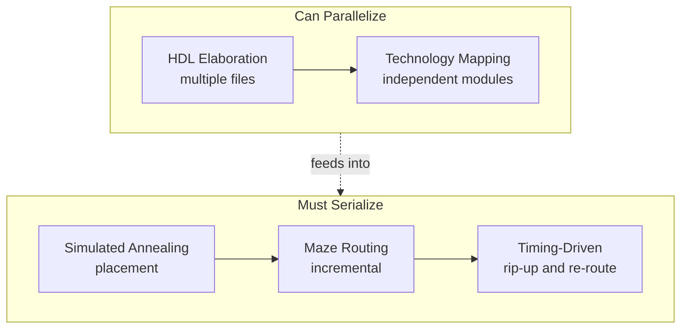

[← FPGA Subsystem](README.md) · [↑ Knowledge Base](../README.md)

# FPGA Compilation & Timing Closure Guide

A practical guide to achieving timing closure on MiSTer FPGA cores targeting the Intel Cyclone V 5CSEBA6U23C8. Focuses on the specific timing challenges of the `sys/` framework: SDRAM controller clock domains, multi-clock CDC paths, and the common failure modes that affect retro emulation cores.

> **See also**: [Build Pipeline](../07_fpga_cores_architecture/build/overview.md) for the complete Quartus project structure, compilation stages, TCL automation, and RBF generation.

---

## 1. Toolchain and Target

### 1.1 Quartus Version

The MiSTer project standardizes on **Intel Quartus Prime Lite 17.0**:
- Newer versions (19+, 20+) may produce larger bitstreams or fail timing on designs that pass in 17.0
- Version 17.0 is the last version before Intel changed IP license handling
- Some cores experiment with Quartus 13 (Q13) for better placement on specific designs

### 1.2 Target Device

The DE10-Nano uses the **5CSEBA6U23C8** (Cyclone V SE, 6U23 package, C8 speed grade):

| Resource | Count | Notes |
|----------|-------|-------|
| ALMs | 41,910 | Adaptive Logic Modules (2×6-input LUT + 2 FFs) |
| M10K Blocks | 553 | 10-Kbit embedded memory (5,662,720 bits total) |
| M20K Blocks | 0 | Not available on this device |
| DSP Blocks | 112 | 18×18 multipliers |
| PLLs | 6 | Fractional PLLs |
| I/O Pins | 314 | 3.3 V LVCMOS |
| DLLs | 4 | Delay-locked loops |
| HPS | Dual-core A9 | Hard Processor System @ 800 MHz |
| DDR3L | 1 GB | Connected to HPS (not FPGA fabric directly) |

> **Caution**: Some third-party sources quote 41,509 ALMs for this device. The Quartus device database reports 41,910 — this is the authoritative count used by the fitter for resource percentage calculations.

### 1.3 Essential Project Files

| File | Purpose |
|------|----------|
| `.qpf` | Quartus Project File (name + version) |
| `.qsf` | Pin assignments, global settings, file list |
| `.sdc` | Synopsys Design Constraints (clocks, I/O delays) |
| `.srf` | Warning suppression rules |
| `sys/sys.tcl` | Framework pin assignments (auto-loaded by Quartus) |

---

## 2. Compilation Stages


1. **Analysis & Synthesis**: HDL → RTL netlist. Checks syntax, infers FSMs, resolves generics.
2. **Fitter**: Places logic into ALMs, routes signals through the FPGA interconnect. This is where timing is determined.
3. **Assembler**: Generates `.sof` (SRAM Object File) from the fitted design.
4. **RBF Conversion**: `quartus_cpf -c project.sof project.rbf` — MiSTer loads the uncompressed RBF via FPGA Manager.

### 2.1 Time Proportions per Stage

The compilation time breakdown for a typical MiSTer core looks like this:

```mermaid
gantt
    title Typical Compilation Time Breakdown (Medium Core, ~15K ALMs)
    dateFormat X
    axisFormat %s min

    section Analysis & Synthesis
    HDL elaboration       :a1, 0, 2
    Technology mapping    :a2, 2, 4

    section Fitter (Place & Route)
    Legalization          :b1, 4, 5
    Placement             :b2, 5, 18
    Routing               :b3, 18, 28
    Post-route timing opt :b4, 28, 30

    section Assembler
    SOF generation        :c1, 30, 31

    section RBF Conversion
    quartus_cpf           :d1, 31, 32
```



> **Rule of thumb**: The Fitter accounts for **75–85%** of total wall-clock time. For large, timing-critical cores (ao486, SNES), the Fitter can exceed **90%** because the placer makes many passes trying to close timing.

| Stage | Typical % | Duration (medium core) | What happens |
|-------|----------|----------------------|--------------|
| Analysis & Synthesis | 10–15% | 3–5 min | HDL parsing, elaboration, RTL optimization, technology mapping into ALMs/M10K/DSPs |
| Fitter: Placement | 30–45% | 10–20 min | Assign each ALM/DSP/M10K to a physical location on the die |
| Fitter: Routing | 30–40% | 10–15 min | Connect placed elements through the FPGA routing fabric |
| Assembler | 2–5% | <1 min | Generate .sof programming file |
| RBF Conversion | <1% | <30 sec | Convert .sof to raw binary for FPGA Manager |

### 2.2 Why the Fitter Dominates

The Fitter solves two sequential **NP-hard** combinatorial optimization problems:

1. **Placement** — assign every ALM, DSP, and M10K to a physical location on the die, such that timing constraints are met. This is analogous to the VLSI floorplanning problem: with 41,910 ALMs and ~30,000 signals, the search space is astronomically large.

2. **Routing** — for each placed signal, find a path through the FPGA's segmented routing fabric that meets the required propagation delay. Each routing decision constrains future decisions because routing tracks are a finite shared resource.

The Fitter uses **simulated annealing** for placement: it starts with a random placement, then iteratively swaps logic elements and measures whether timing improves. Each iteration depends on the state left by the previous one — this is why it cannot be easily parallelized. (For the algorithm's foundations, see S. Kirkpatrick, C. D. Gelatt, and M. P. Vecchi, [*"Optimization by Simulated Annealing"*](https://science.sciencemag.org/content/220/4598/671), *Science* 220(4598): 671–680, 1983; and V. Betz and J. Rose, [*"VPR: A New Packing, Placement and Routing Tool for FPGA Research"*](https://www.eecg.toronto.edu/~vaughn/papers/fpl97.pdf), *FPL 1997*, which is the basis for most modern FPGA placers including Intel's.)

**Design size correlates strongly with Fitter time.** From the [MiSTer Core Resource Census](https://docs.google.com/spreadsheets/d/1wHetlC0RqFnBcqzGEZI8SWi6tlHFxl_ehpaokDwg7CU/edit?gid=0#gid=0):

| Core | ALMs Used | Logic Utilization | Relative Fitter Effort |
|------|-----------|-------------------|-----------------------|
| ao486 | 34,052 | 81.25% | Very high — dense packing, many critical paths |
| SNES | 31,551 | 75.28% | Very high — coprocessors + tight video timing |
| Genesis | 19,194 | 45.80% | Medium — VDP + YM2612 moderate density |
| NES | 18,981 | 45.29% | Medium — light logic, heavy ROM tables |
| Amiga | 15,012 | 35.82% | Low-medium — Agnus DMA is well-structured |
| MemTest | 8,129 | 19.40% | Low — framework overhead only, no core logic |

> As utilization approaches 80%+, the Fitter's job becomes dramatically harder — the remaining unoccupied ALMs are scattered and poorly connected, forcing long routing detours that violate timing.

### 2.3 The Single-Core Bottleneck

Quartus Prime **Lite** (the free edition used by MiSTer) runs the Fitter on a **single CPU core**. This is not a licensing limitation alone — it reflects fundamental algorithmic constraints:



**Why the Fitter is sequential:**

1. **Placement depends on routing, and vice versa.** The simulated-annealing placer evaluates the quality of each placement swap by estimating the resulting routing delay. If you parallelize swaps across cores, two threads might swap elements that share a net — causing conflicting routing estimates.

2. **Routing is incremental.** When the router assigns a signal to a track, that track becomes unavailable for all other signals. Each routing decision changes the available resource pool for subsequent decisions.

3. **Timing closure is a global constraint.** Moving one element to close a failing path can open new failures on other paths. The Fitter must evaluate the entire design after each significant change.

**Quartus Prime Pro** (the paid edition) offers limited Fitter parallelism through "Hyper-Aware Design Flows" and multi-seed parallel exploration, but the core placement engine remains largely sequential. The benefit is primarily in parallelizing *multiple independent compilations* (e.g., DSE II exploring different seeds simultaneously).

**Practical impact on build times:**

| Core | Approx. ALMs | Quartus Lite Build Time | Notes |
|------|-------------|------------------------|-------|
| Small arcade (Pacman) | ~8K | ~5–8 min | Framework-only class |
| Medium console (Genesis) | ~19K | ~15–25 min | Single-pass usually closes |
| Large console (SNES) | ~31K | ~30–60 min | Often needs seed sweep |
| Very large (ao486) | ~34K | ~45–90 min | Seed sweep mandatory |

> **Tip**: Because the Fitter is single-threaded, a **fast single-core clock speed** matters more than core count. A 5 GHz single-thread CPU will compile noticeably faster than a 2.4 GHz 16-core CPU for the same design.

---

## 3. Timing Closure Strategies

Timing closure means all paths in the design meet their clock constraints (positive slack). The Fitter reports timing in the TimeQuest analyzer.

### 3.1 Seed Sweeping

The Fitter uses a random "seed" value as the starting point for placement. Different seeds produce different placement solutions:

- A design that fails timing at seed 1 may pass at seed 5
- MiSTer developers commonly sweep 10–20 seeds and pick the best
- The QSF seed is set via: `set_global_assignment -name SEED 5`

Automation:
```bash
# Sweep seeds 1-20
for seed in $(seq 1 20); do
    quartus_sh --flow compile project -c "--seed=$seed"
    # Check timing report and record best seed
    grep -A2 "Slow 1200mV 85C" output_files/project.sta.rpt
    done
```

### 3.2 Fitter Effort Levels

The Quartus Fitter has three optimization modes (set in QSF or GUI):

| Mode | Setting | Effect |
|------|---------|--------|
| Auto | `AUTO` (default) | Balanced speed and compile time |
| Fast | `FAST` | Prioritize compile time, may sacrifice timing |
| Final | `FINAL` | Aggressive optimization, longer compile time |

For tight cores, set the Fitter to Final effort:
```
set_global_assignment -name OPTIMIZATION_TECHNIQUE SPEED
set_global_assignment -name ROUTER_TIMING_OPTIMIZATION_LEVEL MAXIMUM
set_global_assignment -name PLACER_TIMING_OPTIMIZATION_LEVEL MAXIMUM
```

### 3.3 Design Space Explorer (DSE II)

Quartus includes DSE II, which automatically iterates through optimization settings and seeds:
```bash
quartus_dse --project project --revision project
```

DSE II explores the design space more thoroughly than manual seed sweeping but requires significantly more compute time.

---

## 4. Common Timing Failure Patterns

### 4.1 SDRAM Controller Paths

The SDRAM controller runs at 100–167 MHz and has tight setup/hold requirements on the GPIO pins. This is the most common timing failure in MiSTer cores.

**SDC constraint example** (from `sys/sys.sdc`):
```
create_clock -name clk_sys -period 10.000 [get_registers {pll|*|altpll_component|auto_generated|pll1|vco}

set_output_delay -clock clk_sys -max 2.0 [get_ports {SDRAM_A[*] SDRAM_DQ[*] SDRAM_BA[*]}]
set_output_delay -clock clk_sys -min -1.0 [get_ports {SDRAM_A[*] SDRAM_DQ[*] SDRAM_BA[*]}]
```

**Fix**: Add explicit I/O timing constraints and ensure the SDRAM clock uses the `altddio_out` DDR output primitive (not a regular output).

### 4.2 Cross-Clock Domain (CDC) Paths

The `sys/` framework has multiple clock domains:
- `clk_sys` (HPS/system, typically 50–114 MHz)
- `clk_vid` (video pixel clock, varies per core)
- `clk_hdmi` (HDMI output, up to 148.5 MHz for 1080p)
- `clk_audio` (audio processing, typically 24.576 MHz)

The framework handles CDC internally using double-flop synchronizers and FIFOs, but the SDC must declare false paths between domains:
```
set_clock_groups -asynchronous \
    -group [get_clocks clk_sys] \
    -group [get_clocks clk_vid] \
    -group [get_clocks clk_audio]
```

**Missing CDC constraints** are the most common cause of timing warnings that are actually benign but mask real timing failures.

### 4.3 High Fan-Out Reset Networks

A global reset signal driving thousands of registers creates routing congestion. The Fitter struggles to route these within timing.

**Fix**: Use the `altera_reserved_reset` global signal assignment, or restructure resets to be local per-module:
```verilog
// Instead of:
always @(posedge clk) if(reset) ...

// Use local reset deassertion:
reg rst_d;
always @(posedge clk) rst_d <= reset;
wire local_rst = rst_d & ~some_init_done;
```

### 4.4 Combinatorial Paths Between Clock Domains

If a core passes combinatorial signals between clock domains (even through a synchronizer), the data can glitch during setup.

**Fix**: Register all signals before crossing clock domains:
```verilog
// BAD: combinatorial cross-domain
assign data_to_other_domain = a & b;

// GOOD: registered cross-domain
always @(posedge clk) data_reg <= a & b;
assign data_to_other_domain = data_reg;
```

---

## 5. Quartus Version Specifics

### 5.1 Q17 (Quartus 17.0)

The standard version for MiSTer development:
- Best placement results for most cores
- IP cores from older versions (Q13, Q15) are automatically upgraded
- The `sys/` framework's IP (PLLs, DDR output, memory interfaces) is tested with Q17

### 5.2 Q13 (Quartus 13.0sp1)

Some cores use Q13 because:
- The Q13 Fitter sometimes finds better placement for specific design topologies
- The Q13 synthesis engine handles certain Verilog constructs differently
- Q13 compiles faster on older hardware

**Caveat**: IP cores must be regenerated for Q13. The `sys/` framework's IP may need manual migration.

### 5.3 Q20+ (Quartus Prime Pro 20+)

Not recommended for MiSTer:
- Pro edition changed the Fitter algorithm (produces different placement)
- Some cores that pass timing in Q17/Lite fail in Q20/Pro
- IP licensing model changed — some free IPs became paid

---

## 6. Build Automation

### 6.1 TCL Hooks

The `sys/` framework provides TCL scripts that run automatically during compilation:

| Script | Trigger | Purpose |
|--------|---------|----------|
| `sys/sys.tcl` | Pre-synthesis | Pin assignments, HPS configuration |
| `sys/build_id.tcl` | Post-assembly | Build timestamp, CDF generation |

### 6.2 CI/CD Pipeline

Most core repositories use GitHub Actions for automated builds:

```yaml
# Typical CI workflow
- name: Compile
  run: |
    quartus_sh --flow compile Template
    quartus_cpf -c Template.sof Template.rbf
    # Check timing
    grep -q "Timing requirements not met" output_files/Template.sta.rpt && exit 1
```

---

## 7. Cross-References

- [Build Pipeline](../07_fpga_cores_architecture/build/overview.md) — Complete Quartus project structure, compilation stages, TCL automation, RBF generation
- [FPGA Performance Metrics](fpga_performance_metrics.md) — Resource baselines and utilization analysis
- [SDRAM Controller Deep Dive](sdram_controller.md) — Timing requirements of the SDRAM controller
- [SDRAM Timing Theory](sdram_timing_theory.md) — Phase alignment and GPIO timing budgets
- [FPGA Debugging Tools](fpga_debugging_tools.md) — Signal Tap and telemetry for runtime verification
