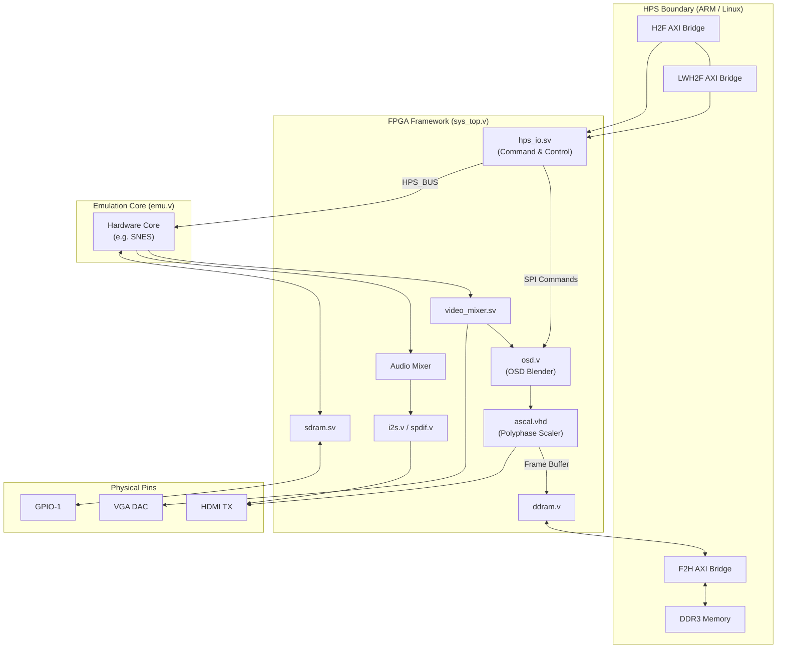

[← FPGA Subsystem](README.md) · [↑ Knowledge Base](../README.md)

# MiSTer FPGA Framework: Architecture & Overview

The MiSTer platform relies on the **Cyclone V System-on-Chip (SoC)**, which features a hard ARM processor (HPS) and an FPGA fabric. To bridge these two domains and provide a uniform environment for hardware recreation, the project uses a standardized wrapper known as **`Template_MiSTer`** (specifically, the `sys/` directory).

This document provides the high-level architectural overview of this framework. It serves as the "fundamental basement" for understanding how data flows between the Linux environment and the cycle-accurate hardware cores.

Sources:
* [`Template_MiSTer`](https://github.com/MiSTer-devel/Template_MiSTer)

---

## 1. Overview

The MiSTer FPGA framework (primarily codified within the `sys/` directory of every core, and maintained as the standalone `Template_MiSTer` repository) is a comprehensive set of standard Verilog/VHDL modules and communication protocols. It serves as the defining hardware abstraction layer (HAL) of the MiSTer ecosystem, acting as the mandatory integration layer that fuses disparate hardware components into a cohesive, manageable system.

Every emulation core (e.g., SNES, Amiga, Genesis) **must** utilize this framework to function. The framework envelops the core logic, providing it with a standardized, uniform environment to interact with the internal capabilities of the Cyclone V SoC, the physical DE10-Nano board, external expansion modules (I/O, SDRAM), and the overarching Linux software stack running on the Hard Processor System (HPS).

## 2. Architectural Goal and Purpose

Developing a cycle-accurate hardware core on a modern SoC platform involves immensely complex, high-speed I/O and synchronization tasks. Without a unifying framework, a core developer would normally have to manually:
1.  **Drive Modern Displays:** Generate the digital video pixel stream, handle complex video blanking logic, and implement high-speed I2C/I2S communication to drive the ADV7513 HDMI transmitter.
2.  **Resolution Scaling:** Write and maintain custom polyphase resolution scaling logic to upconvert native 240p retro signals to modern 1080p/1440p displays.
3.  **HPS/Linux Interfacing:** Negotiate complex AXI bridges to receive ROM files, configuration data, and joystick inputs from the Linux operating system.
4.  **Memory and Resource Control:** Implement diverse memory controllers—managing both deterministic, low-latency SDR SDRAM for cycle-accurate CPU access and non-deterministic, burst-oriented DDR3 over AXI for high-bandwidth caching and video buffering.
5.  **Peripheral Clock Generation:** Calculate and configure Phase-Locked Loops (PLLs) for complex I/O components like the HDMI physical layer and high-fidelity audio DACs, completely separate from the core's cycle-accurate system clocks.

**The primary goal of the framework is massive deduplication through strict abstraction.** If every core developer had to implement these low-level system integration features from scratch, the barrier to entry would be insurmountable and the ecosystem would heavily fragment. 

By centralizing all modern I/O, scaling algorithms, and communication protocols into a single, shared framework, developers can focus entirely on the cycle-accurate reverse engineering of the target retro hardware. The core developer treats the outside world as a simple black box: it accepts generic, unscaled video and audio signals, and in return, provides perfectly synchronized ROM data and user input.

---

## 3. High-Level Architecture

### 3.1 Master Block Diagram

### 3.2 Component Descriptions

The framework is composed of several discrete logic modules, instantiated within `sys_top.v`. 

| Component | Where Used | Why It Exists |
| :--- | :--- | :--- |
| **[`hps_io.sv`](hps_bridge_reference.md)** | Central control bridge connecting the HPS to `emu.v` and `osd.v`. | To translate Linux-side AXI bridge signals into a deterministic, 49-bit parallel bus (`HPS_BUS`) using a software-emulated SPI protocol. Handles ROM downloading and joystick polling. |
| **[`video_mixer.sv`](video_audio_pipelines.md)** | Sits between the core's video output and the scaler/DACs. | Provides 15 kHz to 31 kHz scandoubling (for PC VGA monitors), applies color gamma LUTs, and generates composite sync (CSYNC) for analog CRT setups. |
| **[`osd.v`](../05_configuration/osd.md)** | Intercepts the video stream before the scaler or analog outputs. | Blends the MiSTer graphical user interface (menus, volume bars) directly into the pixel stream via commands received from `hps_io.sv`. |
| **[`ascal.vhd`](video_audio_pipelines.md)** | The digital video pipeline. | A polyphase scaler that converts low-resolution, low-refresh-rate retro video into standard 720p/1080p/1440p HDMI signals. Requires a massive framebuffer to operate. |
| **[`ddram.v`](memory_controllers.md)** | Placed between `ascal.vhd` (or the core) and the F2H AXI bridge. | Provides a simplified, burst-oriented wrapper around the complex AXI protocol to access the HPS DDR3 memory. Used by the scaler for framebuffering and by CD-ROM cores for caching ISOs. |
| **[`sdram.sv`](memory_controllers.md)** | Connected directly to the `emu.v` core and GPIO-1 pins. | Provides a multi-ported, perfectly deterministic SDR SDRAM controller. Required because DDR3 latency is variable, which breaks cycle-accurate CPU timing. |

### 3.3 The Shell and Core Paradigm

The framework strictly enforces a **"Shell and Core"** architectural separation:

*   **The Shell (`sys_top.v`)**: The framework layer. This is the top-level Verilog entity synthesized to the physical pins. It instantiates the emulation core and surrounds it with standard MiSTer I/O modules.
*   **The Core (`emu.v`)**: The actual hardware recreation. The core exposes a standardized, abstracted set of generic signals to the Shell.

### 3.4 Hardware Contract

The core is completely agnostic to the physical board it runs on. It adheres to a simple contract:
*   **Video:** Outputs native, unscaled analog video timing (e.g., 15 kHz 240p via `VGA_R`, `VGA_HS`).
*   **Audio:** Outputs generic signed 16-bit PCM samples (`AUDIO_L`, `AUDIO_R`).
*   **Input:** Receives controller state as a simple 32-bit vector (`JOY1`), regardless of whether the physical device is a Bluetooth controller or a USB keyboard.

---

## 4. Architectural Details

### 4.1 Physical Pin Mapping (`sys_top.v`)
Because `sys_top.v` is the top-level synthesis entity, it is exclusively responsible for mapping logic to the physical pins of the Cyclone V FPGA:
*   **GPIO-1 (SDRAM):** Exclusively mapped to the `sdram.sv` controller. These pins drive the address, data, and command lines of the external SDR SDRAM board, offering the lowest possible latency.
*   **GPIO-0 (I/O Board):** Mapped to the analog A/V DACs, physical pushbuttons, and LEDs on the MiSTer I/O board.
*   **USER_IO:** A subset of GPIO-0 pins mapped directly into the `emu.v` core, bypassing the Linux input stack. This is the foundation of the **Serial Native Accessory Converter (SNAC)** system for zero-latency OEM controllers.

### 4.2 Clocking Architecture
Retro consoles rely on highly specific master clocks (e.g., the Amiga's 28.37516 MHz). Because every core requires different timing, clock generation is explicitly split between the Core and the Shell:

*   **The Core (`emu.v`):** Takes a fixed 50 MHz reference clock from the Shell and instantiates its own specific Phase-Locked Loop (PLL) to generate cycle-accurate system clocks. The core must explicitly provide `CLK_VIDEO` (pixel clock) and `clk_sys` (system clock) back up to the Shell for video processing and SDRAM interfacing.
*   **The Shell (`sys_top.v`):** Generates all standard, fixed clocks required by the MiSTer hardware peripherals using dedicated PLLs:
    *   **`pll_hdmi`:** Generates high-speed clocks for the ADV7513 HDMI PHY.
    *   **`pll_audio`:** Generates reference clocks for I2S and S/PDIF encoders.

By splitting the clock domains, the framework handles the complex timing of modern digital interfaces (HDMI, SPDIF), leaving the core developer free to focus solely on achieving silicon-accurate logic frequencies.

### 4.3 Framework Integration (`Template_MiSTer`)
The framework is distributed as the `Template_MiSTer` repository. A core developer adds it as a Git submodule in their `sys/` directory. If the framework receives an update (e.g., a new HDMI scaler feature), the developer simply pulls the latest `sys/` submodule commit and recompiles. The core logic remains entirely untouched.
