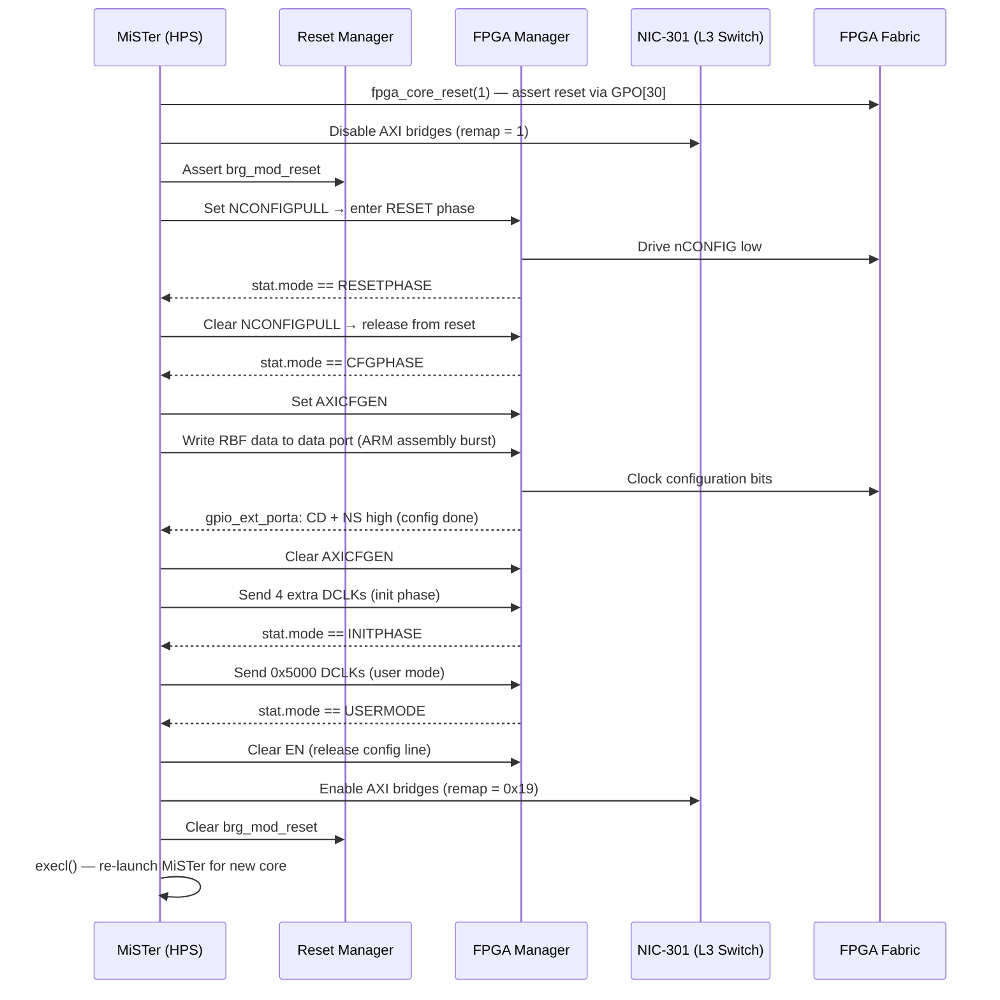

[← FPGA Subsystem](README.md) · [↑ Knowledge Base](../README.md)
# FPGA Bitstream Loading

Loading a new core into the FPGA fabric requires:
1. Asserting global reset on the active FPGA core.
2. Tearing down the HPS↔FPGA AXI bridges.
3. Writing the RBF (Raw Binary File) bitstream into the FPGA Manager data port.
4. Waiting for configuration to complete.
5. Re-enabling the bridges.
6. Re-launching the MiSTer binary for the new core.

Source: [`Main_MiSTer/fpga_io.cpp`](https://github.com/MiSTer-devel/Main_MiSTer/blob/master/fpga_io.cpp)

---

## FPGA Manager Hardware

The Intel Cyclone V FPGA Manager peripheral at `0xFF706000` controls the
configuration state machine:

```
FPGA Manager Registers (all at 0xFF706xxx):
  0x000  stat      — FPGA status (mode bits, MSEL)
  0x004  ctrl      — control register
  0x008  dclkcnt   — DCLK count register
  0x00C  dclkstat  — DCLK status
  0x014  gpio_ext_porta — GPIO input (Init_Done, Config_Done signals)
  0x018  gpio_porta_eoi — clear GPIO interrupts
  0x010  (GPO)     — General Purpose Output (also used for SSPI)
  0x014  (GPI)     — General Purpose Input
```

Physical address mapping (defined in `Main_MiSTer/fpga_base_addr_ac5.h`): 
`SOCFPGA_FPGAMGRREGS_ADDRESS = 0xFF706000`
`SOCFPGA_FPGAMGRDATA_ADDRESS  = 0xFFB90000`

---

## RBF Loading Sequence



---

## Code: `socfpga_load()`

```c
// Main_MiSTer/fpga_io.cpp — socfpga_load
static int socfpga_load(const void *rbf_data, size_t rbf_size)
{
    // 1. Initialize FPGA Manager
    status = fpgamgr_program_init();
    // Sets MSEL-based CD ratio, enables config, asserts nCONFIG, waits for
    // RESETPHASE, releases nCONFIG, waits for CFGPHASE, enables AXI config

    // 2. Write bitstream via burst ARM assembly
    fpgamgr_program_write(rbf_data, rbf_size);
    // Uses ldmia/stmia in 32-byte blocks to data port address

    // 3. Wait for config done
    fpgamgr_program_poll_cd();
    // Polls gpio_ext_porta for CD (Config Done) + NS (nStatus) flags

    // 4. Init phase transition
    fpgamgr_program_poll_initphase();
    // Sends 4 DCLKs via dclkcnt register

    // 5. User mode transition
    fpgamgr_program_poll_usermode();
    // Sends 0x5000 DCLKs, waits for USERMODE

    return 0;
}
```

## Code: AXI Bridge Control (`do_bridge`)

```c
// Main_MiSTer/fpga_io.cpp — do_bridge
static void do_bridge(uint32_t enable)
{
    if (enable) {
        // Re-enable DDR3 port to FPGA
        writel(0x00003FFF, (void*)(SOCFPGA_SDR_ADDRESS + 0x5080));
        // Release bridge reset
        writel(0x00000000, &reset_regs->brg_mod_reset);
        // Remap: FPGA can see all HPS memory
        writel(0x00000019, &nic301_regs->remap);
    } else {
        // Isolate bridges before reconfiguration
        writel(0, &sysmgr_regs->fpgaintfgrp_module);
        writel(0, (void*)(SOCFPGA_SDR_ADDRESS + 0x5080));
        writel(7, &reset_regs->brg_mod_reset);
        writel(1, &nic301_regs->remap);  // HPS memory only
    }
}
```

> [!CAUTION]
> Tearing down the AXI bridges (`nic301_regs->remap = 1`) prior to loading the FPGA bitstream is absolutely critical. Reconfiguring the FPGA while the HPS is actively transacting across the H2F or LWH2F bridges will instantly lock up the AXI bus and crash the Linux kernel.

> [!NOTE]
> For details on how `Main_MiSTer` orchestrates the system-wide reboot cycle to load new cores via U-Boot and OCRAM handoff, see the [Global Boot Sequence](../01_system_architecture/boot_sequence.md) reference.

---


## CD Ratio (MSEL)

The MSEL[3:0] pins on the DE10-Nano board determine how the FPGA Manager
clocks configuration data:

| MSEL[3] | MSEL[1:0] | Width | CD Ratio |
|---|---|---|---|
| 1 | 00 | 32-bit | ×1 |
| 1 | 01 | 32-bit | ×4 |
| 1 | 10 | 32-bit | ×8 |
| 0 | 00 | 16-bit | ×1 |
| 0 | 10 | 16-bit | ×4 |

The DE10-Nano uses MSEL = `01010` (passive parallel, 16-bit, CD ratio ×2)
by default.

---

## Platform Context: MiSTer vs. Standard Linux FPGA Manager

In a typical Yocto/Debian embedded Linux environment on the Cyclone V, configuring the FPGA is handled by the kernel's `fpga-mgr` framework via device tree overlays (DTOs) or the `/sys/class/fpga_manager` sysfs interface.

MiSTer bypasses the Linux kernel entirely for FPGA configuration. Instead, `Main_MiSTer` maps the physical registers of the FPGA Manager and Reset Manager into userspace via `/dev/mem`. This approach yields two major benefits:
1.  **Deterministic Latency**: Bypassing sysfs overhead allows `Main_MiSTer` to blast the `.rbf` file into the data port using optimized ARM assembly burst instructions (`ldmia`/`stmia`), resulting in near-instant core loading.
2.  **Simplified Orchestration**: It allows MiSTer to perfectly synchronize the tearing down of AXI bridges and the suspension of Linux background tasks before configuration, mitigating the risk of kernel panics caused by severed AXI transactions.
