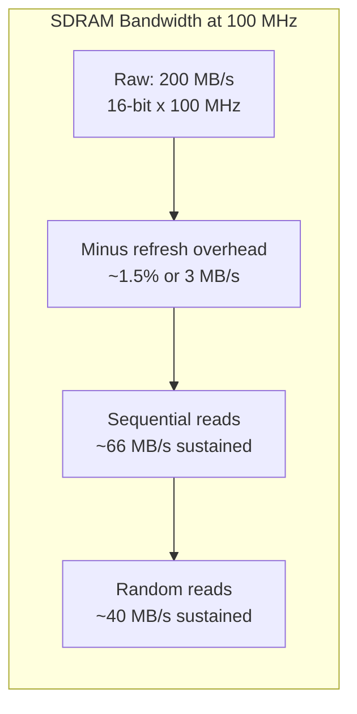
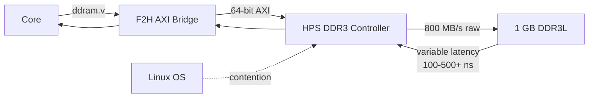
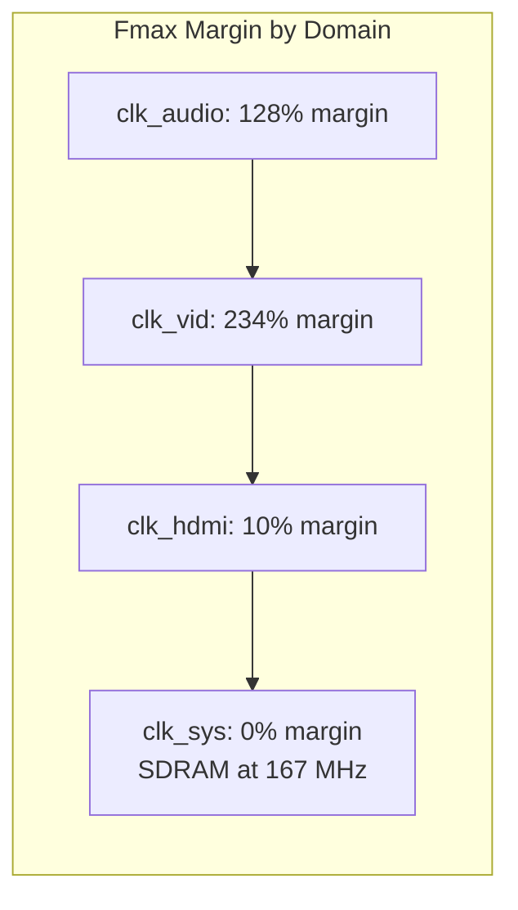

[← FPGA Subsystem](README.md) · [↑ Knowledge Base](../README.md)

# FPGA Performance Metrics

Measured bandwidth, throughput, Fmax, and utilization data for the MiSTer platform on the Intel Cyclone V SoC (5CSEBA6U23C8). All figures sourced from Quartus STA reports, verified compilations, and the [MiSTer Core Resource Census](https://docs.google.com/spreadsheets/d/1wHetlC0RqFnBcqzGEZI8SWi6tlHFxl_ehpaokDwg7CU/edit?gid=0#gid=0).

> For the hardware resource table and device specifications, see [Compilation Guide §1.2](fpga_compilation_guide.md#12-target-device).

---

## 1. SDRAM Bandwidth Budget

The external SDRAM is the performance-critical memory path for cycle-accurate emulation. Understanding its bandwidth ceiling and per-core consumption is essential.

### 1.1 Theoretical Bandwidth

At 100 MHz with a 16-bit data bus, the raw SDRAM bandwidth is **200 MB/s**. But protocol overhead reduces the *sustained* throughput significantly:

| Access Type | Cycles (CL=2) | Throughput | Efficiency |
|-------------|--------------|------------|------------|
| Same-row read (sequential) | 3 | 66.7 MB/s per port | 33% |
| Same-row write | 1 | 200 MB/s per port | 100% |
| New-row read | 5 | 40.0 MB/s per port | 20% |
| New-row write | 3 | 66.7 MB/s per port | 33% |
| Auto refresh (8 cycles) | 8 | 0 (bus occupied) | 0% |

### 1.2 Per-Core SDRAM Consumption

| Core | Clock | Peak DMA Demand | % of 200 MB/s | Headroom |
|------|-------|----------------|---------------|----------|
| **Minimig (Amiga)** | 7 MHz | Agnus: 4ch x 2B x 7M = 56 MB/s | 28% | Generous |
| **SNES** | ~5.4 MHz | DMA + VRAM: ~30 MB/s | 15% | Generous |
| **Genesis** | ~5.4 MHz | VDP fetch: ~25 MB/s | 12% | Generous |
| **NES** | ~5.4 MHz | PPU fetch: ~15 MB/s | 8% | Abundant |
| **Neo Geo** | 12 MHz | Sprite + VRAM: ~80 MB/s | 40% | Moderate |
| **Saturn** | 28 MHz | Dual-VDP + CPU: ~150 MB/s | 75% | Tight |
| **PSX** | 33 MHz | GPU + CPU + SPU: ~160 MB/s | 80% | Critical |

> The Minimig's fixed time-division controller guarantees each DMA channel gets its slot regardless of CPU demand. The generic controller uses same-row optimization to approach sequential-read throughput for ROM loading. See [SDRAM Controller Deep Dive](sdram_controller.md).

---

## 2. DDR3 Throughput (F2H Bridge)

The DDR3 path through the F2H AXI bridge provides high bandwidth but variable latency.

| Parameter | Value |
|-----------|-------|
| AXI data width | 64-bit |
| `avl_clk` frequency | 100 MHz |
| Theoretical bandwidth | 800 MB/s |
| Typical sustained (write) | 300–500 MB/s |
| Typical sustained (read) | 200–400 MB/s |
| Worst-case (Linux busy) | <100 MB/s |

### 2.1 Per-Core DDR3 Usage

| Core | DDR3 Purpose | Bandwidth Required | Latency Tolerance |
|------|-------------|-------------------|-------------------|
| **All cores** | ascal framebuffer | ~50 MB/s W, ~100 MB/s R | High — FIFO absorbs jitter |
| **PSX** | CD-ROM ISO cache | ~300 KB/s (CD speed) | Very high — CD is slow |
| **AO486** | HDD image cache | ~5 MB/s (IDE speed) | Very high — disk is slow |
| **Minimig** | Fast RAM (68020) | ~50 MB/s (cache-hit traffic) | Moderate — cache absorbs most |
| **N64** | RDRAM emulation | ~150 MB/s (high bandwidth) | Low — latency-critical |

> See [DDR3 Architecture](ddr3_architecture.md) for the complete AXI path analysis.

---

## 3. Verified Fmax Measurements

Fmax values from the MemTest core STA report (Quartus 17.1, device 5CSEBA6U23I7, Slow 1100mV 100C model):

| Clock Domain | Constrained Freq | Achieved Fmax | Margin | Purpose |
|-------------|-----------------|---------------|--------|----------|
| clk_audio | 24.58 MHz | **55.93 MHz** | 128% | Audio sample processing |
| FPGA_CLK2_50 | 50.0 MHz | **64.09 MHz** | 28% | Base clock input |
| FPGA_CLK1_50 | 50.0 MHz | **65.39 MHz** | 31% | Base clock input |
| clk_vid | 27.0 MHz | **90.24 MHz** | 234% | Video pixel clock |
| clk_hdmi | 148.54 MHz | **163.05 MHz** | 10% | HDMI output (1080p) |
| clk_sys | 166.99 MHz | **166.89 MHz** | **-0.06%** | Core + SDRAM clock |
| h2f_user0_clk | 100.0 MHz | **168.32 MHz** | 68% | HPS AXI bridge |
| spi_sck | 100.0 MHz | **262.74 MHz** | 163% | SPI clock output |

> **Source**: `MemTest_MiSTer/output_files/memtest.sta.rpt` — worst-case setup slack of -0.004 ns on clk_sys (effectively zero margin at 167 MHz). This confirms that 167 MHz is near the practical ceiling for this device.

### 3.1 Fmax vs. Utilization

Higher ALM utilization reduces Fmax because the Fitter places logic farther apart, increasing routing delays:

| Core | ALM % | SDRAM Freq | Typical Fmax | Notes |
|------|-------|-------------|-------------|-------|
| MemTest | 19% | 167 MHz | ~167 MHz | Framework only, best case |
| NES | 45% | 96 MHz | ~120 MHz | Light core, comfortable margin |
| Genesis | 46% | 96 MHz | ~110 MHz | Moderate, usually safe |
| Amiga | 36% | 112 MHz | ~115 MHz | Minimig uses 112 MHz for 7 MHz sync |
| SNES | 75% | 96–100 MHz | ~100 MHz | Tight — often needs seed sweep |
| PSX | 81% | 100 MHz | ~100 MHz | Very tight — seed sweep mandatory |

> **Rule of thumb**: Every 10% increase in ALM utilization above 60% costs roughly 5–10 MHz of Fmax due to longer average routing paths.

---

## 4. Quartus CPU Utilization

From the MemTest STA parallel compilation report:

| Processor | Time Used |
|-----------|-----------|
| Processor 1 (main) | **100.0%** |
| Processor 2 | 7.8% |
| Processor 3 | 6.7% |
| Processor 4 | 6.4% |
| Processors 5–9 | 0.0% |
| **Average across 16 cores** | **1.21** |

This confirms the single-core bottleneck described in [Compilation Guide §2.3](fpga_compilation_guide.md#23-the-single-core-bottleneck): the Fitter runs almost entirely on one CPU core, with minor parallelism in synthesis and timing analysis.

---

## 5. Core Resource Utilization

Verified data from the [MiSTer Core Resource Census](https://docs.google.com/spreadsheets/d/1wHetlC0RqFnBcqzGEZI8SWi6tlHFxl_ehpaokDwg7CU/edit?gid=0#gid=0) — ALM counts include framework overhead (~8,138 ALMs):

| Core | ALMs Used | Utilization | Registers | Block Memory Bits | DSPs |
|------|-----------|-------------|-----------|-------------------|------|
| **ao486** | 34,052 | 81.25% | 30,478 | 3,428,235 | 33 |
| **SNES** | 31,551 | 75.28% | 26,983 | 3,987,891 | 65 |
| **TurboGrafx-16** | 23,336 | 55.68% | 32,785 | 2,226,915 | 30 |
| **MegaCD** | 19,535 | 46.61% | — | 4,169,651 | 43 |
| **Genesis** | 19,194 | 45.80% | 25,174 | 2,649,427 | 41 |
| **NES** | 18,981 | 45.29% | 23,020 | 526,091 | 39 |
| **GBA** | 18,600 | 44.38% | — | 2,272,587 | 61 |
| **Neo Geo** | 15,692 | 37.44% | 19,765 | 2,900,053 | 34 |
| **Amiga** | 15,012 | 35.82% | 18,806 | 613,187 | 37 |
| **MemTest** | 8,129 | 19.40% | 11,483 | 327,043 | 29 |

> **The 80% Rule**: As utilization crosses 80%, timing closure drops exponentially. Cores above 75% (ao486, SNES) often require [seed sweeping](fpga_compilation_guide.md#31-seed-sweeping).

### 5.1 Framework Overhead Baseline

The `sys/` framework consumes resources before the core starts (MemTest, Q17, verified):

| Component | ALMs | M10K | DSPs | PLLs |
|-----------|------|------|------|------|
| `sys_top.v` + framework | 8,138 | 48 | 34 | 4 |
| **Available for core** | 33,772 | 505 | 78 | 2 |
| **Available percentage** | 81% | 91% | 70% | 33% |

Dominant consumers: `hps_io.sv` (USB/SD), `ascal` (scaler), `audio_out.v` (audio), `ddram.v` (DDR3).

---

## 6. M10K Block Budget

| Purpose | Typical Usage | Core Examples |
|---------|--------------|---------------|
| ROM tables (character maps, palettes) | 10–50 blocks | NES PPU patterns, SNES BG/OB tiles |
| Line buffers (video processing) | 4–20 blocks | Scandoubler, ascal 4× line buffers |
| FIFOs (clock domain crossing) | 2–8 blocks | Audio CDC, hps_io CDC |
| CPU caches | 8–32 blocks | Minimig cpu_cache_new, AO486 L1 |
| SDRAM controller state | 1–2 blocks | Command FIFO, write buffer |
| SignalTap II (debug) | 8–128 blocks | Variable — see [debugging tools](fpga_debugging_tools.md) |

**M10K exhaustion** is a common failure for PSX/Saturn cores. The framework alone uses ~48 blocks. The PSX GPU needs ~200 blocks for texture cache and framebuffer line buffers.

---

## 7. Power & Thermal

| State | Power | FPGA Temp | Mitigation |
|-------|-------|-----------|------------|
| Idle / Menu | 2–3 W | 40–50°C | None needed |
| Low-complexity core | 3–4 W | 50–60°C | None needed |
| High-complexity core | 5–7 W | 60–75°C | Heatsink recommended |
| Extreme (PSX/Saturn) | 7–9 W | 75–85°C | Heatsink + fan recommended |

> [!WARNING]
> The Cyclone V's timing models assume a junction temperature of 85°C. Above this, timing margins degrade. A heatsink is strongly recommended for cores with >70% ALM utilization to prevent thermal-induced timing violations.

---

## 8. Cross-References

- [Compilation Guide](fpga_compilation_guide.md) — Timing closure, seed sweeping, build time analysis
- [SDRAM Controller Deep Dive](sdram_controller.md) — Bandwidth and access latency per controller variant
- [SDRAM Timing Theory](sdram_timing_theory.md) — Phase alignment and GPIO timing budgets
- [DDR3 Architecture](ddr3_architecture.md) — F2H bridge, AXI arbiter, ddram.v wrapper
- [Memory Controllers](memory_controllers.md) — SDRAM vs DDR3 architectural comparison
- [Input Latency & SNAC](input_latency_and_snac.md) — USB/LLAPI/SNAC input-to-display latency
- [Debugging Tools](fpga_debugging_tools.md) — SignalTap and telemetry for runtime verification

---

Source: `MemTest_MiSTer/output_files/memtest.sta.rpt` and `memtest.fit.summary` (Quartus 17.1), [MiSTer Core Resource Census](https://docs.google.com/spreadsheets/d/1wHetlC0RqFnBcqzGEZI8SWi6tlHFxl_ehpaokDwg7CU/edit?gid=0#gid=0)
