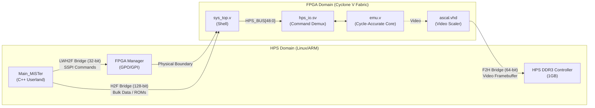

[← FPGA Subsystem](README.md) · [↑ Knowledge Base](../README.md)

# HPS Bridge Reference (H2F / LWH2F / F2H)

This document details the "fundamental basement" of MiSTer's architecture: the interfaces bridging the Hard Processor System (HPS, the ARM/Linux domain) and the FPGA fabric. It consolidates the raw register mappings, the Software SPI (SSPI) protocol, and the internal 49-bit `HPS_BUS`.

Sources: [`Main_MiSTer/fpga_io.cpp`](https://github.com/MiSTer-devel/Main_MiSTer/blob/master/fpga_io.cpp), [`Template_MiSTer/sys/sys_top.v`](https://github.com/MiSTer-devel/Template_MiSTer/blob/master/sys/sys_top.v), [`Template_MiSTer/sys/hps_io.sv`](https://github.com/MiSTer-devel/Template_MiSTer/blob/master/sys/hps_io.sv)

---

## 1. The Bridge Topologies

The Cyclone V SoC provides three primary AXI bridges. MiSTer utilizes them as follows:

| Bridge | Width | Clock | Direction | MiSTer Use Case |
|---|---|---|---|---|
| **H2F** | 128-bit | 200 MHz | HPS → FPGA | High-speed data streaming (ROMs, Disk Images) |
| **LWH2F** | 32-bit | 100 MHz | HPS → FPGA | Command/Control (SSPI), Configuration Registers |
| **F2H** | 64-bit | 200 MHz | FPGA → HPS | Framebuffer access (`ascal`), Large ROM cache |



> [!IMPORTANT]
> **Why SSPI instead of AXI?**
> Standard AXI interconnects are complex to implement in HDL and consume significant logic resources. To keep core development simple, MiSTer maps the HPS General-Purpose I/O (GPO/GPI) registers through the Lightweight H2F (LWH2F) bridge. `Main_MiSTer` uses these registers to bit-bang a proprietary **Software SPI (SSPI)** protocol. This creates a unified, simple, and deterministic command interface across all cores.

---

## 2. GPO / GPI Registers — The Raw Hardware Boundary

The lowest-level physical boundary between the HPS and the FPGA logic is a pair of 32-bit registers exposed through the **FPGA Manager** peripheral.

| Register | Physical Address | Access |
|---|---|---|
| **GPO** (Output from HPS) | `0xFF706010` | Written by ARM (`Main_MiSTer`) → read by FPGA |
| **GPI** (Input to HPS) | `0xFF706014` | Written by FPGA → read by ARM (`Main_MiSTer`) |

### GPO Bit Layout (HPS → FPGA)
The GPO register drives the outgoing commands and the SSPI clock.

| Bits | Name | Description |
|---|---|---|
| `[15:0]` | `io_din` | 16-bit data word to send to FPGA |
| `[17]` | `SSPI_STROBE` | Toggling this bit clocks one 16-bit word into the FPGA |
| `[18]` | `io_ss0` | Chip-select 0 (FPGA Core channel) |
| `[19]` | `io_ss1` | Chip-select 1 (OSD channel) |
| `[20]` | `io_ss2` | Chip-select 2 (UIO system channel) |
| `[29]` | `led_disk` | Controls disk activity LED from HPS side |
| `[30]` | `RESET` | Asserts core reset when set |
| `[31]` | `ID_MODE` | When set, FPGA returns core magic/ID on GPI instead of data |

### GPI Bit Layout (FPGA → HPS)
The GPI register returns acknowledgments and data back to the HPS.

| Bits | Name | Description |
|---|---|---|
| `[15:0]` | `io_dout` | 16-bit response word from FPGA |
| `[16]` | `io_wide` | 1 = WIDE (16-bit) file I/O mode active |
| `[17]` | `io_ack` | Strobe acknowledgement (mirrors `SSPI_STROBE` back) |
| `[19:18]` | `io_ver` | IO protocol version (current = 1) |
| `[28]` | `io_type` | Board I/O type |
| `[30:29]` | `btn_state` | Physical button states (User/OSD buttons) |
| `[31]` | `NOT_READY` | 1 = FPGA not in user mode (uninitialized) |

---

## 3. The SSPI (Software SPI) Protocol

MiSTer transfers data 16 bits at a time by writing to `GPO[15:0]` and then toggling `GPO[17]` (`SSPI_STROBE`). The C++ side waits for `GPI[17]` (`io_ack`) to flip, indicating the FPGA has latched the data.

### Standard Synchronous Transfer
Used for commands where a response is required:

```c
// Main_MiSTer/fpga_io.cpp — fpga_spi
uint16_t fpga_spi(uint16_t word) {
    uint32_t gpo = (fpga_gpo_read() & ~(0xFFFF | SSPI_STROBE)) | word;

    fpga_gpo_write(gpo);               // Set data
    fpga_gpo_write(gpo | SSPI_STROBE); // Assert strobe

    // Wait for FPGA to acknowledge
    while (!(fpga_gpi_read() & SSPI_ACK));

    fpga_gpo_write(gpo);               // De-assert strobe

    // Wait for FPGA to acknowledge de-assertion, then return response
    int gpi;
    do { gpi = fpga_gpi_read(); } while (gpi & SSPI_ACK);
    
    return (uint16_t)gpi;
}
```

### Fast (Fire-and-Forget) Transfer
Used during bulk data streaming (like ROM loading) where back-pressure is handled differently, maximizing the H2F bridge throughput (~150 MB/s).

```c
// Main_MiSTer/fpga_io.cpp — fpga_spi_fast
uint16_t fpga_spi_fast(uint16_t word) {
    uint32_t gpo = (fpga_gpo_read() & ~(0xFFFF | SSPI_STROBE)) | word;
    fpga_gpo_write(gpo);
    fpga_gpo_write(gpo | SSPI_STROBE);
    fpga_gpo_write(gpo);               // De-assert immediately
    return (uint16_t)fpga_gpi_read();
}
```

### The Transaction Flow
Every interaction follows a standard Chip-Select wrapper pattern:

1. **Assert CS**: Set `io_ss0`, `io_ss1`, or `io_ss2`.
2. **Send Command**: Call `fpga_spi(cmd)`.
3. **Send Payload**: Call `fpga_spi(data)` in a loop.
4. **De-assert CS**: Clear all `SS` bits. This triggers the FPGA to commit the state change.

*For example, the OSD rendering commands detailed in [osd.md](../05_configuration/osd.md) rely entirely on this sequence wrapped with `EnableOsd()` / `DisableOsd()`.*

---

## 4. `HPS_BUS` — The Fabric Abstraction

Once the GPO signals cross into the FPGA fabric, `sys_top.v` maps them into a 49-bit parallel vector called `HPS_BUS[48:0]`. This vector is routed to `hps_io.sv` inside the emulator core.

| Bits | Signal Name | Description |
|---|---|---|
| `[15:0]` | `io_dout` | Data word returned by FPGA to HPS (maps to GPI) |
| `[31:16]`| `io_din` | The 16-bit incoming data word from HPS |
| `[32]` | `io_wide` | 1 = WIDE (16-bit) file I/O mode active |
| `[33]` | `io_strobe` | The `SSPI_STROBE` from the HPS |
| `[34]` | `io_uio` / `io_enable` | UIO System channel Chip Select |
| `[35]` | `io_fpga` / `fp_enable`| Core data channel Chip Select |
| `[36]` | `clk_sys` | Core system clock (for HPS timing synchronization) |
| `[37]` | `io_wait` | Back-pressure: FPGA asserts this to stall HPS bulk transfers |
| `[45:38]`| Video Timings | `vs`, `hs`, `de`, `ce_pix`, `clk_vid`, `clk_100m`, `HDMI_VS`, `f1` for OSD and scaler sync |
| `[47:46]`| `sl` | Scanline configuration |
| `[48]` | `fb_en` | Framebuffer enable flag |

### Chip-Select Demultiplexing
Inside `sys_top.v`, the raw `io_ss` bits from the GPO register are decoded into functional channels:

```verilog
wire io_fpga     = ~io_ss1 & io_ss0;  // Core-specific data (ROMs)
wire io_uio      = ~io_ss1 & io_ss2;  // UIO system channel (Config, Status)
wire io_osd_vga  =  io_ss1 & ~io_ss2; // OSD rendering commands
wire io_osd_hdmi =  io_ss1 & ~io_ss0; 
```

Whenever `io_enable` goes low (CS de-asserted), `hps_io.sv` fires its end-of-command logic to apply the received configuration or status updates.

---

## 5. The F2H AXI Bridge (FPGA → HPS DDR3)

While the H2F and SSPI paths handle configuration and ROM loading, the **F2H Bridge** (FPGA to HPS) is dedicated to high-bandwidth DDR3 memory access.

Because the HPS owns the 1GB DDR3 RAM on the DE10-Nano, the FPGA must access it via the F2H AXI interconnect.

1. **`ascal.vhd` (Video Scaler):** The scaler uses the DDR3 RAM as a massive video framebuffer to perform polyphase interpolation.
2. **Large ROM Cache:** Cores like PSX, N64, and ao486 use the F2H bridge to treat DDR3 as a backing store for CD-ROM ISOs and Hard Drive images.

> [!WARNING]
> F2H DDR3 access is non-deterministic (latency spikes up to 200ns+ depending on Linux memory pressure). It cannot be used as primary cycle-accurate CPU RAM, which is why the external SDRAM board exists.

---

## Platform Context: MiSTer SSPI vs. Standard AXI Interconnects

In standard Linux SoC FPGA design (e.g., Xilinx Zynq or Intel SoC applications), developers typically instantiate extensive AXI Interconnect IPs in the FPGA fabric. The ARM processor then communicates with the FPGA peripherals by reading and writing to memory-mapped addresses over the H2F or LWH2F bridges directly.

MiSTer explicitly avoids this approach for its primary command and control interface. Managing AXI transactions requires complex state machines in HDL, consuming thousands of LEs (Logic Elements) and complicating core development. 

Instead, MiSTer maps just two 32-bit registers (GPO and GPI) across the bridge. `Main_MiSTer` bit-bangs the **Software SPI (SSPI)** protocol over these pins. This trades CPU cycles on the ARM side (which has plenty to spare) for extreme simplicity on the FPGA side. A simple shift register in `hps_io.sv` is all that's required to decode commands, significantly lowering the barrier to entry for core developers while preserving logic elements for emulation.
