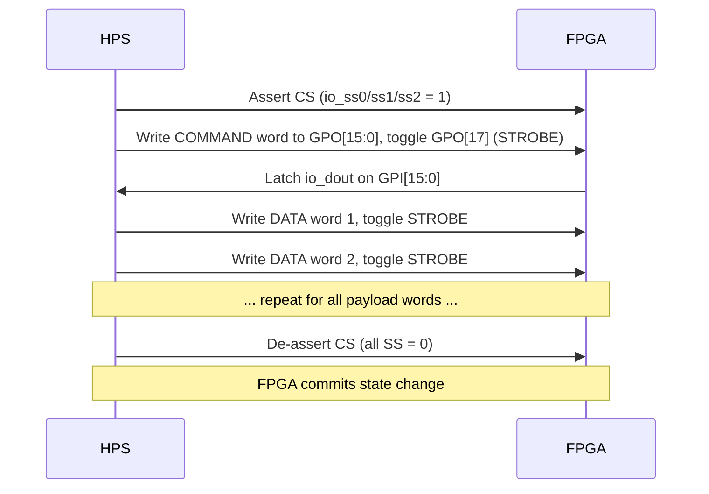

[← Framework](../README.md)

# HPS_BUS — The 49-Bit Parallel Bus

The `HPS_BUS[48:0]` is the single `inout` vector that connects the
`sys_top.v` hardware-abstraction layer to the `hps_io.sv` command decoder
in every MiSTer core.  It is **not** an external board-level bus; it is
purely in-fabric wiring on the Cyclone V FPGA.

Related source: `cores/Template_MiSTer/sys/hps_io.sv`, `sys/sys_top.v`

---

## Bit Assignments

| Bits | Direction (from sys_top view) | Signal | Description |
|---|---|---|---|
| `[15:0]` | FPGA → HPS | `io_dout` / `fp_dout` | Data word returned by FPGA to HPS |
| `[16]` | HPS → FPGA | (unused / io_wide echo) | Width indicator latch |
| `[17]` | HPS → FPGA | `io_clk` (STROBE) | Rising edge = new data word strobe |
| `[18]` | HPS → FPGA | `io_ss0` | Chip-select 0 — FPGA I/O channel |
| `[19]` | HPS → FPGA | `io_ss1` | Chip-select 1 — OSD channel |
| `[20]` | HPS → FPGA | `io_ss2` | Chip-select 2 — UIO system channel |
| `[31:16]` | HPS → FPGA | `io_din` | 16-bit data word from HPS |
| `[32]` | FPGA → HPS | `io_wide` | 1 = 16-bit WIDE mode active |
| `[33]` | HPS → FPGA | `io_strobe` (derived) | Computed from edge on bit 17 |
| `[34]` | HPS → FPGA | `io_enable` | Transaction enable (SS active) |
| `[35]` | HPS → FPGA | `fp_enable` | File-I/O channel enable |
| `[36]` | FPGA → HPS | `clk_sys` | Core system clock (for HPS timing) |
| `[37]` | FPGA → HPS | `ioctl_wait` | Back-pressure: FPGA not ready |
| `[38]` | HPS → FPGA | `vs` | VSync signal (for video calc) |
| `[39]` | HPS → FPGA | `hs` | HSync signal |
| `[40]` | HPS → FPGA | `de` | Data enable |
| `[41]` | HPS → FPGA | `ce_pix` | Pixel clock enable |
| `[42]` | HPS → FPGA | `clk_vid` | Video clock |
| `[43]` | HPS → FPGA | `clk_100` | 100 MHz reference for video calc |
| `[44]` | HPS → FPGA | `vs_hdmi` | HDMI VSync |
| `[45]` | HPS → FPGA | `f1` | Field-1 interlace flag |
| `[48:46]` | HPS → FPGA | (reserved) | Reserved / adaptive scaler flags |

In `sys_top.v`:
```verilog
wire [31:0] gp_in  = {1'b0, btn_user|btn[1], btn_osd|btn[0], io_dig,
                       8'd0, io_ver, io_ack, io_wide, io_dout | io_dout_sys};
wire [31:0] gp_out;

// The GPO/GPI cross-point feeds bits [35:0] of HPS_BUS
wire [15:0] io_din  = gp_outr[15:0];   // data from HPS
wire        io_clk  = gp_outr[17];     // strobe from HPS
wire        io_ss0  = gp_outr[18];
wire        io_ss1  = gp_outr[19];
wire        io_ss2  = gp_outr[20];
```

---

## Transaction Protocol

Every HPS→FPGA command is a sequence of 16-bit **strobe cycles**:



Key constraints:
- FPGA uses `clk_sys` to detect rising edge of `io_clk` as `io_strobe`.
- Two-register re-synchroniser (`gp_outr`) avoids metastability.
- `io_enable` = any SS active; `~io_enable` triggers end-of-transaction logic.
- `ioctl_wait` (bit 37) asserts back-pressure — HPS busy-waits.

---

## Chip Select Decode

| `io_ss1` | `io_ss0` | `io_ss2` | Active channel |
|---|---|---|---|
| 0 | 1 | 0 | `io_fpga` — FPGA data port (core-specific) |
| 0 | 0 | 1 | `io_uio` — UIO system channel (video, config) |
| 1 | 0 | 0 | `io_osd_vga` — OSD on VGA |
| 1 | 1 | 0 | `io_osd_hdmi` — OSD on HDMI |
| 1 | 0 | 0 | `fp_enable` — file I/O channel |

```verilog
// sys_top.v
wire io_fpga     = ~io_ss1 & io_ss0;
wire io_uio      = ~io_ss1 & io_ss2;
wire io_osd_vga  =  io_ss1 & ~io_ss2;
wire io_osd_hdmi =  io_ss1 & ~io_ss0;
```

---

## `EXT_BUS[35:0]` Extension

`hps_io.sv` exposes an `EXT_BUS[35:0]` port for core-specific extensions.
The Minimig core uses this for its `hps_ext.v` module which handles IDE
register access and CDDA streaming on top of the standard UIO protocol.

```verilog
// hps_io.sv
assign EXT_BUS[31:16] = HPS_BUS[31:16];   // pass-through io_din
assign EXT_BUS[35:33] = HPS_BUS[35:33];   // pass-through SS + strobe
assign HPS_BUS[15:0]  = EXT_BUS[32] ? EXT_BUS[15:0] : fp_enable ? fp_dout : io_dout;
```
