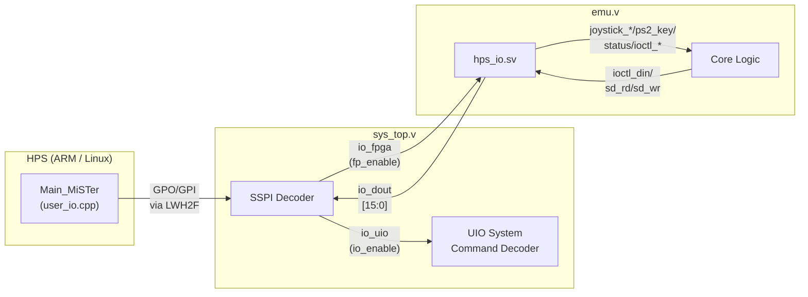
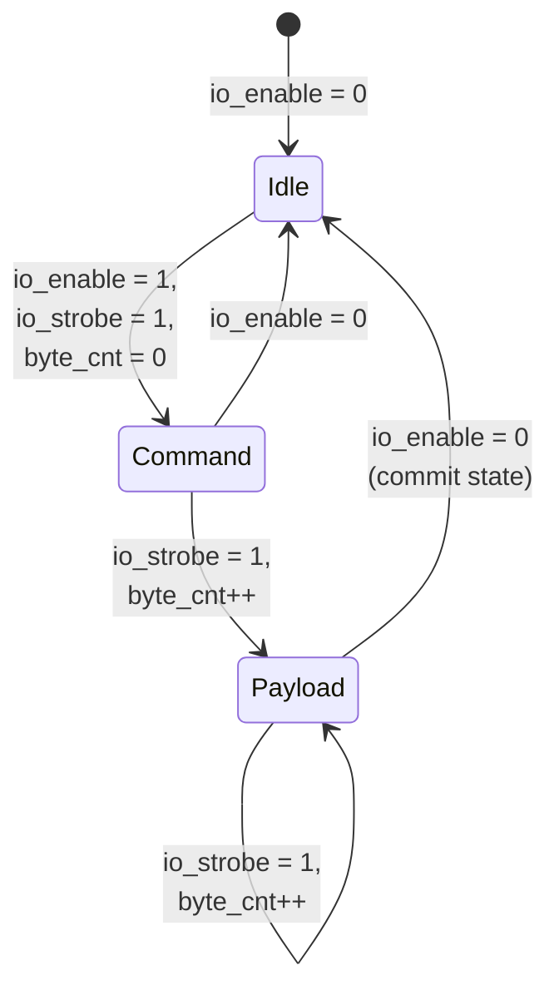
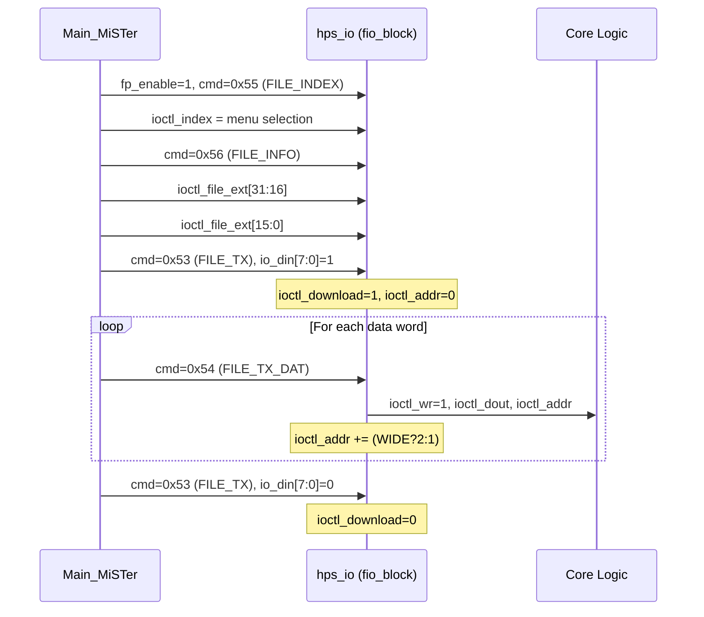
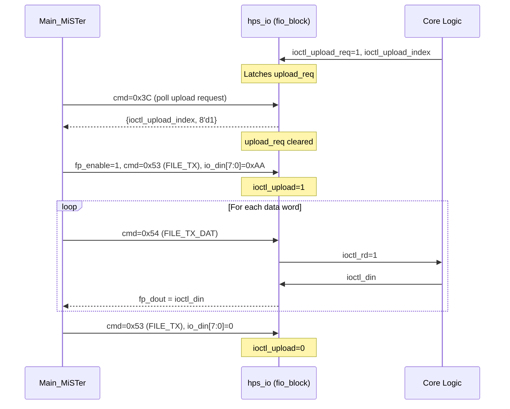

[← FPGA Subsystem](README.md) · [↑ Knowledge Base](../README.md)

# `hps_io.sv` — The Core-Side Command Demultiplexer

`hps_io.sv` is the **core-facing companion** to the SSPI command stream. While [`sys_top.v`](sys_top.md) handles the framework-level commands (video timing, audio filters, scaler configuration), `hps_io.sv` decodes the data that matters to the emulation core: joystick state, keyboard input, ROM downloads, SD card access, status words, and the configuration string.

Every MiSTer core instantiates `hps_io` inside its `emu.v` module. It consumes the 49-bit `HPS_BUS` vector and produces a rich set of domain-specific outputs (controller state, file I/O streams, status registers) that the core logic reads directly.

Sources:
* [`Template_MiSTer/sys/hps_io.sv`](https://github.com/MiSTer-devel/Template_MiSTer/blob/master/sys/hps_io.sv) — 1049 lines, (c)2014 Till Harbaum, (c)2017-2020 Alexey Melnikov
* [`Template_MiSTer/sys/sys_top.v`](https://github.com/MiSTer-devel/Template_MiSTer/blob/master/sys/sys_top.v)
* [`Main_MiSTer/user_io.cpp`](https://github.com/MiSTer-devel/Main_MiSTer/blob/master/user_io.cpp)

---

## Table of Contents

1. [Architectural Role](#1-architectural-role)
2. [Module Parameters](#2-module-parameters)
3. [Port Reference](#3-port-reference)
4. [HPS_BUS Signal Extraction](#4-hps_bus-signal-extraction)
5. [UIO Command Decoder](#5-uio-command-decoder)
6. [File I/O Engine](#6-file-io-engine)
7. [PS/2 Keyboard & Mouse Emulation](#7-ps2-keyboard--mouse-emulation)
8. [Configuration String Mechanism](#8-configuration-string-mechanism)
9. [Video Parameter Reporter](#9-video-parameter-reporter)
10. [SD Card Block & Byte Access](#10-sd-card-block--byte-access)
11. [Status Word Management](#11-status-word-management)
12. [Gamma Table Access](#12-gamma-table-access)
13. [EXT_BUS — Core-Specific Extensions](#13-ext_bus--core-specific-extensions)
14. [Platform Context](#14-platform-context)

---

## 1. Architectural Role



The command stream has two channels multiplexed through SSPI:

| Channel | Chip Select | Decoder | Purpose |
|---|---|---|---|
| **Core data** (`io_fpga` / `fp_enable`) | `io_ss1=0, io_ss0=1` | `hps_io.sv` (fio_block) | File I/O: ROM download, save upload |
| **System UIO** (`io_uio` / `io_enable`) | `io_ss1=0, io_ss2=1` | `hps_io.sv` (uio_block) | Input devices, config, status, SD |

The OSD channel (`io_ss1=1`) is handled directly by the `osd.v` module and does not pass through `hps_io`.

---

## 2. Module Parameters

`hps_io` is parameterized to support a wide range of core configurations:

| Parameter | Default | Description |
|---|---|---|
| `CONF_STR` | *(required)* | Configuration string constant — defines the core's OSD menu structure |
| `CONF_STR_BRAM` | 0 | Set to 1 to store CONF_STR in a BRAM ROM instead of logic (for long strings) |
| `PS2DIV` | 0 | PS/2 clock divider. 0 = disable PS/2 emulation; non-zero = clock divisor for PS/2 bit-bang |
| `WIDE` | 0 | 0 = 8-bit file I/O, 1 = 16-bit file I/O |
| `VDNUM` | 1 | Number of virtual disk drives (1–10) |
| `BLKSZ` | 2 | SD block size exponent: 0=128, 1=256, 2=512 (default), .. 7=16384 |
| `PS2WE` | 0 | Enable bidirectional PS/2 (core can send data to host) |
| `STRLEN` | `$size(CONF_STR)>>3` | Length of configuration string in bytes (auto-computed) |
| `F12KEYMOD` | 0 | F12 modifier mode: 0 = F12 opens menu, 1 = F12 passed to core, F12+GUI opens menu |

### WIDE Mode

When `WIDE=1`, file I/O transfers 16 bits per SSPI word instead of 8. This doubles the effective ROM download bandwidth. The data width and address width adjust accordingly:

```verilog
// hps_io.sv L180-181
localparam DW = (WIDE) ? 15 : 7;   // data bit width (0..DW)
localparam AW = (WIDE) ? 12 : 13;   // address bit width
```

### VDNUM — Virtual Disk Count

Arcade cores and computer cores often need multiple disk images mounted simultaneously (e.g., ao486 uses up to 4 drives). `VDNUM` configures the number of independent SD block access channels.

---

## 3. Port Reference

### 3.1 HPS Bus Interface

| Port | Direction | Width | Description |
|---|---|---|---|
| `clk_sys` | input | 1 | Core system clock |
| `HPS_BUS` | inout | 49 | The 49-bit framework control vector |

### 3.2 Joystick Outputs (6 controllers)

| Port | Direction | Width | Description |
|---|---|---|---|
| `joystick_0` – `joystick_5` | output | 32 each | Digital button bitmask |
| `joystick_l_analog_0` – `joystick_l_analog_5` | output | 16 each | Left analog stick: Y[15:8], X[7:0], signed -127..+127 |
| `joystick_r_analog_0` – `joystick_r_analog_5` | output | 16 each | Right analog stick |
| `joystick_0_rumble` – `joystick_5_rumble` | input | 16 each | Rumble feedback: large motor[15:8], small motor[7:0] |

### 3.3 Paddle & Spinner Outputs

| Port | Direction | Width | Description |
|---|---|---|---|
| `paddle_0` – `paddle_5` | output | 8 each | Paddle value 0..255 |
| `spinner_0` – `spinner_5` | output | 9 each | Spinner: delta -128..+127 [7:0], toggle bit [8] |

### 3.4 PS/2 Keyboard

| Port | Direction | Width | Description |
|---|---|---|---|
| `ps2_kbd_clk_out` | output | 1 | PS/2 clock (when `PS2DIV` enabled) |
| `ps2_kbd_data_out` | output | 1 | PS/2 data out |
| `ps2_kbd_clk_in` | input | 1 | PS/2 clock in (core-to-host) |
| `ps2_kbd_data_in` | input | 1 | PS/2 data in |
| `ps2_kbd_led_status` | input | 3 | LED status (Caps/Num/Scroll) |
| `ps2_kbd_led_use` | input | 3 | LED use flags |
| `ps2_key` | output | 11 | Simplified key: `[10]` toggle, `[9]` pressed, `[8]` extended, `[7:0]` scancode |

### 3.5 PS/2 Mouse

| Port | Direction | Width | Description |
|---|---|---|---|
| `ps2_mouse_clk_out/data_out` | output | 1 each | PS/2 clock/data |
| `ps2_mouse_clk_in/data_in` | input | 1 each | PS/2 clock/data in |
| `ps2_mouse` | output | 25 | Simplified mouse: `[24]` toggle, `[23:16]` Y, `[15:8]` X, `[7:0]` buttons |
| `ps2_mouse_ext` | output | 16 | Extended: `[15:8]` extra buttons, `[7:0]` wheel delta |

### 3.6 Status & Configuration

| Port | Direction | Width | Description |
|---|---|---|---|
| `buttons` | output | 2 | Button state from CFG word `[1:0]` |
| `forced_scandoubler` | output | 1 | CFG bit `[4]` |
| `direct_video` | output | 1 | CFG bit `[10]` |
| `video_rotated` | input | 1 | Core signals display is rotated |
| `new_vmode` | input | 1 | Toggle to notify video mode change |
| `gamma_bus` | inout | 22 | Gamma table interface |
| `status` | output | 128 | Current OSD status word |
| `status_in` | input | 128 | Core-requested status (for readback) |
| `status_set` | input | 1 | Strobe to latch `status_in` |
| `status_menumask` | input | 16 | OSD menu item mask |

### 3.7 SD Card / Virtual Disk

| Port | Direction | Width | Description |
|---|---|---|---|
| `img_mounted` | output | VDNUM | One-hot: new image mounted on drive N |
| `img_readonly` | output | 1 | Mounted as read-only |
| `img_size` | output | 64 | Image size in bytes |
| `sd_lba[VDNUM]` | input | 32 each | Logical block address per drive |
| `sd_blk_cnt[VDNUM]` | input | 6 each | Block count - 1 per drive |
| `sd_rd[VDNUM]` | input | 1 each | Read request per drive |
| `sd_wr[VDNUM]` | input | 1 each | Write request per drive |
| `sd_ack[VDNUM]` | output | 1 each | Acknowledge per drive |
| `sd_buff_addr` | output | AW+1 | Byte-level address in sector buffer |
| `sd_buff_dout` | output | DW+1 | Data from HPS to sector buffer |
| `sd_buff_din[VDNUM]` | input | DW+1 each | Data from sector buffer to HPS |
| `sd_buff_wr` | output | 1 | Write enable for sector buffer |

### 3.8 File I/O (ioctl)

| Port | Direction | Width | Description |
|---|---|---|---|
| `ioctl_download` | output | 1 | Active ROM download |
| `ioctl_upload` | output | 1 | Active save upload |
| `ioctl_index` | output | 16 | File index (from menu selection) |
| `ioctl_wr` | output | 1 | Write strobe (download data valid) |
| `ioctl_addr` | output | 27 | Byte address (incremented by 2 in WIDE mode) |
| `ioctl_dout` | output | DW+1 | Download data |
| `ioctl_rd` | output | 1 | Read strobe (upload data request) |
| `ioctl_din` | input | DW+1 | Upload data from core |
| `ioctl_upload_req` | input | 1 | Core requests upload |
| `ioctl_upload_index` | input | 8 | Upload file index |
| `ioctl_file_ext` | output | 32 | File extension (4 ASCII chars) |
| `ioctl_wait` | input | 1 | Core back-pressure (stall transfer) |

### 3.9 Miscellaneous

| Port | Direction | Width | Description |
|---|---|---|---|
| `sdram_sz` | output | 16 | SDRAM size config: `[15]` = set, `[1:0]` = 32/64/128 MB |
| `RTC` | output | 65 | RTC in MSM6242B format; `[64]` = toggle |
| `TIMESTAMP` | output | 33 | Unix epoch seconds; `[32]` = toggle |
| `uart_mode` | output | 8 | UART mode flags |
| `uart_speed` | output | 32 | UART baud rate |
| `info_req` | input | 1 | Core info request strobe |
| `info` | input | 8 | Core info byte |
| `EXT_BUS` | inout | 36 | Core-specific extension bus |

---

## 4. HPS_BUS Signal Extraction

`hps_io` extracts its control signals from the 49-bit `HPS_BUS` vector:

```verilog
// hps_io.sv L184-194
wire        io_strobe = HPS_BUS[33];
wire        io_enable = HPS_BUS[34];   // UIO system channel (io_uio)
wire        fp_enable = HPS_BUS[35];   // Core data channel (io_fpga)
wire        io_wide   = (WIDE) ? 1'b1 : 1'b0;
wire [15:0] io_din    = HPS_BUS[31:16];

assign HPS_BUS[37]   = ioctl_wait;    // Back-pressure to HPS
assign HPS_BUS[36]   = clk_sys;       // Core clock for HPS timing
assign HPS_BUS[32]   = io_wide;       // WIDE mode flag
assign HPS_BUS[15:0] = EXT_BUS[32] ? EXT_BUS[15:0] : fp_enable ? fp_dout : io_dout;
```

The response data on `HPS_BUS[15:0]` is multiplexed:
1. **`EXT_BUS[32]`** — Core-specific extension override (highest priority)
2. **`fp_enable`** — File I/O response (during ROM download/upload)
3. **`io_dout`** — UIO command response (controller status, config string, etc.)

---

## 5. UIO Command Decoder

The UIO command decoder (`uio_block`, lines 266–553) processes the `io_enable` channel. It follows the same command-then-payload pattern as the system command decoder in `sys_top.v`, but handles core-specific data.

### 5.1 State Machine



When `io_enable` goes low, the decoder **commits** accumulated state changes:
- PS/2 mouse data is finalized (toggle `ps2_mouse[24]`)
- PS/2 keyboard data is finalized (update `ps2_key`)
- RTC/TIMESTAMP toggle bits are updated
- `cmd`, `byte_cnt`, `sd_ack`, `io_dout`, and `img_mounted` are cleared

### 5.2 Command Reference

| Opcode | Name | Payload | Direction | Description |
|---|---|---|---|---|
| `0x01` | CFG | 1 word | HPS→Core | Framework configuration word (buttons, scandoubler, direct video) |
| `0x02` | JOY0 | 2 words | HPS→Core | Joystick 0: `[15:0]` then `[31:16]` |
| `0x03` | JOY1 | 2 words | HPS→Core | Joystick 1 |
| `0x04` | MOUSE | N words | HPS→Core | PS/2 mouse byte stream |
| `0x05` | KEYBOARD | N words | HPS→Core | PS/2 keyboard byte stream |
| `0x10`–`0x13` | JOY2–5 | 2 words | HPS→Core | Joysticks 2–5 |
| `0x14` | CONF_STR | N words | Core→HPS | Read configuration string byte-by-byte |
| `0x16` | SD_STATUS | N words | Core→HPS | SD card LBA readback |
| `0x0X17` | SD_READ | stream | HPS→Core | SD sector data: `X` = drive index |
| `0x0X18` | SD_WRITE | stream | Core→HPS | SD sector write data: `X` = drive index |
| `0x1A` | ANALOG_L | N words | HPS→Core | Left analog + paddle/spinner |
| `0x1C` | IMG_MOUNT | 1 word | HPS→Core | Image mount notification |
| `0x1D` | IMG_INFO | 4 words | HPS→Core | Image size (64-bit) |
| `0x1E` | STATUS_SET | 8 words | HPS→Core | 128-bit status word from OSD |
| `0x1F` | KBD_LED | 1 word | Core→HPS | Keyboard LED status readback |
| `0x21` | PS2_CTL | 2 words | Bidir | PS/2 host data readback |
| `0x22` | RTC | 4 words | HPS→Core | Real-time clock (MSM6242B format) |
| `0x23` | VID_RES | N words | Core→HPS | Video resolution parameters |
| `0x24` | TIMESTAMP | 3 words | HPS→Core | Unix timestamp |
| `0x29` | STATUS_REQ | 8 words | Core→HPS | Core status readback |
| `0x2B` | SCALER_INFO | 1 word | Core→HPS | Scaler capability flags |
| `0x2E` | MENU_MASK | 1 word | Core→HPS | Menu item mask readback |
| `0x2F` | LFB_CAP | 1 word | Core→HPS | Linear framebuffer capability flag |
| `0x31` | SDRAM_SZ | 1 word | HPS→Core | SDRAM size configuration |
| `0x32` | GAMMA_EN | 1 word | HPS→Core | Gamma table enable |
| `0x33` | GAMMA_WR | stream | HPS→Core | Gamma table data |
| `0x36` | INFO | 1 word | Core→HPS | Core info byte readback |
| `0x39` | AFLT_RESET | 1 word | Core→HPS | Audio filter reset acknowledge |
| `0x3B` | UART_CFG | 3 words | HPS→Core | UART mode and baud rate |
| `0x3C` | UPLOAD_REQ | 1 word | Core→HPS | Upload request with index |
| `0x3D` | ANALOG_R | N words | HPS→Core | Right analog sticks |
| `0x3E` | SHADOWMASK | 1 word | Core→HPS | Shadow mask support flag |
| `0x3F` | RUMBLE | 1 word | Core→HPS | Rumble motor readback |
| `0x43` | F12_KEYMOD | 1 word | Core→HPS | F12 modifier mode flag |

### 5.3 SD Read/Write Commands (0x0X17 / 0x0X18)

The SD card sector commands embed the drive index in the upper nibble of the command byte:

```
Command format: 0xDXYY
  D = drive index (0-5)
  X = 7 for read, 8 for write
  YY = fixed command identifier
```

For example:
- `0x0017` = read from drive 0
- `0x0117` = read from drive 1
- `0x0018` = write from drive 0

This encoding allows `Main_MiSTer` to address up to 10 virtual drives through a single command namespace.

### 5.4 Joystick Bit Mapping

Each 32-bit `joystick_N` word maps to the following button layout:

| Bit | Button | Bit | Button |
|---|---|---|---|
| `[0]` | Up | `[16]` | L1 (shoulder) |
| `[1]` | Down | `[17]` | R1 (shoulder) |
| `[2]` | Left | `[18]` | L2 (trigger) |
| `[3]` | Right | `[19]` | R2 (trigger) |
| `[4]` | Button 1 / A | `[20]` | L3 (stick press) |
| `[5]` | Button 2 / B | `[21]` | R3 (stick press) |
| `[6]` | Button 3 / X | `[22:31]` | Reserved / extended |
| `[7]` | Button 4 / Y | | |

The mapping from USB HID to this bitmask is handled by `Main_MiSTer`'s `user_io.cpp`.

---

## 6. File I/O Engine

The File I/O engine (`fio_block`, lines 632–712) handles the `fp_enable` channel, which carries ROM downloads and save file uploads.

### 6.1 FIO Commands

| Constant | Value | Description |
|---|---|---|
| `FIO_FILE_TX` | `0x53` | Begin/end file transfer |
| `FIO_FILE_TX_DAT` | `0x54` | Transfer data word |
| `FIO_FILE_INDEX` | `0x55` | Set file index |
| `FIO_FILE_INFO` | `0x56` | Set file extension |

### 6.2 Download Sequence



### 6.3 Upload Sequence

Uploads work in reverse — the core presents data on `ioctl_din`, and `hps_io` sends it back to the HPS:



### 6.4 File Transfer Initiation Byte

The `FIO_FILE_TX` command's first payload byte determines the transfer direction:

| Value | Meaning |
|---|---|
| `0x00` | End transfer (clean up, increment address) |
| `0xAA` | Begin upload (core → HPS) |
| Other | Begin download (HPS → core) |

### 6.5 Back-Pressure

The core can stall file transfers by asserting `ioctl_wait`:

```verilog
assign HPS_BUS[37] = ioctl_wait;
```

When `ioctl_wait` is high, the SSPI acknowledgment logic in `sys_top.v` freezes (see [sys_top.md §7.3](sys_top.md#73-sspi-strobe-logic)), causing `Main_MiSTer` to block until the core is ready for more data. This is essential for cores that need time to process each data word (e.g., writing to SDRAM with a multi-cycle write pipeline).

---

## 7. PS/2 Keyboard & Mouse Emulation

### 7.1 Simplified Interface (no PS2DIV)

When `PS2DIV=0` (the common case), `hps_io` provides simplified key and mouse events:

**Keyboard (`ps2_key[10:0]`)**:
```verilog
// hps_io.sv L306
ps2_key <= {~ps2_key[10], pressed, extended, ps2_key_raw[7:0]};
```

| Bit | Name | Description |
|---|---|---|
| `[10]` | toggle | Flips on every key event (core detects changes) |
| `[9]` | pressed | 1 = key down, 0 = key up |
| `[8]` | extended | 1 = E0-prefixed scancode |
| `[7:0]` | scancode | PS/2 Set 2 make/break scancode |

The toggle bit allows the core to detect new events without needing to track the previous state.

**Mouse (`ps2_mouse[24:0]`)**:
```verilog
// Decoded from PS/2 byte stream
ps2_mouse <= {toggle_bit, Y[7:0], X[7:0], buttons[7:0]};
```

| Bit | Name | Description |
|---|---|---|
| `[24]` | toggle | Flips on every complete mouse packet |
| `[23:16]` | Y | Signed Y displacement |
| `[15:8]` | X | Signed X displacement |
| `[7:0]` | buttons | Button bitmask |

### 7.2 Full PS/2 Interface (PS2DIV > 0)

When `PS2DIV` is set to a non-zero value, `hps_io` instantiates full `ps2_device` modules for keyboard and mouse. These implement the complete PS/2 serial protocol:

```verilog
// hps_io.sv L575-591
ps2_device keyboard
(
    .clk_sys(clk_sys),
    .wdata(kbd_data),       // Data from HPS
    .we(kbd_we),
    .ps2_clk(clk_ps2),      // Divided clock
    .ps2_clk_out(ps2_kbd_clk_out),
    .ps2_dat_out(ps2_kbd_data_out),
    .ps2_clk_in(ps2_kbd_clk_in),
    .ps2_dat_in(ps2_kbd_data_in),
    .rdata(kbd_data_host),  // Data from core to HPS
    .rd(kbd_rd)
);
```

The `ps2_device` module (lines 719–858) implements:
- **TX**: FIFO-buffered transmit with parity generation, start/stop bits
- **RX**: Full receive state machine with parity check and ACK
- **Bidirectional**: When `PS2WE=1`, the core can also send data to the host (for keyboard LEDs, mouse commands)

The `PS2DIV` value determines the PS/2 clock frequency:
```
PS/2 clock = clk_sys / (2 × PS2DIV)
```
Typical PS/2 clock is 10–16.7 kHz, so with `clk_sys` = 50 MHz, `PS2DIV` ≈ 1500–2500.

### 7.3 Print Screen and Pause Special Cases

The PS/2 protocol has two multi-byte sequences that `hps_io` handles specially:

```verilog
// hps_io.sv L307-309
if(ps2_key_raw == 'hE012E07C) ps2_key[9:0] <= 'h37C; // PrintScreen pressed
if(ps2_key_raw == 'h7CE0F012) ps2_key[9:0] <= 'h17C; // PrintScreen released
if(ps2_key_raw == 'hF014F077) ps2_key[9:0] <= 'h377; // Pause pressed
```

These map the raw multi-byte sequences to single-event notifications in the simplified interface.

---

## 8. Configuration String Mechanism

The configuration string (`CONF_STR`) is a compile-time constant that defines the core's OSD menu structure. `Main_MiSTer` reads it during initialization to build the menu.

### 8.1 String Readout Protocol

When `Main_MiSTer` sends command `0x14` (CONF_STR), `hps_io` returns one byte per SSPI word:

```verilog
// hps_io.sv L399
'h14: if(byte_cnt <= STRLEN) io_dout[7:0] <= conf_byte;
```

The byte count (`byte_cnt`) serves as the index. `Main_MiSTer` reads STRLEN bytes sequentially to reconstruct the full configuration string.

### 8.2 Storage: Logic vs BRAM

```verilog
// hps_io.sv L243-250
generate
    if(CONF_STR_BRAM) begin
        confstr_rom #(CONF_STR, STRLEN) confstr_rom(.*, .conf_addr(byte_cnt - 1'd1));
    end
    else begin
        assign conf_byte = CONF_STR[{(STRLEN - byte_cnt),3'b000} +:8];
    end
endgenerate
```

For short strings, the configuration string is stored as a Verilog parameter and extracted using bit-select. For long strings (typically > 256 bytes), `CONF_STR_BRAM=1` routes the string through a BRAM-initialized ROM module (`confstr_rom`), which saves logic elements at the cost of one M9K block.

### 8.3 CONF_STR Format

The configuration string uses a simple text-based format documented in the MiSTer wiki. Key tokens include:

| Token | Example | Description |
|---|---|---|
| `O[n]` | `O[1]:Video Mode=NTSC,PAL` | Options (1-bit to 6-bit), mapped to `status` bits |
| `D[n]` | `D[4]:Aspect Ratio` | Directional option |
| `T[n]` | `T[0]:Reset` | Toggle button |
| `F[n]` | `F[0]:ROM_LOAD` | File select (triggers `ioctl_download`) |
| `J[n]` | `J1,Button 1,Button 2,...` | Joystick button mapping |
| `V` | `V=Version 1.0` | Version string |
| `S[n]` | `S[0],MRA Type` | String option |

---

## 9. Video Parameter Reporter

The `video_calc` module (lines 862–1028) continuously measures the core's video output and reports parameters back to `Main_MiSTer` via the `VID_RES` command (0x23).

### 9.1 Measured Parameters

| Index | Name | Description |
|---|---|---|
| 1 | Flags | `{video_rotated, interlaced, new_resolution_flag}` |
| 2–3 | H count | Horizontal pixel count per frame (32-bit) |
| 4–5 | V count | Vertical line count per frame (32-bit) |
| 6–7 | H time | Horizontal line period in 100 MHz clocks |
| 8–9 | V time | Vertical frame period in 100 MHz clocks |
| 10–11 | Pixel count | Pixels per active line (32-bit) |
| 12–13 | HDMI V time | HDMI output frame period (for sync verification) |
| 14–15 | Clock count | Total clock cycles per frame |
| 16 | Pixel repeat | Pixels per `ce_pix` pulse |
| 17 | DE width | Active pixels per line (from DE signal) |
| 18 | DE height | Active lines per frame (from DE signal) |

### 9.2 Resolution Change Detection

```verilog
// hps_io.sv L957-958
if(vid_hcnt != hcnt || vid_vcnt != vcnt || old_vmode != new_vmode) resto <= 1;
if(&resto) vid_nres <= vid_nres + 1'd1;
```

`video_calc` detects resolution changes by comparing the current frame's H/V counts against the stored values. When a change is detected, it increments `vid_nres` (new resolution flag) after a timeout to debounce. `Main_MiSTer` polls this flag to auto-adjust the HDMI output timing.

---

## 10. SD Card Block & Byte Access

### 10.1 Block-Level Interface

The core requests SD card sectors through the `sd_rd`/`sd_wr` signals:

```verilog
// hps_io.sv L206-215
always_comb begin
    int n, i;
    sdn = 0;
    for(i = VDNUM - 1; i >= 0; i = i - 1) begin
        n = i + sd_rrb;
        if(n >= VDNUM) n = n - VDNUM;
        if(sd_wr[n] | sd_rd[n]) sdn = n[3:0];
    end
end
```

The round-robin priority encoder (`sd_rrb` rotates after each access) ensures fair servicing of multiple virtual drives. The `sdn` signal selects which drive gets access.

When `Main_MiSTer` polls SD status (command `0x16`), `hps_io` returns:
- Drive index with pending read/write
- Block size and count
- LBA address (32-bit, in two 16-bit words)

### 10.2 Byte-Level Interface

Data transfer between HPS and core uses a dual-port RAM sector buffer:

- **Read (HPS → Core)**: `Main_MiSTer` writes sector data via `0x0X17` commands. `sd_buff_dout` and `sd_buff_wr` write bytes into the buffer at `sd_buff_addr`.
- **Write (Core → HPS)**: `Main_MiSTer` reads sector data via `0x0X18` commands. `sd_buff_din[sdn_ack]` reads bytes from the core's buffer.

The sector buffer is implemented as a 2-port `altsyncram` in the core, sized to hold one SD block (`1 << (BLKSZ + 7)` bytes).

---

## 11. Status Word Management

### 11.1 OSD Status (128-bit)

The 128-bit `status` word is the primary communication channel from the OSD menu to the core. When the user changes a menu option, `Main_MiSTer` sends the new status via command `0x1E`:

```verilog
// hps_io.sv L477-488
'h1e: if(!byte_cnt[MAX_W:4]) begin
    case(byte_cnt[3:0])
        1: status[15:00]   <= io_din;
        2: status[31:16]   <= io_din;
        ...
        8: status[127:112] <= io_din;
    endcase
end
```

Each `O[n]` option in the CONF_STR maps to a specific range of bits in the status word, as defined by the CONF_STR syntax.

### 11.2 Core Status Readback

The core can push a status update to `Main_MiSTer` by asserting `status_set` with the new value on `status_in`:

```verilog
// hps_io.sv L283-287
old_status_set <= status_set;
if(~old_status_set & status_set) begin
    stflg <= stflg + 1'd1;
    status_req <= status_in;
end
```

`Main_MiSTer` polls this via command `0x29`, which returns the `stflg` counter as a change indicator, followed by the 128-bit `status_req` data.

---

## 12. Gamma Table Access

The gamma correction table is accessed through commands `0x32` (enable) and `0x33` (write):

```verilog
// hps_io.sv L536-541
'h32: gamma_en <= io_din[0];           // Enable/disable gamma
'h33: begin
    gamma_wr_addr <= {(byte_cnt[1:0]-1'b1),io_din[15:8]};
    {gamma_wr, gamma_value} <= {1'b1, io_din[7:0]};
    if(byte_cnt[1:0] == 3) byte_cnt <= 1;  // Loop for continuous writes
end
```

The gamma table has 256 entries of 8 bits each. The address is composed of a 2-bit block select and the upper 8 bits of `io_din`, allowing 4 blocks of 256 entries (1024 total). The write loop resets `byte_cnt` to 1 after every 3 words, enabling streaming writes.

The `gamma_bus` output connects to the `gamma_corr.sv` module in the video pipeline:

```verilog
assign gamma_bus[20:0] = {clk_sys, gamma_en, gamma_wr, gamma_wr_addr, gamma_value};
```

---

## 13. EXT_BUS — Core-Specific Extensions

```verilog
// hps_io.sv L177-178
assign EXT_BUS[31:16] = HPS_BUS[31:16];  // Pass-through of io_din
assign EXT_BUS[35:33] = HPS_BUS[35:33];  // Pass-through of fp_enable, io_enable, io_strobe
```

The 36-bit `EXT_BUS` provides core-specific access to the SSPI stream:
- `[31:16]` = `io_din` (incoming data from HPS)
- `[35:33]` = `fp_enable`, `io_enable`, `io_strobe`
- `[32]` = Response override flag — when asserted by the core, `EXT_BUS[15:0]` replaces the normal `io_dout` on `HPS_BUS[15:0]`
- `[15:0]` = Core-specific response data

This mechanism allows cores to define custom SSPI commands without modifying `hps_io.sv`. The core implements its own command decoder on `EXT_BUS`, and when it needs to respond to the HPS, it asserts `EXT_BUS[32]` and places the response on `EXT_BUS[15:0]`.

---

## 14. Platform Context

| Aspect | MiSTer (`hps_io.sv`) | Analogue Pocket (openFPGA) | Software Emulation |
|---|---|---|---|
| **Input delivery** | SSPI multiplexed stream | Direct memory-mapped registers | OS event callbacks |
| **Controller limit** | 6 controllers × 32 buttons | 1 controller | Unlimited |
| **File I/O** | SSPI streaming (8/16-bit) | Bitstream loading only | Direct filesystem access |
| **Config mechanism** | Compile-time `CONF_STR` constant | JSON manifest | Config file |
| **Status word** | 128-bit, OSD-driven | 32-bit, data API | Variable |
| **PS/2 emulation** | Full serial protocol (optional) | N/A | Software driver |
| **Extension** | `EXT_BUS` for custom commands | Core-defined API | Plugin system |

The `hps_io.sv` approach of using a single multiplexed SSPI channel for all data is extremely bandwidth-efficient (16 bits per strobe at >150 MB/s) but requires careful command sequencing. The `EXT_BUS` extension mechanism provides an escape valve for cores that need custom protocols without forking the framework.

> [!WARNING]
> The `hps_io.sv` UIO command set has evolved over many years and some commands have overlapping or unclear semantics. For example, command `0x39` serves double duty as both an "audio filter reset acknowledge" in `hps_io` and as the "audio IIR filter coefficients" command in `sys_top.v`'s system decoder. The two decoders operate on different chip-select channels (`io_enable` vs `io_uio`), so there is no conflict, but the shared opcode number can cause confusion when reading the source.

---

**Previous**: [sys_top.v Deep Dive](sys_top.md) — The root synthesis entity and framework composition.
**Next**: [Template Walkthrough](../07_fpga_cores_architecture/template_walkthrough.md) — Building a core from `Template_MiSTer`.
