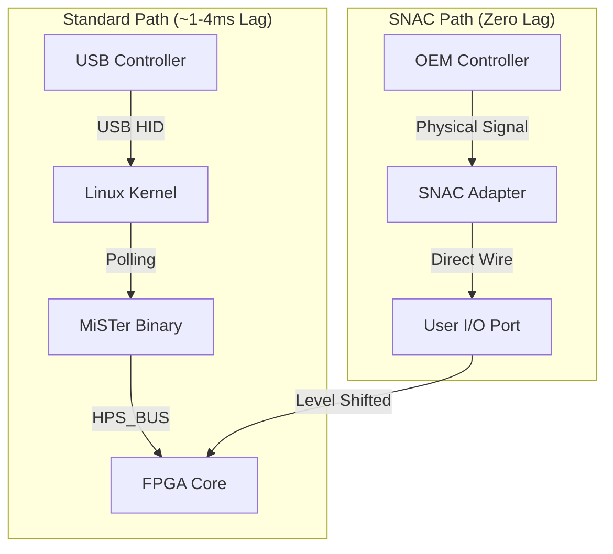

[← FPGA Subsystem](README.md) · [↑ Knowledge Base](../README.md)

# Input Latency & SNAC (Serial Native Accessory Converter)

One of the defining features of the MiSTer platform is its pursuit of zero-latency input. This document explains the different input paths and the technical implementation of the SNAC system.

---

## 1. The Input Dilemma: USB vs. Native

In standard emulation (PC, Raspberry Pi), controllers are interfaced via USB or Bluetooth. This introduces several layers of latency:
1.  **Polling Rate**: The OS polls the USB device (usually every 1ms to 8ms).
2.  **Driver Overhead**: The Linux kernel processes the USB packet.
3.  **Application Lag**: The emulator software reads the joystick event.
4.  **HPS-to-FPGA Handoff**: The MiSTer software sends the state to the FPGA via the HPS_BUS.

Total USB latency on MiSTer is typically **~1ms to 4ms**, which is excellent for software standards but not "zero."

---

## 2. SNAC: The Zero-Latency Path

**Serial Native Accessory Converter (SNAC)** is a methodology that bypasses the HPS (Linux) entirely. It maps the physical pins of a retro controller directly to the logic of the emulation core inside the FPGA.

### 2.1 Technical Architecture
The MiSTer I/O Board features a "USER" port (physically a USB 3.0 connector, but electrically repurposed). These pins are wired directly to the Cyclone V FPGA's GPIO pins.

### 2.2 Core Integration
In the core's `emu.v`, the developer maps the `USER_IO` pins to the native controller logic (e.g., the Shift Register logic for an NES controller or the multiplexed signals of a Genesis pad).
*   **Latency**: Measured in **nanoseconds**. The delay is purely the propagation time through the wires and level shifters.
*   **Protocol Support**: Because it is a direct pin mapping, SNAC supports complex peripherals that USB cannot easily handle, such as Light Guns (Zapper), specialized mice, and multi-tap adapters.

---

## 3. Input Polling & The HPS_BUS

For standard USB controllers, the framework uses the `HPS_BUS` to deliver input state.

*   **`JOY1`, `JOY2`, `JOY3`, `JOY4`**: These are 32-bit registers updated by the HPS at high frequency.
*   **Framework Handoff**: The `hps_io.sv` module decodes the SPI stream from the HPS and presents these 32-bit values to the core.
*   **Polling Frequency**: The MiSTer binary on Linux polls USB devices at up to 1000Hz (1ms) to minimize the "HPS Path" latency.

---

## 4. Hardware Hazards: Level Shifting

> [!CAUTION]
> The Cyclone V FPGA pins operate at **3.3V**. Many retro controllers (NES, SNES, Genesis) operate at **5V**. Connecting a 5V controller directly to the User I/O port without a proper SNAC adapter (which includes level shifters) can **permanently damage the FPGA**.

---

## 5. Verified SNAC Adapters & Implementations

To ensure signal integrity and protect the FPGA, SNAC adapters must implement bidirectional level shifting. Most community-verified adapters use the **74LVC245** or **74LVX245** octal bus transceivers.

### 5.1 Common Adapter Types
| System | Connector | Voltage | Notes |
| :--- | :--- | :--- | :--- |
| **NES / SNES** | OEM 7-Pin | 5V | Full support for 4-player multi-taps and Zapper (CRT only). |
| **Genesis / MD** | DB9 | 5V | Supports 3/6-button pads and TeamPlayer multi-taps. |
| **PC Engine / TG16** | Mini-DIN8 | 5V | Direct mapping of the 4-bit bus; supports multi-taps. |
| **Saturn** | OEM 10-Pin | 5V | Supports analog 3D pads and light guns. |
| **PlayStation** | OEM 9-Pin | 3.3V/5V | Complex SPI-like protocol; supports DualShock vibration. |
| **Atari / Commodore** | DB9 | 5V | Simple digital mapping for joysticks/paddles. |

### 5.2 The 74LVC245 Implementation
The 74LVC245 is the standard "Gold Standard" for SNAC because it is 5V-tolerant on its inputs while powered at 3.3V, providing safe translation without propagation delay.

*   **VCC**: Connected to MiSTer's 3.3V rail.
*   **DIR (Direction)**: Controlled by the FPGA core to switch between reading (controller state) and writing (vibration/polling).
*   **OE (Output Enable)**: Pulled low to enable the transceiver.

> [!TIP]
> Some adapters (like the SNX for PlayStation) require an additional 7.5V or 9V rail for force feedback (vibration). This is usually provided by an external DC barrel jack on the SNAC adapter itself, isolated from the FPGA logic.

---

## Read Also
* [Framework Overview](fpga_framework_overview.md) — For the HPS_BUS architecture.
* [FPGA Debugging Tools](fpga_debugging_tools.md) — How to probe input signals for latency analysis.
