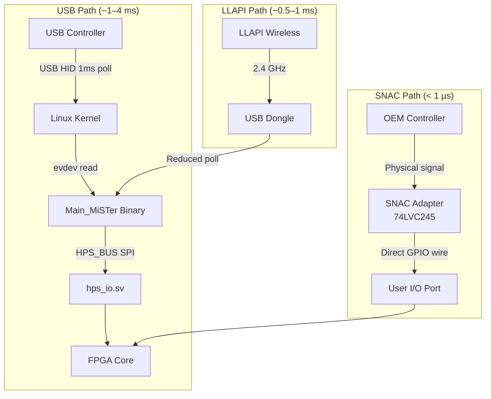

[← FPGA Subsystem](README.md) · [↑ Knowledge Base](../README.md)

# Input Latency & SNAC

One of the defining features of the MiSTer platform is its pursuit of zero-latency input. This document explains the different input paths, their latency characteristics, and how SNAC achieves sub-microsecond response times by bypassing the HPS entirely.

> **See also**: [SNAC & LLAPI Deep Dive](../10_input_devices/snac_llapi.md) for per-core OEM protocol details (NES/SNES/Genesis/PSX/N64 shift register timing, LLAPI wireless, and 74LVC245 circuit design).

---

## 1. The Three Input Paths

MiSTer offers three input paths with progressively lower latency:



---

## 2. USB Path Latency Budget

The standard USB → Linux → HPS_BUS → FPGA path has multiple latency sources:

| Stage | Latency | Accumulated | Source |
|-------|---------|-------------|--------|
| USB polling interval | 0–1 ms | 0–1 ms | USB HID spec (1 kHz typical) |
| Linux input processing | 0.1–0.5 ms | 0.1–1.5 ms | Kernel interrupt handler + evdev |
| Main_MiSTer polling | 0–1 ms | 0.1–2.5 ms | Application read loop |
| HPS_BUS SPI transfer | 16–32 µs | 0.1–2.5 ms | `hps_io.sv` command decoder |
| `JOY` register update | ~1 µs | ~0.1–2.5 ms | FPGA internal routing |

**Typical total**: ~1–4 ms from button press to core seeing the state.

This is competitive with software emulators but not "zero" — a CRT displaying 240p content shows a new frame every 16.67 ms, so 4 ms of input lag represents roughly a quarter-frame delay.

---

## 3. SNAC: The Zero-Latency Path

**Serial Native Accessory Converter (SNAC)** bypasses the HPS (Linux) entirely. It maps the physical pins of a retro controller directly to the FPGA core logic.

### 3.1 Architecture

The I/O Board's USER port (physically a USB 3.0 connector, electrically repurposed) wires directly to Cyclone V GPIO pins. A SNAC adapter provides:

1. **Physical connector**: OEM controller port (NES/SNES, DB9 for Genesis, etc.)
2. **Level shifting**: 74LVC245 or equivalent — 5V-tolerant inputs, 3.3V outputs
3. **Direct wiring**: Controller signal lines mapped 1:1 to FPGA GPIO

### 3.2 Latency Budget

| Stage | Latency | Notes |
|-------|---------|-------|
| Controller button press | 0 | Mechanical contact |
| Controller shift register | 20–40 µs | NES/SNES: 12 µs clock period × 8 bits |
| SNAC adapter propagation | ~5 ns | 74LVC245 typical prop delay |
| GPIO pin to core logic | ~2 ns | FPGA internal routing |
| **Total** | **< 50 µs** | **Over 20× faster than USB path** |

For light gun applications (Zapper, Justifier), the SNAC path is *mandatory* — the 1–4 ms USB latency would make hit detection impossible, since the CRT beam sweeps one pixel in ~100 ns.

### 3.3 Core Integration

In the core's `emu.v`, the developer maps `USER_IO` pins to the native controller logic:

```verilog
// NES controller via SNAC
assign nes_clk  = USER_IO[0];   // Shift register clock
assign nes_lat  = USER_IO[1];   // Latch
wire nes_data  = USER_IO[2];    // Serial data in

// Genesis controller via SNAC  
assign genesis_sel = USER_IO[3]; // Multiplex select
wire genesis_d0   = USER_IO[4]; // Data bit 0
wire genesis_d1   = USER_IO[5]; // Data bit 1
```

> [!CAUTION]
> The Cyclone V FPGA pins operate at **3.3V**. Many retro controllers operate at **5V**. Connecting a 5V controller directly to the User I/O port without a proper SNAC adapter (with level shifters) can **permanently damage the FPGA**.

---

## 4. LLAPI: Low-Latency Wireless

LLAPI (Low-Latency API) is a wireless protocol that provides latency between USB and SNAC:

| Feature | USB | LLAPI | SNAC |
|---------|-----|-------|------|
| Latency | 1–4 ms | 0.5–1 ms | < 0.05 ms |
| Wireless | No | Yes (2.4 GHz) | No |
| OEM controllers | No | No | Yes |
| Vibration support | Yes | Limited | Per-protocol |
| Multi-tap support | Limited | No | Yes |

LLAPI uses a custom 2.4 GHz dongle that communicates with modified controllers or retro receivers, bypassing the standard USB HID polling loop.

---

## 5. Per-Core SNAC Protocol Summary

Each retro system used a different controller protocol. SNAC adapters must implement the exact electrical protocol to be compatible:

| System | Connector | Voltage | Protocol | Key Timing |
|--------|-----------|---------|----------|------------|
| NES | 7-pin | 5V | 8-bit shift register | 12 µs/bit clock |
| SNES | 7-pin | 5V | 16-bit shift register | 12 µs/bit clock |
| Genesis | DB9 | 5V | 6-line multiplexed | Select line toggling |
| PSX | 9-pin | 3.3/5V | SPI-like (acknowledge) | 250 kHz serial clock |
| N64 | 3-pin | 3.3V | 1-bit bidirectional | 1 µs bit period |
| Saturn | 10-pin | 5V | Shift register + select | Multi-phase select |
| PC Engine | Mini-DIN8 | 5V | 4-bit parallel | Direct read |

> **Full protocol details**: See [SNAC & LLAPI Deep Dive](../10_input_devices/snac_llapi.md) for shift register timing diagrams, per-core state machines, and 74LVC245 circuit schematics.

---

## 6. Input Lag Measurement

### 6.1 Physical Measurement Method

To measure actual input-to-display latency:

1. Connect a controller to a GPIO pin via SNAC
2. Route the same GPIO pin and `VGA_DE` to oscilloscope channels
3. Press a button and measure the time between the GPIO edge and the corresponding pixel change on the display

### 6.2 Expected Results

| Input Method | Button-to-Pixel Latency |
|---|---|
| SNAC + CRT (analog) | < 0.1 ms (sub-scanline) |
| SNAC + HDMI (scaled) | 1–2 frames (16–33 ms) — scaler buffering |
| USB + CRT | 1–5 ms (USB polling) + scanline position |
| USB + HDMI | 1–2 frames + USB polling |

The HDMI scaler adds 1+ frames of latency due to the framebuffer pipeline. This is why competitive retro gamers use the analog VGA output with SNAC for the absolute lowest latency.

---

## 7. Cross-References

- [SNAC & LLAPI Deep Dive](../10_input_devices/snac_llapi.md) — Per-core OEM protocols, 74LVC245 circuit design, LLAPI wireless integration
- [Joystick Handling](../10_input_devices/joystick.md) — USB joystick → 32-bit button word path
- [Keyboard](../10_input_devices/keyboard.md) — USB keyboard → PS/2 emulation path
- [Mouse](../10_input_devices/mouse.md) — USB mouse → PS/2 emulation path
- [HPS IO Module](hps_io_module.md) — How `JOY` registers are decoded from the SPI stream
- [Framework Overview](fpga_framework_overview.md) — HPS_BUS signal mapping
- [FPGA Debugging Tools](fpga_debugging_tools.md) — Probing input signals for latency analysis
- [Video Mixer](../09_video_audio/video_mixer_deep_dive.md) — How HDMI scaler latency affects input-to-display timing
