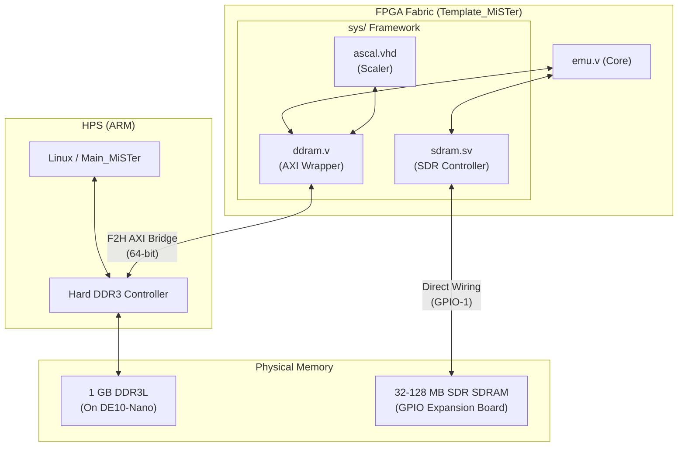

[← FPGA Subsystem](README.md) · [↑ Knowledge Base](../README.md)

# Memory Controllers (SDRAM & DDR3)

MiSTer utilizes a fundamentally bifurcated memory architecture. Memory in retro emulation is not a single, homogeneous pool; it is strictly segregated based on the **latency** and **determinism** requirements of the task.

This document details the two primary memory systems available to the FPGA Fabric: the deterministic external **SDRAM** and the high-bandwidth, non-deterministic HPS **DDR3**.

Sources:
* [`Template_MiSTer/sys/sdram.sv`](https://github.com/MiSTer-devel/Template_MiSTer/blob/master/sys/sdram.sv)
* [`Template_MiSTer/sys/ddram.v`](https://github.com/MiSTer-devel/Template_MiSTer/blob/master/sys/ddram.v)

---

## 1. Architectural Summary

| Memory Type | Interface | Controller | Latency | Primary Use Case |
|---|---|---|---|---|
| **External SDRAM** | GPIO-1 Header | FPGA (`sdram.sv`) | **Deterministic** (~1 cycle) | Cycle-accurate CPU RAM, Audio/Video RAM for 8/16-bit systems. |
| **On-Board DDR3** | F2H AXI Bridge | HPS Hard Controller | **Variable** (~100-200+ ns) | Framebuffers (`ascal`), CD-ROM ISO caching (PSX), massive ROM backing. |

---

## 2. External SDRAM (`sdram.sv`)

For highly accurate hardware recreation, the latency of a memory request must be completely predictable. A 7 MHz Motorola 68000 expects memory to respond within a specific clock window. If the memory is busy running a refresh cycle or serving a Linux network packet, the CPU emulation will stall, breaking audio/video sync and causing severe glitches.

To solve this, MiSTer requires an external SDRAM expansion board plugged into the GPIO-1 header.

### 2.1 The `sdram.sv` Controller
Because the memory chips are wired directly to FPGA pins, the FPGA must run its own memory controller. `sdram.sv` is a custom-written SDR SDRAM controller integrated into almost every core.

**Features:**
*   **Absolute Determinism:** The core developer configures `sdram.sv` to interleave refresh cycles during dead time (like horizontal blanking) or explicitly schedules them to ensure CPU reads never stall unexpectedly.
*   **Multi-Port Arbitration:** A classic retro console has multiple chips fighting for memory (e.g., CPU, Blitter, Copper, Audio DMA). `sdram.sv` provides multiple discrete ports and arbitrates access among them on a cycle-by-cycle basis.
*   **Zero Contention:** Because the HPS (Linux) cannot physically access this RAM, there is zero contention from the host OS.

### 2.2 SDRAM Configuration
When `Main_MiSTer` downloads a ROM via the `hps_io` bridge, the Core receives the byte stream and typically writes it directly into the SDRAM using a dedicated "download" port on `sdram.sv`. Once the download completes, the SDRAM is locked for the core's exclusive use.

---

## 3. The DDR3 Memory & F2H Bridge (`ddram.v`)

The DE10-Nano has 1 GB of DDR3L memory. This memory is physically connected to the HPS (Hard Processor System) and is managed by a hard silicon memory controller. It is the main RAM for the Linux OS.

The FPGA can access this memory via the **FPGA-to-HPS (F2H) AXI Bridge**.

### 3.1 The Determinism Problem
When an FPGA core requests data over the F2H bridge, the request must traverse the AXI interconnect, queue at the HPS memory controller, and wait for the DDR3 to respond. 
*   If the Linux OS is heavily utilizing memory (e.g., handling network traffic via Samba), the FPGA's request will be delayed.
*   If the DDR3 is undergoing a refresh cycle, the request will be delayed.

> [!CAUTION]
> DDR3 via the F2H bridge has **non-deterministic latency**. It cannot be used for tight, cycle-accurate timing loops (e.g., as primary CPU RAM for an Amiga or SNES core) without severe audio/video desync.

### 3.2 The `ddram.v` Wrapper
To simplify AXI interactions for core developers, the framework provides `ddram.v`. This module exposes a simpler, burst-oriented interface to the complex AXI bridge.

### 3.3 Valid DDR3 Use Cases
Despite its variable latency, DDR3 is incredibly useful for tasks that require massive bandwidth or capacity, provided the core can tolerate or buffer the latency:

1.  **The HDMI Scaler (`ascal.vhd`):** Upscaling requires storing an entire video frame (or multiple frames for certain filters). The internal FPGA BRAM is too small. `ascal` uses the F2H bridge to write and read its framebuffer in DDR3. The latency is hidden by deep FIFOs inside the scaler.
2.  **CD-ROM / HDD Caching:** A PlayStation CD ISO (700 MB) cannot fit in the external SDRAM (max 128 MB). The PSX core uses `ddram.v` to cache the ISO in DDR3. Because CD-ROM drives are inherently slow, high-latency devices, the PSX core can easily absorb the variable latency of the F2H bridge.
3.  **N64 RDRAM Emulation:** The N64 core is uniquely complex and leverages both SDRAM and DDR3 simultaneously to achieve its required memory bandwidth.

## Read Also
*   [HPS Bridge Reference](hps_bridge_reference.md) — For details on how ROM data crosses from Linux to the FPGA.
*   [Video & Audio Pipelines](video_audio_pipelines.md) — For details on how `ascal` utilizes DDR3 as a framebuffer.
