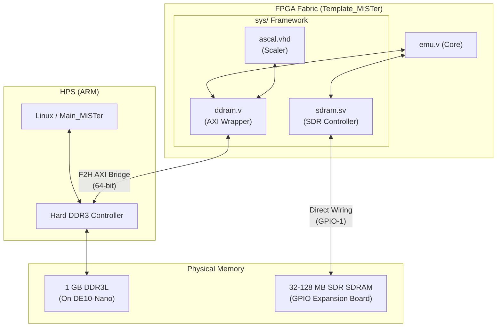
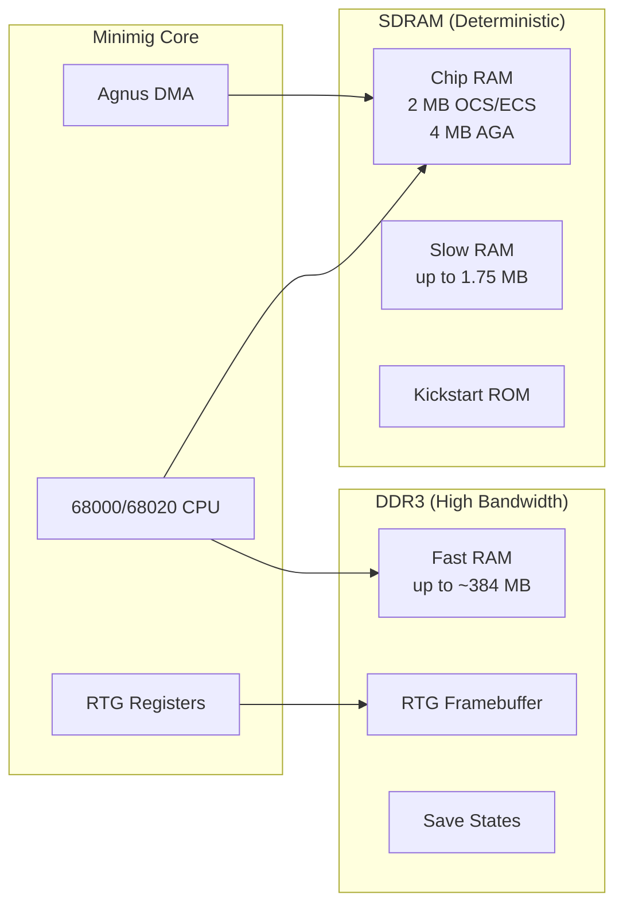

[← FPGA Subsystem](README.md) · [↑ Knowledge Base](../README.md)

# Memory Controllers (SDRAM & DDR3)

MiSTer utilizes a fundamentally bifurcated memory architecture. Memory in retro emulation is not a single, homogeneous pool; it is strictly segregated based on the **latency** and **determinism** requirements of the task.

This document details the two primary memory systems available to the FPGA Fabric: the deterministic external **SDRAM** and the high-bandwidth, non-deterministic HPS **DDR3**.

Sources:
* [`Menu_MiSTer/rtl/sdram.sv`](https://github.com/MiSTer-devel/Menu_MiSTer/blob/master/rtl/sdram.sv)
* [`Template_MiSTer/sys/ddram.v`](https://github.com/MiSTer-devel/Template_MiSTer/blob/master/sys/ddram.v)

---

## 1. Architectural Summary



| Memory Type | Interface | Controller | Latency | Determinism | Primary Use Case |
|---|---|---|---|---|---|
| **External SDRAM** | GPIO-1 Header | FPGA (`sdram.sv`) | ~1–3 cycles | **Guaranteed** | CPU RAM, video/audio DMA, ROM storage |
| **On-Board DDR3** | F2H AXI Bridge | HPS Hard Controller | ~100–200+ ns | **Variable** | Framebuffers, ISO cache, save states, Fast RAM |

---

## 2. External SDRAM (`sdram.sv`)

> **Deep dive**: [SDRAM Controller](sdram_controller.md) — complete analysis of all three controller variants (generic `sdram.sv`, Minimig `sdram_ctrl.v`, MemTest `sdram.v`), including state machines, initialization sequences, command encoding, refresh strategies, CAS latency pipeline, 8/16-bit mode, and dual-chip support. Also see [SDRAM Timing Theory](sdram_timing_theory.md) for phase alignment mathematics and frequency-specific timing budgets.

For highly accurate hardware recreation, the latency of a memory request must be completely predictable. A 7 MHz Motorola 68000 expects memory to respond within a specific clock window. If the memory is busy running a refresh cycle or serving a Linux network packet, the CPU emulation will stall, breaking audio/video sync and causing severe glitches.

To solve this, MiSTer requires an external SDRAM expansion board plugged into the GPIO-1 header.

### 2.1 Why Determinism Matters

Consider the Amiga's Agnus chip: during every horizontal scanline, it performs a fixed number of DMA cycles for bitplanes, sprites, copper, and audio. If any one of these DMA accesses is delayed by even one cycle, the display shows visible corruption.

The `sdram.sv` controller guarantees determinism by:

1. **Exclusive bus ownership**: The HPS (Linux) cannot physically access this RAM. There is no arbitration with the ARM core.
2. **Refresh hiding**: The controller inserts auto-refresh cycles during natural idle periods (horizontal blanking, CPU cache hits) so they never collide with DMA windows.
3. **Fixed-slot scheduling** (Minimig variant): The `sdram_ctrl.v` uses a 16-state time-division multiplexer locked to the Amiga's 7 MHz clock, guaranteeing each DMA channel gets its slot.

### 2.2 Controller Variants

MiSTer uses three different SDRAM controller implementations, each optimized for a different access pattern:

| Controller | Source | Access Pattern | Key Feature |
|---|---|---|---|
| `sdram.sv` | Menu_MiSTer | Random single-access | Same-row optimization, 8/16-bit mode |
| `sdram_ctrl.v` | Minimig-AGA | Fixed time-division | CPU cache + DMA snoop, burst-4, chip48 |
| `sdram.v` | MemTest | Sequential burst | Burst-4 walk, CL=3, dual-chip test |

> **See also**: [SDRAM Controller Deep Dive](sdram_controller.md) for complete analysis of all three variants — state machines, initialization, refresh strategies, and byte-lane handling.

### 2.3 Capacity and Speed Grades

| Module | Capacity | Max Frequency | Chips | Notes |
|---|---|---|---|---|
| 32 MB | 32 MB | 100 MHz | 1 × MT48LC16M16A2 | Original spec |
| 64 MB | 64 MB | 100–120 MHz | 1 × MT48LC32M16 | Wider density chip |
| 128 MB | 128 MB | 100–120 MHz | 2 × MT48LC32M16 | Dual-chip select |
| PC167 | 32–128 MB | 167 MHz | -6 rated chips | Saturn, Neo Geo |

> **See also**: [SDRAM Timing Theory](sdram_timing_theory.md) for phase alignment, timing budgets, and frequency-specific requirements.

---

## 3. The DDR3 Memory & F2H Bridge (`ddram.v`)

> **Deep dive**: [DDR3 Architecture](ddr3_architecture.md) — complete analysis of the F2H AXI bridge path, `sysmem_lite` arbiter, `ddr_svc` multiplexer, `ddram.v` wrapper internals, cached controller for 68020 Fast RAM, and per-core DDR3 usage patterns.

The DE10-Nano has 1 GB of DDR3L memory. This memory is physically connected to the HPS (Hard Processor System) and is managed by a hard silicon memory controller. It is the main RAM for the Linux OS.

The FPGA can access this memory via the **FPGA-to-HPS (F2H) AXI Bridge**.

### 3.1 The Determinism Problem

When an FPGA core requests data over the F2H bridge, the request must traverse the AXI interconnect, queue at the HPS memory controller, and wait for the DDR3 to respond. 
*   If the Linux OS is heavily utilizing memory (e.g., handling network traffic via Samba), the FPGA's request will be delayed.
*   If the DDR3 is undergoing a refresh cycle, the request will be delayed.
*   If the FPGA Manager is reconfiguring the FPGA, all F2H bridges are temporarily quiesced.

> [!CAUTION]
> DDR3 via the F2H bridge has **non-deterministic latency**. It cannot be used for tight, cycle-accurate timing loops (e.g., as primary CPU RAM for an Amiga or SNES core) without severe audio/video desync.

### 3.2 The `ddram.v` Wrapper

To simplify AXI interactions for core developers, the framework provides `ddram.v`. This module exposes a simpler, burst-oriented interface to the complex AXI bridge:

```
Core Side (simple)              AXI Side (complex)
┌──────────────┐                ┌──────────────────┐
│ addr[28:0]   │                │ avl_address[28:0] │
│ read/write   │──→ ddram.v ──→│ avl_read/write    │
│ writedata[63]│                │ avl_writedata[63] │
│ readdata[63] │←── ddram.v ←──│ avl_readdata[63]  │
│ burstcount   │                │ avl_burstcount    │
└──────────────┘                └──────────────────┘
```

The wrapper handles:
- **Clock domain crossing**: FPGA clock → `avl_clk` (100 MHz HPS domain)
- **Burst assembly**: Converting single requests into AXI bursts
- **Wait handling**: Back-pressure via `waitrequest`

### 3.3 Valid DDR3 Use Cases

Despite its variable latency, DDR3 is incredibly useful for tasks that require massive bandwidth or capacity, provided the core can tolerate or buffer the latency:

| Use Case | Core | Why DDR3 Works |
|---|---|---|
| **HDMI Scaler Framebuffer** | All (ascal) | Latency hidden by deep FIFOs; scaler operates asynchronously |
| **CD-ROM ISO Cache** | PSX | CD-ROM is inherently slow (300 KB/s); core absorbs variable latency |
| **HDD/CD-ROM Images** | ao486 | IDE controller has built-in FIFO; disk I/O is orders of magnitude slower |
| **Fast RAM (68020)** | Minimig | CPU cache (`ddram_ctrl.v`) absorbs latency; non-DMA access only |
| **RDRAM Emulation** | N64 | Requires 8 MB at high bandwidth; dual-path SDRAM+DDR3 meets demand |
| **Save States** | All | Non-real-time operation; latency irrelevant |
| **RTG Framebuffer** | Minimig | Register-based access; not on the DMA critical path |

### 3.4 DDR3 Access Patterns and Contention

The DDR3 is shared between Linux and the FPGA. The contention profile depends on the HPS workload:

| HPS Activity | FPGA DDR3 Latency Impact |
|---|---|
| Idle | Minimal (~100–150 ns) |
| Network traffic (Samba/FTP) | Moderate (~200–400 ns) |
| USB storage access | Moderate (~200–400 ns) |
| Heavy Linux I/O | High (500+ ns possible) |

This is why the MiSTer.ini `ranged_max` option exists — it limits Linux CPU frequency during emulation to reduce memory bus contention.

> **See also**: [DDR3 Architecture](ddr3_architecture.md) for the complete F2H bridge, sysmem_lite, ddr_svc arbiter, and cached controller analysis.

---

## 4. Dual-Path Architecture: Combining Both

The most complex MiSTer cores use **both** SDRAM and DDR3 simultaneously, with each serving its designed purpose:



The Minimig core is the canonical example: Agnus DMA (bitplane, sprite, copper, audio) accesses Chip RAM in SDRAM with deterministic timing, while the 68020 CPU accesses Fast RAM in DDR3 via a cache. If the roles were reversed (CPU in SDRAM, DMA in DDR3), the DMA would miss its timing windows and the display would corrupt.

---

## 5. Cross-References

* [SDRAM Controller Deep Dive](sdram_controller.md) — Complete analysis of all three controller implementations: state machines, initialization, refresh, arbitration
* [SDRAM Timing Theory](sdram_timing_theory.md) — Phase alignment mathematics, timing budgets, and frequency-specific requirements
* [DDR3 Architecture](ddr3_architecture.md) — F2H bridge, sysmem_lite, ddr_svc arbiter, ddram.sv wrapper, cached controller
* [HPS Bridge Reference](hps_bridge_reference.md) — SSPI protocol and HPS_BUS mapping
* [Video & Audio Pipelines](video_audio_pipelines.md) — How ascal utilizes DDR3 as a framebuffer
* [FPGA Performance Metrics](fpga_performance_metrics.md) — Memory bandwidth and utilization baselines
