[← FPGA Subsystem](README.md) · [↑ Knowledge Base](../README.md)

# MiSTer SDRAM Controller: Deep Dive

A source-grounded analysis of the three SDR SDRAM controller implementations used across MiSTer cores — the generic `sdram.sv`, the Minimig-specific `sdram_ctrl.v`, and the MemTest burst controller. Covers initialization state machines, command encoding, refresh scheduling, multi-port arbitration, phase alignment, and the 8/16-bit mode duality.

Sources:
* [`Menu_MiSTer/rtl/sdram.sv`](https://github.com/MiSTer-devel/Menu_MiSTer/blob/master/rtl/sdram.sv) (297 lines) — generic controller
* [`Minimig-AGA_MiSTer/rtl/sdram_ctrl.v`](https://github.com/MiSTer-devel/Minimig-AGA_MiSTer/blob/master/rtl/sdram_ctrl.v) (364 lines) — Amiga-specific with cache
* [`MemTest_MiSTer/rtl/sdram.v`](https://github.com/MiSTer-devel/MemTest_MiSTer/blob/master/rtl/sdram.v) (276 lines) — burst-oriented test controller

## Table of Contents

1. [Why SDRAM, Not DDR3](#1-why-sdram-not-ddr3)
2. [SDRAM Chip Interface](#2-sdram-chip-interface)
3. [Command Encoding](#3-command-encoding)
4. [Initialization Sequence](#4-initialization-sequence)
5. [Generic Controller: sdram.sv](#5-generic-controller-sdramsv)
6. [Minimig Controller: sdram_ctrl.v](#6-minimig-controller-sdram_ctrlv)
7. [MemTest Burst Controller](#7-memtest-burst-controller)
8. [Clock Generation: altddio_out](#8-clock-generation-altddio_out)
9. [8-Bit vs 16-Bit Mode](#9-8-bit-vs-16-bit-mode)
10. [Refresh Scheduling Strategies](#10-refresh-scheduling-strategies)
11. [Phase Alignment and Timing Margins](#11-phase-alignment-and-timing-margins)
12. [Multi-Module and Dual-SDRAM Support](#12-multi-module-and-dual-sdram-support)
13. [Common Pitfalls](#13-common-pitfalls)
14. [Cross-References](#cross-references)

---

## 1. Why SDRAM, Not DDR3

The DE10-Nano has 1 GB of DDR3L on-board, but it is connected to the HPS (ARM) side, not the FPGA fabric. Access requires traversing the F2H AXI bridge, incurring **non-deterministic latency** (100–200+ ns depending on Linux memory bus activity).

For cycle-accurate emulation of retro hardware, this is fatal. A 68000 CPU at 7 MHz expects a memory response within 140 ns — and it must arrive *every time* within that window. DDR3 cannot guarantee this.

SDRAM on the GPIO-1 header solves this by being **directly wired to FPGA pins** — no ARM, no Linux, no AXI bridge. The FPGA owns the bus entirely:

| Aspect | SDRAM (GPIO) | DDR3 (F2H) |
|--------|-------------|------------|
| Access latency | Deterministic, ~1–3 cycles | Variable, 100–200+ ns |
| Bus ownership | FPGA exclusive | Shared with Linux |
| Bandwidth | ~200 MB/s (16-bit @ 100 MHz) | ~1.6 GB/s (64-bit AXI) |
| Capacity | 32–128 MB | 1 GB |
| Use case | CPU RAM, video RAM, audio DMA | Framebuffer, ISO cache, save states |

---

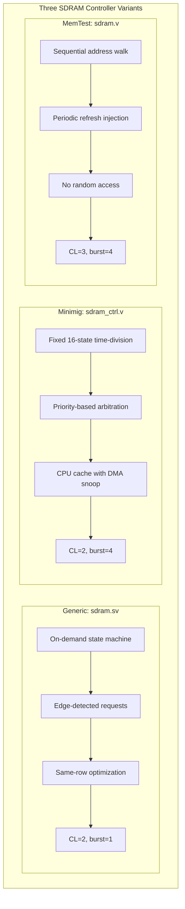

| Aspect | Generic | Minimig | MemTest |
|--------|---------|---------|---------|
| Access pattern | Random on-demand | Fixed time slots | Sequential walk |
| Arbitration | First-come, single-port | Priority: DMA > CPU > Refresh | N/A, single task |
| CPU caching | None | cpu_cache_new + snoop | None |
| CAS Latency | 2 | 2 | 3 |
| Burst length | 1 | 4 | 4 |
| Refresh strategy | Counter-based in idle | Counter-saturated in free slots | Periodic every 50 RAS |
| Used by | Menu, Arcade, most consoles | Minimig Amiga core | MemTest diagnostic |

## 2. SDRAM Chip Interface

All three controllers target the same MT48LC16M16A2 (or compatible) SDR SDRAM chip, 16-bit data width:

```verilog
// sdram.sv:L35-46 — Physical interface
inout  [15:0] SDRAM_DQ,    // Bidirectional data bus
output [12:0] SDRAM_A,     // Multiplexed address (row + column)
output        SDRAM_DQML,  // Lower byte mask
output        SDRAM_DQMH,  // Upper byte mask
output [1:0]  SDRAM_BA,    // Bank select
output        SDRAM_nCS,   // Chip select
output        SDRAM_nWE,   // Write enable
output        SDRAM_nRAS,  // Row address strobe
output        SDRAM_nCAS,  // Column address strobe
output        SDRAM_CLK,   // Clock to SDRAM chip
output        SDRAM_CKE    // Clock enable
```

The 13-bit `SDRAM_A` bus is time-multiplexed:
- **Row phase**: `SDRAM_A[12:0]` carries the row address during ACTIVATE
- **Column phase**: `SDRAM_A[9:0]` carries the column address during READ/WRITE, with `A[10]` = auto-precharge flag

The two bank select bits `SDRAM_BA[1:0]` allow 4 internal banks, enabling row-level interleaving (one bank can be precharged while another is active).

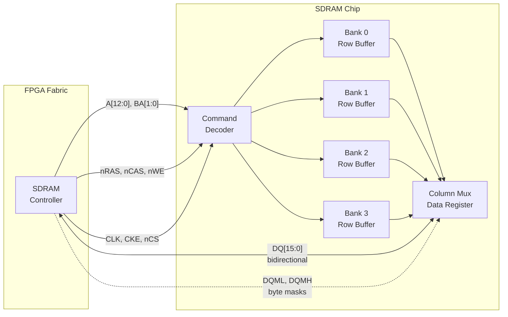

> **Key insight**: The address bus is *time-multiplexed* — the same 13 pins carry the row number during ACTIVATE and the column number during READ/WRITE. The 4 banks each hold an independent "open row" in their row buffer, so accessing a different row in the *same* bank requires PRECHARGE + ACTIVATE, but switching banks is free if the target row is already open.

---

## 3. Command Encoding

All controllers use the same 3-bit `{nRAS, nCAS, nWE}` command encoding, standard for SDR SDRAM:

```verilog
// sdram.sv:L81-88
localparam CMD_NOP             = 3'b111;  // No operation
localparam CMD_BURST_TERMINATE = 3'b110;  // Stop burst
localparam CMD_READ            = 3'b101;  // Read column
localparam CMD_WRITE           = 3'b100;  // Write column
localparam CMD_ACTIVE          = 3'b011;  // Open row (activate)
localparam CMD_PRECHARGE       = 3'b010;  // Close row(s)
localparam CMD_AUTO_REFRESH    = 3'b001;  // Refresh row
localparam CMD_LOAD_MODE       = 3'b000;  // Program mode register
```

The key timing constraints these commands must obey:

| Parameter | Value (CL=2, 100 MHz) | Meaning |
|-----------|----------------------|---------|
| tRCD | ≥ 20 ns (2 cycles) | ACTIVATE → READ/WRITE delay |
| tRP | ≥ 20 ns (2 cycles) | PRECHARGE → ACTIVATE delay |
| tRFC | ≥ 66 ns (7 cycles) | AUTO REFRESH cycle time |
| tRAS | ≥ 44 ns (5 cycles) | ACTIVATE → PRECHARGE minimum |
| CAS Latency | 2 or 3 cycles | READ command → data output delay |

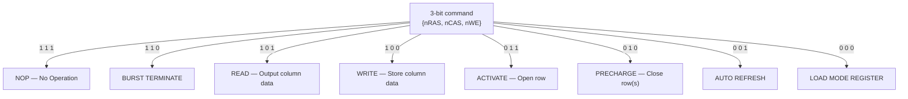

### 3.x Read Transaction Flow

A read from a new row always follows this 3-command sequence — ACTIVATE opens the row, READ selects the column, and after CAS Latency the data appears on DQ:

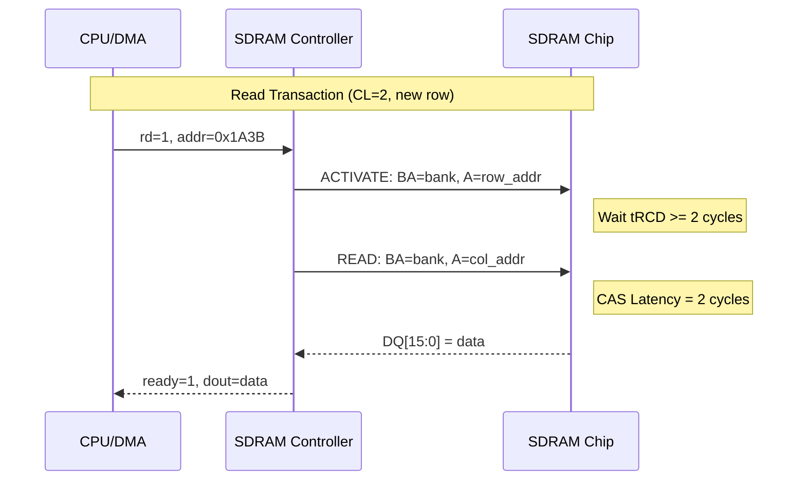

### 3.x Write Transaction Flow

Writes follow the same ACTIVATE → wait → WRITE sequence, but data is presented *with* the WRITE command — there is no write latency:

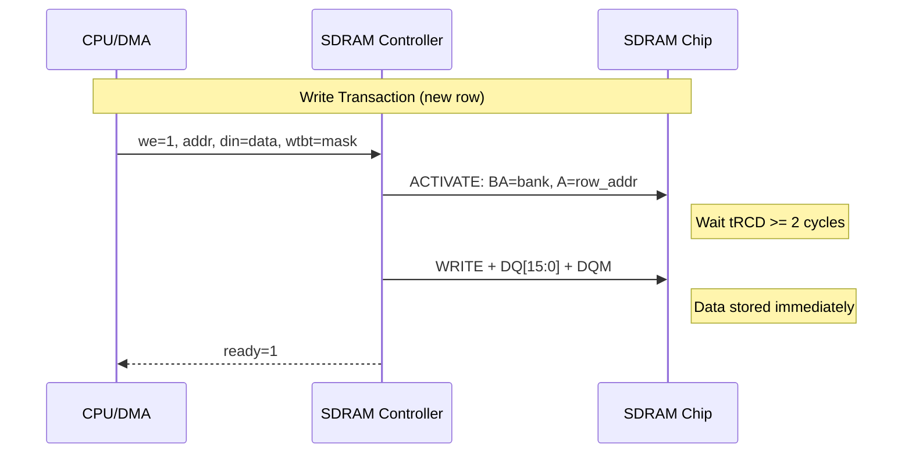

### 3.x Cycle Budget per Operation

This Gantt chart shows where each clock cycle is spent. Compare the **new-row** paths (5 or 3 cycles) against the **same-row** fast paths (3 or 1 cycles):

```mermaid
gantt
    title SDRAM Operation Cycle Budgets (CL=2, 100 MHz)
    dateFormat X
    axisFormat %s

    section New-Row Read (5 cyc)
    ACTIVATE           :a1, 0, 1
    tRCD wait          :a2, 1, 3
    READ command       :a3, 3, 4
    CAS Latency        :a4, 4, 6

    section Same-Row Read (3 cyc)
    READ command       :b1, 0, 1
    CAS Latency        :b2, 1, 3

    section New-Row Write (3 cyc)
    ACTIVATE           :c1, 0, 1
    tRCD wait          :c2, 1, 3
    WRITE + data       :c3, 3, 4

    section Same-Row Write (1 cyc)
    WRITE + data       :d1, 0, 1

    section Auto Refresh (8 cyc)
    AUTO REFRESH       :e1, 0, 1
    tRFC wait          :e2, 1, 8
```

---

## 4. Initialization Sequence

All SDRAM chips require a strict power-on initialization before accepting normal commands. The sequence is:

1. **Assert CKE** (clock enable) after VDD and VDDQ are stable
2. **Wait ≥ 100 µs** (10,000 clock cycles at 100 MHz)
3. **PRECHARGE ALL** — close all open rows
4. **AUTO REFRESH #1**
5. **AUTO REFRESH #2**
6. **LOAD MODE REGISTER** — configure CAS latency, burst length, etc.

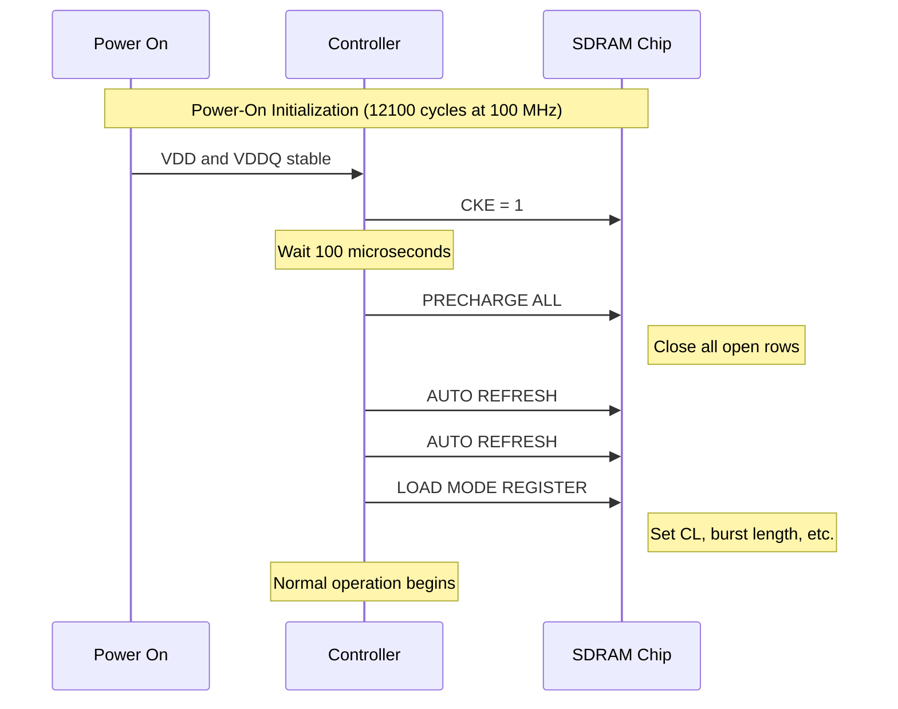

> **Why two chips?** The init sequence is performed *twice* — once for each SDRAM chip on dual-module boards. The controller toggles `chip` between 0 and 1 to select each chip sequentially.

### 4.1 Generic Controller Init (`sdram.sv`)

```verilog
// sdram.sv:L76-78 — Timing constants
localparam sdram_startup_cycles = 14'd12100;  // 100µs + margin @ 100MHz
localparam cycles_per_refresh   = 14'd780;    // (64000*100)/8192-1

// sdram.sv:L90 — Counter starts at offset so it wraps to 0 after startup
reg [13:0] refresh_count = startup_refresh_max - sdram_startup_cycles;
```

The startup state machine (`STATE_STARTUP`) counts through `sdram_startup_cycles` and issues the required commands at specific counter values:

```verilog
// sdram.sv:L151-171 — Key init timing
// Precharge both chips (offset -63 and -31 for chip 1 and chip 0)
if (refresh_count == startup_refresh_max-63 || refresh_count == startup_refresh_max-31)
    command <= CMD_PRECHARGE;  SDRAM_A[10] <= 1;  // all banks

// Two auto-refreshes per chip
if (refresh_count == startup_refresh_max-55 || refresh_count == startup_refresh_max-23)
    command <= CMD_AUTO_REFRESH;
if (refresh_count == startup_refresh_max-47 || refresh_count == startup_refresh_max-15)
    command <= CMD_AUTO_REFRESH;

// Load mode register
if (refresh_count == startup_refresh_max-39 || refresh_count == startup_refresh_max-7)
    command <= CMD_LOAD_MODE;  SDRAM_A <= MODE;
```

### 4.2 Mode Register Configuration

```verilog
// sdram.sv:L69-74 — Mode register composition
localparam BURST_LENGTH   = 3'b000;  // 000=1 (no burst)
localparam ACCESS_TYPE    = 1'b0;    // Sequential
localparam CAS_LATENCY    = 3'd2;    // CL=2 for <100MHz
localparam OP_MODE        = 2'b00;   // Standard operation
localparam NO_WRITE_BURST = 1'b1;    // Single-access write only

localparam MODE = {3'b000, NO_WRITE_BURST, OP_MODE, CAS_LATENCY, ACCESS_TYPE, BURST_LENGTH};
// Binary: 000_1_00_010_0_000 = 0x0022
```

The 13-bit mode register is sent to the SDRAM via the `SDRAM_A` bus during the LOAD MODE REGISTER command. Here is how the bits map:

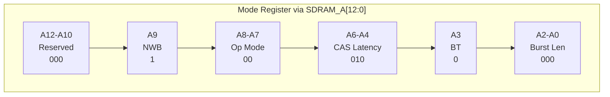

| Field | Bits | Generic Value | Minimig Value | Meaning |
|-------|------|---------------|---------------|----------|
| Reserved | A12–A10 | 000 | 000 | Must be zero |
| No Write Burst | A9 | 1 | 1 | 1 = single-access write |
| Op Mode | A8–A7 | 00 | 00 | Standard operation |
| CAS Latency | A6–A4 | 010 = CL2 | 010 = CL2 | 010 = 2, 011 = 3 cycles |
| Burst Type | A3 | 0 = Sequential | 0 = Sequential | 0 = sequential, 1 = interleaved |
| Burst Length | A2–A0 | 000 = 1 | 010 = 4 | 000=1, 001=2, 010=4, 011=8 |

The Minimig controller uses a different configuration:

```verilog
// sdram_ctrl.v:L291 — CL=2, BURST=4
sd_addr <= 13'b0001000100010;  // = 0x0442
// Decoded: 000_1_00_010_0_010 = CL=2, burst=4, sequential
```

The burst-4 mode in the Minimig controller is critical for its performance — it allows reading 4 consecutive words (8 bytes) per CAS command, enabling the `chip48` 48-bit DMA fetch in a single slot.

---

## 5. Generic Controller: sdram.sv

The `sdram.sv` controller is the most widely deployed variant — used by the Menu core, the Arcade framework, and most console cores via the `sys/` framework.

### 5.1 State Machine

```verilog
// sdram.sv:L97-106
typedef enum {
    STATE_STARTUP,
    STATE_OPEN_1, STATE_OPEN_2,  // ACTIVATE wait (tRCD)
    STATE_WRITE,
    STATE_READ,
    STATE_RFSH,                  // Auto refresh
    STATE_IDLE, STATE_IDLE_1..7  // 8 idle sub-states for refresh insertion
} state_t;
```

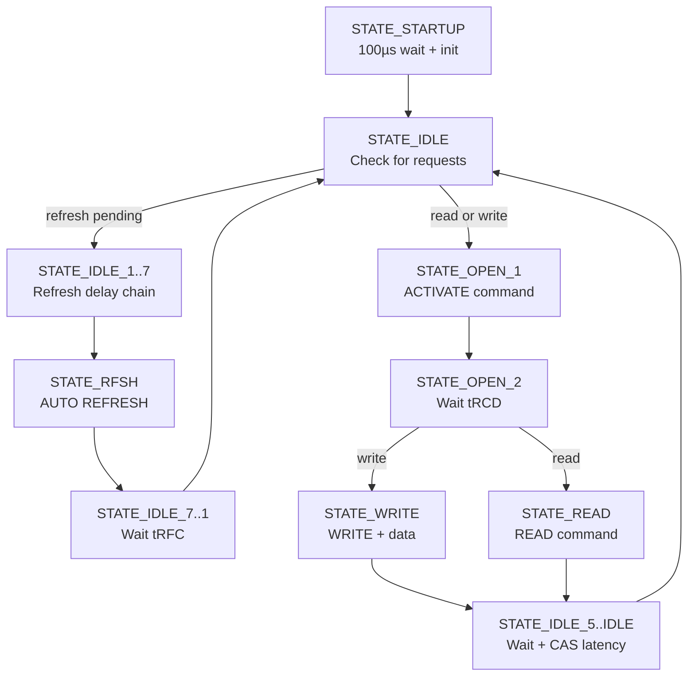

### 5.2 Request Capture

The controller captures read and write requests on their **rising edges**, ensuring each request is processed exactly once:

```verilog
// sdram.sv:L264-268 — Edge-detected request capture
old_we <= we;
if(we & ~old_we) {ready, new_we, new_data, new_wtbt} <= {1'b0, 1'b1, din, wtbt};

old_rd <= rd;
if(rd & ~old_rd) {ready, new_rd} <= {1'b0, 1'b1};
```

When a request is captured, `ready` deasserts (indicating the controller is busy) and the request flag (`new_we` or `new_rd`) is set.

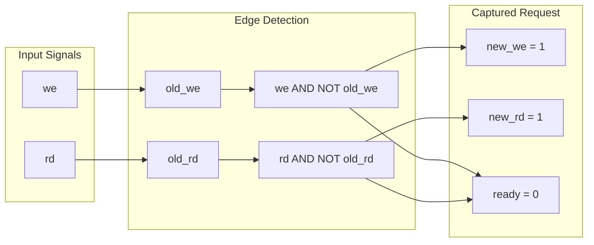

> **Why edge-detect?** If the core holds `rd` high for multiple cycles (waiting for the response), a level-sensitive input would re-trigger the state machine every cycle. Edge detection ensures each *assertion* is processed exactly once.

### 5.3 Same-Row Optimization

The controller detects back-to-back accesses to the same row and skips the ACTIVATE phase:

```verilog
// sdram.sv:L221-224 — Same-row fast path
if(~new_we & ~save_we & (save_addr[26:1] == addr[26:1])) begin
    ready <= 1;  // Row already open — immediate ack
end else begin
    state <= STATE_OPEN_1;  // Need to open new row
    ...
end
```

This optimization is significant: for sequential memory accesses (which are common in DMA and ROM loading), it halves the access latency by skipping the 2-cycle ACTIVATE wait.

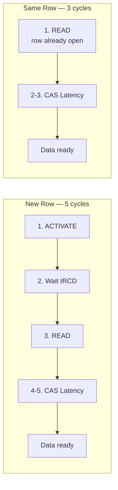

> **Practical impact**: During ROM loading via `ioctl_download`, data is read sequentially from address 0 upward. The first access opens a row (5 cycles), then every subsequent access in that row hits the same-row path (3 cycles) — an average of ~3.03 cycles per word for 512-word rows.

### 5.4 Read Pipeline

The read path uses a shift register to track CAS latency:

```verilog
// sdram.sv:L124-126 — CAS latency tracking
reg [CAS_LATENCY:0] data_ready_delay;
data_ready_delay <= {1'b0, data_ready_delay[CAS_LATENCY:1]};
if(data_ready_delay[0]) {ready, data} <= {1'b1, SDRAM_DQ};
```

When a READ command is issued (`STATE_READ`), `data_ready_delay[CAS_LATENCY]` is set. After exactly `CAS_LATENCY` clock cycles, bit 0 of the shift register goes high, capturing `SDRAM_DQ` into the output register.

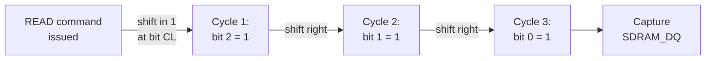

> For CL=2, the shift register is 3 bits wide. Setting bit 2 means the "1" takes 2 cycles to reach bit 0 — exactly matching the SDRAM chip's CAS Latency. This creates a precise, hardware-synchronized pipeline with zero jitter.

### 5.5 Timing Summary

| Operation | Cycles (CL=2) | Notes |
|-----------|--------------|-------|
| Same-row read | 3 | READ + 2 CL |
| Same-row write | 1 | WRITE (ready immediately) |
| New-row read | 5 | ACTIVATE + wait + READ + 2 CL |
| New-row write | 3 | ACTIVATE + wait + WRITE |
| Auto refresh | 8 | REFRESH + 6 idle + IDLE_1 |

---

## 6. Minimig Controller: sdram_ctrl.v

The Minimig (Amiga) core uses a fundamentally different SDRAM controller architecture optimized for the Amiga's chip-RAM access patterns.

### 6.1 Fixed Time-Division Slots

Unlike the generic controller's on-demand state machine, `sdram_ctrl.v` operates on a **fixed 16-state cycle** synchronized to the Amiga's 7 MHz `c_7m` clock:

```verilog
// sdram_ctrl.v:L233-239 — 16-state counter locked to 7 MHz
reg [3:0] sdram_state;
always @(posedge sysclk) begin
    reg old_7m;
    sdram_state <= sdram_state + 1'd1;
    old_7m <= c_7m;
    if(~old_7m & c_7m) sdram_state <= 0;
end
```

At 112 MHz system clock, there are 16 SDRAM states per 7 MHz Amiga cycle, providing 16 SDRAM operations per Amiga clock. This is the key to achieving "hidden refresh" — refresh cycles are placed in unused time slots within the 7 MHz period.

```mermaid
gantt
    title Minimig 16-State Cycle (112 MHz, one 7 MHz period)
    dateFormat X
    axisFormat %s

    section Slot Allocation
    State 0 — Arbitrate  :a0, 0, 1
    State 1-2 — ACTIVATE :a1, 1, 3
    State 3-6 — RAS-CAS gap :a2, 3, 7
    State 7-8 — CAS phase :a3, 7, 9
    State 9 — Data capture :a4, 9, 10
    State 10-14 — Data + next prep :a5, 10, 15
    State 15 — Refresh window :a6, 15, 16
```

> **Why 16 states?** At 112 MHz, one 7 MHz period is exactly 16 cycles (112/7 = 16). The controller uses every one of these 16 cycles productively — the chip DMA is guaranteed a slot every 7 MHz period, and any leftover cycles are used for CPU access or refresh.

### 6.2 Priority-Based Slot Allocation

The state 0 (RAS phase) allocates the current slot by priority:

```verilog
// sdram_ctrl.v:L300-343 — Slot arbitration
0: begin
    slot_type <= IDLE;
    
    // Priority 1: Chip DMA (Agnus bitplane/sprite/blitter/copper)
    if(~chipDMA | ~chipRW) begin
        slot_type  <= CHIP;
        {sd_ba, sd_addr, casaddr[8:0]} <= chipAddr;
        sd_ras     <= 0;  // ACTIVATE
        ...
    end
    // Priority 2: Pending CPU write
    else if(write_req) begin
        slot_type  <= CPU_WRITECACHE;
        ...
    end
    // Priority 3: CPU read cache fill
    else if(cache_req) begin
        slot_type  <= CPU_READCACHE;
        ...
    end
    // Priority 4: Refresh (only when counter saturates)
    else if(&rcnt) begin
        sd_ras <= 0; sd_cas <= 0;  // AUTO REFRESH
        rcnt   <= 0;
    end
end
```

The chip DMA port has **absolute priority** over CPU access — this ensures the Amiga's video and audio DMA never starves, which would cause visible glitches.

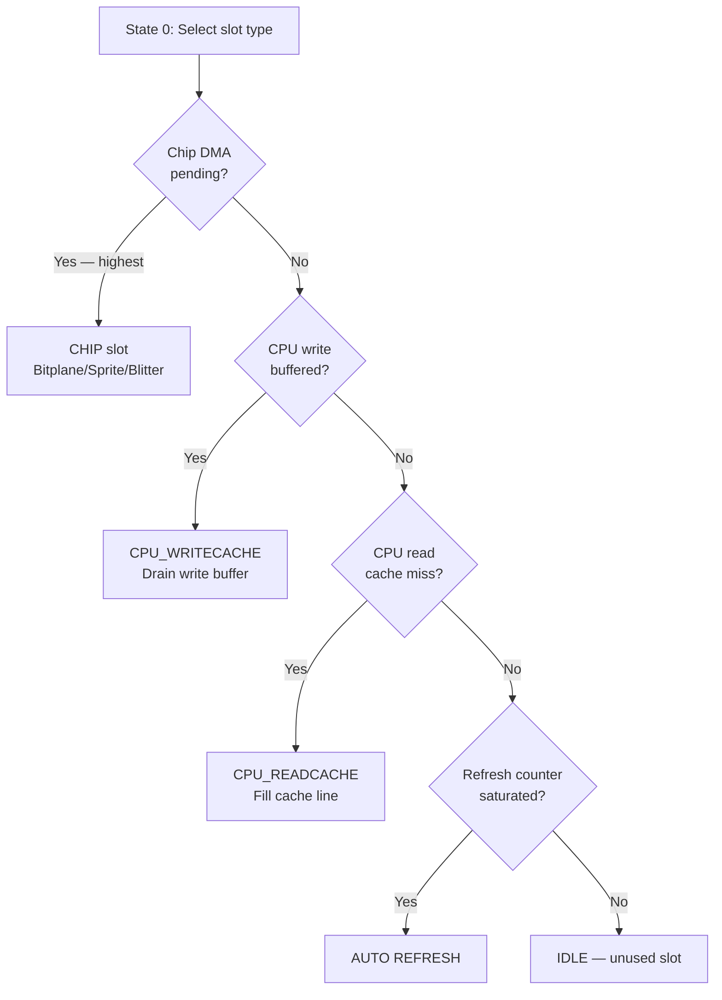

### 6.3 CPU Cache: cpu_cache_new

The Minimig controller includes a `cpu_cache_new` instance that provides cached CPU access to SDRAM:

```verilog
// sdram_ctrl.v:L109-132 — CPU cache instantiation
cpu_cache_new cpu_cache (
    .clk(sysclk),
    .rst(!reset || !cache_rst),
    .cpu_cache_ctrl(cpu_cache_ctrl),  // Cache control from CPU
    .cache_inhibit(cache_inhibit),     // DMA inhibit
    .cpu_cs(ramsel),                   // CPU RAM select
    .cpu_adr(cpuAddr),                 // CPU address
    .cpu_bs({!cpuU, !cpuL}),          // Byte selects
    .cpu_we(cpustate == 3),           // Write
    .cpu_ir(cpustate == 0),           // Instruction read
    .cpu_dr(cpustate == 2),           // Data read
    .snoop_act(chipWE),               // DMA write snoop
    .snoop_adr(chipAddr),             // Snoop address
    .snoop_dat_w(chipWR),             // Snoop data
    .snoop_bs({!chipU, !chipL})       // Snoop byte selects
);
```

The cache is essential for the 68020 mode: the TG68K CPU has much higher memory throughput than the 68000, and the fixed time-division slot allocator would starve the CPU without caching.

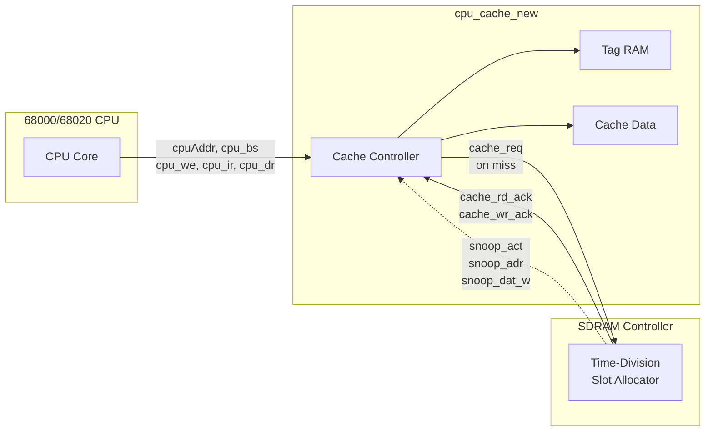

### 6.4 DMA Snoop (Cache Coherency)

When the chipset (Agnus DMA) writes to SDRAM, the CPU cache must be invalidated. The `snoop_act`/`snoop_adr`/`snoop_dat_w` ports allow the cache to observe DMA writes and update its contents:

```verilog
// sdram_ctrl.v:L319 — Chip WE signals a DMA write
chipWE <= !chipRW;
```

This implements a simple write-through snoop: any chip DMA write to an address that happens to be cached will update the cache line, preventing the CPU from reading stale data.

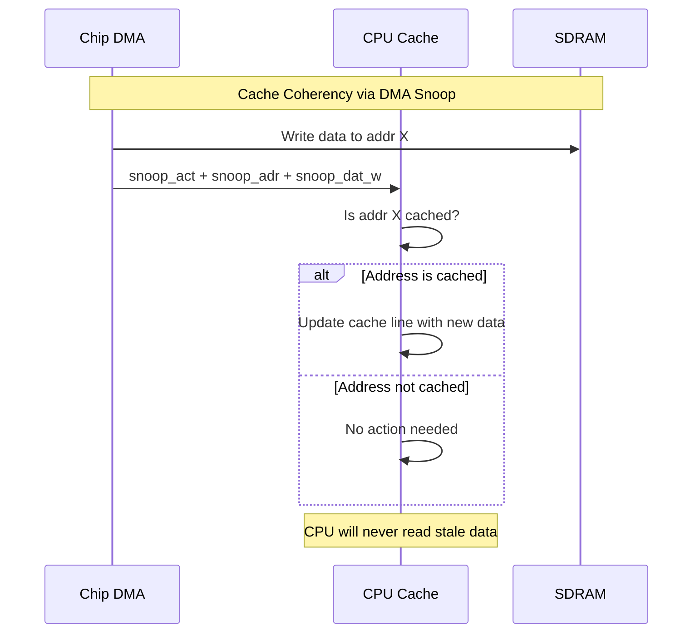

### 6.5 Write Buffer

A 1-entry write buffer decouples CPU write timing from SDRAM slot availability:

```verilog
// sdram_ctrl.v:L153-186 — Write buffer state machine
case(write_state)
    default:  // Capture write
        if(~write_ena && ramsel && cpustate == 3) begin
            writeAddr <= cpuAddr;
            writeDat  <= cpuWR;
            write_dqm <= {cpuU, cpuL};
            write_req <= 1;
            if(cache_wr_ack) begin
                write_ena   <= 1;
                write_state <= 1;
            end
        end
    1: if(write_ack) write_state <= 2;  // SDRAM accepted
    2: if(!write_ack) write_state <= 0; // Ready for next
endcase
```

The CPU receives `ramready` as soon as the write is captured in the buffer — it does not wait for the actual SDRAM write to complete:

```verilog
assign ramready = cache_rd_ack || write_ena;
```

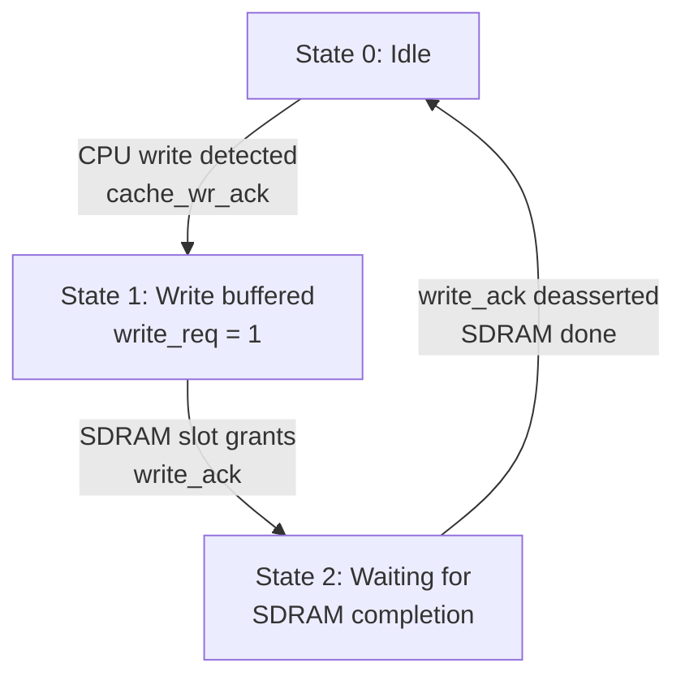

> **Latency hiding**: The CPU sees `ramready` as soon as the write enters the buffer (state 0 → 1). The actual SDRAM write happens asynchronously in a future time slot. If a second CPU write arrives before the buffer drains, the CPU stalls until the buffer is free — but this is rare because the CPU gets plenty of write slots.

### 6.6 chip48: 48-Bit DMA Fetch

The Minimig controller supports reading 3 consecutive 16-bit words (48 bits total) in a single time slot using burst-4 mode:

```verilog
// sdram_ctrl.v:L191-207 — Chip DMA burst read
always @(posedge sysclk) begin
    if(slot_type == CHIP) begin
        case(sdram_state)
             9: chipRD   <= sdata_chip;  // Word 0 (via CAS latency)
            11: chip48_1 <= sdata_chip;  // Word 1 (burst)
            13: chip48_2 <= sdata_chip;  // Word 2 (burst)
            15: chip48_3 <= sdata_chip;  // Word 3 (burst, unused)
        endcase
    end
end
assign chip48 = {chip48_1, chip48_2, chip48_3};
```

This is used for bitplane DMA where the Amiga fetches multiple bitplanes per scanline in rapid succession.

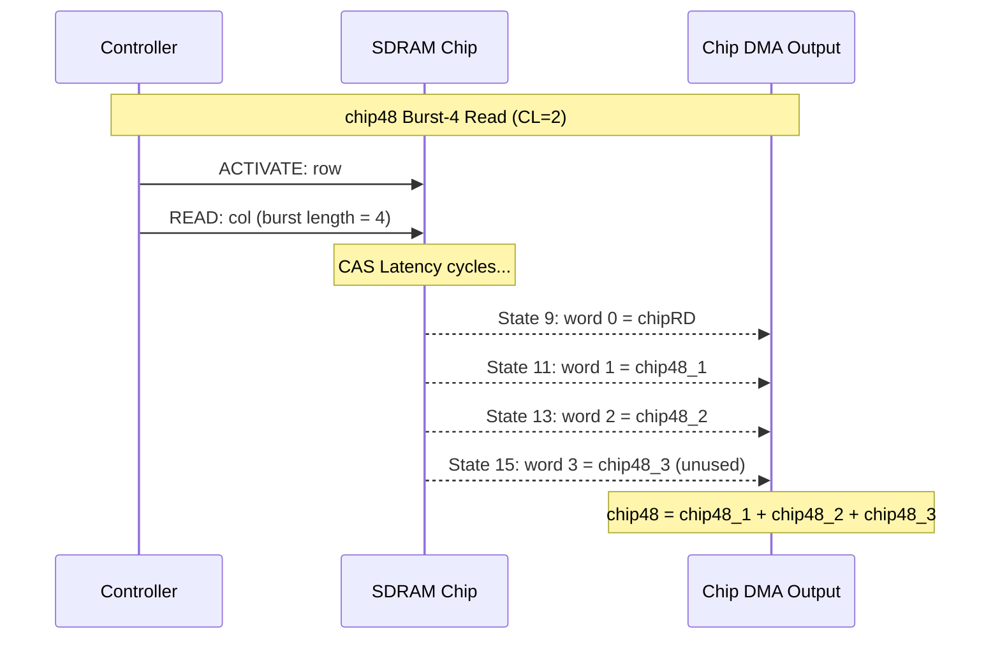

> **Why skip word 0?** The `chipRD` capture at state 9 serves a different purpose (the first read response). The `chip48` concatenation uses words 1-3 to build a 48-bit value for bitplane DMA — three 16-bit bitplane words fetched in a single 7 MHz cycle.

---

## 7. MemTest Burst Controller

The MemTest core uses a different controller variant (`sdram.v`, 276 lines) designed for **sequential burst testing** rather than random access.

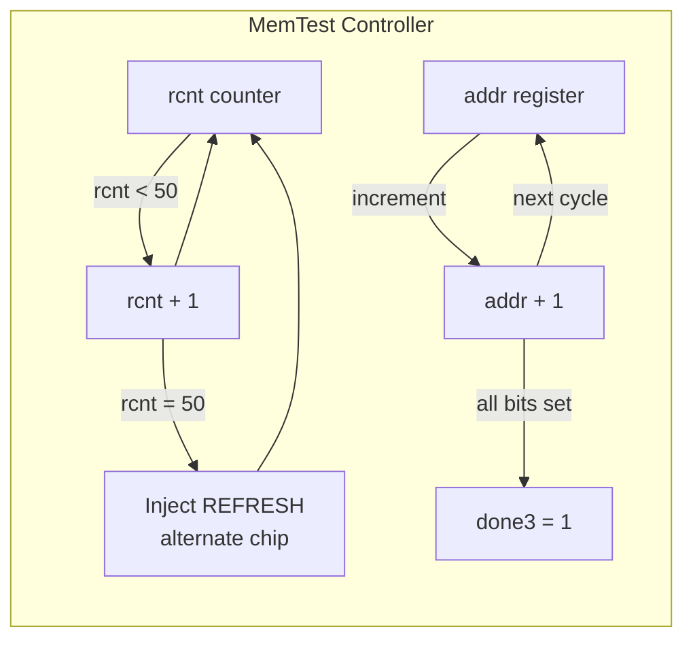

### 7.1 Sequential Access Pattern

Unlike the generic controller which processes one request at a time, the MemTest controller walks through the entire address space sequentially:

```verilog
// sdram.v:L189-213 — Sequential address generation
case(state)
    0: begin
        rcnt <= rcnt + 1'd1;
        if(rcnt == 50) rcnt <= 0;  // Refresh every 50 RAS cycles
        rfsh <= 0;
        if(rcnt >= 49) rfsh <= {1'b1, rcnt[0]};  // Alternating chip
        addr3 <= addr;
    end
    1: begin  // RAS
        if(rfsh[1]) begin
            cmd2 <= CMD_AUTO_REFRESH;
            cs2  <= rfsh[0];  // Select chip based on counter LSB
        end
        else if(~done3) begin
            {cs2, cas_addr2, sdaddr2, ba2, cas_addr2[1:0]} <= {addr3, 2'b00};
            wr2      <= ~rnw_reg;
            cas_cmd2 <= rnw_reg ? CMD_READ : CMD_WRITE;
            cmd2     <= CMD_ACTIVE;
            addr2    <= addr + 1'd1;  // Increment address
        end
    end
endcase
```

The `sz` input controls the address space size:

```verilog
// sdram.v:L228-233 — Termination conditions
if(chip == 0 && sz == 3 && &addr[23:0]) done3 <= 1;  // 16MB chip 0
if(chip == 1 && sz == 3 && &addr[22:0]) done3 <= 1;  // 8MB chip 1
if(chip == 2 && sz == 3 && &addr[23:0]) done3 <= 1;  // 16MB chip 2
if(sz == 2 && &addr[22:0]) done3 <= 1;               // 8MB
if(sz <= 1 && &addr[21:0]) done3 <= 1;               // 4MB
```

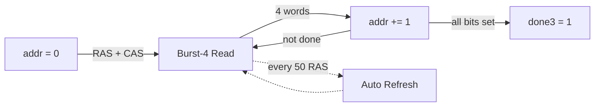

| Module Size | sz Input | Address Bits | Capacity |
|-------------|----------|-------------|----------|
| 32 MB | 0 or 1 | addr[21:0] | 4 MB per chip |
| 64 MB | 2 | addr[22:0] | 8 MB per chip |
| 128 MB | 3 | addr[23:0] | 16 MB per chip |

### 7.2 Burst-4 Read Pipeline

The MemTest controller uses CL=3 with burst-4, giving a 4-word read per CAS command:

```verilog
// sdram.v:L160 — Mode register
sdaddr2 <= 13'b000_0_00_011_0_010;  // CL=3, burst=4

// sdram.v:L107-108 — Ready strobe per word in burst
if(wr) case(state) 3,4,5,6: ready2 <= 1; endcase  // 4 write words
if(rd) case(state) 2,3,4,5: ready2 <= 1; endcase  // 4 read words
```

```mermaid
sequenceDiagram
    participant CTRL as Controller
    participant CHIP as SDRAM Chip
    participant TEST as Test Logic

    Note over CTRL,TEST: Burst-4 Read (CL=3)
    CTRL->>CHIP: ACTIVATE: row
    CTRL->>CHIP: READ: col (burst = 4)
    Note over CHIP: CL=3 cycles...
    CHIP-->>TEST: State 2: word 0 (ready2)
    CHIP-->>TEST: State 3: word 1 (ready2)
    CHIP-->>TEST: State 4: word 2 (ready2)
    CHIP-->>TEST: State 5: word 3 (ready2)
    Note over TEST: 4 words per CAS command
```

---

## 8. Clock Generation: altddio_out

All three controllers use the same `altddio_out` DDR output primitive to generate the SDRAM clock:

```verilog
// sdram.sv:L271-294 — DDR clock output
altddio_out #(
    .extend_oe_disable("OFF"),
    .intended_device_family("Cyclone V"),
    .invert_output("OFF"),
    .width(1)
) sdramclk_ddr (
    .datain_h(1'b0),   // High phase: drive low
    .datain_l(1'b1),   // Low phase: drive high
    .outclock(clk),     // System clock
    .dataout(SDRAM_CLK) // Output to SDRAM chip
);
```

The DDR primitive drives the SDRAM clock at the **same frequency** as the system clock, but inverted (low on rising edge, high on falling edge). This creates a clock edge at the SDRAM that is phase-shifted by approximately **180°** from the internal logic, compensating for the output pin propagation delay.

```mermaid
flowchart LR
    subgraph INTERNAL["FPGA Internal clk"]
        direction TB
        R1["Rising edge"]
        F1["Falling edge"]
    end
    subgraph DDR["altddio_out"]
        direction TB
        DH["datain_h = 0<br>Drive LOW on rising"]
        DL["datain_l = 1<br>Drive HIGH on falling"]
    end
    subgraph OUTPUT["SDRAM_CLK pin"]
        direction TB
        LO["Low at internal rising"]
        HI["High at internal falling"]
    end
    R1 --> DH --> LO
    F1 --> DL --> HI
```

> **Intuition**: Think of it as a "mirror" — when the FPGA logic triggers on a rising clock edge, the SDRAM sees a falling edge. This ~180° shift means the SDRAM captures data at the center of its valid window, maximizing setup/hold margin.

The phase can be further adjusted by configuring the PLL's phase shift parameter in the core's top-level PLL instantiation — this is the mechanism described in the [Phase Alignment](#11-phase-alignment-and-timing-margins) section.

---

## 9. 8-Bit vs 16-Bit Mode

The generic `sdram.sv` controller supports both 8-bit and 16-bit access modes via the `wtbt` input:

```mermaid
flowchart TD
    subgraph MODE16["16-bit Mode"]
        W16["Write 16-bit word"] --> DQM16["DQMH=0, DQML=0<br>both bytes active"] --> STORE16["Store DQ[15:0]"]
    end
    subgraph MODE8E["8-bit Mode, even addr"]
        W8E["Write byte, addr[0]=0"] --> DQME["DQMH=0, DQML=1<br>high byte active"] --> DUPE["Duplicate byte to both lanes"] --> MASKE["DQM masks low byte"]
    end
    subgraph MODE8O["8-bit Mode, odd addr"]
        W8O["Write byte, addr[0]=1"] --> DQMO["DQMH=1, DQML=0<br>low byte active"] --> DUPO["Duplicate byte to both lanes"] --> MASKO["DQM masks high byte"]
    end
```

| Mode | wtbt | addr[0] | DQMH | DQML | DQ Data | Effect |
|------|------|---------|-------|------|---------|--------|
| 16-bit write | bit mask | x | ~wtbt[1] | ~wtbt[0] | din[15:0] | Write selected bytes |
| 16-bit read | x | x | 0 | 0 | SDRAM_DQ | Read both bytes |
| 8-bit write even | 2'b00 | 0 | 0 | 1 | {din[7:0], din[7:0]} | Store high lane |
| 8-bit write odd | 2'b00 | 1 | 1 | 0 | {din[7:0], din[7:0]} | Store low lane |
| 8-bit read even | x | 0 | 0 | 0 | SDRAM_DQ | Swap if needed |
| 8-bit read odd | x | 1 | 0 | 0 | SDRAM_DQ | Byte-swap output |

```verilog
// sdram.sv:L47-49 — wtbt encoding
// 16-bit mode: bit1 = write high byte, bit0 = write low byte
// 8-bit mode:  2'b00 = use addr[0] to decide which byte to write
```

### 9.1 Byte Lane Selection

The DQM (Data Mask) signals control which byte lanes are active during a write. In `STATE_OPEN_2`, the controller computes the DQM values:

```verilog
// sdram.sv:L241 — DQM calculation in CAS phase
SDRAM_A <= {save_we & (new_wtbt ? ~new_wtbt[1] : ~save_addr[0]),  // DQMH
             save_we & (new_wtbt ? ~new_wtbt[0] : save_addr[0]),  // DQML
             1'b1,  // A10 = auto-precharge
             save_addr[25], save_addr[22:14]};  // Column address
```

The DQM signals are mapped to `SDRAM_A[12:11]`:

```verilog
// sdram.sv:L64
assign {SDRAM_DQMH, SDRAM_DQML} = SDRAM_A[12:11];
```

For reads, DQM is always 0 (both bytes enabled) since reads are always 16-bit and the controller handles byte selection internally.

### 9.2 Byte Swizzling

The controller swaps bytes based on `addr[0]` for 8-bit mode:

```verilog
// sdram.sv:L66
assign dout = save_addr[0] ? {data[7:0], data[15:8]}    // Odd byte: swap
                          : {data[15:8], data[7:0]};    // Even byte: no swap
```

### 9.3 8-Bit Write Duplication

When writing a single byte in 8-bit mode, the controller duplicates the byte to both lanes:

```verilog
// sdram.sv:L254 — Write data in 8-bit mode
SDRAM_DQ <= new_wtbt ? new_data : {new_data[7:0], new_data[7:0]};
```

The DQM mask then selects which lane the SDRAM actually stores.

---

## 10. Refresh Scheduling Strategies

SDRAM requires 8192 refresh cycles every 64 ms. At 100 MHz, this translates to one refresh every 7,812 cycles.

### 10.1 Generic Controller: Counter-Based

```verilog
// sdram.sv:L77 — Refresh interval
localparam cycles_per_refresh = 14'd780;  // (64000*100)/8192 - 1

// sdram.sv:L122 — Counter increments every cycle
refresh_count <= refresh_count + 1'b1;
```

Refresh is triggered when `refresh_count > cycles_per_refresh`. The controller checks this in the idle sub-states and inserts a refresh cycle if due:

```verilog
// sdram.sv:L196-205 — Refresh insertion in idle chain
if(refresh_count > cycles_per_refresh) begin
    chip     <= 1;              // Toggle to other chip
    state    <= STATE_RFSH;
    command  <= CMD_AUTO_REFRESH;
    refresh_count <= refresh_count - cycles_per_refresh + 1;
end
```

The `chip <= 1` toggle alternates refreshes between two SDRAM chips (for dual-module configurations).

### 10.2 Minimig Controller: Counter-Saturated

```verilog
// sdram_ctrl.v:L307 — Refresh counter
if(~&rcnt) rcnt <= rcnt + 1'd1;

// sdram_ctrl.v:L338-343 — Refresh when counter saturates
else if(&rcnt) begin
    sd_ras <= 0; sd_cas <= 0;  // AUTO REFRESH
    rcnt   <= 0;
end
```

The counter saturates at its maximum value (all 1s). Refresh occurs only when the counter is fully saturated AND no higher-priority access is pending. This naturally hides refreshes during idle periods.

### 10.3 MemTest Controller: Periodic Injection

```verilog
// sdram.v:L191-196 — Refresh every 50 RAS cycles
rcnt <= rcnt + 1'd1;
if(rcnt == 50) rcnt <= 0;
rfsh <= 0;
if(rcnt >= 49) rfsh <= {1'b1, rcnt[0]};  // Flag refresh, alternate chip
```

The MemTest controller injects a refresh every 50 RAS cycles regardless, since the test is sequential and predictable.

```mermaid
flowchart TD
    subgraph GEN["Generic: Counter-Based"]
        GC["refresh_count++"] --> GC2{"count ><br>780?"}
        GC2 -->|"Yes"| GC3["Insert REFRESH<br>in idle chain"]
        GC2 -->|"No"| GC4["Continue normally"]
        GC3 --> GC
        GC4 --> GC
    end
    subgraph MIN["Minimig: Counter-Saturated"]
        MC["rcnt++"] --> MC2{"rcnt = max AND<br>no higher priority?"}
        MC2 -->|"Yes"| MC3["Insert REFRESH<br>in unused slot"]
        MC2 -->|"No"| MC4["Defer to next slot"]
        MC3 --> MC
        MC4 --> MC
    end
    subgraph MT["MemTest: Periodic Injection"]
        TC["rcnt++"] --> TC2{"rcnt = 50?"}
        TC2 -->|"Yes"| TC3["Mandatory REFRESH<br>alternate chip"]
        TC2 -->|"No"| TC4["Continue test"]
        TC3 --> TC
        TC4 --> TC
    end
```

| Strategy | Trigger | Placement | Latency Impact |
|----------|---------|-----------|----------------|
| Counter-based | count > 780 | During idle sub-states | Can delay next request by 8 cycles |
| Counter-saturated | rcnt = all 1s | In unused time slots | Zero impact if enough idle slots |
| Periodic injection | Every 50 RAS cycles | Inline with test | Predictable 1-slot overhead |

---

## 11. Phase Alignment and Timing Margins

> **See also**: [SDRAM Timing Theory](sdram_timing_theory.md) for the mathematical treatment of phase alignment.

The `altddio_out` clock inversion provides an approximate **-90° phase shift** (half a clock period at 100 MHz = 5 ns). This compensates for:
- FPGA output pin propagation delay (~2–3 ns)
- PCB trace delay (~1–2 ns)
- SDRAM input setup time requirement (~1.5 ns)

For higher frequencies (>100 MHz), cores configure the PLL to add additional negative phase shift. Typical values:

| Frequency | PLL Phase | Notes |
|-----------|-----------|-------|
| 96–100 MHz | -45° to -90° | Most cores, sufficient margin |
| 112 MHz (Minimig) | -2.5 ns | Fine-tuned for Amiga timing |
| 120–167 MHz | -3 to -5 ns | Saturn, Neo Geo — requires PC167 module |

```mermaid
flowchart LR
    subgraph FREQ["Frequency vs Phase Shift"]
        direction TB
        F100["96-100 MHz<br>Phase: -45 to -90 deg"] --> F112["112 MHz<br>Phase: -2.5 ns"] --> F120["120-167 MHz<br>Phase: -3 to -5 ns"]
    end
    subgraph REASON["Why More Shift at Higher Freq?"]
        direction TB
        P1["Shorter clock period"] --> P2["Less margin for<br>pin + trace delay"] --> P3["Need more negative<br>phase to compensate"]
    end
    FREQ -.-> REASON
```

The MemTest core is the definitive tool for verifying phase alignment — it walks every address and checks for data corruption.

---

## 12. Multi-Module and Dual-SDRAM Support

```mermaid
flowchart LR
    ADDR["27-bit address"] --> BIT26{"MSB of addr?"}
    BIT26 -->|"0"| C0["Chip 0: 0 to 32 MB"]
    BIT26 -->|"1"| C1["Chip 1: 32 to 64 MB"]
    C0 --> ROW0["Row: addr[25:14], Col: addr[13:1]"]
    C1 --> ROW1["Row: addr[25:14], Col: addr[13:1]"]
```

### 12.1 Chip Select in Generic Controller

The generic controller supports two SDRAM chips via the `addr[26]` bit:

```verilog
// sdram.sv:L59,93
assign SDRAM_nCS = chip;  // Active-low chip select
reg chip = 0;

// sdram.sv:L230 — Chip selection during ACTIVATE
chip <= addr[26];  // MSB of address selects chip
```

When `addr[26] = 0`, chip 0 is selected (nCS = 0 = active). When `addr[26] = 1`, chip 1 is selected.

```mermaid
sequenceDiagram
    participant CTRL as Controller
    participant C0 as Chip 0
    participant C1 as Chip 1

    Note over CTRL,C1: Initialization — both chips configured sequentially
    CTRL->>C0: chip = 0: PRECHARGE, REFRESH x2, LOAD MODE
    CTRL->>C1: chip = 1: PRECHARGE, REFRESH x2, LOAD MODE
    Note over CTRL: Normal operation begins
    CTRL->>C0: addr[26]=0: read/write
    CTRL->>C1: addr[26]=1: read/write
```

During initialization, both chips are configured sequentially:

```verilog
// sdram.sv:L151-152 — Toggle chip select during init
if (refresh_count == (startup_refresh_max-64)) chip <= 1;  // Init chip 1
if (refresh_count == (startup_refresh_max-32)) chip <= 0;  // Init chip 0
```

### 12.2 Dual-SDRAM in MemTest

The MemTest controller supports a third "chip 2" configuration for 128 MB (2 × 64 MB) modules:

```verilog
// sdram.v:L174-180 — Chip 2 addressing
if (chip == 2'h2) begin
    addr  <= 24'h800000;  // Start at 64 MB offset
    addr2 <= 24'h800000;
end
```

---

## 13. Common Pitfalls

```mermaid
flowchart TD
    subgraph P1["Refresh Starvation"]
        RS1["Core never deasserts rd/we"] --> RS2["Refresh counter accumulates"] --> RS3["SDRAM loses data"] --> RS4["Fix: Ensure idle periods<br>during horizontal blanking"]
    end
    subgraph P2["Row Miss Penalty"]
        RM1["Multiple DMA channels<br>access different rows"] --> RM2["5-cycle penalty per row switch"] --> RM3["Bandwidth collapse"] --> RM4["Fix: Same-row optimization<br>or time-division arbitration"]
    end
    subgraph P3["Phase Misalignment"]
        PM1["Frequency > 120 MHz"] --> PM2["Default -90 deg insufficient"] --> PM3["MemTest failures at<br>specific address ranges"] --> PM4["Fix: Increase negative<br>PLL phase shift"]
    end
    subgraph P4["8-Bit Address Alignment"]
        BA1["addr[0] not maintained"] --> BA2["Swapped bytes on read"] --> BA3["Corrupted data"] --> BA4["Fix: Set addr[0]=0 for<br>16-bit mode operation"]
    end
```

### 13.1 Refresh Starvation

If a core continuously issues read/write requests without idle periods, the refresh counter accumulates and the SDRAM loses data. The generic controller mitigates this by checking refresh in the idle sub-states, but a core that never deasserts `rd`/`we` will starve refresh.

**Fix**: Ensure the core has natural idle periods (e.g., during horizontal blanking) where the SDRAM controller can insert refreshes.

### 13.2 Row Miss Penalty

Switching between addresses in different rows costs 5 cycles (ACTIVATE + tRCD + READ + CL). Cores that interleave accesses to many different rows (e.g., multiple DMA channels accessing different regions) will suffer high miss rates.

**Fix**: The Minimig controller solves this by giving chipset DMA absolute priority and using the time-division approach to guarantee each channel gets its slot. The generic controller relies on the same-row optimization for sequential accesses.

### 13.3 Phase Alignment at High Frequencies

At frequencies above 120 MHz, the default -90° PLL phase shift may not provide sufficient setup margin. Symptoms include MemTest failures at specific address ranges or bit patterns.

**Fix**: Adjust the PLL phase shift in the core's top-level module. Start with more negative phase and test with MemTest until all tests pass.

### 13.4 8-Bit Mode Address Alignment

In 8-bit mode, `addr[0]` selects the byte within a 16-bit word. If `addr[0]` is not correctly maintained, reads will return swapped bytes.

**Fix**: Ensure `addr[0] = 0` for 16-bit mode operation (as noted in `sdram.sv:L51`).

---

## Cross-References

- [SDRAM Timing Theory](sdram_timing_theory.md) — Phase alignment mathematics and GPIO propagation delay analysis
- [Memory Controllers](memory_controllers.md) — Architectural overview of SDRAM vs DDR3 memory subsystems
- [DDR3 Architecture](ddr3_architecture.md) — The DDR3/F2H AXI path for non-deterministic high-bandwidth access
- [HPS IO Module](hps_io_module.md) — How ROM data is downloaded into SDRAM via `ioctl_download`
- [sys_top](sys_top.md) — Where the SDRAM module is instantiated in the framework
- [FPGA Performance Metrics](fpga_performance_metrics.md) — SDRAM bandwidth and utilization baselines

---

Source: `Menu_MiSTer/rtl/sdram.sv` (297 lines), `Minimig-AGA_MiSTer/rtl/sdram_ctrl.v` (364 lines), `MemTest_MiSTer/rtl/sdram.v` (276 lines)
