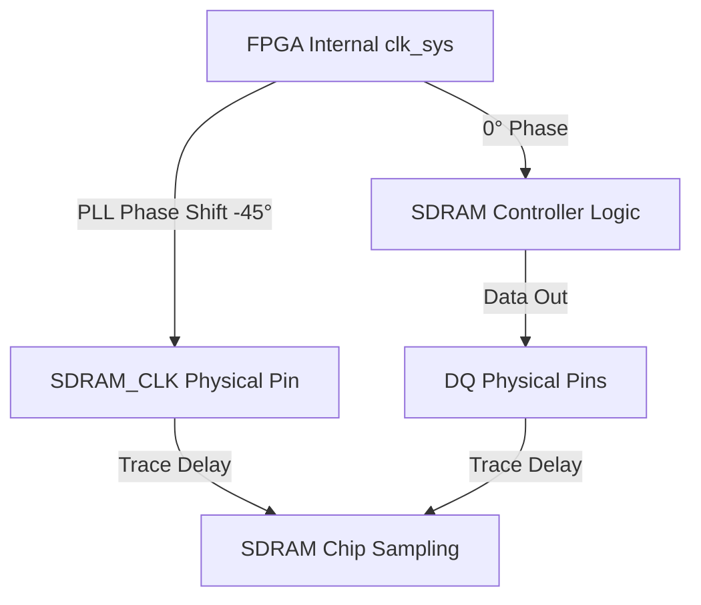

[← FPGA Subsystem](README.md) · [↑ Knowledge Base](../README.md)

# SDRAM Timing Theory & Phase Alignment

This document explains the technical challenges of driving external SDR SDRAM at high frequencies (100MHz+) via the DE10-Nano's GPIO headers.

---

## 1. The Challenge: GPIO Propagation Delay

The MiSTer SDRAM daughterboard is connected to the FPGA via the **GPIO-1** header. Unlike internal DDR3 (which uses hardened silicon controllers), the SDR SDRAM relies on standard FPGA I/O pins and traces.

At high frequencies, the time it takes for a signal to travel from the FPGA to the SDRAM chip (and back) becomes significant relative to the clock cycle. 
*   At **100 MHz**, one clock period is **10.0 ns**.
*   At **167 MHz**, one clock period is **6.0 ns**.

If the clock and data signals are not perfectly aligned, the SDRAM will misread the data (Setup violation) or the FPGA will miss the response (Hold violation).

---

## 2. Phase-Shift Alignment

To compensate for these trace delays, the `sys/` framework utilizes a Phase-Locked Loop (PLL) to shift the SDRAM clock relative to the system clock.

### 2.1 The PLL Setup
In most MiSTer cores, the `pll_sys` generates two versions of the master clock:
1.  **Internal Clock (`clk_sys`)**: Used for the internal logic of the SDRAM controller and the core.
2.  **External Clock (`SDRAM_CLK`)**: Wired directly to the SDRAM chip.

### 2.2 The Phase Offset
By shifting the `SDRAM_CLK` backwards (usually **-45° to -90°**), we ensure that the data signals (Address, Command, DQ) are stable when the SDRAM chip samples the clock edge.

---

## 3. SDRAM Modules: 100MHz vs. 167MHz

There are two primary speed grades for MiSTer SDRAM modules:
*   **PC100**: Designed for 100 MHz operation.
*   **PC133 / PC167**: Designed for higher speeds, required by high-end cores like the Saturn or Neo Geo.

> [!WARNING]
> Not all SDRAM boards are created equal. Variations in trace length or chip quality on third-party modules can cause timing failures. The **MemTest** core is the gold standard for verifying your module's reliability at different frequencies and phase shifts.

---

## 4. Multi-Port Arbitration

Since the SDRAM is a single-port resource, the `sdram.sv` controller uses time-domain multiplexing to serve multiple requests from the core:
1.  **CPU Port**: Highest priority for cycle-accurate execution.
2.  **DMA/Graphics Port**: For blitter or sprite fetching.
3.  **Audio Port**: For sample playback.
4.  **HPS/Download Port**: Only active during ROM loading.

The controller ensures that refresh cycles (required every few microseconds) are hidden during periods where the core is not accessing memory.

---

## Read Also
* [Memory Controllers](memory_controllers.md) — Architectural overview of SDRAM vs DDR3.
* [FPGA Performance Metrics](fpga_performance_metrics.md) — SDRAM's role in achieving $F_{max}$.
