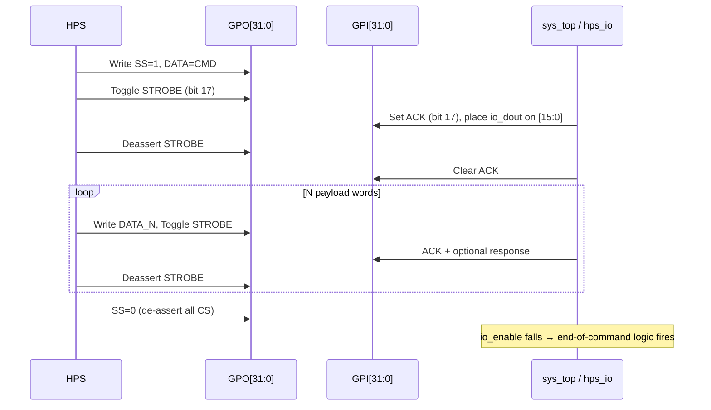

[← Framework](../README.md)

# SPI-over-GPO Protocol

MiSTer uses a **software-emulated SPI** implemented entirely through the GPO
register — no dedicated SPI peripheral is used.  This is sometimes called
"SSPI" (Software SPI) in the source.

Source: `Main_MiSTer/fpga_io.cpp`, `spi.cpp`, `spi.h`

---

## Signal Mapping onto GPO

| SPI concept | GPO bit | Name |
|---|---|---|
| MOSI (data out) | `[15:0]` | 16-bit parallel data |
| SCK (clock) | `[17]` | `SSPI_STROBE` — toggle = one transfer |
| MISO (data in) | GPI `[15:0]` | `io_dout` from FPGA |
| CS0 | `[18]` | `io_ss0` |
| CS1 | `[19]` | `io_ss1` |
| CS2 | `[20]` | `io_ss2` |

This is **not** a standard serial SPI; data is transferred **16 bits at a time**
by writing a word to GPO `[15:0]` and then toggling bit 17.

---

## Standard Transfer (`fpga_spi`)

```c
// fpga_io.cpp — synchronous (waits for ACK)
uint16_t fpga_spi(uint16_t word)
{
    uint32_t gpo = (fpga_gpo_read() & ~(0xFFFF | SSPI_STROBE)) | word;

    fpga_gpo_write(gpo);               // set data
    fpga_gpo_write(gpo | SSPI_STROBE); // assert strobe

    // Wait for FPGA to acknowledge (GPI[17] = io_ack mirrors strobe)
    int gpi;
    do { gpi = fpga_gpi_read(); } while (!(gpi & SSPI_ACK));

    fpga_gpo_write(gpo);               // deassert strobe

    do { gpi = fpga_gpi_read(); } while (gpi & SSPI_ACK);

    return (uint16_t)gpi;  // lower 16 bits = FPGA response
}
```

Timing:
```
GPO[15:0]:  ═══WORD═══════════════
GPO[17]:    ___╔═════╗____________
GPI[17]:    ________╔═════╗_______   (1-2 clk_sys cycles later)
GPI[15:0]:  ════════════RESP═══════
```

---

## Fast (Fire-and-Forget) Transfer (`fpga_spi_fast`)

Used during bulk data streaming where back-pressure is not needed:

```c
uint16_t fpga_spi_fast(uint16_t word)
{
    uint32_t gpo = (fpga_gpo_read() & ~(0xFFFF | SSPI_STROBE)) | word;
    fpga_gpo_write(gpo);
    fpga_gpo_write(gpo | SSPI_STROBE);
    fpga_gpo_write(gpo);               // deassert immediately — no wait
    return (uint16_t)fpga_gpi_read();
}
```

Block variants (`fpga_spi_fast_block_write`, `fpga_spi_fast_block_read`) are
manually unrolled 16× for maximum throughput — the compiler cannot auto-vectorise
register I/O.

---

## Chip Select Wrapper Functions

`spi.cpp` wraps the raw register access with named chip-select functions:

```c
// spi.cpp
#define SSPI_CS_FPGA  (1<<18)   // io_ss0
#define SSPI_CS_OSD   (1<<19)   // io_ss1
#define SSPI_CS_IO    (1<<20)   // io_ss2  (maps to io_uio in sys_top)

void EnableFpga()  { fpga_spi_en(SSPI_CS_FPGA, 1); }
void DisableFpga() { fpga_spi_en(SSPI_CS_FPGA, 0); }
void EnableOsd()   { fpga_spi_en(SSPI_CS_OSD,  1); }
void DisableOsd()  { fpga_spi_en(SSPI_CS_OSD,  0); }
void EnableIO()    { fpga_spi_en(SSPI_CS_IO,   1); }
void DisableIO()   { fpga_spi_en(SSPI_CS_IO,   0); }
```

A typical UIO command sequence:

```c
// user_io.cpp / spi.cpp pattern
uint16_t spi_uio_cmd_cont(uint16_t cmd)
{
    EnableIO();            // assert io_ss2
    return fpga_spi(cmd);  // send command opcode, get first response
}

uint16_t spi_uio_cmd(uint16_t cmd)
{
    uint16_t r = spi_uio_cmd_cont(cmd);
    DisableIO();           // de-assert → triggers FPGA state commit
    return r;
}
```

---

## Transaction Flow Diagram



---

## Performance Notes

- Each `fpga_spi()` call involves ~4 memory-mapped register writes and
  a busy-wait loop — typical latency is a few hundred nanoseconds on the
  1GHz ARM.
- Block transfers are rate-limited by the ARM's ability to write to
  uncached I/O space.  The manual 16× unroll in `fpga_spi_fast_block_*`
  achieves approximately 100–150 MB/s for ROM loading.
- The `ioctl_wait` back-pressure signal (HPS_BUS[37]) prevents FPGA
  buffer overflow during download streaming.
