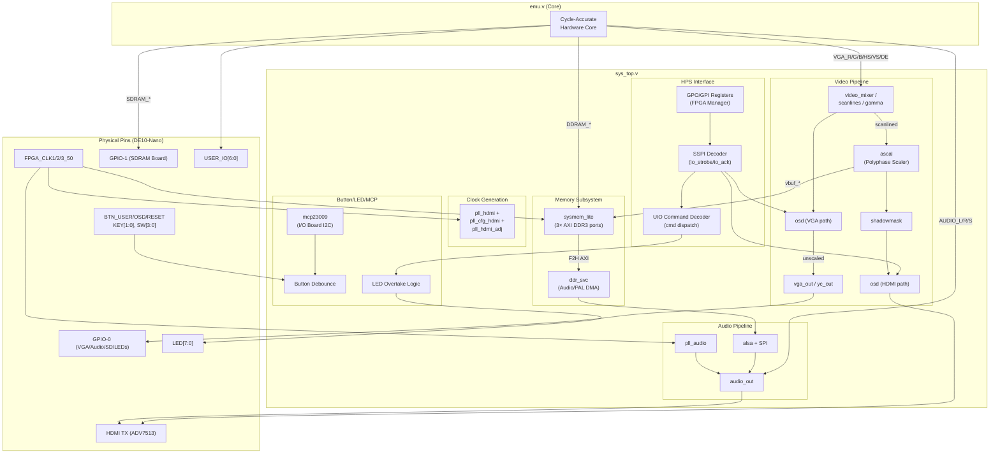
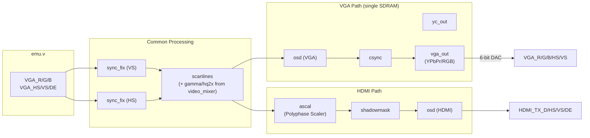
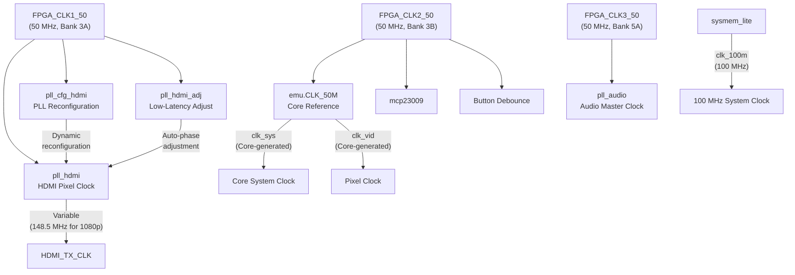
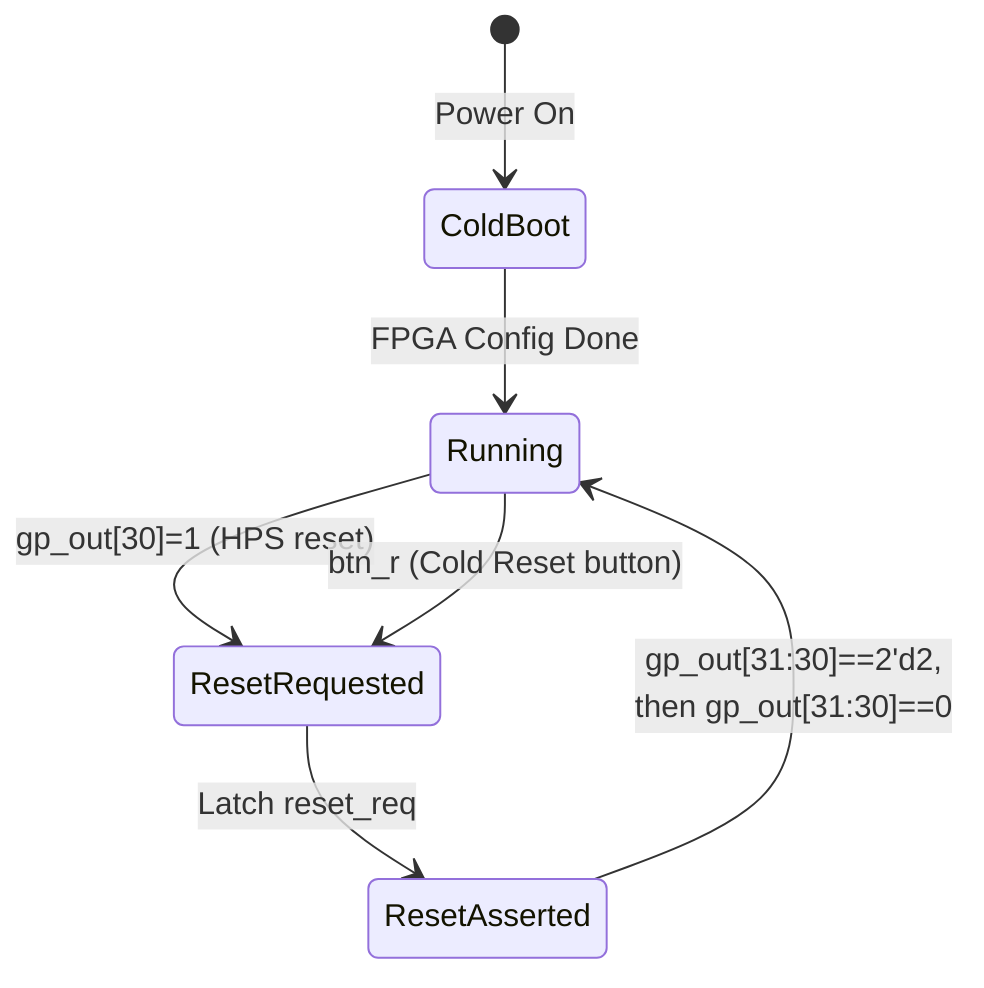

[← FPGA Subsystem](README.md) · [↑ Knowledge Base](../README.md)

# `sys_top.v` — The Top-Level Hardware Abstraction

`sys_top.v` is the **root synthesis entity** of every MiSTer core — the single Verilog module that maps logic to the physical pins of the Cyclone V SoC on the DE10-Nano. It instantiates the entire framework (video scaler, audio pipeline, memory controllers, OSD, HPS communication) and wraps the emulation core (`emu.v`) in a standardized shell, presenting it with abstracted I/O signals that are completely board-agnostic.

This article is the definitive reference for every signal, submodule, conditional compilation path, and data flow within `sys_top.v`. If you need to understand *why* a particular video path, clock domain, or reset sequence exists, start here.

Sources:
* [`Template_MiSTer/sys/sys_top.v`](https://github.com/MiSTer-devel/Template_MiSTer/blob/master/sys/sys_top.v) — 2150 lines, (c)2017-2020 Alexey Melnikov
* [`Template_MiSTer/sys/hps_io.sv`](https://github.com/MiSTer-devel/Template_MiSTer/blob/master/sys/hps_io.sv)
* [`Main_MiSTer/fpga_io.cpp`](https://github.com/MiSTer-devel/Main_MiSTer/blob/master/fpga_io.cpp)

---

## Table of Contents

1. [Architectural Role](#1-architectural-role)
2. [Master Block Diagram](#2-master-block-diagram)
3. [Port Reference — Physical Pins](#3-port-reference--physical-pins)
4. [Conditional Compilation (`ifdef` Map)](#4-conditional-compilation-ifdef-map)
5. [Submodule Instantiation Map](#5-submodule-instantiation-map)
6. [The `emu.v` Interface Contract](#6-the-emuv-interface-contract)
7. [HPS Communication — SSPI & GPO/GPI](#7-hps-communication--sspi--gpogpi)
8. [UIO System Command Decoder](#8-uio-system-command-decoder)
9. [Video Pipeline](#9-video-pipeline)
10. [Audio Pipeline](#10-audio-pipeline)
11. [Memory Architecture](#11-memory-architecture)
12. [Clock Architecture](#12-clock-architecture)
13. [Reset Architecture](#13-reset-architecture)
14. [LED & Button Handling](#14-led--button-handling)
15. [SD Card Routing](#15-sd-card-routing)
16. [USER_IO Pin Routing](#16-user_io-pin-routing)
17. [Helper Modules: `sync_fix` and `csync`](#17-helper-modules-sync_fix-and-csync)
18. [Platform Context](#18-platform-context)

---

## 1. Architectural Role

`sys_top.v` serves three fundamental purposes:

| Role | Description |
|---|---|
| **Pin Binding** | Maps every logical signal to the physical Cyclone V pins (via Quartus assignment files). No other module touches physical I/O. |
| **Framework Composition** | Instantiates and wires together all `sys/` framework modules: `ascal`, `video_mixer`, `osd`, `audio_out`, `sdram`, `ddr_svc`, `sysmem_lite`, PLLs, etc. |
| **Core Isolation** | Presents the emulation core (`emu.v`) with a clean, abstracted interface (`HPS_BUS`, `VGA_*`, `AUDIO_*`, `DDRAM_*`, `SDRAM_*`) that hides all platform-specific complexity. |

The core developer never modifies `sys_top.v` — it is inherited from the `Template_MiSTer` repository and shared across all cores. Customization happens exclusively through `emu.v` and conditional compilation flags set in the Quartus project.

---

## 2. Master Block Diagram



---

## 3. Port Reference — Physical Pins

`sys_top.v` declares all physical I/O as a top-level port list. The pins are grouped by function:

### 3.1 Clock Inputs

| Port | Pin | Description |
|---|---|---|
| `FPGA_CLK1_50` | H13 (bank 3A) | Primary 50 MHz oscillator — drives `pll_hdmi`, `pll_cfg_hdmi`, and `pll_hdmi_adj` |
| `FPGA_CLK2_50` | N14 (bank 3B) | 50 MHz — drives `mcp23009`, button debounce, and `emu.CLK_50M` |
| `FPGA_CLK3_50` | V15 (bank 5A) | 50 MHz — drives `pll_audio` |

> [!NOTE]
> The three oscillators are on different I/O banks with independent power supplies. `FPGA_CLK2_50` is the core's reference clock because it is on the same bank as the GPIO headers, minimizing clock-to-pin skew.

### 3.2 HDMI Output (ADV7513)

| Port | Direction | Width | Description |
|---|---|---|---|
| `HDMI_I2C_SCL` | output | 1 | I2C clock to ADV7513 (driven by HPS I2C peripheral) |
| `HDMI_I2C_SDA` | inout | 1 | I2C data to ADV7513 |
| `HDMI_MCLK` | output | 1 | Audio master clock (`clk_audio` from `pll_audio`) |
| `HDMI_SCLK` | output | 1 | I2S bit clock (BCLK) |
| `HDMI_LRCLK` | output | 1 | I2S left/right select (LRCLK) |
| `HDMI_I2S` | output | 1 | I2S serial data |
| `HDMI_TX_CLK` | output | 1 | Pixel clock (DDR via `altddio_out`) |
| `HDMI_TX_DE` | output | 1 | Data enable |
| `HDMI_TX_D` | output | 24 | RGB pixel data [23:16]=R, [15:8]=G, [7:0]=B |
| `HDMI_TX_HS` | output | 1 | Horizontal sync |
| `HDMI_TX_VS` | output | 1 | Vertical sync |
| `HDMI_TX_INT` | input | 1 | ADV7513 interrupt (unused in framework) |

### 3.3 SDRAM (GPIO-1)

| Port | Direction | Width | Description |
|---|---|---|---|
| `SDRAM_A` | output | 13 | Address bus |
| `SDRAM_DQ` | inout | 16 | Data bus |
| `SDRAM_DQML` | output | 1 | Lower byte mask |
| `SDRAM_DQMH` | output | 1 | Upper byte mask |
| `SDRAM_nWE` | output | 1 | Write enable (active low) |
| `SDRAM_nCAS` | output | 1 | Column address strobe (active low) |
| `SDRAM_nRAS` | output | 1 | Row address strobe (active low) |
| `SDRAM_nCS` | output | 1 | Chip select (active low) |
| `SDRAM_BA` | output | 2 | Bank address |
| `SDRAM_CLK` | output | 1 | SDRAM clock (phase-shifted from `clk_sys`) |
| `SDRAM_CKE` | output | 1 | Clock enable |

When `MISTER_DUAL_SDRAM` is defined, a second SDRAM port group replaces the VGA/Audio/SD/LED pins:

| Port | Direction | Width | Description |
|---|---|---|---|
| `SDRAM2_A` | output | 13 | Second SDRAM address |
| `SDRAM2_DQ` | inout | 16 | Second SDRAM data |
| `SDRAM2_nWE/nCAS/nRAS/nCS` | output | 1 each | Second SDRAM controls |
| `SDRAM2_BA` | output | 2 | Second SDRAM bank address |
| `SDRAM2_CLK` | output | 1 | Second SDRAM clock |

### 3.4 VGA / Analog Audio / SD / LEDs (GPIO-0, single-SDRAM only)

These pins are **mutually exclusive** with the second SDRAM port. When `MISTER_DUAL_SDRAM` is defined, they are removed from the port list entirely.

| Port | Direction | Width | Description |
|---|---|---|---|
| `VGA_R/G/B` | output | 6 each | 6-bit RGB DAC output via resistor ladder |
| `VGA_HS` | inout | 1 | Horizontal sync (open-drain capable) |
| `VGA_VS` | output | 1 | Vertical sync |
| `VGA_EN` | input | 1 | I/O board detect (active low — pulled low when board present) |
| `AUDIO_L/R` | output | 1 each | Sigma-delta DAC output (1-bit) |
| `AUDIO_SPDIF` | output | 1 | S/PDIF digital output |
| `SDIO_DAT/CMD/CLK` | inout/output | 4/1/1 | SD card via SDIO (shared with VGA when Direct Video active) |
| `LED_USER/HDD/POWER` | output | 1 each | I/O board LEDs |
| `BTN_USER/OSD/RESET` | input | 1 each | I/O board pushbuttons |

### 3.5 Shared I/O

| Port | Direction | Width | Description |
|---|---|---|---|
| `SD_SPI_CS/MISO/CLK/MOSI` | output/input/output/output | 1 each | Secondary SD card via SPI (shared with `SDIO_*` pins) |
| `SDCD_SPDIF` | inout | 1 | SD card detect / S/PDIF output (time-multiplexed) |
| `IO_SCL/SDA` | output/inout | 1 each | I2C to MCP23009 on I/O board |
| `ADC_SCK/SDO/SDI/CONVST` | output/input/output/output | 1 each | LTC2308 ADC (analog joystick) |

### 3.6 DE10-Nano Board I/O

| Port | Direction | Width | Description |
|---|---|---|---|
| `KEY[1:0]` | input | 2 | DE10-Nano pushbuttons (Key 0 = OSD, Key 1 = User) |
| `SW[3:0]` | input | 4 | DIP switches |
| `LED[7:0]` | output | 8 | DE10-Nano on-board LEDs |
| `USER_IO[6:0]` | inout | 7 | USB 3.0 connector (SNAC / Direct Video audio) |

---

## 4. Conditional Compilation (`ifdef` Map)

`sys_top.v` uses Verilog `` `ifdef `` directives to support multiple hardware configurations. These flags are set in the Quartus project (`.qsf` file) or passed via the `+define+` command-line option.

| Define | Effect | Used By |
|---|---|---|
| `MISTER_DUAL_SDRAM` | Replaces VGA/Audio/SD/LED ports with second SDRAM port group; enables `SDRAM2_*` signals to `emu.v`; disables analog output | Board configuration |
| `MISTER_DEBUG_NOHDMI` | Removes all HDMI scaler, `ascal`, `shadowmask`, `pll_hdmi*` logic; Direct Video forced on; `vga_fb` = 0; `direct_video` = 1 | Debug builds |
| `MISTER_FB` | Enables framebuffer read-back from core (`fb_en`, `fb_fmt`, `fb_width`, `fb_height`, `fb_base`, `fb_stride`, `fb_vbl`, `fb_force_blank`) | Cores with HPS-readable framebuffer (e.g. PSX, ao486) |
| `MISTER_FB_PALETTE` | Adds palette LUT between framebuffer and scaler (`fb_pal_*` signals) | 8-bit paletted framebuffer modes |
| `MISTER_DISABLE_ALSA` | Removes `alsa.sv` and its DDR3 DMA channel from `ddr_svc` | Minimal builds |
| `MISTER_DISABLE_ADAPTIVE` | Disables adaptive filter in `ascal` | Performance optimization |
| `MISTER_DOWNSCALE_NN` | Enables nearest-neighbor downscaling in `ascal` | Pixel-art preservation |
| `MISTER_DISABLE_YC` | Removes `yc_out` composite/S-Video encoder | Minimal builds |
| `MISTER_SMALL_VBUF` | Reduces video framebuffer from 8 MB to 2 MB in DDR3 | Memory-constrained builds |
| `MENU_CORE` | Increases `ascal` burst size to 2048 for the menu core | `Menu_MiSTer` only |

### Configuration Matrix

| Configuration | DUAL_SDRAM | FB | NOHDMI |
|---|---|---|---|
| **Standard** (IO board + SDRAM) | ✗ | ✗ | ✗ |
| **Dual SDRAM** (no analog output) | ✓ | ✗ | ✗ |
| **PSX** (framebuffer + analog) | ✗ | ✓ | ✗ |
| **ao486** (framebuffer + dual SDRAM) | ✓ | ✓ | ✗ |
| **Debug** (Direct Video only) | ✗ | ✗ | ✓ |

---

## 5. Submodule Instantiation Map

The following table lists every module instantiated within `sys_top.v`, in order of appearance in the source, along with its function and cross-reference.

| Module | Instance | Lines (approx.) | Function | Cross-Reference |
|---|---|---|---|---|
| `mcp23009` | `mcp23009` | L163–175 | I2C I/O expander on I/O board (buttons, LEDs, SD detect, board presence) | — |
| `cyclonev_hps_interface_mpu_general_purpose` | `h2f_gp` | L281–285 | HPS FPGA Manager GPO/GPI register bridge | [HPS Bridge Reference](hps_bridge_reference.md) |
| `cyclonev_hps_interface_peripheral_uart` | `uart` | L548–559 | HPS UART peripheral (serial console) | — |
| `cyclonev_hps_interface_interrupts` | `interrupts` | L566–569 | F2H interrupt line (video sync) | — |
| `sysmem_lite` | `sysmem` | L596–678 | DDR3 memory controller wrapper (3 AXI ports) | [Memory Controllers](memory_controllers.md) |
| `ddr_svc` | `ddr_svc` | L691–719 | DDR3 service multiplexer (ALSA audio DMA + PAL DMA) | — |
| `ascal` | `ascal` | L742–858 | Polyphase video scaler (VHDL) | [ASCAL Deep Dive](../09_video_audio/ascal_deep_dive.md) |
| `pll_hdmi_adj` | `pll_hdmi_adj` | L1027–1043 | Low-latency HDMI PLL auto-adjustment | — |
| `pll_hdmi` | `pll_hdmi` | L1070–1077 | HDMI pixel clock PLL | [Clock Architecture](#12-clock-architecture) |
| `pll_cfg_hdmi` | `pll_cfg_hdmi` | L1102–1112 | HDMI PLL reconfiguration (dynamic frequency switching) | — |
| `shadowmask` | `HDMI_shadowmask` | L1187–1206 | CRT shadow mask / scanline overlay for HDMI | — |
| `osd` | `hdmi_osd` | L1211–1229 | OSD overlay blender (HDMI path) | [OSD](../05_configuration/osd.md) |
| `osd` | `vga_osd` | L1431–1450 | OSD overlay blender (VGA path) | [OSD](../05_configuration/osd.md) |
| `csync` | `csync_hdmi` | L1232 | Composite sync generator (HDMI) | [Helper Modules](#18-helper-modules-sync_fix-and-csync) |
| `csync` | `csync_vga` | L1453 | Composite sync generator (VGA) | [Helper Modules](#18-helper-modules-sync_fix-and-csync) |
| `scanlines` | `VGA_scanlines` | L1411–1427 | Scanline filter | — |
| `yc_out` | `yc_out` | L1463–1480 | Composite / S-Video encoder | — |
| `vga_out` | `vga_scaler_out` | L1501–1515 | YPbPr / RGB conversion (scaled HDMI → VGA output) | — |
| `vga_out` | `vga_out` | L1522–1536 | YPbPr / RGB conversion (native VGA output) | — |
| `pll_audio` | `pll_audio` | L1600–1605 | Audio clock PLL (24.576 MHz / 22.579 MHz) | — |
| `audio_out` | `audio_out` | L1608–1643 | Audio pipeline (IIR filter, I2S, SPDIF, sigma-delta DAC) | [Audio Pipeline](../09_video_audio/audio_pipeline_deep_dive.md) |
| `alsa` | `alsa` | L1666–1683 | ALSA audio DMA via SPI to HPS | — |
| `cyclonev_hps_interface_peripheral_spi_master` | `spi` | L1648–1656 | HPS SPI master (ALSA) | — |
| `cyclonev_hps_interface_peripheral_i2c` | `hdmi_i2c` | L1161–1167 | HPS I2C master (ADV7513) | — |
| `sync_fix` | `sync_v`, `sync_h` | L1734–1735 | Sync polarity normalizer | [Helper Modules](#18-helper-modules-sync_fix-and-csync) |
| `sys_umuldiv` | `ar_muldiv` | L908–918 | 12×12÷12 unsigned multiply-divide for aspect ratio computation | — |
| `emu` | `emu` | L1787–1950 | **The emulation core** — instantiated last, consumes all abstracted signals | — |

---

## 6. The `emu.v` Interface Contract

The core (`emu.v`) is instantiated at line 1787 with a comprehensive port list. The following table documents every signal group, its direction, and the framework signal it maps to.

### 6.1 Core Clock & Reset

| Port | Direction | Source | Description |
|---|---|---|---|
| `CLK_50M` | input | `FPGA_CLK2_50` | Reference clock for core's internal PLL |
| `RESET` | input | `reset` (from `sysmem_lite`) | Active-high system reset |
| `CLK_VIDEO` | output | → `clk_vid` | Core-generated pixel clock |
| `CE_PIXEL` | output | → `ce_pix` | Pixel clock enable (for non-1:1 clock/pixel ratios) |

### 6.2 HPS_BUS — The 49-Bit Control Vector

The core's primary communication channel. `HPS_BUS` is constructed by concatenating framework signals:

```verilog
// sys_top.v L1791-1794
.HPS_BUS({fb_en, sl, f1, HDMI_TX_VS, 
             clk_100m, clk_ihdmi,
             ce_hpix, hde_emu, hhs_fix, hvs_fix, 
             io_wait, clk_sys, io_fpga, io_uio, io_strobe, io_wide, io_din, io_dout})
```

| Bits | Signal | Direction | Description |
|---|---|---|---|
| `[48]` | `fb_en` | in | Framebuffer enable (from ascal) |
| `[47:46]` | `sl[1:0]` | in | Scanline config (derived from core + FB override) |
| `[45]` | `f1` | in | Field flag (interlaced video) |
| `[44]` | `HDMI_TX_VS` | in | HDMI vertical sync (looped back from output) |
| `[43]` | `clk_100m` | in | 100 MHz system clock |
| `[42]` | `clk_ihdmi` | in | HDMI input clock (= `clk_vid`) |
| `[41]` | `ce_hpix` | in | HDMI pixel clock enable |
| `[40]` | `hde_emu` | in | HDMI data enable |
| `[39:38]` | `hhs_fix`, `hvs_fix` | in | HDMI H/V sync (corrected polarity) |
| `[37]` | `io_wait` | out | Back-pressure to HPS (FPGA stalls bulk transfer) |
| `[36]` | `clk_sys` | out | Core system clock (for HPS timing sync) |
| `[35]` | `io_fpga` | in | Core channel chip select |
| `[34]` | `io_uio` | in | UIO system channel chip select |
| `[33]` | `io_strobe` | in | SSPI strobe |
| `[32]` | `io_wide` | out | 16-bit file I/O mode flag |
| `[31:16]` | `io_din` | in | Incoming 16-bit data from HPS |
| `[15:0]` | `io_dout` | out | Outgoing 16-bit data to HPS |

> [!NOTE]
> The `HPS_BUS` convention groups all signals into one vector so the core receives a single port rather than dozens of individual wires. This simplifies core development — the core just passes `HPS_BUS` to `hps_io.sv`, which decodes it internally. See [HPS Bridge Reference](hps_bridge_reference.md) for the bridge-level view.

### 6.3 Video Output

| Port | Direction | Width | Description |
|---|---|---|---|
| `VGA_R/G/B` | output | 8 each | RGB pixel data (native, unscaled) |
| `VGA_HS/VS` | output | 1 each | H/V sync (polarity per core standard) |
| `VGA_DE` | output | 1 | Data enable |
| `VGA_F1` | output | 1 | Interlace field flag |
| `VGA_SCALER` | output | 1 | Force scaler path even at 31 kHz |
| `VIDEO_ARX/ARY` | output | 13 each | Aspect ratio numerator/denominator |

### 6.4 HDMI Feedback

| Port | Direction | Width | Description |
|---|---|---|---|
| `HDMI_WIDTH/HEIGHT` | input | 12 each | Current HDMI output resolution |
| `HDMI_FREEZE` | output | 1 | Freeze scaler (for save states) |
| `HDMI_BLACKOUT` | output | 1 | Force black output during mode switch |
| `HDMI_BOB_DEINT` | output | 1 | Enable bob deinterlacing |

### 6.5 Framebuffer (`MISTER_FB` only)

| Port | Direction | Width | Description |
|---|---|---|---|
| `FB_EN` | output | 1 | Framebuffer data available |
| `FB_FORMAT` | output | 5 | Pixel format |
| `FB_WIDTH/HEIGHT` | output | 12 each | Framebuffer dimensions |
| `FB_BASE` | output | 32 | DDR3 base address |
| `FB_STRIDE` | output | 14 | Bytes per line |
| `FB_VBL` | input | 1 | Vertical blank (from scaler) |
| `FB_LL` | input | 1 | Low-latency mode active |
| `FB_FORCE_BLANK` | output | 1 | Force output black (for mode switches) |

### 6.6 Audio

| Port | Direction | Width | Description |
|---|---|---|---|
| `CLK_AUDIO` | input | 1 | Audio clock (from `pll_audio`) |
| `AUDIO_L/R` | output | 16 each | Signed PCM audio samples |
| `AUDIO_S` | output | 1 | 1 = signed, 0 = unsigned |
| `AUDIO_MIX` | output | 2 | Audio mixing mode |

### 6.7 DDR3 (via F2H)

| Port | Direction | Width | Description |
|---|---|---|---|
| `DDRAM_CLK` | input | 1 | DDR3 clock domain |
| `DDRAM_ADDR` | output | 29 | DDR3 address |
| `DDRAM_BURSTCNT` | output | 8 | Burst count |
| `DDRAM_BUSY` | input | 1 | Wait request |
| `DDRAM_DOUT` | input | 64 | Read data |
| `DDRAM_DOUT_READY` | input | 1 | Read data valid |
| `DDRAM_RD` | output | 1 | Read request |
| `DDRAM_DIN` | output | 64 | Write data |
| `DDRAM_BE` | output | 8 | Byte enable |
| `DDRAM_WE` | output | 1 | Write request |

### 6.8 SDRAM

| Port | Direction | Width | Description |
|---|---|---|---|
| `SDRAM_DQ/A/DQML/DQMH/BA/nCS/nWE/nRAS/nCAS/CLK/CKE` | inout/out | varies | Direct connection to SDRAM pins (GPIO-1) |
| `SDRAM2_*` | varies | varies | Second SDRAM port (dual-SDRAM builds only) |

### 6.9 Peripherals

| Port | Direction | Width | Description |
|---|---|---|---|
| `BUTTONS` | input | 2 | Button state from framework |
| `OSD_STATUS` | input | 1 | OSD active flag |
| `SD_SCK/MOSI/MISO/CS/CD` | output/inout/input | 1 each | SD card interface |
| `UART_*` | inout | 1 each | Serial port |
| `ADC_BUS` | inout | 4 | ADC SPI bus |
| `USER_OUT/USER_IN` | inout | 7 each | User I/O pins (SNAC) |

---

## 7. HPS Communication — SSPI & GPO/GPI

The HPS communication path in `sys_top.v` consists of three layers:

### 7.1 GPO/GPI Register Bridge

```verilog
// sys_top.v L281-285
cyclonev_hps_interface_mpu_general_purpose h2f_gp
(
    .gp_in({~gp_out[31] ? core_magic : gp_in}),
    .gp_out(gp_out)
);
```

The `h2f_gp` primitive connects the HPS FPGA Manager's 32-bit GPO/GPI registers to the FPGA fabric. When `gp_out[31]` (`ID_MODE`) is low, the FPGA returns `core_magic` on `gp_in` — a 32-bit value that `Main_MiSTer` uses to verify the core is loaded and compatible:

```verilog
// sys_top.v L273-279
`ifdef MISTER_DUAL_SDRAM
    wire [7:0] core_type = 'hA8;  // dual SDRAM
`else
    wire [7:0] core_type = 'hA4;  // single SDRAM
`endif
wire [31:0] core_magic = {24'h5CA623, core_type};
```

The magic prefix `0x5CA623` is a fixed constant. The lower byte identifies the board configuration:
- `0xA4` = single SDRAM (standard DE10-Nano + IO board)
- `0xA8` = dual SDRAM

### 7.2 GPI Assembly

The `gp_in` vector is assembled at line 234:

```verilog
// sys_top.v L234
wire [31:0] gp_in = {1'b0, btn_user | btn[1], btn_osd | btn[0], io_dig, 8'd0, io_ver, io_ack, io_wide, io_dout | io_dout_sys};
```

| Bits | Signal | Description |
|---|---|---|
| `[31]` | `1'b0` | FPGA initialized flag (0 = ready; HPS reads 1 when FPGA not in user mode) |
| `[30]` | `btn_user \| btn[1]` | User button press (physical or from core) |
| `[29]` | `btn_osd \| btn[0]` | OSD button press (physical or from core) |
| `[28]` | `io_dig` | Digital I/O mode (MCP23009 or SW[3]) |
| `[27:20]` | `8'd0` | Reserved |
| `[19:18]` | `io_ver` | I/O protocol version (hardcoded to 1) |
| `[17]` | `io_ack` | SSPI acknowledgment strobe |
| `[16]` | `io_wide` | 16-bit file I/O mode flag |
| `[15:0]` | `io_dout \| io_dout_sys` | Data returned to HPS (OR of core data and system command responses) |

### 7.3 SSPI Strobe Logic

The SSPI acknowledgment is generated at lines 254–263:

```verilog
// sys_top.v L254-263
reg io_ack;
reg rack;
wire io_strobe = ~rack & io_clk;

always @(posedge clk_sys) begin
    if(~(io_wait | vs_wait) | io_strobe) begin
        rack <= io_clk;
        io_ack <= rack;
    end
end
```

The `rack` register tracks the SSPI clock (`io_clk` = `gp_out[17]`). `io_strobe` pulses for one `clk_sys` cycle on each rising edge of the SSPI clock. The `io_ack` signal mirrors `rack` with one cycle of delay, providing the acknowledgment that `Main_MiSTer` polls via `GPI[17]`.

When `io_wait` (core back-pressure) or `vs_wait` (vertical sync wait) is asserted, the strobe logic freezes — it will not acknowledge new data until the stall condition clears. This implements flow control for the SSPI protocol.

### 7.4 GPO Synchronization

```verilog
// sys_top.v L265-270
reg [31:0] gp_outr;
always @(posedge clk_sys) begin
    reg [31:0] gp_outd;
    gp_outr <= gp_outd;
    gp_outd <= gp_out;
end
```

The GPO register is double-flopped from the `clk_sys` domain to prevent metastability. The command decoder reads `gp_outr` (two-cycle delayed), while the SSPI strobe logic uses the raw `gp_out[17]` for minimal latency.

---

## 8. UIO System Command Decoder

When `io_uio` is asserted (UIO system channel selected by `io_ss1=0, io_ss2=1`), `sys_top.v` decodes a rich command set that configures the framework's scaler, audio filter, video timing, LEDs, and more. This is the control plane that `Main_MiSTer` uses to apply MiSTer.ini settings and OSD interactions to the FPGA hardware.

The command decoder spans lines 353–537 and processes the SSPI data stream sequentially:

1. **First word**: Command opcode (`io_din[7:0]`)
2. **Subsequent words**: Payload, indexed by a `cnt` counter that increments with each `io_strobe`

### 8.1 Command Reference

| Opcode | Name | Payload Words | Description |
|---|---|---|---|
| `0x01` | `CFG` | 1 | Framework configuration word |
| `0x20` | `VID_SET` | 8–10 | Video timing: WIDTH, HFP, HS, HBP, HEIGHT, VFP, VS, VBP + optional custom PLL params |
| `0x25` | `LED_SET` | 1 | LED overtake: `{led_overtake[7:0], led_state[7:0]}` |
| `0x26` | `VOL_SET` | 1 | Volume attenuation: `vol_att[4:0]` |
| `0x27` | `VSET` | 1 | Vertical crop: `VSET[11:0]` |
| `0x2A` | `COEF_SET` | ≥2 | Scaler polyphase coefficient write: address then data pairs |
| `0x2B` | `FLT_SET` | 1 | Scaler filter mode: `scaler_flt[2:0]` |
| `0x2F` | `LFB_SET` | 10 | Linear framebuffer config: enable, format, base, width, height, hmin/max, vmin/max, stride |
| `0x30` | `VS_WAIT` | 0 | Begin VSync wait (stall SSPI until next vsync) |
| `0x37` | `HSET` | 1 | Horizontal crop + freescale: `{FREESCALE, HSET[11:0]}` |
| `0x38` | `VS_LINE` | 1 | VSync wait line: `vs_line[11:0]` |
| `0x39` | `AFLT_SET` | 15 | Audio IIR filter coefficients: rate, cx[39:0], cx0/1/2, cy0/1/2 |
| `0x3A` | `ARC_SET` | 4 | Aspect ratio presets: arc1x/y, arc2x/y |
| `0x3E` | `SHADOWMASK` | 1 | Shadowmask pixel data (streamed) |
| `0x40` | `FB_QUERY` | 8 | Read back framebuffer parameters |
| `0x41` | `YC_SET` | ≥6 | YC encoder config: PAL/NTSC, CVBS, subcarrier phase increment |
| `0x42` | `FRAME_CNT` | 1 | Read frame counter |

### 8.2 CFG Word (Command `0x01`) Bit Layout

| Bit | Name | Description |
|---|---|---|
| `[2]` | `vga_scaler` | Force VGA output through HDMI scaler path |
| `[3]` | `csync_en` | Enable composite sync on VGA output |
| `[4]` | `forced_scandoubler` | Force scandoubler on for 15 kHz VGA |
| `[5]` | `ypbpr_en` | YPbPr component output on VGA |
| `[6]` | `audio_96k` | 96 kHz audio sample rate (vs 48 kHz default) |
| `[9]` | `sog` | Sync-on-green enable |
| `[10]` | `direct_video` | Direct Video mode (bypass HDMI scaler) |
| `[12]` | `vga_fb` | VGA output uses framebuffer (forced scaler path) |

### 8.3 VID_SET (Command `0x20`) — Video Timing Programming

This is the most complex command. It programs the HDMI output timing in 8 words, with 2 optional words for custom PLL parameters:

| Word | Field | Description |
|---|---|---|
| 0 | `{HDMI_PR, vrr_mode, WIDTH[11:0]}` | Pixel repetition, VRR enable, horizontal active |
| 1 | `HFP[11:0]` | Horizontal front porch |
| 2 | `{HS[12], HS[11:0]}` | Horizontal sync width (bit 12 = polarity) |
| 3 | `HBP[11:0]` | Horizontal back porch |
| 4 | `HEIGHT[11:0]` | Vertical active |
| 5 | `VFP[11:0]` | Vertical front porch |
| 6 | `{VS[12], VS[11:0]}` | Vertical sync width (bit 12 = polarity) |
| 7 | `VBP[11:0]` | Vertical back porch |
| 8 | `{lowlat, cfg_done}` | Low-latency mode, configuration complete flag |

After `cfg_done` is set, the `pll_cfg_hdmi` module dynamically reconfigures the HDMI PLL to match the new timing. The `pll_hdmi_adj` module then auto-adjusts the PLL for low-latency synchronization.

### 8.4 VSync Wait (`0x30` / `0x38`)

The VS_WAIT mechanism synchronizes SSPI transactions to the video vertical blanking period:

```verilog
// sys_top.v L382, L536
if(io_din[7:0] == 'h30) vs_wait <= 1;
...
if(~vs_d2 & vs_d1) vs_wait <= 0;  // cleared on VSync rising edge
```

When `vs_wait` is set, the SSPI acknowledgment logic freezes (see §7.3), causing `Main_MiSTer` to block until the next VSync. This ensures that configuration changes (like video mode switches) take effect at frame boundaries, preventing mid-frame glitches.

---

## 9. Video Pipeline

The video pipeline in `sys_top.v` has two parallel paths — **VGA** (analog) and **HDMI** (digital) — that share a common origin in the core's video output.

### 9.1 Signal Flow



### 9.2 Core Video Signals

The core outputs native, unscaled video through these signals:
- `VGA_R[7:0]`, `VGA_G[7:0]`, `VGA_B[7:0]` — 8-bit per channel RGB
- `VGA_HS`, `VGA_VS` — Horizontal and vertical sync
- `VGA_DE` — Data enable (active during visible pixels)
- `VGA_F1` — Field flag for interlaced modes

### 9.3 Sync Correction

Two `sync_fix` instances (lines 1734–1735) normalize the sync polarity:

```verilog
sync_fix sync_v(clk_vid, vs_emu, vs_fix);
sync_fix sync_h(clk_vid, hs_emu, hs_fix);
```

The `sync_fix` module (defined at line 2082) measures the sync pulse duration and determines the correct polarity. This is necessary because different cores output sync with different polarities, but downstream modules (scaler, OSD) expect a consistent convention.

### 9.4 Scanline Processing

The `scanlines` module (line 1411) receives the core's video after sync correction and applies the configured scanline effect. It also passes the video through for the HDMI scaler input.

### 9.5 VGA Output Path

The VGA path is only available in single-SDRAM configurations. It routes through:
1. **OSD blend** (`vga_osd`) — overlays the MiSTer menu
2. **Composite sync** (`csync_vga`) — generates CSYNC if enabled
3. **YC encoder** (`yc_out`, if `MISTER_DISABLE_YC` is not set) — composite/S-Video encoding with PAL/NTSC subcarrier
4. **VGA output** (`vga_out`) — converts to YPbPr or RGB, scales to 6-bit for the resistor-ladder DAC

The VGA pins are tri-stated (`1'bZ`) when:
- The I/O board is not detected (`av_dis` = 1)
- The analog output is disabled (`VGA_DISABLE` = 1)

### 9.6 HDMI Output Path

The HDMI path is the primary video output:

1. **ASCAL** (lines 742–858) — Polyphase scaler that converts the core's native resolution to the target HDMI timing (typically 1080p60). Uses DDR3 as a framebuffer via the 128-bit `vbuf_*` AXI port.
2. **Shadowmask** (`HDMI_shadowmask`, lines 1187–1206) — Applies CRT shadow mask / scanline overlays to the scaled HDMI output.
3. **OSD blend** (`hdmi_osd`, lines 1211–1229) — Overlays the MiSTer menu on the scaled video.
4. **Clock mux** (`cyclonev_clkselect`, line 1292) — Selects between scaler output clock (`hdmi_clk_out`) and Direct Video clock (`clk_vid`).
5. **DDR clock output** (`altddio_out`, line 1302) — Generates the HDMI pixel clock as a DDR signal.

### 9.7 Direct Video Mode

When `direct_video` is set (CFG bit 10, or always-on with `MISTER_DEBUG_NOHDMI`), the HDMI output bypasses the scaler entirely:

```verilog
// sys_top.v L1345-1348
hs <= (~vga_fb & direct_video) ? hdmi_dv_hs   : ...;
vs <= (~vga_fb & direct_video) ? hdmi_dv_vs   : ...;
de <= (~vga_fb & direct_video) ? hdmi_dv_de   : ...;
d  <= (~vga_fb & direct_video) ? hdmi_dv_data : ...;
```

In Direct Video mode, the core's native video timing is passed directly to the HDMI transmitter, allowing the ADV7513 to output native 15 kHz signals for CRT monitors connected via HDMI-to-VGA adapters. See [Analog & Direct Video](../09_video_audio/analog_direct_video_architecture.md).

### 9.8 Aspect Ratio Computation

The aspect ratio logic (lines 920–1023) uses a `sys_umuldiv` hardware divider to compute the correct viewport within the HDMI output frame. The state machine cycles through:

1. Compute `wcalc = HEIGHT × ARX ÷ ARY` (height-scaled width)
2. Compute `hcalc = WIDTH × ARY ÷ ARX` (width-scaled height)
3. Fit the result within the HDMI output dimensions
4. Center the image by computing `hmin`, `hmax`, `vmin`, `vmax`

The `ARX` and `ARY` values come from the core's `VIDEO_ARX`/`VIDEO_ARY` outputs, or from the `ARC_SET` (0x3A) UIO command presets.

---

## 10. Audio Pipeline

The audio pipeline in `sys_top.v` consists of three major components:

### 10.1 PLL Audio

```verilog
// sys_top.v L1600-1605
pll_audio pll_audio
(
    .refclk(FPGA_CLK3_50),
    .rst(0),
    .outclk_0(clk_audio)
);
```

`pll_audio` generates the master audio clock from `FPGA_CLK3_50` (50 MHz). The output frequency depends on the build configuration but is typically 24.576 MHz (for 48 kHz sample rate) or can be switched to 22.579 MHz for 44.1 kHz.

### 10.2 Audio Output Processor

```verilog
// sys_top.v L1608-1643
audio_out audio_out
(
    .reset(reset | areset),
    .clk(clk_audio),
    .att(vol_att),          // volume attenuation from UIO cmd 0x26
    .mix(audio_mix),        // audio mixing mode from core
    .sample_rate(audio_96k),// 48k/96k from CFG bit [6]
    ...
    .core_l(audio_l),       // core's left channel
    .core_r(audio_r),       // core's right channel
    .alsa_l(alsa_l),        // ALSA left (from HPS)
    .alsa_r(alsa_r),        // ALSA right (from HPS)
    .i2s_bclk(HDMI_SCLK),  // I2S outputs to ADV7513
    .i2s_lrclk(HDMI_LRCLK),
    .i2s_data(HDMI_I2S),
    .dac_l(analog_l),       // sigma-delta DAC (analog)
    .dac_r(analog_r),
    .spdif(spdif)           // S/PDIF output
);
```

The `audio_out` module:
1. Mixes the core's PCM audio with ALSA audio from the HPS (for menu sounds)
2. Applies a configurable IIR filter (coefficients set by UIO command `0x39`)
3. Applies volume attenuation (`vol_att[4:0]` from UIO command `0x26`)
4. Outputs to three simultaneous paths: I2S (HDMI), sigma-delta DAC (analog), and S/PDIF

See [Audio Pipeline Deep Dive](../09_video_audio/audio_pipeline_deep_dive.md).

### 10.3 ALSA Audio

```verilog
// sys_top.v L1666-1683
alsa alsa
(
    .reset(reset),
    .clk(clk_audio),
    .ram_address(alsa_address),  // DDR3 read address
    .ram_data(alsa_readdata),    // DDR3 read data
    .ram_req(alsa_req),
    .ram_ready(alsa_ready),
    .spi_ss(aspi_ss),            // HPS SPI interface
    .spi_sck(aspi_sck),
    .spi_mosi(aspi_mosi),
    .spi_miso(aspi_miso),
    .pcm_l(alsa_l),              // decoded PCM output
    .pcm_r(alsa_r)
);
```

The ALSA module receives audio from the HPS Linux ALSA subsystem via the HPS SPI master peripheral. The HPS writes PCM samples to DDR3, and the FPGA's `alsa.sv` reads them out and presents them to `audio_out` for mixing. This path is used for menu sounds and any HPS-side audio processing.

### 10.4 Analog Audio Routing

In single-SDRAM configurations, the analog audio outputs are routed through the I/O board's DAC pins:

```verilog
// sys_top.v L1592-1594
assign AUDIO_SPDIF = av_dis ? 1'bZ : (SW[0] | mcp_en) ? HDMI_LRCLK : spdif;
assign AUDIO_R     = av_dis ? 1'bZ : (SW[0] | mcp_en) ? HDMI_I2S   : analog_r;
assign AUDIO_L     = av_dis ? 1'bZ : (SW[0] | mcp_en) ? HDMI_SCLK  : analog_l;
```

When SW[0] is on or the MCP23009 is present (digital mode), the analog pins carry the HDMI I2S signals instead — this allows the I/O board to re-route digital audio through its header. Otherwise, the sigma-delta DAC analog signals are output.

---

## 11. Memory Architecture

`sys_top.v` manages three DDR3 access paths through `sysmem_lite` and `ddr_svc`:

### 11.1 sysmem_lite — The DDR3 Controller Wrapper

```verilog
// sys_top.v L596-678
sysmem_lite sysmem
(
    .reset_core_req(reset_req),
    .reset_out(reset),
    .clock(clk_100m),
    .reset_hps_cold_req(btn_r),
    // Port 1: 64-bit DDR3 (core ddram)
    .ram1_clk(ram_clk), .ram1_address(ram_address), ...
    // Port 2: 64-bit DDR3 (ALSA + PAL)
    .ram2_clk(clk_audio), .ram2_address(ram2_address), ...
    // Port 3: 128-bit DDR3 (video framebuffer)
    .vbuf_clk(clk_100m), .vbuf_address(vbuf_address), ...
    // Optional signals omitted for brevity
);
```

`sysmem_lite` wraps the Cyclone V's hard memory controller and provides three independent AXI ports:

| Port | Width | Clock | Purpose |
|---|---|---|---|
| `ram1_*` | 64-bit | `ram_clk` (from core) | Core DDR3 access (ROM cache, CD-ROM ISO, HDD images) |
| `ram2_*` | 64-bit | `clk_audio` | ALSA audio DMA + PAL color lookup DMA |
| `vbuf_*` | 128-bit | `clk_100m` | Video framebuffer for `ascal` scaler |

Additionally, `sysmem_lite` generates the system reset (`reset_out`) and the 100 MHz clock (`clock`) from the DDR3 PLL.

### 11.2 ddr_svc — Audio and PAL DMA

```verilog
// sys_top.v L691-719
ddr_svc ddr_svc
(
    .clk(clk_audio),
    // Port 2 access to DDR3
    .ram_waitrequest(ram2_waitrequest), ...
    // Channel 0: ALSA audio DMA
    .ch0_addr(alsa_address), .ch0_data(alsa_readdata), ...
    // Channel 1: PAL color lookup DMA
    .ch1_addr(pal_addr), .ch1_data(pal_data), ...
);
```

`ddr_svc` multiplexes the second 64-bit DDR3 port between two DMA channels:
- **Channel 0**: ALSA audio sample fetch (1-burst reads, low latency)
- **Channel 1**: PAL color lookup table (128-burst reads, high throughput)

### 11.3 PAL DMA for Framebuffer Modes

When the core uses an 8-bit paletted framebuffer (`FB_FMT` = `0b011`), the PAL DMA pre-fetches the color lookup table from DDR3 each frame:

```verilog
// sys_top.v L1053-1064
always @(posedge clk_pal) begin
    pal_addr <= LFB_BASE[31:3] - 29'd512;  // PAL table just before framebuffer
    ...
    if(~old_vs2 & old_vs1 & ~FB_FMT[2] & FB_FMT[1] & FB_FMT[0] & FB_EN) pal_req <= ~pal_req;
end
```

The PAL table is stored in DDR3 immediately before the framebuffer base address (512 bytes prior), and is fetched at each VSync.

---

## 12. Clock Architecture



### 12.1 Fixed Clocks (Shell-Generated)

| Clock | Source | Frequency | Purpose |
|---|---|---|---|
| `clk_100m` | `sysmem_lite.clock` | 100 MHz | DDR3 controller, `vbuf_*` domain |
| `clk_audio` | `pll_audio.outclk_0` | ~24.576 MHz | Audio subsystem (I2S, ALSA, SPDIF) |
| `hdmi_clk_out` | `pll_hdmi.outclk_0` | Variable (148.5 MHz for 1080p) | HDMI pixel clock |

### 12.2 Dynamic Clocks (Core-Generated)

| Clock | Source | Description |
|---|---|---|
| `clk_sys` | Core's internal PLL | System clock for the emulation (e.g., 28.37516 MHz for Amiga) |
| `clk_vid` | Core's internal PLL | Pixel clock for video output |

The core is responsible for generating `clk_sys` and `clk_vid` from the `CLK_50M` reference. The framework uses these clocks for SSPI synchronization, SDRAM timing, and video pipeline clock domain crossings.

### 12.3 HDMI PLL Reconfiguration

The HDMI pixel clock must change dynamically when the user switches video modes (e.g., from 1080p to 720p). This is handled by the `pll_cfg_hdmi` module, which uses the Cyclone V's PLL reconfiguration feature:

1. `Main_MiSTer` sends a `VID_SET` (0x20) command with the new timing parameters
2. `sys_top.v` sets `cfg_set` and waits for VSync
3. On VSync, `cfg_got` triggers a PLL reconfiguration write via `pll_cfg_hdmi`
4. `pll_hdmi_adj` auto-adjusts the PLL phase for low-latency mode
5. Once the PLL locks, `cfg_ready` is asserted and normal output resumes

---

## 13. Reset Architecture

The reset system in `sys_top.v` has multiple sources and a careful sequencing mechanism:



### 13.1 Reset Sources

| Source | Signal | Description |
|---|---|---|
| HPS software reset | `gp_out[30]` | `Main_MiSTer` asserts this when switching cores or performing a soft reset |
| Cold reset button | `btn_r` | Physical reset button on I/O board or DE10-Nano |
| FPGA Manager | `sysmem_lite.reset_out` | System reset from DDR3 controller initialization |

### 13.2 Reset Sequencing

```verilog
// sys_top.v L573-589
reg reset_req = 0;
always @(posedge FPGA_CLK2_50) begin
    reg [1:0] resetd, resetd2;
    reg       old_reset;

    old_reset <= reset;
    if(~old_reset & reset) reset_req <= 1;  // latch on rising edge

    // special combination to set/clear the reset
    // preventing of accidental reset control
    if(resetd==1) reset_req <= 1;
    if(resetd==2 && resetd2==0) reset_req <= 0;

    resetd  <= gp_out[31:30];
    resetd2 <= resetd;
end
```

The reset request is **latching** — once asserted, it stays active until `Main_MiSTer` performs a specific unlock sequence:
1. Write `gp_out[31:30] = 2'd1` → latch reset
2. Write `gp_out[31:30] = 2'd2` → prepare to clear
3. Write `gp_out[31:30] = 2'd0` → clear reset (only if previous value was 2)

This two-step unlock prevents accidental reset clearing due to GPO bit glitches.

### 13.3 Button Timeout

```verilog
// sys_top.v L193-204
reg BTN_EN = 0;
reg [25:0] btn_timeout = 0;
always @(posedge FPGA_CLK2_50) begin
    btn_up <= BTN_RESET & BTN_OSD & BTN_USER;
    if(~reset & btn_up & ~&btn_timeout) btn_timeout <= btn_timeout + 1'd1;
    btn_en <= ~BTN_DIS;
    BTN_EN <= &btn_timeout & btn_en;
end
```

The physical buttons are disabled for ~0.67 seconds after reset (2^26 cycles at 50 MHz). This prevents spurious button presses during the core initialization period. The `BTN_DIS` signal additionally gates buttons when the VGA output is active on shared pins.

---

## 14. LED & Button Handling

### 14.1 MCP23009 I/O Expander

The I/O board includes an MCP23009 I2C I/O expander that provides:
- 3 pushbutton inputs (User, OSD, Reset)
- SD card detect
- Board presence detection
- Digital/analog mode flag
- LED control (bypasses FPGA when in digital mode)

```verilog
// sys_top.v L163-175
mcp23009 mcp23009
(
    .clk(FPGA_CLK2_50),
    .btn(mcp_btn),
    .led({led_p, led_d, led_u}),
    .flg_sd_cd(mcp_sdcd),
    .flg_present(mcp_en),
    .flg_mode(mcp_mode),
    .scl(IO_SCL),
    .sda(IO_SDA)
);
```

### 14.2 Button Debounce

The physical buttons (DE10-Nano keys + I/O board buttons) are debounced with a simple shift register at ~500 Hz:

```verilog
// sys_top.v L210-228
always @(posedge FPGA_CLK2_50) begin
    integer div;
    reg [7:0] deb_user, deb_osd;

    div <= div + 1'b1;
    if(div > 100000) div <= 0;  // ~500 Hz sample rate

    if(!div) begin
        deb_user <= {deb_user[6:0], btn_u | ~KEY[1]};
        if(&deb_user) btn_user <= 1;
        if(!deb_user) btn_user <= 0;

        deb_osd <= {deb_osd[6:0], btn_o | ~KEY[0]};
        if(&deb_osd) btn_osd <= 1;
        if(!deb_osd) btn_osd <= 0;
    end
end
```

The 8-bit shift register requires all 8 samples to agree before changing state, giving a debounce time of ~16 ms.

### 14.3 LED Overtake

The UIO `LED_SET` command (0x25) allows `Main_MiSTer` to take direct control of the LEDs:

```verilog
// sys_top.v L148-157
reg [7:0] led_overtake = 0;
reg [7:0] led_state    = 0;
...
assign LED = (led_overtake & led_state) | (~led_overtake & {1'b0,led_locked,1'b0, ~led_p, 1'b0, ~led_d, 1'b0, ~led_u});
```

Each bit in `led_overtake` selects between the framework's default LED state and the `led_state` override. This is used for effects like the disk activity LED blinking during ROM loading.

---

## 15. SD Card Routing

The SD card interface has two operating modes that share physical pins:

### 15.1 SDIO Mode (Native)

When no secondary SD card is present (`SD_CD` = 0, no MCP23009), the SD card interface uses the SDIO protocol through `SDIO_CLK`, `SDIO_CMD`, and `SDIO_DAT[3:0]`. These pins are shared with the VGA DAC and are tri-stated when VGA output is active.

### 15.2 SPI Mode (Secondary)

When a secondary SD card is detected (via MCP23009's `mcp_sdcd` signal), the SPI SD card interface is activated through `SD_SPI_CS`, `SD_SPI_MISO`, `SD_SPI_CLK`, and `SD_SPI_MOSI`. The `SDIO_*` pins are then available for VGA output.

### 15.3 Pin Sharing Logic

```verilog
// sys_top.v L131-137
assign SD_MISO = SD_CD | (mcp_en ? SD_SPI_MISO : (VGA_EN | SDIO_DAT[0]));
assign SD_SPI_CS = mcp_en ? (mcp_sdcd ? 1'bZ : SD_CS) : (sog & ~cs1 & ~VGA_EN) ? 1'b1 : 1'bZ;
assign {SDIO_CLK,SDIO_CMD,SDIO_DAT} = av_dis ? 6'bZZZZZZ : (mcp_en | sd_cd) ? {vga_g,vga_r,vga_b} : {SD_CLK,SD_MOSI,SD_CS,3'bZZZ};
```

The routing logic is complex because the SDIO pins serve triple duty:
1. **SD card** (when I/O board is absent)
2. **VGA DAC** (when I/O board is present and analog output is active)
3. **SD card via SDIO** (when I/O board is present and no VGA)

---

## 16. USER_IO Pin Routing

The 7-bit `USER_IO` port on the USB 3.0 connector serves two purposes:

### 16.1 SNAC (Serial Native Accessory Converter)

In normal operation, `USER_IO` connects directly to the core for zero-latency controller input:

```verilog
// sys_top.v L1688-1702
assign USER_IO[0] = !user_out[0] ? 1'b0 : 1'bZ;
assign USER_IO[1] = !user_out[1] ? 1'b0 : 1'bZ;
...
assign user_in[0] = USER_IO[0];
assign user_in[1] = USER_IO[1];
...
```

Each pin is open-drain: the core can pull it low, otherwise it floats high. This supports various SNAC adapters that connect original console controllers directly to the FPGA pins.

### 16.2 Direct Video Audio Bypass

When DIP switch SW[1] is on, `USER_IO[2]`, `[4]`, and `[5]` carry HDMI I2S audio signals instead:

```verilog
// sys_top.v L1690, 1692-1693
assign USER_IO[2] = !(SW[1] ? HDMI_I2S   : user_out[2]) ? 1'b0 : 1'bZ;
assign USER_IO[4] = !(SW[1] ? HDMI_SCLK  : user_out[4]) ? 1'b0 : 1'bZ;
assign USER_IO[5] = !(SW[1] ? HDMI_LRCLK : user_out[5]) ? 1'b0 : 1'bZ;
```

This allows the Direct Video adapter to extract digital audio from the I2S signals on the USER_IO connector, providing synchronized audio alongside the analog video output. See [Input Latency & SNAC](input_latency_and_snac.md).

---

## 17. Helper Modules: `sync_fix` and `csync`

### 17.1 `sync_fix` — Sync Polarity Normalizer

```verilog
// sys_top.v L2082-2107
module sync_fix (input clk, input sync_in, output sync_out);
    assign sync_out = sync_in ^ pol;
    reg pol;
    always @(posedge clk) begin
        reg [31:0] cnt;
        reg s1, s2;
        s1 <= sync_in; s2 <= s1;
        cnt <= s2 ? (cnt - 1) : (cnt + 1);
        if(~s2 & s1) begin
            cnt <= 0;
            pol <= cnt[31];
        end
    end
endmodule
```

`sync_fix` measures the duty cycle of the incoming sync signal. If the sync pulse is active for more than half the period, it inverts the polarity. This ensures that downstream modules always see sync with a consistent convention (active-low for standard video), regardless of what the core outputs.

### 17.2 `csync` — Composite Sync Generator

```verilog
// sys_top.v L2114-2149
module csync (input clk, input hsync, input vsync, output csync);
    assign csync = (csync_vs ^ csync_hs);
    ...
endmodule
```

The `csync` module generates composite sync by XORing horizontal and vertical sync. During the vertical sync period, it inserts equalization pulses by shifting the horizontal sync pattern. This is required for CRT monitors that expect CSYNC on the sync input.

---

## 18. Platform Context

| Aspect | MiSTer (`sys_top.v`) | Analogue Pocket (openFPGA) | Software Emulation |
|---|---|---|---|
| **Top-level entity** | `sys_top.v` (shared framework) | Core-specific top-level | N/A (no HDL) |
| **Video scaling** | Hardware polyphase (`ascal`) in FPGA fabric | Software scaling in Nios II soft processor | GPU shaders |
| **Audio mixing** | Hardware IIR + ALSA DMA in FPGA | Software mixing in soft processor | OS audio API |
| **Core communication** | SSPI over GPO/GPI (2 registers) | JTAG/UART debug interface | Direct function calls |
| **Memory architecture** | SDRAM (deterministic) + DDR3 (bulk) | Shared SRAM only | Host RAM |
| **Conditional builds** | 10+ `ifdef` flags for board variants | Two modes: docked/undocked | Feature flags |
| **Video output paths** | HDMI + VGA + Direct Video + YC simultaneously | Single LCD + HDMI dock | Display API |

The MiSTer `sys_top.v` approach of using a monolithic top-level module with extensive conditional compilation is pragmatic for the Cyclone V's fixed architecture but would not scale well to multi-FPGA or multi-board platforms. The NGIF extension represents an evolution toward a more modular architecture with standardized register and DMA interfaces.

---

**Next**: [hps_io.sv Deep Dive](hps_io_module.md) — The command demultiplexer and configuration string processor inside the core.
