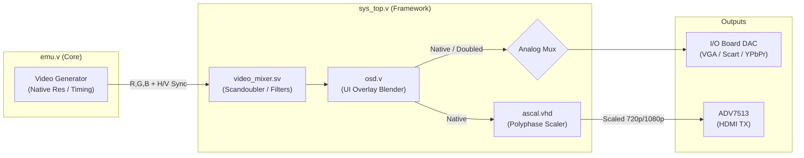
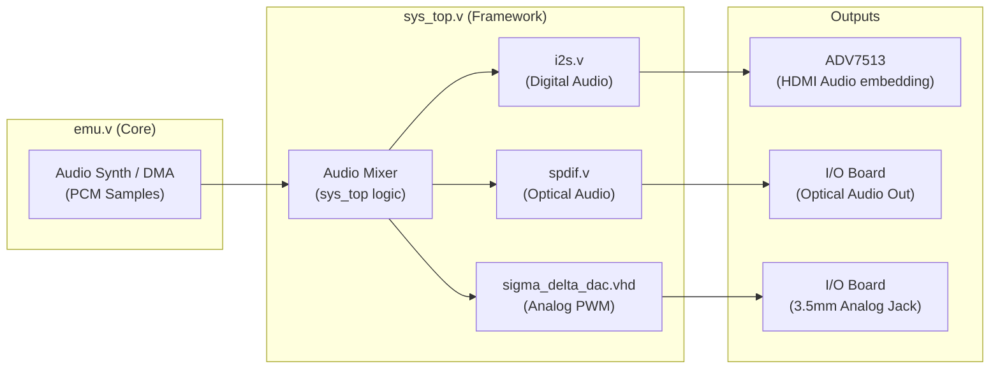

[← FPGA Subsystem](README.md) · [↑ Knowledge Base](../README.md)

# Video & Audio Pipelines

The `sys/` framework is responsible for taking the raw A/V signals generated by the emulation core and routing them to the physical outputs of the DE10-Nano and expansion boards. 

This document details the video and audio processing pipelines, specifically the dual-path nature (analog vs. digital) and the polyphase scaling architecture.

Sources:
* [`Template_MiSTer/sys/video_mixer.sv`](https://github.com/MiSTer-devel/Template_MiSTer/blob/master/sys/video_mixer.sv)
* [`Template_MiSTer/sys/ascal.vhd`](https://github.com/MiSTer-devel/Template_MiSTer/blob/master/sys/ascal.vhd)
* [`Template_MiSTer/sys/sigma_delta_dac.vhd`](https://github.com/MiSTer-devel/Template_MiSTer/blob/master/sys/sigma_delta_dac.vhd)

---

## 1. The Video Pipeline

A cycle-accurate emulation core generates video exactly as the original hardware did. For example, a Super Nintendo core outputs a 15 kHz, 240p analog-style pixel stream with embedded horizontal and vertical sync pulses. Modern HDMI displays cannot interpret this raw signal natively.

The framework provides a dual-path solution: an **Analog Path** for zero-lag CRT usage, and a **Digital Path** with advanced scaling for HDMI displays.

### 1.1 The Analog Path (Direct to DAC)
The signal flows from the core, through `video_mixer.sv`, through the OSD blender, and directly out to the GPIO pins connected to the I/O Board's resistor-ladder DAC.

**Characteristics:**
*   **Zero Lag:** There is no framebuffer. Pixels are sent to the DAC at the exact clock rate generated by the core.
*   **Native Timing:** A 240p signal stays 240p. A 50Hz PAL signal stays 50Hz.

> [!NOTE]
> The Analog Path represents the truest form of hardware emulation. Because there is no framebuffer, the display beam follows the emulated system's beam in absolute real-time.
*   **Optional Scandoubling:** If the user connects a 31 kHz PC CRT (which cannot display 15 kHz 240p), they can enable scandoubling in `MiSTer.ini`. The `video_mixer.sv` uses a small line buffer to output 480p at zero frame lag.

### 1.2 The Digital Path (Polyphase Scaler)
For HDMI output, the signal must be converted to standard HDTV resolutions (720p, 1080p, 1440p) and optionally buffered to match the display's refresh rate (e.g., matching a 50Hz core to a 60Hz display, though v-sync is highly recommended).

This is handled by **`ascal.vhd`**, a sophisticated, multi-tap polyphase scaler.

*   **Framebuffer Dependency:** `ascal` cannot operate on the fly. It requires a massive framebuffer to store the incoming core frames before applying 2D interpolation algorithms.
*   **F2H AXI Bridge:** Because the FPGA's internal Block RAM (M10K) is too small for a 1080p framebuffer, `ascal` uses the **DDR3 memory** on the HPS side. It reads and writes to DDR3 via the 64-bit F2H AXI Bridge (managed by the `ddram.v` wrapper).
*   **Filter Coefficients:** `ascal` supports customizable interpolation filters (Bilinear, Sharp Bilinear, CRT shadow-mask emulation) which are uploaded into the scaler's coefficient RAM by the HPS at runtime.

> [!WARNING]
> Because `ascal.vhd` relies on the F2H AXI Bridge to use DDR3 as a framebuffer, it is susceptible to Linux memory contention. While the latency is acceptable for video buffering, this DDR3 path is strictly forbidden for cycle-accurate CPU RAM emulation.

---

## 2. The Audio Pipeline

Like video, audio in retro consoles is generated natively (e.g., Yamaha FM synthesis chips, Amiga Paula DMA, or simple pulse waves). The core outputs these as digital PCM samples (typically 16-bit, 48 kHz).

### 2.1 The Analog Audio Path
The mixed PCM samples are fed into a Sigma-Delta DAC (`sigma_delta_dac.vhd`) implemented inside the FPGA fabric. This converts the digital 16-bit values into a high-frequency PWM (Pulse Width Modulation) signal that is output via a single GPIO pin per channel. The analog circuitry on the I/O Board filters this PWM back into a smooth analog wave for headphones or amplifiers.

*(Note: Newer "Digital I/O Boards" bypass the Sigma-Delta DAC and use an external I2S DAC chip on the board for higher fidelity).*

### 2.2 The Digital Audio Path
Simultaneously, the exact same mixed PCM samples are fed into two digital encoders:
1.  **I2S Encoder (`i2s.v`):** Formats the audio stream into the I2S standard. This stream is wired directly to the ADV7513 HDMI transmitter chip on the DE10-Nano, which embeds it into the HDMI signal.
2.  **S/PDIF Encoder (`spdif.v`):** Formats the stream for optical output (TOSLINK), which is available on the I/O board.

---

## 3. The `video_mixer.sv` Role

While `ascal.vhd` handles resizing, `video_mixer.sv` handles pre-processing before the signal reaches the HDMI scaler or analog outputs. Its responsibilities include:
*   **Scandoubling:** Line-buffering 15 kHz signals to 31 kHz for VGA monitors.
*   **Gamma Correction:** Applying lookup tables (LUTs) for accurate color representation.
*   **Shadow Masks / Scanlines:** Applying hardware-level visual filters (for the analog path; HDMI filters are often handled by `ascal`).
*   **Sync Generation:** Generating clean Composite Sync (CSYNC) from separate HSync and VSync for SCART cables.

## Read Also
* [HPS Bridge Reference](hps_bridge_reference.md) — How the HPS controls these A/V pipelines.
* [Memory Controllers](memory_controllers.md) — Detailed explanation of the F2H DDR3 bridge used by `ascal`.
* [OSD Architecture](../05_configuration/osd.md) — How the UI is blended into the video stream.
