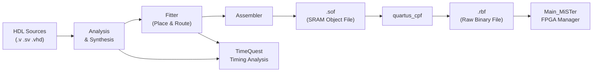
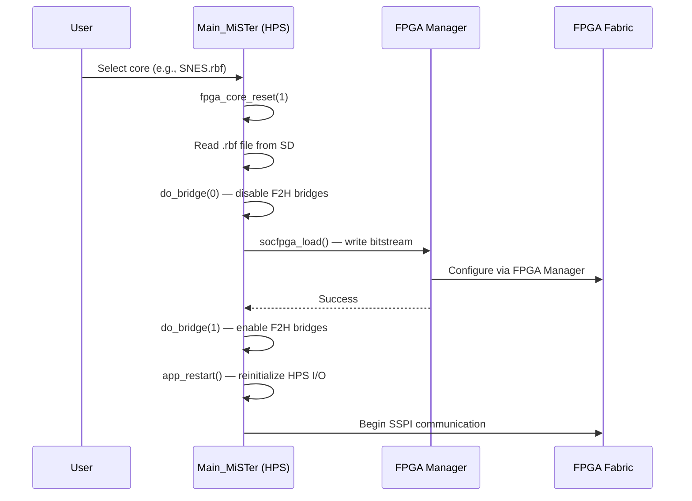

[← FPGA Cores Architecture](../README.md) · [↑ Knowledge Base](../../README.md)

# FPGA Build Pipeline: QPF → Synthesis → Fitter → RBF

This article traces the complete path from source code to a running MiSTer core: the Quartus project structure, the four-stage compilation pipeline, the TCL automation hooks, the RBF bitstream format, and how `Main_MiSTer` loads the result onto the FPGA.

Every MiSTer core follows the same build recipe because they all share the `sys/` framework from `Template_MiSTer`. Understanding this pipeline is essential for core developers, contributors debugging timing failures, and anyone automating CI builds.

Sources:
* [`Template_MiSTer/Template.qsf`](https://github.com/MiSTer-devel/Template_MiSTer/blob/master/Template.qsf)
* [`Template_MiSTer/Template.qpf`](https://github.com/MiSTer-devel/Template_MiSTer/blob/master/Template.qpf)
* [`Template_MiSTer/sys/sys.tcl`](https://github.com/MiSTer-devel/Template_MiSTer/blob/master/sys/sys.tcl)
* [`Template_MiSTer/sys/build_id.tcl`](https://github.com/MiSTer-devel/Template_MiSTer/blob/master/sys/build_id.tcl)
* [`Template_MiSTer/Readme.md`](https://github.com/MiSTer-devel/Template_MiSTer/blob/master/Readme.md)
* [`Main_MiSTer/fpga_io.cpp`](https://github.com/MiSTer-devel/Main_MiSTer/blob/master/fpga_io.cpp)

---

## 1. Project Structure

A standard MiSTer core repository has this layout:

```
<CoreName>_MiSTer/
├── <CoreName>.qpf        # Quartus project file (2 lines)
├── <CoreName>.qsf        # Quartus settings file (global assignments)
├── <CoreName>.sdc        # Timing constraints (optional, per-core)
├── <CoreName>.srf        # Warning suppression (optional)
├── <CoreName>.sv         # Top-level core module (emu wrapper)
├── files.qip             # File list (core-specific HDL files)
├── sys/                  # Framework — DO NOT MODIFY
│   ├── sys.qip           # Framework file list
│   ├── sys.tcl           # Pin assignments, HPS configuration
│   ├── sys_analog.tcl    # Analog video pin assignments
│   ├── sys_dual_sdram.tcl # Dual SDRAM pin assignments
│   ├── build_id.tcl      # Build timestamp + CDF generator
│   ├── sys_top.v         # Framework top-level (synthesis entry)
│   ├── sysmem.sv         # HPS interface wrapper
│   ├── hps_io.sv         # Core-side command decoder
│   └── ...               # Other framework modules
├── rtl/                  # Core-specific HDL
│   ├── pll/              # PLL IP (required)
│   ├── pll.v             # PLL wrapper
│   └── ...               # Core logic files
├── releases/             # Output: dated RBF files
├── clean.bat             # Windows cleanup script
└── .gitignore
```

Source: [`Template_MiSTer/Readme.md`](https://github.com/MiSTer-devel/Template_MiSTer/blob/master/Readme.md)

### 1.1 The QPF File

The `.qpf` file is minimal — just the Quartus version and project revision:

```tcl
# Template.qpf
QUARTUS_VERSION = "17.0"
PROJECT_REVISION = "Template"
```

When creating a new core, copy `Template.qpf` and change `PROJECT_REVISION` to your core name.

### 1.2 The QSF File

The `.qsf` file contains global compilation settings. It sources three external files:

```tcl
# Template.qsf — bottom of file
source sys/sys.tcl          # Pin assignments, device config, HPS locations
source sys/sys_analog.tcl   # Analog video (VGA/YPbPr) pin assignments
source files.qip            # Core-specific file list
```

Source: [`Template.qsf:L76-78`](https://github.com/MiSTer-devel/Template_MiSTer/blob/master/Template.qsf#L76)

> [!WARNING]
> Do NOT add files to the project through the Quartus IDE. Quartus will write file assignments into the `.qsf` file, bloating it and making it difficult to maintain. Instead, manually add files to `files.qip`.

### 1.3 The files.qip File

`files.qip` is a plain TCL file listing the core's HDL source files:

```tcl
# files.qip — Template example
set_global_assignment -name VERILOG_FILE rtl/lfsr.v
set_global_assignment -name SYSTEMVERILOG_FILE rtl/cos.sv
set_global_assignment -name SYSTEMVERILOG_FILE rtl/mycore.v
set_global_assignment -name SDC_FILE Template.sdc
set_global_assignment -name SYSTEMVERILOG_FILE Template.sv
```

Source: [`files.qip`](https://github.com/MiSTer-devel/Template_MiSTer/blob/master/files.qip)

The `sys.qip` file (referenced from `sys.tcl`) lists all framework modules. Both are sourced at build time via the `source` command in the QSF.

### 1.4 Verilog Macros

The QSF file defines conditional compilation macros that control framework features:

```tcl
# Template.qsf — conditional macros (commented out by default)
#set_global_assignment -name VERILOG_MACRO "MISTER_FB=1"
#set_global_assignment -name VERILOG_MACRO "MISTER_FB_PALETTE=1"
#set_global_assignment -name VERILOG_MACRO "MISTER_DEBUG_NOHDMI=1"
#set_global_assignment -name VERILOG_MACRO "MISTER_DOWNSCALE_NN=1"
#set_global_assignment -name VERILOG_MACRO "MISTER_DISABLE_ADAPTIVE=1"
#set_global_assignment -name VERILOG_MACRO "MISTER_SMALL_VBUF=1"
#set_global_assignment -name VERILOG_MACRO "MISTER_DISABLE_YC=1"
#set_global_assignment -name VERILOG_MACRO "MISTER_DISABLE_ALSA=1"
```

Source: [`Template.qsf:L53-74`](https://github.com/MiSTer-devel/Template_MiSTer/blob/master/Template.qsf#L53)

| Macro | Effect |
|---|---|
| `MISTER_FB` | Enables core framebuffer access via `ioctl` |
| `MISTER_FB_PALETTE` | 8-bit indexed color mode for framebuffer |
| `MISTER_DEBUG_NOHDMI` | Disables HDMI pipeline — faster compilation, analog-only output |
| `MISTER_DOWNSCALE_NN` | Nearest-neighbor downscaling in ascal |
| `MISTER_DISABLE_ADAPTIVE` | Disables adaptive scanline filter |
| `MISTER_SMALL_VBUF` | 1 MB vbuf instead of 22 MB — frees DDR3 for core |
| `MISTER_DISABLE_YC` | Removes composite/S-Video output |
| `MISTER_DISABLE_ALSA` | Removes ALSA audio mixer from ram2 |
| `MISTER_DUAL_SDRAM` | Dual SDRAM board pin configuration |
| `MISTER_NGIF` | Enables NGIF extension (ACP cache-coherent access) |

---

## 2. Compilation Pipeline



### 2.1 Stage 1: Analysis & Synthesis

**Command**: `quartus_map <project>`

This stage:
1. Parses all HDL files (Verilog, SystemVerilog, VHDL)
2. Elaborates the design hierarchy starting from the top-level entity (`sys_top`)
3. Synthesizes RTL into a technology-mapped netlist of ALMs, M10K blocks, DSP blocks, and PLLs
4. Applies the optimization settings from the QSF

Key QSF settings that affect synthesis:

```tcl
# Template.qsf — synthesis optimizations
set_global_assignment -name OPTIMIZATION_TECHNIQUE SPEED
set_global_assignment -name PHYSICAL_SYNTHESIS_COMBO_LOGIC ON
set_global_assignment -name PHYSICAL_SYNTHESIS_REGISTER_DUPLICATION ON
set_global_assignment -name PHYSICAL_SYNTHESIS_REGISTER_RETIMING ON
set_global_assignment -name SYNTH_GATED_CLOCK_CONVERSION ON
set_global_assignment -name PRE_MAPPING_RESYNTHESIS ON
set_global_assignment -name ADV_NETLIST_OPT_SYNTH_WYSIWYG_REMAP ON
```

Source: [`Template.qsf:L35-46`](https://github.com/MiSTer-devel/Template_MiSTer/blob/master/Template.qsf#L35)

> [!NOTE]
> The `OPTIMIZATION_TECHNIQUE SPEED` setting prioritizes performance over area. This is critical for MiSTer cores because the framework's video and memory pipelines must run at 100+ MHz regardless of the emulated system's clock speed.

### 2.2 Stage 2: Fitter (Place & Route)

**Command**: `quartus_fit <project>`

The Fitter maps the synthesized netlist to physical resources on the 5CSEBA6U23I7 device:
1. **Partition**: Assigns each partition to a region of the FPGA
2. **Placer**: Assigns each ALM, M10K, and DSP to a physical location
3. **Router**: Connects all placed elements using the FPGA's routing fabric
4. **Timing Optimization**: Iteratively adjusts placement to meet timing constraints

Key QSF settings:

```tcl
# Template.qsf — fitter optimizations
set_global_assignment -name FINAL_PLACEMENT_OPTIMIZATION ALWAYS
set_global_assignment -name FITTER_EFFORT "STANDARD FIT"
set_global_assignment -name OPTIMIZATION_MODE "HIGH PERFORMANCE EFFORT"
set_global_assignment -name ROUTER_LCELL_INSERTION_AND_LOGIC_DUPLICATION ON
set_global_assignment -name PERIPHERY_TO_CORE_PLACEMENT_AND_ROUTING_OPTIMIZATION ON
set_global_assignment -name PHYSICAL_SYNTHESIS_ASYNCHRONOUS_SIGNAL_PIPELINING ON
set_global_assignment -name ALM_REGISTER_PACKING_EFFORT MEDIUM
set_global_assignment -name SEED 1
```

Source: [`Template.qsf:L29-51`](https://github.com/MiSTer-devel/Template_MiSTer/blob/master/Template.qsf#L29)

The `SEED` value initializes the Fitter's random placement algorithm. Changing the seed can produce dramatically different timing results — this is the basis of **seed sweeping** for timing closure.

### 2.3 Stage 3: Assembler

**Command**: `quartus_asm <project>`

The Assembler generates the `.sof` (SRAM Object File) from the Fitter's output. The `.sof` contains the complete bitstream including:
- Configuration data for all ALMs, routing, and M10K blocks
- Device programming information
- Cyclone V-specific initialization sequences

The QSF enables automatic RBF generation:

```tcl
set_global_assignment -name GENERATE_RBF_FILE ON
```

Source: [`Template.qsf:L18`](https://github.com/MiSTer-devel/Template_MiSTer/blob/master/Template.qsf#L18)

### 2.4 Stage 4: SOF → RBF Conversion

**Command**: `quartus_cpf -c <project>.sof <project>.rbf`

MiSTer requires an uncompressed Raw Binary File (`.rbf`), not the proprietary `.sof` format. The conversion parameters:

| Parameter | Value | Meaning |
|---|---|---|
| Mode | Passive Parallel x16 | FPGA configuration mode |
| Compression | Off | Uncompressed (required by FPGA Manager) |
| Endianness | Little-endian | Byte-swapped from SOF |

The `.rbf` is what `Main_MiSTer` loads via the FPGA Manager. See [FPGA Loading](../../06_fpga_subsystem/fpga_loading.md) for the loading sequence.

---

## 3. TCL Automation Hooks

### 3.1 Pre-Flow Script: build_id.tcl

The QSF registers a pre-flow TCL script that runs before compilation:

```tcl
# sys.tcl:L216
set_global_assignment -name PRE_FLOW_SCRIPT_FILE "quartus_sh:sys/build_id.tcl"
```

Source: [`sys.tcl:L216`](https://github.com/MiSTer-devel/Template_MiSTer/blob/master/sys/sys.tcl#L216)

`build_id.tcl` performs two functions:

**1. Build Timestamp Generation**: Creates `build_id.v` with a date macro:

```tcl
# build_id.tcl:L8
set buildDate "`define BUILD_DATE \"[clock format [ clock seconds ] -format %y%m%d]\""
```

This allows the core to embed its compilation date, which `Main_MiSTer` can read back for version checking.

**2. CDF Generation**: Creates `jtag.cdf` for JTAG programming:

```tcl
# build_id.tcl:L31-49
proc generateCDF {revision device outpath} {
    # Creates a Chain Description File for USB-Blaster JTAG programming
    # Includes both the HPS (SOCVHPS) and FPGA (5CSEBA6U23I7) in the JTAG chain
}
```

The CDF file is used by Quartus Programmer to load the `.sof` directly to the FPGA via JTAG for development debugging, bypassing the HPS entirely.

### 3.2 Pin Assignments: sys.tcl

The `sys.tcl` file contains all pin assignments for the DE10-Nano board. This file is part of the shared `sys/` framework and must not be modified by core developers:

```tcl
# sys.tcl — device and pin assignments
set_global_assignment -name FAMILY "Cyclone V"
set_global_assignment -name DEVICE 5CSEBA6U23I7
set_global_assignment -name DEVICE_FILTER_PACKAGE UFBGA
set_global_assignment -name DEVICE_FILTER_PIN_COUNT 672
set_global_assignment -name DEVICE_FILTER_SPEED_GRADE 7
```

Source: [`sys.tcl:L1-5`](https://github.com/MiSTer-devel/Template_MiSTer/blob/master/sys/sys.tcl#L1)

The file assigns:
- **ADC** pins (4 signals)
- **I2C LED/Button** pins (2 signals with pull-up, max current)
- **User I/O** pins (7 signals on GPIO-0)
- **SD card SPI** pins (4 signals)
- **SDRAM** pins (32 signals with fast I/O registers)
- **HDMI** pins (28 signals with fast output registers)
- **Clock** pins (3 × 50 MHz oscillators)
- **Key/Switch/LED** pins (board-level I/O)
- **HPS interface** locations (SPI, UART, I2C)

Critical SDRAM timing constraints:

```tcl
# sys.tcl:L93-98 — SDRAM I/O timing constraints
set_instance_assignment -name FAST_OUTPUT_REGISTER ON -to SDRAM_*
set_instance_assignment -name FAST_OUTPUT_ENABLE_REGISTER ON -to SDRAM_DQ[*]
set_instance_assignment -name FAST_INPUT_REGISTER ON -to SDRAM_DQ[*]
set_instance_assignment -name ALLOW_SYNCH_CTRL_USAGE OFF -to *|SDRAM_*
```

These force Quartus to place the SDRAM I/O registers in the I/O elements adjacent to the pins, minimizing clock-to-output delay and setup time — essential for meeting SDRAM timing at 100+ MHz.

---

## 4. Quartus Version Locking

```tcl
# Template.qsf
set_global_assignment -name LAST_QUARTUS_VERSION "17.0.2 Standard Edition"
```

Source: [`Template.qsf:L16`](https://github.com/MiSTer-devel/Template_MiSTer/blob/master/Template.qsf#L16)

MiSTer cores **must** use Quartus 17.0.x. This is not arbitrary:

1. **HPS IP compatibility**: The `cyclonev_hps_interface_*` primitives are generated by Quartus Qsys/Platform Designer. Different Quartus versions produce different HPS configuration IP, which may not be pin-compatible with the DE10-Nano's HPS pin muxing.
2. **QSF format stability**: Newer Quartus versions may reorganize the QSF file, adding or renaming assignments. This breaks the `source` chain (`sys.tcl` → `files.qip`).
3. **Bitstream reproducibility**: Different Quartus versions can produce different bitstreams from the same source, making regression testing impossible.
4. **Community consistency**: All core developers use 17.0.x, ensuring that bug reports and timing results are comparable.

> [!CAUTION]
> Do NOT open a MiSTer QSF file in a newer version of Quartus. The IDE will "helpfully" add version-specific assignments and reformat the file, making it incompatible with 17.0.x and breaking the `files.qip` sourcing pattern.

### 4.1 The Q13 Variant

Some cores provide a `_Q13.qsf` file for Quartus 13.1 (the last version before Intel rebranded from Altera):

```tcl
# Template_Q13.qsf
set_global_assignment -name LAST_QUARTUS_VERSION 13.1
set_global_assignment -name ALLOW_SYNCH_CTRL_USAGE OFF
set_global_assignment -name PLACEMENT_EFFORT_MULTIPLIER 2.0
set_global_assignment -name ALM_REGISTER_PACKING_EFFORT LOW
```

Source: [`Template_Q13.qsf`](https://github.com/MiSTer-devel/Template_MiSTer/blob/master/Template_Q13.qsf)

Quartus 13.1 has a different Fitter algorithm that sometimes achieves better timing on the Cyclone V. The Q13 variant uses `PLACEMENT_EFFORT_MULTIPLIER 2.0` and reduced `ALM_REGISTER_PACKING_EFFORT LOW` to trade compilation time for timing quality.

---

## 5. RBF Format & Loading

### 5.1 RBF File Structure

An RBF file is a raw binary representation of the FPGA bitstream. For the Cyclone V 5CSEBA6U23I7:

| Property | Value |
|---|---|
| Configuration mode | Passive Serial (PS) |
| Data width | 16-bit |
| Compression | None |
| Typical size | 2–4 MB (varies by core complexity) |

MiSTer cores may optionally prepend a 16-byte header:

```c
// fpga_io.cpp:L484-488 — header detection
if (!memcmp(buf, "MiSTer", 6)) {
    sz = *(uint32_t*)(((uint8_t*)buf) + 12);   // actual bitstream size at offset 12
    p = (void*)(((uint8_t*)buf) + 16);           // data starts at offset 16
}
```

Source: [`fpga_io.cpp:L484-488`](https://github.com/MiSTer-devel/Main_MiSTer/blob/master/fpga_io.cpp#L484)

The header format:

| Offset | Size | Content |
|---|---|---|
| 0 | 6 bytes | Magic: `"MiSTer"` |
| 6 | 6 bytes | Reserved |
| 12 | 4 bytes | Bitstream size (little-endian uint32) |
| 16 | variable | Raw bitstream data |

### 5.2 The Loading Sequence

When a user selects a core from the menu:



Source: [`fpga_io.cpp:L426-508`](https://github.com/MiSTer-devel/Main_MiSTer/blob/master/fpga_io.cpp#L426)

### 5.3 FPGA Manager State Machine

The FPGA Manager on the Cyclone V HPS controls the FPGA configuration:

```c
// fpga_manager.h — FPGA Manager modes
#define FPGAMGRREGS_MODE_FPGAOFF      0x0  // FPGA powered off
#define FPGAMGRREGS_MODE_RESETPHASE   0x1  // Reset in progress
#define FPGAMGRREGS_MODE_CFGPHASE     0x2  // Configuration in progress
#define FPGAMGRREGS_MODE_INITPHASE    0x3  // Initialization after config
#define FPGAMGRREGS_MODE_USERMODE     0x4  // FPGA running user logic
```

Source: [`fpga_manager.h:L56-62`](https://github.com/MiSTer-devel/Main_MiSTer/blob/master/fpga_manager.h#L56)

The `socfpga_load()` function in `fpga_io.cpp`:
1. Sets the FPGA Manager to reset phase
2. Enables configuration (CD ratio x1 for uncompressed RBF)
3. Writes the entire bitstream to the `FPGAMGRDATA_ADDRESS` (`0xFFB90000`) register
4. Polls for init phase completion
5. Polls for user mode entry

---

## 6. Command-Line Build

### 6.1 Full Build (One Command)

```bash
quartus_sh --flow compile Template
```

This runs all four stages (synthesis → fitter → assembler → timing analysis) in sequence.

### 6.2 Individual Stages

```bash
# Synthesis only
quartus_map Template

# Fitter only (after synthesis)
quartus_fit Template

# Assembler only (after fitter)
quartus_asm Template

# Timing analysis only
quartus_sta Template

# SOF → RBF conversion
quartus_cpf -c output_files/Template.sof output_files/Template.rbf
```

### 6.3 Timing-Driven Build with Seed Sweep

For cores that struggle with timing closure:

```bash
#!/bin/bash
# seed_sweep.sh — try multiple seeds and keep the best
BEST_SLACK=-999
BEST_SEED=0

for SEED in $(seq 1 20); do
    # Update the seed in the QSF
    sed -i "s/set_global_assignment -name SEED.*/set_global_assignment -name SEED $SEED/" Template.qsf
    
    # Run full compilation
    quartus_sh --flow compile Template
    
    # Extract worst-case slack from the timing report
    SLACK=$(grep -oP 'worst-case slack.*?(-?\d+\.\d+)' output_files/Template.sta.out | tail -1 | grep -oP -- '-?\d+\.\d+')
    
    echo "Seed $SEED: Slack = $SLACK ns"
    
    if (( $(echo "$SLACK > $BEST_SLACK" | bc -l) )); then
        BEST_SLACK=$SLACK
        BEST_SEED=$SEED
        cp output_files/Template.rbf "Template_seed${SEED}.rbf"
    fi
done

echo "Best seed: $BEST_SEED (slack = $BEST_SLACK ns)"
```

### 6.4 Clean Build

```bash
# Quartus clean
quartus_sh --flow clean Template

# Or the Template's clean.bat (Windows)
# Or manually:
rm -rf db/ incremental_db/ output_files/ greybox_tmp/ build_id.v jtag.cdf
```

---

## 7. CI/CD Automation

### 7.1 GitHub Actions

Many MiSTer core repositories use GitHub Actions for automated builds. A typical workflow:

```yaml
# .github/workflows/build.yml
name: Build RBF
on: [push, pull_request]
jobs:
  build:
    runs-on: self-hosted    # Requires Quartus 17.0.2 installed
    steps:
      - uses: actions/checkout@v4
        with:
          submodules: true  # Pull sys/ framework
      
      - name: Build
        run: quartus_sh --flow compile Template
      
      - name: Check Timing
        run: |
          grep -q "Timing requirements not met" output_files/Template.sta.rpt && exit 1
          echo "Timing met!"
      
      - name: Upload RBF
        uses: actions/upload-artifact@v4
        with:
          name: rbf
          path: output_files/Template.rbf
```

> [!NOTE]
> Quartus 17.0.2 requires a self-hosted runner (Linux or Windows). Intel does not provide a Docker image, and the toolchain cannot run on GitHub's hosted runners due to licensing and installation requirements.

### 7.2 Docker-Based Build

For teams that want reproducible builds:

```dockerfile
# Dockerfile — Quartus 17.0.2 Lite in a container
FROM ubuntu:18.04

# Install Quartus (requires manual download from Intel)
ADD QuartusLiteSetup-17.0.2.602-linux.tar /tmp/
RUN /tmp/setup.sh --mode unattended --accept-eula --dir /opt/intelFPGA_lite

ENV PATH="/opt/intelFPGA_lite/17.0.2/quartus/bin:${PATH}"
ENV QUARTUS_ROOTDIR="/opt/intelFPGA_lite/17.0.2/quartus"

ENTRYPOINT ["quartus_sh"]
```

---

## 8. Quartus Q13 vs Q17 Build Differences

| Aspect | Quartus 13.1 (Q13) | Quartus 17.0.2 (Q17) |
|---|---|---|
| Fitter algorithm | Classic Altera Fitter | Intel rebranded, same engine |
| HPS IP generation | Qsys 13.1 | Qsys 17.0 (Pro) |
| IP file format | `.qip` with `set_global_assignment` | Same, but different IP versions |
| Timing-driven synthesis | `SYNTH_TIMING_DRIVEN_SYNTHESIS ON` | Default behavior |
| Placement effort | `PLACEMENT_EFFORT_MULTIPLIER 2.0` | Not available (different algorithm) |
| ALM packing | `LOW` (less aggressive) | `MEDIUM` (default) |
| Seed behavior | Different random sequence | Different from Q13 |
| Best for | Timing-critical cores needing every picosecond | Standard builds, community consistency |

---

## 9. Common Build Problems

### 9.1 Quartus Reformatting the QSF

**Symptom**: The `.qsf` file suddenly becomes 500+ lines after opening in Quartus IDE.

**Cause**: Quartus "spits" all settings from sourced files into the QSF.

**Fix**: Revert the QSF to the template version and re-apply only your core-specific changes.

### 9.2 Files Added via Quartus IDE Disappear

**Symptom**: Files added through the Quartus IDE GUI are lost after a clean build.

**Cause**: The IDE adds files to the QSF, but the QSF is sourced from `files.qip`. On the next `quartus_map`, the IDE's changes are overwritten.

**Fix**: Manually add `set_global_assignment` lines to `files.qip`.

### 9.3 Timing Failure After Framework Update

**Symptom**: Core passes timing before a `sys/` submodule update, but fails after.

**Cause**: The framework's timing requirements may change between versions (new features, different pipeline depths).

**Fix**: Run a seed sweep. If no seed meets timing, check the timing report for the failing paths — they are usually in the framework, not the core.

### 9.4 RBF Too Large for SDRAM-Based Loading

**Symptom**: Core loads fine from SD card but hangs when loaded from SDRAM.

**Cause**: Not applicable — MiSTer loads RBF from the SD card into the FPGA Manager, not from SDRAM. However, very large RBF files (>4 MB) may indicate that M10K blocks are being inferred as logic instead of block RAM.

**Fix**: Check the Fitter report for "M10K" usage. If BRAM is being implemented as ALM logic, add `(* ramstyle = "M10K" *)` attributes to your RAM declarations.

---

## 10. Output File Summary

| File | Location | Purpose |
|---|---|---|
| `.sof` | `output_files/` | SRAM Object File — for JTAG debugging |
| `.rbf` | `output_files/` | Raw Binary File — for MiSTer loading |
| `.sta.rpt` | `output_files/` | Timing analysis report |
| `.fit.rpt` | `output_files/` | Fitter report (resource utilization) |
| `.map.rpt` | `output_files/` | Synthesis report |
| `jtag.cdf` | project root | JTAG chain description for programmer |
| `build_id.v` | project root | Build timestamp macro (auto-generated) |
| `db/` | project root | Quartus database (incremental compilation) |
| `greybox_tmp/` | project root | Temporary IP generation files |

---

## Read Also

* [Template Walkthrough](../template_walkthrough.md) — Step-by-step guide to creating a core from Template_MiSTer
* [FPGA Compilation & Timing Closure](../../06_fpga_subsystem/fpga_compilation_guide.md) — Detailed timing closure strategies
* [FPGA Performance Metrics](../../06_fpga_subsystem/fpga_performance_metrics.md) — Resource utilization benchmarks
* [FPGA Loading](../../06_fpga_subsystem/fpga_loading.md) — How Main_MiSTer loads the RBF via FPGA Manager
* [DDR3 Architecture](../../06_fpga_subsystem/ddr3_architecture.md) — The F2SDRAM bridge that the build must configure
