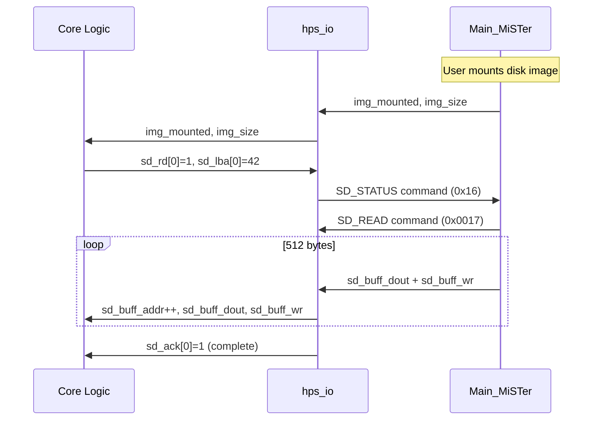

[← Core Architecture](../README.md) · [↑ Knowledge Base](../../README.md)

# Template Walkthrough — Building a MiSTer Core from Scratch

This article is the **entry point for core developers**. It walks through the `Template_MiSTer` repository file by file, explaining what each file does, what you must modify, and what you must never touch. By the end, you'll understand the complete skeleton of a MiSTer core and be ready to port or write your own.

Sources:
* [`MiSTer-devel/Template_MiSTer`](https://github.com/MiSTer-devel/Template_MiSTer) — Official core template
* [`Template_MiSTer/Template.sv`](https://github.com/MiSTer-devel/Template_MiSTer/blob/master/Template.sv) — Glue logic between framework and core
* [`Template_MiSTer/Readme.md`](https://github.com/MiSTer-devel/Template_MiSTer/blob/master/Readme.md) — Developer notes

Prerequisites: Read [Framework Architecture](../06_fpga_subsystem/fpga_framework_overview.md) for the Shell/Core paradigm and [sys_top.v Deep Dive](../06_fpga_subsystem/sys_top.md) for the framework internals.

---

## Table of Contents

1. [Repository Structure](#1-repository-structure)
2. [The Inviolable Rule: Don't Modify `sys/`](#2-the-inviolable-rule-dont-modify-sys)
3. [The `emu` Module (`<core_name>.sv`)](#3-the-emu-module-core_namesv)
4. [Configuration String (CONF_STR)](#4-configuration-string-conf_str)
5. [Instantiating `hps_io`](#5-instantiating-hps_io)
6. [Clock Generation (PLL)](#6-clock-generation-pll)
7. [Video Output Contract](#7-video-output-contract)
8. [Audio Output Contract](#8-audio-output-contract)
9. [Memory Interfaces](#9-memory-interfaces)
10. [Input Devices](#10-input-devices)
11. [File I/O — ROM Loading & Save Files](#11-file-io--rom-loading--save-files)
12. [SD Card Access](#12-sd-card-access)
13. [Status Word & OSD Menu](#13-status-word--osd-menu)
14. [LED & Button Handling](#14-led--button-handling)
15. [Framebuffer Mode (MISTER_FB)](#15-framebuffer-mode-mister_fb)
16. [Dual SDRAM Mode (MISTER_DUAL_SDRAM)](#16-dual-sdram-mode-mister_dual_sdram)
17. [NGIF Extension](#17-ngif-extension)
18. [Quartus Project Configuration](#18-quartus-project-configuration)
19. [Build & Deployment](#19-build--deployment)
20. [Common Pitfalls](#20-common-pitfalls)

---

## 1. Repository Structure

A standard MiSTer core repository has this layout:

```
<core_name>/
├── sys/                  ← Framework (DO NOT MODIFY)
│   ├── sys_top.v         ← Root synthesis entity
│   ├── hps_io.sv         ← Core-side command decoder
│   ├── ascal.vhd         ← Polyphase video scaler
│   ├── audio_out.v       ← Audio pipeline
│   ├── osd.v             ← OSD overlay blender
│   ├── sdram.sv          ← SDRAM controller
│   ├── ddram.v           ← DDR3 wrapper
│   ├── ...               ← Other framework modules
│   └── sysmem.sv         ← DDR3 controller wrapper
├── rtl/                  ← Your core's RTL
│   ├── <core_logic>.sv   ← Core implementation files
│   ├── pll/              ← Core-specific PLL
│   │   └── pll.qip
│   ├── pll.v             ← PLL generated file
│   └── pll.qip           ← PLL QIP file
├── releases/             ← Compiled RBF bitstreams
├── <core_name>.qpf       ← Quartus project file
├── <core_name>.qsf       ← Quartus settings file
├── <core_name>.srf       ← Warning suppression rules
├── <core_name>.sdc       ← Timing constraints (optional)
├── <core_name>.sv        ← Glue logic (emu module)
├── files.qip             ← File list for Quartus
├── clean.bat             ← Clean build artifacts
└── .gitignore            ← Git ignore rules
```

### Naming Convention

Replace `<core_name>` with your core's name throughout. For example, the SNES core uses `SNES`, the Genesis core uses `Genesis`, the Arcade core for Pac-Man uses `PacMan`. The Quartus project file, QSF, and top-level `.sv` file must all share this name.

---

## 2. The Inviolable Rule: Don't Modify `sys/`

> [!CAUTION]
> The `sys/` directory is **shared across all MiSTer cores** and is updated independently by the framework maintainer. Any modifications you make to files in `sys/` will be overwritten when you merge framework updates. The framework is designed so that all customization happens through:
>
> 1. **Parameters** (like `CONF_STR` passed to `hps_io`)
> 2. **Conditional compilation defines** (like `MISTER_FB`, `MISTER_DUAL_SDRAM`)
> 3. **Your `emu` module** (`<core_name>.sv`)
>
> If you find yourself needing to modify `sys/`, you're probably doing something wrong. Ask on the MiSTer forums first.

The one exception is the `sys/sys_top.v` pin assignments — but these are already correct for the DE10-Nano and should never need changing.

---

## 3. The `emu` Module (`<core_name>.sv`)

The `<core_name>.sv` file defines the `emu` module — the single module that `sys_top.v` instantiates and connects to. This is where you write the "glue logic" that adapts your core's signals to the framework's expected interface.

### 3.1 Module Declaration

The `emu` module has a **fixed port list** that must match what `sys_top.v` expects. The template provides all ports with default assignments:

```verilog
// Template.sv L19-217
module emu
(
    input         CLK_50M,       // 50 MHz reference clock
    input         RESET,         // Active-high reset
    inout  [48:0] HPS_BUS,      // Framework control vector
    
    output        CLK_VIDEO,     // Pixel clock (core-generated)
    output        CE_PIXEL,      // Pixel clock enable
    
    output [12:0] VIDEO_ARX,     // Aspect ratio X
    output [12:0] VIDEO_ARY,     // Aspect ratio Y
    
    output  [7:0] VGA_R/G/B,    // RGB video output
    output        VGA_HS/VS/DE,  // Sync and data enable
    output        VGA_F1,        // Interlace field
    output [1:0]  VGA_SL,        // Scanline config
    output        VGA_SCALER,    // Force VGA scaler
    output        VGA_DISABLE,   // Disable analog output
    
    // ... (HDMI feedback, framebuffer, audio, memory, peripherals)
);
```

### 3.2 Default Port Assignments

The template provides safe defaults for all ports:

```verilog
// Template.sv L221-237
assign ADC_BUS  = 'Z;
assign USER_OUT = '1;
assign {UART_RTS, UART_TXD, UART_DTR} = 0;
assign {SD_SCK, SD_MOSI, SD_CS} = 'Z;
assign {SDRAM_DQ, SDRAM_A, ...} = 'Z;    // Tri-state SDRAM
assign {DDRAM_CLK, DDRAM_BURSTCNT, ...} = '0; // DDR3 idle

assign VGA_SL = 0;
assign VGA_F1 = 0;
assign VGA_SCALER  = 0;
assign VGA_DISABLE = 0;
assign HDMI_FREEZE = 0;
assign AUDIO_S = 0;
assign AUDIO_MIX = 0;
assign AUDIO_L = 0;
assign AUDIO_R = 0;
```

As you implement core features, you replace these defaults with actual signals from your core logic.

---

## 4. Configuration String (CONF_STR)

The configuration string is a compile-time constant that defines the core's OSD menu. `Main_MiSTer` reads it at startup and builds the menu UI from it.

### 4.1 Template Example

```verilog
// Template.sv L262-291
localparam CONF_STR = {
    "Template;;",
    "-;",
    "O[122:121],Aspect ratio,Original,Full Screen,[ARC1],[ARC2];",
    "O[2],TV Mode,NTSC,PAL;",
    "O[4:3],Noise,White,Red,Green,Blue;",
    "-;",
    "P1,Test Page 1;",
    "P1-;",
    "P1-, -= Options in page 1 =-;",
    "P1-;",
    "P1O[5],Option 1-1,Off,On;",
    "d0P1F1,BIN;",
    "H0P1O[10],Option 1-2,Off,On;",
    "-;",
    "P2,Test Page 2;",
    "P2S0,DSK;",
    "P2O[7:6],Option 2,1,2,3,4;",
    "-;",
    "T[0],Reset;",
    "R[0],Reset and close OSD;",
    "v,0;",
    "V,v",`BUILD_DATE
};
```

### 4.2 Common CONF_STR Tokens

| Token | Syntax | Maps to | Description |
|---|---|---|---|
| Options | `O[N:M],Label,Val1,Val2,...` | `status[N:M]` | Multi-bit option |
| Toggle | `T[N],Label` | `status[N]` | Momentary button (auto-clears) |
| Reset | `R[N],Label` | `status[N]` | Reset button (auto-clears + closes OSD) |
| File select | `F[N],EXT` | `ioctl_index=N` | ROM file selector |
| Disk select | `S[N],EXT` | `ioctl_index=N` | Disk image selector |
| Separator | `-` | — | Horizontal line |
| Page | `P[N],Title` | — | Tab page |
| Page items | `P[N]O[...],...` | — | Items on page N |
| Conditional | `d0...` / `H0...` | — | Show only when `status[0]`=1 / =0 |
| Version | `V,text` | — | Display string at bottom |
| Config version | `v,N` | — | Increment when options change incompatibly |

### 4.3 Status Word Bit Allocation

Plan your status bit allocation carefully. The 128-bit `status` word is the primary communication from OSD to core:

| Bits | Common Usage | Notes |
|---|---|---|
| `[0]` | Reset | Triggered by `T[0]` or `R[0]` |
| `[1]` | Button 2 | Often used as OSD exit |
| `[2]` | NTSC/PAL | TV mode selection |
| `[4:3]` | Low-bit options | Often video filters |
| `[7:6]` | Options | Various |
| `[10:8]` | Options | Various |
| `[122:121]` | Aspect ratio | Framework standard |
| `[127:123]` | Reserved | Framework use |

> [!WARNING]
> If you change the CONF_STR option layout in a way that makes old saved settings incompatible, increment the config version (`v,N`). Otherwise, users' saved OSD settings may map to wrong options.

---

## 5. Instantiating `hps_io`

```verilog
// Template.sv L298-312
hps_io #(.CONF_STR(CONF_STR)) hps_io
(
    .clk_sys(clk_sys),
    .HPS_BUS(HPS_BUS),
    .EXT_BUS(),
    .gamma_bus(),

    .forced_scandoubler(forced_scandoubler),
    .buttons(buttons),
    .status(status),
    .status_menumask({status[5]}),
    .ps2_key(ps2_key)
);
```

### 5.1 Minimum Required Connections

| Port | Required | Description |
|---|---|---|
| `clk_sys` | Yes | Core system clock |
| `HPS_BUS` | Yes | Framework control vector |
| `CONF_STR` | Yes | Configuration string parameter |
| `status` | Recommended | 128-bit OSD status word |
| `buttons` | Recommended | Button state |

### 5.2 Optional Connections by Core Type

| Core Type | Additional `hps_io` Ports |
|---|---|
| **Console** (NES, SNES, Genesis) | `joystick_0..5`, `ps2_key`, `ps2_mouse`, `ioctl_*`, `img_mounted`, `img_size` |
| **Computer** (Amiga, ao486) | + `sd_*` block/byte access, `RTC`, `TIMESTAMP`, `uart_*` |
| **Arcade** | + `joystick_0..1`, `ioctl_*` (MRA ROM loading) |
| **With SDRAM** | `sdram_sz` (size detection) |

See [hps_io.sv Deep Dive](../06_fpga_subsystem/hps_io_module.md) for the full port reference.

---

## 6. Clock Generation (PLL)

Every core must generate its own clocks from the 50 MHz reference:

```verilog
// Template.sv L316-322
wire clk_sys;
pll pll
(
    .refclk(CLK_50M),
    .rst(0),
    .outclk_0(clk_sys)
);
```

### 6.1 Required Clocks

| Clock | Output Port | Description |
|---|---|---|
| `clk_sys` | — (internal) | Core system clock (e.g., 28.375 MHz for Amiga) |
| `CLK_VIDEO` | `CLK_VIDEO` | Pixel clock — must equal `clk_sys` or be derived from it |
| `CE_PIXEL` | `CE_PIXEL` | Pixel clock enable (1 = pixel valid) |

### 6.2 Clock Enable Pattern

For cores where the system clock differs from the pixel clock, use a clock enable:

```verilog
// Example: 10.738 MHz pixel clock from 21.477 MHz system clock
assign CLK_VIDEO = clk_sys;        // Use system clock as video clock
assign CE_PIXEL = ce_pix;          // Pixel enable from core (toggles at pixel rate)
```

The framework's video pipeline samples `VGA_*` signals on `CE_PIXEL` edges, so the pixel data must be stable when `CE_PIXEL` is high.

### 6.3 PLL Placement

PLL files must be in the `rtl/` directory:
- `rtl/pll.v` — Generated PLL Verilog
- `rtl/pll.qip` — Quartus IP file
- `rtl/pll/` — PLL working directory

Generate the PLL using Quartus's MegaWizard Plug-In Manager, targeting the Cyclone V 5CSEBA6U23I7 (or compatible). The input clock must be 50 MHz (from `CLK_50M`).

---

## 7. Video Output Contract

The core must provide video through a simple parallel interface:

```verilog
// Template.sv L353-361
assign CLK_VIDEO = clk_sys;
assign CE_PIXEL = ce_pix;

assign VGA_DE = ~(HBlank | VBlank);
assign VGA_HS = HSync;
assign VGA_VS = VSync;
assign VGA_R  = video_r;
assign VGA_G  = video_g;
assign VGA_B  = video_b;
```

### 7.1 Signal Semantics

| Signal | Active | Description |
|---|---|---|
| `VGA_R/G/B[7:0]` | High | 8-bit per channel RGB, unscaled, native resolution |
| `VGA_HS` | Configurable | Horizontal sync — polarity determined by `sync_fix` in `sys_top.v` |
| `VGA_VS` | Configurable | Vertical sync |
| `VGA_DE` | High | Data enable = `~(HBlank | VBlank)`. Must be 1 only during visible pixels |
| `VGA_F1` | — | Field flag for interlaced modes (0 = even field, 1 = odd field) |
| `VGA_SL[1:0]` | — | Scanline intensity override |
| `VGA_SCALER` | High | Force VGA output through HDMI scaler path |
| `VGA_DISABLE` | High | Disable analog VGA output entirely |

### 7.2 Aspect Ratio

```verilog
// Template.sv L256-259
wire [1:0] ar = status[122:121];
assign VIDEO_ARX = (!ar) ? 12'd4 : (ar - 1'd1);
assign VIDEO_ARY = (!ar) ? 12'd3 : 12'd0;
```

| `ar` value | ARX | ARY | Meaning |
|---|---|---|---|
| `0` | 4 | 3 | Original 4:3 |
| `1` | 0 | 0 | Full screen (fill HDMI frame) |
| `2` | ARC1 X | 0 | Custom preset 1 (from UIO command `0x3A`) |
| `3` | ARC2 X | 0 | Custom preset 2 |

When `VIDEO_ARY = 0`, the framework auto-computes the height to maintain the aspect ratio defined by `VIDEO_ARX`.

> [!NOTE]
> Setting bit 12 of `VIDEO_ARX` or `VIDEO_ARY` changes the meaning from aspect ratio to absolute pixel dimension. For example, `VIDEO_ARX = 13'd4096` (bit 12 set, `[11:0] = 0`) means "use absolute 0-pixel width" — effectively disabling horizontal scaling. This is rarely needed.

---

## 8. Audio Output Contract

```verilog
// Template.sv L236-237, 246-248
assign AUDIO_S = 0;      // 0 = unsigned, 1 = signed
assign AUDIO_MIX = 0;    // 0 = stereo (no mix)
assign AUDIO_L = audio_left;
assign AUDIO_R = audio_right;
```

| Signal | Description |
|---|---|
| `AUDIO_L/R[15:0]` | 16-bit PCM samples. Signed if `AUDIO_S=1`, unsigned if `AUDIO_S=0` |
| `AUDIO_S` | Sample format flag. Most cores use signed (`AUDIO_S=1`) |
| `AUDIO_MIX[1:0]` | Mono mix level: 0=stereo, 1=25%, 2=50%, 3=100% mono |
| `CLK_AUDIO` | 24.576 MHz audio clock (input, from framework) |

### 8.1 Audio Clock Domain

Audio samples are latched in the `clk_audio` domain by the framework's `audio_out.v`. You must present stable samples on `AUDIO_L/R` that are synchronized to `CLK_AUDIO`. The simplest approach is to generate samples in `clk_sys` and use a two-flop synchronizer or a small FIFO to cross into the audio domain.

Most cores use the framework-provided `CLK_AUDIO` input and write samples at a steady rate, with the framework handling I2S encoding, SPDIF, and DAC output.

---

## 9. Memory Interfaces

### 9.1 SDRAM (Low Latency, Deterministic)

The external SDRAM board on GPIO-1 provides deterministic, low-latency memory suitable for cycle-accurate CPU access:

```verilog
// Direct pin connection — no framework module in between
output        SDRAM_CLK,
output        SDRAM_CKE,
output [12:0] SDRAM_A,
output  [1:0] SDRAM_BA,
inout  [15:0] SDRAM_DQ,
output        SDRAM_DQML,
output        SDRAM_DQMH,
output        SDRAM_nCS,
output        SDRAM_nCAS,
output        SDRAM_nRAS,
output        SDRAM_nWE,
```

The core connects directly to the SDRAM pins — the framework does not provide a controller. Use the `sys/sdram.sv` module from the framework:

```verilog
sdram #(.CLK_FREQ(100.0)) sdram
(
    .clk_sys(clk_sys),
    .init(reset),
    .clk_sd(sdram_clk),      // Phase-shifted SDRAM clock
    
    // Port 1: CPU access (highest priority)
    .port1_addr(addr1),
    .port1_dout(dout1),
    .port1_din(din1),
    .port1_we(we1),
    .port1_rd(rd1),
    .port1_ready(ready1),
    
    // Port 2: Video/other access
    .port2_addr(addr2),
    ...
    
    // Physical pins
    .SDRAM_A(SDRAM_A),
    .SDRAM_BA(SDRAM_BA),
    ...
);
```

See [Memory Controllers](../06_fpga_subsystem/memory_controllers.md) and [SDRAM Timing Theory](../06_fpga_subsystem/sdram_timing_theory.md).

### 9.2 DDR3 (High Bandwidth, Non-Deterministic)

The HPS DDR3 is accessed through the `DDRAM_*` interface, which routes through `sysmem_lite` to the F2H AXI bridge:

```verilog
output        DDRAM_CLK,         // Core clock domain for DDR3
input         DDRAM_BUSY,        // Wait request
output  [7:0] DDRAM_BURSTCNT,    // Burst count
output [28:0] DDRAM_ADDR,        // Byte address
input  [63:0] DDRAM_DOUT,        // Read data
input         DDRAM_DOUT_READY,  // Read data valid
output        DDRAM_RD,          // Read request
output [63:0] DDRAM_DIN,         // Write data
output  [7:0] DDRAM_BE,          // Byte enable
output        DDRAM_WE,          // Write request
```

> [!WARNING]
> DDR3 access is **non-deterministic** — latency varies from ~50ns to >200ns depending on Linux memory pressure. Never use DDR3 for cycle-accurate CPU RAM. Use it only for:
> - CD-ROM/ISO caching (PSX, ao486)
> - Video framebuffers (`MISTER_FB`)
> - Large ROM storage (arcade ROMs >32 MB)

---

## 10. Input Devices

### 10.1 Joystick

```verilog
hps_io #(.CONF_STR(CONF_STR)) hps_io
(
    ...
    .joystick_0(joystick_0),  // 32-bit button bitmask
    .joystick_1(joystick_1),
    ...
);
```

The `joystick_0[31:0]` bitmask maps USB HID gamepad buttons to a standard layout. See [hps_io.sv Deep Dive](../06_fpga_subsystem/hps_io_module.md#54-joystick-bit-mapping) for the bit mapping.

### 10.2 Keyboard

```verilog
wire [10:0] ps2_key;
hps_io #(...) hps_io
(
    ...
    .ps2_key(ps2_key),
    ...
);

// Detect key press
wire pressed = ps2_key[9];
wire extended = ps2_key[8];
wire [7:0] scancode = ps2_key[7:0];
wire new_key_event = ps2_key[10];  // Toggle bit — XOR with previous to detect
```

### 10.3 Mouse

```verilog
wire [24:0] ps2_mouse;
wire [15:0] ps2_mouse_ext;

// Mouse data
wire [7:0] mouse_buttons = ps2_mouse[7:0];
wire [7:0] mouse_x = ps2_mouse[15:8];    // Signed delta
wire [7:0] mouse_y = ps2_mouse[23:16];    // Signed delta
wire [7:0] mouse_wheel = ps2_mouse_ext[7:0]; // Wheel delta
```

---

## 11. File I/O — ROM Loading & Save Files

### 11.1 ROM Download

To support ROM loading, connect the `ioctl_*` signals:

```verilog
hps_io #(.CONF_STR(CONF_STR), .WIDE(1)) hps_io
(
    ...
    .ioctl_download(ioctl_download),
    .ioctl_index(ioctl_index),
    .ioctl_wr(ioctl_wr),
    .ioctl_addr(ioctl_addr),
    .ioctl_dout(ioctl_dout),
    .ioctl_upload(ioctl_upload),
    .ioctl_upload_req(ioctl_upload_req),
    .ioctl_upload_index(ioctl_upload_index),
    .ioctl_rd(ioctl_rd),
    .ioctl_din(ioctl_din),
    .ioctl_file_ext(ioctl_file_ext),
    .ioctl_wait(ioctl_wait),
    ...
);
```

Then in your CONF_STR, add a file selector:

```verilog
localparam CONF_STR = {
    "F1,BIN;",  // F1 = file index 1, BIN extension
    ...
};
```

When the user selects a file from the OSD, `Main_MiSTer` downloads it through the SSPI stream:

```verilog
// Typical ROM loading pattern
always @(posedge clk_sys) begin
    if (ioctl_download) begin
        if (ioctl_wr) begin
            // Write ioctl_dout to SDRAM at ioctl_addr
            sdram_waddr <= ioctl_addr;
            sdram_wdata <= ioctl_dout;
            sdram_we <= 1;
        end
    end
end
```

### 11.2 Save File Upload

Save files work in reverse — the core pushes data to `Main_MiSTer`:

```verilog
// Request a save
assign ioctl_upload_req = save_trigger;
assign ioctl_upload_index = 8'd1;  // Match F1 index

// Provide data when requested
assign ioctl_din = sdram_rdata;
```

### 11.3 WIDE Mode

For large ROMs, use `WIDE=1` to double the transfer bandwidth:

```verilog
hps_io #(.CONF_STR(CONF_STR), .WIDE(1)) hps_io
(
    ...
    .ioctl_dout(ioctl_dout),  // Now 16-bit instead of 8-bit
    .ioctl_addr(ioctl_addr),  // Increments by 2 instead of 1
    ...
);
```

---

## 12. SD Card Access

Computer cores (Amiga, ao486) need block-level disk access. Connect the SD card interface:

```verilog
hps_io #(.CONF_STR(CONF_STR), .VDNUM(2)) hps_io
(
    ...
    .img_mounted(img_mounted),
    .img_readonly(img_readonly),
    .img_size(img_size),
    .sd_lba(sd_lba),
    .sd_blk_cnt(sd_blk_cnt),
    .sd_rd(sd_rd),
    .sd_wr(sd_wr),
    .sd_ack(sd_ack),
    .sd_buff_addr(sd_buff_addr),
    .sd_buff_dout(sd_buff_dout),
    .sd_buff_din(sd_buff_din),
    .sd_buff_wr(sd_buff_wr),
    ...
);
```

### 12.1 Disk Access Flow



### 12.2 Sector Buffer

The core must provide a dual-port RAM sector buffer:

```verilog
// 512-byte sector buffer (BLKSZ=2, default)
reg [7:0] sd_buf[511:0];

always @(posedge clk_sys) begin
    if (sd_buff_wr) sd_buf[sd_buff_addr] <= sd_buff_dout;
end

// Read path for write-back
assign sd_buff_din[0] = sd_buf[sd_buff_addr];
```

---

## 13. Status Word & OSD Menu

The 128-bit `status` word is the primary control channel from the OSD menu to the core:

```verilog
wire [127:0] status;
hps_io #(.CONF_STR(CONF_STR)) hps_io
(
    ...
    .status(status),
    ...
);

// Use status bits directly in core logic
wire tv_pal = status[2];            // NTSC/PAL selection
wire [1:0] noise_color = status[4:3]; // Noise color
wire reset_req = status[0];         // Reset button
```

### 13.1 Menu Masking

Control which menu items are available based on state:

```verilog
.status_menumask({status[5]}),
```

Bits in `status_menumask` control menu item visibility. The `d0` prefix in CONF_STR means "show only when `status[0]`=1", and `H0` means "hide when `status[0]`=1".

---

## 14. LED & Button Handling

### 14.1 LEDs

```verilog
assign LED_USER = activity_led;  // 1 = ON, 0 = OFF
assign LED_POWER = 2'b00;        // System control (2'b00 = auto)
assign LED_DISK = disk_active;   // Disk activity
```

The `LED_POWER[1:0]` encoding:
- `2'b00` = System auto-control
- `2'b1X` = Override: `X` = LED state

### 14.2 Buttons

```verilog
output [1:0] BUTTONS,
```

The core can simulate I/O board button presses:
- `BUTTONS[1]` = User button
- `BUTTONS[0]` = OSD button

The reset logic in the template combines these:

```verilog
wire reset = RESET | status[0] | buttons[1];
```

---

## 15. Framebuffer Mode (MISTER_FB)

Cores that need to render to a shared memory region (PSX, ao486, N64) use the framebuffer interface:

```verilog
`ifdef MISTER_FB
    output        FB_EN,         // Framebuffer data available
    output  [4:0] FB_FORMAT,     // Pixel format
    output [11:0] FB_WIDTH,      // Frame width
    output [11:0] FB_HEIGHT,     // Frame height
    output [31:0] FB_BASE,       // DDR3 base address
    output [13:0] FB_STRIDE,     // Bytes per line
    input         FB_VBL,        // Vertical blank (from scaler)
    input         FB_LL,         // Low-latency mode active
    output        FB_FORCE_BLANK,// Force black output
`endif
```

### FB_FORMAT Values

| Value | Format |
|---|---|
| `3'b011` | 8-bit indexed (palette required) |
| `4'b0100` | 16-bit RGB565 |
| `5'b00101` | 24-bit RGB888 |
| `5'b00110` | 32-bit RGBX8888 |

Enable `MISTER_FB` by adding it to the `.qsf` file:
```
set_global_assignment -name VERILOG_MACRO "MISTER_FB="
```

---

## 16. Dual SDRAM Mode (MISTER_DUAL_SDRAM)

For cores requiring more than 32 MB of SDRAM (large arcade ROMs, PSX, N64):

```verilog
`ifdef MISTER_DUAL_SDRAM
    input         SDRAM2_EN,     // Second SDRAM board present
    output        SDRAM2_CLK,
    output [12:0] SDRAM2_A,
    ...
`endif
```

> [!WARNING]
> When `SDRAM2_EN` is low (no second board present), the core **must** tri-state all `SDRAM2_*` output signals immediately to avoid bus contention:
> ```verilog
> assign {SDRAM2_A, SDRAM2_BA, ...} = SDRAM2_EN ? active_signals : 'Z;
> ```

Enable with:
```
set_global_assignment -name VERILOG_MACRO "MISTER_DUAL_SDRAM="
```

---

## 17. NGIF Extension

The template includes NGIF (Next-Generation Interface) support, providing AXI3 ACP master and LW-H2F register access. This is an experimental feature for advanced cores that need cache-coherent DMA:

```verilog
`ifdef MISTER_NGIF
ngif_top ngif_inst
(
    .clk(clk_sys),
    .reset_n(~reset),
    // AXI3 ACP master
    .acp_araddr(ACP_ARADDR),
    ...
    // LW-H2F register slave
    .lw_addr(NGIF_LW_ADDR),
    ...
    // Audio output
    .audio_left(ngif_audio_l),
    .audio_right(ngif_audio_r),
    ...
);
`endif
```

See [sys_top.md §17](../06_fpga_subsystem/sys_top.md#17-ngif-extension-axi3-acp) for the protocol details.

---

## 18. Quartus Project Configuration

### 18.1 Required QSF Settings

The `.qsf` file must include:

```
# Core's top-level entity
set_global_assignment -name TOP_LEVEL_ENTITY emu

# Framework files (sys/)
set_global_assignment -name QIP_FILE sys/sys.qip

# Core files
set_global_assignment -name QIP_FILE files.qip

# Conditional defines (add as needed)
set_global_assignment -name VERILOG_MACRO "MISTER_FB="
set_global_assignment -name VERILOG_MACRO "MISTER_DUAL_SDRAM="
```

### 18.2 File List (`files.qip`)

The `files.qip` file lists all core-specific source files:

```
set_global_assignment -name SYSTEMVERILOG_FILE Template.sv
set_global_assignment -name VERILOG_FILE rtl/mycore.v
set_global_assignment -name QIP_FILE rtl/pll.qip
```

### 18.3 Quartus Version

> [!WARNING]
> **Always use Quartus v17.0.x** (preferably v17.0.2). Newer versions introduce project file incompatibilities and provide no benefits for the Cyclone V device used in MiSTer. Both Lite and Standard editions work.

---

## 19. Build & Deployment

### 19.1 Compilation

```bash
# Full compilation (Analysis & Synthesis → Fitter → Assembler → Program)
quartus_sh --flow compile Template

# Or step by step:
quartus_map Template          # Analysis & Synthesis
quartus_fit Template          # Fitter (Place & Route)
quartus_asm Template          # Assembler (Generate RBF)
```

### 19.2 Output

The compiled bitstream is at:
```
output_files/Template.rbf
```

Rename it to the standard release format and place in `releases/`:
```
releases/Template_20260506.rbf
```

### 19.3 Deployment

Copy the RBF file to the MiSTer SD card (`/media/fat/_Template/` for menu cores, or the core-specific directory). MiSTer will load it when the user selects the core from the menu.

For JTAG debugging, use the `.cdf` file generated by Quartus to program the FPGA directly.

---

## 20. Common Pitfalls

| Pitfall | Symptom | Fix |
|---|---|---|
| Modifying `sys/` files | Changes lost on framework update | Only modify `<core_name>.sv` and `rtl/` |
| Using wrong Quartus version | Project file corruption, build failures | Use Quartus 17.0.x only |
| SDRAM phase alignment | Random crashes, corrupted data | See [SDRAM Timing Theory](../06_fpga_subsystem/sdram_timing_theory.md) |
| DDR3 for CPU RAM | Glitches, missed cycles | DDR3 is non-deterministic; use SDRAM for CPU RAM |
| Unconnected `ioctl_wait` | ROM download hangs | Connect `ioctl_wait` even if just tied to 0 |
| Wrong CONF_STR syntax | OSD menu missing or broken | Verify CONF_STR format; use template as reference |
| Missing PLL in `rtl/` | Build fails: "pll not found" | Generate PLL via MegaWizard targeting Cyclone V |
| `VIDEO_ARX/ARY` both zero | No video output | Set at least ARX=4, ARY=3 for 4:3 |
| VGA_DE stuck high | Garbled video | VGA_DE must be low during blanking intervals |
| Tri-stating SDRAM2 without check | Bus contention on dual-SDRAM boards | Always check `SDRAM2_EN` before driving `SDRAM2_*` |
| Timing violations | Random glitches, especially in SDRAM | See [FPGA Compilation Guide](../06_fpga_subsystem/fpga_compilation_guide.md) |

---

**Previous**: [hps_io.sv Deep Dive](../06_fpga_subsystem/hps_io_module.md) — The core-side command decoder.
**Next**: [FPGA Build Pipeline](build/overview.md) — Quartus compilation, CI, and release automation.
