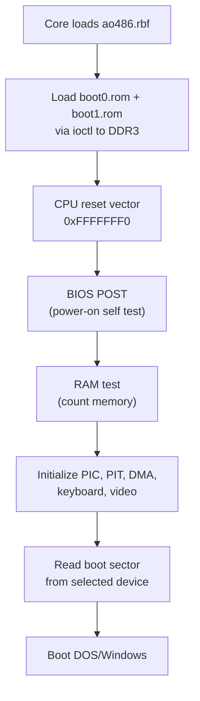

[← FPGA Cores Catalog](README.md) · [↑ Knowledge Base](../README.md)

# ao486: 486SX Soft CPU with DOS Compatibility

The ao486 core is a hardware-accurate recreation of the Intel 486SX microprocessor and its surrounding PC subsystem, running on the MiSTer FPGA. Originally written by Aleksander Osman and significantly reworked by Alexey Melnikov (Sorgelig), it provides a complete DOS and early Windows experience with Sound Blaster audio, SVGA graphics, IDE hard disks, and CD-ROM support.

This article covers the ao486 architecture, the 486SX soft CPU implementation, the PC subsystem emulation (VGA, IDE, Sound Blaster), and the DDR3-backed 256 MB RAM system.

Sources:
* [`ao486_MiSTer/README.md`](https://github.com/MiSTer-devel/ao486_MiSTer/blob/master/README.md)
* [`ao486_MiSTer/ao486.sv`](https://github.com/MiSTer-devel/ao486_MiSTer/blob/master/ao486.sv)
* Original core: [`alfikpl/ao486`](https://github.com/alfikpl/ao486)

---

## 1. Feature Summary

| Feature | Specification |
|---|---|
| **CPU** | 486SX (no FPU) at 15/30/56/90 MHz (configurable) |
| **RAM** | 256 MB (DDR3-backed) or 16 MB mode |
| **L1 Cache** | 8 KB unified (optional, toggleable) |
| **L2 Cache** | External (optional, toggleable) |
| **Video** | SVGA: up to 1280×1024@8bpp, 1024×768@16bpp, 640×480@24bpp |
| **Audio** | Sound Blaster 16 (DSP 4.05), SB Pro (DSP 3.02), OPL3, C/MS |
| **Storage** | 4 × HDD (up to 137 GB each), 2 × CD-ROM |
| **Floppy** | 1.44 MB floppy image support |
| **Serial** | UART at 3 Mbps (Internet via SLIP) |
| **MIDI** | MPU-401 (address 330h, IRQ 9), MT32-Pi support |
| **File Sharing** | MiSTerFS TSR for DOS↔Linux file exchange |

---

## 2. Core Architecture

### 2.1 Physical Partition: FPGA, DDR3, and HPS

The ao486 core splits the emulated PC across three physical domains. All logic — the 486SX CPU, ISA bus, and every peripheral — runs in the Cyclone V FPGA fabric. The DDR3 provides 256 MB of shared main RAM and VGA framebuffer. The HPS (ARM Cortex-A9 running Linux) has no emulation role; it serves disk images, handles input, and streams CD-DA audio.

```mermaid
flowchart TD
    subgraph FPGA["FPGA Fabric (Cyclone V)"]
        subgraph CPU["486SX CPU Subsystem"]
            I486["486SX Soft CPU<br/>(5-stage pipeline)"]
            L1["L1 Cache<br/>(8 KB unified)"]
        end

        subgraph MEMCTL["Memory Controller"]
            L2["L2 Cache<br/>(rtl/cache/)"]
            DDCTL["ddram.sv<br/>(DDR3 arbiter)"]
        end

        subgraph ISABUS["ISA I/O Bus"]
            IOBUS["I/O Bus<br/>(iobus.v)"]
            PIC["8259 PIC ×2<br/>(pic.v)"]
            PIT["8254 PIT<br/>(pit.v + speaker)"]
            DMA["8237 DMA<br/>(dma.v)"]
            PS2["PS/2 Ctrl<br/>(ps2.v)"]
            RTC["MC146818 RTC<br/>(rtc.v)"]
            JOY["Gameport<br/>(joystick.v)"]
        end

        subgraph PERIPH["ISA Peripherals"]
            VGA["SVGA Controller<br/>(vga.v — 85 KB)"]
            SND["Sound Blaster 16<br/>(sound/: DSP 4.05,<br/>OPL2/OPL3, C/MS)"]
            IDE0["IDE Channel 0<br/>(ide.v)"]
            IDE1["IDE Channel 1<br/>(ide.v)"]
            FDC["Floppy Controller<br/>(floppy.v)"]
            UART1["UART 16550 COM1<br/>(uart/)"]
            UART2["UART 16550 COM2<br/>(uart/)"]
            MPU["MPU-401 MIDI<br/>(mpu)"]
            CDDA_FPGA["CD-DA<br/>(cdda.v)"]
        end

        subgraph VIDPIPE["Video Output Pipeline"]
            VCLEAN["video_cleaner"]
            GAMMA["gamma_fast"]
            VFREAK["video_freak +<br/>video_scale_int"]
        end

        subgraph FRAMEWORK["MiSTer Framework Bridge"]
            HPS_IO["hps_io.sv<br/>(SPI: status, ioctl)"]
            HPS_EXT["hps_ext.v<br/>(EXT_BUS: IDE/FDD/CD-DA)"]
        end
    end

    subgraph DDR3["DDR3 SDRAM (256 MB on DE10-Nano)"]
        RAM["PC Main RAM<br/>(conventional + extended)"]
        FB["VGA Framebuffer<br/>(MISTER_FB mode)"]
        BIOS_SHADOW["BIOS ROM Shadow<br/>(boot0.rom + boot1.rom)"]
    end

    subgraph HPS["HPS (ARM Cortex-A9 + Linux)"]
        MAIN["Main_MiSTer"]
        IMGS["Disk Image Server<br/>(VHD, ISO/CUE/CHD, FDD)"]
        CDDA_SRV["CD-DA Audio Streamer"]
        HID["Input: Keyboard,<br/>Mouse, Gamepad"]
        OSD["OSD Menu"]
        NET["UART ↔ SLIP Network"]
        MT32["MT32-Pi Interface"]
    end

    I486 --> L1 --> L2 --> DDCTL
    VGA --> FB
    DDCTL --> RAM
    DDCTL --> FB
    DDCTL --> BIOS_SHADOW

    I486 --> IOBUS
    IOBUS --> PIC & PIT & DMA & PS2 & RTC & JOY
    IOBUS --> VGA & SND & IDE0 & IDE1 & FDC & UART1 & UART2 & MPU
    SND --> CDDA_FPGA

    VGA --> VCLEAN --> GAMMA --> VFREAK

    HPS_IO <-->|"SPI"| MAIN
    HPS_EXT <-->|"EXT_BUS<br/>cmd 0x61=wr<br/>cmd 0x62=rd<br/>cmd 0x63=MIDI"| MAIN

    IDE0 -->|"mgmt_req[2:0]<br/>addr 0xF0xx"| IMGS
    IDE1 -->|"mgmt_req[5:3]<br/>addr 0xF1xx"| IMGS
    FDC -->|"mgmt_req[7:6]<br/>addr 0xF2xx"| IMGS
    CDDA_FPGA -->|"cdda_req"| CDDA_SRV

    HPS_IO --> HID
    HPS_IO --> OSD
    UART1 --> NET
    MPU --> MT32
```



The key boundary is the **mgmt bus** (`mgmt_addr`, `mgmt_din`, `mgmt_dout`, `mgmt_req`) that passes through `hps_ext.v` to the HPS. The HPS never emulates PC hardware — it only provides data (disk sectors, floppy tracks, audio samples) on demand.

### 2.2 The 486SX Soft CPU

The ao486 core implements a complete Intel 486SX microprocessor in synthesizable Verilog. Key properties:

- **Pipeline**: 5-stage pipeline (fetch, decode, execute, memory, writeback)
- **No FPU**: The SX variant omits the floating-point unit — software FPU emulation via DOS or Windows
- **32-bit ALU**: Full 32-bit arithmetic and logic operations
- **Protected mode**: Supports real mode, protected mode, virtual 8086 mode
- **Paging**: Hardware page table walker with TLB
- **Cache**: 8 KB unified L1 cache (4-way set-associative, 16-byte lines)

The CPU clock is adjustable from the OSD:
- **15 MHz**: Cycle-accurate for speed-sensitive DOS games
- **30 MHz**: Approximate 386DX performance
- **56 MHz**: Fast 486 territory
- **90 MHz**: Maximum performance (default) — exceeds original 486SX33

> [!NOTE]
> The 90 MHz clock is possible because the soft CPU's pipeline can run faster than the original 486SX silicon — the FPGA's ALM fabric is significantly faster than 1990s process technology. However, the CPU's microarchitecture is still 486-class — it does not implement out-of-order execution, branch prediction, or superscalar issue.

### 2.3 Memory Architecture

The ao486 core uses DDR3 exclusively for its 256 MB main RAM:

| Region | Size | Location | Access |
|---|---|---|---|
| Conventional memory | 0–640 KB | DDR3 | Direct |
| Upper memory block | 640 KB–1 MB | DDR3 | ISA hole (mapped by PCI decode) |
| Extended memory | 1 MB–256 MB | DDR3 | Direct via `ddram.sv` |
| VGA framebuffer | Variable | DDR3 | Dual-ported via VGA controller |
| BIOS ROM | 256 KB | DDR3 (loaded via ioctl) | Read-only shadow |

Unlike the Minimig core which uses SDRAM for Chip RAM and DDR3 for Fast RAM, the ao486 core uses **DDR3 for everything**. This is viable because:

1. The PC architecture does not require cycle-accurate memory timing (unlike the Amiga's DMA)
2. The 486's L1 and L2 caches absorb DDR3 latency
3. ISA bus timing is decoupled from memory timing via wait states

### 2.4 VGA Controller

The ao486 implements an SVGA-compatible graphics controller supporting:

| Mode | Resolution | Colors |
|---|---|---|
| VGA | 640×480 | 16 |
| SVGA 8-bit | Up to 1280×1024 | 256 |
| SVGA 16-bit | Up to 1024×768 | 65,536 |
| SVGA 24-bit | Up to 640×480 | 16,777,216 |

The VGA controller includes:
- **CRTC** (Cathode Ray Tube Controller): Generates sync signals and memory address generation
- **Sequencer**: Controls memory access arbitration between CPU and display
- **Graphics controller**: Data path between CPU and framebuffer
- **Attribute controller**: Palette and mode control
- **DAC**: Digital-to-analog converter for RGB output

When `MISTER_FB` is enabled, the framebuffer is stored in DDR3 and the VGA controller uses the `FB_*` signals from `sys_top.v` to output video through the HDMI scaler.

### 2.5 Sound Blaster Implementation

The ao486 core implements a Sound Blaster 16 with DSP version 4.05, including:

| Component | Implementation |
|---|---|
| **DSP 4.05** | Full command set including 16-bit DMA, auto-init, ADPCM |
| **OPL3** | Yamaha YMF262 FM synthesis (6 operators, 4 channels) |
| **Mixer** | CT1745 mixer with master volume control |
| **C/MS** | Dual SAA1099 (optional, replaces OPL on ports 220-223) |
| **SB Pro compatibility** | DSP 3.02 command set available as fallback |

Sound Blaster configuration:
- Default: `A220 I5 D1 H5 T6`
- Alternative IRQ: 7, 10
- Alternative DMA: Various (configurable via `sbctl.exe`)

### 2.6 IDE Controller

The IDE controller supports up to 4 hard disk images (VHD format) and 2 CD-ROM drives:

| IDE Channel | Master | Slave |
|---|---|---|
| Primary (0) | HDD 0-0 | HDD 0-1 |
| Secondary (1) | CD-ROM 1-0 / HDD | CD-ROM 1-1 |

The IDE controller supports:
- LBA28 and LBA48 addressing
- CHS mode for older BIOS compatibility
- DMA transfers for CD-ROM
- ATAPI for CD-ROM commands
- Hot-swappable CD images (IDE 1-0)

VHD images can be up to 137 GB (LBA28 limit). The VHD format is a simple raw image with MBR — compatible with QEMU, VirtualBox, and most disk imaging tools.

---

## 3. Boot Process



The BIOS ROM (`boot0.rom` + `boot1.rom`) is loaded by `Main_MiSTer` during core initialization via the `ioctl` interface. The 486 CPU begins execution at the standard x86 reset vector (`0xFFFFFFF0`), which is mapped to the top of the BIOS ROM shadow in DDR3.

---

## 4. DOS Software Support

### 4.1 Included Utilities

| Utility | Purpose |
|---|---|
| `sysctl.exe` | Set CPU speed, L1/L2 cache from DOS command line |
| `sbctl.exe` | Configure Sound Blaster IRQ, DMA, address |
| `imgset.exe` | Mount/unmount floppy, CD, and HDD images from DOS |
| `misterfs.exe` | MiSTer shared folder TSR (maps `shared/` to DOS drive letter) |
| `mpuctl.exe` | Control external MT32-Pi synthesizer |
| `MISTERFB.DRV` | Windows 3.x/9x video driver for MiSTer framebuffer |

### 4.2 Speed-Sensitive Games

Many DOS games rely on specific CPU timing and fail at higher speeds:

| Game | Required Setting |
|---|---|
| Wing Commander | 15 MHz, L1 off |
| Ultima VII | 30 MHz |
| Doom | 56–90 MHz, L1/L2 on |
| Quake | 90 MHz, all caches on (barely playable) |

The `sysctl.exe` utility allows per-game speed configuration in batch files:

```batch
sysctl 15MHz L1- L2-
wing.exe
sysctl 90MHz L1+ L2+
```

---

## 5. Network and File Sharing

The ao486 core provides two communication channels: UART serial (for TCP/IP networking via SLIP/PPP) and the MiSTerFS shared folder (for file transfer via DDR3 shared memory). See the dedicated [ao486 Networking & File Sharing](ao486_networking.md) article for architecture details, protocol analysis, and setup guides for DOS, Windows 9x, and Linux guests.

---

## 6. CD-ROM Support

The ao486 core supports data CD-ROM images in multiple formats:

| Format | Extension | Notes |
|---|---|---|
| ISO 9660 | `.iso` | Simplest and most reliable |
| BIN/CUE | `.bin` + `.cue` | Mount the `.bin` file directly |
| CHD | `.chd` | MAME compressed format, mount directly |
| IMG | `.img` | Raw image |

CD-ROM audio (Red Book CD-DA) is not currently implemented. Only the data portion of discs is accessible.

IDE channel 1, device 0 (secondary master) has a special CD-ROM placeholder function — it supports hot-swapping of CD images without rebooting the core. Once an HDD image is loaded into this slot, it reverts to normal HDD mode.

---

## 7. Building the Core

The ao486 README provides a Docker-based build workflow that avoids the Quartus 17.0 Linux installation issues:

```bash
# Pull the Quartus 17.0 Docker image
docker pull ghcr.io/raetro/quartus:mister

# Build the core
docker run -it --rm -v $(pwd):/build raetro/quartus:mister \
    quartus_sh --flow compile ao486.qpf
```

Source: [`ao486_MiSTer/README.md:L101-114`](https://github.com/MiSTer-devel/ao486_MiSTer/blob/master/README.md#L101)

This Docker image is maintained by the [raetro/sdk-docker-fpga](https://github.com/raetro/sdk-docker-fpga) project and includes Quartus Lite 17.0.2 pre-installed with the Cyclone V device support.

---

## 8. Common Pitfalls

### 8.1 Missing BIOS ROMs

The core requires `boot0.rom` and `boot1.rom` in the `games/ao486/` directory. Without them, the core will not boot — there is no built-in BIOS fallback.

### 8.2 Windows IDE Driver Issues

Windows 9x may show a yellow exclamation mark on the Secondary IDE controller. This is a known issue — the driver works through BIOS rather than native Windows IDE. The recommendation is to delete the flagged device from Device Manager.

### 8.3 Speed-Sensitive Game Crashes

Running old DOS games at 90 MHz with caches enabled can cause crashes, lockups, or incorrect timing in games that rely on CPU speed for delays.

**Fix**: Use `sysctl.exe` to reduce speed before launching sensitive games.

### 8.4 VHD Image Preparation

VHD files must have a valid MBR (Master Boot Record). An empty file filled with zeros will not work — it must be partitioned and formatted (e.g., via `fdisk` and `format` from DOS).

---

## Read Also

* [DDR3 Architecture](../06_fpga_subsystem/ddr3_architecture.md) — How `ddram.sv` provides byte-level DDR3 access for the 486's memory
* [Memory Controllers](../06_fpga_subsystem/memory_controllers.md) — Why DDR3 works for PC-style RAM but not for cycle-accurate console RAM
* [Template Walkthrough](../07_fpga_cores_architecture/template_walkthrough.md) — Standard core structure (ao486 follows this with extensions)
* [Build Pipeline](../07_fpga_cores_architecture/build/overview.md) — Quartus build process including Docker-based compilation
* [Audio Pipeline](../09_video_audio/audio_pipeline_deep_dive.md) — How Sound Blaster audio mixes with MiSTer's HDMI output
* [Networking & File Sharing](ao486_networking.md) — UART SLIP networking, MiSTerFS shared-memory file system, guest OS setup
