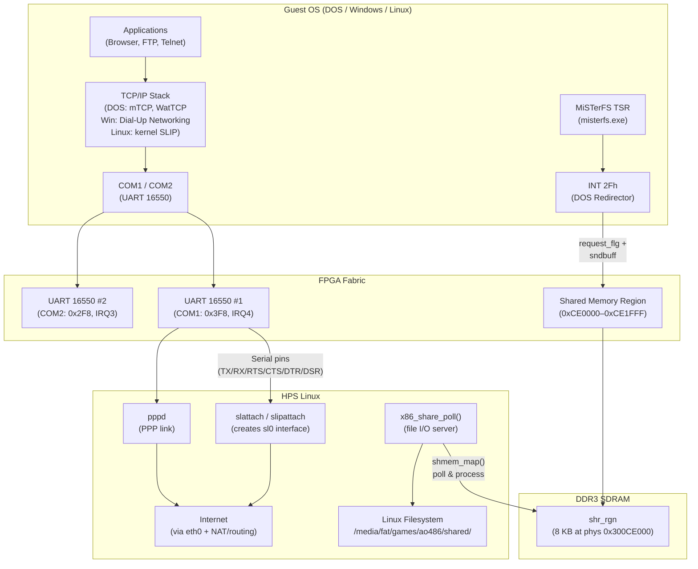
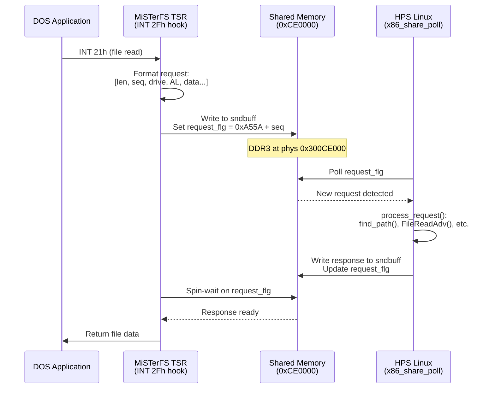

[← FPGA Cores Catalog](README.md) · [↑ Knowledge Base](../README.md)

# ao486 Networking and File Sharing

The ao486 core provides two distinct communication channels between the emulated PC and the outside world: a **UART serial link** (for TCP/IP networking via SLIP) and a **shared-memory file system** (MiSTerFS). There is no Ethernet card emulation — no NE2000, no packet driver hardware. All networking flows through serial ports or through a memory-mapped request/response protocol in DDR3.

Sources:
* [`ao486_MiSTer/sw/MiSTerFS/MiSTerFS.C`](https://github.com/MiSTer-devel/ao486_MiSTer/blob/master/sw/MiSTerFS/MiSTerFS.c) — DOS TSR (Terminate-and-Stay-Resident) redirector
* [`ao486_MiSTer/rtl/soc/uart/`](https://github.com/MiSTer-devel/ao486_MiSTer/tree/master/rtl/soc/uart) — 16550 UART implementation (21 files)
* [`Main_MiSTer/support/x86/x86_share.cpp`](https://github.com/MiSTer-devel/Main_MiSTer/blob/master/support/x86/x86_share.cpp) — HPS-side file server
* [`Main_MiSTer/support/x86/x86.cpp`](https://github.com/MiSTer-devel/Main_MiSTer/blob/master/support/x86/x86.cpp) — HPS-side core management

---

## 1. Networking Overview



---

## 2. UART Serial Networking

### 2.1 Hardware

The ao486 core instantiates two 16550-compatible UARTs in the FPGA fabric:

| Port | I/O Base | IRQ | Connection |
|---|---|---|---|
| COM1 | 0x3F8 | 4 | HPS UART (default), or USER I/O |
| COM2 | 0x2F8 | 3 | USER I/O port (when enabled in OSD) |

Both UARTs support full modem control signals (RTS, CTS, DTR, DSR, DCD). The baud rate is configurable from the OSD — the CONF_STR declares `UART115200:4000000(Turbo 115200)`, meaning the standard rate is 115200 baud with a "Turbo" mode at 4 MHz for faster transfers.

The UART clock is generated by a dedicated PLL output (`clk_uart1`, `clk_uart2`) separate from the CPU clock, so serial timing remains stable regardless of CPU speed settings.

### 2.2 SLIP Under DOS

SLIP (Serial Line Internet Protocol) is the simplest way to get TCP/IP working over a serial link. The setup requires:

**On the MiSTer (HPS Linux):**

```bash
# Attach a SLIP interface to the serial port
slattach -L -p slip -s 115200 /dev/ttyS0 &
# Configure the interface
ifconfig sl0 10.0.2.1 pointopoint 10.0.2.2 up
# Enable IP forwarding and NAT
echo 1 > /proc/sys/net/ipv4/ip_forward
iptables -t nat -A POSTROUTING -o eth0 -j MASQUERADE
```

**On DOS:**

Use a DOS TCP/IP stack that supports SLIP. The most popular choices:

| Stack | Features |
|---|---|
| **mTCP** | Lightweight, supports SLIP, DHCP, FTP, HTTP, Telnet, Ping |
| **WatTCP / Watt-32** | Open source, SLIP/PPP, used by many DOS networking apps |
| **KA9Q NOS** | Full-featured, routing, SMTP/POP, but complex |

Example `mTCP` configuration (`MTCP.CFG`):

```ini
PACKETINT 0x60
IPAddress 10.0.2.2
Netmask 255.255.255.0
Gateway 10.0.2.1
Nameserver 8.8.8.8
```

> [!NOTE]
> mTCP uses its own packet driver that talks directly to the UART — it does not need a separate SLIP driver. Other stacks may require the `SLIP8250` or `SLIPPER` packet driver.

### 2.3 Dial-Up Networking Under Windows 9x

Windows 95/98 can use the serial port as a modem connection via Dial-Up Networking:

1. Install the included `modem9x.inf` driver (standard 28800 baud modem)
2. Create a Dial-Up Networking connection to a dummy number
3. Configure the connection to use SLIP or PPP
4. On the HPS side, run `pppd` with a matching configuration:

```bash
pppd /dev/ttyS0 115200 10.0.2.1:10.0.2.2 noauth local
```

Windows will then have a working TCP/IP connection with full Winsock support.

### 2.4 Networking Under Linux (Guest)

When running Linux as a guest OS on ao486, SLIP support is built into the kernel:

```bash
# On guest Linux
slattach -p slip -s 115200 /dev/ttyS0 &
ifconfig sl0 10.0.2.2 pointopoint 10.0.2.1 up
route add default gw 10.0.2.1
```

The HPS side configuration is the same as for DOS (see §2.2).

---

## 3. MiSTerFS Shared Folder

### 3.1 Architecture

MiSTerFS is **not** a network file system in the traditional sense. It uses a **shared memory region** in DDR3 as the communication channel between the DOS TSR and the HPS Linux process. There is no Ethernet frame, no packet driver, no TCP/IP involved.

The mechanism:

1. The DOS TSR (`misterfs.exe`) hooks **INT 2Fh** (the DOS redirector interface)
2. When DOS performs a file operation on the mapped drive, the TSR formats a request into a buffer at **physical address `0xCE000000`** in the DDR3 address space
3. The HPS-side server (`x86_share_poll()` in `x86_share.cpp`) polls this shared memory region on every main loop iteration
4. The server processes the request against the Linux filesystem and writes the response back to the same buffer
5. The TSR reads the response and returns it to DOS



### 3.2 Shared Memory Protocol

The shared memory region is 8 KB (`0x2000` bytes) at DDR3 physical address `0x300CE000`, which the HPS maps via:

```c
// x86_share.cpp
#define SHMEM_ADDR  0x300CE000
#define SHMEM_SIZE  0x2000
shmem = (uint8_t *)shmem_map(SHMEM_ADDR, SHMEM_SIZE);
```

The DOS TSR accesses this region through far pointers into the PC's memory map at segment `0xCE00`:

```c
// MiSTerFS.C
static unsigned short far *request_flg        = (unsigned short far *)0xCE000000UL;
static unsigned char  far *glob_pktdrv_sndbuff = (unsigned char  far *)0xCE000004UL;
```

**Request format** (8-byte header + payload):

| Offset | Size | Field |
|---|---|---|
| 0x00 | 2 | Total frame length |
| 0x02 | 1 | Sequence number |
| 0x03 | 1 | Drive number |
| 0x04 | 1 | AL subfunction code |
| 0x05 | 3 | Reserved |
| 0x08 | ... | Payload (path, file data, etc.) |

**Handshake sequence** (from the TSR's `sendquery()` function):

1. TSR writes request to `sndbuff` at `0xCE000004`
2. TSR writes magic `0xA55A` to `request_flg[1]`
3. TSR computes a new token: `(old_counter + 77) << 8 | (old_counter + 1) & 0xFF` and writes it to `request_flg[0]`
4. TSR spin-waits until `request_flg[1]` matches the token it wrote
5. HPS detects the new request, processes it, writes the response back to `sndbuff`
6. HPS writes the request ID to `request_flg + 2`, completing the handshake

### 3.3 Supported File Operations

The TSR intercepts INT 2Fh/AH=11h (redirector) calls and translates them into shared-memory requests. The HPS server handles the following subfunctions:

| Code | AL | Operation | Notes |
|---|---|---|---|
| 0x01 | `AL_RMDIR` | Remove directory | |
| 0x03 | `AL_MKDIR` | Create directory | |
| 0x05 | `AL_CHDIR` | Change directory | Validates path existence only; DOS updates CDS |
| 0x06 | `AL_CLSFIL` | Close file | Decrements SFT handle count |
| 0x07 | `AL_CMMTFIL` | Commit file | No-op in implementation |
| 0x08 | `AL_READFIL` | Read file | Chunked in 1024-byte transfers |
| 0x09 | `AL_WRITEFIL` | Write file | Chunked in 1024-byte transfers |
| 0x0A | `AL_LOCKFIL` | Lock file range | |
| 0x0C | `AL_DISKSPACE` | Disk free space | Reports Linux disk stats via FAT16-style conversion |
| 0x0E | `AL_SETATTR` | Set attributes | |
| 0x0F | `AL_GETATTR` | Get attributes | Returns time, date, size, attributes |
| 0x11 | `AL_RENAME` | Rename file | Must be same drive |
| 0x13 | `AL_DELETE` | Delete file | Supports wildcards |
| 0x16 | `AL_OPEN` | Open file | Returns SFT entry with 25-byte response |
| 0x17 | `AL_CREATE` | Create file | |
| 0x1B | `AL_FINDFIRST` | Find first | Creates a lock token for FindNext sequence |
| 0x1C | `AL_FINDNEXT` | Find next | Uses lock token from FindFirst |
| 0x21 | `AL_SKFMEND` | Seek from end | |
| 0x2E | `AL_SPOPNFIL` | Open with mode | DOS 4+ extended open |

### 3.4 TSR Installation

```batch
REM Install MiSTerFS, map shared folder to drive S:
misterfs S:

REM Quiet mode (no banner)
misterfs S: /q

REM Unload the TSR
misterfs /u
```

The TSR requires DOS 5.0 or later. It allocates memory with "last fit" strategy to avoid fragmentation, hooks INT 2Fh, and registers the drive as a network drive (`CDSFLAG_NET | CDSFLAG_PHY`) in the DOS CDS (Current Directory Structure).

### 3.5 HPS-Side Configuration

The shared folder path is configured in `MiSTer.ini`:

```ini
; Custom shared folder (currently minimig and ao486 only)
shared_folder=games/ao486/shared
```

If `shared_folder` is absolute (starts with `/`), it is used as-is. Otherwise, it is relative to `/media/fat/`. If empty, the default is `/media/fat/games/CORENAME/shared`.

The HPS server in `x86_share.cpp` resolves all paths through `find_path()`, which:
- Converts backslashes to forward slashes
- Resolves `.` and `..` components
- Prevents directory traversal above the base path
- Validates that the parent directory exists

### 3.6 Limitations

| Limitation | Reason |
|---|---|
| **8.3 filenames only** | DOS redirector API uses FCB-style names; no LFN support |
| **No execute from share** | The TSR is designed for file transfer, not running programs |
| **No long filename support** | SFN (Short Filename) only — Linux files with long names are invisible |
| **8 KB shared memory** | Limits maximum frame size to ~1090 bytes; file reads/writes chunked at 1024 bytes |
| **Polling latency** | HPS polls on every `x86_poll()` iteration; not interrupt-driven |
| **Single drive letter** | Only one drive letter can be mapped per TSR instance |

---

## 4. Practical Setup Guides

### 4.1 DOS: Internet Access via SLIP + mTCP

1. Download [mTCP](https://www.brutman.com/mTCP/) and extract to your VHD
2. On the MiSTer, create `/media/fat/Scripts/setup_slip.sh`:

```bash
#!/bin/bash
slattach -L -p slip -s 115200 /dev/ttyS0 &
sleep 1
ifconfig sl0 10.0.2.1 pointopoint 10.0.2.2 up
echo 1 > /proc/sys/net/ipv4/ip_forward
iptables -t nat -A POSTROUTING -o eth0 -j MASQUERADE
```

3. Run the script: `chmod +x /media/fat/Scripts/setup_slip.sh && /media/fat/Scripts/setup_slip.sh`
4. On DOS, create `MTCP.CFG`:

```ini
PacketInt 0x60
IPAddress 10.0.2.2
Netmask 255.255.255.0
Gateway 10.0.2.1
Nameserver 8.8.8.8
```

5. Run mTCP applications: `HTGET`, `FTP`, `TELNET`, `PING`

### 4.2 Windows 9x: Dial-Up Networking

1. Install `modem9x.inf` from the [ao486 drivers](https://github.com/MiSTer-devel/ao486_MiSTer/tree/master/releases/drv) folder
2. Set up a Dial-Up Networking connection
3. On the HPS, run:

```bash
pppd /dev/ttyS0 115200 10.0.2.1:10.0.2.2 noauth local passive
```

4. Initiate the connection from Windows — it should connect and obtain the IP address
5. Install a browser (e.g., Internet Explorer 5 from a CD image) or use built-in Winsock applications

### 4.3 DOS: File Transfer via MiSTerFS

1. Create the shared folder on the MiSTer SD card: `mkdir -p /media/fat/games/ao486/shared`
2. Copy files (8.3 names only!) to the shared folder from Linux
3. On DOS, install the TSR:

```batch
misterfs S:
```

4. Copy files:

```batch
copy S:GAME.ZIP C:\GAMES\
copy C:\SAVE\SAVE.DAT S:\
```

5. When done, unload: `misterfs /u`

### 4.4 Linux Guest: SLIP Networking

1. Boot a Linux distribution on ao486 (e.g., a minimal Debian install on a VHD)
2. On the HPS side, set up SLIP (same as §4.1)
3. On the guest Linux:

```bash
slattach -p slip -s 115200 /dev/ttyS0 &
ifconfig sl0 10.0.2.2 pointopoint 10.0.2.1 up
route add default gw 10.0.2.1
echo "nameserver 8.8.8.8" > /etc/resolv.conf
```

---

## 5. Comparison of Communication Channels

| Feature | UART Serial (SLIP/PPP) | MiSTerFS Shared Folder |
|---|---|---|
| **Medium** | Physical serial pins (TX/RX) | DDR3 shared memory |
| **Protocol** | SLIP or PPP | Custom INT 2Fh redirector |
| **Requires TCP/IP stack** | Yes | No |
| **Bandwidth** | Up to 3 Mbps | Limited by polling latency (~1 KB chunks) |
| **Use case** | Internet access, remote access | Simple file transfer |
| **Bidirectional** | Yes | Yes (read/write) |
| **Guest OS support** | DOS, Windows, Linux | DOS only (TSR required) |
| **Filename support** | N/A (not a file system) | 8.3 SFN only |
| **Can run programs** | N/A | No (transfer only) |
| **HPS processing** | Linux kernel (slattach/pppd) | Main_MiSTer (x86_share_poll) |

---

## Read Also

* [ao486 Core Architecture](ao486.md) — The 486SX soft CPU, ISA bus, and peripheral implementation
* [DDR3 Architecture](../06_fpga_subsystem/ddr3_architecture.md) — How `ddram.sv` provides the shared memory region used by MiSTerFS
* [Audio Pipeline](../09_video_audio/audio_pipeline_deep_dive.md) — How Sound Blaster audio mixes with MiSTer's HDMI output
