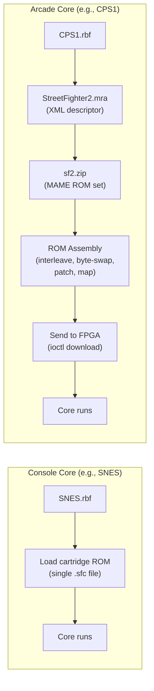
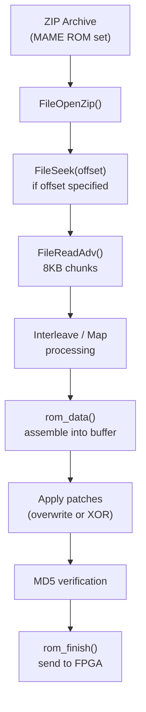
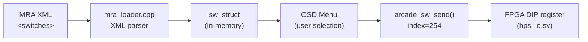
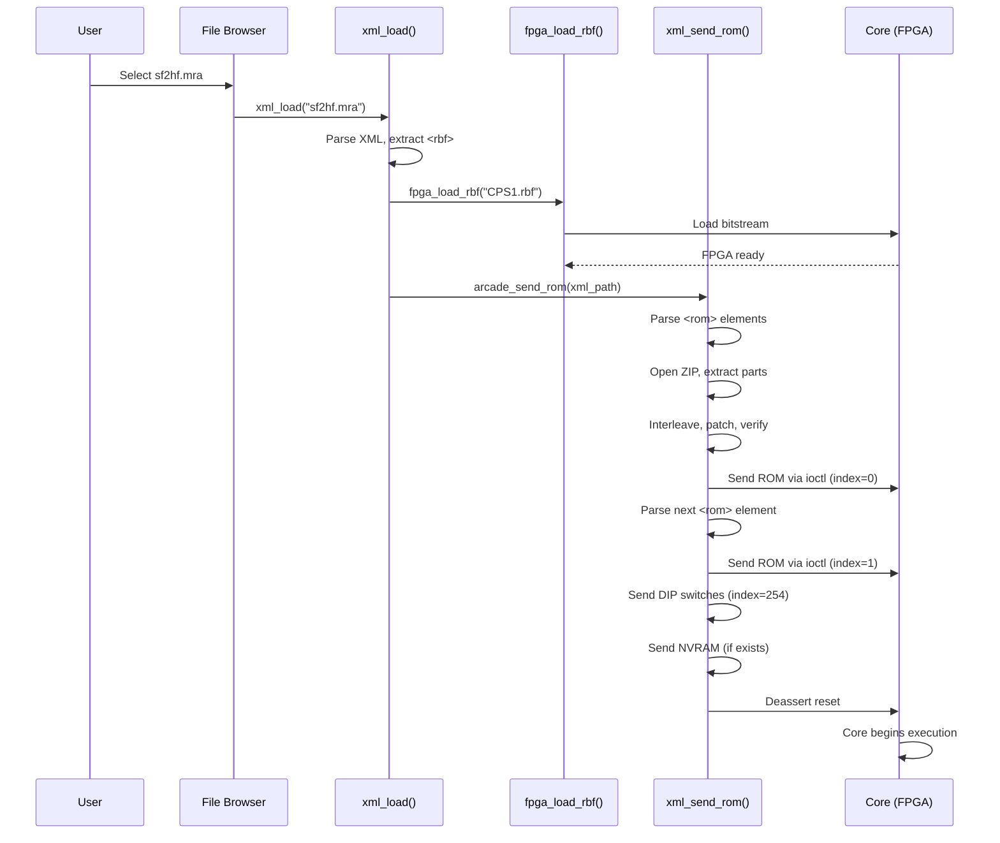
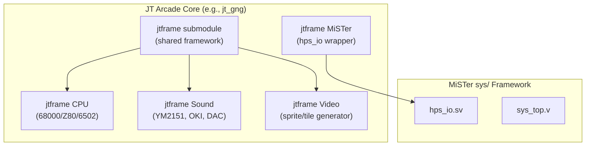

[← FPGA Cores Catalog](README.md) · [↑ Knowledge Base](../README.md)

# Arcade Cores & the MRA Format

Arcade cores are the most complex and numerous core type on MiSTer. Unlike console cores where a single RBF loads one cartridge ROM, an arcade core RBF can run dozens of different games — each with its own unique PCB layout, ROM arrangement, and DIP switch configuration. The **MRA (MiSTer ROM Archive)** XML format bridges this gap: it tells `Main_MiSTer` which ZIP files to open, how to extract and interleave ROM parts, and which DIP switches to present to the user.

This article covers the arcade core architecture, the MRA XML schema in detail, the ROM assembly pipeline in `mra_loader.cpp`, and the DIP switch system.

Sources:
* [`Main_MiSTer/support/arcade/mra_loader.cpp`](https://github.com/MiSTer-devel/Main_MiSTer/blob/master/support/arcade/mra_loader.cpp)
* [`Main_MiSTer/support/arcade/mra_loader.h`](https://github.com/MiSTer-devel/Main_MiSTer/blob/master/support/arcade/mra_loader.h)
* [`Main_MiSTer/support/arcade/buffer.cpp`](https://github.com/MiSTer-devel/Main_MiSTer/blob/master/support/arcade/buffer.cpp)
* [`Template_MiSTer/sys/hps_io.sv`](https://github.com/MiSTer-devel/Template_MiSTer/blob/master/sys/hps_io.sv)

---

## 1. Why Arcade Cores Are Different



| Aspect | Console Core | Arcade Core |
|---|---|---|
| ROM format | Single file (.nes, .sfc, .md) | Multiple parts from ZIP (MAME format) |
| ROM loading | Direct file download | MRA-mediated assembly and merge |
| Configuration | Per-core MiSTer.ini | Per-game DIP switches |
| One RBF = | One system | Many games (e.g., CPS1 runs 50+ games) |
| Input mapping | Generic gamepad | Per-game button labels via MRA |
| High scores | Save state | NVRAM (battery-backed RAM emulation) |

---

## 2. MRA File Format

An MRA file is an XML document with root element `<misterromdescription>`. Here is a representative example:

```xml
<?xml version="1.0" encoding="UTF-8"?>
<misterromdescription>
    <about>
        <author>Jotego</author>
    </about>
    <name>Street Fighter II': Hyper Fighting</name>
    <setname>sf2hf</setname>
    <year>1992</year>
    <manufacturer>Capcom</manufacturer>
    <rbf>CPS1</rbf>
    <rotation>vertical|horizontal (cw|ccw)</rotation>

    <rom index="0" zip="sf2hf.zip" md5="abcdef0123456789">
        <interleave output="16" input="8">
            <part name="sf2hf.30a" crc="12345678" map="01"/>
            <part name="sf2hf.37a" crc="23456789" map="10"/>
        </interleave>
        <part name="sf2hf.31a" crc="34567890"/>
        <part repeat="8" offset="0xFF0000">FF</part>
        <patch offset="0x1234" operation="xor">AB CD</patch>
    </rom>

    <rom index="1" zip="sf2hf.zip">
        <part name="sf2hf.q523" crc="45678901"/>
    </rom>

    <switches default="FF,07">
        <dip name="Coinage" bits="0,3" ids="4C/1C,3C/1C,2C/1C,1C/1C,1C/2C,1C/3C,1C/4C,Free Play"/>
        <dip name="Difficulty" bits="4,5" ids="Easy,Medium,Hard,Hardest"/>
        <dip name="Freeze" bits="6" ids="Off,On"/>
        <dip name="Flip Screen" bits="7" ids="Off,On"/>
    </switches>

    <buttons names="Punch L,Punch M,Punch H,Kick L,Kick M,Kick H" default="A,B,C,X,Y,Z"/>
</misterromdescription>
```

### 2.1 Top-Level Elements

| Element | Required | Purpose |
|---|---|---|
| `<name>` | Yes | Full game name shown in file browser |
| `<setname>` | Yes | Short identifier (usually MAME set name) |
| `<year>` | No | Original release year |
| `<manufacturer>` | No | Original manufacturer |
| `<rbf>` | Yes | Which core RBF to load (e.g., `CPS1`) |
| `<rotation>` | No | `horizontal` (default), `vertical` (cw or ccw) |
| `<rom>` | Yes (1+) | ROM assembly definition (see §2.2) |
| `<switches>` | No | DIP switch definitions (see §2.3) |
| `<buttons>` | No | Custom button label mapping (see §2.4) |
| `<about>` | No | Author credit |
| `<nvram>` | No | NVRAM index and size for save/restore |
| `<cheat>` | No | Cheat definitions |

### 2.2 The `<rom>` Element

The `<rom>` element is the heart of the MRA format. It defines how to assemble a ROM image from one or more source files.

```xml
<rom index="N" zip="archive.zip" name="altname" md5="..." address="0x...">
    <part name="filename" zip="override.zip" offset="0x..." length="N" 
          repeat="N" crc="..." map="0x..."/>
    <interleave output="N" input="N">
        <part .../>
    </interleave>
    <patch offset="0x..." operation="xor">XX YY</patch>
</rom>
```

| Attribute | Applies To | Purpose |
|---|---|---|
| `index` | `<rom>` | ROM index sent to FPGA (0=main program, 1+=data/audio) |
| `zip` | `<rom>`, `<part>` | ZIP file to search for parts. `<part>` zip overrides `<rom>` zip |
| `name` | `<rom>` | Alternative game name for ROM selection |
| `md5` | `<rom>` | Expected MD5 of the final assembled ROM (verification) |
| `address` | `<rom>` | DDR3 address for direct memory load (bypasses ioctl streaming) |
| `name` | `<part>` | Filename within the ZIP archive |
| `offset` | `<part>` | Byte offset within the file (skip header bytes) |
| `length` | `<part>` | Number of bytes to extract (0 or negative = all) |
| `repeat` | `<part>` | Repeat the part N times (fill with padding) |
| `crc` | `<part>` | Expected CRC32 for verification |
| `map` | `<part>` | Byte interleave map (see §2.2.2) |
| `offset` | `<patch>` | Address within assembled ROM to apply patch |
| `operation` | `<patch>` | `xor` for XOR patch, otherwise overwrite |

#### 2.2.1 Part Extraction Pipeline



Source: [`mra_loader.cpp:L285-384`](https://github.com/MiSTer-devel/Main_MiSTer/blob/master/support/arcade/mra_loader.cpp#L285)

#### 2.2.2 The `map` Attribute: Byte Interleaving

The `map` attribute is a hex-encoded nibble map that controls how bytes from a part are distributed across multiple interleaved streams. This is essential for arcade PCBs where ROMs are physically wired to alternate bytes on the data bus.

For example, two 8-bit ROMs interleaved into a 16-bit word:

```xml
<interleave output="16" input="8">
    <part name="rom_even.bin" map="01"/>  <!-- bytes go to even positions -->
    <part name="rom_odd.bin" map="10"/>   <!-- bytes go to odd positions -->
</interleave>
```

The `map` value is parsed nibble-by-nibble from least significant to most significant:

| Map Value | Nibble 0 | Nibble 1 | Meaning |
|---|---|---|---|
| `01` | `1` | `0` | 1st output byte from this part, gap at position 1 |
| `10` | `0` | `1` | Gap at position 0, 2nd output byte from this part |
| `21` | `1` | `2` | 1st output byte at pos 0, 2nd output byte at pos 1 |

Source: [`mra_loader.cpp:L240-283`](https://github.com/MiSTer-devel/Main_MiSTer/blob/master/support/arcade/mra_loader.cpp#L240)

The `interleave` element wraps parts that should be merged:
- `input`: Size of each part in bits (typically 8)
- `output`: Size of the interleaved word in bits (8, 16, or 32)

#### 2.2.3 The `<part>` Element Without Interleave

When a `<part>` appears directly under `<rom>` (not inside `<interleave>`), it is concatenated sequentially. The optional `repeat` attribute duplicates the part content:

```xml
<!-- Fill 8 bytes of value 0xFF starting at offset 0xFF0000 -->
<part repeat="8" offset="0xFF0000">FF</part>
```

This is commonly used for padding between ROM regions.

#### 2.2.4 The `<patch>` Element

Patches modify the assembled ROM in-place after all parts have been merged:

```xml
<!-- XOR patch: flip specific bits at offset 0x1234 -->
<patch offset="0x1234" operation="xor">AB CD</patch>

<!-- Overwrite patch: replace bytes at offset 0x5678 -->
<patch offset="0x5678">00 01 02 03</patch>
```

Source: [`mra_loader.cpp:L312-325`](https://github.com/MiSTer-devel/Main_MiSTer/blob/master/support/arcade/mra_loader.cpp#L312)

### 2.3 The `<switches>` Element: DIP Switches

Arcade PCBs have physical DIP switches for configuring coinage, difficulty, lives, etc. The MRA format defines these as a virtual DIP block:

```xml
<switches default="FF,07">
    <dip name="Coinage" bits="0,3" ids="4C/1C,3C/1C,2C/1C,1C/1C,1C/2C,1C/3C,1C/4C,Free Play"/>
    <dip name="Difficulty" bits="4,5" ids="Easy,Medium,Hard,Hardest"/>
    <dip name="Freeze" bits="6" ids="Off,On"/>
    <dip name="Flip Screen" bits="7" ids="Off,On"/>
</switches>
```

| Attribute | Purpose |
|---|---|
| `default` (on `<switches>`) | Hex-encoded default DIP values (e.g., `FF,07` = 2 bytes = 16 bits) |
| `name` (on `<dip>`) | Label shown in OSD menu |
| `bits` | Bit range: single bit (`5`) or range (`0,3`) |
| `ids` | Comma-separated labels for each value in the range |
| `values` | Explicit numeric values for each option (alternative to sequential) |

Source: [`mra_loader.cpp:L611-692`](https://github.com/MiSTer-devel/Main_MiSTer/blob/master/support/arcade/mra_loader.cpp#L611)

#### DIP Switch Data Flow



The DIP switch values are sent to the FPGA as a binary blob via `ioctl` with index 254:

```c
// mra_loader.cpp:L120-130
void arcade_sw_send() {
    sw_struct *sw = arcade_sw();
    if (sw->dip_num) {
        user_io_set_index(254);                            // special DIP index
        user_io_set_download(1);
        user_io_file_tx_data((uint8_t*)&sw->dip_cur, sizeof(sw->dip_cur));
        user_io_set_download(0);
    }
}
```

Source: [`mra_loader.cpp:L120-130`](https://github.com/MiSTer-devel/Main_MiSTer/blob/master/support/arcade/mra_loader.cpp#L120)

DIP switch selections are persisted to `/media/fat/Config/dips/<setname>` so they survive core reloads.

### 2.4 The `<buttons>` Element

The `<buttons>` element defines custom button labels for the OSD input mapping screen:

```xml
<buttons names="Punch L,Punch M,Punch H,Kick L,Kick M,Kick H" 
         default="A,B,C,X,Y,Z"/>
```

- `names`: Comma-separated labels shown in the OSD
- `default`: Default controller button mapping (A=face button, B/C/X/Y/Z=other buttons)

This is parsed in `mra_loader.cpp` and applied via `set_ovr_buttons()`.

---

## 3. ROM Assembly Pipeline

### 3.1 Loading Sequence

When a user selects an MRA file from the file browser:



Source: [`mra_loader.cpp:L1301-1327`](https://github.com/MiSTer-devel/Main_MiSTer/blob/master/support/arcade/mra_loader.cpp#L1301)

### 3.2 ROM Index Convention

The `<rom index="N">` attribute determines how the FPGA receives the data:

| Index | Meaning | Typical Content |
|---|---|---|
| 0 | Main program ROM | CPU code, usually loaded into SDRAM |
| 1 | Data ROM | Graphics tiles, audio samples |
| 2–7 | Additional ROMs | Layer graphics, extra sample data |
| 254 | DIP switches | Binary blob of switch positions |
| 255 | NVRAM | Battery-backed save data |

Source: [`mra_loader.cpp:L336-337`](https://github.com/MiSTer-devel/Main_MiSTer/blob/master/support/arcade/mra_loader.cpp#L336)

### 3.3 Address-Based Loading

When the `<rom>` element has an `address` attribute, the ROM data is written directly to DDR3 at the specified address instead of being streamed through `ioctl`:

```c
// mra_loader.cpp:L342-345
if (address) {
    shmem_put(fpga_mem(address), len, data);
}
```

This is significantly faster than ioctl streaming for large data ROMs (graphics, audio samples) because it uses the shared-memory bridge instead of the bit-banged SSPI protocol.

### 3.4 MD5 Verification

After assembly, the ROM's MD5 hash is compared against the `md5` attribute in the MRA:

```c
// mra_loader.cpp — checksum verification
if (arc_info->md5[0]) {
    unsigned char digest[16];
    MD5Final(digest, &arc_info->context);
    // compare with expected md5 from MRA
}
```

If the MD5 doesn't match:
- A warning is displayed, but the ROM is still sent to the FPGA
- This allows modified ROMs and homebrew to work
- The MD5 is primarily for detecting corrupted ROM sets

---

## 4. NVRAM Save/Restore

Arcade games often have battery-backed NVRAM for high scores and bookkeeping. The MRA loader supports this:

### 4.1 Save on Core Exit

```c
// mra_loader.cpp:L66-88
void arcade_nvm_save() {
    if (nvram_idx && nvram_size) {
        // Request data from FPGA via ioctl upload
        user_io_set_index(nvram_idx);
        user_io_set_upload(1);
        user_io_file_rx_data(buf, nvram_size);
        user_io_set_upload(0);
        
        // Save to /media/fat/Config/nvram/<name>
        FileSave(path, buf, nvram_size);
    }
}
```

### 4.2 Restore on Core Load

```c
// mra_loader.cpp:L90-113
void arcade_nvm_load() {
    if (nvram_idx && nvram_size) {
        // Load from /media/fat/Config/nvram/<name>
        if (FileLoadConfig(path, buf, nvram_size)) {
            // Send to FPGA via ioctl download
            user_io_set_index(nvram_idx);
            user_io_set_download(1);
            user_io_file_tx_data(buf, nvram_size);
            user_io_set_download(0);
        }
    }
}
```

Source: [`mra_loader.cpp:L66-113`](https://github.com/MiSTer-devel/Main_MiSTer/blob/master/support/arcade/mra_loader.cpp#L66)

---

## 5. MGL (MiSTer Game Launch) Format

MGL files are a simplified alternative to MRA for non-arcade cores. They define a sequence of file-load and reset operations:

```xml
<?xml version="1.0" encoding="UTF-8"?>
<mistergamedescription>
    <file delay="1" type="S" index="0" path="path/to/game.rom"/>
    <reset delay="1"/>
</mistergamedescription>
```

| Attribute | Meaning |
|---|---|
| `delay` | Seconds to wait before executing this step |
| `type` | `S` = SD card file, `F` = FPGA bitstream |
| `index` | ioctl index for the file download |
| `path` | File path relative to the root directory |
| `hold` | (on `<reset>`) Hold reset for N seconds |

Source: [`mra_loader.cpp:L1329-1440`](https://github.com/MiSTer-devel/Main_MiSTer/blob/master/support/arcade/mra_loader.cpp#L1329)

MGL files enable one-click game launching from external tools (NFC tags, web interfaces, scripts).

---

## 6. Arcade Core Architecture

### 6.1 The Joteco (JT) Framework

The most prolific arcade core family is Jotego's collection, which uses a consistent architecture:



Key properties of JT cores:
- **Shared `jtframe` submodule**: Common clocking, input handling, DIP switches
- **Consistent naming**: `jt_<system>` for the core, `<system>.mra` for game definitions
- **Multiple ROM indices**: Index 0 = main CPU, index 1 = sound, index 2+ = graphics
- **DIP switches**: Always defined in MRA, never hardcoded

### 6.2 Arcade Core vs Console Core Differences

| Aspect | Arcade Core | Console Core |
|---|---|---|
| `CONF_STR` | `DEFMRA` tag, `DIP` tag | `F[n]` file selectors |
| ROM loading | Multi-part from ZIP via MRA | Single file via `ioctl` |
| Input mapping | Per-game labels from `<buttons>` | Generic `J1` joystick mapping |
| Save data | NVRAM (index 255) | SRAM/EEPROM/MBC |
| Video rotation | May require `rotation` attribute | Always horizontal |
| Coin handling | Dedicated coin inputs | Not applicable |

### 6.3 Arcade-Specific CONF_STR Tags

| Tag | Example | Meaning |
|---|---|---|
| `DEFMRA` | `DEFMRA,core_name` | Default MRA file for this core |
| `DIP` | `DIP` | Enable DIP switch OSD menu |
| `S[n]` | `S[0],MRA Type` | String option from MRA metadata |

---

## 7. File System Layout

```
/media/fat/
├── _Arcade/
│   ├── cores/                    # Arcade RBF files
│   │   ├── CPS1.rbf
│   │   ├── JTGNG.rbf
│   │   └── ...
│   ├── mame/                     # MAME ROM sets (ZIP files)
│   │   ├── sf2.zip
│   │   ├── sf2hf.zip
│   │   └── ...
│   ├── _alternatives/            # Alternative MRA files
│   ├── <game>.mra                # MRA files (flat or nested)
│   └── hbmame/                   # HBMAME ROM sets (alternative)
├── games/mame/                   # Alternative ROM location
├── Config/
│   ├── dips/                     # Saved DIP switch settings
│   │   └── sf2hf
│   └── nvram/                    # Saved NVRAM data
│       └── sf2hf
```

The `set_arcade_root()` function in `mra_loader.cpp` determines the root directory for ROM searches:

```c
// mra_loader.cpp:L157-181
static void set_arcade_root(const char *path) {
    strcpy(arcade_root, path);
    char *p = strstr(arcade_root, "/_");
    if (p) p = strchr(p + 1, '/');
    if (p) *p = 0;
    else strcpy(arcade_root, getRootDir());
    
    // Try to find mame/ subdirectory
    strcpy(mame_root, "mame");
    if (findPrefixDir(mame_root, sizeof(mame_root))) {
        // Use found path
    } else {
        strcpy(mame_root, arcade_root);
    }
}
```

Source: [`mra_loader.cpp:L157-181`](https://github.com/MiSTer-devel/Main_MiSTer/blob/master/support/arcade/mra_loader.cpp#L157)

---

## 8. Common Pitfalls

### 8.1 Wrong ROM Set Version

MRA files are tied to specific MAME ROM set versions. If you have `sf2.zip` from MAME 0.200 but the MRA expects MAME 0.240, the CRC checks may fail and the ROM may not work correctly (or at all).

**Fix**: Use the `update_all` script to synchronize your ROM sets with the versions expected by the MRA files.

### 8.2 Missing ROM Parts

If a ZIP file is missing a `<part>` referenced in the MRA, the assembly will fail. The error message typically shows which part was not found.

**Fix**: Ensure you have the complete ROM set. Some games require parent ROM sets — the MRA `<part zip="parent.zip">` attribute specifies alternative ZIP files.

### 8.3 Interleave Order Confusion

The `map` attribute's nibble ordering is counter-intuitive: nibble 0 is the **least significant** nibble, which maps to the **first** output byte. Getting this wrong produces garbled graphics.

**Fix**: Test with a known-good MRA first, then modify incrementally.

### 8.4 DIP Switch Index 254 Collision

The DIP switch data uses ioctl index 254. If a core also uses index 254 for other data, the DIP switches will conflict.

**Fix**: Reserve index 254 exclusively for DIP switches. Use indices 0–7 for ROM data and 255 for NVRAM.

---

## 9. Creating an MRA File

### 9.1 Minimal Template

```xml
<?xml version="1.0" encoding="UTF-8"?>
<misterromdescription>
    <name>My Arcade Game</name>
    <setname>mygame</setname>
    <year>1985</year>
    <manufacturer>Acme Corp</manufacturer>
    <rbf>MyCore</rbf>
    
    <rom index="0" zip="mygame.zip" md5="">
        <part name="mygame.p1" crc="AABBCCDD"/>
        <part name="mygame.p2" crc="DDEEFF00"/>
    </rom>
    
    <switches default="FF">
        <dip name="Coinage" bits="0,2" ids="4C/1C,2C/1C,1C/1C,Free Play"/>
        <dip name="Lives" bits="2,3" ids="2,3,4,5"/>
    </switches>
</misterromdescription>
```

### 9.2 Interleave Example

For a 16-bit ROM built from two 8-bit EPROMs (even/odd byte split):

```xml
<rom index="0" zip="mygame.zip">
    <interleave output="16" input="8">
        <part name="mygame.even" map="01"/>
        <part name="mygame.odd" map="10"/>
    </interleave>
</rom>
```

### 9.3 Debugging MRA Assembly

The `mra_loader.cpp` prints diagnostic information to the serial console (accessible via SSH):

```
xml_load [_Arcade/mygame.mra]
XML: _Arcade/mygame.mra, RBF: _Arcade/cores/MyCore.rbf
Loading RBF: _Arcade/cores/MyCore.rbf
Assembling ROM #0
  Part: mygame.even (8192 bytes, CRC=AABBCCDD)
  Interleave map: 01
  Part: mygame.odd (8192 bytes, CRC=DDEEFF00)
  Interleave map: 10
file_finish: 0x4000 bytes sent to FPGA
```

---

## Read Also

* [Template Walkthrough](../07_fpga_cores_architecture/template_walkthrough.md) — How arcade cores differ from console cores in CONF_STR
* [hps_io.sv — Core-Side Command Demultiplexer](../06_fpga_subsystem/hps_io_module.md) — The `ioctl` interface that receives assembled ROMs
* [MRA Format Reference](../14_extensions/mra_format.md) — Full MRA XML schema documentation (planned)
* [SNAC & LLAPI](../10_input_devices/snac_llapi.md) — Direct controller wiring for JAMMA cabinets
* [FPGA Loading](../06_fpga_subsystem/fpga_loading.md) — How the RBF bitstream reaches the FPGA
