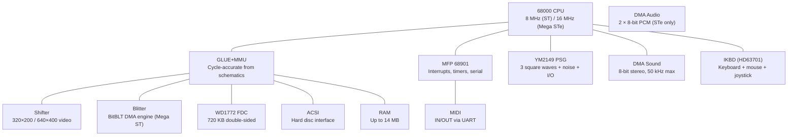

[← Core Catalog](README.md) · [↑ Knowledge Base](../README.md)

# Atari ST / STe

> The 68000 workstation for the rest of us. The MiSTer core (ported from MiSTery by Gyorgy Szombathelyi) features cycle-accurate GLUE+MMU, FX68K CPU, Blitter, and full STe enhancements.

Sources: [`AtariST_MiSTer`](https://github.com/MiSTer-devel/AtariST_MiSTer) · MiSTery original by Gyorgy Szombathelyi

---

## Architecture Overview

---

## Hardware Specifications

| Component | ST (1985) | STe (1989) |
|---|---|---|
| **CPU** | Motorola 68000 @ 8 MHz | Same (Mega STe: 16 MHz) |
| **RAM** | 512 KB / 1 MB (up to 14 MB in MiSTer) | Same |
| **Video** | Shifter — 320×200 (4/16 color) / 640×400 (mono) | Same + horizontal scroll, line offset |
| **Sound** | YM2149 PSG (3 ch) | YM2149 + DMA audio (2 × 8-bit PCM stereo) |
| **Blitter** | Optional (Mega ST) | Standard |
| **Floppy** | WD1772 — 720 KB DS/DD | Same |
| **Hard disk** | ACSI (DMA) | Same |
| **Joystick** | DE-9 (digital) | Enhanced analog paddle ports |
| **MIDI** | IN/OUT (31.25 kBaud) | Same |
| **Serial** | MFP UART — 19200 baud | Same |

---

## Video Modes (Shifter)

| Resolution | Colors | Refresh | Notes |
|---|---|---|---|
| 320×200 | 4 (of 512) | 50 Hz (PAL) / 60 Hz (NTSC) | Low-res, standard games |
| 320×200 | 16 (of 4096) | 50/60 Hz | STe extended palette |
| 640×200 | 2 | 50/60 Hz | Undocumented mode |
| 640×400 | 2 (mono) | 71 Hz (PAL only) | Requires monochrome monitor (SM124) |

---

## MiSTer Core Features

Source: [`AtariST_MiSTer` README](https://github.com/MiSTer-devel/AtariST_MiSTer)

| Feature | Detail |
|---|---|
| **CPU** | FX68K — cycle-accurate 68000 by Jorge Cwik |
| **GLUE+MMU** | Cycle-accurate, re-created from original schematics |
| **Blitter** | Cycle-accurate (Jorge Cwik), standard on STe, optional on ST |
| **Shifter** | Mostly cycle-accurate from decap reverse engineering |
| **TOS versions** | All TOS versions supported (load via OSD) |
| **RAM** | Up to 14 MB |
| **Floppy** | 2 drives, ST/MSA disk images |
| **ACSI HDD** | Hard disc emulation |
| **MIDI** | Real MIDI IN/OUT via MiSTer UART pins |
| **IKBD** | Real HD63701 MCU emulation for keyboard/mouse/joystick |
| **Viking card** | Hi-res monochrome VGA card support |
| **STe gameports** | Enhanced joystick ports (Jagpad 21 buttons partially mapped) |
| **Gauntlet** | Type 4 joystick interface support |
| **Mega STe** | 16 MHz CPU mode |
| **Scandoubler** | Optional scandoubled / YPbPr video output |

### Known Limitations

- No RTC (real-time clock)
- Fake LMC1992 (STe volume/balance chip)
- PAL clock only (32.084 MHz)
- Some MFP (Multi-Function Peripheral) imperfections
- No Ethernec (Ethernet) support

---

## Cross-References

| Topic | Article |
|---|---|
| 68000 CPU family | [Genesis](genesis.md), [Minimig](minimig.md) |
| Floppy disk emulation | [Floppy Emulation](../11_storage/floppy_emulation.md) |
| Analog video output | [Analog Video](../09_video_audio/analog_direct_video_architecture.md) |
| MIDI/audio routing | [Audio Pipeline](../09_video_audio/audio_pipeline_deep_dive.md) |
| SNAC joystick wiring | [SNAC & LLAPI](../10_input_devices/snac_llapi.md) |
