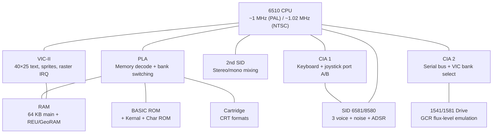

[← Core Catalog](README.md) · [↑ Knowledge Base](../README.md)

# Commodore 64 (C64)

> The best-selling home computer of all time. The MiSTer C64 core is one of the most mature and feature-rich in the entire catalog — dual SID, cartridge support, parallel DOS, REU, GeoRAM, and cycle-accurate 1541 drive emulation with flux-level GCR.

Sources: [`C64_MiSTer`](https://github.com/MiSTer-devel/C64_MiSTer) · Original FPGA64 by Peter Wendrich

---

## Architecture Overview

---

## Hardware Specifications

| Component | Detail |
|---|---|
| **CPU** | MOS 6510 (6502-based with 8-bit I/O port at `$0000–$0001`) |
| **Clock** | 0.985 MHz (PAL) / 1.023 MHz (NTSC) |
| **RAM** | 64 KB DRAM |
| **VIC-II** | 40×25 text, 320×200 hi-res, 8 sprites, raster interrupts |
| **SID** | 6581 (original) / 8580 (revised) — 3 oscillators, ADSR, filter |
| **CIA × 2** | 6526 — timers, I/O, interrupts |
| **ROM** | BASIC V2 (8 KB) + Kernal (8 KB) + Character (4 KB) |
| **Serial bus** | IEC — 1541/1581 drives, printers |
| **Cartridge** | Expansion port — ROM, I/O, DMA cartridges |
| **User port** | RS-232, parallel drive, 4-player joystick |

---

## VIC-II — Video

| Feature | Detail |
|---|---|
| **Text mode** | 40×25 characters, 256 chars (8×8) |
| **Hi-res bitmap** | 320×200, 2 colors per 8×8 cell |
| **Multicolor bitmap** | 160×200, 4 colors per 4×8 cell |
| **Sprites** | 8 total, 24×21 pixels, single/multicolor |
| **Sprite features** | Stretch X/Y, priority, collision detect |
| **Raster interrupt** | Line-accurate — the key to C64 demoscene effects |
| **Color palette** | 16 fixed colors |
| **Border** | 38/40 column selectable, reduced-border mode for 16:9 |

---

## SID — Sound Interface Device

| Parameter | 6581 (original) | 8580 (C64C) |
|---|---|---|
| **Filter** | Warm, non-linear | Precise, linear |
| **Waveforms** | Triangle, sawtooth, pulse, noise | Same |
| **Channels** | 3 oscillators + ring mod + sync | Same |
| **Envelope** | ADSR per voice | Same |
| **MiSTer** | Both filter models selectable | Dual SID mixing |

---

## Memory Map

| Range | Size | Content |
|---|---|---|
| `$0000–$00FF` | 256 B | Zero page (CPU direct page) |
| `$0100–$01FF` | 256 B | CPU stack |
| `$0200–$03FF` | 512 B | OS variables |
| `$0400–$07FF` | 1 KB | Screen RAM (default) |
| `$0800–$9FFF` | ~36 KB | BASIC program area |
| `$A000–$BFFF` | 8 KB | BASIC ROM / cartridge ROM / RAM |
| `$C000–$CFFF` | 4 KB | RAM (free) |
| `$D000–$D3FF` | 1 KB | VIC-II registers |
| `$D400–$D7FF` | 1 KB | SID registers |
| `$D800–$DBFF` | 1 KB | Color RAM |
| `$DC00–$DCFF` | 256 B | CIA 1 registers |
| `$DD00–$DDFF` | 256 B | CIA 2 registers |
| `$DE00–$DFFF` | 512 B | I/O expansion |
| `$E000–$FFFF` | 8 KB | Kernal ROM / RAM |

---

## MiSTer Core Features

Source: [`C64_MiSTer` README](https://github.com/MiSTer-devel/C64_MiSTer)

### Drive Emulation

| Feature | Detail |
|---|---|
| **1541 drive** | Cycle-accurate, GCR flux-level read logic |
| **1581 drive** | D81 disk image support |
| **Disk formats** | D64, T64, G64, D81 |
| **Dual drives** | Devices #8 and #9 simultaneously |
| **G64 copy protection** | Accurate weak bits, flux events; represents 90%+ of originals |
| **Parallel port** | DolphinDOS/SpeedDOS — ~20× faster loading |
| **Drive overlay** | On-screen track display + read/write activity |
| **Write support** | Background save, write-protect toggle |

### Cartridge Support

Almost all `.CRT` cartridge types are supported. The core auto-detects the cart type from the CRT header.

### Memory Expansion

| Type | Size | Notes |
|---|---|---|
| **REU** | 512 KB / 2 MB (wrapped) / 16 MB (linear) | DMA-based RAM expansion |
| **GeoRAM** | Up to 4 MB | Bank-switched, auto-enabled when no cart loaded |
| Both | No conflict | REU and GeoRAM can coexist |

### Audio

| Feature | Detail |
|---|---|
| **Dual SID** | Selectable 6581 or 8580 filter per chip |
| **Mixing** | Stereo to mono, various degrees |
| **OPL2** | Adlib sound expander support |

### System Features

| Feature | Detail |
|---|---|
| **Turbo mode** | C128-compatible or Smart (auto-disables during disk I/O), up to 4× |
| **C64GS mode** | Game system variant |
| **RS-232** | VIC-1011 and UP9600 modes (internal or USER_IO) |
| **RTC** | PCF8583 via tape port; GEOS compatible |
| **4 joysticks** | Via user port |
| **External IEC** | Real 1541/printer via USER_IO with level converter |
| **Loadable ROM** | Custom Kernal + 1541 ROM (JiffyDOS, DolphinDOS, SpeedDOS) |
| **PRG injection** | Direct `.PRG` file loading |
| **16:9 border** | Reduced border mode for modern displays |

---

## Cross-References

| Topic | Article |
|---|---|
| SDRAM requirements | [Addon Boards](../02_hardware_platforms/addon_boards.md) |
| Floppy emulation | [Floppy Emulation](../11_storage/floppy_emulation.md) |
| HDD/IDE emulation | [HDD/IDE](../11_storage/hdd_ide_emulation.md) |
| SNAC controller wiring | [SNAC & LLAPI](../10_input_devices/snac_llapi.md) |
| Analog video output | [Analog Video](../09_video_audio/analog_direct_video_architecture.md) |
| Amiga Minimig core | [Minimig](minimig.md) — shares 6502/68000 era lineage |
