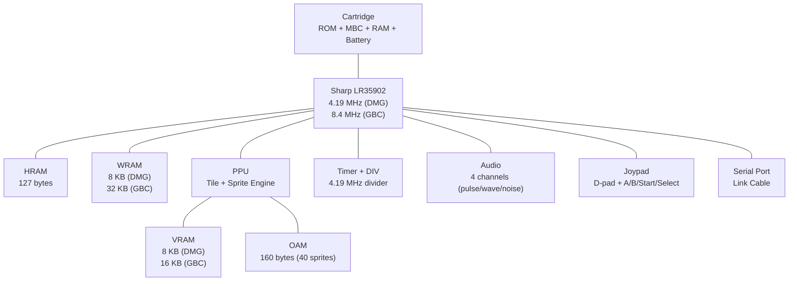

[← Core Catalog](README.md) · [↑ Knowledge Base](../README.md)

# Game Boy / Game Boy Color (DMG / GBC)

> The handheld that defined portable gaming. The MiSTer core covers the original DMG, Game Boy Color, Super Game Boy borders/palettes, MegaDuck, and even link cable multiplayer via USERIO adapter.

Sources: [`Gameboy_MiSTer`](https://github.com/MiSTer-devel/Gameboy_MiSTer) · [`SGB_MiSTer`](https://github.com/MiSTer-devel/SGB_MiSTer) · [Gekkio — GBCTR](https://gekkio.fi/files/gb-docs/gbctr.pdf)

---

## Architecture Overview

---

## Hardware Specifications

| Component | DMG (1989) | GBC (1998) |
|---|---|---|
| **CPU** | Sharp LR35902 @ 4.19 MHz | Same, double-speed @ 8.4 MHz |
| **CPU architecture** | Custom 8-bit (Z80-like, no IX/IY) | Same |
| **WRAM** | 8 KB | 32 KB (bank-switched) |
| **VRAM** | 8 KB | 16 KB (bank-switched) |
| **Display** | 160×144, 4 shades of gray | 160×144, 56 colors from 32,768 palette |
| **Sprites** | 40 OBJ, 10 per scanline | Same + high-priority color flag |
| **Audio** | 2 pulse + 1 wave + 1 noise | Same |
| **Timer** | 1 × 16-bit + DIV register | Same |
| **Serial** | 8 KB/s link cable | Same + infrared (case-integrated) |
| **Cartridge** | MBC1/3/5, 32 KB–8 MB ROM | Same + rumble, RTC, tilt |

---

## Memory Map

| Range | Size | Content |
|---|---|---|
| `0x0000–0x3FFF` | 16 KB | ROM bank 0 (fixed) |
| `0x4000–0x7FFF` | 16 KB | ROM bank N (switched by MBC) |
| `0x8000–0x9FFF` | 8 KB | VRAM (GBC: 2 × 8 KB banks) |
| `0xA000–0xBFFF` | 8 KB | Cartridge RAM (battery-backed) |
| `0xC000–0xDFFF` | 8 KB | WRAM (GBC: 4 additional banks at `0xD000`) |
| `0xE000–0xFDFF` | — | Echo of C000–DDFF |
| `0xFE00–0xFE9F` | 160 B | OAM (sprite attributes) |
| `0xFEA0–0xFEFF` | — | Unusable |
| `0xFF00–0xFF7F` | 128 B | I/O registers |
| `0xFF80–0xFFFE` | 127 B | HRAM (fast RAM) |
| `0xFFFF` | 1 B | Interrupt enable register |

---

## PPU — Rendering

The PPU renders 160×144 pixels per frame at ~59.73 Hz. Each frame consists of 154 scanlines: 144 visible + 10 lines of V-blank.

### Scanline Timing

| Mode | Cycles | Duration | Access |
|---|---|---|---|
| 2 — OAM search | 80 | ~19 µs | OAM locked |
| 3 — Pixel transfer | 172–289 | ~41–69 µs | VRAM/OAM locked |
| 0 — H-blank | 87–204 | ~21–49 µs | All RAM accessible |
| 1 — V-blank | 10 lines | ~1.64 ms | All RAM accessible |

### Tile and Sprite Engine

- Background: 256×256 pixel map (32×32 tiles), scrolled via SCX/SCY registers
- Window: overlay layer starting from WX/WY, same tile format as BG
- Sprites: 40 OBJ, 10 per scanline, 8×8 or 8×16 mode
- GBC addition: per-tile palette attributes (VRAM bank 1), priority flags

---

## Audio

| Channel | Type | Features |
|---|---|---|
| 1 | Pulse/Square | Duty cycle (12.5/25/50/75%), sweep, envelope |
| 2 | Pulse/Square | Duty cycle, envelope (no sweep) |
| 3 | Wave/Custom | 32 × 4-bit programmable waveform |
| 4 | Noise | LFSR (7-bit/15-bit), envelope |

All four channels are mixed to a single mono output on DMG. Stereo panning was added only in GBC mode via the NR51 register.

---

## Memory Bank Controllers (MBC)

The cartridge's MBC chip controls ROM/RAM bank switching — the CPU address space is only 16 KB per bank window:

| MBC | ROM Max | RAM Max | Features |
|---|---|---|---|
| **None** | 32 KB | — | No banking (Tetris, Alleyway) |
| **MBC1** | 2 MB | 32 KB | Basic banking, 2 RAM banks |
| **MBC2** | 256 KB | 512 × 4-bit | Built-in RAM, limited |
| **MBC3** | 2 MB | 32 KB | RTC (Pokémon G/S/C) |
| **MBC5** | 8 MB | 128 KB | Largest ROM, rumble support |
| **MBC7** | 2 MB | 512 bytes | Accelerometer (Kirby Tilt 'n' Tumble) |
| **MMM01** | 1 MB | 32 KB | Mapper for multi-game carts |
| **HuC-1** | 128 KB | — | Infrared link (Pokémon Pikachu) |
| **HuC-3** | 4 MB | 128 KB | RTC + infrared |

---

## MiSTer Core Features

Source: [`Gameboy_MiSTer` README](https://github.com/MiSTer-devel/Gameboy_MiSTer)

| Feature | Description |
|---|---|
| **DMG + GBC support** | Full original Game Boy and Game Boy Color |
| **Super Game Boy** | Borders, custom palettes, multiplayer via SGB_MiSTer core |
| **MegaDuck** | Creatronic Mega Duck handheld support |
| **Save States** | 4 slots — keyboard (ALT+F1–F4 / F1–F4) or gamepad |
| **Rewind** | Up to 40 seconds of gameplay |
| **Fast Forward** | Speed up gameplay |
| **Frame Blending** | Prevents flicker in games like Zas |
| **Custom Palettes** | Load `.gbp` palette files |
| **Custom Borders** | Load `.sgb` border files |
| **RTC** | Real-time clock support (MBC3 cartridges) |
| **Link Cable** | Via USERIO adapter |
| **Workboy** | Clock/calendar peripheral support |
| **Cheats** | Game Genie / GameShark codes |
| **GBA Mode** | GBA-mode boot for GBC games (faster CPU) |
| **Fast Boot** | Skip boot logo animation |

### Boot ROMs

Open-source boot ROMs adapted from [SameBoy](https://github.com/LIJI32/SameBoy/) are included. For maximum authenticity, original DMG/GBC/SGB boot ROMs can be placed in the `Gameboy/` folder and loaded via OSD.

### Video Output Note

> [!NOTE]
> The Game Boy can disable video output at any time, which causes issues with `vsync_adjust=2` or analog video during screen transitions. Enable "Stabilize video" in OSD at the cost of slightly increased latency.

---

## Cross-References

| Topic | Article |
|---|---|
| SDRAM module requirements | [Addon Boards](../02_hardware_platforms/addon_boards.md) |
| Save state architecture | [Save States](../13_save_states/save_state_architecture.md) |
| Cheat engine | [Cheats](../14_extensions/cheats.md) |
| Video scaler | [HDMI Scaler](../09_video_audio/ascal_deep_dive.md) |
| SNAC controller wiring | [SNAC & LLAPI](../10_input_devices/snac_llapi.md) |
| GBA successor | [GBA](gba.md) |
