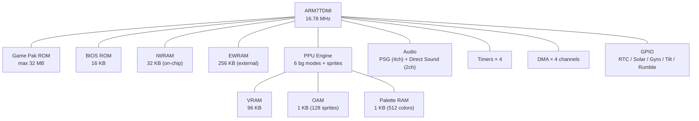

[← Core Catalog](README.md) · [↑ Knowledge Base](../README.md)

# Game Boy Advance (GBA)

> The GBA was Nintendo's first ARM-based handheld, combining a 32-bit RISC core with the mature sprite/tile engine lineage from the Game Boy — and its MiSTer core is one of the most complete and feature-rich in the catalog.

Sources: [`GBA_MiSTer`](https://github.com/MiSTer-devel/GBA_MiSTer) · [Copetti — GBA Architecture](https://www.copetti.org/writings/consoles/game-boy-advance/) · [GBATEK](https://problemkaputt.de/gbatek.htm)

---

## Architecture Overview

---

## Hardware Specifications

| Component | Detail |
|---|---|
| **CPU** | ARM7TDMI (ARMv4T), 16.78 MHz |
| **Instruction Sets** | ARM (32-bit) + THUMB (16-bit compressed) |
| **On-chip RAM (IWRAM)** | 32 KB, 32-bit bus — fastest code/data |
| **External RAM (EWRAM)** | 256 KB, 16-bit bus — general purpose |
| **VRAM** | 96 KB — tile data, bitmaps, OBJ data |
| **OAM** | 1 KB — 128 sprite attributes + 32 rotation params |
| **Palette RAM** | 1 KB — 512 colors (256 bg + 256 obj) |
| **Display** | 240×160 pixels, 15-bit color (32,768 colors) |
| **Audio** | 4 legacy PSG channels (GB) + 2 Direct Sound (8-bit PCM) |
| **Timers** | 4 × 16-bit, cascading capable |
| **DMA** | 4 channels — H-blank, V-blank, FIFO audio |
| **BIOS** | 16 KB mask ROM — decompression, math, reset |
| **Cartridge** | max 32 MB ROM, no mapper required for most games |
| **Battery** | ~15 hours on 2× AA |

---

## PPU — Video Modes

The GBA PPU provides 6 background modes, a significant evolution from the Game Boy:

| Mode | BG Layers | Affine (rotate/scale) | Typical Use |
|---|---|---|---|
| **0** | 4 text BGs | No | Menus, text-heavy games, RPGs |
| **1** | 2 text + 1 affine | BG2 only | Mode 7-style (Mario Kart Super Circuit) |
| **2** | 2 affine BGs | BG2 + BG3 | Racing, scaling effects |
| **3** | 1 bitmap (16-bit) | No | Full-color still images |
| **4** | 1 bitmap (8-bit indexed) | Page flip | FMV, splash screens |
| **5** | 1 bitmap 160×128 (16-bit) | Page flip | Small framebuffer effects |

### Sprite Engine

- 128 sprites (OBJ) + 32 affine parameter sets
- Sprite sizes: 8 combinations from 8×8 to 64×64
- Per-sprite: rotation, scaling, mosaic, 16/256 color, priority
- Max 1,280 pixels per scanline (configurable "sprite limit")

---

## Audio

The GBA inherits the 4-channel PSG from the Game Boy (square waves, noise, wave) and adds two **Direct Sound** channels — 8-bit PCM FIFO buffers that DMA feeds at the sample rate. This enables sampled instruments and voice playback.

| Channel | Type | Notes |
|---|---|---|
| 1–2 | Square wave (legacy) | Duty cycle, sweep, envelope |
| 3 | Wave pattern (legacy) | 32 × 4-bit programmable waveform |
| 4 | Noise (legacy) | LFSR-based |
| A/B | Direct Sound (new) | 8-bit PCM, FIFO, DMA-driven, stereo panning |

---

## Memory Map

| Range | Size | Content |
|---|---|---|
| `0x00000000–0x00003FFF` | 16 KB | BIOS ROM |
| `0x02000000–0x0203FFFF` | 256 KB | EWRAM (external work RAM) |
| `0x03000000–0x03007FFF` | 32 KB | IWRAM (internal work RAM) |
| `0x04000000–0x040003FF` | 1 KB | I/O registers |
| `0x05000000–0x050003FF` | 1 KB | BG/OBJ palette RAM |
| `0x06000000–0x06017FFF` | 96 KB | VRAM |
| `0x07000000–0x070003FF` | 1 KB | OAM |
| `0x08000000–0x0EFFFFFF` | up to 32 MB | Game Pak ROM |

---

## Cartridge Hardware (GPIO Peripherals)

Some GBA cartridges include extra hardware beyond the ROM, connected via the cartridge edge GPIO pins:

| Hardware | Games | MiSTer Support |
|---|---|---|
| **RTC** (real-time clock) | Pokémon Ruby/Sapphire/Emerald, Boktai series | Auto-detected; uses RTC board or NTP |
| **Solar Sensor** | Boktai 1/2/3 | OSD brightness control |
| **Gyroscope** | Wario Ware Twisted | Analog stick mapping |
| **Tilt Sensor** | Yoshi Topsy-Turvy, Koro Koro Puzzle | Analog stick mapping |
| **Rumble** | Drill Dozer, Wario Ware Twisted | Enabled via OSD |

> [!WARNING]
> The "GPIO HACK (RTC+Rumble)" OSD option enables rumble in ROM hacks. Disable it for official games or risk crashes.

---

## MiSTer Core Features

Source: [`GBA_MiSTer` README](https://github.com/MiSTer-devel/GBA_MiSTer)

### Memory Requirements

| Config | Requirement |
|---|---|
| Games < 32 MB | 32 MB SDRAM module (recommended) |
| Games = 32 MB | 64 MB or 128 MB SDRAM module |
| DDR3 fallback | Works on bare DE10-Nano, but some games lose sync |

> [!NOTE]
> SDRAM is automatically used when available and the ROM fits. DDR3 is the fallback path.

### OSD Features

| Feature | Description |
|---|---|
| **Save States** | 4 slots — keyboard (ALT+F1–F4 / F1–F4) or gamepad |
| **Rewind** | Up to 60 seconds; ~0.5% slowdown overhead |
| **Fast Forward** | 2×–4× speed |
| **CPU Turbo Mode** | Extra CPU headroom for demanding games |
| **2× Resolution** | 480×320 rendering (HDMI only) — improves affine BG/sprites |
| **Flicker Blend** | Blend / 30 Hz mode for F-Zero, Mario Kart, NES Classics |
| **Sprite Limit** | Opt-in — fixes games relying on sprite pixel overflow |
| **Color Optimization** | Shader colors, desaturation filter |
| **Cheats** | Cheat code support |

### BIOS Options

| Option | Notes |
|---|---|
| **Normmatt open-source BIOS** | Included; has issues with some games |
| **Original GBA BIOS** | Place as `GBA/boot.rom` — recommended |
| **Homebrew BIOS** | OSD toggle — bypasses Nintendo logo check for homebrew |

### Compatibility

- ~1,600 games tested to in-game
- **No known official game that doesn't work**
- Exceptions: games requiring rare Japan-only peripheral hardware

---

## Save Types

| Type | Size | Example Games |
|---|---|---|
| SRAM | 32 KB | Pokémon Ruby/Sapphire |
| Flash 64K | 64 KB | Advance Wars |
| Flash 128K | 128 KB | Pokémon Emerald |
| EEPROM 4K | 512 bytes | Mario Kart Super Circuit |
| EEPROM 64K | 8 KB | Final Fantasy Tactics Advance |
| None | — | ROM-only homebrew |

---

## Cross-References

| Topic | Article |
|---|---|
| SDRAM module requirements | [Addon Boards](../02_hardware_platforms/addon_boards.md) |
| SNAC controller wiring | [SNAC & LLAPI](../10_input_devices/snac_llapi.md) |
| Save state architecture | [Save States](../13_save_states/save_state_architecture.md) |
| Cheat engine details | [Cheats](../14_extensions/cheats.md) |
| Video scaler (2× mode) | [HDMI Scaler](../09_video_audio/ascal_deep_dive.md) |
| Game Boy / GBC lineage | [GB/GBC](gb_gbc.md) |
