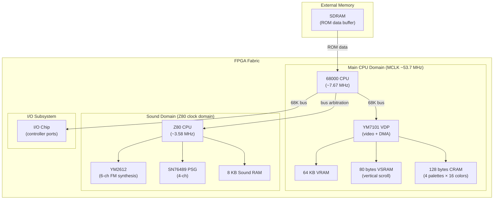

[← FPGA Cores Catalog](README.md) · [↑ Knowledge Base](../README.md)

# Genesis: Sega Mega Drive / Genesis

The Genesis core for MiSTer is a port of the fpgagen project by Gregory Estrade (Torlus), significantly enhanced for the MiSTer platform. It recreates the complete Mega Drive/Genesis chipset: the Motorola 68000 main CPU, Zilog Z80 sound CPU, Yamaha YM7101 VDP, and the YM2612/YM3438 FM synthesis audio.

Sources:
* [`MiSTer-devel/Genesis_MiSTer`](https://github.com/MiSTer-devel/Genesis_MiSTer) — MiSTer core
* Original: [`Torlus/fpgagen`](https://github.com/Torlus/fpgagen) by Gregory Estrade
* Alternative: [`nukeykt/Nuked-MD-FPGA`](https://github.com/nukeykt/Nuked-MD-FPGA) — decapped chip-accurate port

---

## 1. Feature Summary

| Feature | Implementation |
|---|---|
| **Main CPU** | Motorola 68000 (~7.67 MHz NTSC / ~7.60 MHz PAL) |
| **Sound CPU** | Zilog Z80 (~3.58 MHz) |
| **VDP** | Yamaha YM7101 (320×224 NTSC / 320×240 PAL) |
| **FM Audio** | YM2612 (6 FM channels) or YM3438 (selectable) |
| **PSG Audio** | TI SN76489 (3 square + 1 noise) |
| **Region** | JP (NTSC), US (NTSC), EU (PAL) — auto or manual |
| **SVP** | Samsung SVP (Virtua Racing) |
| **Multitap** | 4-way adapter, Team Player, J-Cart |
| **Audio filters** | Model 1, Model 2, Minimal, No Filter |
| **Composite blending** | Simulates composite video artifacts (Sonic waterfall) |
| **Sprite limit** | Option to increase beyond HW limit |
| **CPU Turbo** | Reduces slowdowns in heavy games |

---

## 2. Core Architecture

---

## 3. VDP — Video Display Processor

The YM7101 VDP is the graphics engine. It supports two operating modes:

### 3.1 Display Modes

| Mode | Resolution | Planes | Sprites | Notes |
|---|---|---|---|---|
| **Mode 4** (SMS compat) | 256×192 | Background + sprites | MD backward-compat | Master System mode |
| **Mode 5** (native MD) | 320×224 (NTSC) / 320×240 (PAL) | 2 scroll planes + sprites | Full Mega Drive | Default mode |

### 3.2 Scroll Planes

| Property | Value |
|---|---|
| **Planes** | 2 (Foreground A + Background B) |
| **Tile size** | 8×8 pixels |
| **Plane size** | Up to 128×64 tiles (1024×512 pixels) |
| **Scrolling** | Per-column horizontal offset (hscroll), per-row vertical (vscroll) |
| **Colors** | 4 palettes × 16 colors (from 512-color master palette) |

### 3.3 Sprites

| Property | Value |
|---|---|
| Max per frame | 80 |
| Max per scanline | 20 (320 px width limit) |
| Sizes | 8×8, 16×16, 24×24, 32×32 (any combination) |
| Features | Per-sprite priority, link list ordering, shadow/highlight |

### 3.4 DMA

The VDP includes a DMA controller for fast transfers from 68K RAM to VRAM/VSRAM/CRAM:

| DMA Mode | Source | Trigger |
|---|---|---|
| 68K→VDP | 68K bus | Immediate (during VBlank or active) |
| VRAM fill | Internal | Immediate |
| VRAM copy | VRAM→VRAM | Immediate |

> [!NOTE]
> DMA transfers from 68K bus compete with the CPU for bus access. During active display, DMA steals 68K bus cycles, causing slowdown. Games often batch DMA transfers during VBlank to avoid this.

---

## 4. Audio Subsystem

### 4.1 YM2612 / YM3438 — FM Synthesis

The FM synth provides 6 channels of frequency-modulated audio:

| Channel | Operators | Features |
|---|---|---|
| 1–3 | 4 operators each | Full FM, SSG-EG, DAC |
| 4–6 | 4 operators each | Ch 6 can be DAC (raw PCM) |

The core allows selecting between **YM2612** (original discrete chip, more "ladder effect" distortion) and **YM3438** (integrated version, cleaner output). The ladder effect is a quantization artifact in the DAC that many consider part of the authentic Genesis sound character.

### 4.2 SN76489 — PSG

The Programmable Sound Generator provides 3 square wave channels + 1 noise channel. This is the same chip used in the Master System, providing backward compatibility and supplementary audio for sound effects.

### 4.3 Audio Filter Models

The core offers selectable audio filter profiles matching different Genesis hardware revisions:

| Filter | Profile | Character |
|---|---|---|
| **Model 1** | Original HD Genesis 1 | Warm, filtered |
| **Model 2** | Genesis 2 / Mega Drive 2 | Brighter, less filtered |
| **Minimal** | Light filtering | Balanced |
| **No Filter** | Raw output | Unfiltered, for external processing |

---

## 5. Region Handling

The Mega Drive/Genesis is region-locked via three signals: **MAT** (NTSC/PAL clock), **M3** (domestic/overseas), and **M1** (cartridge size detection). The core supports:

| Region | Clock | Frame Rate | Resolution |
|---|---|---|---|
| JP (NTSC) | 53.693175 MHz | 59.92 Hz | 320×224 |
| US (NTSC) | 53.693175 MHz | 59.92 Hz | 320×224 |
| EU (PAL) | 53.203425 MHz | 49.70 Hz | 320×240 |

Region can be detected automatically from ROM file extension (`.BIN`→JP, `.GEN`→US, `.MD`→EU) or from the ROM header. Hot keys reset and change region.

---

## 6. Additional Features

### SVP Chip

The Samsung SVP (Samsung Video Processor) is a custom DSP used only in *Virtua Racing*. It provides 3D polygon rendering at a fixed frame rate. The core implements the SVP in FPGA logic.

### Composite Blending

Simulates the composite video blending artifact. Most famously, *Sonic the Hedgehog*'s waterfalls appear translucent through blending alternating pixel patterns — this was an intentional design trick exploiting CRT composite artifacts.

### CPU Turbo

Reduces in-game slowdown by allowing the emulated 68000 to execute instructions faster than real hardware. Useful in bullet-heavy games like *Gunstar Heroes* or *MUSHA*.

### Nuked MD Alternative

The [`Nuked-MD-FPGA`](https://github.com/nukeykt/Nuked-MD-FPGA) core by nukeykt is a decapped chip-accurate alternative. It uses die photographs of the original Yamaha chips to create a cycle-exact replica. Available as a separate MiSTer core.

---

## 7. Cross-References

| Topic | Article |
|---|---|
| SNES core | [SNES](snes.md) |
| NES core | [NES](nes.md) |
| Minimig (68000-based Amiga) core | [Minimig](minimig.md) |
| SNAC direct controller wiring | [SNAC & LLAPI](../10_input_devices/snac_llapi.md) |
| Audio pipeline | [Audio Pipeline](../09_video_audio/audio_pipeline.md) |
| Core template walkthrough | [Template Walkthrough](../07_fpga_cores_architecture/template_walkthrough.md) |
