[← FPGA Cores Catalog](README.md) · [↑ Knowledge Base](../README.md)

# Minimig: Amiga OCS / ECS / AGA

The Minimig core is the spiritual ancestor of MiSTer. Originally created by Dennis van Weeren as a standalone FPGA board that recreated the Amiga 500 chipset, it was ported to the DE10-Nano by Alexey Melnikov (Sorgelig) and significantly extended with AGA (Amiga 1200) chipset support, making it one of the most feature-rich and widely-used MiSTer cores.

This article covers the Minimig core's FPGA implementation architecture: how the Amiga chipset maps onto the DE10-Nano's FPGA fabric, SDRAM, and DDR3; the dual CPU subsystem; the DMA arbitration model; and MiSTer-specific extensions. For Amiga custom chip programming references (register maps, copper/blitter programming, audio DMA), see the [Amiga Bootcamp](https://github.com/alfishe/amiga-bootcamp) knowledge base.

Sources:
* [`Minimig-AGA_MiSTer/Minimig.sv`](https://github.com/MiSTer-devel/Minimig-AGA_MiSTer/blob/MiSTer/Minimig.sv) — top-level MiSTer glue
* [`Minimig-AGA_MiSTer/rtl/minimig.v`](https://github.com/MiSTer-devel/Minimig-AGA_MiSTer/blob/MiSTer/rtl/minimig.v) — core Amiga subsystem
* [`Minimig-AGA_MiSTer/rtl/agnus.v`](https://github.com/MiSTer-devel/Minimig-AGA_MiSTer/blob/MiSTer/rtl/agnus.v) — DMA controller
* [`Minimig-AGA_MiSTer/rtl/gary.v`](https://github.com/MiSTer-devel/Minimig-AGA_MiSTer/blob/MiSTer/rtl/gary.v) — address decoder and bus multiplexer
* [`Minimig-AGA_MiSTer/rtl/cpu_wrapper.v`](https://github.com/MiSTer-devel/Minimig-AGA_MiSTer/blob/MiSTer/rtl/cpu_wrapper.v) — dual CPU and autoconfig

---

## 1. Feature Overview

| Feature | Implementation |
|---|---|
| **Chipset variants** | OCS (A500), ECS (A600), AGA (A1200/A4000) |
| **Chip RAM** | 0.5 MB – 2.0 MB (SDRAM) |
| **Slow RAM** | 0 – 1.5 MB (SDRAM, trapdoor expansion) |
| **Fast RAM** | 0 – 384 MB (DDR3 via `ddram_ctrl.v` cache + `cpu_cache_new.v`) |
| **CPU** | 68000 (`fx68k`) or 68020 (`TG68K`) — runtime switchable |
| **Kickstart** | 1.2, 1.3, 2.0, 3.0, 3.1, 3.1.4, 3.2 (256K/512K/1MB ROMs) |
| **Floppy** | 1–4 drives, ADF format, normal and turbo speed |
| **IDE** | Up to 4 devices (HDF/VHD images, FIFO-buffered) |
| **CD-ROM** | CD32 support via IDE ATAPI + Akiko C2P |
| **Video** | PAL/NTSC, almost all custom resolutions |
| **RTG** | Picasso96-compatible, up to 1920×1080 (68020 only) |
| **Networking** | Serial SLIP connection to Linux; Internet via `slattach` |
| **File sharing** | `a314`-based shared folder between Amiga and Linux |
| **MIDI** | Internal MT32-Pi emulation or external via USER_IO |
| **Sound card** | Toccata Zorro II (16-bit, 48 kHz) |

---

## 2. Core Architecture

```mermaid
flowchart TD
    subgraph FPGA["FPGA Fabric"]
        direction TB
        subgraph CPU["CPU Subsystem (clk_114)"]
            FX68K["fx68k<br/>(68000, cycle-exact)"]
            TG68K["TG68K.C<br/>(68020, pipelined)"]
            CPUWRAP["cpu_wrapper.v<br/>(CPU select + autoconfig)"]
            CACHE["cpu_cache_new.v<br/>(4-way set-assoc, 16-bit)"]
        end

        subgraph CHIPSET["Amiga Custom Chips (clk_sys 28.375 MHz)"]
            AGNUS["Agnus<br/>(DMA arbiter + beam counter)"]
            BPD["bitplanedma"]
            COPPER["copper"]
            BLITTER["blitter"]
            SPRDMA["spritedma"]
            DENISE["Denise<br/>(bitplanes + sprites + CLUT + HAM)"]
            PAULA["Paula<br/>(audio × 4 + floppy + UART + intctl)"]
        end

        subgraph GLUE["Glue Logic"]
            GARY["gary.v<br/>(address decode + bus mux)"]
            GAYLE["gayle.v<br/>(IDE + Gayle registers)"]
            FASTCHIP["fastchip.v<br/>(68020 peripheral bridge)"]
            RTG["rtg.v<br/>(Picasso96 registers)"]
            AKIKO["akiko.v<br/>(CD32 C2P)"]
            CIAA["CIA A<br/>(kbd, mouse, parallel)"]
            CIAB["CIA B<br/>(floppy ctrl, serial)"]
        end
    end

    subgraph EXT["External Memory"]
        SDRAM["SDRAM (32MB)<br/>Chip RAM + Slow RAM + Kickstart"]
        DDR3["DDR3 (1GB)<br/>Fast RAM + RTG framebuffer"]
    end

    subgraph HPS["HPS (ARM Linux)"]
            HPS_IO["hps_io.sv"]
            HPS_EXT["hps_ext.v<br/>(IDE + mouse/kbd + CD-DA)"]
    end

    CPUWRAP --> FX68K
    CPUWRAP --> TG68K
    CPUWRAP --> CACHE
    CACHE -->|ddram_ctrl| DDR3
    CPUWRAP --> GARY
    GARY --> SDRAM
    GARY --> GLUE
    AGNUS --> BPD & COPPER & BLITTER & SPRDMA
    AGNUS --> GARY
    DENISE --> GARY
    PAULA --> GARY
    FASTCHIP --> GAYLE & RTG & AKIKO
    HPS_IO --> HPS_EXT
    HPS_EXT -->|EXT_BUS| GAYLE
    HPS_EXT --> CIAA
```



### 2.1 Physical Partition: FPGA vs SDRAM vs DDR3 vs HPS

The Minimig core splits the Amiga hardware across three physical memory types and the HPS processor:

| Component | Physical Location | Rationale |
|---|---|---|
| Agnus, Denise, Paula, Gary | FPGA fabric | Cycle-accurate DMA timing requires deterministic bus arbitration |
| CIA A/B, CPU wrapper | FPGA fabric | Tight coupling to chipset clock domain |
| Chip RAM (0.5–2 MB) | **External SDRAM** | Deterministic latency — DMA and CPU share via time-division |
| Slow RAM (0–1.5 MB) | **External SDRAM** | CPU-only, no DMA contention |
| Kickstart ROM | **SDRAM** (loaded at startup) | Read-only after load |
| Fast RAM (0–384 MB) | **DDR3** via `ddram_ctrl.v` | Cached — variable latency tolerable for CPU-only access |
| RTG Framebuffer | **DDR3** via `ddram_ctrl.v` | Same cached path as Fast RAM |
| IDE register access | **HPS** via `hps_ext.v` | Disk images served from Linux filesystem |
| Floppy image data | **HPS** via SPI (`ioctl`) | ADF files streamed from SD card |
| Keyboard / mouse / joystick | **HPS** via `hps_ext.v` | USB input devices managed by Linux |
| CD-DA audio stream | **HPS** via `hps_ext.v` | CD audio decoded on ARM, streamed to FPGA |

The critical insight is that **chip RAM must be on SDRAM**, not DDR3. The chipset's DMA engines require deterministic, low-latency access with strict time-division multiplexing. DDR3's variable latency (even with caching) would break the real-time DMA scheduling that drives the display, audio, and disk subsystems.

### 2.2 Chipset Emulation Strategy

The Minimig core implements the Amiga custom chips as a single unified design rather than as separate IP blocks. This is critical because the Amiga's architecture is deeply interconnected — all chips share the same chip RAM bus, and DMA slots are allocated on a per-CCK (color clock) basis:

- **Agnus** (`agnus.v`) is the DMA controller — it arbitrates bus access between bitplane, sprite, copper, blitter, audio, and disk DMA channels. It contains the beam counter (CRT position) and generates all sync signals
- **Denise** (`denise.v`) is the display processor — it serializes bitplane data from chip RAM, generates the pixel color through the CLUT or HAM generator, handles sprites and collision detection
- **Paula** (`paula.v`) is the I/O processor — it contains 4 audio DMA channels, the floppy disk controller, the UART, and the interrupt controller
- **Gary** (`gary.v`) is the address decoder and bus multiplexer — it routes CPU vs DMA addresses to RAM, decodes the register space, and manages the kickstart overlay

In the FPGA implementation, these chips operate within the same `clk_sys` clock domain but are **separate Verilog modules** connected through the shared `reg_address`, `data_in`/`data_out`, and DMA request/acknowledge signals. The data bus uses a wired-OR convention: each module drives its `data_out` to zero when not selected, and the results are OR-combined.

### 2.3 Clock Architecture

| Clock | Frequency | Source | Purpose |
|---|---|---|---|
| `clk_sys` | 28.375 MHz (PAL) / 28.63636 MHz (NTSC) | PLL with runtime reconfiguration | Core system clock, matches original Amiga clock |
| `clk_114` | 114 MHz | PLL | SDRAM controller + DDR3 controller + CPU cache |
| `clk7_en` | 7.09 MHz (÷4 enable) | `amiga_clk.v` divider | 7 MHz chipset clock domain |
| `cck` | 3.54 MHz (÷8 enable) | `amiga_clk.v` divider | Color clock — odd DMA slots used by chipset |
| `CLK_VIDEO` | 114 MHz (= `clk_114`) | Direct | Video output pipeline |
| `CLK_AUDIO` | 24.576 MHz | Framework | Audio sample rate clock |

The PLL is dynamically reconfigured when switching between PAL and NTSC modes. The `pll_cfg` module writes new MIF parameters to the PLL at address 7: `702807747` (PAL) or `343817200` (NTSC). The `amiga_clk.v` module generates the `clk7_en` and `cck` clock enables synchronously from `clk_sys`, ensuring the chipset operates at the correct virtual 7.09 MHz rate.

The 28.375 MHz `clk_sys` is close to the original Amiga's 28.37516 MHz (PAL), ensuring cycle-accurate timing for the custom chips. The 4× faster `clk_114` allows the SDRAM controller to perform 32-bit-wide accesses (two 16-bit SDRAM words per chip RAM word) within a single 7 MHz cycle.

---

## 3. CPU Subsystem

### 3.1 Dual CPU: fx68k and TG68K

The Minimig core contains **two complete 68000-family CPU cores** and selects between them at runtime based on the `cpucfg[1]` bit:

| CPU | Verilog Module | Use Case | Bus Width |
|---|---|---|---|
| 68000 | `fx68k` | OCS/ECS modes (A500/A600) | 24-bit address, 16-bit data |
| 68020 | `TG68K.C_Kernel` | AGA mode (A1200/A4000) | 32-bit address, 32-bit data |

The `cpu_wrapper.v` module instantiates both CPUs and multiplexes their signals into a unified interface. When `cpucfg[1]=0`, the fx68k is active; when `cpucfg[1]=1`, the TG68K takes over. The wrapper translates the TG68K's 32-bit address space down to the 24-bit chip bus for chipset access, while routing 32-bit addresses directly to the DDR3 controller for Fast RAM and Zorro III expansion.

Key CPU wrapper behavior:
- The 68020 generates a `longword` signal for 32-bit transfers; the 68000 always does 16-bit transfers
- `cpustate` reports bus state: 0=fetch code, 1=no mem access, 2=read data, 3=write data
- The 68020 supports the VBR (Vector Base Register), allowing the NMI vector to be relocated via `vbr + 0x7C`
- `cacr` (Cache Control Register) bits control the 68020's internal instruction/data caches

### 3.2 Cache and Memory Routing

The `cpu_wrapper.v` determines where each CPU memory access goes:

```
CPU access → ramsel?
  ├── sel_zram     → DDR3 (Zorro II/III Fast RAM)
  ├── sel_chipram  → SDRAM (Chip RAM, 0x000000–0x1FFFFF)
  ├── sel_kickram  → SDRAM (Kickstart ROM, 0xF80000–0xFFFFFF)
  ├── sel_dd       → DDR3 (0x00DDxxxx shared region)
  ├── sel_rtg      → DDR3 (RTG framebuffer, 0x02xxxxxx)
  └── none of above → fastchip (IDE, Gayle, RTG regs, Akiko)
```

The `zram_sel` flag (`ram_addr[28:26] != 0`) determines whether an access goes to DDR3 or SDRAM. The address mapping logic remaps the 32-bit Amiga address space into the physical DDR3 address space:

| Amiga Region | DDRAM_ADDR[28:23] | Physical Target |
|---|---|---|
| Chip/slow/kick (SDRAM) | `000_000` | `sdram_ctrl` |
| DD shared region | `011_1111` | `ddram_ctrl` (shared with RTG) |
| RTG framebuffer | `1110_xx` | `ddram_ctrl` |
| Zorro III RAM (128 MB chunk) | `cpu_addr[28:23]` | `ddram_ctrl` |
| Zorro III RAM (256 MB chunk) | `0_1_xxxx` | `ddram_ctrl` |

### 3.3 Autoconfig: Zorro II/III RAM and Toccata

The Minimig core implements the Amiga autoconfig protocol in `cpu_wrapper.v` to present Zorro II and Zorro III RAM cards and the Toccata sound card. The autoconfig space is at `$E80000–$E8FFFF`:

| Autoconfig Device | Type | Size | Register 0x48/0x44 Action |
|---|---|---|---|
| Zorro II RAM | Memory card | 2/4/8 MB | Write to 0x48 → `z2ram_ena=1`, base at 0x200000 |
| Zorro III RAM (1st) | Memory card | 128/256 MB | Write to 0x44 → `z3ram_base0/b1` set |
| Zorro III RAM (2nd) | Memory card | 128 MB | Write to 0x44 → `z3ram_base1` set |
| Toccata sound card | I/O card | 64 KB | Write to 0x48 → `toccata_base` set from data bus |

The autoconfig chain processes cards in order: Zorro II RAM first (fixed base at 0x200000), then Toccata, then Zorro III RAM. The manufacturer ID for all RAM cards is `0x139C`; Toccata uses `0x4754`.

---

## 4. Agnus: DMA Controller

### 4.1 DMA Priority and Slot Allocation

Agnus (`agnus.v`) is the bus master for all chip RAM access. The DMA priority is strictly ordered — higher-priority channels always preempt lower ones:

```
Priority (highest → lowest):
  1. Disk DMA        (dma_dsk)  — unconditional, dedicated slots
  2. DRAM Refresh    (dma_ref)  — prevents data loss, dedicated slots
  3. Audio DMA       (dma_aud)  — 4 channels, dedicated slots per channel
  4. Bitplane DMA    (dma_bpl)  — display data, dedicated slots
  5. Sprite DMA      (dma_spr)  — request/acknowledge model
  6. Copper DMA      (dma_cop)  — request/acknowledge, blocked by bitplane
  7. Blitter DMA     (dma_blt)  — request/acknowledge, lowest priority DMA
  8. CPU             (else)     — gets bus when no DMA channel is active
```

The Minimig implementation runs the bus at **twice the original Amiga clock rate** (28 MHz vs 14 MHz), allowing 4 bus slots per CCK (color clock) instead of 2:

| Slot | CCK Phase | Allocation |
|---|---|---|
| 0 | Even | CPU (extra slot from higher clock) |
| 1 | Odd | Disk, bitplanes, copper, blitter, CPU (priority order) |
| 2 | Even | Blitter, CPU (priority order, extra from higher clock) |
| 3 | Odd | Disk, bitplanes, sprites, audio, CPU (priority order) |

The `cck` signal (3.54 MHz) identifies odd slots where the chipset can run. Because only odd slots are used by the chipset, it operates at the same virtual speed as the original. The CPU gets extra even slots, enabling faster performance without a separate fast RAM controller.

Agnus implements this as a combinational priority encoder: each DMA channel asserts its request, and the highest-priority active channel wins the bus, setting `dbr` (data bus request), `dbwe` (write enable), `address_out`, and `reg_address_out`.

### 4.2 Blitter

The blitter (`agnus_blitter.v`, 953 lines) implements:
- **Normal mode**: 4-channel (A/B/C/D) block transfer with minterm logic
- **Line mode**: Bresenham line drawing with octant selection
- **Fill mode**: Horizontal fill with ascending/descending carry
- **Barrel shifter**: Shifts channel A data by `BLTCON0[5:0]` for mask alignment
- **Minterm generator**: `agnus_blitter_minterm.v` computes `D = f(A,B,C)`
- **ECS extensions**: `BLTSIZH`/`BLTSIZV` for large blits, `BLTCON0L`

The blitter uses the request/acknowledge model: it asserts `req_blt` when it needs a bus cycle, and Agnus grants `ack_blt` when the bus is available. Blitter nasty mode (`DMACON[10]` = `bltpri`) steals even slots from the CPU. A slowdown counter (`bls_cnt`) blocks the blitter after `BLS_CNT_MAX=3` consecutive cycles where the CPU has been denied the bus.

### 4.3 Copper

The copper (`agnus_copper.v`, 556 lines) is a coprocessor executing a 3-instruction set from chip RAM:
- **MOVE**: Write a 16-bit value to a custom chip register
- **WAIT**: Wait until the beam counter reaches a specified position
- **SKIP**: Skip the next instruction if the beam counter matches

The copper is blocked when bitplane DMA is active (`ena_cop = ~dma_bpl`). It halts on illegal register addresses, restarting on vertical blank or `COPJMP` strobe. The ECS copper adds `CDANG` for extended DMA cycles and danger check logic.

---

## 5. Denise: Display Processor

### 5.1 Bitplane Graphics Pipeline

Denise (`denise.v`) renders the display through a pipeline of sub-modules:

```
chip48 (SDRAM wide read) → denise_bitplanes → denise_bitplane_shifter
    → bpldata[8:1] → denise_playfields → plfdata[7:0]
                                       → clut_data[7:0] → denise_colortable → clut_rgb[23:0]
                                       → denise_hamgenerator → ham_rgb[23:0]
                                       → out_rgb → {R,G,B}[7:0]
```

The `chip48` signal from `sdram_ctrl.v` provides a 48-bit wide read from SDRAM, allowing up to 6 bitplanes to be fetched in a single access for AGA modes.

### 5.2 BPLCON Registers and Mode Selection

| Register | Key Bits | Function |
|---|---|---|
| `BPLCON0` ($100) | `[15]` hires, `[14:12]+[4]` bitplanes, `[11]` HAM, `[10]` DPF, `[6]` shres | Main display mode control |
| `BPLCON2` ($104) | `[9]` killehb, `[8]` rdram (AGA), `[6:0]` playfield priority | Priority and EHB control |
| `BPLCON3` ($106) | `[15:13]` bank, `[12:10]` pf2of, `[9]` loct, `[7:6]` spres, `[5]` brdrblnk, `[1]` brdsprt | AGA color/sprite control |
| `BPLCON4` ($10C) | `[15:8]` bplxor, `[7:4]` esprm, `[3:0]` osprm | AGA sprite XOR and color offsets |

The `l_bpu` (latched bitplanes used) is captured on write to `BPL1DAT`, which is the OCS-compatible point where Denise knows the actual number of active bitplanes for the current scanline.

### 5.3 Color Lookup Table

The CLUT supports:
- **OCS**: 32 entries × 12 bits (4 bits per R/G/B component)
- **ECS**: Same 32 entries with EHB (Extra Half-Brite) doubling to 64 colors
- **AGA**: 256 entries × 24 bits (8 bits per component), with `bank` select from `BPLCON3[15:13]` for 8 banks of 256 colors each
- **12-bit mode** (`loct=1`): Reads 12-bit entries with nibble-level access for `rdram` mode
- **`bplxor`** from `BPLCON4[15:8]`: XOR'd with the playfield color index, active from BPL1DAT to DIWSTOP

### 5.4 Denise ID Register

The `DENISEID` register at `$07C` returns different values depending on the chipset mode:
- OCS: `0xFFFF` (no Denise ID)
- ECS: `0xFFFC`
- AGA: `0x00F8`

---

## 6. Paula: Audio and I/O

### 6.1 Audio DMA

Paula's audio subsystem (`paula_audio.v`) contains 4 independent channels, each with:
- A location pointer (`AUDxLCH/AUDxLCL`) and length register (`AUDxLEN`)
- A period register (`AUDxPER`) controlling sample rate
- A volume register (`AUDxVOL`) with 64 levels (0–64)
- Two DMA request lines to Agnus: `audio_dmal[x]` (data transfer) and `audio_dmas[x]` (location pointer reload)

Each channel generates 8-bit signed PCM samples, mixed in pairs (0+1 → left, 2+3 → right). Volume scaling uses a 64-entry lookup table.

### 6.2 Audio Output Pipeline

The Minimig core applies post-processing to Paula's raw audio:

```
Paula 15-bit signed → 16-bit
    → IIR LPF 4400 Hz (6 dB/oct, 1st order)
    → IIR LPF 3000+3400 Hz (cascaded 1st order)
    + Toccata 16-bit stereo
    + MT32-Pi I2S 16-bit stereo
    + CD-DA 16-bit stereo
    → Sum with saturation clamp → AUDIO_L/R
```

The filter can be bypassed, and "A1200 mode" skips the low-pass filters. A PWM volume mode uses the 9-bit `ldata_okk/rdata_okk` outputs instead of the 15-bit `ldata/rdata`.

### 6.3 Floppy Disk Controller

The floppy controller (`paula_floppy.v`, 560 lines) emulates the Amiga's disk subsystem:
- Supports 1–4 floppy drives (`floppy_config[3:2]`)
- Reads ADF data from the SPI host interface
- Implements MFM decoding with sync word matching (`ADKCON[10]` = wordsync mode)
- Generates `blckint` (block finished) and `syncint` (sync word match) interrupts
- Turbo mode (`floppy_config[0]`) bypasses disk rotation timing
- The `index` pulse runs at 5 Hz (300 RPM, matching real floppy drives)

### 6.4 Interrupt Controller

The interrupt controller (`paula_intcontroller.v`) presents 6 levels to the CPU's `IPL[2:0]` pins:

| Level | Source | Trigger |
|---|---|---|
| 1 | Software (`INTENA[7]`) | Manual set |
| 2 | CIA A / IDE / Gayle | External events |
| 3 | Vertical blank / Blitter complete | `vbl_int` / `int3` |
| 4 | UART RX/TX | Serial data |
| 5 | Software (`INTENA[13]`) | Manual set |
| 6 | CIA B / Toccata | Horizontal blank / audio |

Level 7 is reserved for Action Replay / NMI (`int7`), which has absolute priority.

### 6.5 Serial Port (UART)

The UART (`paula_uart.v`) provides RS-232 serial communication:
- `uart_mode` from `hps_io` selects: 0=internal loopback, 1=USER_IO, 2/3=MT32-Pi MIDI
- In MIDI mode (`uart_mode >= 3`), `UART_TXD` carries MIDI data, `UART_RTS/DTR` are disabled
- Baud rates: 115200 or 230400 (set in CONF_STR)

---

## 7. CIA and Peripheral I/O

### 7.1 CIA A (`ciaa.v`)

CIA A handles user-facing input devices:

| Port | Signal | Function |
|---|---|---|
| Port A (read) | `_fire0`, `_fire1`, `_ready`, `_track0`, `_wprot`, `_change` | Joystick buttons + floppy status |
| Port A (write) | `_led` (power LED), `_fire0_dat`, `_fire1_dat` | LED + button feedback |
| Port B (read) | `_joy3[0:3]`, `_joy4[0:3]` | Parallel joystick data |
| SDR | Keyboard scan codes | PS/2 keyboard input from `hps_ext.v` |
| Timer A | — | Keyboard/mouse timing |
| TOD | — | Counting vertical sync pulses |
| Interrupt | `int2` | Flags to Paula interrupt controller |

CIA A's keyboard handler receives data from `hps_ext.v` via the `kbd_mouse_data/type/level` signals, encoding PS/2 scancodes (type=2), mouse movement (type=0/1), and OSD keys (type=3).

### 7.2 CIA B (`ciab.v`)

CIA B controls the floppy drives and serial port handshake:

| Port | Signal | Function |
|---|---|---|
| Port A (read) | `cd`, `cts`, `dsr`, `ri`, joystick fire3/4 | Serial handshake inputs |
| Port A (write) | `dtr`, `rts` | Serial handshake outputs |
| Port B (write) | `_motor`, `_sel[3:0]`, `side`, `direc`, `_step` | Floppy drive control |
| Timer A/B | — | Counting `E` clock cycles |
| TOD | — | Counting horizontal sync pulses |
| Interrupt | `int6` | Flags to Paula interrupt controller |
| FLAG | `index` | Disk index pulse input |

---

## 8. Gary: Address Decoder and Bus Multiplexer

Gary (`gary.v`) is the central address decoder that determines which device responds to each memory access. It operates in two modes depending on `dbr` (Agnus data bus request):

### 8.1 DMA Mode (dbr=1)

When Agnus owns the bus, only chip RAM is accessed:
- `sel_chip[0:3]` decode `dma_address[20:19]` into four 512 KB banks
- In ECS mode with 512K chip + 512K slow config, `sel_slow[0]` is used as additional chipmem
- No kickstart, CIA, or register access occurs during DMA

### 8.2 CPU Mode (dbr=0)

When the CPU owns the bus, Gary decodes the full 24-bit address space:

| Address Range | Select Signal | Target |
|---|---|---|
| `$000000–$1FFFFF` | `sel_chip[0:3]` | Chip RAM (SDRAM) |
| `$200000–$7FFFFF` | `sel_bank_1` | Zorro II Fast RAM (DDR3, via cpu_wrapper) |
| `$B80000–$B8FFFF` | `sel_rtg` | RTG registers |
| `$BF0000–$BFFFFF` | `sel_cia` | CIA A/B space |
| `$C00000–$D7FFFF` | `sel_slow[0:2]` | Slow/Ranger RAM (SDRAM) |
| `$DA0000–$DAFFFF` | `sel_ide` | IDE registers (Gayle) |
| `$DC0000–$DCFFFF` | `sel_rtc` | RTC registers |
| `$DE1000–$DE1FFF` | `sel_gayle` | Gayle control registers |
| `$DF0000–$DFFFFF` | `sel_reg` | Custom chip registers |
| `$E00000–$E7FFFF` | `sel_kick1mb` | 1MB Kickstart upper half |
| `$E80000–$E8FFFF` | autoconfig | Autoconfig space (cpu_wrapper) |
| `$E9xxxx` | `sel_toccata` | Toccata sound card |
| `$F80000–$FFFFFF` | `sel_kick` | Kickstart ROM |

The `ovl` (overlay) signal, set at reset and cleared by a write to CIA A, causes chip RAM reads at `$000000–$07FFFF` to be redirected to kickstart ROM. The `bootrom` flag enables a 256 KB mirror of `$F8xxxx` at `$FCxxxx` for A1000-style boot ROM behavior.

Gary also generates `dbs` (data bus slow down) for accesses to chip RAM and slow RAM, which throttles the CPU to match the 7 MHz bus speed.

---

## 9. Memory Map

### 9.1 Amiga Address Space

```
0x00000000 ┌──────────────────────────────────┐
           │ Chip RAM (0.5–2.0 MB)            │  ← SDRAM
0x00BFFFFF │   (CPU + DMA access)             │
0x00C00000 ├──────────────────────────────────┤
           │ Slow RAM / Ranger (0–1.5 MB)     │  ← SDRAM
0x00DFFFFF │   (CPU-only, auto-config)        │
0x00E00000 ├──────────────────────────────────┤
           │ 1MB Kickstart ROM upper half      │  ← SDRAM
0x00E7FFFF │   (KS 3.2, sel_kick1mb)          │
0x00E80000 ├──────────────────────────────────┤
           │ Autoconfig + Toccata              │  ← Internal FPGA
0x00E9FFFF │   (E8=autoconfig, E9=Toccata)    │
0x00DA0000 ├──────────────────────────────────┤
           │ IDE registers (Gayle)             │  ← HPS via hps_ext
0x00DAFFFF │   DA0=CS1/2, DA2=8-bit, DA8-DAF  │
0x00DC0000 ├──────────────────────────────────┤
           │ RTC registers                     │  ← Internal FPGA
0x00DCFFFF │                                  │
0x00DE1000 ├──────────────────────────────────┤
           │ Gayle control registers           │  ← Internal FPGA
0x00DE1FFF │   (GAYLEID, CS, INTREQ, INTENA)  │
0x00DF0000 ├──────────────────────────────────┤
           │ Custom chip registers             │  ← Internal FPGA
0x00DFFFFF │   (Agnus, Denise, Paula)         │
0x00F80000 ├──────────────────────────────────┤
           │ Kickstart ROM (256K/512K)         │  ← SDRAM (loaded via ioctl)
0x00FFFFFF │   (mirrored over RAM at reset)   │
0x01000000 ├──────────────────────────────────┤
           │ ... (unmapped)                   │
0x02000000 ├──────────────────────────────────┤
           │ RTG Framebuffer                   │  ← DDR3
0x02FFFFFF │   (sel_rtg address space)        │
0x20000000 ├──────────────────────────────────┤
           │ Zorro II Fast RAM (up to 8 MB)   │  ← DDR3
0x207FFFFF │   (fixed base at 0x200000)       │
           │ ...                               │
0x40000000 ├──────────────────────────────────┤
           │ Zorro III Fast RAM (128–384 MB)  │  ← DDR3
0x7FFFFFFF │   (autoconfig-assigned base)     │
           └──────────────────────────────────┘
```

### 9.2 Memory Allocation on MiSTer

| Memory | Physical Device | Controller | Access Pattern |
|---|---|---|---|
| Chip RAM (0.5–2 MB) | External SDRAM | `sdram_ctrl.v` | Deterministic — DMA and CPU share via time-division |
| Slow RAM (0–1.5 MB) | External SDRAM | `sdram_ctrl.v` | CPU-only, no DMA contention |
| Kickstart ROM | SDRAM (loaded at startup) | `sdram_ctrl.v` | Read-only after load, mapped by `minimig_bankmapper.v` |
| Fast RAM (0–384 MB) | DDR3 | `ddram_ctrl.v` + `cpu_cache_new.v` | Cached — 4-way set-associative, variable latency |
| RTG Framebuffer | DDR3 | `ddram_ctrl.v` | Cached — same path as Fast RAM |

---

## 10. IDE, Gayle, and CD32

### 10.1 IDE Controller

The IDE subsystem has two paths depending on CPU mode:

- **68000 mode** (`ide_fast=0`): Gayle in `minimig.v` decodes IDE registers from the Amiga bus. Data flows through the chip bus with `nrdy` (not ready) stalling the CPU
- **68020 mode** (`ide_fast=1`): The `fastchip.v` bridge routes IDE accesses directly from the 68020's 32-bit bus to a second `gayle.v` + `ide.v` instance, bypassing the chip bus entirely for faster disk I/O

Each `ide.v` instance contains:
- A dual-port RAM FIFO (`dpram #(12,16)`) that buffers 4K words between the Amiga bus and the HPS management interface
- Fast read mode that prefetches data into the FIFO before the CPU requests it
- `request[2:0]` encoding: `110`=reset, `100`=new command, `101`=data transfer

Two IDE channels (ide0/ide1) support Master/Slave on each (up to 4 devices). HPS-side register map:

| mgmt_address | Register |
|---|---|
| 0 | Features + Error + blk_size |
| 1 | Sector number + Sector count (low byte) |
| 2 | Cylinder (low word) |
| 3 | Sector count (high byte) + Sector number (high byte) |
| 4 | Cylinder (high word) |
| 5 | Command + Drive address + Status + IRQ control |
| 6 | Drive present + HOB enable + wait mode |
| 7+ | FIFO data (auto-incrementing) |

### 10.2 Gayle Registers

The Gayle chip (`gayle.v`) provides the A1200/A600 IDE and PCMCIA interface:

| Address | Register | Function |
|---|---|---|
| `$DA0xxx–$DA3xxx` | IDE Task File | CS1/CS2 register access (8/16-bit) |
| `$DA8xxx` | GAYLE_CS_1200 | Card status + interrupt mask |
| `$DA9xxx` | GAYLE_IRQ_1200 | IDE interrupt request (write 0 to clear) |
| `$DAAxxx` | GAYLE_INT_1200 | IDE interrupt enable (bit 15) |
| `$DABxxx` | GAYLE_CFG_1200 | Configuration register |
| `$DE1xxx` | GAYLE_ID | Identification (reads 1→1→0→1 pattern on MSB) |

### 10.3 Akiko: CD32 Chunk-to-Planar

The Akiko module (`akiko.v`) implements the CD32's chunky-to-planar conversion engine, mapped at `$B800xx` (selected by `fastchip.v` when `addr[23:8] == 0xB800` and `addr[7:6] == 0`):

- Reading address 0 returns `0xC0CA`, address 1 returns `0xCAFE` (identification)
- The C2P engine uses a 32-byte buffer. Writing 16-bit values fills the buffer in chunky format; reading converts and returns planar data
- The `SetAkiko` utility must be run on the Amiga to activate the engine

---

## 11. MiSTer Extensions

### 11.1 RTG (Retargetable Graphics)

The Picasso96-compatible RTG system consists of `rtg.v` (register interface) + `fastchip.v` (address decode) + `ddram_ctrl.v` (framebuffer in DDR3):

**Register map** at `$B80100–$B8010F`:

| Offset | Register | Bits |
|---|---|---|
| 0 | `ADDR[31:16]` | Framebuffer base address (high word) |
| 2 | `ADDR[15:0]` | Framebuffer base address (low word) |
| 4 | `FORMAT[5:0]` | Pixel format (011=8bpp palette, 100=16bpp, 101=24bpp, 110=32bpp) |
| 6 | `ENABLE` | Bit 0 = RTG on/off |
| 8 | `HSIZE[11:0]` | Horizontal resolution |
| A | `VSIZE[11:0]` | Vertical resolution |
| C | `STRIDE[13:0]` | Bytes per scanline |
| E | `ID/VERSION` | Reads `0x5001` |

**CLUT** at `$B80400–$B807FF`: 256 entries × 32 bits (`00/RR/GG/BB`).

The RTG signals connect to `sys_top.v`'s framebuffer interface, which reads pixels from DDR3 and sends them through the HDMI scaler. RTG requires 68020 CPU and the `MISTER_FB`/`MISTER_FB_PALETTE` QSF macros.

### 11.2 Shared Folder (a314)

Based on Niklas Ekström's [a314](https://github.com/niklasekstrom/a314) driver, this creates a bidirectional file share:
- **Amiga side**: `MiSTerFileSystem` driver + `mount share:`
- **Linux side**: `/media/fat/Amiga/shared/` directory
- Uses Paula's serial connection to communicate with the HPS

### 11.3 Serial Networking

The core supports SLIP networking over the serial port:
- Amiga uses `slattach` and `ifconfig sl0` to configure the serial link
- Linux routes traffic through the HPS's network interface via NAT

### 11.4 Toccata Sound Card

The Toccata is a Zorro II sound card emulated in `rtl/fpga-toccata/`. It autoconfigs at `$E9xxxx` and provides:
- 16-bit stereo audio at up to 48 kHz
- Interrupt on channel completion (`int6_toccata`)
- Audio output mixed into the final pipeline alongside Paula, MT32-Pi, and CD-DA

### 11.5 MT32-Pi MIDI

The `mt32pi` module provides internal MIDI synthesis:
- MIDI data sent via `uart_tx` to the MT32-Pi daemon on the HPS
- I2S audio mixed into the output
- LCD display can be overlaid on video output
- Modes: SoundFont (8 banks) or MT-32/CM-32L (3 ROM variants)

---

## 12. HPS Interface

### 12.1 hps_ext.v Custom Protocol

The Minimig core uses a custom `hps_ext.v` module (201 lines) on top of the standard `hps_io.sv`. It communicates with `Main_MiSTer` over the EXT_BUS:

| Command | Direction | Function |
|---|---|---|
| `0x04` (UIO_MOUSE) | HPS→FPGA | Mouse data (3 bytes: type, delta, buttons) |
| `0x05` (UIO_KEYBOARD) | HPS→FPGA | Keyboard scancode |
| `0x06` (UIO_KBD_OSD) | HPS→FPGA | OSD keyboard input |
| `0x2C` (UIO_GET_VMODE) | FPGA→HPS | Report video mode (resolution, blanking) |
| `0x2D` (UIO_SET_VPOS) | HPS→FPGA | Set display position offsets |
| `0x61` | HPS→FPGA | Write data (IDE or CD-DA) |
| `0x62` | HPS→FPGA | Read IDE data |
| `0x63` | FPGA→HPS | Status: `{4'hE, 2'b00, 1'b0, cdda_req, 2'b00, ide_req}` |

The IDE chip select is decoded from byte 1: `io_din[15:9] == 7'b1111000` → `ide_cs`, `7'b1111001` → `cdda_cs`. This allows the HPS to stream both disk data and CD audio over the same EXT_BUS.

### 12.2 Video Mode Reporting

The `UIO_GET_VMODE` command sends the current display parameters to the HPS:
- Byte 1: `{1'b1, scr_flg[6:0], 6'd0, scr_res[1:0]}` — resolution change flag + mode
- Bytes 2–3: Horizontal and vertical size
- Bytes 4–7: Blanking margins (left, right, top, bottom)

The HPS uses `UIO_SET_VPOS` to adjust the display position. The `scr_flg` counter increments on every resolution change, allowing the HPS to detect mode switches.

---

## 13. DDR3 Usage Pattern

The Minimig core is one of the few MiSTer cores that uses DDR3 as **primary CPU RAM** (Fast RAM). This is feasible because:

1. **The `ddram_ctrl.v` cache absorbs most latency**: The 4-way set-associative cache with line-fill bursts reduces DDR3 access frequency
2. **Chip RAM is on SDRAM**: The timing-critical chipset DMA operates from deterministic SDRAM, not DDR3
3. **The 68020 has its own cache**: The CPU's internal instruction cache further reduces DDR3 dependency
4. **Cache misses are tolerable**: Unlike real-time subsystems (audio, video DMA), the CPU can stall briefly without breaking system timing
5. **The `cpu_cache_new.v` secondary cache**: Provides an additional level of caching between the TG68K and DDR3

The DDR3 address space is shared between Fast RAM and the RTG framebuffer. The `ramshared` signal from `cpu_wrapper.v` indicates when an access targets the shared DD region, which `ddram_ctrl.v` uses for byte-swap logic.

See [DDR3 Architecture](../06_fpga_subsystem/ddr3_architecture.md#6-ddram_ctrlv--the-cached-16-bit-ddr3-controller) for the full `ddram_ctrl.v` analysis.

---

## 14. Cross-References

| Topic | Reference |
|---|---|
| Amiga custom chips (OCS/ECS/AGA) | [Amiga Bootcamp — Custom Chips](https://github.com/alfishe/amiga-bootcamp/blob/main/01_hardware/common/custom_chips_overview.md) |
| Amiga boot sequence | [Amiga Bootcamp — Boot Sequence](https://github.com/alfishe/amiga-bootcamp/blob/main/02_boot_sequence/kickstart_rom.md) |
| Amiga memory map | [Amiga Bootcamp — Memory Map](https://github.com/alfishe/amiga-bootcamp/blob/main/01_hardware/common/memory_map.md) |
| Copper/blitter programming | [Amiga Bootcamp — Copper](https://github.com/alfishe/amiga-bootcamp/blob/main/01_hardware/ocs_a500/copper.md) |
| DDR3 cache architecture | [DDR3 Architecture — ddram_ctrl.v](../06_fpga_subsystem/ddr3_architecture.md) |
| SDRAM timing | [SDRAM Timing Theory](../06_fpga_subsystem/sdram_timing_theory.md) |
| RTG framebuffer pipeline | [Video & Audio Pipelines](../06_fpga_subsystem/video_audio_pipelines.md) |
| CONF_STR format | [Configuration — CONF_STR](../05_configuration/conf_str.md) |
| IDE subsystem | [IDE Controller — ao486](ao486.md) (shared `ide.v` design) |

---

## Read Also

* [DDR3 Architecture](../06_fpga_subsystem/ddr3_architecture.md) — How `ddram_ctrl.v` provides cached DDR3 access for Fast RAM
* [Memory Controllers](../06_fpga_subsystem/memory_controllers.md) — SDRAM vs DDR3 bifurcation rationale
* [Template Walkthrough](../07_fpga_cores_architecture/template_walkthrough.md) — How the Minimig core differs from the Template structure
* [Amiga Bootcamp](https://github.com/alfishe/amiga-bootcamp) — Complete Amiga hardware and software reference
* [ao486 Core](ao486.md) — Another MiSTer core using the same IDE subsystem and DDR3 cache approach
