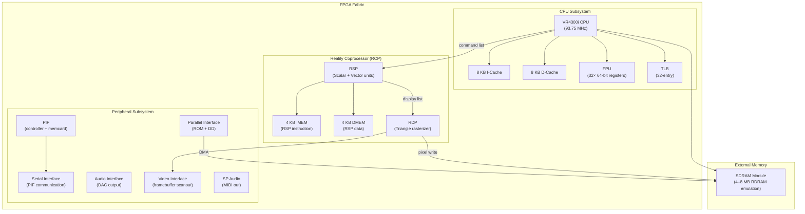

[← FPGA Cores Catalog](README.md) · [↑ Knowledge Base](../README.md)

# N64: Nintendo 64

The N64 core for MiSTer is a from-scratch FPGA implementation by Robert Peip (FPGAzumSpass). It recreates the MIPS VR4300 CPU, the Reality Coprocessor (RCP) with its RSP (Signal Processor) and RDP (Display Processor) subunits, and the 4–8 MB RDRAM subsystem. It is the most computationally demanding MiSTer core and requires SDRAM.

Sources:
* [`MiSTer-devel/N64_MiSTer`](https://github.com/MiSTer-devel/N64_MiSTer) — core repository
* Developer: Robert Peip (FPGAzumSpass) — [Patreon](https://www.patreon.com/FPGAzumSpass)

---

## 1. Feature Summary

| Feature | Implementation |
|---|---|
| **CPU** | MIPS VR4300i (64-bit RISC, 93.75 MHz) |
| **RCP** | RSP (vector/SIMD) + RDP (rasterizer) |
| **RAM** | 4 MB RDRAM (32 MB SDRAM-backed), 8 MB expansion |
| **Video** | 320×240 to 640×480, anti-aliasing |
| **PIF** | Peripheral Interface (controller + memory card) |
| **DD** | 64DD disk drive support |
| **ROM formats** | Big-endian, little-endian, byte-swapped (.z64, .n64, .v64) |
| **Save states** | Yes |
| **BIOS** | PIF ROM required |

> [!CAUTION]
> **SDRAM required.** 32 MB SDRAM limits games to 16 MB ROM size. 64 MB SDRAM supports all N64 ROMs including 32 MB and 64 MB titles.

---

## 2. Core Architecture



---

## 3. VR4300i CPU

The VR4300 is a cost-reduced VR4400 implementing the MIPS III ISA subset:

| Feature | Specification |
|---|---|
| **Architecture** | 64-bit MIPS III (subset) |
| **Clock** | 93.75 MHz |
| **Pipeline** | 5-stage |
| **Registers** | 32 × 64-bit GPR, 32 × 64-bit FPR |
| **I-Cache** | 8 KB, 2-way set-associative |
| **D-Cache** | 8 KB, 2-way set-associative |
| **TLB** | 32 entries (maps 4 KB–16 MB pages) |
| **FPU** | Single/double precision IEEE 754 |
| **Bus** | 32-bit external (64-bit internal) |

> [!NOTE]
> The VR4300 uses a 32-bit external bus (vs VR4400's 64-bit), which halves memory bandwidth compared to the full MIPS III implementation. This was a cost reduction for the consumer console.

---

## 4. RCP — Reality Coprocessor

The RCP runs at 62.5 MHz and is the heart of the N64's rendering pipeline. It has two sub-processors:

### 4.1 RSP — Reality Signal Processor

The RSP is a vector processor that executes microcode to transform geometry and set up display lists:

| Feature | Specification |
|---|---|
| **Scalar unit** | MIPS-like ISA (subset of R4000) |
| **Vector unit** | 8-element SIMD (16-bit elements) |
| **Vector registers** | 32 × 128-bit |
| **IMEM** | 4 KB instruction memory |
| **DMEM** | 4 KB data memory |
| **Microcode** | Downloaded by game at boot (Fast3D, F3DEX2, etc.) |

The RSP executes microcode that processes vertex data, lighting, clipping, and triangle setup. Different games use different microcode:

| Microcode | Use Case |
|---|---|
| **Fast3D** | General-purpose 3D (*Super Mario 64*) |
| **F3DEX2** | Extended 3D, more triangles (*Zelda: OoT*, *Banjo-Kazooie*) |
| **S2DEX** | 2D sprite/background engine (*Yoshi's Story*) |
| **NUSqueeze** | Audio processing |
| **Custom** | Some games ship custom microcode |

### 4.2 RDP — Reality Display Processor

The RDP is a fixed-function triangle rasterizer:

| Feature | Specification |
|---|---|
| **Rasterization** | Triangle setup, span interpolation |
| **Texturing** | Bilinear, trilinear (LOD), detail texture |
| **Color combining** | 2-stage pipeline (CC0 + CC1) |
| **Blending** | Alpha blend, fog, dither |
| **Z-buffer** | 16-bit internal, compare modes |
| **Fill rate** | ~1M pixels/sec textured |
| **Framebuffer** | 16-bit RGBA (5-5-5-1) or 8-bit CI |

The RDP reads display list commands from RDRAM, written by the RSP. The display list encodes triangles, textures, render modes, and combiner settings.

---

## 5. Memory Architecture

### 5.1 RDRAM

The N64 uses Rambus DRAM (RDRAM) — a high-serial-bandwidth memory technology:

| Configuration | Size | Notes |
|---|---|---|
| **Standard** | 4 MB | Base console |
| **Expansion Pak** | 8 MB | Required by some games (*Donkey Kong 64*, *Perfect Dark*, *Zelda: Majora's Mask*) |

On MiSTer, RDRAM is emulated via the SDRAM module. The core maps N64 RDRAM addresses into the SDRAM address space.

### 5.2 Memory Map

```
0x0000_0000 – 0x03EF_FFFF  RDRAM (4 MB or 8 MB)
0x0400_0000 – 0x040F_FFFF  RSP DMEM/IMEM + RDP
0x0410_0000 – 0x041F_FFFF  RSP registers
0x0430_0000 – 0x043F_FFFF  RDP command buffer
0x0450_0000 – 0x045F_FFFF  VI / AI / PI / RI / SI registers
0x0460_0000 – 0x046F_FFFF  PIF
0x1000_0000 – 0x1FBF_FFFF  Cartridge ROM (PI bus)
0x1FC0_0000 – 0x1FC0_07BF  PIF Boot ROM
```

---

## 6. Video Output

| Property | Value |
|---|---|
| **Resolutions** | 320×240, 640×240, 320×480, 640×480 |
| **Color depth** | 16-bit RGBA (default), 32-bit RGBA (rare) |
| **Anti-aliasing** | Hardware AA (edge anti-alias + coverage) |
| **Deinterlacing** | 480i support with bob/weave options |
| **VI filters** | Gamma, dither, divot filter |

The Video Interface (VI) reads the framebuffer from RDRAM and outputs scanlines. The N64's hardware anti-aliasing uses a coverage-based approach where edge pixels store sub-pixel coverage information.

---

## 7. Error Diagnostics

The core displays hex-encoded error overlays when unimplemented features are encountered:

| Error Bit | Meaning |
|---|---|
| 0 | Memory access to unmapped area |
| 1 | CPU instruction not implemented (cache command) |
| 2 | CPU stall timeout |
| 3 | DDR3 timeout |
| 4 | FPU internal exception |
| 5 | PI (cartridge) error |
| 6 | Critical exception |
| 8 | RSP instruction not implemented |
| 10 | RDP command not implemented |
| 11–12 | RDP combine mode not implemented |
| 14 | Texture mode not implemented |
| 15 | Render mode (2-pass or copy) not implemented |
| 24 | VI line processing timeout |

---

## 8. SDRAM Requirements

| SDRAM Size | ROM Support |
|---|---|
| 32 MB | Games up to 16 MB ROM |
| 64 MB | All games including 32 MB and 64 MB ROMs |
| 128 MB | All games (future-proof) |

---

## 9. Cross-References

| Topic | Article |
|---|---|
| PSX core | [PSX](psx.md) |
| SNES core | [SNES](snes.md) |
| Save state architecture | [Save State Architecture](../13_save_states/save_state_architecture.md) |
| SNAC direct controller wiring | [SNAC & LLAPI](../10_input_devices/snac_llapi.md) |
| DDR3 architecture | [DDR3 Architecture](../06_fpga_subsystem/ddr3_architecture.md) |
| SDRAM controller | [SDRAM Controller](../06_fpga_subsystem/sdram_controller.md) |
| Core template walkthrough | [Template Walkthrough](../07_fpga_cores_architecture/template_walkthrough.md) |
