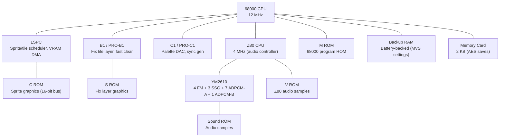

[← Core Catalog](README.md) · [↑ Knowledge Base](../README.md)

# Neo Geo (MVS / AES / CD)

> The king of arcade hardware in a home console. SNK's Neo Geo used massive ROM cartridges (up to 330 Mbits) with a dual-CPU architecture that remained competitive for over a decade. The MiSTer core by Furrtek supports MVS, AES, and CD variants.

Sources: [`NeoGeo_MiSTer`](https://github.com/MiSTer-devel/NeoGeo_MiSTer) · FPGA implementation by Furrtek

---

## Architecture Overview

---

## Hardware Specifications

| Component | Detail |
|---|---|
| **Main CPU** | Motorola 68000 @ 12 MHz |
| **Audio CPU** | Z80A @ 4 MHz |
| **Graphics** | LSPC (sprite engine) + B1 (fix layer) + C1 (palette DAC) |
| **Max sprites** | 384 per frame (96 per scanline), 33,280 pixels max |
| **Sprite sizes** | 1×1 to 33 tiles per sprite, 16×16 pixel tiles |
| **Fix layer** | 40×32 character layer (scores, HUD) |
| **Colors** | 65,536 total — 4,096 on screen (16 palettes × 16 colors) |
| **Audio** | YM2610: 4 FM + 3 SSG + 7 ADPCM-A + 1 ADPCM-B |
| **Cartridge** | Up to 330 Mbit (42 MB) — no bank switching |
| **Memory card** | 2 KB save data (AES) |
| **Backup RAM** | Battery-backed 8 KB (MVS settings) |
| **Display** | 320×224 (NTSC) / 320×256 (PAL) @ 59.18 Hz |

---

## ROM Organization

Neo Geo cartridges contain up to 5 separate ROM chips:

| ROM | Label | Content |
|---|---|---|
| **P ROM** | `M` | 68000 program code |
| **C ROM** | `C` | Sprite/character graphics (16-bit interleaved) |
| **S ROM** | `S` | Fix layer character graphics |
| **M ROM** | `V` | Z80 audio driver + ADPCM-B samples |
| **V ROM** | `V` | YM2610 ADPCM-A sound samples |

---

## MiSTer Core Features

Source: [`NeoGeo_MiSTer` README](https://github.com/MiSTer-devel/NeoGeo_MiSTer)

### ROM Format Support

| Format | Notes |
|---|---|
| **Darksoft ROM set** | Recommended — XML provided, decrypted |
| **`.neo` format** | Converted from Darksoft or MAME sets |
| **MAME decrypted** | Requires custom XML — many MAME ROMs are encrypted |
| **GOG.com** | XML provided, includes required BIOS files |

> [!WARNING]
> This core does **not** support encrypted ROMs. MAME ROM packs include many encrypted ROMs — use the Darksoft set or a decryption tool.

### System Variants

| Variant | BIOS File | Notes |
|---|---|---|
| **MVS** (arcade) | `sp-s2.sp1` | Arcade settings, coin slots |
| **AES** (console) | `neo-epo.sp1` | Home console mode |
| **Universe BIOS** | `uni-bios.rom` | Recommended — cheat codes, region switch |
| **CD / CDZ** | `top-sp1.bin` / `neocd.bin` | CD-ROM loading, separate BIOS |

### SDRAM Requirements

Neo Geo ROMs are very large. SDRAM module size determines which games load:

| SDRAM Size | Library Coverage |
|---|---|
| 32 MB | ~84% of library |
| 64 MB | ~96% of library |
| 128 MB | All games (including the 8 largest) |

The `romsets.xml` file organizes games by size — check it to determine which module you need.

### Additional Features

| Feature | Detail |
|---|---|
| **Memory card saves** | AES-mode game saves |
| **Backup RAM** | MVS settings (battery-backed emulation) |
| **CD system** | Full Neo Geo CD / CDZ support |

---

## Cross-References

| Topic | Article |
|---|---|
| SDRAM module requirements | [Addon Boards](../02_hardware_platforms/addon_boards.md) |
| Arcade core architecture | [Arcade & MRA](arcade_and_mra.md) |
| 68000 CPU family | [Genesis](genesis.md), [Minimig](minimig.md), [Atari ST](atari_st.md) |
| SNAC controller wiring | [SNAC & LLAPI](../10_input_devices/snac_llapi.md) |
| Cheat engine | [Cheats](../14_extensions/cheats.md) |
