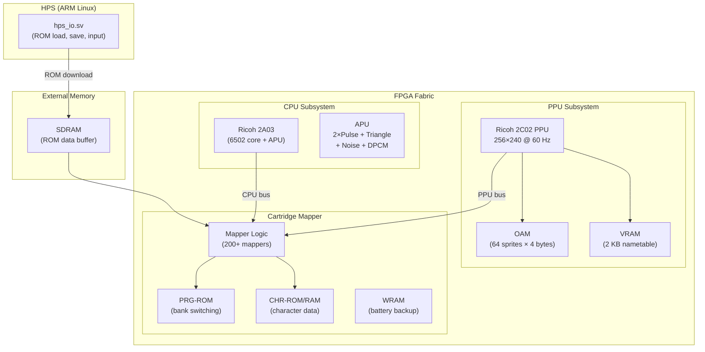

[← FPGA Cores Catalog](README.md) · [↑ Knowledge Base](../README.md)

# NES: Nintendo Entertainment System / Famicom

The NES core for MiSTer is an FPGA implementation of the Nintendo Entertainment System and Famicom, based on the FPGANES project by Ludvig Strigeus and significantly extended for the MiSTer platform. It covers the 6502-derived Ricoh 2A03 CPU with integrated APU, the Ricoh 2C02 PPU, and a large mapper library covering the vast majority of the licensed cartridge catalogue.

Sources:
* [`MiSTer-devel/NES_MiSTer`](https://github.com/MiSTer-devel/NES_MiSTer) — core repository
* Original: FPGANES by Ludvig Strigeus

---

## 1. Feature Summary

| Feature | Implementation |
|---|---|
| **CPU** | Ricoh 2A03 (6502-derived, ~1.79 MHz NTSC / ~1.66 MHz PAL) |
| **PPU** | Ricoh 2C02 (256×240, 54+24 sprites, 25 colors on screen) |
| **APU** | 5-channel: 2 pulse, 1 triangle, 1 noise, 1 DPCM |
| **System types** | NTSC, PAL, Dendy |
| **Mappers** | 200+ supported (see mapper table below) |
| **ROM formats** | iNES, NES 2.0 (preferred) |
| **FDS** | Famicom Disk System with expansion audio |
| **Save states** | 4 slots, keyboard/gamepad/OSD |
| **Expansion audio** | VRC6, VRC7, MMC5, Namco 163, Sunsoft 5B |
| **Input** | Standard pad, Zapper, Power Pad, Microphone, Miracle Piano |
| **Multitap** | 4-player support |
| **Cheats** | Up to 32 cheat codes |
| **NSF** | NSF player for music files |

---

## 2. Core Architecture



---

## 3. PPU Architecture

The Picture Processing Unit (PPU) is the most complex component. It generates the video signal and handles sprite rendering.

### 3.1 Rendering Pipeline

| Stage | Description |
|---|---|
| **Nametable fetch** | Background tiles fetched from VRAM during visible scanlines |
| **Pattern fetch** | Tile pattern data from CHR-ROM/RAM (8 bytes per tile) |
| **Attribute fetch** | 2-bit palette select per 32×32 pixel block |
| **Sprite evaluation** | OAM scanned for sprites on next scanline (max 8) |
| **Sprite pattern fetch** | 8 sprites × 2 pattern bytes fetched during HBlank |

### 3.2 Video Timing

| Mode | Resolution | Refresh | CPU Clock |
|---|---|---|---|
| NTSC | 256×240 | 60.0988 Hz | 1.789773 MHz |
| PAL | 256×240 | 50.0070 Hz | 1.662607 MHz |
| Dendy | 256×240 | 50.0070 Hz | 1.789773 MHz (NTSC clock, PAL timing) |

> [!NOTE]
> **Dendy mode** is a hybrid popular in Russia/Asia: it uses the NTSC CPU clock speed but PAL frame timing (50 Hz). Many bootleg Famicom clones used this configuration.

### 3.3 Sprite Limit

The NES PPU supports a maximum of **8 sprites per scanline** and **64 sprites total**. When the limit is exceeded, lower-priority sprites flicker. The MiSTer core offers an **Extra Sprites** option that doubles the per-line limit to 16, reducing flicker at the cost of minor compatibility issues in some games (e.g., *Simon's Quest* swamp effect).

---

## 4. APU — Audio Processing Unit

The 2A03 integrates a 5-channel sound generator:

| Channel | Waveform | Features |
|---|---|---|
| **Pulse 1** | Square (25%, 50%, 75%) | Sweep unit, envelope, length counter |
| **Pulse 2** | Square (25%, 50%, 75%) | Envelope, length counter (no sweep) |
| **Triangle** | Triangle | Fixed 50% duty, linear counter |
| **Noise** | Pseudorandom | Long/short mode, envelope |
| **DPCM** | 1-bit delta PCM | 7-bit DAC, direct CPU memory access |

### Expansion Audio

The core also supports cartridge-based expansion audio chips:

| Chip | Mapper | Channels | Sound Type |
|---|---|---|---|
| **VRC6** | Konami (mapper 24/26) | 2 pulse + 1 sawtooth | Additional melodic voices |
| **VRC7** | Konami (mapper 85) | 6 FM channels | OPLL-compatible FM synthesis |
| **MMC5** | Nintendo (mapper 5) | 2 pulse + 1 PCM | Enhanced square waves |
| **Namco 163** | Namco (mapper 19) | Up to 8 wavetable channels | Programmable waveforms |
| **Sunsoft 5B** | Sunsoft (mapper 69) | 3 square + noise | AY-3-8910 compatible |

---

## 5. Mapper Support

The NES cartridge mapper system is the primary challenge for any NES implementation. Over 200 mappers are supported:

### Key Mapper Families

| Mapper # | Chip | Notable Games | Features |
|---|---|---|---|
| 0 | NROM | *Super Mario Bros.*, *Donkey Kong* | No bank switching, 32K PRG / 8K CHR |
| 1 | MMC1 | *Legend of Zelda*, *Metroid* | 16K PRG + 8K CHR bank switching, WRAM |
| 2 | UxROM | *Castlevania*, *Mega Man* | PRG bank switching only |
| 3 | CNROM | *Cybernoid* | CHR bank switching only |
| 4 | MMC3 | *Super Mario Bros. 3*, *Mega Man 3–6* | Scanline IRQ, 8K+8K PRG, 1K CHR banking |
| 5 | MMC5 | *Castlevania III*, *Legend of Zelda 2* | EXRAM, split screen, expansion audio, 8K WRAM |
| 7 | AxROM | *Metroid*, *Kid Icarus* | Single 32K PRG bank, mirroring control |
| 9 | MMC2 | *Punch-Out!!* | 4-screen mirroring, CHR ROM switching |
| 10 | MMC4 | *Fire Emblem* | Similar to MMC2 with different CHR scheme |
| 85 | VRC7 | *Lagrange Point* | FM synthesis audio |
| FDS | — | *Doki Doki Panic*, *Metroid (JP)* | Famicom Disk System, disk side swapping |

> [!NOTE]
> ROMs with **NES 2.0 headers** are preferred — they provide accurate mapper, mirroring, and peripheral information that iNES headers may guess incorrectly.

---

## 6. Famicom Disk System

The core supports Famicom Disk System (FDS) images (`.fds`):

- Requires the FDS BIOS (`boot0.rom`)
- Automatic or manual disk side swapping
- FDS expansion audio supported
- Save data stored as `.sav` files alongside the disk image

---

## 7. Input Devices

| Device | Mapping | Notes |
|---|---|---|
| Standard pad | D-pad + A/B/Start/Select | 2/4 player support via multitap |
| Zapper (Mouse) | Mouse aim + left click | Relative mouse motion |
| Zapper (Joy) | Analog stick aim + trigger | Compatible with Aimtrak |
| Power Pad | Mapped to controller buttons | Floor mat controller |
| Miracle Piano | MIDI via SNAC or UART | Requires NES 2.0 header (controller type 0x19) |

---

## 8. Memory Map

```
$0000–$07FF  WRAM (2 KB)
$0800–$1FFF  WRAM mirror
$2000–$3FFF  PPU registers ($2000–$2007 repeated)
$4000–$4013  APU registers
$4014         OAM DMA
$4015         APU control
$4016–$4017   Controller ports
$4018–$401F   APU/IO test mode
$4020–$FFFF   Cartridge space (mapper-dependent)
```

---

## 9. Cross-References

| Topic | Article |
|---|---|
| Arcade cores & MRA format | [Arcade Cores & MRA](arcade_and_mra.md) |
| Minimig (Amiga) core | [Minimig](minimig.md) |
| Save state architecture | [Save State Architecture](../13_save_states/save_state_architecture.md) |
| Cheat engine | [Cheat Engine](../14_extensions/cheats.md) |
| SNAC direct controller wiring | [SNAC & LLAPI](../10_input_devices/snac_llapi.md) |
| UIO command reference | [UIO Commands](../17_references/uio_command_reference.md) |
| Core template walkthrough | [Template Walkthrough](../07_fpga_cores_architecture/template_walkthrough.md) |
